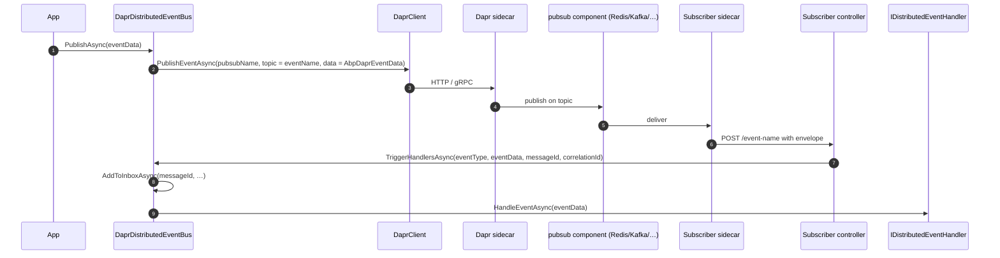

`Volo.Abp.EventBus.Dapr` adapts the ABP Framework distributed event bus
to the [Dapr](https://dapr.io) pub/sub building block. The provider
delegates wire transport to whatever Dapr `pubsub` component is
configured in the sidecar — Redis Streams, Kafka, NATS, RabbitMQ, etc.
The integration code is in
`framework/src/Volo.Abp.EventBus.Dapr/Volo/Abp/EventBus/Dapr/`.

## Module composition

```csharp
// AbpEventBusDaprModule.cs
[DependsOn(
    typeof(AbpEventBusModule),
    typeof(AbpDaprModule))]
public class AbpEventBusDaprModule : AbpModule
{
    public override void OnApplicationInitialization(ApplicationInitializationContext context)
    {
        context.ServiceProvider
            .GetRequiredService<DaprDistributedEventBus>()
            .Initialize();
    }
}
```

`AbpDaprModule` (in `framework/src/Volo.Abp.Dapr/`) provides
`IAbpDaprClientFactory` for building `DaprClient` instances against the
local sidecar, `IDaprApiTokenProvider` for the API token header, and
`IDaprSerializer` (`Utf8JsonDaprSerializer`) for payload encoding.

For receiving messages over HTTP, host the
`Volo.Abp.AspNetCore.Mvc.Dapr.EventBus` package alongside this one — it
exposes the `[Topic]`-style controller endpoints Dapr's sidecar calls
into.

## Configuration

```csharp
// AbpDaprEventBusOptions.cs
public class AbpDaprEventBusOptions
{
    public string PubSubName { get; set; }

    public AbpDaprEventBusOptions()
    {
        PubSubName = "pubsub";
    }
}
```

| Field | Meaning |
| --- | --- |
| `PubSubName` | Name of the Dapr pub/sub component (defined in `pubsub.yaml` under the Dapr components folder). Defaults to `"pubsub"`. |

Configure it from code:

```csharp
Configure<AbpDaprEventBusOptions>(o =>
{
    o.PubSubName = "shop-pubsub";
});
```

There is no broker-level connection setup in ABP — the sidecar owns the
component definition. The Dapr `DaprClient` configuration (gRPC port,
HTTP port, API token) is bound from `AbpDaprOptions` in the dependency
module.

## `DaprDistributedEventBus`

```csharp
// DaprDistributedEventBus.cs
[Dependency(ReplaceServices = true)]
[ExposeServices(typeof(IDistributedEventBus), typeof(DaprDistributedEventBus))]
public class DaprDistributedEventBus : DistributedEventBusBase, ISingletonDependency
{
    protected IDaprSerializer Serializer { get; }
    protected AbpDaprEventBusOptions DaprEventBusOptions { get; }
    protected IAbpDaprClientFactory DaprClientFactory { get; }
}
```

### Initialization

```csharp
public void Initialize()
{
    SubscribeHandlers(AbpDistributedEventBusOptions.Handlers);
}
```

Unlike the other providers, no broker resources are created on startup.
Dapr subscriptions are declared either by registering ASP.NET Core
endpoints (with `Volo.Abp.AspNetCore.Mvc.Dapr.EventBus`) or by
declarative subscription YAML — neither belongs to the event bus
package.

### Limitations

Two restrictions are encoded as `AbpException`s at runtime:

```csharp
public override IDisposable Subscribe(string eventName, IEventHandlerFactory handler)
{
    throw new AbpException(
        "Dapr distributed event bus does not support dynamic event subscriptions. " +
        "Dapr requires topic subscriptions to be declared at startup and cannot add subscriptions at runtime. " +
        "Use a typed event handler (IDistributedEventHandler<T>) instead.");
}

public override Task PublishAsync(string eventName, object eventData, bool onUnitOfWorkComplete = true)
{
    var eventType = EventTypes.GetOrDefault(eventName);
    if (eventType != null)
    {
        return PublishAsync(eventType, ...);
    }

    throw new AbpException(
        "Dapr distributed event bus does not support dynamic event publishing. " +
        "Dapr requires topic subscriptions to be declared at startup. " +
        "Use a typed event (PublishAsync<TEvent>) or ensure the event name matches a registered typed event.");
}
```

<Warning>
  Always publish through the typed APIs (`PublishAsync<TEvent>` or
  `PublishAsync(Type, …)`) when using Dapr. Dynamic string-name
  publishes work only if the event name has previously been mapped to a
  CLR type in `EventTypes` — which happens automatically when at least
  one handler subscribes to the typed event.
</Warning>

## Publish path

```csharp
protected async override Task PublishToEventBusAsync(Type eventType, object eventData)
{
    var (eventName, resolvedData) = ResolveEventForPublishing(eventType, eventData);
    await PublishToDaprAsync(eventName, resolvedData, null, CorrelationIdProvider.Get());
}

protected virtual async Task PublishToDaprAsync(
    string eventName, object eventData,
    Guid? messageId = null, string? correlationId = null)
{
    var client = await DaprClientFactory.CreateAsync();
    var data = new AbpDaprEventData(
        DaprEventBusOptions.PubSubName,
        eventName,
        (messageId ?? GuidGenerator.Create()).ToString("N"),
        Serializer.SerializeToString(eventData),
        correlationId);

    await client.PublishEventAsync(
        pubsubName: DaprEventBusOptions.PubSubName,
        topicName: eventName,
        data: data);
}
```

The wire envelope is `AbpDaprEventData`:

```csharp
public class AbpDaprEventData
{
    public string PubSubName { get; set; }
    public string Topic { get; set; }
    public string MessageId { get; set; }
    public string JsonData { get; set; }
    public string? CorrelationId { get; set; }
}
```

Two things to note:

- The Dapr **topic** is the ABP **event name** — there is no shared
  topic. Each event type lives on its own pub/sub topic, and the
  subscriber registers one Dapr subscription per event.
- The payload is a serialized envelope, not the raw event bytes. This
  preserves the `MessageId` and `CorrelationId` even when the
  underlying broker (Redis Streams, Kafka, …) doesn't expose
  ABP-friendly metadata fields.

### Outbox publish

```csharp
public async override Task PublishFromOutboxAsync(
    OutgoingEventInfo outgoingEvent, OutboxConfig outboxConfig)
{
    var eventType = EventTypes.GetOrDefault(outgoingEvent.EventName);
    if (eventType == null) return;

    var eventData = Serializer.Deserialize(outgoingEvent.EventData, eventType);
    await PublishToDaprAsync(
        outgoingEvent.EventName, eventData,
        outgoingEvent.Id, outgoingEvent.GetCorrelationId());

    using (CorrelationIdProvider.Change(outgoingEvent.GetCorrelationId()))
    {
        await TriggerDistributedEventSentAsync(new DistributedEventSent
        {
            Source = DistributedEventSource.Outbox,
            EventName = outgoingEvent.EventName,
            EventData = outgoingEvent.EventData,
        });
    }
}
```

Notice the outbox path **deserializes** the persisted bytes back into a
CLR object before publishing. That is because Dapr serializes the
envelope itself — feeding raw bytes would result in double encoding.

`PublishManyFromOutboxAsync` simply loops:

```csharp
public async override Task PublishManyFromOutboxAsync(
    IEnumerable<OutgoingEventInfo> outgoingEvents, OutboxConfig outboxConfig)
{
    foreach (var outgoingEvent in outgoingEvents)
    {
        await PublishFromOutboxAsync(outgoingEvent, outboxConfig);
    }
}
```

There is no batch primitive in the Dapr pub/sub API, so per-message
publish is the only option.

## Receive path

`TriggerHandlersAsync` is the entry point invoked by the ASP.NET Core
endpoint controller in `Volo.Abp.AspNetCore.Mvc.Dapr.EventBus`:

```csharp
public virtual async Task TriggerHandlersAsync(
    Type eventType, object eventData,
    string? messageId = null, string? correlationId = null)
{
    if (await AddToInboxAsync(messageId, GetEventName(eventType, eventData),
            eventType, eventData, correlationId))
    {
        return;
    }
    ...
}
```

The HTTP controller receives the JSON envelope, deserializes it through
`IDaprSerializer`, looks up the event type via `EventTypes`, and then
delegates to `TriggerHandlersAsync`. The handler list comes from
`AbpDistributedEventBusOptions.Handlers`, populated by the conventional
DI scan.

## End-to-end flow



## Type registration

Because subscriptions are declared at startup, the bus needs to know the
CLR type for each event name **before** a message arrives. Two places
register types into the `EventTypes` map:

```csharp
private List<IEventHandlerFactory> GetOrCreateHandlerFactories(Type eventType)
{
    return HandlerFactories.GetOrAdd(eventType, type =>
    {
        var eventName = EventNameAttribute.GetNameOrDefault(type);
        EventTypes.GetOrAdd(eventName, eventType);
        return new List<IEventHandlerFactory>();
    });
}

protected override Task OnAddToOutboxAsync(string eventName, Type eventType, object eventData)
{
    EventTypes.GetOrAdd(eventName, eventType);
    return base.OnAddToOutboxAsync(eventName, eventType, eventData);
}
```

So a typed event becomes known either when a handler subscribes to it,
or when the publisher first writes it to the outbox.

## Pairing with the outbox

```csharp
Configure<AbpDistributedEventBusOptions>(o =>
{
    o.Outboxes.Configure("Default", c => c.UseDbContext<OrdersDbContext>());
    o.Inboxes.Configure("Default", c => c.UseDbContext<OrdersDbContext>());
});

Configure<AbpDaprEventBusOptions>(o =>
{
    o.PubSubName = "shop-pubsub";
});
```

Combined with a Dapr `pubsub.yaml` like:

```yaml
apiVersion: dapr.io/v1alpha1
kind: Component
metadata:
  name: shop-pubsub
spec:
  type: pubsub.redis
  version: v1
  metadata:
    - name: redisHost
      value: localhost:6379
```

…this turns ABP's outbox into a transactional bridge to whichever
broker the sidecar happens to use. Swapping Redis for Kafka means
editing one YAML file, not the ABP host.

<Tip>
  `AbpDaprEventData` is intentionally portable JSON, so non-ABP
  subscribers can consume the same topic — they just need to read
  `JsonData` and parse it themselves. The ABP-specific metadata
  (`MessageId`, `CorrelationId`) stays optional.
</Tip>
