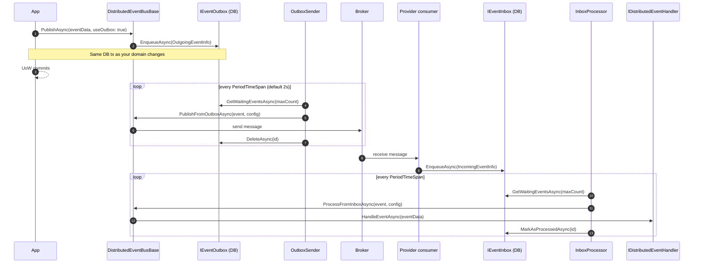

The Distributed Event Bus in ABP Framework is the abstraction every
broker integration extends. It defines how an event becomes a wire
message (`EventName`, payload bytes, correlation id), how the
transactional outbox/inbox pattern is layered on top of any provider,
and how entity events are mapped to event transfer objects (ETOs)
before crossing a process boundary.

All shared code lives in
`framework/src/Volo.Abp.EventBus/Volo/Abp/EventBus/Distributed/` and the
abstractions in
`framework/src/Volo.Abp.EventBus.Abstractions/Volo/Abp/EventBus/Distributed/`.

## `IDistributedEventBus`

The contract widens `IEventBus.PublishAsync` with a `useOutbox` flag:

```csharp
// framework/src/Volo.Abp.EventBus.Abstractions/Volo/Abp/EventBus/Distributed/IDistributedEventBus.cs
public interface IDistributedEventBus : IEventBus
{
    IDisposable Subscribe<TEvent>(IDistributedEventHandler<TEvent> handler)
        where TEvent : class;

    Task PublishAsync<TEvent>(
        TEvent eventData,
        bool onUnitOfWorkComplete = true,
        bool useOutbox = true)
        where TEvent : class;

    Task PublishAsync(
        Type eventType,
        object eventData,
        bool onUnitOfWorkComplete = true,
        bool useOutbox = true);

    IDisposable Subscribe(string eventName,
        IDistributedEventHandler<DynamicEventData> handler);

    Task PublishAsync(string eventName, object eventData,
        bool onUnitOfWorkComplete = true,
        bool useOutbox = true);
}
```

`useOutbox = true` (default) routes the event through the configured
`IEventOutbox` if one exists; otherwise the bus calls
`PublishToEventBusAsync` directly.

## `DistributedEventBusBase`

Every provider inherits from `DistributedEventBusBase`. It composes the
publishing pipeline and leaves only the wire-format details to subclasses:

```csharp
// framework/src/Volo.Abp.EventBus/Volo/Abp/EventBus/Distributed/DistributedEventBusBase.cs
public abstract class DistributedEventBusBase
    : EventBusBase, IDistributedEventBus, ISupportsEventBoxes
{
    protected IGuidGenerator GuidGenerator { get; }
    protected IClock Clock { get; }
    protected AbpDistributedEventBusOptions AbpDistributedEventBusOptions { get; }
    protected ILocalEventBus LocalEventBus { get; }
    protected ICorrelationIdProvider CorrelationIdProvider { get; }

    public abstract Task PublishFromOutboxAsync(
        OutgoingEventInfo outgoingEvent, OutboxConfig outboxConfig);

    public abstract Task PublishManyFromOutboxAsync(
        IEnumerable<OutgoingEventInfo> outgoingEvents, OutboxConfig outboxConfig);

    public abstract Task ProcessFromInboxAsync(
        IncomingEventInfo incomingEvent, InboxConfig inboxConfig);
}
```

### Publish path

```csharp
public virtual async Task PublishAsync(
    Type eventType, object eventData,
    bool onUnitOfWorkComplete = true,
    bool useOutbox = true)
{
    if (onUnitOfWorkComplete && UnitOfWorkManager.Current != null)
    {
        AddToUnitOfWork(UnitOfWorkManager.Current,
            new UnitOfWorkEventRecord(eventType, eventData,
                EventOrderGenerator.GetNext(), useOutbox));
        return;
    }

    if (useOutbox)
    {
        if (await AddToOutboxAsync(eventType, eventData))
            return;
    }

    await PublishToEventBusAsync(eventType, eventData);

    await TriggerDistributedEventSentAsync(new DistributedEventSent
    {
        Source = DistributedEventSource.Direct,
        EventName = GetEventName(eventType, eventData),
        EventData = GetEventData(eventData)
    });
}
```

Three branches matter:

1. **Inside a unit of work, `onUnitOfWorkComplete = true`** — the event is
   staged on the UoW (`AddToUnitOfWork` → `IUnitOfWork.AddOrReplaceDistributedEvent`)
   and replayed by `UnitOfWorkEventPublisher` after the UoW commits.
2. **Outbox configured** — `AddToOutboxAsync` finds a matching
   `OutboxConfig`, serializes the payload to bytes, and enqueues an
   `OutgoingEventInfo`. The broker is never touched on this code path.
3. **Direct publish** — the provider's `PublishToEventBusAsync` writes to
   the broker immediately, then `LocalEventBus` emits a
   `DistributedEventSent` local event so observability code can react.

### Default implementation: `LocalDistributedEventBus`

When no broker package is referenced, ABP registers
`LocalDistributedEventBus` (note: `[Dependency(TryRegister = true)]`) so
calls to `IDistributedEventBus.PublishAsync` resolve and just forward to
the in-process local bus:

```csharp
// framework/src/Volo.Abp.EventBus/Volo/Abp/EventBus/Distributed/LocalDistributedEventBus.cs
[Dependency(TryRegister = true)]
[ExposeServices(typeof(IDistributedEventBus), typeof(LocalDistributedEventBus))]
public class LocalDistributedEventBus : DistributedEventBusBase, ISingletonDependency
{
    public override IDisposable Subscribe(string eventName, IEventHandlerFactory handler)
    {
        DynamicEventNames.GetOrAdd(eventName, true);
        return LocalEventBus.Subscribe(eventName, handler);
    }
}
```

Broker providers replace it via `[Dependency(ReplaceServices = true)]` —
referencing a single broker module is enough to opt in.

## Outbox configuration

`AbpDistributedEventBusOptions` holds the outbox/inbox dictionaries:

```csharp
// framework/src/Volo.Abp.EventBus/Volo/Abp/EventBus/Distributed/AbpDistributedEventBusOptions.cs
public class AbpDistributedEventBusOptions
{
    public ITypeList<IEventHandler> Handlers { get; }
    public OutboxConfigDictionary Outboxes { get; }
    public InboxConfigDictionary Inboxes { get; }
}
```

Each `OutboxConfig` ties a name to a database and an `IEventOutbox`
implementation type (typically the EF Core or MongoDB outbox table
class):

```csharp
// framework/src/Volo.Abp.EventBus.Abstractions/Volo/Abp/EventBus/Distributed/OutboxConfig.cs
public class OutboxConfig
{
    public string Name { get; }
    public string DatabaseName { get; set; }
    public Type ImplementationType { get; set; }
    public Func<Type, bool>? Selector { get; set; }
    public bool IsSendingEnabled { get; set; } = true;
}

public class OutboxConfigDictionary : Dictionary<string, OutboxConfig>
{
    public void Configure(Action<OutboxConfig> configAction)
        => Configure("Default", configAction);

    public void Configure(string outboxName, Action<OutboxConfig> configAction)
    {
        var outboxConfig = this.GetOrAdd(outboxName, () => new OutboxConfig(outboxName));
        configAction(outboxConfig);
    }
}
```

Inbox configuration mirrors the outbox shape:

```csharp
public class InboxConfig
{
    public string Name { get; }
    public string DatabaseName { get; set; }
    public Type ImplementationType { get; set; }
    public Func<Type, bool>? EventSelector { get; set; }
    public Func<Type, bool>? HandlerSelector { get; set; }
    public bool IsProcessingEnabled { get; set; } = true;
}
```

A typical registration looks like:

```csharp
Configure<AbpDistributedEventBusOptions>(o =>
{
    o.Outboxes.Configure("Default", c =>
    {
        c.UseDbContext<OrdersDbContext>();
    });

    o.Inboxes.Configure("Default", c =>
    {
        c.UseDbContext<OrdersDbContext>();
    });
});
```

The `UseDbContext` extension (in
`Volo.Abp.EntityFrameworkCore.Distributed.EventBus`) sets
`DatabaseName` to the DbContext's connection name and `ImplementationType`
to the EF Core outbox/inbox implementation.

## Outbox/inbox storage

The wire shape of stored events is intentionally minimal:

```csharp
// framework/src/Volo.Abp.EventBus.Abstractions/Volo/Abp/EventBus/Distributed/OutgoingEventInfo.cs
public class OutgoingEventInfo : IOutgoingEventInfo
{
    public Guid Id { get; }
    public string EventName { get; }
    public byte[] EventData { get; }
    public DateTime CreationTime { get; }
    public ExtraPropertyDictionary ExtraProperties { get; protected set; }

    public void SetCorrelationId(string correlationId)
        => ExtraProperties[EventBusConsts.CorrelationIdHeaderName] = correlationId;
}
```

`IncomingEventInfo` adds a `MessageId`, `RetryCount`, and `NextRetryTime`
to track retries.

The two contracts every storage provider implements:

```csharp
public interface IEventOutbox
{
    Task EnqueueAsync(OutgoingEventInfo outgoingEvent);
    Task<List<OutgoingEventInfo>> GetWaitingEventsAsync(int maxCount,
        Expression<Func<IOutgoingEventInfo, bool>>? filter = null,
        CancellationToken cancellationToken = default);
    Task DeleteAsync(Guid id);
    Task DeleteManyAsync(IEnumerable<Guid> ids);
}

public interface IEventInbox
{
    Task EnqueueAsync(IncomingEventInfo incomingEvent);
    Task<List<IncomingEventInfo>> GetWaitingEventsAsync(int maxCount,
        Expression<Func<IIncomingEventInfo, bool>>? filter = null,
        CancellationToken cancellationToken = default);
    Task MarkAsProcessedAsync(Guid id);
    Task RetryLaterAsync(Guid id, int retryCount, DateTime? nextRetryTime);
    Task MarkAsDiscardAsync(Guid id);
    Task<bool> ExistsByMessageIdAsync(string messageId);
    Task DeleteOldEventsAsync();
}
```

## End-to-end outbox/inbox flow



### Background workers

`AbpEventBusModule.OnApplicationInitializationAsync` registers
`OutboxSenderManager` and `InboxProcessManager` as `IBackgroundWorker`s.
Each manager loops the dictionary entries that have processing enabled
and creates one worker per configuration:

```csharp
// framework/src/Volo.Abp.EventBus/Volo/Abp/EventBus/Distributed/OutboxSenderManager.cs
foreach (var outboxConfig in Options.Outboxes.Values)
{
    if (outboxConfig.IsSendingEnabled)
    {
        var sender = ServiceProvider.GetRequiredService<IOutboxSender>();
        await sender.StartAsync(outboxConfig, cancellationToken);
        Senders.Add(sender);
    }
}
```

The default `OutboxSender` and `InboxProcessor` (both in the same folder)
use:

- `AbpAsyncTimer` to tick on `AbpEventBusBoxesOptions.PeriodTimeSpan`
  (default 2 seconds).
- `IAbpDistributedLock` to ensure only one node processes a given
  outbox/inbox at a time, waiting up to
  `DistributedLockWaitDuration`.
- `BatchPublishOutboxEvents` to call
  `PublishManyFromOutboxAsync` when the provider supports batching.
- `InboxProcessorFailurePolicy` (`Retry` or `RetryLater`) plus
  `InboxProcessorMaxRetryCount` and
  `InboxProcessorRetryBackoffFactor` to control failure handling.

### Inbox deduplication

Before delivering, the provider asks the inbox `ExistsByMessageIdAsync`
to ignore duplicates that the broker may redeliver. Each provider's
consumer extracts the broker-native message id (RabbitMQ `MessageId`,
Kafka header, ASB `MessageId`) and passes it to
`DistributedEventBusBase.AddToInboxAsync`.

## ETO mapping

Entities should never be serialized directly across the wire — they
typically carry runtime state and cross-context references. The DDD
layer therefore lets you declare an Event Transfer Object (ETO) per
entity:

```csharp
// framework/src/Volo.Abp.Ddd.Domain.Shared/Volo/Abp/Domain/Entities/Events/Distributed/AbpDistributedEntityEventOptions.cs
public class AbpDistributedEntityEventOptions
{
    public IAutoEntityDistributedEventSelectorList AutoEventSelectors { get; }
    public IAutoEntityDistributedEventSelectorList IgnoredEventSelectors { get; }
    public EtoMappingDictionary EtoMappings { get; set; }
}

// EtoMappingDictionary.cs
public class EtoMappingDictionary : Dictionary<Type, EtoMappingDictionaryItem>
{
    public void Add<TEntity, TEntityEto>(Type? objectMappingContextType = null)
        => this[typeof(TEntity)] =
            new EtoMappingDictionaryItem(typeof(TEntityEto), objectMappingContextType);
}
```

Configure once in your module:

```csharp
Configure<AbpDistributedEntityEventOptions>(o =>
{
    o.AutoEventSelectors.Add<Order>();
    o.EtoMappings.Add<Order, OrderEto>();
});
```

`EntityChangeEventHelper` then uses `IEntityToEtoMapper.Map(entity)` to
produce the ETO and publish `EntityCreatedEto<OrderEto>` /
`EntityUpdatedEto<OrderEto>` / `EntityDeletedEto<OrderEto>` on the
distributed bus.

`EtoBase` (in `Volo.Abp.EventBus.Abstractions`) is the recommended base
class for ETOs — it carries an
`ExtraPropertyDictionary` and integrates with ABP's tenant and
correlation id headers.

## Observability events

Every distributed publish raises two local events that you can subscribe
to with `ILocalEventHandler<DistributedEventSent>` /
`ILocalEventHandler<DistributedEventReceived>`:

```csharp
// framework/src/Volo.Abp.EventBus.Abstractions/Volo/Abp/EventBus/Distributed/DistributedEventSent.cs
public class DistributedEventSent
{
    public DistributedEventSource Source { get; set; }
    public string EventName { get; set; }
    public object EventData { get; set; }
}
```

`DistributedEventSource` distinguishes `Direct` publishes from
`Outbox`-sourced ones, so a tracer can log only one of them.

## Failure handling

`AbpEventBusBoxesOptions.InboxProcessorFailurePolicy` selects how the
inbox reacts to a handler exception:

| Policy | Behaviour |
| --- | --- |
| `Retry` (default) | Keep redelivering through the same processor until success. |
| `RetryLater` | Schedule `RetryLaterAsync(id, retryCount, nextRetryTime)` with an exponential backoff: `delay = InboxProcessorRetryBackoffFactor × 2^retryCount`. |

After `InboxProcessorMaxRetryCount` failures, the inbox calls
`MarkAsDiscardAsync(id)` and the message is moved out of the active
queue.

<Warning>
  Outbox/inbox enablement is per-configuration. If you set
  `IsSendingEnabled = false` on an `OutboxConfig`, the sender worker will
  skip that entry — useful for read-only replicas or for pausing during
  maintenance.
</Warning>

## Where storage providers live

| Storage | Implements | Project |
| --- | --- | --- |
| EF Core | `EfCoreEventOutbox`, `EfCoreEventInbox` | `framework/src/Volo.Abp.EntityFrameworkCore/Volo/Abp/Domain/Repositories/EntityFrameworkCore/Distributed/` |
| MongoDB | `MongoDbEventOutbox`, `MongoDbEventInbox` | `framework/src/Volo.Abp.MongoDB/Volo/Abp/Domain/Repositories/MongoDB/Distributed/` |

These projects also expose `UseDbContext<TDbContext>()` /
`UseMongoDbContext<TMongoDbContext>()` helpers on
`OutboxConfig` / `InboxConfig`.

## Next: pick a provider

The base class is now in place — every provider page below shows the
broker-specific composition, configuration section, and consumer wiring:

<CardGroup cols={2}>
  <Card title="RabbitMQ" icon="rabbit" href="/events/rabbitmq" />
  <Card title="Kafka" icon="bolt" href="/events/kafka" />
  <Card title="Azure Service Bus" icon="cloud" href="/events/azure-service-bus" />
  <Card title="Dapr" icon="cube" href="/events/dapr-event-bus" />
  <Card title="Rebus" icon="recycle" href="/events/rebus" />
</CardGroup>
