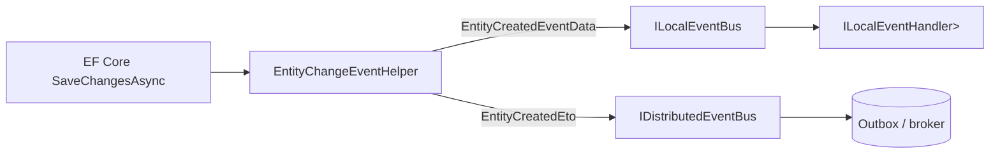

The Local Event Bus is the ABP Framework primitive for in-process
publish/subscribe. It is a singleton, it dispatches handlers inside the
publisher's own host, and it is what the rest of the framework relies on
for things like entity change notifications, audit log writes, and cache
invalidation hints. The implementation lives in
`framework/src/Volo.Abp.EventBus/Volo/Abp/EventBus/Local/`.

## Interfaces

`ILocalEventBus` extends `IEventBus` with a small, typed extension that
accepts `ILocalEventHandler<TEvent>` directly and exposes the internal
factory lookup that `LocalEventBus` uses:

```csharp
// framework/src/Volo.Abp.EventBus.Abstractions/Volo/Abp/EventBus/Local/ILocalEventBus.cs
public interface ILocalEventBus : IEventBus
{
    IDisposable Subscribe<TEvent>(ILocalEventHandler<TEvent> handler)
        where TEvent : class;

    List<EventTypeWithEventHandlerFactories> GetEventHandlerFactories(Type eventType);

    List<EventTypeWithEventHandlerFactories> GetDynamicEventHandlerFactories(string eventName);
}
```

`ILocalEventHandler<TEvent>` is the marker every in-process handler
implements:

```csharp
public interface ILocalEventHandler<in TEvent> : IEventHandler
{
    Task HandleEventAsync(TEvent eventData);
}
```

Both `ILocalEventHandler<>` and `IDistributedEventHandler<>` can live on
the same class, but only one of them is invoked per publish path. The
local bus only triggers `ILocalEventHandler<>` implementations.

## `LocalEventBus`

`LocalEventBus` is registered as a singleton and exposes itself as
`ILocalEventBus` via `[ExposeServices]`:

```csharp
// framework/src/Volo.Abp.EventBus/Volo/Abp/EventBus/Local/LocalEventBus.cs
[ExposeServices(typeof(ILocalEventBus), typeof(LocalEventBus))]
public class LocalEventBus : EventBusBase, ILocalEventBus, ISingletonDependency
{
    protected AbpLocalEventBusOptions Options { get; }
    protected ConcurrentDictionary<Type, List<IEventHandlerFactory>> HandlerFactories { get; }
    protected ConcurrentDictionary<string, Type> EventTypes { get; }
    protected ConcurrentDictionary<string, List<IEventHandlerFactory>> DynamicEventHandlerFactories { get; }

    public LocalEventBus(
        IOptions<AbpLocalEventBusOptions> options,
        IServiceScopeFactory serviceScopeFactory,
        ICurrentTenant currentTenant,
        IUnitOfWorkManager unitOfWorkManager,
        IEventHandlerInvoker eventHandlerInvoker)
        : base(serviceScopeFactory, currentTenant, unitOfWorkManager, eventHandlerInvoker)
    {
        Options = options.Value;
        HandlerFactories = new ConcurrentDictionary<Type, List<IEventHandlerFactory>>();
        EventTypes = new ConcurrentDictionary<string, Type>();
        DynamicEventHandlerFactories = new ConcurrentDictionary<string, List<IEventHandlerFactory>>();
        SubscribeHandlers(Options.Handlers);
    }
}
```

Three concurrent dictionaries store the runtime state:

| Field | Role |
| --- | --- |
| `HandlerFactories` | `Type` → list of `IEventHandlerFactory`. The primary index used by typed `PublishAsync<TEvent>`. |
| `EventTypes` | `eventName` → `Type`. Built from `EventNameAttribute.GetNameOrDefault(eventType)` when a handler subscribes. Enables dynamic publish. |
| `DynamicEventHandlerFactories` | `eventName` → list of factories. Used for handlers registered by event name only (no CLR type). |

## Publish flow

A typed publish travels through the inherited `EventBusBase.PublishAsync`,
which is responsible for the unit-of-work staging, and finally arrives
at `LocalEventBus.PublishToEventBusAsync`:

```mermaid
sequenceDiagram
    autonumber
    participant App
    participant Bus as LocalEventBus
    participant Invoker as EventHandlerInvoker
    participant Handler as ILocalEventHandler&lt;T&gt;

    App->>Bus: PublishAsync(eventData)
    Bus->>Bus: stage on UoW if present and onUnitOfWorkComplete = true
    Note over Bus: When the UoW commits, UnitOfWorkEventPublisher\nreplays staged events with onUnitOfWorkComplete = false
    Bus->>Bus: PublishToEventBusAsync(eventType, eventData)
    Bus->>Bus: TriggerHandlersAsync(eventType, eventData)
    loop each handler factory (sorted by LocalEventHandlerOrderAttribute)
        Bus->>Invoker: InvokeAsync(handler, eventData, eventType)
        Invoker->>Handler: HandleEventAsync(eventData)
    end
```

The relevant code path:

```csharp
protected override async Task PublishToEventBusAsync(Type eventType, object eventData)
{
    await PublishAsync(new LocalEventMessage(Guid.NewGuid(), eventData, eventType));
}

public virtual async Task PublishAsync(LocalEventMessage localEventMessage)
{
    await TriggerHandlersAsync(localEventMessage.EventType, localEventMessage.EventData);
}
```

`TriggerHandlersAsync` (defined in `EventBusBase`) walks
`GetHandlerFactories(eventType)`, resolves each handler through its
factory, and dispatches via `EventHandlerInvoker`.

## Ordering handlers

When multiple handlers exist for the same event, you can deterministically
order them with `LocalEventHandlerOrderAttribute`:

```csharp
// framework/src/Volo.Abp.EventBus.Abstractions/Volo/Abp/EventBus/Local/LocalEventHandlerOrderAttribute.cs
[AttributeUsage(AttributeTargets.Class, AllowMultiple = false, Inherited = true)]
public class LocalEventHandlerOrderAttribute : Attribute
{
    public int Order { get; set; }
    public LocalEventHandlerOrderAttribute(int order) { Order = order; }
}
```

`LocalEventBus.GetHandlerFactories` reads the attribute and sorts by the
`Order` value ascending:

```csharp
handlerFactoryList.Add(new Tuple<IEventHandlerFactory, Type, int>(
    factory,
    handlerFactory.Key,
    ReflectionHelper
        .GetAttributesOfMemberOrDeclaringType<LocalEventHandlerOrderAttribute>(
            factory.GetHandler().EventHandler.GetType())
        .FirstOrDefault()?.Order ?? 0));
...
return handlerFactoryList.OrderBy(x => x.Item3)...
```

Handlers without the attribute get `Order = 0` and run in registration
order relative to each other.

<Note>
  Ordering is a property of the local bus only. The distributed bus
  publishes through a broker, so cross-host ordering is governed by the
  broker's semantics (partitions, sessions, FIFO queues) — not by this
  attribute.
</Note>

## Dynamic publishing

For scenarios where the CLR event type is not known at compile time
(plugin systems, schema-only contracts), `LocalEventBus` supports
string-keyed events:

```csharp
public override Task PublishAsync(string eventName, object eventData,
    bool onUnitOfWorkComplete = true)
{
    var eventType = EventTypes.GetOrDefault(eventName);
    var dynamicEventData = eventData as DynamicEventData
        ?? new DynamicEventData(eventName, eventData);

    if (eventType != null)
    {
        return PublishAsync(eventType,
            ConvertDynamicEventData(dynamicEventData.Data, eventType),
            onUnitOfWorkComplete);
    }

    return PublishAsync(typeof(DynamicEventData), dynamicEventData,
        onUnitOfWorkComplete);
}
```

If a CLR type with the same `EventName` has previously been registered,
the bus reconstructs the strongly typed payload; otherwise it dispatches
to handlers subscribed via the `Subscribe(string eventName, …)`
overloads.

## Options

`AbpLocalEventBusOptions` is intentionally tiny — a single `Handlers`
type list:

```csharp
// framework/src/Volo.Abp.EventBus/Volo/Abp/EventBus/Local/AbpLocalEventBusOptions.cs
public class AbpLocalEventBusOptions
{
    public ITypeList<IEventHandler> Handlers { get; } = new TypeList<IEventHandler>();
}
```

`AbpEventBusModule.PreConfigureServices` auto-populates this list from
the DI registration scan: any class that implements `ILocalEventHandler<>`
is added here, then `LocalEventBus`'s constructor calls
`SubscribeHandlers(Options.Handlers)` to wire them up via
`IocEventHandlerFactory`.

You rarely need to touch the options directly, but you can:

```csharp
Configure<AbpLocalEventBusOptions>(o =>
{
    o.Handlers.Add<UserCreatedLocalHandler>();
    o.Handlers.Add<OrderShippedLocalHandler>();
});
```

## Unit of work integration

The most important property of `PublishAsync` on the local bus is that it
defers dispatch when an ambient unit of work exists. The code lives in
`EventBusBase.PublishAsync` and uses `IUnitOfWork.AddOrReplaceLocalEvent`
to stage events:

```csharp
protected override void AddToUnitOfWork(IUnitOfWork unitOfWork,
    UnitOfWorkEventRecord eventRecord)
{
    unitOfWork.AddOrReplaceLocalEvent(eventRecord);
}
```

When the UoW completes successfully, `UnitOfWorkEventPublisher.PublishLocalEventsAsync`
calls back into `LocalEventBus.PublishAsync(eventType, eventData,
onUnitOfWorkComplete: false)`. The end-user code therefore never sees
partial side effects when a transaction is rolled back.

## Entity change events

The DDD layer turns EF Core (and MongoDB) save operations into local
events through `EntityChangeEventHelper`:

```csharp
// framework/src/Volo.Abp.Ddd.Domain/Volo/Abp/Domain/Entities/Events/EntityChangeEventHelper.cs
public class EntityChangeEventHelper : IEntityChangeEventHelper, ITransientDependency
{
    public ILocalEventBus LocalEventBus { get; set; } = NullLocalEventBus.Instance;
    public IDistributedEventBus DistributedEventBus { get; set; } = NullDistributedEventBus.Instance;

    public virtual void PublishEntityCreatedEvent(object entity)
    {
        TriggerEventWithEntity(
            LocalEventBus,
            typeof(EntityCreatedEventData<>),
            entity,
            entity);

        if (ShouldPublishDistributedEventForEntity(entity))
        {
            var eto = EntityToEtoMapper.Map(entity);
            if (eto != null)
            {
                TriggerEventWithEntity(DistributedEventBus, ..., eto, eto);
            }
        }
    }
}
```

When an EF Core repository saves a changed entity, the change tracker
calls `PublishEntityCreatedEvent` / `PublishEntityUpdatedEvent` /
`PublishEntityDeletedEvent`. Each call publishes a strongly typed
`EntityChangedEventData<TEntity>` on the **local** bus and, when the
entity participates in distributed event selectors, an ETO on the
distributed bus.

The flow is illustrated below:



`EntityChangeEventHelper.ShouldPublishDistributedEventForEntity(entity)`
consults `AbpDistributedEntityEventOptions.AutoEventSelectors` and
`IgnoredEventSelectors` — see
[Distributed Event Bus](/events/distributed-event-bus) for the selector
model.

`NullLocalEventBus` is the fallback when the event bus module is not
loaded, so the helper degrades silently:

```csharp
public ILocalEventBus LocalEventBus { get; set; } = NullLocalEventBus.Instance;
```

## Subscribing without DI

If you want to attach a handler at runtime, `ILocalEventBus` returns an
`IDisposable` from every `Subscribe(...)` overload. Disposing it
removes the registration through `EventHandlerFactoryUnregistrar`:

```csharp
public class StartupTracer : ISingletonDependency, IDisposable
{
    private readonly ILocalEventBus _bus;
    private IDisposable _subscription;

    public StartupTracer(ILocalEventBus bus)
    {
        _bus = bus;
        _subscription = _bus.Subscribe<UserCreatedEvent>(async e =>
        {
            // inline lambda handler
        });
    }

    public void Dispose() => _subscription.Dispose();
}
```

Internally this wraps the lambda in `ActionEventHandler<TEvent>`,
hands it to `SingleInstanceHandlerFactory`, and stores the factory in
`HandlerFactories[typeof(UserCreatedEvent)]`.

## Public surface summary

<AccordionGroup>
  <Accordion title="Files in Volo.Abp.EventBus/Local">
    - `LocalEventBus.cs` — singleton implementation of `ILocalEventBus`.
    - `AbpLocalEventBusOptions.cs` — handler type list.
    - `LocalEventMessage.cs` — envelope used inside the publisher.
    - `NullLocalEventBus.cs` — no-op used by the DDD layer when the
      event bus module is absent.
  </Accordion>
  <Accordion title="Files in Volo.Abp.EventBus.Abstractions">
    - `Local/ILocalEventBus.cs`
    - `Local/ILocalEventHandler.cs`
    - `Local/LocalEventHandlerOrderAttribute.cs`
  </Accordion>
  <Accordion title="DDD plumbing that drives the local bus">
    - `framework/src/Volo.Abp.Ddd.Domain/Volo/Abp/Domain/Entities/Events/EntityChangeEventHelper.cs`
    - `framework/src/Volo.Abp.Ddd.Domain/Volo/Abp/Domain/Entities/Events/IEntityChangeEventHelper.cs`
    - `framework/src/Volo.Abp.EventBus/Volo/Abp/EventBus/UnitOfWorkEventPublisher.cs`
  </Accordion>
</AccordionGroup>

<Tip>
  Need to react to entity changes? Implement
  `ILocalEventHandler<EntityCreatedEventData<User>>` (or `Updated` /
  `Deleted` / `Changed`) and rely on the DI scan — no manual
  registration needed.
</Tip>

Up next: cross-process delivery on
[Distributed Event Bus](/events/distributed-event-bus).
