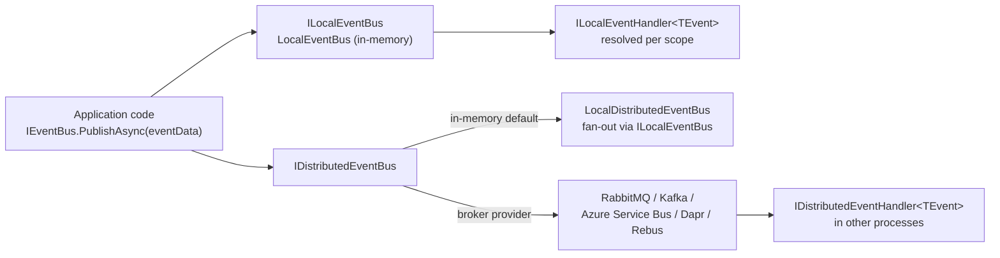
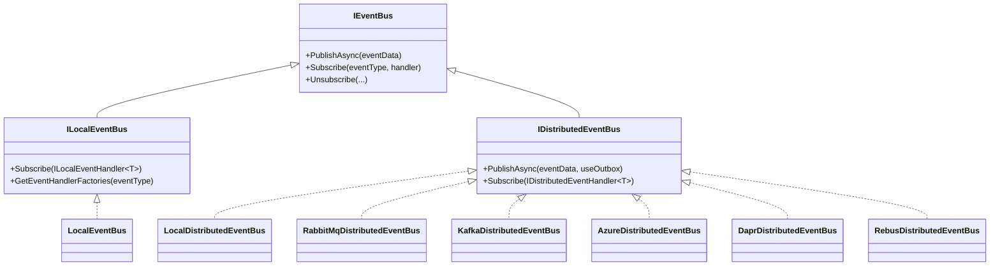

The **Event Bus & Messaging** stack in ABP Framework is the glue between
loosely coupled components, modules, and microservices. It exposes one
shared abstraction (`IEventBus`) with two specializations — `ILocalEventBus`
for in-process publish/subscribe and `IDistributedEventBus` for
cross-process messaging — and ships a swappable provider for each popular
broker. This page walks through the package map and the publish flow that
every provider follows.

## Packages at a glance

The source tree under `framework/src/` groups the abstractions, the
default in-memory implementations, and one project per broker integration.

| Package | Purpose | Key entry point |
| --- | --- | --- |
| `Volo.Abp.EventBus.Abstractions` | Public contracts (`IEventBus`, `ILocalEventBus`, `IDistributedEventBus`, inbox/outbox interfaces, `EventNameAttribute`) | `AbpEventBusAbstractionsModule` |
| `Volo.Abp.EventBus` | Default `LocalEventBus`, `LocalDistributedEventBus`, outbox/inbox background workers | `AbpEventBusModule` |
| `Volo.Abp.EventBus.RabbitMQ` | RabbitMQ provider | `AbpEventBusRabbitMqModule` |
| `Volo.Abp.EventBus.Kafka` | Apache Kafka provider | `AbpEventBusKafkaModule` |
| `Volo.Abp.EventBus.Azure` | Azure Service Bus provider | `AbpEventBusAzureModule` |
| `Volo.Abp.EventBus.Dapr` | Dapr pub/sub provider | `AbpEventBusDaprModule` |
| `Volo.Abp.EventBus.Rebus` | Rebus provider (in-memory, MSMQ, RabbitMQ, …) | `AbpEventBusRebusModule` |

<Info>
  Only one distributed provider should be referenced per host. Each
  provider registers its concrete `DistributedEventBusBase` subclass with
  `[Dependency(ReplaceServices = true)]` and `[ExposeServices(typeof(IDistributedEventBus), …)]`,
  so the last package wins.
</Info>

## Local vs distributed at a glance

The two buses share an interface but solve different problems.
`ILocalEventBus` keeps state in memory — handlers are invoked in the
publisher's process and inherit its dependency injection scope. The
distributed bus serializes the event, hands it to a broker, and lets every
subscribing service deserialize and dispatch it independently.



The default registration in `AbpEventBusModule` is `LocalDistributedEventBus`,
which simply forwards to the local bus. Replace the module reference with
one of the broker packages and the same publish call routes to the wire.

## The outbox and inbox

`Volo.Abp.EventBus` ships a background-worker pair —
`OutboxSenderManager` and `InboxProcessManager` (both wired up in
`AbpEventBusModule.OnApplicationInitializationAsync`) — that implement the
transactional outbox/inbox pattern on top of any provider:

```mermaid
flowchart LR
    UoW["Unit of work\ncommits DB tx"] --> Outbox[("IEventOutbox\nOutgoingEventInfo")]
    Outbox --> Sender["OutboxSender\n(background worker)"]
    Sender --> Bus["IDistributedEventBus.PublishAsync"]
    Bus --> Broker["Message broker"]
    Broker --> Consumer["Provider consumer\n(RabbitMq/Kafka/AzureSb/…)"]
    Consumer --> Inbox[("IEventInbox\nIncomingEventInfo")]
    Inbox --> Processor["InboxProcessor\n(background worker)"]
    Processor --> Handlers["IDistributedEventHandler&lt;T&gt;"]
```



Storage of `OutgoingEventInfo` / `IncomingEventInfo` is provided by the
EF Core and MongoDB integration packages; this module only owns the
publishing side. See [Distributed Event Bus](/events/distributed-event-bus)
for the configuration model (`OutboxConfigDictionary`,
`InboxConfigDictionary`, `AbpEventBusBoxesOptions`).

## Publish path step by step

Every concrete bus shares the same flow inherited from `EventBusBase`
(in `framework/src/Volo.Abp.EventBus/Volo/Abp/EventBus/EventBusBase.cs`):

<Steps>
  <Step title="Caller invokes PublishAsync">
    `IEventBus.PublishAsync<TEvent>(eventData, onUnitOfWorkComplete: true)`
    is the typical entry point. The reflected (`Type eventType, object eventData`)
    and dynamic (`string eventName, object eventData`) overloads
    eventually collapse into the same code path.
  </Step>
  <Step title="Unit-of-work staging">
    If `onUnitOfWorkComplete` is true and `IUnitOfWorkManager.Current`
    is not null, the event is wrapped into a
    `UnitOfWorkEventRecord` and added to the UoW via the abstract
    `AddToUnitOfWork` hook. Nothing is dispatched yet.
  </Step>
  <Step title="UoW commit replay">
    When the UoW completes,
    `UnitOfWorkEventPublisher.PublishLocalEventsAsync` /
    `PublishDistributedEventsAsync` (in
    `framework/src/Volo.Abp.EventBus/Volo/Abp/EventBus/UnitOfWorkEventPublisher.cs`)
    iterates the staged records and re-invokes `PublishAsync(...,
    onUnitOfWorkComplete: false)` so the bus skips this branch the
    second time around.
  </Step>
  <Step title="Outbox staging (distributed only)">
    `DistributedEventBusBase.AddToOutboxAsync` runs through the
    `Outboxes` dictionary, asks each `OutboxConfig.Selector` whether
    this event type belongs, and enqueues an `OutgoingEventInfo` if so.
    The broker is not contacted on this code path.
  </Step>
  <Step title="Direct provider publish">
    When neither the UoW nor the outbox owns the event,
    `PublishToEventBusAsync` is called. Each provider overrides this to
    write to its broker — RabbitMQ `BasicPublishAsync`, Kafka
    `ProduceAsync`, ServiceBus `SendMessageAsync`, Dapr
    `PublishEventAsync`, Rebus `Publish`.
  </Step>
</Steps>

## Choosing a provider

<CardGroup cols={2}>
  <Card title="LocalDistributedEventBus" icon="microchip">
    Default. Use for monoliths or tests. Source:
    `Volo.Abp.EventBus/Distributed/LocalDistributedEventBus.cs`.
  </Card>
  <Card title="RabbitMQ" icon="rabbit" href="/events/rabbitmq">
    `RabbitMqDistributedEventBus` — direct exchange, durable
    per-consumer queue.
  </Card>
  <Card title="Kafka" icon="bolt" href="/events/kafka">
    `KafkaDistributedEventBus` — one topic per host, consumer
    groups for fan-out.
  </Card>
  <Card title="Azure Service Bus" icon="cloud" href="/events/azure-service-bus">
    `AzureDistributedEventBus` — topic and subscriber per host.
  </Card>
  <Card title="Dapr" icon="cube" href="/events/dapr-event-bus">
    `DaprDistributedEventBus` — uses a named Dapr `pubsub`
    component.
  </Card>
  <Card title="Rebus" icon="recycle" href="/events/rebus">
    `RebusDistributedEventBus` — adapter over Rebus transports.
  </Card>
</CardGroup>

## Package map by source folder

Every package lives under `framework/src/`. Use this table as a jump
list — every page below opens a file from one of these directories.

| Folder | Module class | What's inside |
| --- | --- | --- |
| `Volo.Abp.EventBus.Abstractions/Volo/Abp/EventBus/` | `AbpEventBusAbstractionsModule` | `IEventBus`, `IEventHandler`, `IEventHandlerInvoker`, `EventNameAttribute`, `GenericEventNameAttribute`, `EventBusConsts`. |
| `Volo.Abp.EventBus.Abstractions/Volo/Abp/EventBus/Local/` | – | `ILocalEventBus`, `ILocalEventHandler<T>`, `LocalEventHandlerOrderAttribute`. |
| `Volo.Abp.EventBus.Abstractions/Volo/Abp/EventBus/Distributed/` | – | `IDistributedEventBus`, `IDistributedEventHandler<T>`, `IEventInbox`, `IEventOutbox`, `OutboxConfig`, `InboxConfig`, `OutgoingEventInfo`, `IncomingEventInfo`. |
| `Volo.Abp.EventBus/Volo/Abp/EventBus/` | `AbpEventBusModule` | `EventBusBase`, `EventHandlerInvoker`, `IocEventHandlerFactory`, `UnitOfWorkEventPublisher`. |
| `Volo.Abp.EventBus/Volo/Abp/EventBus/Local/` | – | `LocalEventBus`, `AbpLocalEventBusOptions`, `LocalEventMessage`, `NullLocalEventBus`. |
| `Volo.Abp.EventBus/Volo/Abp/EventBus/Distributed/` | – | `DistributedEventBusBase`, `LocalDistributedEventBus`, `AbpDistributedEventBusOptions`, `AbpEventBusBoxesOptions`, `InboxProcessor`, `InboxProcessManager`, `OutboxSender`, `OutboxSenderManager`. |
| `Volo.Abp.EventBus.RabbitMQ/Volo/Abp/EventBus/RabbitMq/` | `AbpEventBusRabbitMqModule` | `RabbitMqDistributedEventBus`, `AbpRabbitMqEventBusOptions`, `PostConfigureAbpRabbitMqEventBusOptions`. |
| `Volo.Abp.EventBus.Kafka/Volo/Abp/EventBus/Kafka/` | `AbpEventBusKafkaModule` | `KafkaDistributedEventBus`, `AbpKafkaEventBusOptions`, `MessageExtensions`. |
| `Volo.Abp.EventBus.Azure/Volo/Abp/EventBus/Azure/` | `AbpEventBusAzureModule` | `AzureDistributedEventBus`, `AbpAzureEventBusOptions`. |
| `Volo.Abp.EventBus.Dapr/Volo/Abp/EventBus/Dapr/` | `AbpEventBusDaprModule` | `DaprDistributedEventBus`, `AbpDaprEventBusOptions`, `AbpDaprEventData`. |
| `Volo.Abp.EventBus.Rebus/Volo/Abp/EventBus/Rebus/` | `AbpEventBusRebusModule` | `RebusDistributedEventBus`, `AbpRebusEventBusOptions`, `RebusDistributedEventHandlerAdapter`, `AbpRebusEventHandlerStep`. |

## The `IEventBus` family

The whole stack hangs off three interfaces. Each broker provider only
implements `IDistributedEventBus`; the local bus is shared.



`LocalEventBus`, `LocalDistributedEventBus`, and every concrete broker
implementation inherit from `EventBusBase` (and the distributed ones
from `DistributedEventBusBase`). That keeps the publish path, the
unit-of-work staging, and the handler invoker uniform across providers.

## What a handler looks like

The contract is intentionally minimal — implement either marker
interface, register the class with DI, and ABP will subscribe it
automatically:

```csharp
public class UserCreatedHandler :
    ILocalEventHandler<UserCreatedEvent>,
    IDistributedEventHandler<UserCreatedEto>,
    ITransientDependency
{
    public Task HandleEventAsync(UserCreatedEvent eventData) { /* local */ }
    public Task HandleEventAsync(UserCreatedEto eventData)   { /* distributed */ }
}
```

The DI-registration scan in `AbpEventBusModule.PreConfigureServices`
adds the type to both `AbpLocalEventBusOptions.Handlers` and
`AbpDistributedEventBusOptions.Handlers`. No manual `Subscribe(...)`
call is required.

## Configuration sections per provider

| Provider | `appsettings.json` section | Bound options |
| --- | --- | --- |
| RabbitMQ | `RabbitMQ:Connections`, `RabbitMQ:EventBus` | `AbpRabbitMqOptions`, `AbpRabbitMqEventBusOptions` |
| Kafka | `Kafka:Connections`, `Kafka:EventBus` | `AbpKafkaOptions`, `AbpKafkaEventBusOptions` |
| Azure Service Bus | `Azure:ServiceBus:Connections`, `Azure:EventBus` | `AbpAzureServiceBusOptions`, `AbpAzureEventBusOptions` |
| Dapr | Configured in code (uses sidecar) | `AbpDaprOptions`, `AbpDaprEventBusOptions` |
| Rebus | Configured in code via `RebusConfigurer` | `AbpRebusEventBusOptions` |

## Cross-cutting features shared by every provider

A few features are not the responsibility of any single broker package
because the base class implements them once:

<AccordionGroup>
  <Accordion title="Correlation IDs">
    `ICorrelationIdProvider` is injected into every
    `DistributedEventBusBase` subclass. On publish it is read and
    written to the broker-native correlation field (`MessageId` headers
    for RabbitMQ/Kafka, `CorrelationId` for Service Bus, the
    `X-Correlation-Id` header for Dapr/Rebus). On receive,
    `CorrelationIdProvider.Change(correlationId)` reinstates it before
    invoking handlers — so log scopes and tracing IDs flow end to end.
  </Accordion>
  <Accordion title="Multi-tenancy">
    The base class captures `ICurrentTenant.Id` at publish time and
    serializes it through the inbox envelope. The receiver switches to
    that tenant before dispatching the handler. Combined with
    `IEventDataMayHaveTenantId`, ABP can also route an inbound event to
    a specific tenant based on payload fields.
  </Accordion>
  <Accordion title="Dynamic events">
    `DynamicEventData` (in
    `framework/src/Volo.Abp.EventBus.Abstractions/Volo/Abp/EventBus/DynamicEventData.cs`)
    is the wrapper for string-keyed publishes. Local, RabbitMQ, Kafka,
    Azure, and Rebus providers all support it. Dapr explicitly does
    **not** — see [Dapr](/events/dapr-event-bus) for the reasoning.
  </Accordion>
  <Accordion title="Observability events">
    Every distributed publish raises
    `DistributedEventSent` on the local bus, and every receive raises
    `DistributedEventReceived`. Implement
    `ILocalEventHandler<DistributedEventSent>` to plug in tracing,
    metrics, or audit logging without touching individual providers.
  </Accordion>
</AccordionGroup>

## Operational defaults

`AbpEventBusBoxesOptions` (in
`framework/src/Volo.Abp.EventBus/Volo/Abp/EventBus/Distributed/AbpEventBusBoxesOptions.cs`)
controls the rhythm of the outbox/inbox workers:

| Setting | Default | Effect |
| --- | --- | --- |
| `PeriodTimeSpan` | 2 seconds | How often `OutboxSender` / `InboxProcessor` poll. |
| `OutboxWaitingEventMaxCount` | 1000 | Max events fetched per outbox tick. |
| `InboxWaitingEventMaxCount` | 1000 | Max events fetched per inbox tick. |
| `BatchPublishOutboxEvents` | `true` | Use `PublishManyFromOutboxAsync` where available. |
| `InboxProcessorFailurePolicy` | `Retry` | `Retry` keeps redelivering; `RetryLater` schedules `nextRetryTime`. |
| `InboxProcessorMaxRetryCount` | 10 | After this, the message is moved to `MarkAsDiscardAsync`. |
| `InboxProcessorRetryBackoffFactor` | 10 | `delay = factor × 2^retryCount` (`RetryLater` only). |
| `DistributedLockWaitDuration` | 15 seconds | Time the worker waits for the `IAbpDistributedLock`. |
| `CleanOldEventTimeIntervalSpan` | 6 hours | How often `DeleteOldEventsAsync` runs. |
| `WaitTimeToDeleteProcessedInboxEvents` | 2 hours | Grace period before purging processed inbox rows. |

## Where to read next

<Steps>
  <Step title="Start with the contracts">
    [Core (Volo.Abp.EventBus)](/events/volo-abp-eventbus) walks through
    `IEventBus`, `EventBusBase`, the handler invoker, and the
    `EventNameAttribute` registry.
  </Step>
  <Step title="In-process events">
    [Local Bus](/events/local-event-bus) covers `LocalEventBus`,
    `AbpLocalEventBusOptions`, and the `EntityChangeEventHelper`
    integration that turns EF Core SaveChanges into local events.
  </Step>
  <Step title="Going cross-process">
    [Distributed Bus](/events/distributed-event-bus) explains
    `DistributedEventBusBase`, ETO mapping, the outbox/inbox configuration
    surface, and the background workers.
  </Step>
  <Step title="Pick a provider">
    Open the provider page that matches your broker for module
    composition, configuration sections, and the publish path.
  </Step>
</Steps>
