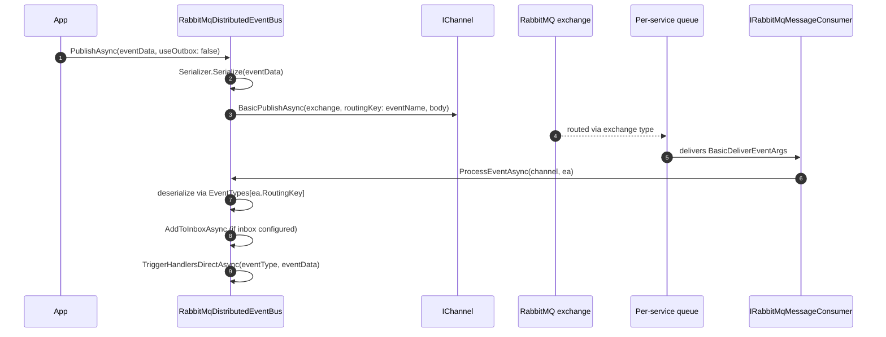

`Volo.Abp.EventBus.RabbitMQ` plugs a RabbitMQ broker into ABP Framework's
`IDistributedEventBus`. The integration lives in
`framework/src/Volo.Abp.EventBus.RabbitMQ/Volo/Abp/EventBus/RabbitMq/`
and reuses the connection pool, channel pool, and consumer factory from
`framework/src/Volo.Abp.RabbitMQ/Volo/Abp/RabbitMQ/`.

## Module composition

```csharp
// framework/src/Volo.Abp.EventBus.RabbitMQ/Volo/Abp/EventBus/RabbitMq/AbpEventBusRabbitMqModule.cs
[DependsOn(
    typeof(AbpEventBusModule),
    typeof(AbpRabbitMqModule))]
public class AbpEventBusRabbitMqModule : AbpModule
{
    public override void ConfigureServices(ServiceConfigurationContext context)
    {
        var configuration = context.Services.GetConfiguration();
        Configure<AbpRabbitMqEventBusOptions>(configuration.GetSection("RabbitMQ:EventBus"));
        context.Services.TryAddEnumerable(ServiceDescriptor.Singleton<
            IPostConfigureOptions<AbpRabbitMqEventBusOptions>,
            PostConfigureAbpRabbitMqEventBusOptions>());
    }

    public override void OnApplicationInitialization(ApplicationInitializationContext context)
    {
        context.ServiceProvider
            .GetRequiredService<IRabbitMqDistributedEventBus>()
            .Initialize();
    }
}
```

Two things happen during startup:

1. `AbpRabbitMqEventBusOptions` is bound from the `RabbitMQ:EventBus`
   configuration section.
2. After the application has built, `IRabbitMqDistributedEventBus.Initialize()`
   declares the exchange/queue and starts the consumer.

`AbpRabbitMqModule` (the dependency) provides the `RabbitMQ:Connections`
configuration section, `IConnectionPool`, `IChannelPool`, and
`IRabbitMqMessageConsumerFactory` used below.

## Configuration

`appsettings.json`:

```json
{
  "RabbitMQ": {
    "Connections": {
      "Default": {
        "HostName": "localhost",
        "UserName": "guest",
        "Password": "guest"
      }
    },
    "EventBus": {
      "ConnectionName": "Default",
      "ClientName": "OrdersService",
      "ExchangeName": "Acme.Shop",
      "ExchangeType": "direct",
      "PrefetchCount": 10
    }
  }
}
```

The fields map one-to-one to `AbpRabbitMqEventBusOptions`:

```csharp
// AbpRabbitMqEventBusOptions.cs
public class AbpRabbitMqEventBusOptions
{
    public const string DefaultExchangeType = RabbitMqConsts.ExchangeTypes.Direct;

    public string? ConnectionName { get; set; }
    public string ClientName { get; set; } = default!;
    public string ExchangeName { get; set; } = default!;
    public string? ExchangeType { get; set; }
    public ushort? PrefetchCount { get; set; }
    public IDictionary<string, object?> QueueArguments { get; set; } = new Dictionary<string, object?>();
    public IDictionary<string, object?> ExchangeArguments { get; set; } = new Dictionary<string, object?>();

    public string GetExchangeTypeOrDefault()
        => string.IsNullOrEmpty(ExchangeType) ? DefaultExchangeType : ExchangeType!;
}
```

| Field | Meaning |
| --- | --- |
| `ConnectionName` | Key into `RabbitMqConnections` (defaults to `Default`). |
| `ClientName` | Name of the **queue** this service binds to — every service should pick a unique value (typically the service name). |
| `ExchangeName` | Shared exchange every publisher writes to. All services in the bounded context should use the same name. |
| `ExchangeType` | `direct` (default), `fanout`, `topic`, or `headers`. |
| `PrefetchCount` | `basic.qos` value passed to the consumer. |
| `QueueArguments` / `ExchangeArguments` | Free-form arguments. Values from configuration arrive as strings; `PostConfigureAbpRabbitMqEventBusOptions` converts the standard quorum / TTL / max-length keys into the correct primitive types. |

### Post-configuration of broker arguments

```csharp
// PostConfigureAbpRabbitMqEventBusOptions.cs
private readonly FrozenSet<string> _uint64QueueArguments = new HashSet<string>
{
    "x-delivery-limit", "x-expires", "x-message-ttl",
    "x-max-length", "x-max-length-bytes",
    "x-quorum-initial-group-size", "x-quorum-target-group-size",
    "x-stream-filter-size-bytes", "x-stream-max-segment-size-bytes",
}.ToFrozenSet();

private readonly FrozenSet<string> _boolQueueArguments = new HashSet<string>
{
    "x-single-active-consumer"
}.ToFrozenSet();
```

Strings such as `"x-message-ttl": "60000"` from `appsettings.json` are
parsed into integers; `"x-single-active-consumer": "true"` becomes a
`bool`. Anything outside these lists is forwarded as-is.

## `RabbitMqDistributedEventBus`

The provider extends `DistributedEventBusBase` and registers itself
as the new `IDistributedEventBus`:

```csharp
// RabbitMqDistributedEventBus.cs
[Dependency(ReplaceServices = true)]
[ExposeServices(typeof(IDistributedEventBus),
    typeof(RabbitMqDistributedEventBus),
    typeof(IRabbitMqDistributedEventBus))]
public class RabbitMqDistributedEventBus
    : DistributedEventBusBase, IRabbitMqDistributedEventBus, ISingletonDependency
{
    protected IConnectionPool ConnectionPool { get; }
    protected IRabbitMqSerializer Serializer { get; }
    protected IRabbitMqMessageConsumerFactory MessageConsumerFactory { get; }
    protected IRabbitMqMessageConsumer Consumer { get; private set; } = default!;
}
```

### Initialization

```csharp
public virtual void Initialize()
{
    Consumer = MessageConsumerFactory.Create(
        new ExchangeDeclareConfiguration(
            AbpRabbitMqEventBusOptions.ExchangeName,
            type: AbpRabbitMqEventBusOptions.GetExchangeTypeOrDefault(),
            durable: true,
            arguments: AbpRabbitMqEventBusOptions.ExchangeArguments),
        new QueueDeclareConfiguration(
            AbpRabbitMqEventBusOptions.ClientName,
            durable: true,
            exclusive: false,
            autoDelete: false,
            prefetchCount: AbpRabbitMqEventBusOptions.PrefetchCount,
            arguments: AbpRabbitMqEventBusOptions.QueueArguments),
        AbpRabbitMqEventBusOptions.ConnectionName);

    Consumer.OnMessageReceived(ProcessEventAsync);

    SubscribeHandlers(AbpDistributedEventBusOptions.Handlers);
}
```

`ExchangeDeclareConfiguration` produces a **durable** exchange, and
`QueueDeclareConfiguration` produces a **durable, non-exclusive**
queue named after `ClientName`. The consumer registers
`ProcessEventAsync` as the message callback and then iterates the
distributed handler list — for each handler, `Subscribe(Type,
IEventHandlerFactory)` is called.

### Binding on subscription

When the first handler for an event type subscribes, the queue is bound
to the exchange with that event name as the routing key:

```csharp
public override IDisposable Subscribe(Type eventType, IEventHandlerFactory factory)
{
    var handlerFactories = GetOrCreateHandlerFactories(eventType);
    if (factory.IsInFactories(handlerFactories))
        return NullDisposable.Instance;

    handlerFactories.Add(factory);

    if (handlerFactories.Count == 1)
    {
        Consumer.BindAsync(EventNameAttribute.GetNameOrDefault(eventType));
    }

    return new EventHandlerFactoryUnregistrar(this, eventType, factory);
}
```

The same pattern applies to dynamic, string-keyed subscriptions via the
`Subscribe(string eventName, …)` overload.

## Publish / receive pipeline



### Publish

```csharp
protected virtual async Task PublishAsync(
    IChannel channel, string eventName, byte[] body,
    Dictionary<string, object>? headersArguments = null,
    Guid? eventId = null, string? correlationId = null)
{
    await EnsureExchangeExistsAsync(channel);

    var properties = new BasicProperties { DeliveryMode = DeliveryModes.Persistent };

    if (properties.MessageId.IsNullOrEmpty())
        properties.MessageId = (eventId ?? GuidGenerator.Create()).ToString("N");

    if (correlationId != null)
        properties.CorrelationId = correlationId;

    SetEventMessageHeaders(properties, headersArguments);

    await channel.BasicPublishAsync(
        exchange: AbpRabbitMqEventBusOptions.ExchangeName,
        routingKey: eventName,
        mandatory: false,
        basicProperties: properties,
        body: body);
}
```

Three details worth noting:

- Messages are published with `DeliveryMode = Persistent` so RabbitMQ
  flushes them to disk if the queue is durable.
- `MessageId` carries an ABP-generated GUID — the consumer uses this for
  inbox deduplication.
- `CorrelationId` flows through `ICorrelationIdProvider` so handlers
  can resume the same logical request.

### Receive

```csharp
private async Task ProcessEventAsync(IChannel channel, BasicDeliverEventArgs ea)
{
    var eventName = ea.RoutingKey;
    var eventType = EventTypes.GetOrDefault(eventName);
    object eventData;

    if (eventType != null)
    {
        eventData = Serializer.Deserialize(ea.Body.ToArray(), eventType);
    }
    else if (DynamicHandlerFactories.ContainsKey(eventName))
    {
        eventType = typeof(DynamicEventData);
        eventData = new DynamicEventData(eventName,
            Serializer.Deserialize<object>(ea.Body.ToArray()));
    }
    else
    {
        return; // no handler — drop silently
    }

    var correlationId = ea.BasicProperties.CorrelationId;
    if (await AddToInboxAsync(ea.BasicProperties.MessageId, eventName,
            eventType, eventData, correlationId))
    {
        return; // inbox owns delivery from here
    }

    using (CorrelationIdProvider.Change(correlationId))
    {
        await TriggerHandlersDirectAsync(eventType, eventData);
    }
}
```

### Outbox integration

`DistributedEventBusBase` declares two abstract methods that the
RabbitMQ provider implements: `PublishFromOutboxAsync` and
`PublishManyFromOutboxAsync`. The batch path opens one channel with
`publisherConfirmationsEnabled: true` and publishes every queued event
under a `ThrottlingRateLimiter(256)`:

```csharp
using (var channel = await (await ConnectionPool.GetAsync(...))
   .CreateChannelAsync(new CreateChannelOptions(
        publisherConfirmationsEnabled: true,
        publisherConfirmationTrackingEnabled: true,
        new ThrottlingRateLimiter(256))))
{
    foreach (var outgoing in outgoingEvents)
    {
        await PublishAsync(channel,
            outgoing.EventName, outgoing.EventData, headersArguments,
            outgoing.Id, outgoing.GetCorrelationId());
    }
}
```

Publisher confirmations ensure the outbox sender does not delete an
`OutgoingEventInfo` until RabbitMQ has acknowledged the message.

## Underlying RabbitMQ infrastructure

The event-bus provider stays thin because the heavy lifting sits in
`Volo.Abp.RabbitMQ`:

| Service | Source | Role |
| --- | --- | --- |
| `IConnectionPool` | `Volo.Abp.RabbitMQ/ConnectionPool.cs` | Lazily opens and caches `IConnection` instances per connection name. |
| `IChannelPool` | `Volo.Abp.RabbitMQ/ChannelPool.cs` | Reuses channels across the application lifetime. |
| `IRabbitMqMessageConsumerFactory` | `Volo.Abp.RabbitMQ/RabbitMqMessageConsumerFactory.cs` | Wires a `RabbitMqMessageConsumer` to an exchange/queue pair. |
| `IRabbitMqSerializer` | `Volo.Abp.RabbitMQ/Utf8JsonRabbitMqSerializer.cs` | Default UTF-8 JSON serializer; replaceable. |

`AbpRabbitMqOptions.Connections` is a `RabbitMqConnections` dictionary
of `ConnectionFactory` objects keyed by connection name — the
`"Default"` entry is required:

```csharp
public class RabbitMqConnections : Dictionary<string, ConnectionFactory>
{
    public const string DefaultConnectionName = "Default";
    public ConnectionFactory Default
    {
        get => this[DefaultConnectionName];
        set => this[DefaultConnectionName] = Check.NotNull(value, nameof(value));
    }
}
```

## Naming conventions

<Info>
  - **Exchange name** is shared across all services in the bounded
    context — every publisher and every subscriber declares the same
    exchange.
  - **Queue name** (`ClientName`) is unique per service. Each replica of
    the same service shares the queue and gets competing-consumer fan-out.
  - **Routing key** is the value produced by
    `EventNameAttribute.GetNameOrDefault(eventType)`. With `direct`
    exchange semantics, a queue receives a message only if it has been
    bound to that routing key — which happens automatically when a
    handler subscribes.
</Info>

## Pairing with the outbox

A common production setup combines the EF Core outbox with this
provider:

```csharp
Configure<AbpDistributedEventBusOptions>(o =>
{
    o.Outboxes.Configure("Default", c => c.UseDbContext<OrdersDbContext>());
    o.Inboxes.Configure("Default", c => c.UseDbContext<OrdersDbContext>());
});
```

The outbox stores `OutgoingEventInfo` rows in the same transaction as
your domain changes, and `OutboxSender` then calls
`RabbitMqDistributedEventBus.PublishManyFromOutboxAsync` on its timer.
On the consumer side, `AddToInboxAsync` short-circuits the direct
delivery and lets `InboxProcessor` invoke handlers transactionally.

<Tip>
  Looking at message flow in production? RabbitMQ stores
  `MessageId = OutgoingEventInfo.Id.ToString("N")`, so the same GUID
  appears in your outbox table and the broker — perfect for tracing.
</Tip>
