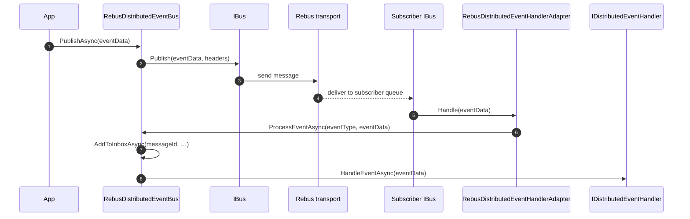

`Volo.Abp.EventBus.Rebus` adapts the ABP Framework distributed event bus
to [Rebus](https://github.com/rebus-org/Rebus), a small but powerful
.NET message bus that supports many transports (RabbitMQ, Azure
Service Bus, Amazon SQS, MSMQ, in-memory, …). The integration code is
in `framework/src/Volo.Abp.EventBus.Rebus/Volo/Abp/EventBus/Rebus/`.

## Module composition

```csharp
// AbpEventBusRebusModule.cs
[DependsOn(typeof(AbpEventBusModule))]
public class AbpEventBusRebusModule : AbpModule
{
    public override void ConfigureServices(ServiceConfigurationContext context)
    {
        context.Services.AddTransient(
            typeof(IHandleMessages<>),
            typeof(RebusDistributedEventHandlerAdapter<>));

        var preActions = context.Services.GetPreConfigureActions<AbpRebusEventBusOptions>();
        var rebusOptions = preActions.Configure();
        Configure<AbpRebusEventBusOptions>(o => preActions.Configure(o));

        context.Services.AddRebus(configure =>
        {
            configure.Options(options =>
            {
                options.Decorate<IPipeline>(d =>
                {
                    var step = new AbpRebusEventHandlerStep();
                    var pipeline = d.Get<IPipeline>();

                    return new PipelineStepInjector(pipeline)
                        .OnReceive(step, PipelineRelativePosition.After, typeof(ActivateHandlersStep));
                });
            });

            rebusOptions.Configurer?.Invoke(configure);
            return configure;
        }, startAutomatically: false, key: rebusOptions.RebusInstanceName);
    }

    public override void OnApplicationInitialization(ApplicationInitializationContext context)
    {
        context.ServiceProvider
            .GetRequiredService<RebusDistributedEventBus>()
            .Initialize();

        var rebusOptions = context.ServiceProvider
            .GetRequiredService<IOptions<AbpRebusEventBusOptions>>().Value;

        context.ServiceProvider
            .GetRequiredService<IBusRegistry>()
            .StartBus(rebusOptions.RebusInstanceName);
    }
}
```

Three integration choices stand out:

1. **One `IHandleMessages<>` per type** — the
   `RebusDistributedEventHandlerAdapter<TEvent>` plays the Rebus handler
   role for every event type and forwards each call to
   `RebusDistributedEventBus.ProcessEventAsync(eventType, eventData)`.
2. **Custom pipeline step** — `AbpRebusEventHandlerStep` is inserted
   `OnReceive` right after `ActivateHandlersStep`. It is what lets ABP
   correlate inbound Rebus messages with its own `EventTypes` registry.
3. **Manual start** — the Rebus bus is created with
   `startAutomatically: false` and started inside
   `OnApplicationInitialization` via `IBusRegistry.StartBus(name)` so
   that ABP has fully wired its DI scopes before any message arrives.

## Configuration

`AbpRebusEventBusOptions` exposes the transport, instance name, and an
optional custom publish hook:

```csharp
// AbpRebusEventBusOptions.cs
public class AbpRebusEventBusOptions
{
    public string InputQueueName { get; set; } = null!;
    public string RebusInstanceName { get; set; } = "default-instance";

    public Action<RebusConfigurer> Configurer { get; set; }
    public Func<IBus, Type, object, Task>? Publish { get; set; }

    public AbpRebusEventBusOptions()
    {
        _configurer = DefaultConfigure;
    }

    private void DefaultConfigure(RebusConfigurer configure)
    {
        configure.Transport(t => t.UseInMemoryTransport(new InMemNetwork(), InputQueueName));
    }
}
```

| Field | Meaning |
| --- | --- |
| `InputQueueName` | Name of the per-service queue Rebus reads from. |
| `RebusInstanceName` | Key used by Rebus DI multi-bus support (`IBusRegistry`). |
| `Configurer` | `Action<RebusConfigurer>` for full transport/serialization/routing customization. The default uses the in-memory transport — replace it in production. |
| `Publish` | Optional override of the publish path — useful for routing through `IBus.Send` instead of `IBus.Publish`. |

Pre-configure in a host module:

```csharp
PreConfigure<AbpRebusEventBusOptions>(o =>
{
    o.InputQueueName = "orders.input";
    o.RebusInstanceName = "orders";
    o.Configurer = c => c
        .Transport(t => t.UseRabbitMq("amqp://localhost", "orders.input"))
        .Routing(r => r.TypeBased().MapAssemblyOf<OrderEto>("orders.input"));
});
```

## `RebusDistributedEventBus`

```csharp
// RebusDistributedEventBus.cs
[Dependency(ReplaceServices = true)]
[ExposeServices(typeof(IDistributedEventBus), typeof(RebusDistributedEventBus))]
public class RebusDistributedEventBus : DistributedEventBusBase, ISingletonDependency
{
    protected IBus Rebus { get; }
    protected IRebusSerializer Serializer { get; }
    protected AbpRebusEventBusOptions AbpRebusEventBusOptions { get; }
}
```

### Initialization

```csharp
public void Initialize()
{
    SubscribeHandlers(AbpDistributedEventBusOptions.Handlers);
}
```

The Rebus bus is already configured; `SubscribeHandlers` walks the
distributed handler list and, for each handler type, calls
`Rebus.Subscribe(eventType)` the first time a type is seen — this
creates the broker-side topic subscription Rebus uses for pub/sub
delivery.

### Subscribe path

```csharp
public override IDisposable Subscribe(Type eventType, IEventHandlerFactory factory)
{
    var handlerFactories = GetOrCreateHandlerFactories(eventType);
    if (factory.IsInFactories(handlerFactories))
        return NullDisposable.Instance;

    handlerFactories.Add(factory);

    if (handlerFactories.Count == 1)
    {
        Rebus.Subscribe(eventType);
    }

    return new EventHandlerFactoryUnregistrar(this, eventType, factory);
}
```

`Rebus.Subscribe(eventType)` creates the subscription only on the
**first** handler — subsequent additions reuse it. Unsubscribing the
last handler calls `Rebus.Unsubscribe(eventType)`.

Dynamic (event-name-based) subscriptions register `DynamicEventData` as
the Rebus message type once the first dynamic handler is added.

## Publish path

```csharp
protected async override Task PublishToEventBusAsync(Type eventType, object eventData)
{
    var headers = new Dictionary<string, string>();
    if (CorrelationIdProvider.Get() != null)
    {
        headers.Add(EventBusConsts.CorrelationIdHeaderName,
            CorrelationIdProvider.Get()!);
    }
    await PublishAsync(eventType, eventData, headersArguments: headers);
}

protected virtual async Task PublishAsync(
    Type eventType, object eventData,
    Guid? eventId = null,
    Dictionary<string, string>? headersArguments = null)
{
    if (AbpRebusEventBusOptions.Publish != null)
    {
        await AbpRebusEventBusOptions.Publish(Rebus, eventType, eventData);
        return;
    }

    headersArguments ??= new Dictionary<string, string>();
    if (!headersArguments.ContainsKey(Headers.MessageId))
    {
        headersArguments[Headers.MessageId] =
            (eventId ?? GuidGenerator.Create()).ToString("N");
    }

    await Rebus.Publish(eventData, headersArguments);
}
```

| Rebus field | ABP value |
| --- | --- |
| Message body | `eventData` serialized by the Rebus serializer (`Utf8JsonRabbitMqSerializer` by default — yes, the file is called that, see `Utf8JsonRabbitMqSerializer.cs`). |
| Message type | `eventData.GetType()` — Rebus routes by .NET type for pub/sub. |
| `Headers.MessageId` | `OutgoingEventInfo.Id` for outbox publishes, or a new GUID for direct publishes. |
| `X-Correlation-Id` header | Value from `ICorrelationIdProvider`. |

The optional `AbpRebusEventBusOptions.Publish` delegate lets you swap
`Rebus.Publish` for `Rebus.Send` (point-to-point) or any custom routing
logic without subclassing the bus.

### Outbox path

```csharp
public async override Task PublishManyFromOutboxAsync(
    IEnumerable<OutgoingEventInfo> outgoingEvents, OutboxConfig outboxConfig)
{
    var outgoingEventArray = outgoingEvents.ToArray();

    using (var scope = new RebusTransactionScope())
    {
        foreach (var outgoingEvent in outgoingEventArray)
        {
            await PublishFromOutboxAsync(outgoingEvent, outboxConfig);
            // …emit DistributedEventSent local event
        }

        await scope.CompleteAsync();
    }
}
```

The `RebusTransactionScope` ensures every outbox row in the batch is
sent under the same Rebus ambient transaction — important for
transports like SQL Server that batch outgoing sends until commit.

## Receive path

`RebusDistributedEventHandlerAdapter<TEvent>` is the closed generic
Rebus handler registered for every event type:

```csharp
// RebusDistributedEventHandlerAdapter.cs
public class RebusDistributedEventHandlerAdapter<TEvent>
    : IHandleMessages<TEvent>, IRebusDistributedEventHandlerAdapter
    where TEvent : class
{
    public async Task Handle(TEvent eventData)
    {
        await _eventBus.ProcessEventAsync(typeof(TEvent), eventData);
    }
}
```

`ProcessEventAsync` rebuilds the ABP envelope from Rebus' ambient
`MessageContext` and feeds it to the inbox + handler pipeline:

```csharp
public async Task ProcessEventAsync(Type eventType, object eventData)
{
    var messageId = MessageContext.Current.TransportMessage.GetMessageId();
    string eventName = (eventType == typeof(DynamicEventData) && eventData is DynamicEventData ded)
        ? ded.EventName
        : EventNameAttribute.GetNameOrDefault(eventType);

    var correlationId = MessageContext.Current.Headers
        .GetOrDefault(EventBusConsts.CorrelationIdHeaderName);

    if (await AddToInboxAsync(messageId, eventName, eventType, eventData, correlationId))
        return;

    using (CorrelationIdProvider.Change(correlationId))
    {
        await TriggerHandlersDirectAsync(eventType, eventData);
    }
}
```

`AbpRebusEventHandlerStep` is the small pipeline injection that makes
this work — it lives in the same folder as the bus.

## End-to-end flow



## Underlying components

| Class | Source | Role |
| --- | --- | --- |
| `RebusDistributedEventBus` | `RebusDistributedEventBus.cs` | The `IDistributedEventBus` implementation. |
| `RebusDistributedEventHandlerAdapter<>` | `RebusDistributedEventHandlerAdapter.cs` | Bridges every Rebus `IHandleMessages<T>` to ABP. |
| `IRebusDistributedEventHandlerAdapter` | `IRebusDistributedEventHandlerAdapter.cs` | Marker interface used by the pipeline step. |
| `AbpRebusEventHandlerStep` | `AbpRebusEventHandlerStep.cs` | Custom pipeline step injected after `ActivateHandlersStep`. |
| `Utf8JsonRabbitMqSerializer` | `Utf8JsonRabbitMqSerializer.cs` | Default `IRebusSerializer` for outbox payload serialization. |

## Multi-bus support

Because Rebus supports multiple buses in one host through
`IBusRegistry`, ABP picks the bus by the `RebusInstanceName` key:

```csharp
context.Services.AddRebus(
    configure => …,
    startAutomatically: false,
    key: rebusOptions.RebusInstanceName);
```

You can therefore host two ABP modules each pre-configuring a different
`RebusInstanceName` (one for orders, one for billing) and they will run
side by side on independent transports.

## Pairing with the outbox

```csharp
Configure<AbpDistributedEventBusOptions>(o =>
{
    o.Outboxes.Configure("Default", c => c.UseDbContext<OrdersDbContext>());
    o.Inboxes.Configure("Default", c => c.UseDbContext<OrdersDbContext>());
});

PreConfigure<AbpRebusEventBusOptions>(o =>
{
    o.InputQueueName = "orders";
    o.Configurer = c => c
        .Transport(t => t.UseRabbitMq("amqp://localhost", "orders"));
});
```

<Tip>
  Need transactional sends without ABP's outbox? Set
  `AbpRebusEventBusOptions.Publish` to a delegate that calls
  `bus.Advanced.SyncBus.Publish` inside your own
  `RebusTransactionScope`. ABP will then defer to your code instead of
  invoking the default `IBus.Publish`.
</Tip>

<Warning>
  The default `Configurer` uses an in-memory transport that is reset
  every time the host restarts. Always replace it before going to
  production — for example with `t.UseAzureServiceBus(...)` or
  `t.UseRabbitMq(...)`.
</Warning>
