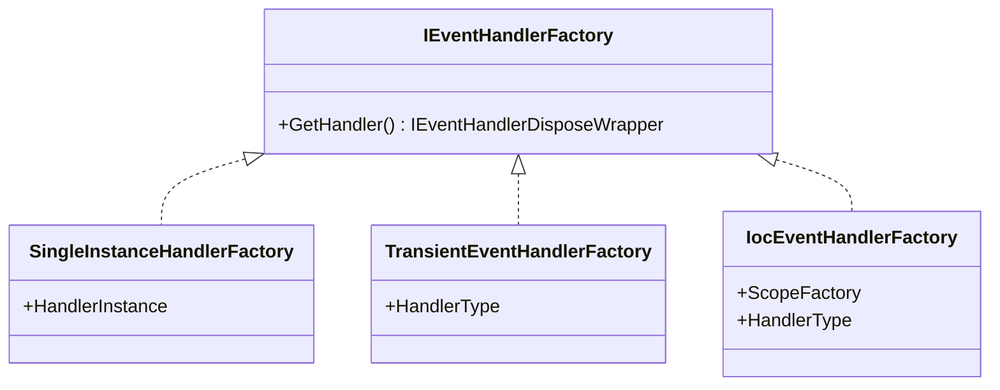

`Volo.Abp.EventBus` is the heart of the ABP Framework messaging stack. It
publishes the contracts every higher-level package consumes
(`IEventBus`, `IEventHandler`, `IDistributedEventBus`, …), supplies the
shared base class `EventBusBase`, and hosts the background workers that
drive the outbox/inbox. This page focuses on what lives inside
`framework/src/Volo.Abp.EventBus/` and the sibling
`Volo.Abp.EventBus.Abstractions/` project.

## Module composition

`AbpEventBusModule` is the entry point. It depends on the abstractions
module, multi-tenancy, JSON, GUID, background workers, and the
distributed locking abstractions — exactly what the rest of the stack
needs to dispatch events safely.

```csharp
// framework/src/Volo.Abp.EventBus/Volo/Abp/EventBus/AbpEventBusModule.cs
[DependsOn(
    typeof(AbpEventBusAbstractionsModule),
    typeof(AbpMultiTenancyModule),
    typeof(AbpJsonModule),
    typeof(AbpGuidsModule),
    typeof(AbpBackgroundWorkersModule),
    typeof(AbpDistributedLockingAbstractionsModule)
)]
public class AbpEventBusModule : AbpModule
{
    public override void PreConfigureServices(ServiceConfigurationContext context)
    {
        AddEventHandlers(context.Services);
    }

    public async override Task OnApplicationInitializationAsync(
        ApplicationInitializationContext context)
    {
        await context.AddBackgroundWorkerAsync<OutboxSenderManager>();
        await context.AddBackgroundWorkerAsync<InboxProcessManager>();
    }
}
```

`PreConfigureServices` inspects every registered service via
`services.OnRegistered(...)` and, when the implementation type implements
`ILocalEventHandler<>` or `IDistributedEventHandler<>`, adds it to the
matching options bag:

```csharp
services.Configure<AbpLocalEventBusOptions>(o =>
    o.Handlers.AddIfNotContains(localHandlers));

services.Configure<AbpDistributedEventBusOptions>(o =>
    o.Handlers.AddIfNotContains(distributedHandlers));
```

That is why simply marking a class `ILocalEventHandler<MyEvent>` and
making it transient (or any other lifestyle) is enough to subscribe to
the event — `LocalEventBus` and the distributed bus iterate
`Options.Handlers` in their constructors.

## The `IEventBus` contract

Defined in
`framework/src/Volo.Abp.EventBus.Abstractions/Volo/Abp/EventBus/IEventBus.cs`,
the contract has three flavors of publish and a rich subscribe surface:

```csharp
// Typed publish
Task PublishAsync<TEvent>(TEvent eventData, bool onUnitOfWorkComplete = true)
    where TEvent : class;

// Reflected publish — useful for generic dispatch
Task PublishAsync(Type eventType, object eventData, bool onUnitOfWorkComplete = true);

// String-keyed dynamic publish
Task PublishAsync(string eventName, object eventData, bool onUnitOfWorkComplete = true);
```

The `onUnitOfWorkComplete` flag is what makes ABP's event publishing safe
to call inside an application service. When `true` (the default) and an
ambient `IUnitOfWork` exists, the event is staged in
`UnitOfWorkEventRecord` collections and flushed by
`UnitOfWorkEventPublisher` after the unit of work completes successfully.

```csharp
// framework/src/Volo.Abp.EventBus/Volo/Abp/EventBus/UnitOfWorkEventPublisher.cs
public async Task PublishLocalEventsAsync(IEnumerable<UnitOfWorkEventRecord> localEvents)
{
    foreach (var localEvent in localEvents)
    {
        await _localEventBus.PublishAsync(
            localEvent.EventType,
            localEvent.EventData,
            onUnitOfWorkComplete: false);
    }
}
```

Subscribe overloads cover three resolution strategies:

| Strategy | Factory | When to use |
| --- | --- | --- |
| Same singleton instance | `SingleInstanceHandlerFactory` | Subscribing an already-instantiated handler or lambda. |
| New instance per call | `TransientEventHandlerFactory<THandler>` | The `Subscribe<TEvent, THandler>()` overload. |
| Resolved from DI | `IocEventHandlerFactory` | Used internally for classes discovered via `Options.Handlers`. |

## Handler interfaces

`IEventHandler` is the empty marker interface. Implementations choose one
of the two strongly-typed contracts:

```csharp
// framework/src/Volo.Abp.EventBus.Abstractions/Volo/Abp/EventBus/Local/ILocalEventHandler.cs
public interface ILocalEventHandler<in TEvent> : IEventHandler
{
    Task HandleEventAsync(TEvent eventData);
}

// framework/src/Volo.Abp.EventBus.Abstractions/Volo/Abp/EventBus/Distributed/IDistributedEventHandler.cs
public interface IDistributedEventHandler<in TEvent> : IEventHandler
{
    Task HandleEventAsync(TEvent eventData);
}
```

Both methods return `Task`. The same class is free to implement both
interfaces — the event bus will register it against both
`ILocalEventBus` and `IDistributedEventBus`.

## `EventBusBase`: the shared pipeline

`EventBusBase` (in
`framework/src/Volo.Abp.EventBus/Volo/Abp/EventBus/EventBusBase.cs`)
implements every subscribe/unsubscribe overload, leaving only the
storage and transport details abstract. Every concrete bus inherits from
it, directly or through `DistributedEventBusBase`.

The constructor receives the cross-cutting services every handler
invocation needs:

```csharp
protected EventBusBase(
    IServiceScopeFactory serviceScopeFactory,
    ICurrentTenant currentTenant,
    IUnitOfWorkManager unitOfWorkManager,
    IEventHandlerInvoker eventHandlerInvoker)
```

That gives every derived bus access to:

- `ServiceScopeFactory` — to resolve handlers through `IocEventHandlerFactory`.
- `CurrentTenant` — multi-tenant publishers and consumers switch tenants
  before invoking handlers.
- `UnitOfWorkManager` — for the unit-of-work-aware publish path.
- `EventHandlerInvoker` — turns the boxed `(handler, eventData)` pair
  into a `HandleEventAsync` call.

### The publish path

The default implementation collapses every overload into
`PublishAsync(Type, object, bool)`:

```csharp
public Task PublishAsync<TEvent>(TEvent eventData, bool onUnitOfWorkComplete = true)
    where TEvent : class
    => PublishAsync(typeof(TEvent), eventData, onUnitOfWorkComplete);

public virtual async Task PublishAsync(
    Type eventType,
    object eventData,
    bool onUnitOfWorkComplete = true)
{
    if (onUnitOfWorkComplete && UnitOfWorkManager.Current != null)
    {
        // Stage on the UoW; published by UnitOfWorkEventPublisher
        ...
        return;
    }

    await PublishToEventBusAsync(eventType, eventData);
}
```

Concrete buses override `PublishToEventBusAsync` to do the actual fan-out
(memory dispatch for `LocalEventBus`, broker publish for the distributed
buses).

## `IEventHandlerInvoker`

The invoker decouples the bus from the handler's generic shape — it
caches one delegate per `(handlerType, eventType)` pair:

```csharp
// framework/src/Volo.Abp.EventBus/Volo/Abp/EventBus/EventHandlerInvoker.cs
public class EventHandlerInvoker : IEventHandlerInvoker, ISingletonDependency
{
    public async Task InvokeAsync(IEventHandler eventHandler, object eventData, Type eventType)
    {
        var cacheItem = _cache.GetOrAdd(
            $"{eventHandler.GetType().FullName}-{eventType.FullName}", _ =>
        {
            var item = new EventHandlerInvokerCacheItem();

            if (typeof(ILocalEventHandler<>).MakeGenericType(eventType)
                    .IsInstanceOfType(eventHandler))
            {
                item.Local = ...;
            }

            if (typeof(IDistributedEventHandler<>).MakeGenericType(eventType)
                    .IsInstanceOfType(eventHandler))
            {
                item.Distributed = ...;
            }

            return item;
        });
        ...
    }
}
```

`EventHandlerInvokerCacheItem` stores an `IEventHandlerMethodExecutor`
that wraps `Activator.CreateInstance(typeof(LocalEventHandlerMethodExecutor<>)
.MakeGenericType(eventType))`. The reflection cost is paid once per type
pair.

## The event type registry

ABP keeps a name → CLR-type mapping so dynamic publishes and broker
messages can resolve the right type when no compile-time knowledge is
available. Each concrete bus stores its own `ConcurrentDictionary<string, Type>`
named `EventTypes`, populated whenever a handler is subscribed:

```csharp
// LocalEventBus.Subscribe(Type, IEventHandlerFactory)
EventTypes.GetOrAdd(EventNameAttribute.GetNameOrDefault(eventType), eventType);
```

The key comes from `EventNameAttribute`:

```csharp
// framework/src/Volo.Abp.EventBus.Abstractions/Volo/Abp/EventBus/EventNameAttribute.cs
[AttributeUsage(AttributeTargets.Class)]
public class EventNameAttribute : Attribute, IEventNameProvider
{
    public virtual string Name { get; }

    public static string GetNameOrDefault(Type eventType)
        => (eventType.GetCustomAttributes(true)
                .OfType<IEventNameProvider>()
                .FirstOrDefault()
                ?.GetName(eventType)
            ?? eventType.FullName)!;
}
```

Decorate the event class:

```csharp
[EventName("acme.shop.order-placed")]
public class OrderPlacedEto { /* ... */ }
```

…and the publisher writes that string into the broker headers (RabbitMQ
routing key, Kafka message key, Azure Service Bus `Subject`, etc.). At
the receiving side, the consumer looks the name up in `EventTypes` to
find the CLR type and deserialize the payload. Without the attribute,
ABP falls back to the type's `FullName`, which is fine inside one
codebase but fragile across services.

`GenericEventNameAttribute` extends this for generic events such as
`EntityCreatedEto<T>` — see
`framework/src/Volo.Abp.EventBus.Abstractions/Volo/Abp/EventBus/GenericEventNameAttribute.cs`.

## Options bags

Three options classes describe the static configuration of the core bus.

<Tabs>
  <Tab title="AbpLocalEventBusOptions">
    ```csharp
    // framework/src/Volo.Abp.EventBus/Volo/Abp/EventBus/Local/AbpLocalEventBusOptions.cs
    public class AbpLocalEventBusOptions
    {
        public ITypeList<IEventHandler> Handlers { get; }

        public AbpLocalEventBusOptions()
        {
            Handlers = new TypeList<IEventHandler>();
        }
    }
    ```

    Populated automatically from DI scanning; you can also add a handler
    type manually:

    ```csharp
    Configure<AbpLocalEventBusOptions>(o =>
        o.Handlers.Add<UserCreatedLocalHandler>());
    ```
  </Tab>
  <Tab title="AbpDistributedEventBusOptions">
    ```csharp
    public class AbpDistributedEventBusOptions
    {
        public ITypeList<IEventHandler> Handlers { get; }
        public OutboxConfigDictionary Outboxes { get; }
        public InboxConfigDictionary Inboxes { get; }
    }
    ```

    `Handlers` mirrors the local version; `Outboxes` and `Inboxes` are
    the configuration surface for the transactional outbox/inbox.
  </Tab>
  <Tab title="AbpEventBusBoxesOptions">
    ```csharp
    public class AbpEventBusBoxesOptions
    {
        public TimeSpan CleanOldEventTimeIntervalSpan { get; set; } // 6h
        public int InboxWaitingEventMaxCount { get; set; }          // 1000
        public int OutboxWaitingEventMaxCount { get; set; }         // 1000
        public TimeSpan PeriodTimeSpan { get; set; }                // 2s
        public InboxProcessorFailurePolicy InboxProcessorFailurePolicy { get; set; }
        public int InboxProcessorMaxRetryCount { get; set; } = 10;
        public double InboxProcessorRetryBackoffFactor { get; set; } = 10;
        public TimeSpan DistributedLockWaitDuration { get; set; }   // 15s
        public TimeSpan WaitTimeToDeleteProcessedInboxEvents { get; set; } // 2h
        public bool BatchPublishOutboxEvents { get; set; }          // true
    }
    ```

    Tunes the polling cadence and retry behaviour of
    `OutboxSenderManager` / `InboxProcessManager`.
  </Tab>
</Tabs>

## Background workers

`AbpEventBusModule.OnApplicationInitializationAsync` registers two
workers — even if you never use the outbox they are idle no-ops because
they iterate empty `Options.Outboxes` / `Options.Inboxes` dictionaries.

```csharp
public async override Task OnApplicationInitializationAsync(...)
{
    await context.AddBackgroundWorkerAsync<OutboxSenderManager>();
    await context.AddBackgroundWorkerAsync<InboxProcessManager>();
}
```

Internally each manager iterates its config dictionary and resolves a
new `IOutboxSender` / `IInboxProcessor` per entry:

```csharp
// framework/src/Volo.Abp.EventBus/Volo/Abp/EventBus/Distributed/InboxProcessManager.cs
foreach (var inboxConfig in Options.Inboxes.Values)
{
    if (inboxConfig.IsProcessingEnabled)
    {
        var processor = ServiceProvider.GetRequiredService<IInboxProcessor>();
        await processor.StartAsync(inboxConfig, cancellationToken);
        Processors.Add(processor);
    }
}
```

The actual `InboxProcessor` and `OutboxSender` implementations live in
`framework/src/Volo.Abp.EventBus/Volo/Abp/EventBus/Distributed/` and are
covered in detail on [Distributed Event Bus](/events/distributed-event-bus).

## Handler factories

Three factory implementations cover every registration mode:



The wrapper returned from `GetHandler()` carries an optional dispose
delegate so `IocEventHandlerFactory` can dispose the service scope
after the handler runs.

## Putting it all together

A minimal handler in your domain layer looks like:

```csharp
public class WelcomeEmailHandler :
    ILocalEventHandler<UserCreatedEvent>,
    ITransientDependency
{
    public Task HandleEventAsync(UserCreatedEvent eventData) { ... }
}
```

Because the class is registered with DI, the conventional-registration
hook in `AbpEventBusModule` adds it to `AbpLocalEventBusOptions.Handlers`,
`LocalEventBus`'s constructor calls `SubscribeHandlers`, and the next
`PublishAsync<UserCreatedEvent>(...)` dispatches the event through
`EventHandlerInvoker.InvokeAsync`.

<Tip>
  Want both in-process and broker delivery for the same event? Implement
  both `ILocalEventHandler<T>` and `IDistributedEventHandler<T>` — the
  registration scanner adds the type to both options bags, and the local
  bus / distributed bus each subscribe it once.
</Tip>

Continue with the bus-specific pages:

<CardGroup cols={2}>
  <Card title="Local Event Bus" icon="microchip" href="/events/local-event-bus">
    `LocalEventBus`, the entity change pipeline, ordering, and tests.
  </Card>
  <Card title="Distributed Event Bus" icon="network-wired" href="/events/distributed-event-bus">
    Outbox/inbox, ETO mapping, and the default `LocalDistributedEventBus`.
  </Card>
</CardGroup>
