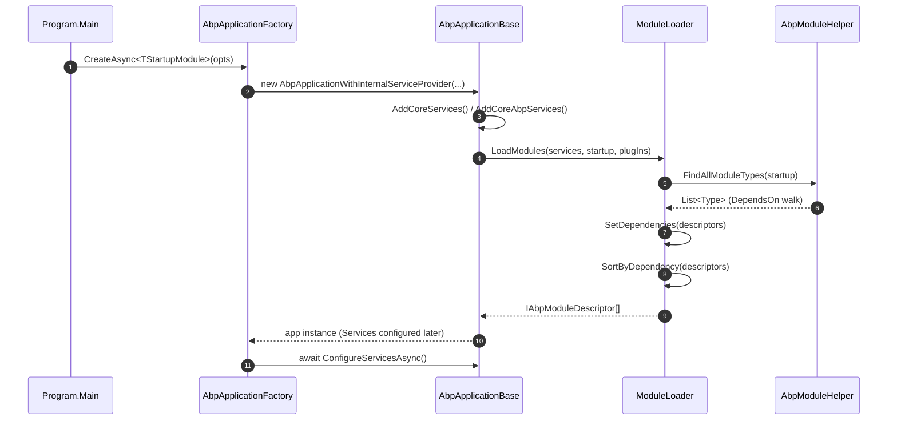
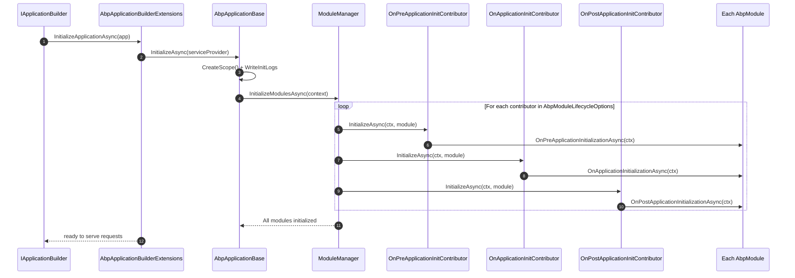

ABP Framework boots in two macro phases: build-the-graph (compose-time) and run-the-graph (runtime). The compose-time phase is orchestrated by `AbpApplicationFactory.CreateAsync` in [`framework/src/Volo.Abp.Core/Volo/Abp/AbpApplicationFactory.cs`](https://github.com/abpframework/abp/blob/dev/framework/src/Volo.Abp.Core/Volo/Abp/AbpApplicationFactory.cs); the runtime phase is driven by `InitializeApplicationAsync` in [`framework/src/Volo.Abp.AspNetCore/Microsoft/AspNetCore/Builder/AbpApplicationBuilderExtensions.cs`](https://github.com/abpframework/abp/blob/dev/framework/src/Volo.Abp.AspNetCore/Microsoft/AspNetCore/Builder/AbpApplicationBuilderExtensions.cs).

<Note>
Every method named here lives in the ABP source tree under `framework/src/`. Where the page calls out a class, the citation in the next sentence pinpoints the exact file.
</Note>

## The Two-Phase Boot

`AbpApplicationFactory.CreateAsync<TStartupModule>` (see `framework/src/Volo.Abp.Core/Volo/Abp/AbpApplicationFactory.cs`) flips `SkipConfigureServices = true` on the options before constructing an `AbpApplicationWithInternalServiceProvider` or `AbpApplicationWithExternalServiceProvider`, then calls `await app.ConfigureServicesAsync()` explicitly. The constructor sequence inside `AbpApplicationBase` (see `framework/src/Volo.Abp.Core/Volo/Abp/AbpApplicationBase.cs`) registers `IAbpApplication`, `IApplicationInfoAccessor`, `IModuleContainer`, and an `AbpHostEnvironment`, calls `services.AddCoreServices()` and `services.AddCoreAbpServices(this, options)`, and finally invokes `LoadModules(services, options)` before optionally running `ConfigureServices()` synchronously.

`InitializeApplicationAsync` is the runtime counterpart: the extension method in `framework/src/Volo.Abp.AspNetCore/Microsoft/AspNetCore/Builder/AbpApplicationBuilderExtensions.cs` resolves the `IAbpApplicationWithExternalServiceProvider` from `app.ApplicationServices`, registers callbacks against `IHostApplicationLifetime.ApplicationStopping`/`ApplicationStopped` to call `ShutdownAsync`, and finally calls `await application.InitializeAsync(app.ApplicationServices)`, which dispatches into `AbpApplicationBase.InitializeModulesAsync` (same file). That method creates an `IServiceScope`, writes any buffered init logs via `IInitLoggerFactory`, then asks `IModuleManager` to walk every module.

<CardGroup cols={2}>
  <Card title="Compose-time" icon="hammer">
    `AbpApplicationFactory` → constructor → `LoadModules` → `ConfigureServicesAsync` (Pre/Configure/Post).
  </Card>
  <Card title="Run-time" icon="play">
    `InitializeApplicationAsync` → `InitializeModulesAsync` → three `IModuleLifecycleContributor`s run in registration order.
  </Card>
</CardGroup>

## Module Discovery: `ModuleLoader` and `DependsOnAttribute`

`AbpApplicationBase.LoadModules` (see `framework/src/Volo.Abp.Core/Volo/Abp/AbpApplicationBase.cs`) reaches into the `IServiceCollection` for the singleton `IModuleLoader` and calls `LoadModules(services, StartupModuleType, options.PlugInSources)`. The default implementation, `ModuleLoader` in `framework/src/Volo.Abp.Core/Volo/Abp/Modularity/ModuleLoader.cs`, does three things: `GetDescriptors`, `SetDependencies`, and `SortByDependency`. The descriptor list is built by `FillModules`, which calls `AbpModuleHelper.FindAllModuleTypes(startupModuleType, logger)` (see `framework/src/Volo.Abp.Core/Volo/Abp/Modularity/AbpModuleHelper.cs`) to recursively follow `[DependsOn(typeof(...))]` annotations on each module class.

For each discovered type the loader calls `CreateAndRegisterModule`, which uses `Activator.CreateInstance(moduleType)` and registers the singleton via `services.AddSingleton(moduleType, module)` — meaning module instances exist in DI before any `ConfigureServices` runs (see `framework/src/Volo.Abp.Core/Volo/Abp/Modularity/ModuleLoader.cs`). `SetDependencies` then iterates each module and reads `AbpModuleHelper.FindDependedModuleTypes(module.Type)` to wire `AbpModuleDescriptor.AddDependency`. Plug-ins from `PlugInSourceList` are appended last but de-duplicated.

`SortByDependency` calls the extension `SortByDependencies(m => m.Dependencies)` (a topological sort) and then `MoveItem(m => m.Type == startupModuleType, modules.Count - 1)` so the startup module is always last in initialization order (see `framework/src/Volo.Abp.Core/Volo/Abp/Modularity/ModuleLoader.cs`). This guarantees that the framework modules a developer's startup module depends on configure and initialize *before* the application's own module gets its turn.

## ConfigureServices: Pre, Configure, Post

`AbpApplicationBase.ConfigureServicesAsync` in `framework/src/Volo.Abp.Core/Volo/Abp/AbpApplicationBase.cs` calls `CheckMultipleConfigureServices`, instantiates a `ServiceConfigurationContext(Services)`, registers it as a singleton, and attaches it to every `AbpModule.ServiceConfigurationContext` so any module can reach it from inside its overrides.

The first pass iterates `Modules.Where(m => m.Instance is IPreConfigureServices)` and awaits `PreConfigureServicesAsync(context)` on each. The contract is in `framework/src/Volo.Abp.Core/Volo/Abp/Modularity/IPreConfigureServices.cs`. Modules use this pass to mutate options that *other* modules will read during their main configure pass — for example, registering authentication handlers that another module later inspects.

The second pass walks **every** module in dependency order. For each `AbpModule` whose `SkipAutoServiceRegistration` is false, the framework calls `Services.AddAssembly(assembly)` for every assembly returned by `module.AllAssemblies` — this is how `[Dependency]`, `[ExposeServices]`, and conventional registrations (Transient/Scoped/Singleton interfaces) get scanned. Then it awaits `module.Instance.ConfigureServicesAsync(context)`. Any throw is wrapped in `AbpInitializationException` naming the failing module's `AssemblyQualifiedName`.

The third pass walks `Modules.Where(m => m.Instance is IPostConfigureServices)` and awaits `PostConfigureServicesAsync(context)`. After all three passes complete, the framework clears `ServiceConfigurationContext` from each module (setting it to `null!`), sets `_configuredServices = true`, and calls `TryToSetEnvironment(Services)`.

<Warning>
A second call to `ConfigureServices` throws `AbpInitializationException("Services have already been configured!")` from `CheckMultipleConfigureServices` (see `framework/src/Volo.Abp.Core/Volo/Abp/AbpApplicationBase.cs`). If you call `AbpApplicationFactory.CreateAsync` and later want a manual configure step, set `SkipConfigureServices = true` — that is exactly what `CreateAsync` does internally before awaiting `ConfigureServicesAsync`.
</Warning>

## Lifecycle Contributors

`ModuleManager.InitializeModulesAsync` in `framework/src/Volo.Abp.Core/Volo/Abp/Modularity/ModuleManager.cs` is a tight double-loop: `foreach (var contributor in _lifecycleContributors) foreach (var module in _moduleContainer.Modules)`. That means *all* modules receive `OnPreApplicationInitialization` before *any* module receives `OnApplicationInitialization`. The contributor list is materialized in the constructor by reading `IOptions<AbpModuleLifecycleOptions>.Value.Contributors` and resolving each `Type` from the scope's `IServiceProvider`.

The defaults are registered in `framework/src/Volo.Abp.Core/Volo/Abp/Internal/InternalServiceCollectionExtensions.cs` via `services.Configure<AbpModuleLifecycleOptions>(options => { ... })`:

<Steps>
  <Step title="OnPreApplicationInitializationModuleLifecycleContributor">
    Fires `IOnPreApplicationInitialization.OnPreApplicationInitializationAsync` (see `framework/src/Volo.Abp.Core/Volo/Abp/Modularity/DefaultModuleLifecycleContributor.cs`). Typically used to wire request-pipeline pre-conditions.
  </Step>
  <Step title="OnApplicationInitializationModuleLifecycleContributor">
    Fires `IOnApplicationInitialization.OnApplicationInitializationAsync` — where `AbpModule.OnApplicationInitialization` overrides usually live (e.g. `app.UseRouting()`, `app.UseAuthorization()`).
  </Step>
  <Step title="OnPostApplicationInitializationModuleLifecycleContributor">
    Fires `IOnPostApplicationInitialization.OnPostApplicationInitializationAsync`. Used for work that must run after every module's main init: seeding, warm-up, background-worker `StartAsync`.
  </Step>
  <Step title="OnApplicationShutdownModuleLifecycleContributor">
    Mirror image: walks modules in reverse via `ModuleManager.ShutdownModulesAsync` and calls `IOnApplicationShutdown.OnApplicationShutdownAsync` (same file).
  </Step>
</Steps>

`DefaultModuleLifecycleContributor.cs` (in `framework/src/Volo.Abp.Core/Volo/Abp/Modularity/`) shows each contributor pattern: each `InitializeAsync` does `if (module is IOnXxxApplicationInitialization x) await x.OnXxxApplicationInitializationAsync(context);` — a soft cast, no error if the module does not implement the interface. This is why a module that only needs ConfigureServices can omit lifecycle overrides entirely.

## The `ApplicationInitializationContext`

The context passed into every initialization contributor is `ApplicationInitializationContext`, defined in `framework/src/Volo.Abp.Core/Volo/Abp/ApplicationInitializationContext.cs`. It wraps the `IServiceProvider` of the init scope and exposes `GetEnvironment()` and `GetConfiguration()` extension methods. Modules typically resolve `IApplicationBuilder` via `context.GetApplicationBuilder()` (an extension declared in `framework/src/Volo.Abp.AspNetCore/`) and chain `UseXxx()` calls — the `ObjectAccessor<IApplicationBuilder>` was filled in by `InitializeApplicationAsync` *before* the init began (see `framework/src/Volo.Abp.AspNetCore/Microsoft/AspNetCore/Builder/AbpApplicationBuilderExtensions.cs`).

The same factory file also populates `ObjectAccessor<WebApplication>`, `ObjectAccessor<IHost>`, and `ObjectAccessor<IEndpointRouteBuilder>` when the underlying `IApplicationBuilder` implements those interfaces. This is the back-channel that makes `context.GetApplicationBuilder()` work from inside an `AbpModule.OnApplicationInitialization` that did not itself receive the builder.

## Plug-In Sources

`AbpApplicationCreationOptions.PlugInSources` (see `framework/src/Volo.Abp.Core/Volo/Abp/AbpApplicationCreationOptions.cs`) is a `PlugInSourceList`. `ModuleLoader.FillModules` calls `plugInSources.GetAllModules(logger)` and, for any module not already in the descriptor list, calls `CreateModuleDescriptor(services, moduleType, isLoadedAsPlugIn: true)` (see `framework/src/Volo.Abp.Core/Volo/Abp/Modularity/ModuleLoader.cs`). Plug-in modules participate in the dependency sort the same way startup-graph modules do, except the `IsLoadedAsPlugIn` flag on their descriptor lets modules differentiate at runtime if they need to.

<Tip>
`PlugInSources` understands folder-based and type-based plug-in discovery via the implementations in `framework/src/Volo.Abp.Core/Volo/Abp/Modularity/PlugIns/`. The two phases above never special-case plug-ins beyond that descriptor flag — once discovered, plug-ins go through the exact same `ConfigureServicesAsync` and `InitializeModulesAsync` pipeline.
</Tip>

## Shutdown is Symmetric

`AbpApplicationBase.ShutdownAsync` (see `framework/src/Volo.Abp.Core/Volo/Abp/AbpApplicationBase.cs`) creates a scope and calls `IModuleManager.ShutdownModulesAsync(new ApplicationShutdownContext(scope.ServiceProvider))`. Inside `ModuleManager.ShutdownModulesAsync` the modules are walked in **reverse** order (`_moduleContainer.Modules.Reverse().ToList()`), and the only lifecycle contributor invoked during shutdown is `OnApplicationShutdownModuleLifecycleContributor`. Each call is wrapped in a try/catch that promotes failures to `AbpShutdownException`.

`InitializeApplicationAsync` arranges this by hooking `applicationLifetime.ApplicationStopping.Register(() => AsyncHelper.RunSync(() => application.ShutdownAsync()))`. The shutdown therefore runs as part of ASP.NET Core's graceful shutdown window — finite, time-bound, and observable through health checks.

## Telemetry Side Channel

`AbpApplicationBase.SetupTelemetryTrackingAsync` (see `framework/src/Volo.Abp.Core/Volo/Abp/AbpApplicationBase.cs`) is invoked by the internal-service-provider variant after `InitializeModulesAsync`. The helper `ShouldSendTelemetryData()` checks `IAbpHostEnvironment.IsDevelopment()` and `configuration["Abp:Telemetry:IsEnabled"] != false`, then resolves `ITelemetryService` and calls `AddActivityAsync(ActivityNameConsts.ApplicationRun)`. Failures are swallowed via the `IInitLoggerFactory` to avoid impacting startup.

## Failure Modes

<AccordionGroup>
  <Accordion title="Missing DependsOn target">
    `ModuleLoader.SetDependencies` (see `framework/src/Volo.Abp.Core/Volo/Abp/Modularity/ModuleLoader.cs`) throws `AbpException("Could not find a depended module ...")` if a `[DependsOn(typeof(X))]` cannot be resolved during `FindDependedModuleTypes`. This usually means an assembly was not referenced.
  </Accordion>
  <Accordion title="Configure-phase exception">
    Wrapped in `AbpInitializationException` by `ConfigureServicesAsync` (see `framework/src/Volo.Abp.Core/Volo/Abp/AbpApplicationBase.cs`). The message identifies the module's `AssemblyQualifiedName` and the phase (`PreConfigureServicesAsync` / `ConfigureServicesAsync` / `PostConfigureServicesAsync`).
  </Accordion>
  <Accordion title="Initialize-phase exception">
    `ModuleManager.InitializeModulesAsync` (see `framework/src/Volo.Abp.Core/Volo/Abp/Modularity/ModuleManager.cs`) wraps each contributor call. The error names the contributor type (e.g. `OnApplicationInitializationModuleLifecycleContributor`) and the failing module.
  </Accordion>
  <Accordion title="Double ConfigureServices">
    `CheckMultipleConfigureServices` throws `AbpInitializationException("Services have already been configured! ...")`. Set `AbpApplicationCreationOptions.SkipConfigureServices = true` and explicitly call `ConfigureServicesAsync` instead.
  </Accordion>
</AccordionGroup>

## Wiring Recap

The end-to-end wiring for an ASP.NET Core host using `WebApplicationBuilder`:

1. `builder.Services.AddApplicationAsync<TStartupModule>()` (in `framework/src/Volo.Abp.AspNetCore/Microsoft/Extensions/DependencyInjection/`) calls `AbpApplicationFactory.CreateAsync<TStartupModule>(builder.Services, ...)`.
2. That triggers the three Configure phases described above (`framework/src/Volo.Abp.Core/Volo/Abp/AbpApplicationBase.cs`).
3. `builder.Build()` materializes the `IServiceProvider` and constructs the `WebApplication`.
4. `await app.InitializeApplicationAsync()` (in `framework/src/Volo.Abp.AspNetCore/Microsoft/AspNetCore/Builder/AbpApplicationBuilderExtensions.cs`) registers lifetime hooks and drives the three Initialize phases.
5. `app.Run()` accepts requests; each request is then handled by the middleware pipeline that the modules' `OnApplicationInitialization` overrides composed.

For the request-side, continue to the **Request Lifecycle** page; for module deep-dives, see the modules-and-DI section.
