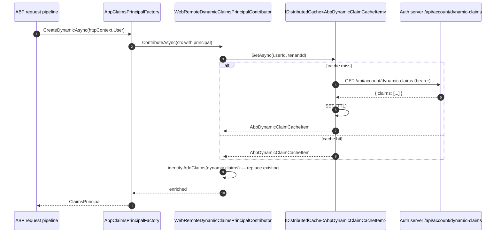
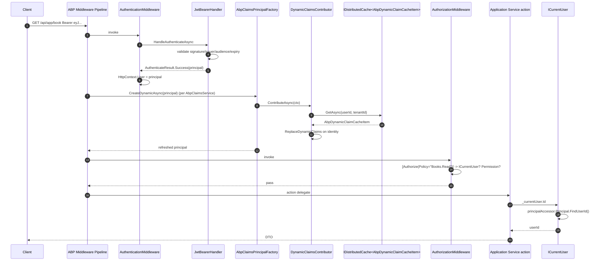

ABP Framework does not replace ASP.NET Core's authentication primitives; it composes on top of them. `AddAbpJwtBearer` and `AddAbpOpenIdConnect` are thin wrappers around `AddJwtBearer` / `AddOpenIdConnect` that plumb ABP's claims-principal pipeline into the standard handlers. The runtime read side is `ICurrentUser`. Source lives under [`framework/src/Volo.Abp.AspNetCore.Authentication.JwtBearer/`](https://github.com/abpframework/abp/tree/dev/framework/src/Volo.Abp.AspNetCore.Authentication.JwtBearer), [`framework/src/Volo.Abp.AspNetCore.Authentication.OpenIdConnect/`](https://github.com/abpframework/abp/tree/dev/framework/src/Volo.Abp.AspNetCore.Authentication.OpenIdConnect), and [`framework/src/Volo.Abp.Security/`](https://github.com/abpframework/abp/tree/dev/framework/src/Volo.Abp.Security).

<Note>
There are two reading paths after authentication: synchronous `ICurrentUser` (claim-only) and asynchronous claim-enrichment via `IAbpClaimsPrincipalFactory.CreateAsync(...)` / `CreateDynamicAsync(...)`. The first is fast, the second can hit the database or a remote endpoint.
</Note>

## JWT Bearer Setup

`AbpJwtBearerExtensions.AddAbpJwtBearer` in `framework/src/Volo.Abp.AspNetCore.Authentication.JwtBearer/Microsoft/Extensions/DependencyInjection/AbpJwtBearerExtensions.cs` wraps `AddJwtBearer`:

```csharp
public static AuthenticationBuilder AddAbpJwtBearer(this AuthenticationBuilder builder,
    string authenticationScheme, string displayName, Action<JwtBearerOptions> configureOptions)
{
    builder.Services.Configure<AbpClaimsPrincipalFactoryOptions>(options =>
    {
        var jwtBearerOption = new JwtBearerOptions();
        configureOptions?.Invoke(jwtBearerOption);
        if (!jwtBearerOption.Authority.IsNullOrEmpty())
        {
            options.RemoteRefreshUrl = jwtBearerOption.Authority.RemovePostFix("/") + options.RemoteRefreshUrl;
        }
    });

    return builder.AddJwtBearer(authenticationScheme, displayName, options =>
    {
        configureOptions?.Invoke(options);
        options.Events ??= new JwtBearerEvents();
        var previousOnChallenge = options.Events.OnChallenge;
        options.Events.OnChallenge = async eventContext =>
        {
            await previousOnChallenge(eventContext);
            // copy AbpAspNetCoreTokenUnauthorizedErrorInfo into eventContext.Error / ErrorDescription / ErrorUri
        };
    });
}
```

Two side effects: (1) the `AbpClaimsPrincipalFactoryOptions.RemoteRefreshUrl` is prefixed with the issuer authority so dynamic-claims refresh can call back to the auth server; (2) `OnChallenge` is augmented to propagate `AbpAspNetCoreTokenUnauthorizedErrorInfo` (a request-scoped DTO populated by ABP middleware/filters) into the WWW-Authenticate response so the client sees structured error info.

After this, ASP.NET Core's `JwtBearerHandler` does the actual JWT validation: signature against the IdP's JWKS, issuer match, audience match, expiry. The validated token's claims become the `ClaimsPrincipal` on `HttpContext.User`.

## The Token Middleware (Optional)

`ApplicationBuilderAbpJwtTokenMiddlewareExtension.UseJwtTokenMiddleware` (`framework/src/Volo.Abp.AspNetCore.Authentication.JwtBearer/Microsoft/AspNetCore/Builder/ApplicationBuilderAbpJwtTokenMiddlewareExtension.cs`) is an opt-in middleware for hosts that mix Cookie auth with JWT bearer:

```csharp
public static IApplicationBuilder UseJwtTokenMiddleware(this IApplicationBuilder app,
    string schema = JwtBearerDefaults.AuthenticationScheme)
{
    return app.Use(async (ctx, next) =>
    {
        if (ctx.User.Identity?.IsAuthenticated != true)
        {
            var result = await ctx.AuthenticateAsync(schema);
            if (result.Succeeded && result.Principal != null)
            {
                ctx.User = result.Principal;
            }
        }
        await next();
    });
}
```

This forces JWT evaluation even on routes that did not declare `[Authorize]` — needed when the same Razor page can be hit by both browser cookies and API tokens (Blazor Server scenarios).

## OpenIdConnect Code Flow

`AbpOpenIdConnectExtensions.AddAbpOpenIdConnect` in `framework/src/Volo.Abp.AspNetCore.Authentication.OpenIdConnect/Microsoft/Extensions/DependencyInjection/AbpOpenIdConnectExtensions.cs` is richer:

<Steps>
  <Step title="Configure remote refresh URL">
    `Services.Configure<AbpClaimsPrincipalFactoryOptions>(options => options.RemoteRefreshUrl = openIdConnectOptions.Authority.RemovePostFix("/") + options.RemoteRefreshUrl)` — same trick as JWT bearer.
  </Step>
  <Step title="Map ABP claim types">
    `options.ClaimActions.MapAbpClaimTypes()` — registered ID-token claim mappings so OIDC's `oid`/`sub`/`unique_name` land on `AbpClaimTypes.UserId`/`UserName`/etc.
  </Step>
  <Step title="OnAuthorizationCodeReceived">
    Wraps the previous handler and calls `SetAbpTenantId(receivedContext)` which reads the `__tenant` cookie (key from `IOptions<AbpAspNetCoreMultiTenancyOptions>.Value.TenantKey`) and adds it to the `TokenEndpointRequest` as a body parameter. The auth server will receive the tenant and issue a tenant-scoped token.
  </Step>
  <Step title="OnTokenValidated">
    Resolves `IOpenIdLocalUserCreationClient` (`framework/src/Volo.Abp.AspNetCore.Authentication.OpenIdConnect/Volo/Abp/AspNetCore/Authentication/OpenIdConnect/OpenIdLocalUserCreationClient.cs`) and calls `client.CreateOrUpdateAsync(context)` — local-user shadow creation so the app has a row for the remote user. Then reads `culture` / `ui-culture` params and stamps them onto the response via `AbpRequestCultureCookieHelper.SetCultureCookie`.
  </Step>
  <Step title="PushedAuthorizationBehavior">
    Default `PushedAuthorizationBehavior.Disable` — opt-in once the OpenIddict server grants the `PushedAuthorization` permission to the client.
  </Step>
</Steps>

```mermaid
sequenceDiagram
    autonumber
    participant Browser
    participant App as MVC/Razor App
    participant OIDC as OpenIdConnectHandler
    participant Auth as OpenIddict Auth Server
    participant Loc as IOpenIdLocalUserCreationClient
    participant CPF as AbpClaimsPrincipalFactory
    Browser->>App: GET /protected
    App->>OIDC: Challenge → 302 to /connect/authorize
    Browser->>Auth: /connect/authorize?...
    Auth-->>Browser: login UI
    Browser->>Auth: submit credentials
    Auth-->>Browser: 302 to /signin-oidc?code=...
    Browser->>App: GET /signin-oidc?code=...
    App->>OIDC: handle code
    OIDC->>OIDC: OnAuthorizationCodeReceived → SetAbpTenantId (read __tenant cookie)
    OIDC->>Auth: POST /connect/token (code+tenant)
    Auth-->>OIDC: id_token + access_token
    OIDC->>OIDC: validate id_token; ClaimActions.MapAbpClaimTypes
    OIDC->>Loc: OnTokenValidated → CreateOrUpdateAsync(ctx) (shadow user)
    OIDC->>OIDC: SignInAsync(cookie scheme, claimsPrincipal)
    OIDC-->>Browser: 302 /protected with cookie
    Browser->>App: GET /protected (cookie)
    App->>CPF: CreateAsync(existing principal) (when refresh needed)
    CPF-->>App: enriched ClaimsPrincipal
    App-->>Browser: 200 page
```

## Claims Principal Contributors

`AbpClaimsPrincipalFactory.InternalCreateAsync` (`framework/src/Volo.Abp.Security/Volo/Abp/Security/Claims/AbpClaimsPrincipalFactory.cs`) is the central enrichment point:

```csharp
public virtual async Task<ClaimsPrincipal> InternalCreateAsync(
    AbpClaimsPrincipalFactoryOptions options,
    ClaimsPrincipal? existsClaimsPrincipal = null,
    bool isDynamic = false)
{
    var claimsPrincipal = existsClaimsPrincipal ?? new ClaimsPrincipal(new ClaimsIdentity(
        AuthenticationType, AbpClaimTypes.UserName, AbpClaimTypes.Role));
    var context = new AbpClaimsPrincipalContributorContext(claimsPrincipal, ServiceProvider);

    if (!isDynamic)
    {
        foreach (var contributorType in options.Contributors)
        {
            var contributor = (IAbpClaimsPrincipalContributor)ServiceProvider.GetRequiredService(contributorType);
            await contributor.ContributeAsync(context);
        }
    }
    else
    {
        foreach (var contributorType in options.DynamicContributors)
        {
            var contributor = (IAbpDynamicClaimsPrincipalContributor)ServiceProvider.GetRequiredService(contributorType);
            await contributor.ContributeAsync(context);
        }
    }
    return context.ClaimsPrincipal;
}
```

Two contributor lists: `Contributors` runs on every full `CreateAsync` (login, token issuance). `DynamicContributors` runs on every `CreateDynamicAsync`, called per request when ABP needs to refresh fast-changing claims (permissions, roles after admin grants).

`AbpClaimsPrincipalFactoryOptions` (`framework/src/Volo.Abp.Security/Volo/Abp/Security/Claims/AbpClaimsPrincipalFactoryOptions.cs`) seeds `DynamicClaims = new List<string> { AbpClaimTypes.UserName, ... }` so the dynamic refresh round-trips only the volatile subset.

## Dynamic Claims Round-Trip

For Web hosts using JWT bearer (e.g. an MVC app calling APIs), the dynamic contributor is `WebRemoteDynamicClaimsPrincipalContributor` (`framework/src/Volo.Abp.AspNetCore.Authentication.JwtBearer/Volo/Abp/AspNetCore/Authentication/JwtBearer/DynamicClaims/WebRemoteDynamicClaimsPrincipalContributor.cs`):

```csharp
[DisableConventionalRegistration]
public class WebRemoteDynamicClaimsPrincipalContributor
    : RemoteDynamicClaimsPrincipalContributorBase<WebRemoteDynamicClaimsPrincipalContributor, WebRemoteDynamicClaimsPrincipalContributorCache>
{ }
```

The base `RemoteDynamicClaimsPrincipalContributorBase.ContributeAsync` (`framework/src/Volo.Abp.Security/Volo/Abp/Security/Claims/RemoteDynamicClaimsPrincipalContributorBase.cs`):

1. Finds the first `ClaimsIdentity` on the principal.
2. Reads `userId = identity.FindUserId()` and `tenantId = identity.FindTenantId()`.
3. `dynamicClaims = await dynamicClaimsCache.GetAsync(userId.Value, tenantId)` — cache uses `IDistributedCache<AbpDynamicClaimCacheItem>` so each node sees fresh data.
4. On exception (e.g. refresh URL down), clears the principal: `context.ClaimsPrincipal = new ClaimsPrincipal(new ClaimsIdentity())` and logs a warning. Subsequent authorization will fail closed.

The cache fetches from `AbpClaimsPrincipalFactoryOptions.RemoteRefreshUrl` (default `/api/account/dynamic-claims` on the auth server — see `framework/src/Volo.Abp.Account.Web/`).



## ICurrentUser: Read-Side Adapter

`CurrentUser` in `framework/src/Volo.Abp.Security/Volo/Abp/Users/CurrentUser.cs` is a transient that wraps `ICurrentPrincipalAccessor`:

```csharp
public class CurrentUser : ICurrentUser, ITransientDependency
{
    public virtual bool IsAuthenticated => Id.HasValue;
    public virtual Guid? Id => _principalAccessor.Principal?.FindUserId();
    public virtual string? UserName => this.FindClaimValue(AbpClaimTypes.UserName);
    public virtual string? Name => this.FindClaimValue(AbpClaimTypes.Name);
    public virtual string? Email => this.FindClaimValue(AbpClaimTypes.Email);
    public virtual bool EmailVerified => string.Equals(this.FindClaimValue(AbpClaimTypes.EmailVerified), "true", ...);
    // ...
}
```

Every property is a `FindClaimValue` over the underlying `ClaimsPrincipal`. `ICurrentPrincipalAccessor` (`framework/src/Volo.Abp.Security/Volo/Abp/Security/Claims/ICurrentPrincipalAccessor.cs`) is typically backed by `HttpContextCurrentPrincipalAccessor` (in `framework/src/Volo.Abp.AspNetCore/`) which reads `HttpContext.User`. For background work, `ThreadCurrentPrincipalAccessor` falls back to `Thread.CurrentPrincipal`. Modules wishing to *change* the current user temporarily call `using (currentPrincipalAccessor.Change(principal)) { ... }` — useful when an event handler needs to act as a specific user.

`AbpClaimTypes` (`framework/src/Volo.Abp.Security/Volo/Abp/Security/Claims/AbpClaimTypes.cs`) is the central naming registry. By default it maps to OpenIddict-friendly short names (`sub`, `name`, etc.); modules can rename via the static initialiser if integrating with a custom IdP.

## End-to-End Per-Request Sequence (JWT API)



## Multi-Identity Composition

A `ClaimsPrincipal` can carry multiple `ClaimsIdentity` instances. ABP exploits this for `CurrentPrincipalAccessorExtensions.Change(principal)` and for "impersonate as tenant" flows: the existing identity stays attached while a synthetic identity carrying `tenant_id` and shadow permissions is pushed on top. `CurrentUser.FindClaimValue` enumerates *all* identities until it finds the claim, so impersonation does not lose any base claims.

`AbpClaimsPrincipalFactoryOptions.ClaimsMap` (`Dictionary<string, List<string>>`) lets the auth integration declare aliases — for example `"role" -> ["roles", "groups"]` so an IdP that uses a different claim name still feeds `AbpClaimTypes.Role`. The map is applied by `AbpClaimsPrincipalContributor`s during `CreateAsync`.

## OAuth Provider Hooks (Google, GitHub, etc.)

External OAuth providers register through standard ASP.NET Core extensions (`AddGoogle`, `AddGitHub`). ABP's `AbpAspNetCoreAuthenticationOAuthModule` (in `framework/src/Volo.Abp.AspNetCore.Authentication.OAuth/`) just registers the cookie/external-cookie schemes and ensures the post-callback `SignInAsync` chains into `IAbpClaimsPrincipalFactory.CreateAsync` so external claims pass through the same enrichment pipeline.

## Where `IUnitOfWork` Meets Auth

When a contributor performs database work (looking up roles), it does so inside whatever UoW scope `CreateDynamicAsync` was called from. Typical placement is *inside* the request UoW (the middleware reserved one earlier), so the lookup uses the same DbContext + tenant filter as the action that follows. The cache layer (`AbpDynamicClaimCacheItem`) means actual DB hits are rare; almost every request just reads from `IDistributedCache`.

## Failure Modes

<AccordionGroup>
  <Accordion title="401 with empty WWW-Authenticate body">
    The augmented `OnChallenge` in `AbpJwtBearerExtensions` only populates `Error`/`ErrorDescription`/`ErrorUri` when an upstream component filled `AbpAspNetCoreTokenUnauthorizedErrorInfo`. If you want every 401 to carry structured info, populate that DTO from your own middleware before the challenge fires.
  </Accordion>
  <Accordion title="Dynamic claims always stale">
    `IDistributedCache<AbpDynamicClaimCacheItem>` has a TTL controlled by `AbpDistributedCacheOptions.GlobalCacheEntryOptions` (or per-cache override). After a permission grant, invalidate via `IDynamicClaimsPrincipalContributorCache.ClearAsync(userId, tenantId)` from the admin path.
  </Accordion>
  <Accordion title="OIDC tenant cookie ignored on login">
    `SetAbpTenantId` reads `IOptions<AbpAspNetCoreMultiTenancyOptions>.Value.TenantKey` (default `__tenant`). If you configured a custom key in the multi-tenancy options, the cookie name must match. Otherwise the auth server will issue a host token.
  </Accordion>
  <Accordion title="Principal cleared after dynamic refresh failure">
    Intentional. `RemoteDynamicClaimsPrincipalContributorBase` clears the principal on any exception so authorization fails closed. Check `WebRemoteDynamicClaimsPrincipalContributorCache` logs and the auth server's `/api/account/dynamic-claims` endpoint.
  </Accordion>
</AccordionGroup>

Authentication in ABP Framework is layered: ASP.NET Core handlers validate the token, `AbpClaimsPrincipalFactory` enriches the principal with contributors (full and dynamic), `ICurrentUser` reads claim-derived properties, and a distributed cache + remote refresh URL keeps fast-changing claims fresh without re-issuing tokens.
