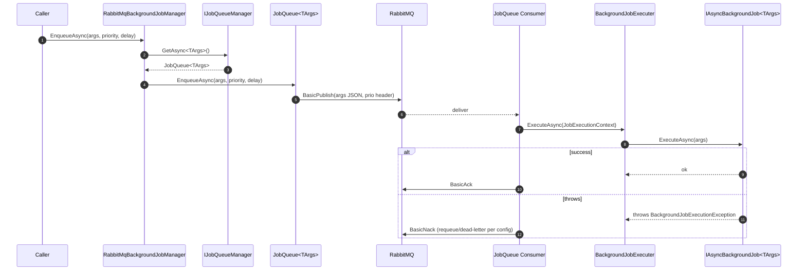

ABP Framework's background-job subsystem is a tiny abstraction (`IBackgroundJobManager`, `IBackgroundJobStore`, `IBackgroundJobWorker`, `IBackgroundJobExecuter`) with three providers: the default in-memory/EF store + polling worker, RabbitMQ, and Hangfire. All four moving pieces live under [`framework/src/Volo.Abp.BackgroundJobs/`](https://github.com/abpframework/abp/tree/dev/framework/src/Volo.Abp.BackgroundJobs).

<Note>
"Background job" in ABP Framework means *durable* work — args serialized to a store, retried on failure, surviving process restarts. For fire-and-forget intra-request work, use `LocalEventBus` instead.
</Note>

## The Four Abstractions

<CardGroup cols={2}>
  <Card title="IBackgroundJobManager" icon="paper-plane">
    Producer-side. `Task<string> EnqueueAsync<TArgs>(TArgs args, BackgroundJobPriority priority, TimeSpan? delay)` — see `framework/src/Volo.Abp.BackgroundJobs.Abstractions/`.
  </Card>
  <Card title="IBackgroundJobStore" icon="database">
    Durable storage. `InsertAsync`, `GetWaitingJobsAsync(applicationName, maxResultCount)`, `UpdateAsync`, `DeleteAsync` — default `InMemoryBackgroundJobStore` in `framework/src/Volo.Abp.BackgroundJobs/Volo/Abp/BackgroundJobs/InMemoryBackgroundJobStore.cs`; production: EF Core or MongoDB stores.
  </Card>
  <Card title="IBackgroundJobWorker" icon="loop">
    Consumer-side loop. Default `BackgroundJobWorker` extends `AsyncPeriodicBackgroundWorkerBase` and polls. See `framework/src/Volo.Abp.BackgroundJobs/Volo/Abp/BackgroundJobs/BackgroundJobWorker.cs`.
  </Card>
  <Card title="IBackgroundJobExecuter" icon="bolt">
    Reflection-based dispatch. Resolves `IAsyncBackgroundJob<TArgs>` from DI, invokes `ExecuteAsync`. See `framework/src/Volo.Abp.BackgroundJobs.Abstractions/Volo/Abp/BackgroundJobs/BackgroundJobExecuter.cs`.
  </Card>
</CardGroup>

## The Default Provider: Enqueue

`DefaultBackgroundJobManager.EnqueueAsync<TArgs>` (`framework/src/Volo.Abp.BackgroundJobs/Volo/Abp/BackgroundJobs/DefaultBackgroundJobManager.cs`) is straight-line:

```csharp
public virtual async Task<string> EnqueueAsync<TArgs>(TArgs args,
    BackgroundJobPriority priority = BackgroundJobPriority.Normal,
    TimeSpan? delay = null)
{
    var jobName = BackgroundJobOptions.Value.GetBackgroundJobName(typeof(TArgs));
    var jobId = await EnqueueAsync(jobName, args!, priority, delay);
    return jobId.ToString();
}

protected virtual async Task<Guid> EnqueueAsync(string jobName, object args,
    BackgroundJobPriority priority = BackgroundJobPriority.Normal, TimeSpan? delay = null)
{
    var jobInfo = new BackgroundJobInfo
    {
        Id = GuidGenerator.Create(),
        ApplicationName = BackgroundJobWorkerOptions.Value.ApplicationName,
        JobName = jobName,
        JobArgs = Serializer.Serialize(args),
        Priority = priority,
        CreationTime = Clock.Now,
        NextTryTime = Clock.Now
    };
    if (delay.HasValue) jobInfo.NextTryTime = Clock.Now.Add(delay.Value);
    await Store.InsertAsync(jobInfo);
    return jobInfo.Id;
}
```

Three resolutions: `AbpBackgroundJobOptions.GetBackgroundJobName(typeof(TArgs))` maps the args type to a job-name string (configured by modules via `services.Configure<AbpBackgroundJobOptions>(o => o.AddJob<MyJob>())`); `IBackgroundJobSerializer.Serialize(args)` produces the persisted JSON (default `JsonBackgroundJobSerializer` in `framework/src/Volo.Abp.BackgroundJobs/Volo/Abp/BackgroundJobs/JsonBackgroundJobSerializer.cs`); and `IBackgroundJobStore.InsertAsync(jobInfo)` writes the row.

`BackgroundJobInfo` (`framework/src/Volo.Abp.BackgroundJobs/Volo/Abp/BackgroundJobs/BackgroundJobInfo.cs`) carries `Id`, `ApplicationName` (for multi-app fan-out), `JobName`, `JobArgs` (serialized), `Priority`, `CreationTime`, `NextTryTime`, `TryCount`, `LastTryTime`, and `IsAbandoned`.

## The Default Provider: Worker Loop

`BackgroundJobWorker.DoWorkAsync(PeriodicBackgroundWorkerContext)` (`framework/src/Volo.Abp.BackgroundJobs/Volo/Abp/BackgroundJobs/BackgroundJobWorker.cs`) is the hot path:

<Steps>
  <Step title="Acquire distributed lock">
    `await DistributedLock.TryAcquireAsync(WorkerOptions.DistributedLockName, cancellationToken: StoppingToken)` — ensures only one node in the cluster polls at a time.
  </Step>
  <Step title="Fetch waiting jobs">
    `await store.GetWaitingJobsAsync(WorkerOptions.ApplicationName, WorkerOptions.MaxJobFetchCount)` returns the ordered batch. Order is by `Priority desc, CreationTime asc, NextTryTime asc`.
  </Step>
  <Step title="Resolve executer">
    `jobExecuter = workerContext.ServiceProvider.GetRequiredService<IBackgroundJobExecuter>();` plus `IClock` and `IBackgroundJobSerializer`.
  </Step>
  <Step title="Per job: stamp try info">
    `jobInfo.TryCount++; jobInfo.LastTryTime = clock.Now;`
  </Step>
  <Step title="Deserialize and run">
    `jobConfiguration = JobOptions.GetJob(jobInfo.JobName); jobArgs = serializer.Deserialize(jobInfo.JobArgs, jobConfiguration.ArgsType); context = new JobExecutionContext(...); await jobExecuter.ExecuteAsync(context);`
  </Step>
  <Step title="On success: delete">
    `await store.DeleteAsync(jobInfo.Id);`
  </Step>
  <Step title="On failure: backoff or abandon">
    Compute `CalculateNextTryTime(jobInfo, clock)` using `WorkerOptions.DefaultFirstWaitDuration * Math.Pow(DefaultWaitFactor, TryCount-1)`. If beyond `DefaultTimeout`, set `IsAbandoned = true`. Update via `TryUpdateAsync(store, jobInfo)`.
  </Step>
  <Step title="If lock not acquired">
    `await Task.Delay(WorkerOptions.JobPollPeriod * 12, StoppingToken)` — back off so the next node has a chance.
  </Step>
</Steps>

```mermaid
sequenceDiagram
    autonumber
    participant App as Caller (AppService)
    participant Mgr as DefaultBackgroundJobManager
    participant Sz as IBackgroundJobSerializer
    participant Store as IBackgroundJobStore (EF/Mongo)
    participant W as BackgroundJobWorker (timer)
    participant Lock as IAbpDistributedLock
    participant Ex as BackgroundJobExecuter
    participant Job as MyJob : IAsyncBackgroundJob<MyArgs>
    App->>Mgr: EnqueueAsync(new MyArgs{...}, Normal, delay:null)
    Mgr->>Mgr: jobName = AbpBackgroundJobOptions.GetBackgroundJobName(typeof(MyArgs))
    Mgr->>Sz: Serialize(args)
    Sz-->>Mgr: jobArgsJson
    Mgr->>Store: InsertAsync(BackgroundJobInfo{Id,JobName,JobArgs,NextTryTime=now})
    Store-->>Mgr: ok
    Mgr-->>App: jobId
    Note over W,Store: timer tick (WorkerOptions.JobPollPeriod)
    W->>Lock: TryAcquireAsync(WorkerOptions.DistributedLockName)
    Lock-->>W: handle
    W->>Store: GetWaitingJobsAsync(applicationName, MaxJobFetchCount)
    Store-->>W: List<BackgroundJobInfo>
    loop each job
        W->>W: jobInfo.TryCount++; LastTryTime=now
        W->>Sz: Deserialize(jobArgs, ArgsType)
        W->>Ex: ExecuteAsync(JobExecutionContext{job type, args, ct})
        Ex->>Job: ExecuteAsync(args)
        alt success
            Job-->>Ex: void
            Ex-->>W: ok
            W->>Store: DeleteAsync(id)
        else throws
            Job-->>Ex: throws
            Ex-->>W: BackgroundJobExecutionException
            W->>W: CalculateNextTryTime; maybe IsAbandoned=true
            W->>Store: UpdateAsync(jobInfo)
        end
    end
```

## The Executer

`BackgroundJobExecuter.ExecuteAsync(JobExecutionContext context)` (`framework/src/Volo.Abp.BackgroundJobs.Abstractions/Volo/Abp/BackgroundJobs/BackgroundJobExecuter.cs`):

```csharp
public virtual async Task ExecuteAsync(JobExecutionContext context)
{
    var job = context.ServiceProvider.GetService(context.JobType);
    if (job == null) throw new AbpException("The job type is not registered to DI: " + context.JobType);

    var jobExecuteMethod = context.JobType.GetMethod(nameof(IBackgroundJob<object>.Execute))
                       ?? context.JobType.GetMethod(nameof(IAsyncBackgroundJob<object>.ExecuteAsync));
    if (jobExecuteMethod == null)
        throw new AbpException($"Given job type does not implement {typeof(IBackgroundJob<>).Name} or {typeof(IAsyncBackgroundJob<>).Name}. ...");

    try
    {
        using (CurrentTenant.Change(GetJobArgsTenantId(context.JobArgs)))
        {
            var cancellationTokenProvider = context.ServiceProvider.GetRequiredService<ICancellationTokenProvider>();
            using (cancellationTokenProvider.Use(context.CancellationToken))
            {
                if (jobExecuteMethod.Name == nameof(IAsyncBackgroundJob<object>.ExecuteAsync))
                    await ((Task)jobExecuteMethod.Invoke(job, new[] { context.JobArgs })!);
                else
                    jobExecuteMethod.Invoke(job, new[] { context.JobArgs });
            }
        }
    }
    catch (Exception ex)
    {
        Logger.LogException(ex);
        await context.ServiceProvider.GetRequiredService<IExceptionNotifier>()
            .NotifyAsync(new ExceptionNotificationContext(ex));
        throw new BackgroundJobExecutionException("A background job execution is failed. See inner exception for details.", ex)
        {
            JobType = context.JobType.AssemblyQualifiedName!,
            JobArgs = context.JobArgs
        };
    }
}
```

Three important behaviors:

1. **Tenant scope**: `GetJobArgsTenantId(jobArgs)` returns `jobArgs.TenantId` when `jobArgs is IMultiTenant`, otherwise `CurrentTenant.Id`. The job runs *inside* a `CurrentTenant.Change(tenantId)` scope so repository tenant filters work.
2. **Cancellation propagation**: `cancellationTokenProvider.Use(context.CancellationToken)` makes the worker's `CancellationToken` ambient — repository calls inside the job will observe shutdown signals.
3. **Exception wrapping**: every exception becomes `BackgroundJobExecutionException`, which the worker catches specifically to drive retry/abandon. The `IExceptionNotifier.NotifyAsync` call lets any registered `IExceptionSubscriber` log/metric the failure.

## Backoff & Abandonment

`BackgroundJobWorker.CalculateNextTryTime`:

```csharp
var nextWaitDuration = WorkerOptions.DefaultFirstWaitDuration *
                       Math.Pow(WorkerOptions.DefaultWaitFactor, jobInfo.TryCount - 1);
var nextTryDate = jobInfo.LastTryTime?.AddSeconds(nextWaitDuration)
                  ?? clock.Now.AddSeconds(nextWaitDuration);
if (nextTryDate.Subtract(jobInfo.CreationTime).TotalSeconds > WorkerOptions.DefaultTimeout)
    return null;     // signal abandon
return nextTryDate;
```

Defaults in `AbpBackgroundJobWorkerOptions` (`framework/src/Volo.Abp.BackgroundJobs/Volo/Abp/BackgroundJobs/AbpBackgroundJobWorkerOptions.cs`): `DefaultFirstWaitDuration = 60s`, `DefaultWaitFactor = 2.0`, `DefaultTimeout = 172800s` (48h). So a fresh failure waits 60s, then 120s, 240s, …; after the cumulative window exceeds 48h, `IsAbandoned = true` and the row is parked. The store's `GetWaitingJobsAsync` filters `IsAbandoned == false`, so abandoned rows are inert until manually re-queued.

## Retry State Diagram

```mermaid
sequenceDiagram
    autonumber
    participant W as Worker
    participant Job as IAsyncBackgroundJob
    participant Ex as Executer
    participant Store as IBackgroundJobStore
    W->>Ex: ExecuteAsync(ctx)
    Ex->>Job: ExecuteAsync(args)
    alt success (1st try)
        Job-->>Ex: ok
        Ex-->>W: ok
        W->>Store: DeleteAsync(id)
    else transient fail
        Job-->>Ex: throws
        Ex-->>W: BackgroundJobExecutionException
        W->>W: TryCount=1; nextTry = LastTryTime + 60s
        W->>Store: UpdateAsync(jobInfo)
        Note over Store: worker picks it up after 60s
        W->>Ex: ExecuteAsync(ctx) (try 2)
        Job-->>Ex: ok
        W->>Store: DeleteAsync(id)
    else repeated fail beyond 48h
        Job-->>Ex: throws
        W->>W: TryCount=N; cumulative > 172800s
        W->>Store: UpdateAsync(jobInfo with IsAbandoned=true)
        Note over Store: row stays for manual inspection
    end
```

## RabbitMQ Provider

`RabbitMqBackgroundJobManager` (`framework/src/Volo.Abp.BackgroundJobs.RabbitMQ/Volo/Abp/BackgroundJobs/RabbitMQ/RabbitMqBackgroundJobManager.cs`) replaces `IBackgroundJobManager`:

```csharp
[Dependency(ReplaceServices = true)]
public class RabbitMqBackgroundJobManager : IBackgroundJobManager, ITransientDependency
{
    private readonly IJobQueueManager _jobQueueManager;
    public RabbitMqBackgroundJobManager(IJobQueueManager jobQueueManager) { _jobQueueManager = jobQueueManager; }

    public async Task<string> EnqueueAsync<TArgs>(TArgs args, BackgroundJobPriority priority = BackgroundJobPriority.Normal, TimeSpan? delay = null)
    {
        var jobQueue = await _jobQueueManager.GetAsync<TArgs>();
        return (await jobQueue.EnqueueAsync(args, priority, delay))!;
    }
}
```

`IJobQueueManager.GetAsync<TArgs>()` (`framework/src/Volo.Abp.BackgroundJobs.RabbitMQ/Volo/Abp/BackgroundJobs/RabbitMQ/JobQueueManager.cs`) returns/creates a `JobQueue<TArgs>` bound to a named queue. `JobQueue.EnqueueAsync` (`framework/src/Volo.Abp.BackgroundJobs.RabbitMQ/Volo/Abp/BackgroundJobs/RabbitMQ/JobQueue.cs`) serializes the args, publishes to RabbitMQ with `BasicProperties.Priority = (byte)priority` and a `x-delay` header when delayed. The consumer side, also implemented in `JobQueue`, listens on the queue and routes received frames into `IBackgroundJobExecuter.ExecuteAsync` — same executer as the default provider.

This means: when you swap to RabbitMQ, *the executer, retry policy, tenant-scoping, and exception wrapping are identical* — only the durable handoff changes. The polling worker is replaced by a push-based consumer.



## Hangfire Provider

`HangfireBackgroundJobManager` (`framework/src/Volo.Abp.BackgroundJobs.HangFire/Volo/Abp/BackgroundJobs/Hangfire/HangfireBackgroundJobManager.cs`) delegates to Hangfire's static `BackgroundJob.Enqueue` / `Schedule`:

```csharp
public virtual Task<string> EnqueueAsync<TArgs>(TArgs args, BackgroundJobPriority priority = BackgroundJobPriority.Normal, TimeSpan? delay = null)
{
    return Task.FromResult(delay.HasValue
        ? BackgroundJob.Schedule<HangfireJobExecutionAdapter<TArgs>>(
            adapter => adapter.ExecuteAsync(GetQueueName(typeof(TArgs)), args, default), delay.Value)
        : BackgroundJob.Enqueue<HangfireJobExecutionAdapter<TArgs>>(
            adapter => adapter.ExecuteAsync(GetQueueName(typeof(TArgs)), args, default)));
}
```

The adapter `HangfireJobExecutionAdapter<TArgs>` (`framework/src/Volo.Abp.BackgroundJobs.HangFire/Volo/Abp/BackgroundJobs/Hangfire/HangfireJobExecutionAdapter.cs`) is what Hangfire actually invokes. Inside, it resolves `IBackgroundJobExecuter` and calls `ExecuteAsync(new JobExecutionContext(...))` — so once again, the same executer runs the same job. Hangfire owns the storage, dashboard, retry policy, and queue routing; ABP only adapts the entrypoint.

`GetQueueName(argsType)` reads `[Queue]` attribute on `jobConfiguration.JobType` and prefixes `AbpHangfireOptions.DefaultQueuePrefix` to support multi-tenant queue separation in tiered setups.

## DefaultBackgroundJobWorker Bootstrapping

`AbpBackgroundJobsModule` registers `BackgroundJobWorker` as `IBackgroundJobWorker` and as an `IBackgroundWorker`. The module's `OnApplicationInitializationAsync` calls `await context.AddBackgroundWorkerAsync<IBackgroundJobWorker>()` so the framework's `IBackgroundWorkerManager` starts it on `OnPostApplicationInitialization`. The `AsyncPeriodicBackgroundWorkerBase` base class wires `AbpAsyncTimer.Period = WorkerOptions.JobPollPeriod` and pumps `DoWorkAsync` every tick until `StoppingToken` fires.

For RabbitMQ this worker is *replaced* by the queue consumer, which starts in `AbpBackgroundJobsRabbitMqModule.OnApplicationInitialization`. For Hangfire, the worker is replaced by Hangfire's own dispatcher — see `AbpBackgroundJobsHangfireModule` registering the `JobStorage` and `IBackgroundJobServer`.

## A Concrete Job

```csharp
public class SendEmailJobArgs : IMultiTenant
{
    public Guid? TenantId { get; set; }
    public string To { get; set; } = default!;
    public string Subject { get; set; } = default!;
    public string Body { get; set; } = default!;
}

public class SendEmailJob : AsyncBackgroundJob<SendEmailJobArgs>, ITransientDependency
{
    private readonly IEmailSender _sender;
    public SendEmailJob(IEmailSender sender) => _sender = sender;
    public override async Task ExecuteAsync(SendEmailJobArgs args)
    {
        await _sender.SendAsync(args.To, args.Subject, args.Body);
    }
}
```

Calling `await _backgroundJobManager.EnqueueAsync(new SendEmailJobArgs { TenantId = CurrentTenant.Id, ... })` puts a row in the store. The next worker tick deserializes args, opens a `CurrentTenant.Change(args.TenantId)` scope inside the executer, resolves `SendEmailJob` from DI, and invokes `ExecuteAsync(args)`. If `_sender.SendAsync` throws, retry kicks in.

## Failure Modes

<AccordionGroup>
  <Accordion title="AbpException 'The job type is not registered to DI'">
    Thrown by `BackgroundJobExecuter.ExecuteAsync` when `serviceProvider.GetService(context.JobType)` returns null. Make sure the job class is annotated with `ITransientDependency` (or otherwise registered) and is in an assembly the module's `AddAssembly` covers.
  </Accordion>
  <Accordion title="Args serialized but not deserializable">
    `IBackgroundJobSerializer.Deserialize(jobArgs, ArgsType)` runs once per dequeue. If your args class changed shape (renamed property without `[JsonPropertyName]` shim), old queued rows will throw on dispatch and retry until abandoned. Either migrate the rows or version the args class via `AbpBackgroundJobOptions.AddJob`.
  </Accordion>
  <Accordion title="Job stuck because lock never acquired">
    `BackgroundJobWorker.DoWorkAsync` logs nothing on lock-miss but does `await Task.Delay(JobPollPeriod * 12)`. If another node permanently holds the lock (zombie process), no work runs. The default `IAbpDistributedLock` uses Redis SET NX with TTL via `Medallion.Threading` — TTL eventually clears.
  </Accordion>
  <Accordion title="Tenant filter not applied inside job">
    Make `TArgs` implement `IMultiTenant` and set `TenantId` at enqueue time. `GetJobArgsTenantId` reads it; the `CurrentTenant.Change(...)` scope inside the executer activates the EF global filter (`AbpDbContext.IsMultiTenantFilterEnabled`).
  </Accordion>
</AccordionGroup>

A background job is just a row, a polling/consuming worker, and an executer that takes args + a job type and routes the work to a DI-resolved handler under the right tenant scope. The default polling provider gives durability + retry without infrastructure dependencies; RabbitMQ and Hangfire swap in push-based delivery while reusing the same executer.
