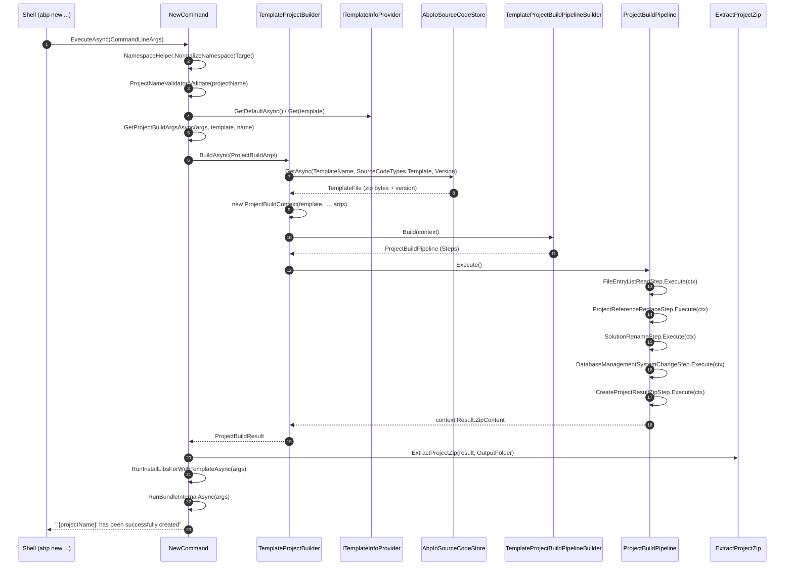

When you run `abp new Acme.BookStore`, the ABP Framework CLI turns a handful of flags into a fully wired multi-project solution on disk. The pipeline is implemented in `framework/src/Volo.Abp.Cli.Core/Volo/Abp/Cli/Commands/NewCommand.cs` and the supporting `framework/src/Volo.Abp.Cli.Core/Volo/Abp/Cli/ProjectBuilding/` tree, and it follows a strict five-stage flow: parse, configure, download, transform, post-process. This page walks the call graph one stage at a time so you can match log lines you see in your terminal to specific source files.

<Note>
Every type and method named on this page lives under `framework/src/Volo.Abp.Cli.Core/Volo/Abp/Cli/`. Where the prose mentions a class, the surrounding sentence cites the exact file path inside the ABP repository.
</Note>

## The Big Picture

`NewCommand` (see `framework/src/Volo.Abp.Cli.Core/Volo/Abp/Cli/Commands/NewCommand.cs`) is registered as an `IConsoleCommand` with `public const string Name = "new"`, and the `abp` host dispatches the parsed `CommandLineArgs` to its `ExecuteAsync` method. From there control passes to `TemplateProjectBuilder.BuildAsync` (see `framework/src/Volo.Abp.Cli.Core/Volo/Abp/Cli/ProjectBuilding/TemplateProjectBuilder.cs`), which fetches a template `.zip` (the NuGet-style template package, surfaced as `TemplateFile.FileBytes`) through `AbpIoSourceCodeStore.GetAsync` (see `framework/src/Volo.Abp.Cli.Core/Volo/Abp/Cli/ProjectBuilding/AbpIoSourceCodeStore.cs`), then runs a `ProjectBuildPipeline` of transformation steps before handing a final zip back to `NewCommand` for extraction and post-actions.

`CommandLineArgs` (see `framework/src/Volo.Abp.Cli.Core/Volo/Abp/Cli/Args/CommandLineArgs.cs`) is a small immutable bag of `Command`, `Target`, and an `AbpCommandLineOptions` dictionary; `ProjectBuildArgs` (see `framework/src/Volo.Abp.Cli.Core/Volo/Abp/Cli/ProjectBuilding/ProjectBuildArgs.cs`) is the richer, strongly-typed object that the rest of the build pipeline consumes — converting the former into the latter is the first real job of `NewCommand.ExecuteAsync`.

<CardGroup cols={2}>
  <Card title="Entry point" icon="terminal">
    `NewCommand.ExecuteAsync(CommandLineArgs)` in `framework/src/Volo.Abp.Cli.Core/Volo/Abp/Cli/Commands/NewCommand.cs`.
  </Card>
  <Card title="Pipeline driver" icon="arrows-spin">
    `TemplateProjectBuilder.BuildAsync(ProjectBuildArgs)` in `framework/src/Volo.Abp.Cli.Core/Volo/Abp/Cli/ProjectBuilding/TemplateProjectBuilder.cs`.
  </Card>
  <Card title="Template source" icon="cloud-arrow-down">
    `AbpIoSourceCodeStore.GetAsync(name, type, version, ...)` in `framework/src/Volo.Abp.Cli.Core/Volo/Abp/Cli/ProjectBuilding/AbpIoSourceCodeStore.cs`.
  </Card>
  <Card title="Pipeline build" icon="list-check">
    `TemplateProjectBuildPipelineBuilder.Build(ProjectBuildContext)` in `framework/src/Volo.Abp.Cli.Core/Volo/Abp/Cli/ProjectBuilding/Building/TemplateProjectBuildPipelineBuilder.cs`.
  </Card>
</CardGroup>

## Sequence at a Glance

The diagram below shows the cross-class call chain for a vanilla `abp new Acme.BookStore`, with real method names lifted from the files cited above. Each arrow corresponds to a method call you can grep for under `framework/src/Volo.Abp.Cli.Core/Volo/Abp/Cli/`.



Steps 1–6 happen entirely inside `NewCommand.ExecuteAsync` in `framework/src/Volo.Abp.Cli.Core/Volo/Abp/Cli/Commands/NewCommand.cs`; steps 7–17 cross into the project-building subsystem under `framework/src/Volo.Abp.Cli.Core/Volo/Abp/Cli/ProjectBuilding/`; steps 18–21 return to `ProjectCreationCommandBase` (see `framework/src/Volo.Abp.Cli.Core/Volo/Abp/Cli/Commands/ProjectCreationCommandBase.cs`) for the on-disk side effects.

## Stage 1 — Parse and Validate the Command Line

`NewCommand.ExecuteAsync` opens with `var projectName = NamespaceHelper.NormalizeNamespace(commandLineArgs.Target);` and throws a `CliUsageException` whose body is `GetUsageInfo()` if the target is missing — both lines live in `framework/src/Volo.Abp.Cli.Core/Volo/Abp/Cli/Commands/NewCommand.cs`. The `Target` itself is filled by the parser into `CommandLineArgs.Target` (see `framework/src/Volo.Abp.Cli.Core/Volo/Abp/Cli/Args/CommandLineArgs.cs`), which is annotated `[CanBeNull]` and exposed alongside `Command` and an `AbpCommandLineOptions Options` dictionary.

After normalization, `ProjectNameValidator.Validate(projectName)` rejects illegal namespaces, and `Logger.LogInformation("Creating your project...")` is the first user-visible line you see at this point — both in `framework/src/Volo.Abp.Cli.Core/Volo/Abp/Cli/Commands/NewCommand.cs`. The CLI then peels off the template selection with `commandLineArgs.Options.GetOrNull(Options.Template.Short, Options.Template.Long)`; when no `-t|--template` flag is given it falls back to `(await TemplateInfoProvider.GetDefaultAsync()).Name`, which for the framework default returns `AppTemplate.TemplateName == "app"` (see `framework/src/Volo.Abp.Cli.Core/Volo/Abp/Cli/ProjectBuilding/Templates/App/AppTemplate.cs`).

The `--tiered` switch is also detected here via `commandLineArgs.Options.ContainsKey(Options.Tiered.Long)` and surfaced as `Logger.LogInformation("Tiered: yes")` — this is the same `Options` dictionary populated by the parser, exposed through `CommandLineArgs.Options` in `framework/src/Volo.Abp.Cli.Core/Volo/Abp/Cli/Args/CommandLineArgs.cs`. Every other flag understood by `abp new` (database provider, UI framework, output folder, etc.) is enumerated in the `GetUsageInfo()` method at the bottom of `framework/src/Volo.Abp.Cli.Core/Volo/Abp/Cli/Commands/NewCommand.cs`.

<Tip>
The CLI deliberately performs minimal validation in this stage: name normalization and a non-empty check. Template-specific validation (e.g. "you cannot pair `-u angular` with this template") is deferred to the pipeline, where each `ProjectBuildPipelineStep` can inspect `ProjectBuildContext.BuildArgs` and reject incompatible combinations — see `framework/src/Volo.Abp.Cli.Core/Volo/Abp/Cli/ProjectBuilding/Building/ProjectBuildContext.cs`.
</Tip>

## Stage 2 — Build the `ProjectBuildArgs`

`NewCommand` inherits from `ProjectCreationCommandBase` (see `framework/src/Volo.Abp.Cli.Core/Volo/Abp/Cli/Commands/ProjectCreationCommandBase.cs`), and the call `var projectArgs = await GetProjectBuildArgsAsync(commandLineArgs, template, projectName);` is the bridge that turns the raw `CommandLineArgs` into a `ProjectBuildArgs`. The latter type is declared in `framework/src/Volo.Abp.Cli.Core/Volo/Abp/Cli/ProjectBuilding/ProjectBuildArgs.cs` and carries every knob the pipeline needs: `SolutionName`, `TemplateName`, `Version`, `DatabaseProvider`, `DatabaseManagementSystem`, `UiFramework`, `MobileApp?`, `PublicWebSite`, `ConnectionString`, `OutputFolder`, `Theme?`, `ThemeStyle?`, `SkipCache`, and a free-form `Dictionary<string, string> ExtraProperties` for everything else.

`ExtraProperties` is the safety valve that lets `NewCommand` smuggle parser-level flags into the pipeline without growing the constructor. The base class stuffs entries like `tiered`, `preview`, `separate-auth-server`, `separate-identity-server`, `no-random-port`, `without-cms-kit`, and the original `CliConsts.Command` into this map — `framework/src/Volo.Abp.Cli.Core/Volo/Abp/Cli/ProjectBuilding/TemplateProjectBuilder.cs` later filters these by name when collecting analytics options to send to `ICliAnalyticsCollect.CollectAsync`.

`OutputFolder` defaults to the current directory when the user omits `-o|--output-folder`; the actual file extraction in stage 5 uses `projectArgs.OutputFolder` directly as the root for `Directory.CreateDirectory` calls inside `ExtractProjectZip` (see `framework/src/Volo.Abp.Cli.Core/Volo/Abp/Cli/Commands/ProjectCreationCommandBase.cs`, around line 262). The `SolutionName` is split into `FullName` and `ProjectName` and is what `CreateProjectResultZipStep` ultimately reads when populating `ProjectBuildResult.ProjectName` — see the closing lines of `BuildAsync` in `framework/src/Volo.Abp.Cli.Core/Volo/Abp/Cli/ProjectBuilding/TemplateProjectBuilder.cs`.

<CodeGroup>

```csharp NewCommand.ExecuteAsync (excerpt)
var projectArgs = await GetProjectBuildArgsAsync(commandLineArgs, template, projectName);

await CheckCreatingRequirements(projectArgs);

var result = await TemplateProjectBuilder.BuildAsync(
    projectArgs
);
```

```csharp ProjectBuildArgs (declaration)
public class ProjectBuildArgs
{
    [NotNull] public SolutionName SolutionName { get; }
    [CanBeNull] public string TemplateName { get; set; }
    [CanBeNull] public string Version { get; set; }
    public DatabaseProvider DatabaseProvider { get; set; }
    public DatabaseManagementSystem DatabaseManagementSystem { get; set; }
    public UiFramework UiFramework { get; set; }
    public MobileApp? MobileApp { get; set; }
    public bool PublicWebSite { get; set; }
    [CanBeNull] public string TemplateSource { get; set; }
    [CanBeNull] public string ConnectionString { get; set; }
    [NotNull] public string OutputFolder { get; set; }
    public bool Pwa { get; set; }
    public Theme? Theme { get; set; }
    public ThemeStyle? ThemeStyle { get; set; }
    public bool SkipCache { get; set; }
    [NotNull] public Dictionary<string, string> ExtraProperties { get; set; }
}
```

</CodeGroup>

## Stage 3 — `IProjectBuilder` and the Template File

`IProjectBuilder` is a one-method interface declared in `framework/src/Volo.Abp.Cli.Core/Volo/Abp/Cli/ProjectBuilding/IProjectBuilder.cs`: `Task<ProjectBuildResult> BuildAsync(ProjectBuildArgs args);`. The concrete implementation that `NewCommand` invokes is `TemplateProjectBuilder` (see `framework/src/Volo.Abp.Cli.Core/Volo/Abp/Cli/ProjectBuilding/TemplateProjectBuilder.cs`), a `[ITransientDependency]` registered through the standard ABP DI conventions and constructor-injected into `NewCommand` as `TemplateProjectBuilder TemplateProjectBuilder { get; }`.

`BuildAsync` opens with `var templateInfo = await GetTemplateInfoAsync(args);` (an internal helper that falls back to `TemplateInfoProvider.GetDefaultAsync()` when `args.TemplateName` is blank) followed by `NormalizeArgs(args, templateInfo);`, which back-fills missing `DatabaseProvider` and `UiFramework` from the template's defaults — see `NormalizeArgs` in `framework/src/Volo.Abp.Cli.Core/Volo/Abp/Cli/ProjectBuilding/TemplateProjectBuilder.cs`. The next line, `await EventBus.PublishAsync(new ProjectCreationProgressEvent { Message = "Downloading the solution template" }, false);`, is the hook UIs like ABP Studio use to display a progress indicator.

The actual download call is `var templateFile = await SourceCodeStore.GetAsync(args.TemplateName, SourceCodeTypes.Template, args.Version, args.TemplateSource, args.ExtraProperties.ContainsKey(NewCommand.Options.Preview.Long), trustUserVersion: args.TrustUserVersion);` — every argument is forwarded directly into `AbpIoSourceCodeStore.GetAsync` in `framework/src/Volo.Abp.Cli.Core/Volo/Abp/Cli/ProjectBuilding/AbpIoSourceCodeStore.cs`. The returned `TemplateFile` carries `FileBytes` (the raw `.zip`/`.nupkg`-shaped template archive), `Version`, `LatestVersion`, and `NuGetVersion`.

### Inside `AbpIoSourceCodeStore.GetAsync`

`AbpIoSourceCodeStore` is the only `ISourceCodeStore` shipped with the CLI; the default implementation in `framework/src/Volo.Abp.Cli.Core/Volo/Abp/Cli/ProjectBuilding/AbpIoSourceCodeStore.cs` orchestrates four sub-tasks: version resolution, CLI/template version compatibility checking, local cache lookup, and HTTP download.

Version resolution starts with `var latestVersion = version ?? await GetLatestSourceCodeVersionAsync(name, type, null, includePreReleases);` (see `framework/src/Volo.Abp.Cli.Core/Volo/Abp/Cli/ProjectBuilding/AbpIoSourceCodeStore.cs`), which POSTs `{ Name, IncludePreReleases }` to `"{CliUrls.WwwAbpIo}api/download/{type}/get-version/"` and reads back a `GetVersionResultDto`. If no version can be resolved (offline, server down), the method logs the local template cache via `GetLocalTemplates()` — a regex match over `CliPaths.TemplateCache` for `(app|app-pro|module|module-pro|console|wpf|maui|app-nolayers|app-nolayers-pro)-(.+).zip` — and throws a `CliUsageException` advising the user to specify `-v version`.

Once a version is known, the CLI checks compatibility between the running CLI and the template using `await CliVersionService.GetCurrentCliVersionAsync()` versus `SemanticVersion.Parse(version)` (see the same file). Mismatched major/minor numbers, lower CLI patch numbers, and lower CLI pre-release labels all trigger the famous "The latest template version (X) is different than the CLI version (Y). This may cause compatibility issues." warning, complete with copy-pastable `dotnet tool install -g volo.abp.cli --version "X.Y.*"` instructions.

The cache lookup is local to disk: `var localCacheFile = Path.Combine(CliPaths.TemplateCache, name.Replace("/", ".") + "-" + version + ".zip");`. When `Options.CacheTemplates && !skipCache && File.Exists(localCacheFile) && templateSource.IsNullOrWhiteSpace()`, the CLI logs `"Using cached template: ..."` and returns a `new TemplateFile(File.ReadAllBytes(localCacheFile), version, latestVersion, nugetVersion)`. Otherwise it falls through to `DownloadSourceCodeContentAsync`, which POSTs a `SourceCodeDownloadInputDto` to `"{CliUrls.WwwAbpIo}api/download/{input.Type}/"` and writes the response bytes into `localCacheFile` for next time — both methods are in `framework/src/Volo.Abp.Cli.Core/Volo/Abp/Cli/ProjectBuilding/AbpIoSourceCodeStore.cs`.

<Warning>
`-sc|--skip-cache` (mapped to `SkipCache = true` on `ProjectBuildArgs`) only skips the local read path; the file is still written back into `CliPaths.TemplateCache` after download unless `templateSource` is set. To bypass the cache entirely, pass `-ts|--template-source <path-or-url>` and `AbpIoSourceCodeStore` will short-circuit straight into the local-file or HTTP-GET branch.
</Warning>

## Stage 4 — Construct the `ProjectBuildContext`

Back in `TemplateProjectBuilder.BuildAsync` (see `framework/src/Volo.Abp.Cli.Core/Volo/Abp/Cli/ProjectBuilding/TemplateProjectBuilder.cs`), the next responsibility is to assemble a `ProjectBuildContext`. This type, declared in `framework/src/Volo.Abp.Cli.Core/Volo/Abp/Cli/ProjectBuilding/Building/ProjectBuildContext.cs`, is the shared mutable state every pipeline step reads from and writes to: `TemplateFile`, `BuildArgs`, `Template` (a `TemplateInfo`), unused-here `ModuleInfo`/`NugetPackageInfo`/`NpmPackageInfo` slots, a `FileEntryList Files`, a `ProjectResult Result`, and a `List<string> Symbols` used by templates for conditional file inclusion.

The construction call is verbatim `var context = new ProjectBuildContext(templateInfo, null, null, null, templateFile, args);` — the three `null`s correspond to `module`, `nugetPackage`, and `npmPackage`, which are populated only by `ModuleProjectBuildPipelineBuilder`, `NugetPackageProjectBuildPipelineBuilder`, and `NpmPackageProjectBuildPipelineBuilder` respectively (also under `framework/src/Volo.Abp.Cli.Core/Volo/Abp/Cli/ProjectBuilding/Building/`). For a solution template this `null` triplet is correct.

Immediately after constructing the context, `TemplateProjectBuilder` performs a version-specific patch: `if (context.Template is AppTemplateBase appTemplateBase) { appTemplateBase.HasDbMigrations = SemanticVersion.Parse(templateFile.Version) < new SemanticVersion(4, 3, 99); }` — see `framework/src/Volo.Abp.Cli.Core/Volo/Abp/Cli/ProjectBuilding/TemplateProjectBuilder.cs`. `HasDbMigrations` is read by `AppTemplateBase.GetCustomSteps` (see `framework/src/Volo.Abp.Cli.Core/Volo/Abp/Cli/ProjectBuilding/Templates/App/AppTemplateBase.cs`) to choose between the `MyCompanyName.MyProjectName.EntityFrameworkCore` and `MyCompanyName.MyProjectName.EntityFrameworkCore.DbMigrations` project layouts that the template carries.

`ConfigureThemeOptions(args, templateFile.Version)` (also in `TemplateProjectBuilder.cs`) is the final pre-pipeline tweak: it nulls out `args.Theme` and `args.ThemeStyle` for any template older than `6.0.0-rc.1`, and warns the user when they have chosen a non-default theme for an Angular UI, because Angular needs additional manual configuration as documented in `framework/ui/angular/theme-configurations`.

## Stage 5 — `AppTemplate` Selects the Pipeline

`AppTemplate` is the marker class for the default `"app"` template; its full declaration is six lines in `framework/src/Volo.Abp.Cli.Core/Volo/Abp/Cli/ProjectBuilding/Templates/App/AppTemplate.cs`:

```csharp
public class AppTemplate : AppTemplateBase
{
    public const string TemplateName = "app";
    public const Theme DefaultTheme = Theme.LeptonXLite;

    public AppTemplate() : base(TemplateName)
    {
        DocumentUrl = CliConsts.DocsLink + "latest/solution-templates/layered-web-application";
    }
}
```

The interesting behaviour lives in the base class. `AppTemplateBase` (see `framework/src/Volo.Abp.Cli.Core/Volo/Abp/Cli/ProjectBuilding/Templates/App/AppTemplateBase.cs`) overrides `GetCustomSteps(ProjectBuildContext context)` and emits an ordered `List<ProjectBuildPipelineStep>` produced by sub-routines named after their concern: `ConfigureTenantSchema`, `SwitchDatabaseProvider`, `DeleteUnrelatedProjects`, `RemoveMigrations`, `ConfigureTieredArchitecture`, `ConfigurePublicWebSite`, `ConfigureTheme`, `ConfigureVersion`, `RemoveUnnecessaryPorts`, `RandomizeSslPorts`, `RandomizeStringEncryption`, `RandomizeAuthServerPassPhrase`, `UpdateNuGetConfig`, `ConfigureDockerFiles`, `ChangeConnectionString`, and `CleanupFolderHierarchy`. Each routine appends concrete step instances such as `RemoveProjectFromSolutionStep`, `TemplateProjectRenameStep`, `AppTemplateSwitchEntityFrameworkCoreToMongoDbStep`, `ChangeThemeStep`, `TemplateRandomSslPortStep`, `RandomizeStringEncryptionStep`, `MoveFolderStep`, `MoveFileStep`, `RemoveFileStep`, or `RemoveFolderStep` to the list.

For example, `DeleteUnrelatedProjects` inspects `context.BuildArgs.UiFramework` and dispatches into the matching `ConfigureWithMvcUi`, `ConfigureWithBlazorUi`, `ConfigureWithBlazorServerUi`, `ConfigureWithBlazorWebAppUi`, `ConfigureWithAngularUi`, `ConfigureWithMauiBlazorUi`, or `ConfigureWithoutUi` helper — all in `framework/src/Volo.Abp.Cli.Core/Volo/Abp/Cli/ProjectBuilding/Templates/App/AppTemplateBase.cs`. The Angular branch removes `MyCompanyName.MyProjectName.Web`, `MyCompanyName.MyProjectName.Web.Host`, and `MyCompanyName.MyProjectName.Web.Tests` from the solution, renames `MyCompanyName.MyProjectName.HttpApi.HostWithIds` to `MyCompanyName.MyProjectName.HttpApi.Host`, and adds `RemoveFolderStep("/angular")` only when the user did not actually ask for Angular UI.

`SwitchDatabaseProvider` is similarly dense: when `DatabaseProvider == MongoDb` it appends `new AppTemplateSwitchEntityFrameworkCoreToMongoDbStep(HasDbMigrations)`; for any non-EF provider it removes the `EntityFrameworkCore`, `EntityFrameworkCore.DbMigrations`, and `EntityFrameworkCore.Tests` projects from the solution; otherwise it adds the `"EFCORE"` symbol and calls `SetDbmsSymbols(context)`, which maps `DatabaseManagementSystem.MySQL → "MySql"`, `PostgreSQL → "PostgreSql"`, `Oracle/OracleDevart → "Oracle"`, `SQLite → "SqLite"`, and `SQLServer/NotSpecified → "SqlServer"` — all in `framework/src/Volo.Abp.Cli.Core/Volo/Abp/Cli/ProjectBuilding/Templates/App/AppTemplateBase.cs`. These symbols feed the template's `<#if ... #>` directives, which is how a single downloaded archive turns into provider-specific source.

## Stage 6 — Composing the `ProjectBuildPipeline`

`TemplateProjectBuildPipelineBuilder.Build(context)` (a static method in `framework/src/Volo.Abp.Cli.Core/Volo/Abp/Cli/ProjectBuilding/Building/TemplateProjectBuildPipelineBuilder.cs`) wraps the steps emitted by `AppTemplateBase.GetCustomSteps` with template-agnostic pre-steps and post-steps:

```csharp
public static ProjectBuildPipeline Build(ProjectBuildContext context)
{
    var pipeline = new ProjectBuildPipeline(context);

    pipeline.Steps.Add(new FileEntryListReadStep());

    if (SemanticVersion.Parse(context.TemplateFile.Version) > new SemanticVersion(4, 3, 99))
    {
        pipeline.Steps.Add(new CreateAppSettingsSecretsStep());
    }

    pipeline.Steps.AddRange(context.Template.GetCustomSteps(context));

    pipeline.Steps.Add(new ProjectReferenceReplaceStep());
    pipeline.Steps.Add(new TemplateCodeDeleteStep());
    pipeline.Steps.Add(new SolutionRenameStep());
    // ... DatabaseManagementSystemChangeStep, RemoveRootFolderStep, ...
    pipeline.Steps.Add(new CheckRedisPreRequirements());
    pipeline.Steps.Add(new CreateProjectResultZipStep());

    return pipeline;
}
```

The very first step is always `FileEntryListReadStep` (see `framework/src/Volo.Abp.Cli.Core/Volo/Abp/Cli/ProjectBuilding/Building/Steps/FileEntryListReadStep.cs`): it opens `context.TemplateFile.FileBytes` through `ICSharpCode.SharpZipLib.Zip.ZipInputStream`, iterates `GetNextEntry()`, and produces a `new FileEntryList(fileEntries)` (declared as `public class FileEntryList : List<FileEntry>` in `framework/src/Volo.Abp.Cli.Core/Volo/Abp/Cli/ProjectBuilding/Files/FileEntryList.cs`). Every subsequent step mutates `context.Files` in place — adding entries, removing them, or modifying `entry.Bytes` (a `byte[]`) directly.

The two ever-present transformations that follow the template-specific block are `ProjectReferenceReplaceStep` and `SolutionRenameStep`. `ProjectReferenceReplaceStep` walks `.csproj` files and either rewrites `<ProjectReference>` lines to `<PackageReference>` against the resolved NuGet version or keeps them as local references when `--local-framework-ref --abp-path` was passed. `SolutionRenameStep` is the workhorse that replaces every `MyCompanyName.MyProjectName` placeholder in file paths and file contents with the user's chosen `SolutionName.CompanyName` and `SolutionName.ProjectName` — that is why the `RemoveProjectFromSolutionStep` calls inside `AppTemplateBase` use placeholder names like `MyCompanyName.MyProjectName.EntityFrameworkCore` rather than the final names.

When the template is the `"app"` or `"app-pro"` template, the builder appends `new DatabaseManagementSystemChangeStep(context.Template.As<AppTemplateBase>().HasDbMigrations)` (see `framework/src/Volo.Abp.Cli.Core/Volo/Abp/Cli/ProjectBuilding/Building/TemplateProjectBuildPipelineBuilder.cs`); when the UI is MVC or any Blazor flavour and there is no mobile companion app, it adds `new RemoveRootFolderStep()` so the resulting solution has its `src/` and `test/` folders at the repository root instead of under `aspnet-core/`. The pre-final step `CheckRedisPreRequirements` writes `"PreRequirements:Redis"` into `args.ExtraProperties` when the chosen layout needs Redis, which is what `NewCommand.CheckCreatedRequirements` later reads to print the *"Redis is not installed or not running on your computer."* warning.

The terminal step is always `CreateProjectResultZipStep` (see `framework/src/Volo.Abp.Cli.Core/Volo/Abp/Cli/ProjectBuilding/Building/Steps/CreateProjectResultZipStep.cs`). It enumerates `context.Files` through a `ZipOutputStream` configured with `SetLevel(3)` and assigns the produced byte array to `context.Result.ZipContent` for downstream extraction.

## Stage 7 — Executing the Pipeline

`ProjectBuildPipeline.Execute()` (see `framework/src/Volo.Abp.Cli.Core/Volo/Abp/Cli/ProjectBuilding/Building/ProjectBuildPipeline.cs`) is a five-line `foreach` loop that calls `step.Execute(Context)` in order. There is no parallelism, no retry, and no shortcut: each step sees the cumulative mutations of all previous steps via the shared `ProjectBuildContext`.

`ProjectBuildPipelineStep` is the abstract base every step inherits from (see `framework/src/Volo.Abp.Cli.Core/Volo/Abp/Cli/ProjectBuilding/Building/ProjectBuildPipelineStep.cs`); its contract is `public abstract void Execute(ProjectBuildContext context)`. Concrete steps under `framework/src/Volo.Abp.Cli.Core/Volo/Abp/Cli/ProjectBuilding/Building/Steps/` typically loop over `context.Files`, find entries whose `Name` matches a path pattern, and either edit `entry.SetContent(string)` / `entry.Bytes` directly or remove the entry from the list. For example, `RemoveFolderStep` removes every `FileEntry` whose `Name` starts with the given prefix; `MoveFileStep` and `MoveFolderStep` rewrite `entry.Name`; and `RemoveProjectFromSolutionStep` further edits the `.sln` file's text to drop the matching `Project("{GUID}") = ...` block.

Right before kicking off `Execute()`, `TemplateProjectBuilder` publishes one more progress event: `await EventBus.PublishAsync(new ProjectCreationProgressEvent { Message = "Customizing the solution template" }, false);` — the message you see in ABP Studio while the steps are running. This is the line in `framework/src/Volo.Abp.Cli.Core/Volo/Abp/Cli/ProjectBuilding/TemplateProjectBuilder.cs` right above `TemplateProjectBuildPipelineBuilder.Build(context).Execute();`.

<Note>
The static `TemplateProjectBuildPipelineBuilder.Build` is the only place where the order of steps for a solution template is defined. If you are debugging *"why did my Redis check run before my theme change?"* the answer is always: read `framework/src/Volo.Abp.Cli.Core/Volo/Abp/Cli/ProjectBuilding/Building/TemplateProjectBuildPipelineBuilder.cs` top to bottom, followed by `AppTemplateBase.GetCustomSteps` for the template-supplied middle band.
</Note>

## Stage 8 — Returning the Result

Once `Execute()` returns, `TemplateProjectBuilder` does three more things before returning to `NewCommand`. First, if the template advertises a documentation URL, it logs `"Check out the documents at " + templateInfo.DocumentUrl` — for the default `app` template this is the link set in the `AppTemplate` constructor in `framework/src/Volo.Abp.Cli.Core/Volo/Abp/Cli/ProjectBuilding/Templates/App/AppTemplate.cs`.

Second, it strips the well-known parser flags out of `args.ExtraProperties` so analytics do not double-count what is already known from the strongly-typed fields, then awaits `CliAnalyticsCollect.CollectAsync(new CliAnalyticsCollectInputDto { ... })` (see `framework/src/Volo.Abp.Cli.Core/Volo/Abp/Cli/ProjectBuilding/TemplateProjectBuilder.cs`). The DTO carries `Tool`, `Command`, `DatabaseProvider`, `IsTiered`, `UiFramework`, the serialized `Options`, `ProjectName`, `TemplateName`, and `TemplateVersion`.

Third, it returns `new ProjectBuildResult(context.Result.ZipContent, args.SolutionName.ProjectName)`. `NewCommand.ExecuteAsync` receives this `result`, records telemetry (`ActivityNameConsts.AbpCliCommandsNewSolution` or `AbpCliCommandsNewModule`) via `_telemetryService.AddActivityAsync`, then calls `ExtractProjectZip(result, projectArgs.OutputFolder)` — both lines are in `framework/src/Volo.Abp.Cli.Core/Volo/Abp/Cli/Commands/NewCommand.cs`.

## Stage 9 — Extracting the Zip to Disk

`ExtractProjectZip` is defined on the base class `ProjectCreationCommandBase` (see `framework/src/Volo.Abp.Cli.Core/Volo/Abp/Cli/Commands/ProjectCreationCommandBase.cs`). It publishes a `ProjectCreationProgressEvent { Message = "Unzipping the solution" }`, opens the in-memory `result.ZipContent` through `ZipInputStream`, and for each entry computes `var fullZipToPath = Path.Combine(outputFolder, zipEntry.Name);`, ensures the parent directory exists with `Directory.CreateDirectory(directoryName)`, and writes the bytes through a `File.Create(fullZipToPath)` stream copied via `StreamUtils.Copy` with a 4 KB buffer.

Once extraction completes, `NewCommand.ExecuteAsync` logs `"'{projectName}' has been successfully created to '{projectArgs.OutputFolder}'"` and starts the *requirements-after* phase, beginning with `await CheckCreatedRequirements(projectArgs)`. That method (also in `framework/src/Volo.Abp.Cli.Core/Volo/Abp/Cli/Commands/NewCommand.cs`) tries `await ConnectionMultiplexer.ConnectAsync("127.0.0.1", options => options.ConnectTimeout = 3000)` when `ExtraProperties.ContainsKey("PreRequirements:Redis")`, and publishes a `ProjectPostRequirementsCheckedEvent` if Redis is unreachable.

## Stage 10 — Post-Actions: PFX, EF Migrations, install-libs, bundle

After extraction, `NewCommand` runs a deterministic sequence of post-actions, each guarded by feature detection on `projectArgs`:

`await CreateOpenIddictPfxFilesAsync(projectArgs);` generates the OpenIddict signing/encryption certificates for AuthServer projects that need them. `await RunGraphBuildForMicroserviceServiceTemplate(projectArgs);` runs `CmdHelper.RunCmd("dotnet build /graphbuild", projectArgs.OutputFolder)` on microservice templates — both methods live in `framework/src/Volo.Abp.Cli.Core/Volo/Abp/Cli/Commands/ProjectCreationCommandBase.cs`.

`await CreateInitialMigrationsAsync(projectArgs);` calls into `InitialMigrationCreator` to invoke `dotnet ef migrations add` for EF-Core templates. `await ConfigureAngularAfterMicroserviceServiceCreatedAsync(projectArgs, template);` wires up Angular environment files when generating a microservice service alongside an Angular shell.

The most visible post-action is `RunInstallLibsForWebTemplateAsync`, which `NewCommand` invokes only when neither `-sib|--skip-installing-libs` was passed. The method (see `framework/src/Volo.Abp.Cli.Core/Volo/Abp/Cli/Commands/ProjectCreationCommandBase.cs`, around line 410) checks `AppTemplateBase.IsAppTemplate`, `ModuleTemplateBase.IsModuleTemplate`, `AppNoLayersTemplateBase.IsAppNoLayersTemplate`, and `MicroserviceServiceTemplateBase.IsMicroserviceTemplate`; for any of those, it logs `"Installing client-side packages..."`, publishes a `ProjectCreationProgressEvent { Message = "Installing client-side packages" }`, and calls `await InstallLibsService.InstallLibsAsync(projectArgs.OutputFolder)`. Internally `InstallLibsService` shells out to the ABP install-libs pipeline (the modern replacement for the older `gulp` task that copied npm artifacts into `wwwroot/libs`), so this single call is what populates the `wwwroot/libs/` folders for every MVC, Blazor Server, and Blazor WebApp project in your new solution.

`ConfigureAngularJsonForThemeSelection(projectArgs)` then rewrites `angular.json` to point at the right theme bundles when the user combined `-u angular` with `--theme`. Finally, when `-sb|--skip-bundling` is *not* set, `await RunBundleInternalAsync(projectArgs)` runs the Blazor WebAssembly or MAUI Blazor bundling step — it searches for `*.Blazor.csproj`, `*.Blazor.Client.csproj`, or `*.MauiBlazor.csproj` under the output folder and invokes `IBundlingService` with `BundlingConsts.WebAssembly` or `BundlingConsts.MauiBlazor` respectively. Both helpers live in `framework/src/Volo.Abp.Cli.Core/Volo/Abp/Cli/Commands/ProjectCreationCommandBase.cs`.

`await ConfigurePwaSupportForAngular(projectArgs);` is the last template-touching call — it runs `AngularPwaSupportAdder` when the user opted into PWA support on an Angular UI. Then, unless `--no-open-web-page` was passed, `OpenRelatedWebPage(projectArgs, template, isTiered, commandLineArgs)` launches the post-creation "thanks" page in the user's browser, completing `ExecuteAsync`.

<CardGroup cols={2}>
  <Card title="Pre-actions" icon="circle-check">
    `CheckCreatingRequirements` is a no-op today, but the hook in `framework/src/Volo.Abp.Cli.Core/Volo/Abp/Cli/Commands/NewCommand.cs` is where future pre-flight checks would land.
  </Card>
  <Card title="Post-actions" icon="screwdriver-wrench">
    `CheckCreatedRequirements`, `CreateOpenIddictPfxFilesAsync`, `CreateInitialMigrationsAsync`, `RunInstallLibsForWebTemplateAsync`, `RunBundleInternalAsync`, and `OpenRelatedWebPage` form the ordered tail of `ExecuteAsync`.
  </Card>
</CardGroup>

## Putting It Back Together

The flow you trace when an `abp new Acme.BookStore -u blazor -d ef --tiered` invocation lands on a real terminal is therefore: `NewCommand.ExecuteAsync` parses, `GetProjectBuildArgsAsync` packs the strongly-typed `ProjectBuildArgs` (see `framework/src/Volo.Abp.Cli.Core/Volo/Abp/Cli/ProjectBuilding/ProjectBuildArgs.cs`), `TemplateProjectBuilder.BuildAsync` orchestrates the rest by asking `AbpIoSourceCodeStore.GetAsync` for the template archive (see `framework/src/Volo.Abp.Cli.Core/Volo/Abp/Cli/ProjectBuilding/AbpIoSourceCodeStore.cs`), constructing a `ProjectBuildContext` (see `framework/src/Volo.Abp.Cli.Core/Volo/Abp/Cli/ProjectBuilding/Building/ProjectBuildContext.cs`), running `TemplateProjectBuildPipelineBuilder.Build(context).Execute()` (see `framework/src/Volo.Abp.Cli.Core/Volo/Abp/Cli/ProjectBuilding/Building/TemplateProjectBuildPipelineBuilder.cs`), and finally returning a `ProjectBuildResult` whose zipped bytes `ExtractProjectZip` unpacks into `OutputFolder` (see `framework/src/Volo.Abp.Cli.Core/Volo/Abp/Cli/Commands/ProjectCreationCommandBase.cs`).

Every transformation that turns the placeholder-laden template into your solution — project removal, file rename, connection string replacement, theme switch, port randomization, NuGet config update, `aspnet-core/` flattening, Redis pre-requirement marking — is a single `ProjectBuildPipelineStep` inside the list `AppTemplateBase.GetCustomSteps` emits (see `framework/src/Volo.Abp.Cli.Core/Volo/Abp/Cli/ProjectBuilding/Templates/App/AppTemplateBase.cs`), executed by `ProjectBuildPipeline.Execute` (see `framework/src/Volo.Abp.Cli.Core/Volo/Abp/Cli/ProjectBuilding/Building/ProjectBuildPipeline.cs`). And every visible side effect after the zip is written — Redis check, `install-libs`, Blazor bundling, PWA wiring, thanks page — is a method on `ProjectCreationCommandBase` invoked from the tail end of `NewCommand.ExecuteAsync` (see `framework/src/Volo.Abp.Cli.Core/Volo/Abp/Cli/Commands/NewCommand.cs` and `framework/src/Volo.Abp.Cli.Core/Volo/Abp/Cli/Commands/ProjectCreationCommandBase.cs`).

<Tip>
The cleanest mental model: `NewCommand` owns the *user-facing* lifecycle (parse → call builder → extract → side-effects), `TemplateProjectBuilder` owns the *pipeline construction* lifecycle (resolve template → download → build context → execute steps → return zip), and the `ProjectBuildPipelineStep` instances own *every byte-level change* that distinguishes your customized solution from the raw template archive.
</Tip>

## Inside `FileEntryListReadStep` — Bytes to Entries

Because every later step assumes `context.Files` is populated, `FileEntryListReadStep` (see `framework/src/Volo.Abp.Cli.Core/Volo/Abp/Cli/ProjectBuilding/Building/Steps/FileEntryListReadStep.cs`) is the only step the pipeline cannot skip. Its `Execute(ProjectBuildContext context)` is short enough to inline here verbatim:

```csharp
public override void Execute(ProjectBuildContext context)
{
    context.Files = GetEntriesFromZipFile(context.TemplateFile.FileBytes);
}

private static FileEntryList GetEntriesFromZipFile(byte[] fileBytes)
{
    var fileEntries = new List<FileEntry>();

    using (var memoryStream = new MemoryStream(fileBytes))
    using (var zipInputStream = new ZipInputStream(memoryStream))
    {
        var zipEntry = zipInputStream.GetNextEntry();
        while (zipEntry != null)
        {
            var buffer = new byte[4096];
            using (var fileEntryMemoryStream = new MemoryStream())
            {
                StreamUtils.Copy(zipInputStream, fileEntryMemoryStream, buffer);
                fileEntries.Add(new FileEntry(
                    zipEntry.Name.EnsureStartsWith('/'),
                    fileEntryMemoryStream.ToArray(),
                    zipEntry.IsDirectory));
            }
            zipEntry = zipInputStream.GetNextEntry();
        }
        return new FileEntryList(fileEntries);
    }
}
```

Two implementation details matter here. The first is `zipEntry.Name.EnsureStartsWith('/')` — every `FileEntry.Name` therefore begins with a `/`, which is why every path in `AppTemplateBase` (e.g. `"/aspnet-core/src/MyCompanyName.MyProjectName.Web/package.json"` in `framework/src/Volo.Abp.Cli.Core/Volo/Abp/Cli/ProjectBuilding/Templates/App/AppTemplateBase.cs`) is anchored at the root. The second is that the entry's bytes are eagerly copied into `fileEntryMemoryStream.ToArray()`; nothing about the pipeline streams files lazily, so the whole template lives in memory while the steps run.

The mirror step, `CreateProjectResultZipStep` (see `framework/src/Volo.Abp.Cli.Core/Volo/Abp/Cli/ProjectBuilding/Building/Steps/CreateProjectResultZipStep.cs`), is similarly compact: it opens a `ZipOutputStream` on a `MemoryStream`, sets compression level 3, iterates `entries`, calls `zipOutputStream.PutNextEntry(new ZipEntry(entry.Name) { Size = entry.Bytes.Length });` followed by `zipOutputStream.Write(entry.Bytes, 0, entry.Bytes.Length);`, and assigns `memoryStream.ToArray()` to `context.Result.ZipContent`. That is the byte buffer `ExtractProjectZip` later reads.

## Walking the Custom-Steps List for `app`

To make the abstract description above concrete, here is the actual ordered list `AppTemplateBase.GetCustomSteps` produces for a default `abp new Acme.BookStore` (no flags), as you can verify by reading `framework/src/Volo.Abp.Cli.Core/Volo/Abp/Cli/ProjectBuilding/Templates/App/AppTemplateBase.cs`. The pipeline sees, after `FileEntryListReadStep` and `CreateAppSettingsSecretsStep`:

1. `RemoveProjectFromSolutionStep("MyCompanyName.MyProjectName.EntityFrameworkCoreWithSeparateDbContext")` from `ConfigureTenantSchema` — the user did not pass `separate-tenant-schema`.
2. `RemoveProjectFromSolutionStep("MyCompanyName.MyProjectName.MongoDB")` and `RemoveProjectFromSolutionStep("MyCompanyName.MyProjectName.MongoDB.Tests", projectFolderPath: "/aspnet-core/test/MyCompanyName.MyProjectName.MongoDB.Tests")` from `SwitchDatabaseProvider` — EF was implicitly chosen, so MongoDB stays out.
3. The MVC branch of `DeleteUnrelatedProjects`: remove `Blazor`, `Blazor.Client`, `Blazor.Server`, `Blazor.Server.Tiered`, `Blazor.WebApp` (+ `.Client`, `.Tiered`, `.Tiered.Client`), `MauiBlazor`, the `/angular` folder via `RemoveFolderStep`, plus `RemoveProjectFromSolutionStep("MyCompanyName.MyProjectName.Web.Host")`, `Web.Public`, and `Web.Public.Host`.
4. `RemoveFolderStep("/aspnet-core/src/MyCompanyName.MyProjectName.EntityFrameworkCore.DbMigrations/Migrations")` and `.../TenantMigrations` from `RemoveMigrations` (when `HasDbMigrations` is true).
5. `RemoveUnnecessaryPortsStep`, `TemplateRandomSslPortStep` (over ports `44300`–`44310`), `RandomizeStringEncryptionStep`, `RandomizeAuthServerPassPhraseStep`, `UpdateNuGetConfigStep("/aspnet-core/NuGet.Config")`.
6. The MVC `ConfigureDockerFiles` branch: remove `docker-compose.Blazor.yml`, `docker-compose.Blazor.Server.yml`, `docker-compose.Angular.yml`, `dynamic-env.json`, `appsettings.json`, and `MoveFileStep("/aspnet-core/etc/docker/docker-compose.Mvc.yml", "/aspnet-core/etc/docker/docker-compose.yml")`.
7. `MoveFolderStep("/aspnet-core/", "/")` from `CleanupFolderHierarchy`, because MVC + no mobile companion qualifies for root-flattening.

After that custom list, `TemplateProjectBuildPipelineBuilder.Build` (see `framework/src/Volo.Abp.Cli.Core/Volo/Abp/Cli/ProjectBuilding/Building/TemplateProjectBuildPipelineBuilder.cs`) appends `ProjectReferenceReplaceStep`, `TemplateCodeDeleteStep`, `SolutionRenameStep`, `DatabaseManagementSystemChangeStep(HasDbMigrations)`, `RemoveRootFolderStep` (MVC + no mobile qualifies again), `CheckRedisPreRequirements`, and finally `CreateProjectResultZipStep`. That is the entire transformation in 20-something steps.

## Where to Look Next

If you want to trace a specific behaviour, the source paths cited in every paragraph above are the canonical starting points. For the command surface itself, `framework/src/Volo.Abp.Cli.Core/Volo/Abp/Cli/Commands/NewCommand.cs` contains the full option list inside `GetUsageInfo()`; for the template-aware decisions about which projects survive into your output, read `framework/src/Volo.Abp.Cli.Core/Volo/Abp/Cli/ProjectBuilding/Templates/App/AppTemplateBase.cs` end-to-end; for the order in which steps run, read `framework/src/Volo.Abp.Cli.Core/Volo/Abp/Cli/ProjectBuilding/Building/TemplateProjectBuildPipelineBuilder.cs`; and for the network behaviour and cache layout, `framework/src/Volo.Abp.Cli.Core/Volo/Abp/Cli/ProjectBuilding/AbpIoSourceCodeStore.cs` is the only file you need.
