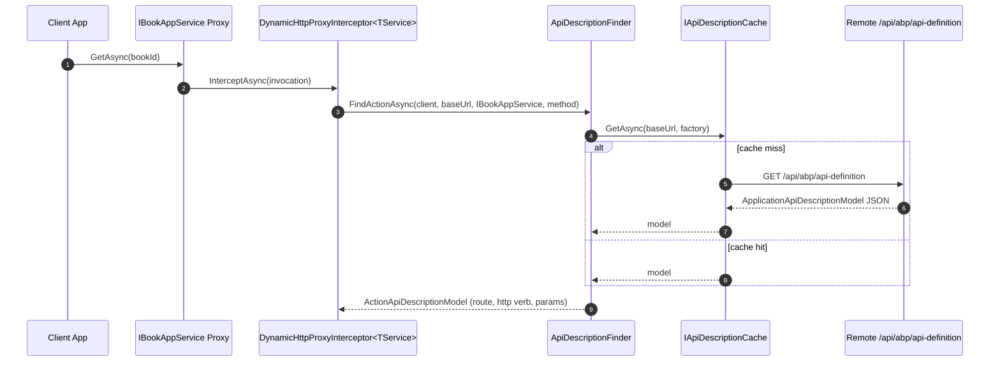
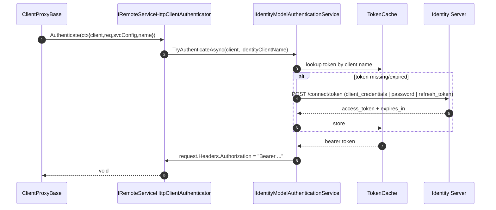
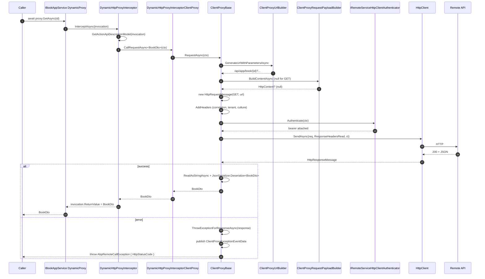

ABP Framework lets a client project call `await _bookAppService.GetAsync(id)` against an interface only — no manually written `HttpClient` code. The trick is a Castle DynamicProxy interceptor registered through `AbpHttpClientModule` that translates each method invocation into a real `HttpRequestMessage` based on a remote `application-api-definition` document. All code paths described here live under [`framework/src/Volo.Abp.Http.Client/`](https://github.com/abpframework/abp/tree/dev/framework/src/Volo.Abp.Http.Client).

<Note>
There are *two* flavours of client proxy: the **dynamic** one (`DynamicHttpProxyInterceptor<TService>`), which discovers the remote API at runtime; and the **static** one (`ClientProxyBase<TService>` generated by `abp generate-proxy`), which embeds the action descriptors at build time. They share `ClientProxyBase` for the actual HTTP work.
</Note>

## Registration

Calling `services.AddHttpClientProxies(typeof(IBookAppService).Assembly, "Default")` (extension in `framework/src/Volo.Abp.Http.Client/`) scans the assembly for `IRemoteService` interfaces and registers each one as a transient that resolves to a `DynamicHttpProxyInterceptorClientProxy<TService>`. Castle DynamicProxy wraps the interface with `DynamicHttpProxyInterceptor<TService>` so every method dispatched through it lands in `InterceptAsync`. The interceptor class itself is defined in `framework/src/Volo.Abp.Http.Client/Volo/Abp/Http/Client/DynamicProxying/DynamicHttpProxyInterceptor.cs`.

## The Interception Entry Point

`DynamicHttpProxyInterceptor<TService>.InterceptAsync(IAbpMethodInvocation invocation)` (see `framework/src/Volo.Abp.Http.Client/Volo/Abp/Http/Client/DynamicProxying/DynamicHttpProxyInterceptor.cs`) is the single hot path:

```csharp
public override async Task InterceptAsync(IAbpMethodInvocation invocation)
{
    var context = new ClientProxyRequestContext(
        await GetActionApiDescriptionModel(invocation),
        invocation.ArgumentsDictionary,
        typeof(TService));

    if (invocation.Method.ReturnType.GenericTypeArguments.IsNullOrEmpty())
    {
        await InterceptorClientProxy.CallRequestAsync(context);
    }
    else
    {
        var returnType = invocation.Method.ReturnType.GenericTypeArguments[0];
        var result = (Task)CallRequestAsyncMethod
            .MakeGenericMethod(returnType)
            .Invoke(this, new object[] { context })!;
        invocation.ReturnValue = await GetResultAsync(result, returnType);
    }
}
```

Three things happen: (1) `GetActionApiDescriptionModel` looks up an `ActionApiDescriptionModel`; (2) the interceptor dispatches to the void-task overload or to a generic `CallRequestAsync<T>` reached by reflection (`CallRequestAsyncMethod.MakeGenericMethod(returnType)`); (3) the unwrapped result is assigned back to `invocation.ReturnValue` so the caller's `await` sees the deserialized DTO.

## API Description Discovery

`GetActionApiDescriptionModel` (same file) reaches into `AbpHttpClientOptions.HttpClientProxies` (see `framework/src/Volo.Abp.Http.Client/Volo/Abp/Http/Client/AbpHttpClientOptions.cs`) for the `DynamicHttpClientProxyConfig` keyed by `typeof(TService)`, fetches the `RemoteServiceConfiguration` from `IRemoteServiceConfigurationProvider`, and asks `IProxyHttpClientFactory.Create(remoteServiceName)` for an `HttpClient`. It then calls `ApiDescriptionFinder.FindActionAsync(client, remoteServiceConfig.BaseUrl, typeof(TService), invocation.Method)`.

`ApiDescriptionFinder.FindActionAsync` in `framework/src/Volo.Abp.Http.Client/Volo/Abp/Http/Client/DynamicProxying/ApiDescriptionFinder.cs` fetches the whole `ApplicationApiDescriptionModel` (cached via `IApiDescriptionCache` per `baseUrl`) by issuing `GET {baseUrl}/api/abp/api-definition`. The cached document is then traversed — `apiDescription.Modules.Values → module.Controllers.Values → controller.Actions.Values` — picking the controller whose `Implements(serviceType)` returns true and then matching `action.Name == method.Name && action.ParametersOnMethod.Count == methodParameters.Length` plus `TypeMatches` for each parameter.



`AddHeaders` on the same finder copies the correlation ID (`AbpCorrelationIdOptions.HttpHeaderName`), the current tenant ID (`TenantResolverConsts.DefaultTenantKey` — note the `TODO` to read the key from `AbpAspNetCoreMultiTenancyOptions`), `Accept-Language` from `CultureInfo.CurrentUICulture.Name`, and a fixed `X-Requested-With: XMLHttpRequest` header onto the discovery request. The same header set is added to actual business requests later by `ClientProxyBase.AddHeaders` (see `framework/src/Volo.Abp.Http.Client/Volo/Abp/Http/Client/ClientProxying/ClientProxyBase.cs`).

## Building the HTTP Request

The real work happens inside `ClientProxyBase<TService>.RequestAsync(ClientProxyRequestContext)` — `framework/src/Volo.Abp.Http.Client/Volo/Abp/Http/Client/ClientProxying/ClientProxyBase.cs`. Step-by-step:

<Steps>
  <Step title="Resolve config and client">
    `ClientOptions.Value.HttpClientProxies.GetOrDefault(requestContext.ServiceType)` returns the per-service config; `RemoteServiceConfigurationProvider.GetConfigurationOrDefaultAsync(clientConfig.RemoteServiceName)` resolves base URL, version, identity client name, etc.; `HttpClientFactory.Create(clientConfig.RemoteServiceName)` returns a pre-configured `HttpClient`.
  </Step>
  <Step title="Resolve API version">
    `GetApiVersionInfoAsync` either returns the ambient `CurrentApiVersionInfo.ApiVersionInfo` or computes one via `FindBestApiVersionAsync` which checks `Action.SupportedVersions` against the configured `RemoteServiceConfiguration.Version`.
  </Step>
  <Step title="Build URL">
    `ClientProxyUrlBuilder.GenerateUrlWithParametersAsync(action, arguments, apiVersion)` — see `framework/src/Volo.Abp.Http.Client/Volo/Abp/Http/Client/ClientProxying/ClientProxyUrlBuilder.cs` — substitutes route parameters from `action.Parameters` and appends query parameters from arguments marked `BindingSourceId == "Query"`.
  </Step>
  <Step title="Build payload">
    `ClientProxyRequestPayloadBuilder.BuildContentAsync(action, arguments, jsonSerializer, apiVersion)` — see `framework/src/Volo.Abp.Http.Client/Volo/Abp/Http/Client/ClientProxying/ClientProxyRequestPayloadBuilder.cs` — chooses between JSON body, form-url-encoded, or multipart depending on parameter binding sources and content types.
  </Step>
  <Step title="Construct HttpRequestMessage">
    `new HttpRequestMessage(requestContext.Action.GetHttpMethod(), url) { Content = ... }`. `AddHeaders(arguments, action, requestMessage, apiVersion)` then appends correlation ID, current tenant, culture, and any `[ApiHeader]` parameters.
  </Step>
  <Step title="Authenticate">
    If `action.AllowAnonymous != true`, `ClientAuthenticator.Authenticate(new RemoteServiceHttpClientAuthenticateContext(client, requestMessage, remoteServiceConfig, clientConfig.RemoteServiceName))` runs. The default `IRemoteServiceHttpClientAuthenticator` is `NullRemoteServiceHttpClientAuthenticator`; in real deployments it is replaced by `IdentityModelRemoteServiceHttpClientAuthenticator` (see `framework/src/Volo.Abp.Http.Client.IdentityModel/Volo/Abp/Http/Client/IdentityModel/IdentityModelRemoteServiceHttpClientAuthenticator.cs`).
  </Step>
  <Step title="Pre-send hooks">
    Anything registered via `AbpHttpClientOptions.ProxyHttpClientPreSendActions[remoteServiceName]` runs against `(clientConfig, requestContext, client)`. This is the place to inject custom headers per-service.
  </Step>
  <Step title="Send">
    `response = await client.SendAsync(requestMessage, HttpCompletionOption.ResponseHeadersRead, cancellationToken)`. Any low-level exception becomes `AbpRemoteCallException("An error occurred during the ABP remote HTTP request ...", ex)`.
  </Step>
</Steps>

## Authentication Detail

`IdentityModelRemoteServiceHttpClientAuthenticator.Authenticate` (see `framework/src/Volo.Abp.Http.Client.IdentityModel/Volo/Abp/Http/Client/IdentityModel/IdentityModelRemoteServiceHttpClientAuthenticator.cs`) delegates to `IIdentityModelAuthenticationService.TryAuthenticateAsync(context.Client, context.RemoteService.GetIdentityClient() ?? context.RemoteServiceName)`. The identity-model service caches access tokens by client name and rotates via refresh tokens or client-credentials flow as configured in `IdentityClientConfiguration` (`framework/src/Volo.Abp.IdentityModel/`).

For Blazor WebAssembly the implementation is `AccessTokenProviderIdentityModelRemoteServiceHttpClientAuthenticator` (`framework/src/Volo.Abp.Http.Client.IdentityModel.WebAssembly/`) which reads the token from `IAccessTokenProvider` instead. The `IAbpAccessTokenProvider` abstraction (`framework/src/Volo.Abp.Http.Client/Volo/Abp/Http/Client/Authentication/IAbpAccessTokenProvider.cs`) standardizes "get me a bearer token for this request" across hosts.



## Response Decoding

After `SendAsync`, `ClientProxyBase` checks `response.IsSuccessStatusCode`. On failure it calls `ThrowExceptionForResponseAsync(response)` (same file). That helper:

1. Parses `WWW-Authenticate` for `error`, `error_description`, `error_uri` via regex.
2. Publishes a `ClientProxyExceptionEventData` to `ILocalEventBus` so middleware can react (e.g. trigger a token refresh).
3. If the response has the `AbpHttpConsts.AbpErrorFormat` header ("`_AbpErrorFormat`"), deserializes a `RemoteServiceErrorResponse` and throws `AbpRemoteCallException(errorResponse.Error) { HttpStatusCode = (int)response.StatusCode }`.
4. Otherwise throws `AbpRemoteCallException` with a synthetic `RemoteServiceErrorInfo { Message = response.ReasonPhrase, Code = StatusCode, Details = errorDescription }`.

On success, the generic `RequestAsync<T>` overload reads `responseContent.ReadAsStringAsync()` and either returns the raw string (when `T == string`), wraps a stream into `RemoteStreamContent` (when `T == IRemoteStreamContent`), or deserializes through `IJsonSerializer.Deserialize<T>(stringContent)`. The default JSON serializer is System.Text.Json registered by `framework/src/Volo.Abp.Json.SystemTextJson/`.

`RequestAsyncEnumerable<T>` uses `System.Text.Json.JsonSerializer.DeserializeAsyncEnumerable<T>(stream, options)` over the open response stream for streaming responses — see the implementation at lines ~60-72 of `ClientProxyBase.cs`.

## End-to-End Sequence



## Two Notable Headers

`AddHeaders` in `ClientProxyBase.cs` stamps the current tenant via `CurrentTenant.Id.Value.ToString()` under the key `TenantResolverConsts.DefaultTenantKey`. On the receiving side, that header is consumed by `HeaderTenantResolveContributor` in `framework/src/Volo.Abp.AspNetCore.MultiTenancy/Volo/Abp/AspNetCore/MultiTenancy/HeaderTenantResolveContributor.cs` — the loop is closed.

The correlation ID comes from `ICorrelationIdProvider.Get()` so a request hop carries the same ID end to end; the remote `AbpCorrelationIdMiddleware` (`framework/src/Volo.Abp.AspNetCore/Volo/Abp/AspNetCore/Tracing/AbpCorrelationIdMiddleware.cs`) accepts it instead of generating a fresh one.

## Static Proxies & Code Generation

`abp generate-proxy -t csharp` (driven by `GenerateProxyCommand` in `framework/src/Volo.Abp.Cli.Core/Volo/Abp/Cli/Commands/GenerateProxyCommand.cs`) emits classes like `BookClientProxy : BookAppService.ClientProxy<TService>, IBookAppService`. Each method calls `await RequestAsync<BookDto>(nameof(GetAsync), new ClientProxyRequestTypeValue { { "id", id } })`. That overload is the *non-dynamic* version of `BuildHttpProxyClientProxyContext` (top of `ClientProxyBase.cs`) — it builds the `methodUniqueName` `$"{typeof(TService).FullName}.{methodName}.{paramTypes}"` and asks `IClientProxyApiDescriptionFinder.FindAction(methodUniqueName)` to look up the descriptor from the pre-generated `ClientProxyApiDescriptionFinder` (see `framework/src/Volo.Abp.Http.Client/Volo/Abp/Http/Client/ClientProxying/ClientProxyApiDescriptionFinder.cs`) — skipping the network discovery entirely.

<Tip>
Use static proxies in production: zero `application-api-definition` round-trip per cold start, deterministic API surface (the build fails when the remote interface changes), no runtime reflection over `ActionApiDescriptionModel`. Dynamic proxies remain useful in dev and for shared-API plug-ins.
</Tip>

## Error Surface

<AccordionGroup>
  <Accordion title="AbpRemoteCallException with HttpStatusCode = 0">
    Thrown from the `catch (Exception ex)` around `client.SendAsync`. The inner exception is the original `HttpRequestException` / `SocketException`. Caused by DNS failures, certificate problems, or cancellation before reaching the server.
  </Accordion>
  <Accordion title="AbpRemoteCallException with non-zero HttpStatusCode and a populated Error">
    Server returned `_AbpErrorFormat: true` so the body was a `RemoteServiceErrorResponse`. The `Error` is the original `RemoteServiceErrorInfo` with code/message/details/validation errors. Re-throw or surface to UI as-is — that is the contract.
  </Accordion>
  <Accordion title="AbpException 'Could not find remote action for method'">
    Thrown by `ApiDescriptionFinder.FindActionAsync` when no `ActionApiDescriptionModel` matches the method signature. Usually a version skew between client and server interfaces, or the action was not exposed (e.g. it lacked `IRemoteService`).
  </Accordion>
  <Accordion title="AbpException 'Could not get DynamicHttpClientProxyConfig'">
    Thrown by `GetActionApiDescriptionModel` when `AbpHttpClientOptions.HttpClientProxies[typeof(TService)]` is missing. You forgot to call `services.AddHttpClientProxies(...)` for the assembly.
  </Accordion>
</AccordionGroup>

The pieces fit together: an interface invocation goes through a Castle interceptor, an `ApiDescriptionFinder`-cached descriptor turns it into an HTTP message, `IRemoteServiceHttpClientAuthenticator` stamps a bearer token, `HttpClient.SendAsync` does the network work, and `IJsonSerializer.Deserialize<T>` hands the DTO back. Errors are uniformly wrapped in `AbpRemoteCallException` with the original `RemoteServiceErrorInfo` whenever the server cooperated.
