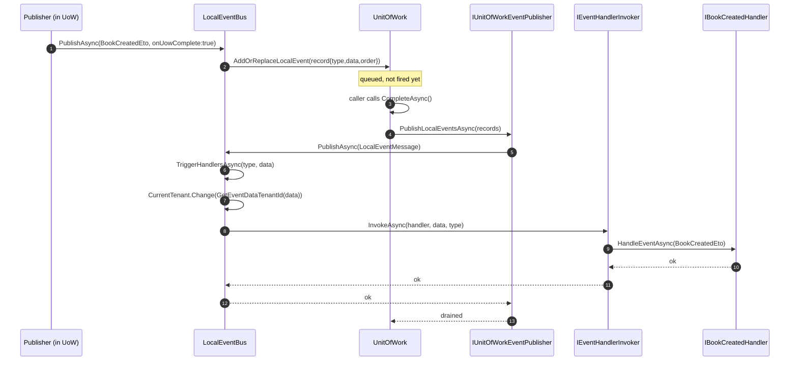
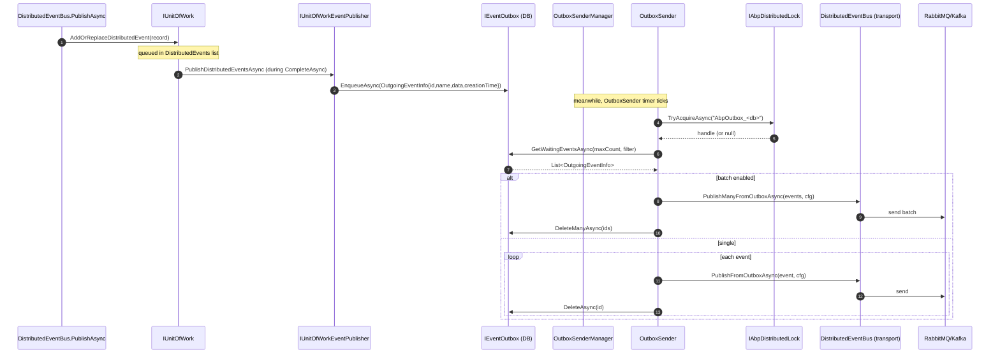
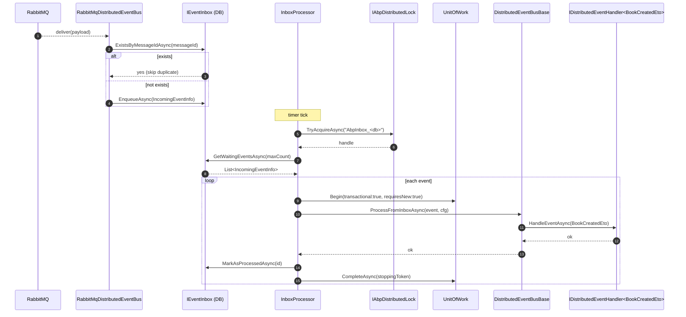
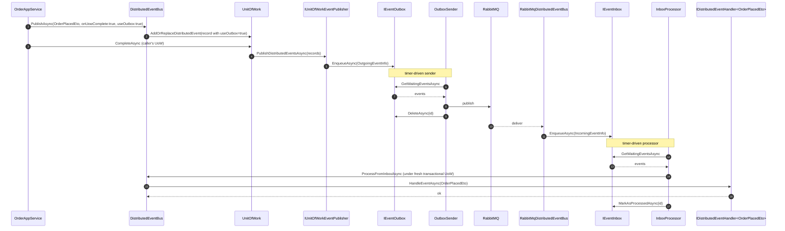

ABP Framework ships two event buses with overlapping APIs but different semantics: `ILocalEventBus` (in-process pub/sub, fire-and-forget by default but UoW-aware) and `IDistributedEventBus` (cross-process via RabbitMQ/Kafka/Azure Service Bus with transactional outbox/inbox boxes). Both inherit from `EventBusBase` in [`framework/src/Volo.Abp.EventBus/Volo/Abp/EventBus/EventBusBase.cs`](https://github.com/abpframework/abp/blob/dev/framework/src/Volo.Abp.EventBus/Volo/Abp/EventBus/EventBusBase.cs).

<Note>
The split is intentional: local events are for *intra-bounded-context* signals (cache invalidation, domain events handled in-process); distributed events are for *cross-service* contracts (other microservices subscribe to them). They are not interchangeable.
</Note>

## EventBusBase: The Shared Pipeline

`EventBusBase` (`framework/src/Volo.Abp.EventBus/Volo/Abp/EventBus/EventBusBase.cs`) defines `PublishAsync(Type, object, bool onUnitOfWorkComplete)`, `Subscribe(...)`, and the internal `TriggerHandlersAsync(eventType, eventData, exceptions, inboxConfig)`. The dependencies wired in via the constructor are `IServiceScopeFactory`, `ICurrentTenant`, `IUnitOfWorkManager`, and `IEventHandlerInvoker`.

`TriggerHandlersAsync` (lines 158-191 of `EventBusBase.cs`) walks `ResolveHandlerFactories(eventType, eventData)` and, for each `EventHandlerFactory`, calls `TriggerHandlerAsync(handlerFactory, type, data, exceptions, inboxConfig)`. The inner method wraps each invocation in `using (CurrentTenant.Change(GetEventDataTenantId(eventData)))` so handlers always run inside the correct tenant scope (deduced from `IMultiTenant.TenantId` on the event data or `IEventDataMayHaveTenantId`).

The handler resolution and inheritance walk is in the second half of `TriggerHandlersAsync`: if the event type implements `IEventDataWithInheritableGenericArgument` (think `EntityCreatedEventData<TBook>`), the bus re-publishes the *base* generic form (`EntityCreatedEventData<TEntity>`) so subscribers to the open generic also get the event.

## LocalEventBus

`LocalEventBus` in `framework/src/Volo.Abp.EventBus/Volo/Abp/EventBus/Local/LocalEventBus.cs` is an `ISingletonDependency` (`[ExposeServices(typeof(ILocalEventBus), typeof(LocalEventBus))]`). Its state is three `ConcurrentDictionary`s: `HandlerFactories<Type, List<IEventHandlerFactory>>`, `EventTypes<string, Type>`, and `DynamicEventHandlerFactories<string, List<IEventHandlerFactory>>`. The constructor subscribes the handlers listed in `AbpLocalEventBusOptions.Handlers` (configured by modules via `services.Configure<AbpLocalEventBusOptions>(o => o.Handlers.Add<MyHandler>())`).

`PublishAsync(string eventName, object eventData, bool onUnitOfWorkComplete = true)` (around line 173 of `LocalEventBus.cs`) routes through:

```csharp
protected override async Task PublishToEventBusAsync(Type eventType, object eventData)
{
    await PublishAsync(new LocalEventMessage(Guid.NewGuid(), eventData, eventType));
}

protected override void AddToUnitOfWork(IUnitOfWork unitOfWork, UnitOfWorkEventRecord eventRecord)
{
    unitOfWork.AddOrReplaceLocalEvent(eventRecord);
}

public virtual async Task PublishAsync(LocalEventMessage localEventMessage)
{
    await TriggerHandlersAsync(localEventMessage.EventType, localEventMessage.EventData);
}
```

The `AddToUnitOfWork` override is what makes UoW-bound publication work: if the publisher is inside a `UnitOfWork` *and* `onUnitOfWorkComplete == true`, the base `PublishAsync` queues the event onto the UoW via `IUnitOfWork.AddOrReplaceLocalEvent(record)`. The UoW's `CompleteAsync` drain loop then publishes them through `IUnitOfWorkEventPublisher.PublishLocalEventsAsync`, which calls back into `LocalEventBus` (see `framework/src/Volo.Abp.EventBus/Volo/Abp/EventBus/UnitOfWorkEventPublisher.cs`).



When `onUnitOfWorkComplete: false` (or there is no ambient UoW), `LocalEventBus.PublishAsync` calls `TriggerHandlersAsync` directly — same path, no queueing.

## DistributedEventBus: Outbox-First

`DistributedEventBusBase` (`framework/src/Volo.Abp.EventBus/Volo/Abp/EventBus/Distributed/DistributedEventBusBase.cs`) extends `EventBusBase` with outbox/inbox semantics. `PublishAsync(Type, object, bool onUnitOfWorkComplete = true)` defaults `useOutbox = true`:

```csharp
public virtual async Task PublishAsync(Type eventType, object eventData, bool onUnitOfWorkComplete = true, bool useOutbox = true)
{
    if (onUnitOfWorkComplete && UnitOfWorkManager.Current != null)
    {
        AddToUnitOfWork(UnitOfWorkManager.Current,
            new UnitOfWorkEventRecord(eventType, eventData, EventOrderGenerator.GetNext(), useOutbox));
        return;
    }
    if (useOutbox)
    {
        if (await AddToOutboxAsync(eventType, eventData)) return;
    }
    await PublishToEventBusAsync(eventType, eventData);
    await TriggerDistributedEventSentAsync(new DistributedEventSent { Source = DistributedEventSource.Direct, ... });
}
```

The UoW path adds a `UnitOfWorkEventRecord` with the `useOutbox` flag so the UoW publisher knows which channel to use during drain. The outbox path calls `AddToOutboxAsync(eventType, eventData)` (in the same file), which iterates `AbpDistributedEventBusOptions.Outboxes.Values` looking for one whose `EventSelector` matches; if any matches, an `OutgoingEventInfo` is enqueued via `IEventOutbox.EnqueueAsync` and the method returns true.

If both paths fail (no UoW, no matching outbox), the bus calls the abstract `PublishToEventBusAsync` — the transport-specific implementation (RabbitMQ, Kafka, etc.) sends the message directly to the broker.

## The Outbox Sender Loop

`OutboxSenderManager` (`framework/src/Volo.Abp.EventBus/Volo/Abp/EventBus/Distributed/OutboxSenderManager.cs`) is registered as `IBackgroundWorker`. Its `StartAsync` iterates `Options.Outboxes.Values` and, for each `outboxConfig` where `IsSendingEnabled`, resolves an `IOutboxSender` and calls `sender.StartAsync(outboxConfig, cancellationToken)`.

`OutboxSender` (`framework/src/Volo.Abp.EventBus/Volo/Abp/EventBus/Distributed/OutboxSender.cs`) installs an `AbpAsyncTimer` whose `Elapsed` calls `RunAsync`. `RunAsync` acquires an `IAbpDistributedLock.TryAcquireAsync($"AbpOutbox_{OutboxConfig.DatabaseName}")` (so only one host across the cluster polls a given outbox at a time), then loops:

<Steps>
  <Step title="Get waiting events">
    `await Outbox.GetWaitingEventsAsync(EventBusBoxesOptions.OutboxWaitingEventMaxCount, OutboxProcessorFilter, StoppingToken)` returns a `List<OutgoingEventInfo>`.
  </Step>
  <Step title="Batch or single dispatch">
    If `EventBusBoxesOptions.BatchPublishOutboxEvents` is true, `DistributedEventBus.AsSupportsEventBoxes().PublishManyFromOutboxAsync(waitingEvents, OutboxConfig)`. Otherwise loop each event: `PublishFromOutboxAsync(waitingEvent, OutboxConfig)`.
  </Step>
  <Step title="Delete after send">
    `await Outbox.DeleteAsync(waitingEvent.Id)` (or `DeleteManyAsync(...)`) removes the row.
  </Step>
  <Step title="Continue or wait">
    If the page was empty, exit the inner while. The timer will fire again after `EventBusBoxesOptions.PeriodTimeSpan`.
  </Step>
</Steps>

If the distributed lock cannot be acquired, the sender does `await Task.Delay(EventBusBoxesOptions.DistributedLockWaitDuration, StoppingToken)` and tries again next tick.



## The Inbox Processor Loop

On the consuming side, `InboxProcessor` (`framework/src/Volo.Abp.EventBus/Volo/Abp/EventBus/Distributed/InboxProcessor.cs`) is structurally similar to `OutboxSender`. It starts via `InboxProcessManager` (sibling file), holds an `AbpAsyncTimer`, acquires an `IAbpDistributedLock` named `$"AbpInbox_{InboxConfig.DatabaseName}"`, and loops:

1. `DeleteOldEventsAsync()` — clears processed rows older than `OldEventRetentionDuration`.
2. `var waitingEvents = await GetWaitingEventsAsync()`.
3. For each `IncomingEventInfo`, opens a transactional UoW (`UnitOfWorkManager.Begin(isTransactional: true, requiresNew: true)`) and calls `DistributedEventBus.AsSupportsEventBoxes().ProcessFromInboxAsync(waitingEvent, InboxConfig)`. On success, `Inbox.MarkAsProcessedAsync(id)`, then `uow.CompleteAsync(StoppingToken)`.
4. On exception, the policy from `EventBusBoxesOptions.InboxProcessorFailurePolicy` decides: `Retry` (rethrow, lock retry next tick), or `RetryLater` (open a new UoW, increment `RetryCount`, schedule `NextRetryTime`).

The actual message arrival is done by the transport-specific consumer. For RabbitMQ that is in `framework/src/Volo.Abp.EventBus.RabbitMQ/`; for Kafka, `framework/src/Volo.Abp.EventBus.Kafka/`. Those consumers receive the broker frame and call `eventInbox.EnqueueAsync(incomingEventInfo)` when an inbox is configured for the event — see `DistributedEventBusBase.AddToInboxAsync` in `framework/src/Volo.Abp.EventBus/Volo/Abp/EventBus/Distributed/DistributedEventBusBase.cs`.



## Handler Invocation

`EventHandlerInvoker` (`framework/src/Volo.Abp.EventBus/Volo/Abp/EventBus/EventHandlerInvoker.cs`) caches a compiled `MethodInfo.Invoke` delegate per `(handlerType, eventType)` pair. The cache item is an `EventHandlerInvokerCacheItem` (sibling file). The actual call resolves the right `HandleEventAsync(TEvent)` method on the handler via reflection but reuses the compiled delegate from cache for subsequent calls — important when an event has dozens of subscribers.

`TriggerHandlerAsync` (lines 277-303 of `EventBusBase.cs`) wraps each invocation in `try { await InvokeEventHandlerAsync(eventHandlerWrapper.EventHandler, eventData, eventType); } catch (TargetInvocationException ex) { exceptions.Add(ex.InnerException!); } catch (Exception ex) { exceptions.Add(ex); }`. The outer `TriggerHandlersAsync` (line 146) collects exceptions and calls `ThrowOriginalExceptions(eventType, exceptions)` after the loop. So one handler's failure does not skip later handlers, but the publisher does see an aggregated `AggregateException` (or the single inner if there is only one).

## Tenant Scoping

`GetEventDataTenantId` (lines 313-321 of `EventBusBase.cs`) reads the tenant ID off the event:

```csharp
protected virtual Guid? GetEventDataTenantId(object eventData) => eventData switch
{
    IMultiTenant multiTenantEventData => multiTenantEventData.TenantId,
    IEventDataMayHaveTenantId e when e.IsMultiTenant(out var t) => t,
    _ => CurrentTenant.Id
};
```

`TriggerHandlerAsync` then wraps the invocation in `using (CurrentTenant.Change(GetEventDataTenantId(eventData)))`. That guarantees a handler executing a database query sees the right tenant filter, even if it runs on the *inbox processor's* background thread (which has no HTTP context to derive a tenant from). The pattern is essential for multi-tenant integration events.

## Subscription Registration

Modules subscribe via `services.AddSingleton<IEventHandler, MyHandler>()` (auto-discovered) plus the conventions in `framework/src/Volo.Abp.EventBus/Volo/Abp/EventBus/AbpEventBusModule.cs`. The module's `OnApplicationInitialization` enumerates everything in DI that implements `IEventHandler` and calls `eventBus.Subscribe(eventType, factory)` for each matching `ILocalEventHandler<TEvent>` / `IDistributedEventHandler<TEvent>`. Factories come in three flavours:

- `SingleInstanceHandlerFactory` (`framework/src/Volo.Abp.EventBus/Volo/Abp/EventBus/SingleInstanceHandlerFactory.cs`) — wraps an already-constructed handler.
- `TransientEventHandlerFactory<THandler>` (`framework/src/Volo.Abp.EventBus/Volo/Abp/EventBus/TransientEventHandlerFactory.cs`) — `Activator.CreateInstance<THandler>()` per dispatch.
- `IocEventHandlerFactory` (`framework/src/Volo.Abp.EventBus/Volo/Abp/EventBus/IocEventHandlerFactory.cs`) — resolves the handler from DI inside a fresh scope, properly disposing afterwards. Most production handlers use this.

`IocEventHandlerFactory.GetHandler()` returns an `EventHandlerDisposeWrapper` whose `Dispose` disposes the inner DI scope.

## End-to-End Distributed Flow



## Idempotency via Message ID

`AddToInboxAsync` in `DistributedEventBusBase.cs` checks `await eventInbox.ExistsByMessageIdAsync(messageId!)` before enqueueing. The message ID is the broker-side identifier (e.g. RabbitMQ's `MessageId` property). If the same broker re-delivers a frame (because the consumer crashed before ACK), the inbox sees the duplicate and skips it. That, plus the per-event `IabpDistributedLock`, gives at-least-once-with-dedup semantics suitable for most business workloads.

<Warning>
`OutboxSender` writes the event to the broker *and then* deletes the row. If the process crashes between those two operations, the broker has the message but the outbox still has the row. The next tick will re-publish. Consumers must be idempotent — which is exactly what the inbox provides on the receiving side.
</Warning>

## TriggerDistributedEventSent / Received

After a successful direct publish, `TriggerDistributedEventSentAsync` (lines 261-271 of `DistributedEventBusBase.cs`) calls `LocalEventBus.PublishAsync(distributedEvent, onUnitOfWorkComplete: false)` with a `DistributedEventSent` payload. Symmetrically `TriggerDistributedEventReceivedAsync` fires for every received event. These are internal observability hooks — modules can subscribe to them for logging, metrics, or chaos testing.

## Failure Modes

<AccordionGroup>
  <Accordion title="Handler exception swallowed (Local)">
    Don't — they are not swallowed. `TriggerHandlersAsync` collects exceptions in a list and calls `ThrowOriginalExceptions(eventType, exceptions)` at the end. The publisher sees them after all handlers have had a chance to run.
  </Accordion>
  <Accordion title="Outbox row stuck forever">
    Means the transport call kept throwing. Look at the `OutboxSender` logs — it logs `Sent the event to the message broker with id = ...` on success. Persistent failures usually indicate broker unreachable or auth misconfiguration. The row stays until the broker accepts.
  </Accordion>
  <Accordion title="Inbox event retried indefinitely">
    With `InboxProcessorFailurePolicy.Retry` and a poison message you loop. Switch to `RetryLater`, which stamps `RetryCount` and `NextRetryTime` so the handler backs off (see `framework/src/Volo.Abp.EventBus/Volo/Abp/EventBus/Distributed/InboxProcessor.cs`).
  </Accordion>
  <Accordion title="Wrong tenant inside a handler">
    Make the event implement `IMultiTenant` and populate `TenantId` in the producer. `TriggerHandlerAsync`'s `CurrentTenant.Change(GetEventDataTenantId(eventData))` then sets the right tenant before invoking your handler.
  </Accordion>
</AccordionGroup>

ABP Framework's event bus is the integration spine: in-process work uses `LocalEventBus` with UoW-bound publish so domain events commit atomically; cross-process work uses `DistributedEventBus` with outbox-on-publish + inbox-on-consume + distributed-lock-on-poll for exactly-once-effects (at-least-once-with-dedup). The shared `EventBusBase` handles handler resolution, tenant scoping, and exception aggregation for both.
