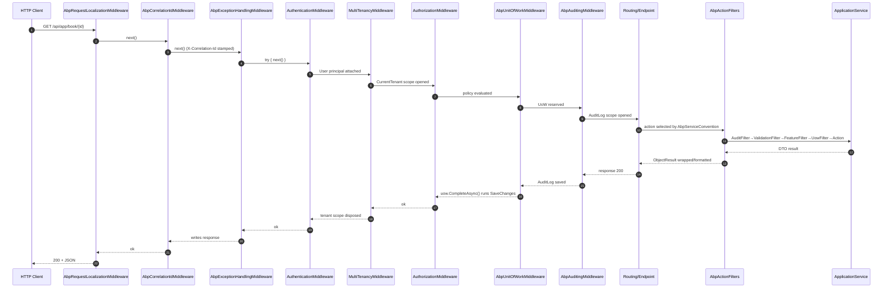

ABP Framework layers its own middleware and MVC filters on top of ASP.NET Core's pipeline. The order is established by `IOnApplicationInitialization.OnApplicationInitializationAsync` overrides in framework modules plus the developer's `app.UseXxx()` calls inside the host module. The canonical extension methods are in [`framework/src/Volo.Abp.AspNetCore/Microsoft/AspNetCore/Builder/AbpApplicationBuilderExtensions.cs`](https://github.com/abpframework/abp/blob/dev/framework/src/Volo.Abp.AspNetCore/Microsoft/AspNetCore/Builder/AbpApplicationBuilderExtensions.cs).

<Note>
This page focuses on the MVC-style API path (Application Services exposed as controllers via `AbpServiceConvention`). The same middleware applies to Razor Pages, Minimal APIs, and Blazor Server.
</Note>

## The Pipeline at a Glance

A typical ABP Framework module composes the following pipeline in order — every entry is a real extension method declared in `framework/src/Volo.Abp.AspNetCore/Microsoft/AspNetCore/Builder/AbpApplicationBuilderExtensions.cs`:

<Steps>
  <Step title="UseAbpRequestLocalization">
    Resolves `IAbpRequestLocalizationOptionsProvider`, calls `InitLocalizationOptions(optionsAction)`, then registers `AbpRequestLocalizationMiddleware` (in `framework/src/Volo.Abp.AspNetCore/Microsoft/AspNetCore/RequestLocalization/`).
  </Step>
  <Step title="UseCorrelationId">
    `AbpCorrelationIdMiddleware` from `framework/src/Volo.Abp.AspNetCore/Volo/Abp/AspNetCore/Tracing/AbpCorrelationIdMiddleware.cs` reads or generates the `X-Correlation-Id` header and stashes it in `ICorrelationIdProvider`.
  </Step>
  <Step title="UseAbpExceptionHandling">
    Idempotent — the marker key `"_AbpExceptionHandlingMiddleware_Added"` is checked in `AbpApplicationBuilderExtensions.UseAbpExceptionHandling`. The middleware itself is `AbpExceptionHandlingMiddleware` (`framework/src/Volo.Abp.AspNetCore/Volo/Abp/AspNetCore/ExceptionHandling/AbpExceptionHandlingMiddleware.cs`).
  </Step>
  <Step title="UseAuthentication / UseMultiTenancy / UseAuthorization">
    Standard ASP.NET Core auth, then ABP's `MultiTenancyMiddleware` (`framework/src/Volo.Abp.AspNetCore.MultiTenancy/Volo/Abp/AspNetCore/MultiTenancy/MultiTenancyMiddleware.cs`), then auth-z.
  </Step>
  <Step title="UseUnitOfWork">
    `AbpUnitOfWorkMiddleware` (`framework/src/Volo.Abp.AspNetCore/Volo/Abp/AspNetCore/Uow/AbpUnitOfWorkMiddleware.cs`) reserves a UoW. Note that `UseUnitOfWork` first calls `UseAbpExceptionHandling()` internally (the marker prevents double-add).
  </Step>
  <Step title="UseAuditing">
    `AbpAuditingMiddleware` from `framework/src/Volo.Abp.AspNetCore/Volo/Abp/AspNetCore/Auditing/AbpAuditingMiddleware.cs`.
  </Step>
  <Step title="UseRouting / UseEndpoints">
    Standard ASP.NET Core. MVC filters now run per-action.
  </Step>
</Steps>

## High-Level Sequence



## Localization & Correlation

`AbpRequestLocalizationMiddleware` (in `framework/src/Volo.Abp.AspNetCore/Microsoft/AspNetCore/RequestLocalization/`) wraps ASP.NET Core's `RequestLocalizationMiddleware`, but defers `CultureInfo.CurrentCulture` assignment until *after* the tenancy middleware so a tenant's default language can override the request culture (see how `MultiTenancyMiddleware.InvokeAsync` sets `context.Items[AbpRequestLocalizationMiddleware.HttpContextItemName] = true` in `framework/src/Volo.Abp.AspNetCore.MultiTenancy/Volo/Abp/AspNetCore/MultiTenancy/MultiTenancyMiddleware.cs`).

`AbpCorrelationIdMiddleware` in `framework/src/Volo.Abp.AspNetCore/Volo/Abp/AspNetCore/Tracing/AbpCorrelationIdMiddleware.cs` reads `AbpCorrelationIdOptions.HttpHeaderName` (default `X-Correlation-Id`) and either uses the incoming value or generates a GUID. The same ID flows out on the response and onto outgoing `HttpClient` calls via `ClientProxyBase` (see `framework/src/Volo.Abp.Http.Client/Volo/Abp/Http/Client/ClientProxying/ClientProxyBase.cs`).

## Exception Handling Wrap

`AbpExceptionHandlingMiddleware.InvokeAsync` in `framework/src/Volo.Abp.AspNetCore/Volo/Abp/AspNetCore/ExceptionHandling/AbpExceptionHandlingMiddleware.cs` does the classic try/await/catch around `next(context)`. The catch checks `context.Response.HasStarted` and rethrows if true. Otherwise it consults `context.Items["_AbpActionInfo"]` — the `AbpActionInfoInHttpContext` stamped by `AbpUowActionFilter` — and only wraps the exception if `IsObjectResult` is true (i.e. an API endpoint, not a Razor Page).

The wrap path calls `HandleAndWrapException`:
1. Resolves `IOptions<AbpExceptionHandlingOptions>` and logs via `_logger.LogException(exception)` when `ShouldLogException` returns true.
2. Resolves `IExceptionNotifier` and awaits `NotifyAsync(new ExceptionNotificationContext(exception))`.
3. If `exception is AbpAuthorizationException`, delegates to `IAbpAuthorizationExceptionHandler.HandleAsync(...)` (see `framework/src/Volo.Abp.AspNetCore/Volo/Abp/AspNetCore/ExceptionHandling/DefaultAbpAuthorizationExceptionHandler.cs`).
4. Otherwise resolves `IHttpExceptionStatusCodeFinder` (default `DefaultHttpExceptionStatusCodeFinder` in the same folder) to map exception → status code, clears the response, stamps `AbpHttpConsts.AbpErrorFormat = "true"`, sets `Content-Type: application/json`, and writes `RemoteServiceErrorResponse` via `IJsonSerializer`.

The `IExceptionToErrorInfoConverter` step is critical: it converts arbitrary exceptions to `RemoteServiceErrorInfo` (code, message, details, validation errors, optional stack trace) based on `SendExceptionsDetailsToClients`, `SendStackTraceToClients`, and `SendExceptionDataToClientTypes` from `AbpExceptionHandlingOptions`. See `framework/src/Volo.Abp/Volo/Abp/ExceptionHandling/ExceptionToErrorInfoConverter.cs` for the default conversion logic.

<Warning>
`AbpExceptionHandlingMiddleware` only wraps when `_AbpActionInfo.IsObjectResult` is true. That key is set by `AbpUowActionFilter` (`framework/src/Volo.Abp.AspNetCore.Mvc/Volo/Abp/AspNetCore/Mvc/Uow/AbpUowActionFilter.cs`). For non-MVC endpoints — like a custom middleware route — you get the *original* exception, not the JSON envelope. Use `AbpExceptionFilter` (in `Mvc/ExceptionHandling/`) plus `IExceptionFilter` registration for those.
</Warning>

## Authentication, Tenancy, Authorization

ASP.NET Core's `AuthenticationMiddleware` runs first and populates `HttpContext.User`. ABP's `MultiTenancyMiddleware.InvokeAsync` (`framework/src/Volo.Abp.AspNetCore.MultiTenancy/Volo/Abp/AspNetCore/MultiTenancy/MultiTenancyMiddleware.cs`) then resolves the tenant via `ITenantConfigurationProvider.GetAsync(saveResolveResult: true)` and, if `tenant?.Id != _currentTenant.Id`, opens a `_currentTenant.Change(tenant?.Id, tenant?.Name)` scope that wraps the rest of the request. See the **Tenancy Resolution** page for the contributor chain.

Inside that tenant scope, `AuthorizationMiddleware` evaluates `[Authorize(...)]` and ABP's permission policies (registered via `AbpAuthorizationOptions`). Failures throw `AbpAuthorizationException`, which the exception middleware (already upstream in the pipeline) catches and routes through `IAbpAuthorizationExceptionHandler`.

## Unit of Work Reservation

`AbpUnitOfWorkMiddleware.InvokeAsync` in `framework/src/Volo.Abp.AspNetCore/Volo/Abp/AspNetCore/Uow/AbpUnitOfWorkMiddleware.cs` short-circuits via `ShouldSkipAsync` for things like Razor Components endpoint requests, then opens:

```csharp
using (var uow = _unitOfWorkManager.Reserve(UnitOfWork.UnitOfWorkReservationName))
{
    await next(context);
    await uow.CompleteAsync(_cancellationTokenProvider.Token);
}
```

The reservation is a *named* UoW — `UnitOfWork.UnitOfWorkReservationName = "_AbpActionUnitOfWork"` (see `framework/src/Volo.Abp.Uow/Volo/Abp/Uow/UnitOfWork.cs`). Reservation means: "if any code downstream calls `IUnitOfWorkManager.TryBeginReserved(name, options)`, hand them this existing UoW instead of nesting a child." That handshake is exactly what `AbpUowActionFilter` does (next section).

`IsIgnoredUrl` checks `AbpAspNetCoreUnitOfWorkOptions.IgnoredUrls` from `framework/src/Volo.Abp.AspNetCore/Volo/Abp/AspNetCore/Uow/AbpAspNetCoreUnitOfWorkOptions.cs`. Static-file paths and health checks usually opt out.

## Routing & Endpoint Selection

The MVC controller list itself was reshaped at startup by `AbpServiceConvention` (`framework/src/Volo.Abp.AspNetCore.Mvc/Volo/Abp/AspNetCore/Mvc/Conventions/AbpServiceConvention.cs`). Its `Apply(ApplicationModel application)` runs `ApplyForControllers` → `RemoveDuplicateControllers` → `RemoveIntegrationControllersIfNotExposed` (skipping integration controllers when `AbpAspNetCoreMvcOptions.ExposeIntegrationServices` is false) and then, for each controller implementing `IRemoteService` or marked `[RemoteService]`, calls `ConfigureRemoteService(controller, configuration)` to rewrite route templates via `IConventionalRouteBuilder`.

So a `BookAppService : ApplicationService, IBookAppService` ends up exposed at `/api/app/book` even though no `[Route]` attribute exists. Routing then dispatches the matched `ControllerActionDescriptor` and the per-action filter chain runs.

## Action Filter Pipeline

ABP's action filters are registered as `IAsyncActionFilter` + `IAbpFilter` + `ITransientDependency` so they apply globally. Order is established by the framework's `MvcOptions` configuration (`framework/src/Volo.Abp.AspNetCore.Mvc/`). The effective order during `OnActionExecutionAsync`:

1. **`AbpAuditActionFilter`** (`framework/src/Volo.Abp.AspNetCore.Mvc/Volo/Abp/AspNetCore/Mvc/Auditing/AbpAuditActionFilter.cs`) — calls `ShouldSaveAudit`, then wraps the rest of the chain in `using (AbpCrossCuttingConcerns.Applying(context.Controller, AbpCrossCuttingConcerns.Auditing))`, starts a `Stopwatch`, and records the `AuditLogActionInfo` afterwards.
2. **`AbpValidationActionFilter`** (`framework/src/Volo.Abp.AspNetCore.Mvc/Volo/Abp/AspNetCore/Mvc/Validation/AbpValidationActionFilter.cs`) — short-circuits for non-controller / non-object-result actions, checks `[DisableValidation]`, calls `IModelStateValidator.Validate(context.ModelState)`, and if the controller is `IValidationEnabled` invokes `IMethodInvocationValidator.ValidateAsync` over the method's `MethodInvocationValidationContext`.
3. **`AbpFeatureActionFilter`** (`framework/src/Volo.Abp.AspNetCore.Mvc/Volo/Abp/AspNetCore/Mvc/Features/AbpFeatureActionFilter.cs`) — enforces `[RequiresFeature]`.
4. **`AbpUowActionFilter`** (`framework/src/Volo.Abp.AspNetCore.Mvc/Volo/Abp/AspNetCore/Mvc/Uow/AbpUowActionFilter.cs`) — the bridge between the reserved middleware UoW and the per-action UoW (see below).
5. The **action** itself executes — the application service or controller method.
6. **`AbpExceptionFilter`** (`framework/src/Volo.Abp.AspNetCore.Mvc/Volo/Abp/AspNetCore/Mvc/ExceptionHandling/AbpExceptionFilter.cs`) catches `Exception` on the way out for object results and produces the JSON envelope analogous to the middleware path.

```mermaid
sequenceDiagram
    autonumber
    participant R as Endpoint
    participant Aud as AbpAuditActionFilter
    participant Val as AbpValidationActionFilter
    participant Feat as AbpFeatureActionFilter
    participant Uow as AbpUowActionFilter
    participant Mgr as IUnitOfWorkManager
    participant Svc as IBookAppService
    R->>Aud: OnActionExecutionAsync(ctx, next)
    Aud->>Val: stopwatch start; next()
    Val->>Val: IModelStateValidator.Validate
    Val->>Val: IMethodInvocationValidator.ValidateAsync
    Val->>Feat: next()
    Feat->>Feat: [RequiresFeature] check
    Feat->>Uow: next()
    Uow->>Mgr: TryBeginReserved("_AbpActionUnitOfWork", options)
    Mgr-->>Uow: true (reserved by middleware)
    Uow->>Svc: action delegate runs
    Svc-->>Uow: BookDto
    Uow->>Mgr: SaveChangesAsync(cancellationToken)
    Uow-->>Feat: ok
    Feat-->>Val: ok
    Val-->>Aud: ok
    Aud->>Aud: stopwatch stop; AuditLogAction saved
    Aud-->>R: ObjectResult
```

## The UoW Filter ↔ Middleware Handshake

`AbpUowActionFilter.OnActionExecutionAsync` (see `framework/src/Volo.Abp.AspNetCore.Mvc/Volo/Abp/AspNetCore/Mvc/Uow/AbpUowActionFilter.cs`) sets `context.HttpContext.Items["_AbpActionInfo"] = new AbpActionInfoInHttpContext { IsObjectResult = context.ActionDescriptor.HasObjectResult() }`. This is the very flag the exception middleware later reads.

If the action has `[UnitOfWork(IsDisabled = true)]`, it simply calls `await next()`. Otherwise it builds `AbpUnitOfWorkOptions` from the attribute (or from defaults via `IUnitOfWorkTransactionBehaviourProvider`) and tries `unitOfWorkManager.TryBeginReserved(UnitOfWork.UnitOfWorkReservationName, options)`. When `true` (the normal path — middleware reserved one) it runs the action, inspects the `ActionExecutedContext` via `Succeed(result)`, then calls either `SaveChangesAsync` or `RollbackAsync` on the manager. The outer `using` in the middleware later calls `CompleteAsync`, which commits the transaction.

When the middleware was skipped (Razor Components, ignored URL), the filter falls back to `using (var uow = unitOfWorkManager.Begin(options))` plus `await uow.CompleteAsync(...)` / `await uow.RollbackAsync(...)`. See the **UoW & Transaction** page for what happens inside `CompleteAsync`.

## Validation Details

`AbpValidationActionFilter` consults `AbpAspNetCoreMvcOptions.AutoModelValidation`. When enabled it calls `IModelStateValidator.Validate(context.ModelState)` (default `ModelStateValidator` in `framework/src/Volo.Abp.AspNetCore.Mvc/Volo/Abp/AspNetCore/Mvc/Validation/ModelStateValidator.cs`) which throws `AbpValidationException` if any model errors exist. Then if `context.Controller is IValidationEnabled` it calls `IMethodInvocationValidator.ValidateAsync` from `framework/src/Volo.Abp.Validation/`. That walks `IObjectValidationContributor`s (DataAnnotations, FluentValidation if registered, `IValidatableObject`, custom).

The filter skips entirely when `ReflectionHelper.GetSingleAttributeOfMemberOrDeclaringTypeOrDefault<DisableValidationAttribute>(method)` returns non-null on either the method or the controller class.

## Application Service Invocation

The action method is just a thin C# call. For `ApplicationService` (base class in `framework/src/Volo.Abp.Ddd.Application/`), the service has `IAbpLazyServiceProvider` which exposes `CurrentUser`, `CurrentTenant`, `Logger`, `Clock`, `LocalEventBus`, etc. via lazy property accessors. The UoW from step 4 is ambient via `AsyncLocal`, so every `IRepository<T>` call inside the action participates automatically (see `framework/src/Volo.Abp.Uow/Volo/Abp/Uow/AmbientUnitOfWork.cs`).

## Response Wrapping & Status Code Mapping

For success the result usually flows through `ObjectResult` and ASP.NET Core's content negotiation. For errors the `IHttpExceptionStatusCodeFinder` (registered in `framework/src/Volo.Abp.AspNetCore/Volo/Abp/AspNetCore/ExceptionHandling/DefaultHttpExceptionStatusCodeFinder.cs`) maps:

| Exception type | Status code |
| --- | --- |
| `IBusinessException` (and `BusinessException`) | 403 / configurable via `AbpExceptionHttpStatusCodeOptions` |
| `EntityNotFoundException` | 404 |
| `AbpAuthorizationException` (anonymous) | 401 |
| `AbpAuthorizationException` (authenticated) | 403 |
| `AbpValidationException` | 400 |
| anything else | 500 |

The mapping table lives in `AbpExceptionHttpStatusCodeOptions` (`framework/src/Volo.Abp.AspNetCore/Volo/Abp/AspNetCore/ExceptionHandling/AbpExceptionHttpStatusCodeOptions.cs`) and is populated by `AbpAspNetCoreModule.ConfigureServices` (see `framework/src/Volo.Abp.AspNetCore/Volo/Abp/AspNetCore/AbpAspNetCoreModule.cs`).

The error body is always shaped like:

```json
{
  "error": {
    "code": "Volo.MyApp:00001",
    "message": "...",
    "details": "...",
    "data": { },
    "validationErrors": [ ]
  }
}
```

Produced by `IExceptionToErrorInfoConverter.Convert(exception, options)` and serialized via `IJsonSerializer` (System.Text.Json by default — see `framework/src/Volo.Abp.Json.SystemTextJson/`).

## Auditing the Whole Thing

`AbpAuditingMiddleware` (`framework/src/Volo.Abp.AspNetCore/Volo/Abp/AspNetCore/Auditing/AbpAuditingMiddleware.cs`) opens an `IAuditingManager.BeginScope()` so the entire request gets a single `AuditLogInfo` to which `AbpAuditActionFilter` appends `AuditLogActionInfo` entries per action. On the way out it flushes via `IAuditingManager.SaveAsync()` if the request should be audited (controlled by `AbpAuditingOptions`).

<Tip>
Audit scope is *inside* the UoW middleware but *outside* the action filter — that ordering ensures the audit log save itself participates in the same database transaction as the business work. Reverse the order and you can end up with a successful action whose audit row is rolled back.
</Tip>

## Error Path Sequence

```mermaid
sequenceDiagram
    autonumber
    participant Ex as AbpExceptionHandlingMiddleware
    participant UoW as AbpUnitOfWorkMiddleware
    participant Filter as AbpUowActionFilter
    participant Svc as IBookAppService
    participant Conv as IExceptionToErrorInfoConverter
    participant Js as IJsonSerializer
    UoW->>Filter: next()
    Filter->>Svc: action runs
    Svc-->>Filter: throws AbpValidationException
    Filter->>Filter: Succeed(result)=false -> RollbackAsync
    Filter-->>UoW: rethrows
    UoW-->>Ex: rethrows (uow.CompleteAsync not called)
    Ex->>Ex: catch; IsObjectResult=true
    Ex->>Conv: Convert(ex, options)
    Conv-->>Ex: RemoteServiceErrorInfo
    Ex->>Js: Serialize(RemoteServiceErrorResponse)
    Ex->>Ex: response.StatusCode = 400; write JSON
```

## Putting It Together

The full ordered pipeline for a typical ABP Framework Web API request:

`Request → AbpRequestLocalization → AbpCorrelationId → AbpExceptionHandling → Authentication → MultiTenancy → Authorization → AbpUnitOfWork → AbpAuditing → Routing → [AbpAudit → AbpValidation → AbpFeature → AbpUow]ActionFilters → Action → return → ObjectResult → AbpExceptionFilter (on error) → uow.CompleteAsync → audit save → response`

Each name in that chain ties to one file under `framework/src/Volo.Abp.AspNetCore/` or `framework/src/Volo.Abp.AspNetCore.Mvc/`. Keep this page open alongside the **UoW & Transaction** page (which expands what `CompleteAsync` actually does) and the **Authentication** page (which expands what `AuthenticationMiddleware` produces).
