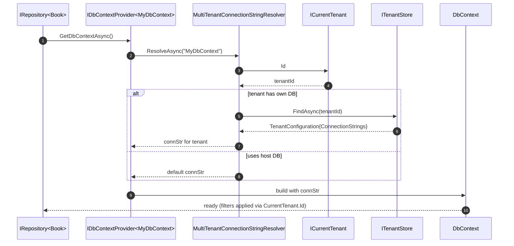
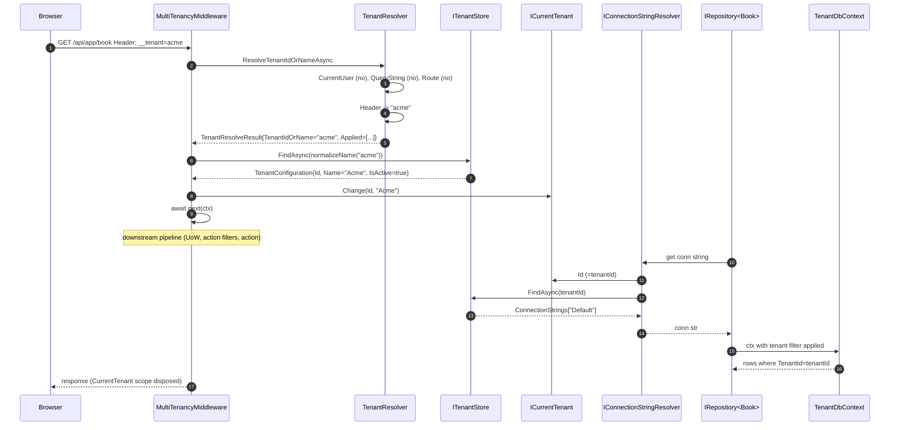

ABP Framework resolves the current tenant via a chain of `ITenantResolveContributor` implementations. The order is curated by `AbpTenantResolveOptions`. The chain runs inside `MultiTenancyMiddleware` which then opens an `ICurrentTenant.Change(...)` scope wrapping the rest of the request. All implementations live under [`framework/src/Volo.Abp.MultiTenancy/`](https://github.com/abpframework/abp/tree/dev/framework/src/Volo.Abp.MultiTenancy) and [`framework/src/Volo.Abp.AspNetCore.MultiTenancy/`](https://github.com/abpframework/abp/tree/dev/framework/src/Volo.Abp.AspNetCore.MultiTenancy).

<Note>
"Tenancy" here means the multi-tenant *isolation* concern — a key on every row, a scoped DbContext filter, scoped cache keys. Resolving the tenant is the *first* step that activates that isolation; everything else depends on it.
</Note>

## The Middleware

`MultiTenancyMiddleware.InvokeAsync` in `framework/src/Volo.Abp.AspNetCore.MultiTenancy/Volo/Abp/AspNetCore/MultiTenancy/MultiTenancyMiddleware.cs`:

```csharp
public async override Task InvokeAsync(HttpContext context, RequestDelegate next)
{
    TenantConfiguration? tenant = null;
    try { tenant = await _tenantConfigurationProvider.GetAsync(saveResolveResult: true); }
    catch (Exception e)
    {
        Logger.LogException(e);
        if (await _options.MultiTenancyMiddlewareErrorPageBuilder(context, e)) return;
    }

    if (tenant?.Id != _currentTenant.Id)
    {
        using (_currentTenant.Change(tenant?.Id, tenant?.Name))
        {
            if (_tenantResolveResultAccessor.Result != null &&
                _tenantResolveResultAccessor.Result.AppliedResolvers.Contains(
                    QueryStringTenantResolveContributor.ContributorName))
            {
                AbpMultiTenancyCookieHelper.SetTenantCookie(context, _currentTenant.Id, _options.TenantKey);
            }
            var requestCulture = await TryGetRequestCultureAsync(context);
            if (requestCulture != null) { /* set CultureInfo + cookie + items flag */ }
            await next(context);
        }
    }
    else
    {
        await next(context);
    }
}
```

Three behaviors worth highlighting:

1. **Error page**: any thrown exception from `GetAsync` (e.g. `"Tenant is not active"`) is routed through `AbpAspNetCoreMultiTenancyOptions.MultiTenancyMiddlewareErrorPageBuilder` — by default the embedded MVC Razor view `MultiTenancyMiddlewareErrorPage` (in `framework/src/Volo.Abp.AspNetCore.MultiTenancy/Volo/Abp/AspNetCore/MultiTenancy/Views/`).
2. **Cookie sticky**: if the tenant was resolved from the query string, a `__tenant` cookie is set so the next request reuses the same tenant without the query parameter.
3. **Culture override**: if no `IRequestCultureFeature.Provider` already picked a culture, the tenant's default language is applied via `ISettingProvider.GetOrNullAsync(LocalizationSettingNames.DefaultLanguage)`.

## The Configuration Provider

`TenantConfigurationProvider.GetAsync(saveResolveResult)` in `framework/src/Volo.Abp.MultiTenancy/Volo/Abp/MultiTenancy/TenantConfigurationProvider.cs` orchestrates the resolution-then-store-lookup:

```csharp
public virtual async Task<TenantConfiguration?> GetAsync(bool saveResolveResult = false)
{
    var resolveResult = await TenantResolver.ResolveTenantIdOrNameAsync();
    if (saveResolveResult) TenantResolveResultAccessor.Result = resolveResult;

    TenantConfiguration? tenant = null;
    if (resolveResult.TenantIdOrName != null)
    {
        tenant = await FindTenantAsync(resolveResult.TenantIdOrName);
        if (tenant == null)
            throw new BusinessException(code: "Volo.AbpIo.MultiTenancy:010001",
                message: StringLocalizer["TenantNotFoundMessage"],
                details: StringLocalizer["TenantNotFoundDetails", resolveResult.TenantIdOrName]);
        if (!tenant.IsActive)
            throw new BusinessException(code: "Volo.AbpIo.MultiTenancy:010002",
                message: StringLocalizer["TenantNotActiveMessage"], ...);
    }
    return tenant;
}

protected virtual async Task<TenantConfiguration?> FindTenantAsync(string tenantIdOrName)
{
    if (Guid.TryParse(tenantIdOrName, out var parsedTenantId))
        return await TenantStore.FindAsync(parsedTenantId);
    return await TenantStore.FindAsync(TenantNormalizer.NormalizeName(tenantIdOrName)!);
}
```

The contract enforces "must exist" + "must be active" — both fail with structured `BusinessException`s whose codes (`010001`, `010002`) you can match for custom error UX. `ITenantStore` is the data-side abstraction — `ConfigurationTenantStore` (in `framework/src/Volo.Abp.MultiTenancy/Volo/Abp/MultiTenancy/ConfigurationStore/`) reads from `IConfiguration`; the Tenant Management module replaces it with a database-backed implementation.

## The Resolver and Its Chain

`TenantResolver.ResolveTenantIdOrNameAsync` in `framework/src/Volo.Abp.MultiTenancy/Volo/Abp/MultiTenancy/TenantResolver.cs`:

```csharp
public virtual async Task<TenantResolveResult> ResolveTenantIdOrNameAsync()
{
    var result = new TenantResolveResult();
    using (var serviceScope = ServiceProvider.CreateScope())
    {
        var context = new TenantResolveContext(serviceScope.ServiceProvider);
        foreach (var tenantResolver in Options.TenantResolvers)
        {
            await tenantResolver.ResolveAsync(context);
            result.AppliedResolvers.Add(tenantResolver.Name);
            if (context.HasResolvedTenantOrHost())
            {
                result.TenantIdOrName = context.TenantIdOrName;
                break;
            }
        }
    }
    if (result.TenantIdOrName.IsNullOrEmpty() && !string.IsNullOrWhiteSpace(Options.FallbackTenant))
    {
        result.TenantIdOrName = Options.FallbackTenant;
        result.AppliedResolvers.Add(TenantResolverNames.FallbackTenant);
    }
    return result;
}
```

`HasResolvedTenantOrHost()` is the short-circuit: if a contributor set `context.TenantIdOrName` *or* set `context.Handled = true` (explicit "this is the host context, stop trying"), the loop ends. Each contributor's `Name` is added to `result.AppliedResolvers` regardless — the diagnostics list answers "which contributor decided?".

## Default Chain Order

Two modules contribute resolvers:

`AbpMultiTenancyModule.ConfigureServices` (`framework/src/Volo.Abp.MultiTenancy/Volo/Abp/MultiTenancy/AbpMultiTenancyModule.cs`) inserts `CurrentUserTenantResolveContributor` at index 0.

`AbpAspNetCoreMultiTenancyModule.ConfigureServices` (`framework/src/Volo.Abp.AspNetCore.MultiTenancy/Volo/Abp/AspNetCore/MultiTenancy/AbpAspNetCoreMultiTenancyModule.cs`) appends in order:

```csharp
options.TenantResolvers.Add(new QueryStringTenantResolveContributor());
options.TenantResolvers.Add(new RouteTenantResolveContributor());
options.TenantResolvers.Add(new HeaderTenantResolveContributor());
options.TenantResolvers.Add(new CookieTenantResolveContributor());
```

So the final order is `[CurrentUser, QueryString, Route, Header, Cookie]`. The `DomainTenantResolveContributor` (in the same folder) is opt-in via `options.TenantResolvers.AddDomainTenantResolver("{0}.myapp.com")`.

```mermaid
sequenceDiagram
    autonumber
    participant Req as HTTP Request
    participant MW as MultiTenancyMiddleware
    participant TCP as TenantConfigurationProvider
    participant TR as TenantResolver
    participant CU as CurrentUserTenantResolveContributor
    participant QS as QueryStringTenantResolveContributor
    participant RT as RouteTenantResolveContributor
    participant H as HeaderTenantResolveContributor
    participant CK as CookieTenantResolveContributor
    participant TS as ITenantStore
    participant CT as ICurrentTenant
    Req->>MW: invoke(ctx, next)
    MW->>TCP: GetAsync(saveResolveResult:true)
    TCP->>TR: ResolveTenantIdOrNameAsync()
    TR->>CU: ResolveAsync(ctx)
    alt user authenticated and has tenant_id claim
        CU->>CU: ctx.Handled=true; TenantIdOrName=user.TenantId
        Note over TR: short-circuit, break
    else not authenticated
        TR->>QS: ResolveAsync(ctx)
        alt ?__tenant=...
            QS->>QS: ctx.TenantIdOrName = value
        else
            TR->>RT: ResolveAsync(ctx)
            alt route data has tenant
                RT->>RT: ctx.TenantIdOrName = routeValue
            else
                TR->>H: ResolveAsync(ctx)
                alt header has __tenant
                    H->>H: ctx.TenantIdOrName = headerValue
                else
                    TR->>CK: ResolveAsync(ctx)
                    alt cookie has __tenant
                        CK->>CK: ctx.TenantIdOrName = cookieValue
                    end
                end
            end
        end
    end
    TR-->>TCP: TenantResolveResult{TenantIdOrName, AppliedResolvers}
    TCP->>TS: FindAsync(parsedGuid | normalizedName)
    TS-->>TCP: TenantConfiguration{Id,Name,IsActive,ConnectionStrings,...}
    TCP-->>MW: TenantConfiguration
    MW->>CT: Change(tenant.Id, tenant.Name)
    MW->>MW: maybe SetTenantCookie (if QueryString applied)
    MW->>MW: maybe set CultureInfo + culture cookie
    MW->>MW: await next(ctx)
    Note over MW: on exit, CurrentTenant scope disposed
```

## The Five Default Contributors

<AccordionGroup>
  <Accordion title="CurrentUserTenantResolveContributor">
    `framework/src/Volo.Abp.MultiTenancy/Volo/Abp/MultiTenancy/CurrentUserTenantResolveContributor.cs`. Reads `ICurrentUser.TenantId` and sets `context.Handled = true` if authenticated. Position 0 because an authenticated user's tenant is non-negotiable — never override it with a query string.
  </Accordion>
  <Accordion title="QueryStringTenantResolveContributor">
    `framework/src/Volo.Abp.AspNetCore.MultiTenancy/Volo/Abp/AspNetCore/MultiTenancy/QueryStringTenantResolveContributor.cs`. Reads `httpContext.Request.Query[tenantKey]` where `tenantKey` comes from `AbpAspNetCoreMultiTenancyOptions.TenantKey` (default `__tenant`).
  </Accordion>
  <Accordion title="RouteTenantResolveContributor">
    Reads `RouteData.Values["__tenant"]` so routes like `/{__tenant}/api/...` work. Useful for path-prefixed tenant URLs.
  </Accordion>
  <Accordion title="HeaderTenantResolveContributor">
    `framework/src/Volo.Abp.AspNetCore.MultiTenancy/Volo/Abp/AspNetCore/MultiTenancy/HeaderTenantResolveContributor.cs`. Reads `httpContext.Request.Headers[tenantKey]`. If multiple values present, takes the first and logs a warning. This is what `ClientProxyBase.AddHeaders` sets on outgoing inter-service calls.
  </Accordion>
  <Accordion title="CookieTenantResolveContributor">
    Reads `httpContext.Request.Cookies[tenantKey]`. The middleware writes this cookie when the resolution came from the query string, so once a user clicks `?__tenant=acme` the cookie sticks for the session.
  </Accordion>
</AccordionGroup>

`HttpTenantResolveContributorBase` (`framework/src/Volo.Abp.AspNetCore.MultiTenancy/Volo/Abp/AspNetCore/MultiTenancy/HttpTenantResolveContributorBase.cs`) is the shared base for the HTTP-specific contributors. It resolves `IHttpContextAccessor` from `context.ServiceProvider` and short-circuits when no `HttpContext` is available (e.g. background worker).

## Tenant Resolution Without HTTP

For background workers, the chain still runs but only `CurrentUserTenantResolveContributor` typically yields. The job's args type may implement `IMultiTenant` and `BackgroundJobExecuter` (`framework/src/Volo.Abp.BackgroundJobs.Abstractions/Volo/Abp/BackgroundJobs/BackgroundJobExecuter.cs`) opens `using (CurrentTenant.Change(GetJobArgsTenantId(jobArgs)))` *before* invoking the job — bypassing the resolver entirely. Similarly the inbox processor (`framework/src/Volo.Abp.EventBus/Volo/Abp/EventBus/Distributed/InboxProcessor.cs`) uses the event's `IMultiTenant.TenantId`.

## CurrentTenant Scope

`CurrentTenant.Change(tenantId, name)` in `framework/src/Volo.Abp.MultiTenancy/Volo/Abp/MultiTenancy/CurrentTenant.cs` is implemented as a parent-scope-stash + IDisposable:

```csharp
public IDisposable Change(Guid? id, string? name = null) => SetCurrent(id, name);

private IDisposable SetCurrent(Guid? tenantId, string? name = null)
{
    var parentScope = _currentTenantAccessor.Current;
    _currentTenantAccessor.Current = new BasicTenantInfo(tenantId, name);
    return new DisposeAction<...>(static state => {
        var (acc, parent) = state; acc.Current = parent;
    }, (_currentTenantAccessor, parentScope));
}
```

The accessor is `AsyncLocalCurrentTenantAccessor` (`framework/src/Volo.Abp.MultiTenancy/Volo/Abp/MultiTenancy/AsyncLocalCurrentTenantAccessor.cs`) which stores the tenant in `AsyncLocal<BasicTenantInfo?>`. AsyncLocal means: every awaited continuation inside `await next(context)` sees the same tenant, even if the work was scheduled to a different thread.

`ICurrentTenant.Id`, `Name`, and `IsAvailable` (the property checks `Id.HasValue` — host context returns false) are then read everywhere — by repositories (to apply tenant filters), by `LocalEventBus` (to set tenant before invoking handlers), by `AbpClaimsPrincipalFactory.CreateAsync` (to scope claim contributions to the tenant's roles).

## Connection String Resolution

When a UoW opens a DbContext, it consults `IConnectionStringResolver`. The default `MultiTenantConnectionStringResolver` (`framework/src/Volo.Abp.MultiTenancy/Volo/Abp/MultiTenancy/MultiTenantConnectionStringResolver.cs`) reads `CurrentTenant.Id`, asks `ITenantStore.FindAsync(currentTenant.Id)` for the `TenantConfiguration.ConnectionStrings`, and falls back to the default connection string when the tenant uses the host database. So tenant resolution → tenant config → connection string → DbContext — all transparent to the application service code.



## Cookie & Cache Side Effects

`AbpMultiTenancyCookieHelper.SetTenantCookie(context, currentTenant.Id, options.TenantKey)` (in `framework/src/Volo.Abp.AspNetCore.MultiTenancy/Volo/Abp/AspNetCore/MultiTenancy/AbpMultiTenancyCookieHelper.cs`) writes a same-site cookie with the tenant ID. It only fires when the QueryString contributor applied — preserving the ?‎sticky?‎ UX without overwriting cookies on every header-resolved API call.

Distributed cache keys are automatically scoped by `AbpDistributedCacheOptions.HideErrors` + the `CurrentTenant.Id` mix-in inside `DistributedCache<TCacheItem>`. Look at `framework/src/Volo.Abp.Caching/` for how a cached item key like `"c:Tenant1_Book_42"` is built — the `Tenant1` segment comes from `ICurrentTenant.Id` at write time, so different tenants never collide.

## End-to-End



## Failure Modes

<AccordionGroup>
  <Accordion title="BusinessException 'Volo.AbpIo.MultiTenancy:010001'">
    `TenantConfigurationProvider.GetAsync` could not find the tenant — `TenantStore.FindAsync` returned null. Either the user used a stale name, or the tenant was deleted but the cookie/header lingered.
  </Accordion>
  <Accordion title="BusinessException 'Volo.AbpIo.MultiTenancy:010002'">
    Tenant was found but `IsActive == false`. Often an admin disabled the tenant. The middleware error page (`MultiTenancyMiddlewareErrorPage`) renders an explanation if `MultiTenancyMiddlewareErrorPageBuilder` returns true.
  </Accordion>
  <Accordion title="User authenticated but sees host data">
    `CurrentUserTenantResolveContributor` did not find a tenant claim. Check that `AbpClaimTypes.TenantId` is being populated by your claims principal factory — typical fix is registering a contributor that adds it from the user record.
  </Accordion>
  <Accordion title="QueryString worked but cookie not set">
    The middleware only writes the cookie when `result.AppliedResolvers.Contains(QueryStringTenantResolveContributor.ContributorName)`. If the user was already authenticated, `CurrentUserTenantResolveContributor` would have short-circuited and the cookie path is skipped.
  </Accordion>
</AccordionGroup>

Tenant resolution is a simple chain — first contributor with a non-null answer wins. The middleware then opens a tenant scope around the rest of the request so downstream UoW, repository, cache, and event-handler code all see the right tenant without explicit plumbing.
