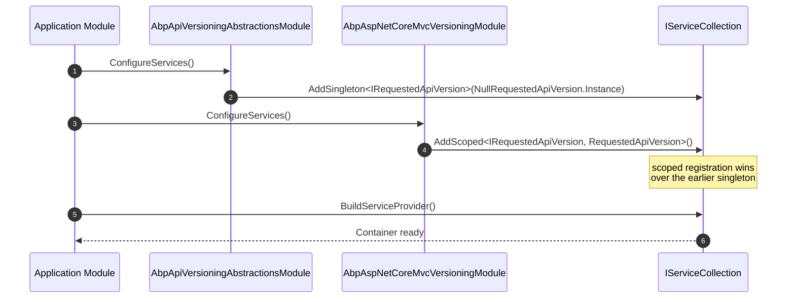

## The role of `Volo.Abp.ApiVersioning.Abstractions`

ABP Framework needs a way for *any* layer — domain services, application services, HTTP client proxies, audit log contributors — to ask "what API version is the current request targeting?" without taking a hard dependency on `Asp.Versioning` or any particular ASP.NET Core middleware. That is exactly what `framework/src/Volo.Abp.ApiVersioning.Abstractions/` provides: a one-method interface and a null-object default.

The contract lives in `Volo/Abp/ApiVersioning/IRequestedApiVersion.cs`:

```csharp
namespace Volo.Abp.ApiVersioning;

public interface IRequestedApiVersion
{
    string? Current { get; }
}
```

Everything else in this package — the module, the default registration, the null implementation — exists to make this string available wherever code asks for it, including in code paths where API versioning isn't installed at all.

<Info>
This package is intentionally an *abstractions* package: it contains no transport-specific code, no MVC filters, no header parsers. The concrete versioning implementation ships in `Volo.Abp.AspNetCore.Mvc.Versioning` (which wraps `Asp.Versioning`) and on the client side in `Volo.Abp.Http.Client.ClientProxying` (`ICurrentApiVersionInfo` / `CurrentApiVersionInfo`). This page covers the abstraction layer that both build on.
</Info>

## The module: `AbpApiVersioningAbstractionsModule`

`Volo/Abp/ApiVersioning/AbpApiVersioningAbstractionsModule.cs` registers the null singleton in `ConfigureServices`:

```csharp
public class AbpApiVersioningAbstractionsModule : AbpModule
{
    public override void ConfigureServices(ServiceConfigurationContext context)
    {
        context.Services.AddSingleton<IRequestedApiVersion>(NullRequestedApiVersion.Instance);
    }
}
```

A regular `AddSingleton(NullRequestedApiVersion.Instance)` rather than `TryAddSingleton` means the *abstractions* module always wins unless a downstream module also calls `services.Replace(...)` or registers a later singleton — which is exactly what the concrete versioning module is expected to do. The null instance is therefore the safe default for hosts that ship without versioning configured.

## The null object: `NullRequestedApiVersion`

`Volo/Abp/ApiVersioning/NullRequestedApiVersion.cs` is the textbook null-object pattern:

```csharp
public class NullRequestedApiVersion : IRequestedApiVersion
{
    public static NullRequestedApiVersion Instance = new NullRequestedApiVersion();

    public string? Current => null;

    private NullRequestedApiVersion() { }
}
```

The `private` constructor enforces a single instance through `Instance`, and `Current` always returns `null`. Any code that checks `IRequestedApiVersion.Current` therefore sees a non-null collaborator but a `null` string — there is no need for null-guarding the *service*. This trick lets consumers write:

```csharp
public class BookAppService
{
    public BookAppService(IRequestedApiVersion requestedApiVersion)
    {
        _requestedApiVersion = requestedApiVersion;
    }

    public Task<BookDto> GetAsync(Guid id)
    {
        if (_requestedApiVersion.Current == "2.0")
        {
            // v2 specific shape
        }
        ...
    }
}
```

without sprinkling `IRequestedApiVersion?` everywhere and without needing to know whether versioning is wired or not.

## How the concrete versioning module replaces the null

The concrete `Asp.Versioning`-based module registers a scoped implementation that reads from the ASP.NET Core request feature populated by the upstream versioning middleware. From the abstractions module's perspective the contract is the same: any service that injects `IRequestedApiVersion` continues to work — it just starts returning the real version string instead of `null`.

The host-side wiring sequence:



When the concrete module is *not* present, the scope-less singleton remains the only registration; `IRequestedApiVersion.Current` is `null`, and downstream code degrades gracefully.

## The HTTP client side: `ApiVersionInfo` and `ICurrentApiVersionInfo`

While `IRequestedApiVersion` is the contract for *inbound* version detection, the **HTTP client proxy** side has a parallel pair in `framework/src/Volo.Abp.Http.Client/Volo/Abp/Http/Client/ClientProxying/`:

- `ApiVersionInfo` — `BindingSource` and `Version`.
- `ICurrentApiVersionInfo` — current ambient value plus `Change(ApiVersionInfo?)` for scoping.
- `CurrentApiVersionInfo` — singleton implementation backed by `AsyncLocal<ApiVersionInfo?>`.

The two are intentionally *separate* because the server-side null object lives in an abstractions package that the HTTP client doesn't reference. Concrete `ApiVersionInfo` carries one extra piece of information beyond the abstract version string: the binding source (`"Path"`, `"Query"`, `"Header"`, …), used by `ClientProxyUrlBuilder` to decide whether the version goes into the route template or the query string.

`Volo/Abp/Http/Client/ClientProxying/ApiVersionInfo.cs`:

```csharp
public class ApiVersionInfo  //TODO: Rename to not conflict with api versioning apis
{
    public string BindingSource { get; }
    public string Version { get; }

    public ApiVersionInfo(string bindingSource, string version)
    {
        BindingSource = bindingSource;
        Version = version;
    }

    public bool ShouldSendInQueryString()
    {
        return !BindingSource.IsIn("Path");
    }
}
```

`Volo/Abp/Http/Client/ClientProxying/CurrentApiVersionInfo.cs`:

```csharp
public class CurrentApiVersionInfo : ICurrentApiVersionInfo, ISingletonDependency
{
    public ApiVersionInfo? ApiVersionInfo => _currentApiVersionInfo.Value;

    private readonly AsyncLocal<ApiVersionInfo?> _currentApiVersionInfo = new AsyncLocal<ApiVersionInfo?>();

    public virtual IDisposable Change(ApiVersionInfo? apiVersionInfo)
    {
        var parent = ApiVersionInfo;
        _currentApiVersionInfo.Value = apiVersionInfo;
        return new DisposeAction(() =>
        {
            _currentApiVersionInfo.Value = parent;
        });
    }
}
```

The `AsyncLocal<T>` keeps the ambient state safe across async hops, and `Change` returns an `IDisposable` so callers can scope a version to a single block:

```csharp
using (_currentApiVersionInfo.Change(new ApiVersionInfo("Query", "2.0")))
{
    return await _bookProxy.GetAsync(id); // outbound request will append ?api-version=2.0
}
```

## How `ClientProxyBase` injects the version

The HTTP client proxy base (`ClientProxyBase<TService>` in `framework/src/Volo.Abp.Http.Client/Volo/Abp/Http/Client/ClientProxying/ClientProxyBase.cs`) calls `GetApiVersionInfoAsync(requestContext)` early in its request pipeline. That method reads `ICurrentApiVersionInfo.ApiVersionInfo` if it is set, or falls back to the action's `ActionApiDescriptionModel.SupportedVersions` collection — picking the highest configured version that matches the server's advertised list. The resolved `ApiVersionInfo` is then passed to two downstream collaborators:

- `ClientProxyUrlBuilder` — uses `ShouldSendInQueryString()` to decide whether to substitute `{version}` in the path template or to append `?api-version=…` to the URL.
- `ClientProxyRequestPayloadBuilder.BuildContentAsync` — when the action expects the version as a form or body field, this is where the value lands.

Inside `BuildHttpProxyClientProxyContext` the base proxy also strips any parameter literally named `"api-version"` or `"apiVersion"` from the action arguments:

```csharp
if (action.SupportedVersions != null && action.SupportedVersions.Any())
{
    actionArguments.RemoveAll(x => x.Key == "api-version" || x.Key == "apiVersion");
}
```

This prevents the generated proxy from accidentally sending the version twice (once as a "real" parameter, once via the ambient `ICurrentApiVersionInfo`).

## Use cases for `IRequestedApiVersion`

Three concrete examples from the framework:

- **Per-version DTO branching**: an application service can early-return a v1-shaped DTO when `IRequestedApiVersion.Current == "1.0"` and the full v2 shape otherwise, without spawning two service classes.
- **Audit log contributor**: an `IAuditLogContributor` can append the requested version to the audit record so support tickets carry the exact contract the caller used.
- **Outbound HTTP propagation**: a custom `IRemoteServiceHttpClientAuthenticator` can read the version on the way in and forward it to downstream microservices through `ICurrentApiVersionInfo.Change(...)`, keeping a request chain on a single version.

```mermaid
flowchart LR
    Request[HTTP request /api/app/book/{id}?api-version=2.0]
    Request --> Mvc[Asp.Versioning middleware]
    Mvc --> Feature[IApiVersioningFeature]
    Feature --> Concrete[RequestedApiVersion : IRequestedApiVersion]
    Concrete -->|reads from Feature| Service[BookAppService]
    Service -->|"Current = '2.0'"| Logic[v2 branch]

    Concrete --> AuditContrib[IAuditLogContributor]
    AuditContrib --> AuditRecord["AuditLog.ApiVersion = '2.0'"]

    Service --> Outbound[HttpClient proxy]
    Outbound -->|Change ApiVersionInfo| CurrentInfo[CurrentApiVersionInfo (singleton AsyncLocal)]
    CurrentInfo --> UrlBuilder[ClientProxyUrlBuilder]
    UrlBuilder -->|ShouldSendInQueryString?| Downstream[Downstream /api/...?api-version=2.0]
```

## Working with the abstractions in your own packages

If you write an ABP module that needs to read the requested version, depend on `Volo.Abp.ApiVersioning.Abstractions` only — not the concrete package. Inject `IRequestedApiVersion` and treat `null` as "versioning not configured":

```csharp
public class MyContributor : IAuditLogContributor, ITransientDependency
{
    private readonly IRequestedApiVersion _requestedApiVersion;

    public MyContributor(IRequestedApiVersion requestedApiVersion)
    {
        _requestedApiVersion = requestedApiVersion;
    }

    public void PreContribute(AuditLogContributionContext context)
    {
        var version = _requestedApiVersion.Current;
        if (version != null)
        {
            context.AuditInfo.ExtraProperties["ApiVersion"] = version;
        }
    }
}
```

Because the abstraction module installs the null object as a singleton, your module will resolve `_requestedApiVersion` cleanly even in unit tests that only depend on `AbpApiVersioningAbstractionsModule`.

## Why a singleton null + scoped concrete combination is safe

`NullRequestedApiVersion` is a stateless singleton — every consumer can share the same instance. The concrete implementation is scoped because it has to read from the *current* `HttpContext.Features`. Scoped wins over singleton in the resolution algorithm when both are registered against the same service type, so the concrete module's `AddScoped<IRequestedApiVersion, …>()` quietly replaces the null without any explicit `Remove` call.

This is a small but deliberate piece of ABP's modularity story: an abstraction package can ship a *working* default, a concrete package can later replace it without a coordination call, and downstream consumers depend only on the abstraction. The cost is one allocation per process — the `NullRequestedApiVersion.Instance` static field — and the benefit is that the rest of the framework can treat API versioning as an *optional* concern that always has a sensible default value.

## Related interfaces in the HTTP client

| Interface | Package | Lifetime | Direction | Purpose |
| --- | --- | --- | --- | --- |
| `IRequestedApiVersion` | `Volo.Abp.ApiVersioning.Abstractions` | Singleton (null) / Scoped (concrete) | Inbound | What version is being served |
| `ICurrentApiVersionInfo` | `Volo.Abp.Http.Client` | Singleton (`AsyncLocal`) | Outbound | What version to send to a downstream proxy |

Both are *ambient* and both expose a single property plus a manipulation API. They are not the same interface because one (`IRequestedApiVersion`) is a read-only view of a feature populated by an MVC middleware, while the other (`ICurrentApiVersionInfo`) is a writable ambient that any code can change for a sub-tree of execution.

## Summary

`Volo.Abp.ApiVersioning.Abstractions` is a deliberately tiny package: one interface, one null object, one module. Its job is to make API versioning a *first-class* contract that any ABP module can consume without taking a dependency on a transport-specific implementation. Combined with the HTTP client side's `ICurrentApiVersionInfo` / `ApiVersionInfo`, ABP can carry a request's API version end-to-end — from inbound MVC, through application services, into audit logs, and back out via HTTP client proxies — without any one layer knowing the version-discovery mechanism of any other.
