`Volo.Abp.AspNetCore` is the package where ABP's runtime abstractions meet ASP.NET Core's hosting model. It does not host controllers or Razor pages — that is `Volo.Abp.AspNetCore.Mvc`'s job — but it does own the request pipeline: every `UseAbp*` extension, the per-request `HttpContext` accessors, and the cross-cutting middleware that the rest of the framework relies on. This page tours every component you will compose into a `Program.cs`.

## The module

`framework/src/Volo.Abp.AspNetCore/Volo/Abp/AspNetCore/AbpAspNetCoreModule.cs` chains nine other modules and adds the ASP.NET Core-aware integrations on top:

```csharp
[DependsOn(
    typeof(AbpAuditingModule),
    typeof(AbpSecurityModule),
    typeof(AbpVirtualFileSystemModule),
    typeof(AbpUnitOfWorkModule),
    typeof(AbpHttpModule),
    typeof(AbpAuthorizationModule),
    typeof(AbpValidationModule),
    typeof(AbpExceptionHandlingModule),
    typeof(AbpAspNetCoreAbstractionsModule)
)]
public class AbpAspNetCoreModule : AbpModule
```

`PreConfigureServices` mirrors `IWebHostEnvironment.EnvironmentName` onto `IAbpHostEnvironment.EnvironmentName` so that ABP code can read the environment without taking a dependency on the ASP.NET Core hosting types. `ConfigureServices` wires up the runtime: it calls `AddAuthorization`, attaches `AspNetCoreAuditLogContributor` to `AbpAuditingOptions` (`framework/src/Volo.Abp.AspNetCore/Volo/Abp/AspNetCore/Auditing/AspNetCoreAuditLogContributor.cs`), points `StaticFileOptions.ContentTypeProvider` at `AbpFileExtensionContentTypeProvider`, and registers `IObjectAccessor<IApplicationBuilder>`, `IObjectAccessor<WebApplication>`, `IObjectAccessor<IHost>`, and `IObjectAccessor<IEndpointRouteBuilder>` so ABP modules can talk to the host. It also installs `IHttpContextAccessor` and `AbpRequestLocalizationOptionsManager` for the dynamic options system. The final step is `StaticWebAssetsLoader.UseStaticWebAssets` so that Razor class library assets are served in development.

`OnApplicationInitialization` composes the web root file provider with `IWebContentFileProvider` (`framework/src/Volo.Abp.AspNetCore.Abstractions/Volo/Abp/AspNetCore/VirtualFileSystem/IWebContentFileProvider.cs`) so the virtual file system can serve `wwwroot` files that live inside embedded resources.

## The Abstractions package

`framework/src/Volo.Abp.AspNetCore.Abstractions/Volo.Abp.AspNetCore.Abstractions.csproj` is the thinnest layer in the chain — it defines the interfaces that consumers can implement without taking a dependency on the full ASP.NET Core integration:

| File | Purpose |
|------|---------|
| `Volo/Abp/AspNetCore/AbpAspNetCoreAbstractionsModule.cs` | Empty marker module for ordering. |
| `Volo/Abp/AspNetCore/Filters/IAbpFilter.cs` | Marker interface implemented by every ABP MVC filter so DI registration can detect them. |
| `Volo/Abp/AspNetCore/Authentication/AbpAspNetCoreTokenUnauthorizedErrorInfo.cs` | DTO returned when JWT bearer authentication fails so the body matches the `RemoteServiceErrorInfo` shape. |
| `Volo/Abp/AspNetCore/VirtualFileSystem/IWebContentFileProvider.cs` + `NullWebContentFileProvider.cs` | Hook the virtual file system uses to provide `wwwroot` assets. |
| `Volo/Abp/AspNetCore/WebClientInfo/IWebClientInfoProvider.cs` + `NullWebClientInfoProvider.cs` | Resolves the calling client's IP/browser without depending on `HttpContext`. |

`IAbpFilter` is particularly important: `AbpAspNetCoreMvcConventionalRegistrar` (`framework/src/Volo.Abp.AspNetCore.Mvc/Volo/Abp/AspNetCore/Mvc/DependencyInjection/AbpAspNetCoreMvcConventionalRegistrar.cs`) uses it to detect filter types and register them with the right lifetime, which is why every filter you see in this section implements it.

## The middleware extensions

Every ABP-aware pipeline step is exposed as an extension method on `IApplicationBuilder` in `framework/src/Volo.Abp.AspNetCore/Microsoft/AspNetCore/Builder/AbpApplicationBuilderExtensions.cs`.

### UseAbpRequestLocalization

`UseAbpRequestLocalization` calls `IAbpRequestLocalizationOptionsProvider.InitLocalizationOptions(optionsAction)` and then plugs in `AbpRequestLocalizationMiddleware`:

```csharp
public static IApplicationBuilder UseAbpRequestLocalization(
    this IApplicationBuilder app, Action<RequestLocalizationOptions>? optionsAction = null)
{
    app.ApplicationServices
        .GetRequiredService<IAbpRequestLocalizationOptionsProvider>()
        .InitLocalizationOptions(optionsAction);

    return app.UseMiddleware<AbpRequestLocalizationMiddleware>();
}
```

The provider is `DefaultAbpRequestLocalizationOptionsProvider` (`framework/src/Volo.Abp.AspNetCore/Microsoft/AspNetCore/RequestLocalization/DefaultAbpRequestLocalizationOptionsProvider.cs`); `AbpRequestLocalizationOptions` (`framework/src/Volo.Abp.AspNetCore/Microsoft/AspNetCore/RequestLocalization/AbpRequestLocalizationOptions.cs`) holds a list of `Func<IServiceProvider, RequestLocalizationOptions, Task>` configurators that downstream modules append to. The cookie provider for culture switching lives in `framework/src/Volo.Abp.AspNetCore/Microsoft/AspNetCore/RequestLocalization/AbpRequestCultureCookieHelper.cs`.

### UseAbpExceptionHandling

`UseAbpExceptionHandling` adds `AbpExceptionHandlingMiddleware` exactly once, marker-checked through `ExceptionHandlingMiddlewareMarker = "_AbpExceptionHandlingMiddleware_Added"`. The middleware itself (`framework/src/Volo.Abp.AspNetCore/Volo/Abp/AspNetCore/ExceptionHandling/AbpExceptionHandlingMiddleware.cs`) wraps the request, catches anything that escapes the MVC filter chain, and writes a `RemoteServiceErrorResponse` body — but only when the action descriptor stored in `httpContext.Items["_AbpActionInfo"]` indicates `IsObjectResult`. That guard avoids hijacking view-returning actions where a redirect or HTML error page is more appropriate.

When wrapping, the middleware uses `IExceptionToErrorInfoConverter`, `IHttpExceptionStatusCodeFinder`, and `IJsonSerializer` resolved from `httpContext.RequestServices`, and sets `httpContext.Response.Headers.Append(AbpHttpConsts.AbpErrorFormat, "true")` so clients can detect the wrapping. The status code is picked by `DefaultHttpExceptionStatusCodeFinder` (`framework/src/Volo.Abp.AspNetCore/Volo/Abp/AspNetCore/ExceptionHandling/DefaultHttpExceptionStatusCodeFinder.cs`) using `AbpExceptionHttpStatusCodeOptions` (`framework/src/Volo.Abp.AspNetCore/Volo/Abp/AspNetCore/ExceptionHandling/AbpExceptionHttpStatusCodeOptions.cs`). When the exception is an `AbpAuthorizationException` the middleware hands off to `IAbpAuthorizationExceptionHandler` (`DefaultAbpAuthorizationExceptionHandler`) so login redirects work for Razor pages.

### UseAbpClaimsMap and UseDynamicClaims

`UseAbpClaimsMap` plugs in `AbpClaimsMapMiddleware` (`framework/src/Volo.Abp.AspNetCore/Volo/Abp/AspNetCore/Security/Claims/AbpClaimsMapMiddleware.cs`), which rewrites incoming claim types based on `AbpClaimsMapOptions` — that is how `JwtClaimTypes.Subject` is mapped to `AbpClaimTypes.UserId`. The newer `UseDynamicClaims` extension (`AbpDynamicClaimsMiddleware`) replays cached dynamic claims (such as feature flags or session data) into the current principal on every request. `AbpClaimsTransformation` (`framework/src/Volo.Abp.AspNetCore/Volo/Abp/AspNetCore/Security/Claims/AbpClaimsTransformation.cs`) is the ASP.NET Core `IClaimsTransformation` implementation that does the same job through the framework's built-in pipeline.

`UseAbpClaimsMap` is now marked `[Obsolete]`; the migration path is to register the same options through `services.TransformAbpClaims(...)`. The middleware remains in place for backwards compatibility.

### UseAbpSecurityHeaders

`AbpSecurityHeadersMiddleware` (`framework/src/Volo.Abp.AspNetCore/Volo/Abp/AspNetCore/Security/AbpSecurityHeadersMiddleware.cs`) adds the standard hardening headers and an optional CSP nonce. The defaults are:

- `X-Content-Type-Options: nosniff`
- `X-XSS-Protection: 1; mode=block`
- `X-Frame-Options: SAMEORIGIN`
- `Content-Security-Policy: object-src 'none'; form-action 'self'; frame-ancestors 'none'` (only when `UseContentSecurityPolicyHeader = true` and the response is HTML)

`AbpSecurityHeadersOptions` (`framework/src/Volo.Abp.AspNetCore/Volo/Abp/AspNetCore/Security/AbpSecurityHeadersOptions.cs`) lets you toggle CSP, set a custom policy string, register extra headers, and selectively suppress the script-nonce on certain paths via `IgnoredScriptNoncePaths` and `IgnoredScriptNonceSelectors`. When `UseContentSecurityPolicyScriptNonce` is on, the middleware stuffs a freshly-generated GUID into `context.Items[AbpAspNetCoreConsts.ScriptNonceKey]` so Razor tag helpers can emit `nonce="..."` attributes against the same value. Endpoints can opt out with `[IgnoreAbpSecurityHeader]` (`framework/src/Volo.Abp.AspNetCore/Volo/Abp/AspNetCore/Security/IgnoreAbpSecurityHeader.cs`).

### UseCorrelationId, UseAuditing, UseUnitOfWork

`AbpCorrelationIdMiddleware` (`framework/src/Volo.Abp.AspNetCore/Volo/Abp/AspNetCore/Tracing/AbpCorrelationIdMiddleware.cs`) ensures every incoming request has a correlation id — either taken from `_options.HttpHeaderName` (default `X-Correlation-Id`) or generated. It wraps the request inside `_correlationIdProvider.Change(correlationId)` so downstream code can read `ICorrelationIdProvider.Get()` without touching the HTTP context.

`AbpAuditingMiddleware` (`framework/src/Volo.Abp.AspNetCore/Volo/Abp/AspNetCore/Auditing/AbpAuditingMiddleware.cs`) opens an `IAuditingManager.BeginScope()` per request and writes the audit log on completion; the contributor that captures HTTP-specific data (URL, status, IP, user agent) is `AspNetCoreAuditLogContributor`, attached by the module.

`UseUnitOfWork` chains `UseAbpExceptionHandling` first (so that an exception still aborts the unit-of-work without corrupting the response) and then registers `AbpUnitOfWorkMiddleware` (`framework/src/Volo.Abp.AspNetCore/Volo/Abp/AspNetCore/Uow/AbpUnitOfWorkMiddleware.cs`).

## The expected middleware order

The order in which these are composed is what makes the pipeline coherent. The standard `Program.cs` for an ABP MVC application looks like:

```mermaid
flowchart TB
    A[Request in] --> B[UseAbpRequestLocalization]
    B --> C[UseCorrelationId]
    C --> D[UseAbpExceptionHandling]
    D --> E[UseStaticFiles &#47; UseStaticFilesForPatterns]
    E --> F[UseRouting]
    F --> G[UseAbpSecurityHeaders]
    G --> H[UseAuthentication]
    H --> I[UseAbpClaimsMap &#47; UseDynamicClaims]
    I --> J[UseAbpOpenIddictValidation &#40;optional&#41;]
    J --> K[UseMultiTenancy]
    K --> L[UseAuthorization]
    L --> M[UseAuditing]
    M --> N[UseUnitOfWork]
    N --> O[UseConfiguredEndpoints]
    O --> P[Endpoint &#47; Controller]
```



Each step has its origin in `framework/src/Volo.Abp.AspNetCore/Microsoft/AspNetCore/Builder/AbpApplicationBuilderExtensions.cs`. The `UseAbpExceptionHandling` step is placed early enough that exceptions raised in localization or claims mapping are wrapped consistently; `UseAuditing` and `UseUnitOfWork` sit close to the endpoint so that they capture and roll back the same scope of work that the controller executes.

## HttpContext extensions and accessors

`framework/src/Volo.Abp.AspNetCore/Microsoft/AspNetCore/Http/AbpHttpRequestExtensions.cs` adds helpers such as `HttpRequest.IsAjax()` (used by `AbpExceptionFilter` to decide whether to wrap) and `HttpRequest.CanAccept(string mediaType)`. `ResponseContentTypeHelper` (`framework/src/Volo.Abp.AspNetCore/Microsoft/AspNetCore/Internal/ResponseContentTypeHelper.cs`) is the small ASP.NET Core internal copy that ABP keeps because the original is `internal` in `Microsoft.AspNetCore.Mvc`.

`AbpActionInfoInHttpContext` (`framework/src/Volo.Abp.AspNetCore/Volo/Abp/AspNetCore/AbpActionInfoInHttpContext.cs`) is the per-request marker stored at `httpContext.Items["_AbpActionInfo"]`. The action filter sets it when an action begins, and the exception handling middleware reads it to decide whether the current endpoint produces an object result.

`HttpContextClientScopeServiceProviderAccessor` (`framework/src/Volo.Abp.AspNetCore/Volo/Abp/AspNetCore/DependencyInjection/HttpContextClientScopeServiceProviderAccessor.cs`) implements `IClientScopeServiceProviderAccessor` by returning the current `HttpContext.RequestServices`, ensuring that code that resolves services through ABP's scope helpers stays inside the request scope. `ServiceProviderAccessorExtensions` (`framework/src/Volo.Abp.AspNetCore/Volo/Abp/ServiceProviderAccessorExtensions.cs`) layers on convenience methods so any ABP component can ask for a scope-aware `IServiceProvider` without taking a hard dependency on the accessor type.

`HttpContextCancellationTokenProvider` (`framework/src/Volo.Abp.AspNetCore/Volo/Abp/AspNetCore/Threading/HttpContextCancellationTokenProvider.cs`) exposes `HttpContext.RequestAborted` through ABP's `ICancellationTokenProvider`, so `ApplicationService` methods that accept a `CancellationToken` automatically receive the client-cancellation signal.

`HttpContextWebClientInfoProvider` (`framework/src/Volo.Abp.AspNetCore/Volo/Abp/AspNetCore/WebClientInfo/HttpContextWebClientInfoProvider.cs`) is the concrete `IWebClientInfoProvider` that pulls `RemoteIpAddress`, `UserAgent`, and `BrowserInfo` out of the request, using `MyCSharp.HttpUserAgentParser.DependencyInjection` (added by the module) to parse the user-agent string.

`AspNetCoreSecurityLogManager` (`framework/src/Volo.Abp.AspNetCore/Volo/Abp/AspNetCore/SecurityLog/AspNetCoreSecurityLogManager.cs`) writes security-related events (sign-in, sign-out, failed login) into ABP's security log abstraction, automatically attaching the current `IWebClientInfoProvider` values.

## Virtual file system and static files

`AbpFileExtensionContentTypeProvider` (`framework/src/Volo.Abp.AspNetCore/Volo/Abp/AspNetCore/VirtualFileSystem/AbpFileExtensionContentTypeProvider.cs`) is the default content-type provider hooked into `StaticFileOptions`. It augments the built-in list with extra MIME types ABP modules need (such as `.woff2` or `.map`).

`WebContentFileProvider` (`framework/src/Volo.Abp.AspNetCore/Volo/Abp/AspNetCore/VirtualFileSystem/WebContentFileProvider.cs`) is the concrete `IWebContentFileProvider` that walks `AbpAspNetCoreContentOptions.AllowedExtraWebContentFolders` plus the registered embedded resources. `RazorViewEngineVirtualFileProvider` (same folder) implements the bridge so Razor's view location resolver picks up cshtml files embedded as resources by themed packages.

`PathUtils` and `AbpStaticFileProvider` (in the same folder) handle the filename-pattern filtering exposed via `UseStaticFilesForPatterns`. That extension lets a host serve only specific files (for example `appsettings*.json`) from the wwwroot without exposing the whole directory.

## Razor view runtime helpers

`AbpCompilationRazorPageBase`, `AttributeValue`, and `HelperResult` (`framework/src/Volo.Abp.AspNetCore/Volo/Abp/AspNetCore/RazorViews/`) are the runtime support types that themed packages compile against. They are intentionally simple — `HelperResult` is just `Action<TextWriter>` wrapped to be writable from any Razor expression — and exist so dynamic Razor templates can be rendered from outside the Razor view engine.

## Other middleware base types

`AbpMiddlewareBase` (`framework/src/Volo.Abp.AspNetCore/Volo/Abp/AspNetCore/Middleware/AbpMiddlewareBase.cs`) is the convention every ABP middleware inherits from. It implements the `Use(HttpContext, RequestDelegate)` signature (factory-style) so ABP middleware integrates with DI as transient services. `AbpCorrelationIdMiddleware`, `AbpSecurityHeadersMiddleware`, `AbpUnitOfWorkMiddleware`, `AbpAuditingMiddleware`, `AbpExceptionHandlingMiddleware`, and `AbpTimeZoneMiddleware` (`framework/src/Volo.Abp.AspNetCore/Microsoft/AspNetCore/Timing/AbpTimeZoneMiddleware.cs`) all derive from it.

## Constants and shared keys

`AbpAspNetCoreConsts` (`framework/src/Volo.Abp.AspNetCore/Volo/Abp/AspNetCore/AbpAspNetCoreConsts.cs`) holds the three strings every host shares:

```csharp
public const string DefaultApiPrefix                  = "api";
public const string DefaultIntegrationServiceApiPrefix = "integration-api";
public const string ScriptNonceKey                    = "ScriptNonce";
```

`DefaultApiPrefix` is the URL prefix the conventional controller machinery uses; `DefaultIntegrationServiceApiPrefix` is the alternate prefix for integration services so they can be hosted on a non-public URL; `ScriptNonceKey` is the `HttpContext.Items` key where `AbpSecurityHeadersMiddleware` stores the per-request CSP nonce.

## Putting it together

A real `Program.cs` typically reads:

```csharp
var app = builder.Build();
app.UseAbpRequestLocalization();
app.UseCorrelationId();
app.UseAbpExceptionHandling();
app.UseStaticFiles();
app.UseRouting();
app.UseAbpSecurityHeaders();
app.UseAuthentication();
app.UseDynamicClaims();
app.UseAuthorization();
app.UseAuditing();
app.UseUnitOfWork();
app.MapControllers();
await app.RunAsync();
```

Each line maps directly to a file in this package, and each line can be moved, configured, or removed without rewriting downstream modules — which is the whole point of layering everything through `IApplicationBuilder` extensions.

<Tip>
When debugging an ABP application's middleware order, set a breakpoint on `AbpExceptionHandlingMiddleware.InvokeAsync` and inspect `context.Items["_AbpActionInfo"]`. If it is `null`, the request hasn't reached the action filter pipeline yet — meaning your exception is being raised before MVC matches a route, and you need to use `app.UseExceptionHandler` instead of relying on the wrap.
</Tip>

## Exception handling middleware in detail

`AbpExceptionHandlingMiddleware.HandleAndWrapException` (`framework/src/Volo.Abp.AspNetCore/Volo/Abp/AspNetCore/ExceptionHandling/AbpExceptionHandlingMiddleware.cs`) is the most consequential piece of code in this package — it is what every misbehaving controller eventually flows through. The method's signature and behaviour are worth memorising:

1. **Read options** — pull `AbpExceptionHandlingOptions` from `httpContext.RequestServices`. The options control whether stack traces, exception data, and exception details are sent to clients.
2. **Log when configured** — if `options.ShouldLogException(exception)` returns true (the default predicate filters out `OperationCanceledException`), call `_logger.LogException(exception)`.
3. **Notify** — fire `IExceptionNotifier.NotifyAsync(new ExceptionNotificationContext(exception))` so any subscriber (audit, telemetry, monitoring) can record the failure.
4. **Branch on authorization** — if the exception is `AbpAuthorizationException`, delegate to `IAbpAuthorizationExceptionHandler.HandleAsync` (the default is `DefaultAbpAuthorizationExceptionHandler`, `framework/src/Volo.Abp.AspNetCore/Volo/Abp/AspNetCore/ExceptionHandling/DefaultAbpAuthorizationExceptionHandler.cs`), which can either redirect to a login page or return 401/403 depending on the request's auth state.
5. **Convert** — for everything else, fetch `IExceptionToErrorInfoConverter` and `IHttpExceptionStatusCodeFinder`, clear the response, set the status code, add `AbpHttpConsts.AbpErrorFormat: true`, set `Content-Type: application/json`, hook `OnStarting` to clear cache headers, and write `IJsonSerializer.Serialize(new RemoteServiceErrorResponse(errorInfo))` as the body.

The cache-header clearing through `_clearCacheHeadersDelegate` matters because the original request may have set caching directives that no longer apply once the response has been replaced with an error — for example, a 304-cached endpoint should never become a 500-cached error.

### IHttpExceptionStatusCodeFinder

`DefaultHttpExceptionStatusCodeFinder` (`framework/src/Volo.Abp.AspNetCore/Volo/Abp/AspNetCore/ExceptionHandling/DefaultHttpExceptionStatusCodeFinder.cs`) maps common exception types to HTTP status codes by walking `AbpExceptionHttpStatusCodeOptions.Map` (`framework/src/Volo.Abp.AspNetCore/Volo/Abp/AspNetCore/ExceptionHandling/AbpExceptionHttpStatusCodeOptions.cs`). Default mappings include:

| Exception type | Status code |
|----------------|-------------|
| `AbpAuthorizationException` (anonymous) | 401 Unauthorized |
| `AbpAuthorizationException` (authenticated) | 403 Forbidden |
| `AbpValidationException` | 400 Bad Request |
| `EntityNotFoundException` | 404 Not Found |
| `IBusinessException` | 403 Forbidden |
| `NotImplementedException` | 501 Not Implemented |
| Default | 500 Internal Server Error |

Modules add their own mappings with `Configure<AbpExceptionHttpStatusCodeOptions>(opts => opts.Map<MyConflictException>(HttpStatusCode.Conflict))`. The `IHttpExceptionStatusCodeFinder` abstraction lets test code substitute a deterministic mapping when verifying error responses.

## Auditing middleware in depth

`AbpAuditingMiddleware.InvokeAsync` (`framework/src/Volo.Abp.AspNetCore/Volo/Abp/AspNetCore/Auditing/AbpAuditingMiddleware.cs`) gates auditing on a configurable predicate inside `AbpAspNetCoreAuditingOptions` (`framework/src/Volo.Abp.AspNetCore/Volo/Abp/AspNetCore/Auditing/AbpAspNetCoreAuditingOptions.cs`) and `AbpAspNetCoreAuditingUrlOptions` (`framework/src/Volo.Abp.AspNetCore/Volo/Abp/AspNetCore/Auditing/AbpAspNetCoreAuditingUrlOptions.cs`):

- `AbpAspNetCoreAuditingOptions.IsEnabled` is the master switch.
- `AbpAspNetCoreAuditingUrlOptions.IgnoredUrls` is a list of URL patterns that skip auditing — typically `_framework/`, `assets/`, `_blazor/`, and other infrastructure URLs.

The middleware uses `IAuditingManager.BeginScope()` to open an audit scope, sets `AuditingHelper.IsEnabled = true` for the lifetime of the request, and on dispose flushes the scope through `IAuditingStore.SaveAsync`. The HTTP-specific contributor `AspNetCoreAuditLogContributor` (`framework/src/Volo.Abp.AspNetCore/Volo/Abp/AspNetCore/Auditing/AspNetCoreAuditLogContributor.cs`) captures the URL, method, IP, user-agent, status code, and execution duration into the audit log payload.

## UnitOfWork middleware vs UnitOfWork action filter

The split between `AbpUnitOfWorkMiddleware` (`framework/src/Volo.Abp.AspNetCore/Volo/Abp/AspNetCore/Uow/AbpUnitOfWorkMiddleware.cs`) and `AbpUowActionFilter` (`framework/src/Volo.Abp.AspNetCore.Mvc/Volo/Abp/AspNetCore/Mvc/Uow/AbpUowActionFilter.cs`) is intentional. The middleware **reserves** a unit-of-work at the start of the request through `UnitOfWorkManager.TryBeginReserved(UnitOfWork.UnitOfWorkReservationName, options)`. The action filter, running later, calls the same `TryBeginReserved` and finds the reservation, then participates in the same UoW.

This two-stage design lets non-MVC code (middleware, page filters, hub methods) participate in the same unit-of-work that the action ultimately commits. `AspNetCoreUnitOfWorkTransactionBehaviourProvider` (`framework/src/Volo.Abp.AspNetCore/Volo/Abp/AspNetCore/Uow/AspNetCoreUnitOfWorkTransactionBehaviourProvider.cs`) decides transactional vs. non-transactional based on the HTTP method, exposed through `AspNetCoreUnitOfWorkTransactionBehaviourProviderOptions` (`framework/src/Volo.Abp.AspNetCore/Volo/Abp/AspNetCore/Uow/AspNetCoreUnitOfWorkTransactionBehaviourProviderOptions.cs`).

## Cors and Hosting helpers

`framework/src/Volo.Abp.AspNetCore/Microsoft/AspNetCore/Cors/AbpCorsPolicyBuilderExtensions.cs` adds extension methods that integrate ABP's settings-based CORS configuration with `CorsPolicyBuilder`. The typical usage is `policy.WithAbpExposedHeaders()`, which appends the standard ABP error headers — `AbpHttpConsts.AbpErrorFormat`, `AbpHttpConsts.AbpTenantResolveError`, `X-Correlation-Id` — to the `Access-Control-Expose-Headers` list so browsers can read them after a cross-origin response.

`framework/src/Volo.Abp.AspNetCore/Microsoft/AspNetCore/Hosting/AbpHostingEnvironmentExtensions.cs` is the small bridge that lets `IWebHostEnvironment.GetAbpHostEnvironment()` return an `IAbpHostEnvironment`. The two abstractions are kept separate so ABP code does not depend on `Microsoft.AspNetCore.Hosting` directly, but they refer to the same underlying environment.

## Static asset and bundling extensions

`AbpAspNetCoreApplicationBuilderExtensions` (`framework/src/Volo.Abp.AspNetCore/Microsoft/AspNetCore/Builder/AbpAspNetCoreApplicationBuilderExtensions.cs`) registers the ABP-aware static asset handlers — `MapAbpStaticAssets`, `UseConfiguredEndpoints`, and the time-zone middleware bridge. The `VirtualFileSystemApplicationBuilderExtensions` (`framework/src/Volo.Abp.AspNetCore/Microsoft/AspNetCore/Builder/VirtualFileSystemApplicationBuilderExtensions.cs`) adds `UseVirtualFiles` and `UseVirtualStaticFiles` so the virtual file system from `Volo.Abp.VirtualFileSystem` is served alongside the physical `wwwroot`.

`WebApplicationBuilderExtensions` (`framework/src/Volo.Abp.AspNetCore/Microsoft/Extensions/DependencyInjection/WebApplicationBuilderExtensions.cs`) provides `AddApplicationAsync` and `AddApplication` so the entire ABP module graph can be added to a host with a single line:

```csharp
await builder.AddApplicationAsync<MyHostModule>();
```

This is the public entry point most tutorials show; it composes the conventional registrar, the module loader, and the standard configuration sources.

## Telemetry and tracing

`AbpCorrelationIdMiddleware` reads the configured header (default `X-Correlation-Id` from `AbpCorrelationIdOptions` in `Volo.Abp.Core`) and either reuses it or generates a fresh GUID-`N` value. The `_correlationIdProvider.Change(correlationId)` call returns a disposable that restores the previous value when the request completes — so nested correlation contexts (e.g. background tasks fired during a request) compose correctly. The middleware also calls `CheckAndSetCorrelationIdOnResponse` so clients see the correlation id in the response, enabling end-to-end tracing across log destinations.

The corresponding client side is `ApiDescriptionFinder` (`framework/src/Volo.Abp.Http.Client/Volo/Abp/Http/Client/DynamicProxying/ApiDescriptionFinder.cs`), which copies the current `ICorrelationIdProvider.Get()` into the outgoing request header — closing the loop so a correlation id flows from a browser into the BFF into the microservice and back to the log destination.

## Empty hosting environment

`EmptyHostingEnvironment` (`framework/src/Volo.Abp.AspNetCore/Microsoft/Extensions/DependencyInjection/EmptyHostingEnvironment.cs`) is a fallback `IWebHostEnvironment` registered when ABP modules boot outside an actual web host (unit tests, generator tools). Its presence is what allows the same module to be loaded by `dotnet test` and `dotnet run` without conditional code paths.

`CookieAuthenticationOptionsExtensions` (`framework/src/Volo.Abp.AspNetCore/Microsoft/Extensions/DependencyInjection/CookieAuthenticationOptionsExtensions.cs`) augments `CookieAuthenticationOptions.Events` with the `AbpAntiForgeryCookieAuthenticationEventsHandler` so anti-forgery cookies are reissued when a user signs in. This is what keeps the `XSRF-TOKEN` cookie in sync with the authentication cookie's expiration.

## AbpAspNetCoreServiceCollectionExtensions

`framework/src/Volo.Abp.AspNetCore/Microsoft/Extensions/DependencyInjection/AbpAspNetCoreServiceCollectionExtensions.cs` is the `IServiceCollection` extensions file every ABP MVC project goes through. It exposes:

- `AddObjectAccessor<T>()` — register a placeholder `ObjectAccessor<T>` that the host can fill later. ABP uses this for `IApplicationBuilder`, `WebApplication`, `IHost`, and `IEndpointRouteBuilder` so any service can later receive a reference to the running pipeline.
- `AddAbpDynamicOptions<TOptions, TManager>()` — register an options manager that reloads option values from the dynamic options system (per tenant, per user, per culture).
- `GetSingletonInstance<T>()` and `AddSingletonInstance<T>()` — small helpers used during boot to share singleton state between modules without registering full DI services.

These extensions are how ABP's "objects added during startup get rebound at run time" idiom works. The `ObjectAccessor<T>` registered for `IApplicationBuilder` is filled by `InitializeApplicationAsync` once the host calls it, and any module that took the accessor in its constructor can later read the live builder.

## Detecting environment

`AbpHostingEnvironmentExtensions.GetAbpHostEnvironment(this IWebHostEnvironment)` returns the singleton `IAbpHostEnvironment` instance. The two abstractions exist in parallel because `IAbpHostEnvironment` is environment-agnostic (it works inside unit tests with `EmptyHostingEnvironment`), while `IWebHostEnvironment` is web-only. ABP code prefers `IAbpHostEnvironment` so the same module can boot under either host.

`AbpHostingEnvironmentExtensions` also provides `IsDevelopment()`, `IsProduction()`, and `IsStaging()` shortcuts that read the underlying environment name. These are convenience wrappers — the values come from the same place ASP.NET Core reads them.

## Detecting an AJAX request

`AbpHttpRequestExtensions.IsAjax` (`framework/src/Volo.Abp.AspNetCore/Microsoft/AspNetCore/Http/AbpHttpRequestExtensions.cs`) checks the `X-Requested-With: XMLHttpRequest` header — the de-facto standard set by every jQuery/Fetch client that wants to opt into JSON error wrapping. `AbpExceptionFilter.ShouldHandleException` reads this to decide whether to wrap server errors into `RemoteServiceErrorResponse`. The same extension exposes `CanAccept(string)`, which checks the `Accept` header against the supplied media type using `application/json`'s standard wildcard rules.

The combination of `IsAjax` and `CanAccept("application/json")` is what makes ABP's exception handling work uniformly across Razor pages (HTML responses), API endpoints (JSON responses), and AJAX islands inside Razor pages.

## RazorViewEngineVirtualFileProvider

The virtual file system bridge `RazorViewEngineVirtualFileProvider` (`framework/src/Volo.Abp.AspNetCore/Volo/Abp/AspNetCore/VirtualFileSystem/RazorViewEngineVirtualFileProvider.cs`) is what lets Razor templates live inside embedded resources of a class library. Without it, MVC's Razor view engine could only locate templates in the physical file system.

The provider wraps `IVirtualFileProvider` and forwards `GetFileInfo` and `GetDirectoryContents` calls so MVC's path resolution finds the embedded `.cshtml`. The trick is that virtual file system normalises paths (handles glob patterns, falls back to filesystem) so a single `_Layout.cshtml` can be overridden by a downstream module's copy at runtime.

`AbpAspNetCoreContentOptions` (`framework/src/Volo.Abp.AspNetCore/Volo/Abp/AspNetCore/VirtualFileSystem/AbpAspNetCoreContentOptions.cs`) carries the list of `AllowedExtraWebContentFolders` — additional virtual-file-system paths that should be exposed as web content. The `OnApplicationInitialization` hook on `AbpAspNetCoreModule` composes the `IWebHostEnvironment.WebRootFileProvider` with these folders.

## Static file pattern filtering

`UseStaticFilesForPatterns(this IApplicationBuilder, params string[])` is the niche extension for hosts that want to serve only specific files. The implementation wraps `IFileProvider` with `AbpStaticFileProvider` (`framework/src/Volo.Abp.AspNetCore/Volo/Abp/AspNetCore/StaticFiles/AbpStaticFileProvider.cs`), which filters file enumeration through `PathUtils.MatchesPattern`. The most common use case is serving `appsettings*.json` from a public URL for client-side configuration (after stripping secrets) — without exposing the rest of the `wwwroot` directory.

## Razor support libraries

The trio `AbpCompilationRazorPageBase.cs`, `AttributeValue.cs`, and `HelperResult.cs` (`framework/src/Volo.Abp.AspNetCore/Volo/Abp/AspNetCore/RazorViews/`) are runtime types for Razor templates compiled outside the standard view engine. ABP themed packages use them when they need to render error pages or templates without a full MVC context. The shapes mirror what ASP.NET Core's internal `RazorPageBase` exposes — but as public types so external modules can inherit from them.

## Summary: a focused middleware kit

The package's surface is large but every component lives behind a `Use*` extension method that you compose explicitly. Nothing here is automatically wired in; the developer writes the pipeline order in `Program.cs`. That discipline is what allows the framework to support so many host shapes — MVC, Razor Pages, Blazor Server, Blazor WebAssembly, MAUI Blazor — without diverging in middleware behaviour. The same `UseAbpExceptionHandling` line behaves identically regardless of whether the next middleware is `UseRouting` or `UseEndpoints`.
