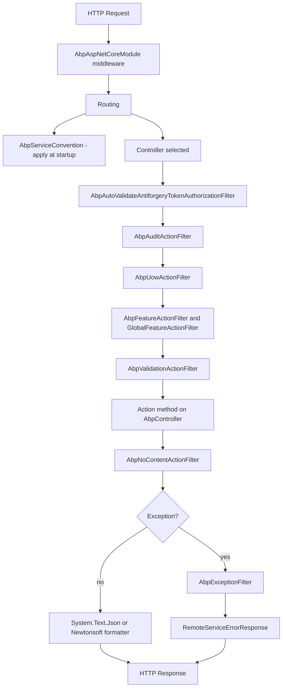

`Volo.Abp.AspNetCore.Mvc` is the largest package in the HTTP stack. It hosts the MVC integration that turns ABP application services into HTTP endpoints and turns ASP.NET Core MVC primitives (controllers, filters, model binders, formatters) into ABP-aware components. This page is a tour of every subfolder under `framework/src/Volo.Abp.AspNetCore.Mvc/Volo/Abp/AspNetCore/Mvc/`, with the file references you need to navigate to next.

## The module

`framework/src/Volo.Abp.AspNetCore.Mvc/Volo/Abp/AspNetCore/Mvc/AbpAspNetCoreMvcModule.cs` chains the modules that everything in this package relies on:

```csharp
[DependsOn(
    typeof(AbpAspNetCoreModule),
    typeof(AbpLocalizationModule),
    typeof(AbpApiVersioningAbstractionsModule),
    typeof(AbpAspNetCoreMvcContractsModule),
    typeof(AbpUiNavigationModule),
    typeof(AbpGlobalFeaturesModule),
    typeof(AbpDddApplicationModule),
    typeof(AbpJsonSystemTextJsonModule)
)]
public class AbpAspNetCoreMvcModule : AbpModule
```

In `PreConfigureServices`, the module marks `ControllerBase`, `PageModel`, and `ViewComponent` as `DynamicProxyIgnoreTypes` so that ABP's interception system does not try to wrap MVC base classes. It also adds `AbpAspNetCoreMvcConventionalRegistrar` (`framework/src/Volo.Abp.AspNetCore.Mvc/Volo/Abp/AspNetCore/Mvc/DependencyInjection/AbpAspNetCoreMvcConventionalRegistrar.cs`) so MVC-aware types get the right DI lifetime.

`ConfigureServices` extends `AbpApiDescriptionModelOptions.IgnoredInterfaces` with `IAsyncActionFilter`, `IFilterMetadata`, and `IActionFilter`, and pre-populates `AbpRemoteServiceApiDescriptionProviderOptions.SupportedResponseTypes` with the standard set of HTTP failure codes — 400, 401, 403, 404, 500, 501 — each mapped to `typeof(RemoteServiceErrorResponse)` so OpenAPI documents describe ABP's error envelope correctly.

## AntiForgery

`framework/src/Volo.Abp.AspNetCore.Mvc/Volo/Abp/AspNetCore/Mvc/AntiForgery/` ships the auto-validating anti-forgery pipeline. `AbpAntiForgeryOptions.cs` exposes the `TokenCookie` (`XSRF-TOKEN` by default with a 10-year expiration), the `AuthCookieSchemaName` (defaults to `Identity.Application`), an `AutoValidate` flag, a `Predicate<Type> AutoValidateFilter` to opt types out, and `AutoValidateIgnoredHttpMethods` (`{ "GET", "HEAD", "TRACE", "OPTIONS" }`). The two attributes `AbpAutoValidateAntiforgeryTokenAttribute.cs` and `AbpValidateAntiForgeryTokenAttribute.cs` apply the matching authorization filter classes; `AspNetCoreAbpAntiForgeryManager.cs` is the concrete `IAbpAntiForgeryManager` exposing `SetCookie()` and `GenerateToken()`. The cookie name provider in `AbpAntiForgeryCookieNameProvider.cs` is what wires the named auth scheme through.

Together they implement ABP's "tokens by cookie, validation by header" pattern: the server places the token in `XSRF-TOKEN`, the JavaScript client reads it and echoes it as `RequestVerificationToken` header, and `AbpAutoValidateAntiforgeryTokenAuthorizationFilter` checks both at action-binding time.

## ApiExploring

`framework/src/Volo.Abp.AspNetCore.Mvc/Volo/Abp/AspNetCore/Mvc/ApiExploring/` is the api-description pipeline. The file list — `AbpApiDefinitionController.cs`, `AbpNoContentApiDescriptionProvider.cs`, `AbpRemoteServiceApiDescriptionProvider.cs`, `AbpRemoteServiceApiDescriptionProviderOptions.cs`, `IXmlDocumentationProvider.cs`, `XmlDocumentationProvider.cs` — owns the `/api/abp/api-definition` endpoint and the OpenAPI augmentation. The full deep dive lives at [API Exploring](/http/mvc-api-exploring); for now, note that this is where the server materialises the `ApplicationApiDescriptionModel` consumed by `Volo.Abp.Http.Client`.

## ApplicationConfigurations

`framework/src/Volo.Abp.AspNetCore.Mvc/Volo/Abp/AspNetCore/Mvc/ApplicationConfigurations/AbpApplicationConfigurationAppService.cs` is the application service that returns `ApplicationConfigurationDto` — the bundle of settings, features, permissions, current user info, and localization data that ABP-aware UIs (Angular, MVC, Blazor) load on startup. `AbpApplicationConfigurationController.cs` exposes it at `/api/abp/application-configuration`; `AbpApplicationConfigurationScriptController.cs` returns the same data as a JavaScript bootstrap. `AbpApplicationLocalizationAppService.cs` and `AbpApplicationLocalizationController.cs` do the same for the standalone localization endpoint. The `ObjectExtending` sub-folder ships the DTOs used to describe object-extension metadata.

## Auditing

`framework/src/Volo.Abp.AspNetCore.Mvc/Volo/Abp/AspNetCore/Mvc/Auditing/` contains `AbpAuditActionFilter.cs` (for controllers) and `AbpAuditPageFilter.cs` (for Razor pages). Both push the resolved action descriptor into the auditing scope so that audit logs include controller/action names alongside the URL and status code captured by `AspNetCoreAuditLogContributor`.

## Authentication

`framework/src/Volo.Abp.AspNetCore.Mvc/Volo/Abp/AspNetCore/Mvc/Authentication/ChallengeAccountController.cs` is the controller used by `DefaultAbpAuthorizationExceptionHandler` to issue authentication challenges. It returns a `ChallengeResult` for the configured authentication scheme, which is how an anonymous request to a protected endpoint is redirected to the login page (for cookie auth) or returned as a 401 (for JWT bearer).

## ContentFormatters

`framework/src/Volo.Abp.AspNetCore.Mvc/Volo/Abp/AspNetCore/Mvc/ContentFormatters/` registers the model binder and output formatter for `IRemoteStreamContent` — the ABP wrapper around `Stream` used to upload and download large files. `AbpRemoteStreamContentModelBinder.cs` and `AbpRemoteStreamContentModelBinderProvider.cs` read multipart-form-data into a `RemoteStreamContent`; `RemoteStreamContentOutputFormatter.cs` writes the response back as a streaming body. The `FormBodyBindingIgnoredTypes` list on `AbpConventionalControllerOptions` (`framework/src/Volo.Abp.AspNetCore.Mvc/Volo/Abp/AspNetCore/Mvc/Conventions/AbpConventionalControllerOptions.cs`) includes `IRemoteStreamContent` so the conventional controller pipeline keeps the binding source as a form rather than the JSON body.

## Conventions

`framework/src/Volo.Abp.AspNetCore.Mvc/Volo/Abp/AspNetCore/Mvc/Conventions/` is the heart of "interfaces become controllers". It is so substantial that it has its own deep-dive page at [Conventions](/http/mvc-conventions). The files are `AbpServiceConvention`, `AbpServiceConventionWrapper`, `IAbpServiceConvention`, `AbpConventionalApiControllerSpecification`, `AbpConventionalControllerFeatureProvider`, `AbpConventionalControllerOptions`, `ConventionalControllerSetting`, `ConventionalControllerSettingList`, `ConventionalRouteBuilder`, `IConventionalRouteBuilder`, `UrlActionNameNormalizerContext`, and `UrlControllerNameNormalizerContext`.

## DataAnnotations

`framework/src/Volo.Abp.AspNetCore.Mvc/Volo/Abp/AspNetCore/Mvc/DataAnnotations/` overrides the standard validation attribute adapter to support dynamic property metadata. `AbpValidationAttributeAdapterProvider.cs` delegates to the standard provider but routes `MaxLength`, `Range`, and `StringLength` attributes to the dynamic adapters in `DynamicMaxLengthAttributeAdapter.cs`, `DynamicRangeAttributeAdapter.cs`, and `DynamicStringLengthAttributeAdapter.cs` so that values defined by `[DynamicMaxLength]` (a metadata-driven attribute, computed at runtime) participate in client-side validation.

## DependencyInjection

`framework/src/Volo.Abp.AspNetCore.Mvc/Volo/Abp/AspNetCore/Mvc/DependencyInjection/AbpAspNetCoreMvcConventionalRegistrar.cs` is the conventional registrar that classifies MVC types: controllers (`Controller`, `ControllerBase`) become transient; view components and page models go through the matching ASP.NET Core extension; `IAbpFilter` implementations are registered as transients so DI can constructor-inject them.

## ExceptionHandling

`framework/src/Volo.Abp.AspNetCore.Mvc/Volo/Abp/AspNetCore/Mvc/ExceptionHandling/` contains `AbpExceptionFilter.cs` (the `IAsyncExceptionFilter` for controller actions) and `AbpExceptionPageFilter.cs` (for Razor pages). The filter's `ShouldHandleException` predicate decides whether to wrap based on three criteria:

1. The action returns an object (`ActionDescriptor.HasObjectResult()`).
2. The request accepts `application/json`.
3. The request is an AJAX request (`IsAjax()`).

When any condition holds, the filter writes a `RemoteServiceErrorResponse` body, sets the `AbpHttpConsts.AbpErrorFormat` header, and calls `IExceptionNotifier.NotifyAsync` so subscribers can record the failure.

## Features and GlobalFeatures

`framework/src/Volo.Abp.AspNetCore.Mvc/Volo/Abp/AspNetCore/Mvc/Features/AbpFeatureActionFilter.cs` and `AbpFeaturePageFilter.cs` enforce `[RequiresFeature]` attributes at request time; `framework/src/Volo.Abp.AspNetCore.Mvc/Volo/Abp/AspNetCore/Mvc/GlobalFeatures/GlobalFeatureActionFilter.cs` and `GlobalFeaturePageFilter.cs` do the same for module-level `[RequiresGlobalFeature]` checks. Both raise `AbpAuthorizationException` (typed as a feature failure) so the standard exception filter wraps it into a `RemoteServiceErrorResponse` with the right status code.

## Infrastructure

`framework/src/Volo.Abp.AspNetCore.Mvc/Volo/Abp/AspNetCore/Mvc/Infrastructure/AbpMemoryPoolHttpResponseStreamWriterFactory.cs` is a `IHttpResponseStreamWriterFactory` that pools buffers from `ArrayPool<byte>.Shared`. It is registered through `AddMvcCore` so that JSON responses do not allocate fresh buffers per request. The reason this is bundled is that MVC's default factory has a subtle interaction with ABP's response wrapping that can cause double-buffering; the ABP version sidesteps the issue.

## Json

`framework/src/Volo.Abp.AspNetCore.Mvc/Volo/Abp/AspNetCore/Mvc/Json/MvcCoreBuilderExtensions.cs` provides the `IMvcCoreBuilder.AddAbpJson` extension that registers ABP-aware JSON converters (the ones defined in `Volo.Abp.Json.SystemTextJson`) into the MVC options. This is also where the `AbpExtraPropertiesJsonConverter` is installed so that DTOs with extra properties round-trip cleanly. Bringing in the separate `Volo.Abp.AspNetCore.Mvc.NewtonsoftJson` package swaps the System.Text.Json formatter for the Newtonsoft.Json one; the same module bridge handles both.

## Libs

`framework/src/Volo.Abp.AspNetCore.Mvc/Volo/Abp/AspNetCore/Mvc/Libs/` ships the runtime support for the "abp-libs" directory used by MVC themes to host client-side libraries (jQuery, bootstrap, Toastr) out of the virtual file system. `AbpMvcLibsService.cs` is the service that resolves a logical name (`@abp/jquery`) to a physical path; `AbpMvcLibsErrorPage.cshtml` is the diagnostic page shown if a library is missing in development. `AbpMvcLibsOptions.cs` lets developers configure the libs root path.

## Localization

`framework/src/Volo.Abp.AspNetCore.Mvc/Volo/Abp/AspNetCore/Mvc/Localization/` adds the route-based culture machinery used by MVC sites (`AbpCultureRouteConstraint.cs`, `AbpCultureRoutePagesConvention.cs`, `AbpCultureRouteUrlHelperFactory.cs`), the cookie-and-query-string switcher (`AbpAspNetCoreMvcQueryStringCultureReplacement.cs`), the menu item URL provider (`AbpCultureMenuItemUrlProvider.cs`), the localized validation attribute adapter (`AbpMvcAttributeValidationResultProvider.cs`), and the languages controller (`AbpLanguagesController.cs`) used by `Abp.Localization` to expose the current language list to JavaScript clients. `AbpApplicationLocalizationScriptController.cs` delivers translations as a `.js` file.

## ModelBinding

`framework/src/Volo.Abp.AspNetCore.Mvc/Volo/Abp/AspNetCore/Mvc/ModelBinding/AbpDateTimeModelBinder.cs` and `AbpDateTimeModelBinderProvider.cs` ensure that DateTime parameters are interpreted with the current user's timezone (resolved through `ICurrentTimezoneProvider`). `AbpExtraPropertiesDictionaryModelBinderProvider.cs` and `AbpExtraPropertyModelBinder.cs` bind extra properties from form/JSON bodies into the DTOs; `ExtraPropertyBindingHelper.cs` is the shared helper. The `Metadata/AbpModelMetadataProvider.cs` is the model metadata provider that augments display names with ABP localization resources, so error messages and labels appear in the user's language without manual configuration.

## ProxyScripting

`framework/src/Volo.Abp.AspNetCore.Mvc/Volo/Abp/AspNetCore/Mvc/ProxyScripting/AbpServiceProxyScriptController.cs` serves the jQuery client script — the same one consumed by the older AJAX-based clients — based on `IProxyScriptManager` (`framework/src/Volo.Abp.Http/Volo/Abp/Http/ProxyScripting/IProxyScriptManager.cs`). `ServiceProxyGenerationModel.cs` is the request DTO that lets callers ask for a single module or a subset. The minified output is cached through `IProxyScriptManagerCache`.

## Response

`framework/src/Volo.Abp.AspNetCore.Mvc/Volo/Abp/AspNetCore/Mvc/Response/AbpNoContentActionFilter.cs` rewrites a successful response from a `Task`-returning action into a `204 No Content`. This is the server-side counterpart to `AbpNoContentApiDescriptionProvider`: the OpenAPI document says the action returns 204, and the filter ensures the actual response matches.

## Uow

`framework/src/Volo.Abp.AspNetCore.Mvc/Volo/Abp/AspNetCore/Mvc/Uow/AbpUowActionFilter.cs` is what makes every controller action transactional. It reads the `UnitOfWorkAttribute` from the method or its declaring type, picks transactional defaults based on the HTTP method (non-GET → transactional), tries to claim the reserved unit-of-work opened by `AbpUnitOfWorkMiddleware`, and commits or rolls back on action success/failure. The companion `AbpUowPageFilter.cs` does the same for Razor pages.

## Utils

`framework/src/Volo.Abp.AspNetCore.Mvc/Volo/Abp/AspNetCore/Mvc/Utils/ArrayMatcher.cs` is the small wildcard matcher used by `AbpAspNetCoreAuditingUrlOptions` (`framework/src/Volo.Abp.AspNetCore/Volo/Abp/AspNetCore/Auditing/AbpAspNetCoreAuditingUrlOptions.cs`) and other URL-based options to decide whether a given path falls inside a configured pattern.

## Validation

`framework/src/Volo.Abp.AspNetCore.Mvc/Volo/Abp/AspNetCore/Mvc/Validation/AbpValidationActionFilter.cs` runs immediately before an action and calls `IModelStateValidator.Validate` (`framework/src/Volo.Abp.AspNetCore.Mvc/Volo/Abp/AspNetCore/Mvc/Validation/ModelStateValidator.cs`):

```csharp
public virtual void Validate(ModelStateDictionary modelState)
{
    var validationResult = new AbpValidationResult();
    AddErrors(validationResult, modelState);
    if (validationResult.Errors.Any())
    {
        throw new AbpValidationException(
            "ModelState is not valid! See ValidationErrors for details.",
            validationResult.Errors);
    }
}
```

The thrown `AbpValidationException` is caught by `AbpExceptionFilter` and turned into a `RemoteServiceErrorResponse` whose `ValidationErrors` array contains the per-field detail. `ValidationAttributeHelper.cs` is the helper used by data annotations to format messages.

## Versioning

`framework/src/Volo.Abp.AspNetCore.Mvc/Volo/Abp/AspNetCore/Mvc/Versioning/HttpContextRequestedApiVersion.cs` exposes the API version selected for the current request through ABP's `ICurrentApiVersionInfo` abstraction (the client-side equivalent lives in `framework/src/Volo.Abp.Http.Client/Volo/Abp/Http/Client/ClientProxying/CurrentApiVersionInfo.cs`). It plugs into `Asp.Versioning` so that conventional controllers can be exposed under `?api-version=2` without bespoke routing.

## ViewFeatures

`framework/src/Volo.Abp.AspNetCore.Mvc/Volo/Abp/AspNetCore/Mvc/ViewFeatures/AbpValidationHtmlAttributeProvider.cs` is the `ValidationHtmlAttributeProvider` replacement that emits dynamic validation attributes (the ones produced by `DynamicMaxLengthAttributeAdapter` and friends) when rendering Razor tag helpers, so client-side validation respects the same dynamic rules as server-side validation.

## Other top-level files

The package root contains a handful of files used by every controller:

| File | Role |
|------|------|
| `AbpController.cs` | Base class for ABP MVC controllers — exposes `LazyServiceProvider` and localization helpers. |
| `AbpControllerBase.cs` | Slimmer base for API-only controllers. |
| `AbpViewComponent.cs` | View component base with the same lazy-services pattern. |
| `AbpActionContextExtensions.cs` | Extension methods for reading action info from `ActionContext`. |
| `AbpApiDescriptionExtensions.cs` | Extensions like `IsRemoteService()` consumed by API providers. |
| `AbpMvcOptionsExtensions.cs` | `IMvcBuilder` extensions that consolidate ABP setup. |
| `AbpMvcActionDescriptorProvider.cs` | Action descriptor provider that runs `IConventionalRouteBuilder` for client-proxy controllers. |
| `AbpAspNetCoreMvcOptions.cs` | The aggregate options bag — exposes `ControllersToRemove`, `ExposeIntegrationServices`, `ExposeClientProxyServices`, `MinifyGeneratedScript`. |
| `AbpDataAnnotationAutoLocalizationMetadataDetailsProvider.cs` | Bridges DataAnnotations descriptions through ABP localization. |
| `ActionResultHelper.cs` | Helpers for wrapping responses (used by `AbpNoContentActionFilter`). |
| `ApplicationPartSorter.cs` | Orders application parts so that ABP-discovered controllers always win over MVC defaults. |
| `AspNetCoreApiDescriptionModelProvider.cs` | Implementation of `IApiDescriptionModelProvider` that emits `ApplicationApiDescriptionModel` from MVC's `IApiDescriptionGroupCollectionProvider`. |
| `AspNetCoreApiDescriptionModelProviderOptions.cs` | Lets module authors filter which descriptions are exposed. |
| `TelemetryApplicationMetricsEnricher.cs` | Adds ABP metric tags (tenant, action name) to OpenTelemetry counters. |

## Companion packages

Two thin packages sit alongside `Volo.Abp.AspNetCore.Mvc`:

- **`Volo.Abp.AspNetCore.Mvc.NewtonsoftJson`** — `framework/src/Volo.Abp.AspNetCore.Mvc.NewtonsoftJson/Volo/Abp/AspNetCore/Mvc/NewtonsoftJson/AbpAspNetCoreMvcNewtonsoftModule.cs` swaps `System.Text.Json` for `Newtonsoft.Json` while keeping the ABP converters consistent. Useful when interoperating with legacy clients that expect Newtonsoft's serializer quirks.
- **`Volo.Abp.AspNetCore.Mvc.Dapr`** — `framework/src/Volo.Abp.AspNetCore.Mvc.Dapr/Volo/Abp/AspNetCore/Mvc/Dapr/AbpAspNetCoreMvcDaprModule.cs`, `DaprAppApiTokenValidator.cs`, and `DaprHttpContextExtensions.cs` add support for the Dapr `Dapr-Api-Token` header and the Dapr sidecar invocation pattern. `Volo.Abp.AspNetCore.Mvc.Dapr.EventBus` extends this with an `AbpAspNetCoreMvcDaprEventBusModule` for receiving CloudEvents via Dapr's pub/sub building block.

## How everything connects



Every box on the diagram maps to a single file in `framework/src/Volo.Abp.AspNetCore.Mvc/Volo/Abp/AspNetCore/Mvc/`. The order is significant: anti-forgery validation precedes auditing so that rejected requests are still logged; unit-of-work begins before validation so that a `400 Bad Request` does not commit anything; and the no-content filter runs after the action so it can rewrite the result based on the actual return type.

<Note>
The MVC integration's "auto controllers" path — where an `IApplicationService` becomes a controller without writing the controller — is the most distinctive feature in this package. The mechanics live in the [Conventions](/http/mvc-conventions) page and the [API Exploring](/http/mvc-api-exploring) page; this page is the index to the rest of the moving parts that surround them.
</Note>

## Anti-forgery in detail

The anti-forgery flow is unusual because it combines cookie-based token delivery with header-based validation. `AbpAntiForgeryCookieAuthenticationEventsHandler` (referenced from `framework/src/Volo.Abp.AspNetCore/Microsoft/Extensions/DependencyInjection/CookieAuthenticationOptionsExtensions.cs`) hooks `OnSigningIn`/`OnSigningOut` so that the `XSRF-TOKEN` cookie is reissued at sign-in and cleared at sign-out. `AspNetCoreAbpAntiForgeryManager` (`framework/src/Volo.Abp.AspNetCore.Mvc/Volo/Abp/AspNetCore/Mvc/AntiForgery/AspNetCoreAbpAntiForgeryManager.cs`) implements:

```csharp
public interface IAbpAntiForgeryManager
{
    void   SetCookie();
    string GenerateToken();
}
```

`SetCookie()` writes a fresh token into the cookie via `IAntiforgery.SetCookieTokenAndHeader`; `GenerateToken()` returns the request token a JavaScript client should echo as the `RequestVerificationToken` header. The cookie name is configurable through `AbpAntiForgeryCookieNameProvider` (`framework/src/Volo.Abp.AspNetCore.Mvc/Volo/Abp/AspNetCore/Mvc/AntiForgery/AbpAntiForgeryCookieNameProvider.cs`) so that hosts using a non-default `Identity.Application` cookie scheme still get matching token cookies.

`AbpAutoValidateAntiforgeryTokenAuthorizationFilter` (`framework/src/Volo.Abp.AspNetCore.Mvc/Volo/Abp/AspNetCore/Mvc/AntiForgery/AbpAutoValidateAntiforgeryTokenAuthorizationFilter.cs`) is the auto-validating filter run on every non-GET request that matches `AbpAntiForgeryOptions.AutoValidateFilter`. The filter is short-circuited when the controller has `[IgnoreAntiforgeryToken]` or when the HTTP method appears in `AutoValidateIgnoredHttpMethods` (`GET`, `HEAD`, `TRACE`, `OPTIONS`).

## Filters in execution order

ABP filters live in the same execution order MVC defines: authorization → resource → action → result → exception. Concretely:

1. **`AbpAutoValidateAntiforgeryTokenAuthorizationFilter`** — runs at authorization stage.
2. **`AbpFeatureActionFilter` / `GlobalFeatureActionFilter`** — runs at action stage, before the action.
3. **`AbpAuditActionFilter`** — runs at action stage, capturing input/output around the action.
4. **`AbpUowActionFilter`** — wraps the action in a unit-of-work, committing on success.
5. **`AbpValidationActionFilter`** — runs `IModelStateValidator.Validate` before the action body executes.
6. **Action body** — the actual controller method runs.
7. **`AbpNoContentActionFilter`** — runs at result stage if the return is empty.
8. **`AbpExceptionFilter`** — wraps unhandled exceptions into `RemoteServiceErrorResponse`.

Each filter type implements `IAbpFilter` (`framework/src/Volo.Abp.AspNetCore.Abstractions/Volo/Abp/AspNetCore/Filters/IAbpFilter.cs`) so `AbpAspNetCoreMvcConventionalRegistrar` can register it as a transient service. The filter list is also added to `MvcOptions.Filters` through `AbpMvcOptionsExtensions.AddAbpFilters` (`framework/src/Volo.Abp.AspNetCore.Mvc/Volo/Abp/AspNetCore/Mvc/AbpMvcOptionsExtensions.cs`).

## The action result helper

`ActionResultHelper` (`framework/src/Volo.Abp.AspNetCore.Mvc/Volo/Abp/AspNetCore/Mvc/ActionResultHelper.cs`) carries the logic that decides whether a returned object is "empty" (and should be turned into 204 by `AbpNoContentActionFilter`) or not. The helper is reused by both the filter and the api-description providers, so the runtime behaviour and the documented behaviour stay synchronised.

## Model binding deep-dive

`AbpDateTimeModelBinder` and `AbpDateTimeModelBinderProvider` (`framework/src/Volo.Abp.AspNetCore.Mvc/Volo/Abp/AspNetCore/Mvc/ModelBinding/`) read the current timezone from `ICurrentTimezoneProvider` and convert incoming date strings into the user's local time before binding. This is what makes `?startDate=2024-01-15` mean "January 15 in the user's timezone" rather than UTC. The binder respects `[DataType(DataType.Date)]` and the standard format strings so existing input controls continue to work.

`AbpExtraPropertiesDictionaryModelBinderProvider` and `AbpExtraPropertyModelBinder` (same folder) work with `ExtraPropertyDictionary` — the bag-of-properties used by `IHasExtraProperties`. When a DTO carries extra properties, the binder copies unrecognised JSON keys into the dictionary rather than discarding them. `ExtraPropertyBindingHelper` is the shared helper that handles the recursive walk for nested DTOs.

`AbpModelMetadataProvider` (`framework/src/Volo.Abp.AspNetCore.Mvc/Volo/Abp/AspNetCore/Mvc/ModelBinding/Metadata/AbpModelMetadataProvider.cs`) overrides the standard metadata provider so that display names are resolved through `IStringLocalizer<TResource>` — the result is that validation messages, label tag helpers, and OpenAPI descriptions all render in the current culture without per-property attributes.

## Localization controllers and conventions

`AbpLanguagesController` (`framework/src/Volo.Abp.AspNetCore.Mvc/Volo/Abp/AspNetCore/Mvc/Localization/AbpLanguagesController.cs`) exposes the registered languages as JSON so client-side culture pickers can populate their dropdowns from the same data the server uses. `AbpApplicationLocalizationScriptController` returns the same content as a generated `.js` file for MVC templates.

`AbpCultureMenuItemUrlProvider` (`framework/src/Volo.Abp.AspNetCore.Mvc/Volo/Abp/AspNetCore/Mvc/Localization/AbpCultureMenuItemUrlProvider.cs`) integrates with ABP's UI navigation system so the language switcher in the standard theme produces correctly-localised URLs. `AbpCultureRouteConstraint` and `AbpCultureRoutePagesConvention` (same folder) enable route-based culture switching (`/en/page`, `/de/page`) when `AbpRequestLocalizationOptions.UseRouteBasedCulture` is `true`.

`AbpAspNetCoreMvcQueryStringCultureReplacement` (same folder) lets a query-string culture (`?culture=de`) be transparently merged into the request — the implementation injects `IQueryStringCultureReplacement` so multiple sources can compete and the first match wins. `QueryStringCultureReplacementContext` is the per-call context the replacement receives.

`AbpMvcDataAnnotationsLocalizationOptions` (`framework/src/Volo.Abp.AspNetCore.Mvc/Volo/Abp/AspNetCore/Mvc/Localization/AbpMvcDataAnnotationsLocalizationOptions.cs`) ties standard DataAnnotations error messages into the ABP localization system so `[Required(ErrorMessage = "...")]` strings are resolved against the application's `IStringLocalizer` resources rather than the default English text.

## ProxyScripting controller

`AbpServiceProxyScriptController` (`framework/src/Volo.Abp.AspNetCore.Mvc/Volo/Abp/AspNetCore/Mvc/ProxyScripting/AbpServiceProxyScriptController.cs`) serves the generated jQuery client at `/Abp/ServiceProxyScript`. It accepts a `ServiceProxyGenerationModel` (`framework/src/Volo.Abp.AspNetCore.Mvc/Volo/Abp/AspNetCore/Mvc/ProxyScripting/ServiceProxyGenerationModel.cs`) so callers can request only a subset of modules. The controller calls `IProxyScriptManager.GetScript` (defined in `Volo.Abp.Http`) and returns the minified result. The minification is controlled by `AbpAspNetCoreMvcOptions.MinifyGeneratedScript` (default: true in production).

## Authentication helpers

`ChallengeAccountController` (`framework/src/Volo.Abp.AspNetCore.Mvc/Volo/Abp/AspNetCore/Mvc/Authentication/ChallengeAccountController.cs`) is the small controller that `DefaultAbpAuthorizationExceptionHandler` redirects to when an unauthenticated user hits a protected endpoint. It returns a `ChallengeResult` for the configured scheme — cookie auth redirects to the login page, JWT bearer returns 401 with `WWW-Authenticate: Bearer`. The controller exists separately so the host can override its `[Route]` or `[Authorize]` configuration without touching the exception handler itself.

## ApplicationConfigurations subsystem

The ApplicationConfigurations endpoints are the only ABP-provided controllers explicitly registered in `Volo.Abp.AspNetCore.Mvc` (rather than auto-generated from interfaces). The reason is that they form the bootstrap surface — they need to exist regardless of which modules a host includes. `AbpApplicationConfigurationAppService` (`framework/src/Volo.Abp.AspNetCore.Mvc/Volo/Abp/AspNetCore/Mvc/ApplicationConfigurations/AbpApplicationConfigurationAppService.cs`) implements `IAbpApplicationConfigurationAppService` from the contracts package, materialising every section of `ApplicationConfigurationDto` from the current request's services: localization values from `IStringLocalizerFactory`, settings from `ISettingProvider`, permissions from `IPermissionDefinitionManager` and the current grants, features from `IFeatureChecker`, tenant info from `ICurrentTenant`, timing from `IClock` and `ITimezoneProvider`, and object extensions from `ObjectExtensionManager.Instance`. The result is cached per (user, tenant) pair through the `CurrentApplicationConfigurationCacheResetEventData` distributed event documented in the contracts page.

`AbpApplicationConfigurationController` (`framework/src/Volo.Abp.AspNetCore.Mvc/Volo/Abp/AspNetCore/Mvc/ApplicationConfigurations/AbpApplicationConfigurationController.cs`) is the controller wrapper exposing the app service at `/api/abp/application-configuration`. `AbpApplicationConfigurationScriptController.cs` produces the same payload as a JavaScript bootstrap file (`window.abp.configuration = { ... }`).

## TelemetryApplicationMetricsEnricher

`TelemetryApplicationMetricsEnricher` (`framework/src/Volo.Abp.AspNetCore.Mvc/Volo/Abp/AspNetCore/Mvc/TelemetryApplicationMetricsEnricher.cs`) plugs into ASP.NET Core's `IMetricsEnricher` pipeline to add ABP-specific tags (current tenant id, action route, controller name) to the standard request-duration histogram. The effect is that OpenTelemetry/Prometheus dashboards can break down latency by tenant or by application service without bespoke instrumentation.

## ApplicationPartSorter

`ApplicationPartSorter` (`framework/src/Volo.Abp.AspNetCore.Mvc/Volo/Abp/AspNetCore/Mvc/ApplicationPartSorter.cs`) ensures that ABP-loaded application parts are inspected by MVC after the host's own application parts. The order matters because `AbpConventionalControllerFeatureProvider` should have first dibs at deciding whether a type is a controller; without the sort, ASP.NET Core's default provider could declare types as controllers using the wrong conventions.

## AbpAspNetCoreMvcOptions

`framework/src/Volo.Abp.AspNetCore.Mvc/Volo/Abp/AspNetCore/Mvc/AbpAspNetCoreMvcOptions.cs` is the central options bag exposing the controller-level switches:

| Property | Default | Effect |
|----------|---------|--------|
| `ControllersToRemove` | empty | Types listed here are dropped from the application model by `AbpServiceConvention.RemoveDuplicateControllers`. |
| `ExposeIntegrationServices` | `false` | When `false`, integration services are hidden from public routing. |
| `ExposeClientProxyServices` | `false` | When `false`, types derived from `ClientProxyBase` (server-hosted client proxies) are hidden. |
| `ConventionalControllers` | `new AbpConventionalControllerOptions()` | The nested options that drive auto-controller registration. |
| `MinifyGeneratedScript` | `null` (computed) | When `null`, defaults to the inverse of the development environment — minified in production, readable in development. |
| `ChangeControllerModelApiExplorerGroupName` | `true` | When `true`, applies the module's `RemoteServiceName` as the OpenAPI group name. |

The options bag is what modules read when they need to know whether to register a controller, which group name to use, or whether to minify proxy scripts. `AbpAspNetCoreMvcModule.ConfigureServices` uses `services.PostConfigure<AbpAspNetCoreMvcOptions>` so that the final read of `MinifyGeneratedScript` happens after all modules have run their `ConfigureServices` — important because the value depends on the runtime environment.

## Data annotation auto-localization

`AbpDataAnnotationAutoLocalizationMetadataDetailsProvider` (`framework/src/Volo.Abp.AspNetCore.Mvc/Volo/Abp/AspNetCore/Mvc/AbpDataAnnotationAutoLocalizationMetadataDetailsProvider.cs`) hooks into the model metadata pipeline so that `[Display]`, `[Required]`, and other data annotations attributes pick up localized strings without per-attribute configuration. The provider looks for a localization resource matching the entity's namespace, lets the resource resolve the key, and falls back to the original attribute message when no localization is found.

This is what enables a DTO like:

```csharp
public class CreateUserDto
{
    [Required]
    [StringLength(IdentityUserConsts.MaxNameLength)]
    public string UserName { get; set; }
}
```

to display the `UserName` label in German when the user's culture is German, without any `[Display(Name = "...")]` attribute on the property. The translation comes from the `IdentityResource` registered by the Identity module.

## NewtonsoftJson integration

`Volo.Abp.AspNetCore.Mvc.NewtonsoftJson` (separate package) is the bridge for hosts that need Newtonsoft semantics. Its module `AbpAspNetCoreMvcNewtonsoftModule.cs` calls `services.AddNewtonsoftJson(...)` and then re-installs ABP's converters against `JsonSerializerSettings`. The net effect is that the same DTOs round-trip through Newtonsoft and System.Text.Json identically — `ExtraPropertyDictionary` survives, `ExtensibleObject` survives, and `RemoteServiceErrorResponse` deserialises correctly on the client side regardless of which serializer the server picked.

The trade-off is that Newtonsoft has known throughput and allocation overheads compared to System.Text.Json. ABP recommends staying on System.Text.Json unless a specific integration (legacy SDK, OData, a specific edge case) requires Newtonsoft.

## Dapr integration

`Volo.Abp.AspNetCore.Mvc.Dapr` adds three relevant pieces:

- `AbpAspNetCoreMvcDaprModule.cs` — the module declaration that wires the validator and helpers into DI.
- `DaprAppApiTokenValidator.cs` and `IDaprAppApiTokenValidator.cs` — runs at request entry and validates the `dapr-api-token` header so that only the local Dapr sidecar can invoke certain endpoints.
- `DaprHttpContextExtensions.cs` — extension methods that surface Dapr-specific information (trace state, app id) on `HttpContext`.

`Volo.Abp.AspNetCore.Mvc.Dapr.EventBus` extends this with `AbpAspNetCoreMvcDaprEventBusModule.cs`, which auto-registers subscribers for ABP's distributed event handlers as MVC endpoints. The implementation walks the configured event handlers, generates one POST endpoint per event, and lets Dapr's pub/sub building block deliver cloud events to them. The integration is fully convention-based: no per-event configuration required.

## When MVC and ABP disagree

There are edge cases where MVC's default conventions conflict with ABP's. The two most common:

1. **Async suffixes.** MVC's `ControllerActionDescriptorProvider` happily exposes `GetUserAsync` as the action name `GetUser`. ABP's `ConventionalRouteBuilder.NormalizeUrlActionName` also strips `Async`. The two can disagree if the convention runs in the wrong order; `AbpServiceConvention.ConfigureRemoteService` explicitly sets `ActionName` after the rename to prevent inconsistency.
2. **API versioning attribute conflicts.** When a controller has both `[ApiVersion("1.0")]` at the type level and `[MapToApiVersion("2.0")]` on a method, MVC picks the method-level version but ABP's `ConventionalControllerSetting.ApiVersions` registers the type-level versions globally. The reconciliation happens inside `AbpServiceConvention` by reading both attribute layers; the result is consistent with stock MVC behaviour.

These edge cases are usually invisible — they only surface when a developer overrides one of the relevant attributes on a controller that is also auto-registered. The fix is almost always to commit to one route convention per controller (either the auto-registration or the explicit attribute, not both).

## Performance characteristics

The MVC layer does most of its work at startup (registering conventions, building application parts, walking application model). Per-request cost is dominated by the MVC pipeline itself; ABP's additions — filters, model binders, formatters — each cost a single allocation and a few method calls.

The notable hot path is `AbpSecurityHeadersMiddleware`, which inspects every response and may inject a CSP nonce. The nonce generation uses `Guid.NewGuid().ToString("N")` per request; for high-throughput services that do not need a per-request CSP, `UseContentSecurityPolicyScriptNonce = false` (the default) avoids the cost entirely.

The next hot path is `AbpAuditingMiddleware`, which opens an audit scope per request. The scope itself is cheap, but the audit log contributor (`AspNetCoreAuditLogContributor`) reads several `HttpContext` properties — those reads are O(1) but visible at very high request rates. The `AbpAspNetCoreAuditingUrlOptions.IgnoredUrls` list is the right knob to skip auditing on `_framework/` or static-asset paths.

## Summary

The MVC integration is intentionally additive: every component is opt-in through DI, and most defaults can be replaced via `[Dependency(ReplaceServices = true)]` or `services.Replace(...)`. The package's surface is large but the boundaries are clean — each subfolder owns one MVC concern (filters, formatters, binders, conventions, exploring) and the top-level files are the glue that makes them composable through `AbpAspNetCoreMvcModule.ConfigureServices`.
