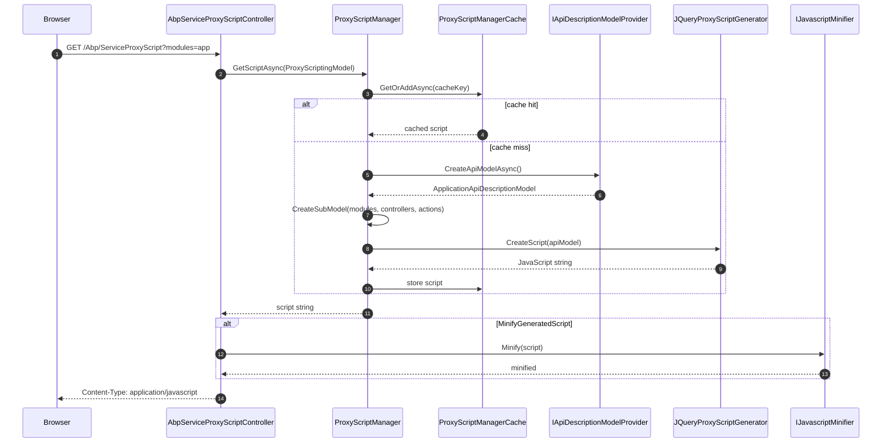

## Two worlds of JavaScript proxies

ABP Framework gives JavaScript clients two complementary ways to talk to ABP application services:

1. **Runtime jQuery proxies** — a single dynamic endpoint, `/Abp/ServiceProxyScript`, that walks the live `ApplicationApiDescriptionModel` and emits a JavaScript file in `abp.services.<module>.<controller>.<action>(…)` shape, on demand. The generator lives in `framework/src/Volo.Abp.Http/Volo/Abp/Http/ProxyScripting/Generators/JQuery/JQueryProxyScriptGenerator.cs`.
2. **Offline-generated proxies** — produced by the `abp generate-proxy` CLI command via `framework/src/Volo.Abp.Cli.Core/Volo/Abp/Cli/ServiceProxying/JavaScript/JavaScriptServiceProxyGenerator.cs` (plain JS) and `…/Angular/AngularServiceProxyGenerator.cs` (TypeScript via Angular Schematics). The files are committed alongside the front-end source.

This page covers both. The dynamic side is what makes "drop `<script src="/Abp/ServiceProxyScript">` and call `abp.services.app.book.get(id)`" work; the CLI side is what real production Angular apps ship. The detailed [Proxy Scripting](/http/proxy-scripting) page covers the generator/extension model that both rely on.

## The runtime endpoint: `AbpServiceProxyScriptController`

`Volo/Abp/AspNetCore/Mvc/ProxyScripting/AbpServiceProxyScriptController.cs` is an MVC controller in the `Abp` area, routed at `Abp/ServiceProxyScript`, with `[ApiExplorerSettings(IgnoreApi = true)]` so it never shows up in Swagger and `[DisableAuditing]` so it does not pollute the audit log. The action signature is:

```csharp
[HttpGet]
[Produces(MimeTypes.Application.Javascript, MimeTypes.Text.Plain)]
public virtual async Task<ActionResult> GetAll(ServiceProxyGenerationModel model)
{
    model.Normalize();

    var script = await ProxyScriptManager.GetScriptAsync(model.CreateOptions());

    return Content(
        Options.MinifyGeneratedScript == true
            ? JavascriptMinifier.Minify(script)
            : script,
        MimeTypes.Application.Javascript);
}
```

The controller delegates all the heavy lifting to `IProxyScriptManager` (see [Proxy Scripting](/http/proxy-scripting)) and only wraps minification through `IJavascriptMinifier` when `AbpAspNetCoreMvcOptions.MinifyGeneratedScript` is `true`.

### `ServiceProxyGenerationModel`: filtering the script

`ServiceProxyGenerationModel` in the same folder accepts four optional query-string parameters and folds them into a `ProxyScriptingModel`:

| Query | Maps to |
| --- | --- |
| `type` | `ProxyScriptingModel.GeneratorType` — defaults to `JQueryProxyScriptGenerator.Name` (`"jquery"`) inside `Normalize()` |
| `useCache` | `ProxyScriptingModel.UseCache` — defaults to `true` |
| `modules` | Pipe-separated whitelist (`?modules=app|account`) |
| `controllers` | Pipe-separated whitelist of controllers |
| `actions` | Pipe-separated whitelist of action names |

The pipe parsing happens in `CreateOptions()`:

```csharp
if (!Modules.IsNullOrEmpty())
{
    options.Modules = Modules!.Split('|').Select(m => m.Trim()).ToArray();
}
```

When any of those three filters is set, `ProxyScriptingModel.IsPartialRequest()` returns `true` and the generator narrows the in-memory `ApplicationApiDescriptionModel` to that subset before emitting the script. This is how the ABP commercial UI can keep boot-time scripts small by requesting per-module proxies.

## The default generator: `JQueryProxyScriptGenerator`

`framework/src/Volo.Abp.Http/Volo/Abp/Http/ProxyScripting/Generators/JQuery/JQueryProxyScriptGenerator.cs` implements `IProxyScriptGenerator.CreateScript(ApplicationApiDescriptionModel)`. It loops over every `module → controller → action` and emits a JavaScript IIFE per module:

```csharp
script.AppendLine($"// module {module.RootPath.ToCamelCase()}");
script.AppendLine();
script.AppendLine("(function(){");

foreach (var controller in module.Controllers.Values)
{
    script.AppendLine();
    AddControllerScript(script, controller);
}

script.AppendLine();
script.AppendLine("})();");
```

The generated functions ultimately resolve to `abp.ajax(…)` calls (the helper lives in the `abp.js` runtime shipped by `Volo.Abp.AspNetCore.Mvc.UI`). Service names are produced by trimming the conventional postfixes captured in:

```csharp
private static string[] AppServiceCommonPostfixes { get; }
    = { "AppService", "ApplicationService",  "IntService", "IntegrationService", "Service" };
```

so `IBookAppService` on the server becomes `abp.services.app.book` on the client.

### Disabling modules: `DynamicJavaScriptProxyOptions`

`Volo/Abp/Http/ProxyScripting/Generators/JQuery/DynamicJavaScriptProxyOptions.cs` exposes one mutable collection:

```csharp
public HashSet<string> DisabledModules { get; }

public void DisableModule(string module) => DisabledModules.AddIfNotContains(module);
public void EnableModule(string module) => DisabledModules.Remove(module);
```

The jQuery generator checks `_dynamicJavaScriptProxyOptions.DisabledModules.Contains(module.Key)` and skips the module's whole IIFE when there's a match. Wire the option from your module like:

```csharp
Configure<DynamicJavaScriptProxyOptions>(options =>
{
    options.DisableModule("account");
});
```

## End-to-end flow of a runtime proxy request



## The cache: `ProxyScriptManagerCache`

`Volo/Abp/Http/ProxyScripting/ProxyScriptManagerCache.cs` is registered as a singleton and uses two concurrent dictionaries: a fast `ConcurrentDictionary<string, string>` for completed scripts and a `ConcurrentDictionary<string, Lazy<Task<string>>>` for in-flight builds. The key is computed by `ProxyScriptManager.CreateCacheKey` as the MD5 of a serialized anonymous object containing `GeneratorType`, `Modules`, `Controllers`, `Actions`, and `Properties`. The first request to build a script wins the `Lazy<>` race; concurrent callers await the same Task and then pull from the synchronous dictionary on subsequent hits.

Because the cache lives in-memory and is keyed by the *request payload* — not the underlying model version — restarting the host invalidates everything. There is no built-in versioned cache key, so if you mutate the API model at runtime (e.g. dynamically register a controller) you should either disable caching with `?useCache=false` or replace `IProxyScriptManagerCache` with a version-aware implementation.

## Offline generation through the ABP CLI

The CLI ships several `IServiceProxyGenerator` implementations (`framework/src/Volo.Abp.Cli.Core/Volo/Abp/Cli/ServiceProxying/IServiceProxyGenerator.cs`):

```csharp
public interface IServiceProxyGenerator
{
    Task GenerateProxyAsync(GenerateProxyArgs args);
}
```

They are stored in `AbpCliServiceProxyOptions.Generators` keyed by short type names. The two relevant ones here:

- **`JavaScriptServiceProxyGenerator`** — `Volo/Abp/Cli/ServiceProxying/JavaScript/JavaScriptServiceProxyGenerator.cs`, type name `"JS"`. Default output directory is `wwwroot/client-proxies` and the file name is `{module}-proxy.js`.
- **`AngularServiceProxyGenerator`** — `Volo/Abp/Cli/ServiceProxying/Angular/AngularServiceProxyGenerator.cs`, type name `"NG"`. Delegates to the `@abp/ng.schematics:proxy-add` Angular Schematics package via `npx`.

### `JavaScriptServiceProxyGenerator`

This generator reuses the same `JQueryProxyScriptGenerator` as the runtime endpoint:

```csharp
var applicationApiDescriptionModel = await GetApplicationApiDescriptionModelAsync(args);
var script = RemoveInitializedEventTrigger(
    _jQueryProxyScriptGenerator.CreateScript(applicationApiDescriptionModel));

Directory.CreateDirectory(Path.GetDirectoryName(output));

using (var writer = new StreamWriter(output))
{
    await writer.WriteAsync(script);
}
```

`GetApplicationApiDescriptionModelAsync` (in the shared `ServiceProxyGeneratorBase`) issues an HTTP call to `{url}/api/abp/api-definition` exactly like the runtime `ApiDescriptionFinder` does — the same JSON payload feeds both paths. The only post-processing is `RemoveInitializedEventTrigger`, which strips the trailing `abp.event.trigger('abp.serviceProxyScriptInitialized');` line because that event makes sense only when the script is served at app boot, not when it is bundled.

`RemoveProxyCommand.Name` is handled by the generator's `RemoveProxy(args, output)` branch — running `abp remove-proxy -t js` simply deletes the matching `{module}-proxy.js`.

### `AngularServiceProxyGenerator`

Angular generation is **not** done by ABP code itself. The generator wraps a shell call to the `@abp/ng.schematics` package:

```csharp
var schematicsCommandName =
    args.CommandName == RemoveProxyCommand.Name
        ? "proxy-remove"
        : "proxy-add";

var commandBuilder = new StringBuilder(
    "npx ng g @abp/ng.schematics:" + schematicsCommandName);
```

The generator builds the arg list from `GenerateProxyArgs` properties (`Module`, `ApiName`, `Source`, `Target`, `Url`, `EntryPoint`) and shells out via `ICmdHelper`. The actual TypeScript class generation, including DTO model classes and service classes wrapping `RestService.request`, happens inside the Angular Schematics package. The C# side just chooses the command, validates `angular.json` exists, and ensures `@abp/ng.schematics` is installed (`CheckNgSchematicsAsync()`).

<Tip>
This split is deliberate: the schematics package can be updated independently of ABP and is shared with `ng-cli`-style scaffolding (modules, components). The C# generator is just a thin command-line adapter so that `abp generate-proxy -t ng` works inside the unified ABP CLI experience.
</Tip>

## Choosing between dynamic and offline proxies

| Concern | Runtime jQuery | CLI-generated JS | CLI-generated Angular (TS) |
| --- | --- | --- | --- |
| Tooling needed at build time | None | ABP CLI | ABP CLI + npm + `@abp/ng.schematics` |
| Types in IDE | No (vanilla JS) | No | Yes (TypeScript classes) |
| Bundled with front-end | No (loaded at runtime) | Yes (`wwwroot/client-proxies`) | Yes (Angular module) |
| Compatible with tree-shaking | No | Partially | Yes |
| Reflects schema changes without rebuild | Yes (after host restart + cache clear) | No (rerun CLI) | No (rerun CLI) |
| Typical use | MVC + Razor Pages UIs | Vanilla JS / minimal SPA | Angular SPA |

The MVC application templates ship with `<script src="~/Abp/ServiceProxyScript">` already wired up, while the Angular template uses pre-generated proxies committed into `src/app/proxy` and never touches `/Abp/ServiceProxyScript`. Both ultimately call the same controllers — only the call site shape differs.

## Customising the generated script

You have three extension points without rewriting any code:

- **Add a generator** — implement `IProxyScriptGenerator` and register the type in `AbpApiProxyScriptingOptions.Generators` (`Volo/Abp/Http/ProxyScripting/Configuration/AbpApiProxyScriptingOptions.cs`):

  ```csharp
  Configure<AbpApiProxyScriptingOptions>(options =>
  {
      options.Generators["my-flavour"] = typeof(MyProxyScriptGenerator);
  });
  ```

  Then request `?type=my-flavour` from `/Abp/ServiceProxyScript`.

- **Hide a module from the dynamic JS endpoint** — `Configure<DynamicJavaScriptProxyOptions>(o => o.DisableModule("…"));` as above. The CLI-generated path uses the same generator so the disabled module also disappears from the offline file.

- **Override the controller** — derive from `AbpServiceProxyScriptController` and apply `[ExposeServices]`. Useful for adding a custom auth filter or response header (e.g. long `Cache-Control` on a CDN edge).

## CDN-friendly caching

Because `ProxyScriptManagerCache` stores results forever within a process, the typical recipe is:

1. Put the host behind a CDN that respects ETags.
2. Serve `/Abp/ServiceProxyScript` with a versioned query string (`?v=2024.04.17`) that you bump on deploy.
3. Use `AbpAspNetCoreMvcOptions.MinifyGeneratedScript = true` in production so the cached + minified bytes go to the wire as-is.

Combined with the in-process cache, this collapses the cost of dynamic proxies to a single MD5 lookup per request — essentially the same hot path as serving a static file.

## Summary

The "JS proxy" label hides two very different mechanisms. The runtime path (`/Abp/ServiceProxyScript`, `IProxyScriptManager`, `JQueryProxyScriptGenerator`) generates JavaScript on demand from the live API description, caches it in memory, and ships an `abp.services.…` global. The CLI path (`JavaScriptServiceProxyGenerator`, `AngularServiceProxyGenerator`) reuses the same in-memory model — fetched over HTTP from a running host — to emit physical files that are checked into source control. Both end up calling the same controllers; the choice is between zero-config dynamism and IDE-friendly typing.
