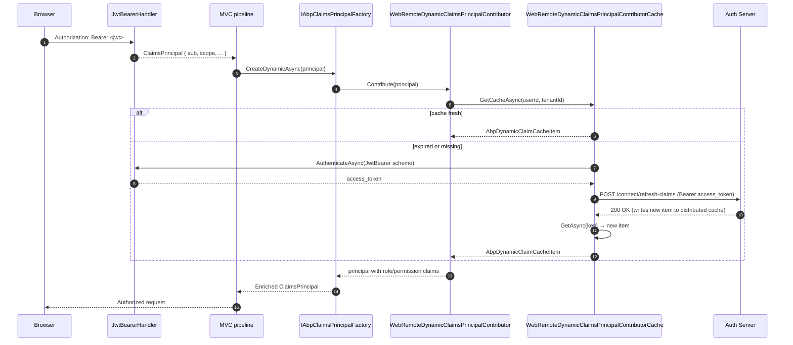

## What this package adds on top of JwtBearer

`framework/src/Volo.Abp.AspNetCore.Authentication.JwtBearer/` is intentionally thin: ABP Framework does **not** replace `Microsoft.AspNetCore.Authentication.JwtBearer`. The package's job is to bridge the JwtBearer pipeline into ABP's identity stack — specifically, to make sure that when a JWT contains a `sub` claim, the ABP `ClaimsPrincipal` ends up with a *full* set of permissions, roles, tenant id, and any custom claims, even those that change between token refreshes (dynamic claims).

The package contains three real classes plus the module itself:

- `AbpAspNetCoreAuthenticationJwtBearerModule` — the module wiring.
- `WebRemoteDynamicClaimsPrincipalContributor` — pulls dynamic claims from a remote endpoint.
- `WebRemoteDynamicClaimsPrincipalContributorCache` — caches them and decides when to refresh.
- `WebRemoteDynamicClaimsPrincipalContributorOptions` — opt-in flag + authentication scheme name.

Everything else (the `AddJwtBearer(...)` call, the issuer signing keys, JWKS discovery) is plain ASP.NET Core configuration that you wire in your host module.

<Info>
This page focuses on the "what ABP adds" part. For the ASP.NET Core configuration that lives next to it in any ABP host — `services.AddAuthentication().AddJwtBearer(...)`, `JwtBearerOptions.Authority`, `JwtBearerOptions.Audience` — refer to the upstream Microsoft documentation; ABP does not customise those.
</Info>

## The module: `AbpAspNetCoreAuthenticationJwtBearerModule`

`Volo/Abp/AspNetCore/Authentication/JwtBearer/AbpAspNetCoreAuthenticationJwtBearerModule.cs` declares three dependencies and registers two services conditionally:

```csharp
[DependsOn(typeof(AbpSecurityModule), typeof(AbpCachingModule), typeof(AbpAspNetCoreAbstractionsModule))]
public class AbpAspNetCoreAuthenticationJwtBearerModule : AbpModule
{
    public override void ConfigureServices(ServiceConfigurationContext context)
    {
        context.Services.AddHttpClient();
        context.Services.AddHttpContextAccessor();

        if (context.Services.ExecutePreConfiguredActions<WebRemoteDynamicClaimsPrincipalContributorOptions>().IsEnabled &&
            context.Services.ExecutePreConfiguredActions<AbpClaimsPrincipalFactoryOptions>().IsRemoteRefreshEnabled)
        {
            context.Services.AddTransient<WebRemoteDynamicClaimsPrincipalContributor>();
            context.Services.AddTransient<WebRemoteDynamicClaimsPrincipalContributorCache>();
        }
    }
}
```

Three subtle things happen here:

- `services.AddHttpClient()` registers `IHttpClientFactory`; the contributor uses a named client to call the remote refresh endpoint.
- `services.AddHttpContextAccessor()` is needed because the contributor calls `HttpContext.AuthenticateAsync(scheme)` to fetch the `access_token` that should be presented to the IdP.
- The two contributor registrations are gated by **both** options being enabled. `WebRemoteDynamicClaimsPrincipalContributorOptions.IsEnabled` is the per-package switch; `AbpClaimsPrincipalFactoryOptions.IsRemoteRefreshEnabled` is the cross-cutting switch on the security stack. The pattern `ExecutePreConfiguredActions<TOptions>()` materialises the options synchronously during module wiring — this is the only way to make `ConfigureServices` itself depend on a value the consumer just `PreConfigure`-d.

`AbpSecurityModule` brings the `IAbpClaimsPrincipalFactory` infrastructure that the contributor plugs into.

## `WebRemoteDynamicClaimsPrincipalContributor`

`Volo/Abp/AspNetCore/Authentication/JwtBearer/DynamicClaims/WebRemoteDynamicClaimsPrincipalContributor.cs` is a single-line subclass:

```csharp
[DisableConventionalRegistration]
public class WebRemoteDynamicClaimsPrincipalContributor
    : RemoteDynamicClaimsPrincipalContributorBase<
        WebRemoteDynamicClaimsPrincipalContributor,
        WebRemoteDynamicClaimsPrincipalContributorCache>
{
}
```

The work is in the abstract base `RemoteDynamicClaimsPrincipalContributorBase<TContributor, TCache>` (from `Volo.Abp.Security`). What ABP needs from this subtype is just the *binding* between contributor and cache types — the generic arguments determine which cache implementation is resolved. `[DisableConventionalRegistration]` ensures only the explicit `AddTransient<…>()` call in the module wires it up, even when the conventional registrar would otherwise pick it up because it implements `IDynamicClaimsPrincipalContributor`.

When `IAbpClaimsPrincipalFactory.CreateDynamicAsync(principal)` runs (typically inside an MVC authentication filter or the SignalR auth hub filter), it iterates over all registered contributors. The `Web` one defers to the cache, which decides whether a refresh is needed.

## `WebRemoteDynamicClaimsPrincipalContributorCache`

`Volo/Abp/AspNetCore/Authentication/JwtBearer/DynamicClaims/WebRemoteDynamicClaimsPrincipalContributorCache.cs` extends `RemoteDynamicClaimsPrincipalContributorCacheBase<>` and overrides two methods.

```csharp
public class WebRemoteDynamicClaimsPrincipalContributorCache
    : RemoteDynamicClaimsPrincipalContributorCacheBase<WebRemoteDynamicClaimsPrincipalContributorCache>
{
    public const string HttpClientName = nameof(WebRemoteDynamicClaimsPrincipalContributorCache);

    protected IDistributedCache<AbpDynamicClaimCacheItem> Cache { get; }
    protected IHttpClientFactory HttpClientFactory { get; }
    protected IHttpContextAccessor HttpContextAccessor { get; }
    protected IOptions<WebRemoteDynamicClaimsPrincipalContributorOptions> Options { get; }
    ...
}
```

`GetCacheAsync` reads the per-user/per-tenant entry:

```csharp
protected async override Task<AbpDynamicClaimCacheItem?> GetCacheAsync(Guid userId, Guid? tenantId = null)
{
    return await Cache.GetAsync(AbpDynamicClaimCacheItem.CalculateCacheKey(userId, tenantId));
}
```

`RefreshAsync` is where the package earns its keep:

```csharp
protected async override Task RefreshAsync(Guid userId, Guid? tenantId = null)
{
    try
    {
        if (HttpContextAccessor.HttpContext == null)
        {
            throw new AbpException($"Failed to refresh remote claims for user: {userId} - HttpContext is null!");
        }

        var authenticateResult = await HttpContextAccessor.HttpContext.AuthenticateAsync(Options.Value.AuthenticationScheme);
        if (!authenticateResult.Succeeded)
        {
            throw new AbpException($"Failed to refresh remote claims for user: {userId} - authentication failed!");
        }

        var accessToken = authenticateResult.Properties?.GetTokenValue("access_token");
        if (accessToken.IsNullOrWhiteSpace())
        {
            throw new AbpException($"Failed to refresh remote claims for user: {userId} - access_token is null or empty!");
        }

        var client = HttpClientFactory.CreateClient(HttpClientName);
        var requestMessage = new HttpRequestMessage(HttpMethod.Post, AbpClaimsPrincipalFactoryOptions.Value.RemoteRefreshUrl);
        requestMessage.SetBearerToken(accessToken);
        var response = await client.SendAsync(requestMessage);
        response.EnsureSuccessStatusCode();
    }
    catch (Exception e)
    {
        Logger.LogWarning(e, $"Failed to refresh remote claims for user: {userId}");
        throw;
    }
}
```

Five things happen in sequence:

1. The current `HttpContext` is required — this contributor only fires inside an in-flight request (or hub invocation that flows the context).
2. `HttpContext.AuthenticateAsync(scheme)` re-runs the JwtBearer handler so the cache reads the *same* access token the original request presented. The scheme comes from `WebRemoteDynamicClaimsPrincipalContributorOptions.AuthenticationScheme`, defaulting to `JwtBearerDefaults.AuthenticationScheme`.
3. `authenticateResult.Properties.GetTokenValue("access_token")` pulls the original bearer token, which is then forwarded to the IdP-side refresh endpoint as `Authorization: Bearer …` via `IdentityModel.Client.SetBearerToken`.
4. The refresh endpoint URL is `AbpClaimsPrincipalFactoryOptions.Value.RemoteRefreshUrl` — configured once per host, typically to the auth server's `/connect/refresh-claims`-style action.
5. The response status is enforced with `EnsureSuccessStatusCode()`; failures are logged at warning level and rethrown so the caller can decide whether to abort the request.

Note that `RefreshAsync` does **not** parse the response body. The downstream `IAbpClaimsPrincipalFactory` will fetch the new claims from the distributed cache (where the refresh endpoint stores them) on the next call. This split keeps cache invalidation and remote refresh as cooperating but independent concerns.

### Why a named `HttpClient`?

`HttpClientName = nameof(WebRemoteDynamicClaimsPrincipalContributorCache)` lets you customise the client (timeouts, retry, DelegatingHandlers) per package without touching the default `HttpClient`:

```csharp
services.AddHttpClient(WebRemoteDynamicClaimsPrincipalContributorCache.HttpClientName, c =>
{
    c.Timeout = TimeSpan.FromSeconds(5);
    c.BaseAddress = new Uri(configuration["AuthServer:Authority"]!);
});
```

This is a small operational win — refresh latency does not pollute the default `HttpClient`'s metrics.

## `WebRemoteDynamicClaimsPrincipalContributorOptions`

`Volo/Abp/AspNetCore/Authentication/JwtBearer/DynamicClaims/WebRemoteDynamicClaimsPrincipalContributorOptions.cs`:

```csharp
public class WebRemoteDynamicClaimsPrincipalContributorOptions
{
    public bool IsEnabled { get; set; }
    public string AuthenticationScheme { get; set; }

    public WebRemoteDynamicClaimsPrincipalContributorOptions()
    {
        IsEnabled = false;
        AuthenticationScheme = JwtBearerDefaults.AuthenticationScheme;
    }
}
```

Note the default: **disabled**. You opt in with a pre-configure call in your host module:

```csharp
public override void PreConfigureServices(ServiceConfigurationContext context)
{
    PreConfigure<WebRemoteDynamicClaimsPrincipalContributorOptions>(options =>
    {
        options.IsEnabled = true;
    });

    PreConfigure<AbpClaimsPrincipalFactoryOptions>(options =>
    {
        options.IsRemoteRefreshEnabled = true;
        options.RemoteRefreshUrl = "https://auth.example.com/connect/refresh-claims";
    });
}
```

`PreConfigureServices` is required because `AbpAspNetCoreAuthenticationJwtBearerModule.ConfigureServices` reads the option synchronously to decide whether to register the contributor at all.

## How it fits into `IAbpClaimsPrincipalFactory`



## Multi-tenancy interplay

`AbpDynamicClaimCacheItem.CalculateCacheKey(userId, tenantId)` includes the tenant id, so a single user that switches between two tenants gets *two* cache entries. This matches ABP's identity model: roles and permissions are tenant-scoped. The contributor reads the tenant id from `ICurrentTenant` upstream (in the base class), so as long as the JWT carries the `tenantid` claim and the tenant resolver picks it up before authentication runs, the cache key and the refreshed claims are tenant-consistent.

For requests where the bearer token authenticates a host user accessing tenant data via switch-tenant, the contributor will still cache per (userId, tenantId) — but the source-of-truth is the IdP, so cache misses always result in an authoritative refresh.

## Why a "remote" refresh and not local DB lookup

The host that mounts the JWT bearer middleware is usually a **resource server**, not the identity provider. It does not necessarily have access to the user/role tables. By POSTing back to the IdP with the same bearer token, the resource server gets the freshest authoritative claims without taking a SQL connection on the auth database. This decouples deployment topologies — you can shard the resource servers per region while keeping a single IdP.

When the resource server *is* co-located with the identity store (e.g. a monolithic deployment), prefer the in-process `LocalDynamicClaimsPrincipalContributor` (in `Volo.Abp.Security`) and leave `WebRemoteDynamicClaimsPrincipalContributorOptions.IsEnabled = false`.

## What this package does NOT do

A common confusion: this package does not configure `JwtBearerOptions`. There is no `AbpJwtBearerOptionsConfigurator`, no `JwtBearerEvents` override, and no Microsoft.IdentityModel.Tokens validation customisation. All of that is up to your host module:

```csharp
context.Services
    .AddAuthentication(JwtBearerDefaults.AuthenticationScheme)
    .AddJwtBearer(options =>
    {
        options.Authority = configuration["AuthServer:Authority"];
        options.Audience  = configuration["AuthServer:Audience"];
        options.RequireHttpsMetadata = configuration.GetValue<bool>("AuthServer:RequireHttps");
    });
```

The ABP package focuses on the **claims principal enrichment** that happens *after* the bearer is validated. That separation is what lets you swap in a different JWT bearer flavour (OpenIddict, IdentityServer, custom OPA introspection) without touching ABP's identity stack.

## Operational considerations

- **HttpContext null inside background workers** — if you have a background job that calls `IAbpClaimsPrincipalFactory.CreateDynamicAsync` outside an HTTP request, `RefreshAsync` will throw `"HttpContext is null!"`. Either run the worker under a synthetic `HttpContext` (via `HttpContextAccessor.HttpContext = new DefaultHttpContext()`) with a stored token, or disable remote refresh for the worker scope.
- **Refresh storms** — `RemoteDynamicClaimsPrincipalContributorCacheBase` uses the distributed cache to deduplicate refreshes across instances, but a cold start with many users can still cause a burst. Tune `AbpClaimsPrincipalFactoryOptions.DynamicClaimsCacheExpiration` (default a few minutes) to soften this.
- **Cache invalidation** — the IdP-side endpoint pointed to by `RemoteRefreshUrl` is responsible for *writing* the new `AbpDynamicClaimCacheItem` into the distributed cache. If you implement a custom endpoint, mirror what ABP's identity module does: compute the same key, set the same TTL, and emit a `LocalEventBus` invalidation event so peer resource servers see the change immediately.

## Summary

`Volo.Abp.AspNetCore.Authentication.JwtBearer` is the bridge that turns a stock JWT into a fully-featured ABP `ClaimsPrincipal` with dynamic permissions and roles. The module conditionally registers two classes — `WebRemoteDynamicClaimsPrincipalContributor` and its cache — that cooperate with `IAbpClaimsPrincipalFactory` to refresh claims from a remote IdP using the same bearer token. The options class lets hosts opt in and pick the authentication scheme. Everything else — token validation, audience checks, JWKS discovery — remains plain `Microsoft.AspNetCore.Authentication.JwtBearer` configuration in your host module.
