`framework/src/Volo.Abp.AspNetCore.Mvc/Volo/Abp/AspNetCore/Mvc/ApiExploring/` is the server-side counterpart to `Volo.Abp.Http.Client`'s `ApiDescriptionFinder`. It owns the endpoint that publishes the framework's `ApplicationApiDescriptionModel`, the providers that augment the standard ASP.NET Core OpenAPI surface with ABP's error envelope and `204 No Content` responses, and the XML documentation reader that surfaces in-source comments through the same model.

## The endpoint

`framework/src/Volo.Abp.AspNetCore.Mvc/Volo/Abp/AspNetCore/Mvc/ApiExploring/AbpApiDefinitionController.cs` is the single endpoint the dynamic HTTP client calls on startup:

```csharp
[Area("abp")]
[RemoteService(Name = "abp")]
[Route("api/abp/api-definition")]
public class AbpApiDefinitionController : AbpController, IRemoteService
{
    protected readonly IApiDescriptionModelProvider ModelProvider;

    public AbpApiDefinitionController(IApiDescriptionModelProvider modelProvider)
    {
        ModelProvider = modelProvider;
    }

    [HttpGet]
    public virtual async Task<ApplicationApiDescriptionModel> Get(ApplicationApiDescriptionModelRequestDto model)
    {
        return await ModelProvider.CreateApiModelAsync(model);
    }
}
```

The controller is an explicit controller class — not generated by `AbpServiceConvention` — because it lives in `Volo.Abp.AspNetCore.Mvc` directly. It declares `[Area("abp")]` so its route is `api/abp/api-definition`, marks itself as a remote service named `"abp"`, and delegates the work to whatever `IApiDescriptionModelProvider` is registered. The request DTO `ApplicationApiDescriptionModelRequestDto` (`framework/src/Volo.Abp.Http/Volo/Abp/Http/Modeling/ApplicationApiDescriptionModelRequestDto.cs`) lets the caller filter by module name, controller name, or type set.

The response is the full `ApplicationApiDescriptionModel` documented in [Volo Abp Http](/http/volo-abp-http) — a recursive structure of `ModuleApiDescriptionModel → ControllerApiDescriptionModel → ActionApiDescriptionModel`. The client's `ApiDescriptionFinder.GetApiDescriptionAsync` (`framework/src/Volo.Abp.Http.Client/Volo/Abp/Http/Client/DynamicProxying/ApiDescriptionFinder.cs`) caches that response per base URL and uses it for every subsequent method invocation.

## The model provider

`IApiDescriptionModelProvider` is declared in `framework/src/Volo.Abp.Http/Volo/Abp/Http/Modeling/IApiDescriptionModelProvider.cs`. Its default implementation `AspNetCoreApiDescriptionModelProvider` (`framework/src/Volo.Abp.AspNetCore.Mvc/Volo/Abp/AspNetCore/Mvc/AspNetCoreApiDescriptionModelProvider.cs`) is the bridge between MVC's `IApiDescriptionGroupCollectionProvider` and ABP's serialisable model.

Its constructor takes everything it needs:

```csharp
public AspNetCoreApiDescriptionModelProvider(
    IOptions<AspNetCoreApiDescriptionModelProviderOptions> options,
    IApiDescriptionGroupCollectionProvider descriptionProvider,
    IOptions<AbpAspNetCoreMvcOptions> abpAspNetCoreMvcOptions,
    IOptions<AbpApiDescriptionModelOptions> modelOptions,
    IXmlDocumentationProvider xmlDocProvider)
```

`CreateApiModelAsync` walks every `ApiDescription` exposed by MVC, skips non-controller endpoints, and for each remaining one calls `AddApiDescriptionToModelAsync` to fold it into the result. After the walk, it dedupes controllers that appear more than once (a common scenario when a client-proxy and a real controller share the same interface) by removing the remote-service entries except the first. The final step is `model.NormalizeOrder()` (on `ApplicationApiDescriptionModel`) which produces a stable ordering so the client cache key remains identical across boots.

`AspNetCoreApiDescriptionModelProviderOptions` (`framework/src/Volo.Abp.AspNetCore.Mvc/Volo/Abp/AspNetCore/Mvc/AspNetCoreApiDescriptionModelProviderOptions.cs`) gives modules hooks to filter or transform descriptions before they reach the model. `AbpApiDescriptionModelOptions.IgnoredInterfaces` (`framework/src/Volo.Abp.Http.Abstractions/Volo/Abp/Http/Modeling/AbpApiDescriptionModelOptions.cs`) is the matching filter on the abstractions side.

## Adding ABP-standard response types

`framework/src/Volo.Abp.AspNetCore.Mvc/Volo/Abp/AspNetCore/Mvc/ApiExploring/AbpRemoteServiceApiDescriptionProvider.cs` is the `IApiDescriptionProvider` that adds the standard ABP error responses to every remote-service action:

```csharp
public int Order => -999;

public void OnProvidersExecuting(ApiDescriptionProviderContext context)
{
    foreach (var apiResponseType in GetApiResponseTypes())
    {
        foreach (var result in context.Results.Where(x => x.IsRemoteService()))
        {
            var actionAttributes = ReflectionHelper.GetAttributesOfMemberOrDeclaringType<ProducesResponseTypeAttribute>(
                result.ActionDescriptor.GetMethodInfo());
            if (actionAttributes.Any(x => x.StatusCode == apiResponseType.StatusCode)) continue;

            result.SupportedResponseTypes.AddIfNotContains(
                x => x.StatusCode == apiResponseType.StatusCode,
                () => apiResponseType);
        }
    }
}
```

The order `-999` is intentionally just after the built-in `DefaultApiDescriptionProvider` (which has order `0`) but earlier than any custom provider, so the augmentation is visible to subsequent providers. The list of response types comes from `AbpRemoteServiceApiDescriptionProviderOptions` (`framework/src/Volo.Abp.AspNetCore.Mvc/Volo/Abp/AspNetCore/Mvc/ApiExploring/AbpRemoteServiceApiDescriptionProviderOptions.cs`), which `AbpAspNetCoreMvcModule.ConfigureServices` pre-populates with `RemoteServiceErrorResponse` for status codes 400, 401, 403, 404, 500, and 501:

```csharp
Configure<AbpRemoteServiceApiDescriptionProviderOptions>(options =>
{
    var statusCodes = new List<int> {
        (int)HttpStatusCode.Forbidden,
        (int)HttpStatusCode.Unauthorized,
        (int)HttpStatusCode.BadRequest,
        (int)HttpStatusCode.NotFound,
        (int)HttpStatusCode.NotImplemented,
        (int)HttpStatusCode.InternalServerError
    };

    options.SupportedResponseTypes.AddIfNotContains(statusCodes.Select(statusCode => new ApiResponseType
    {
        Type = typeof(RemoteServiceErrorResponse),
        StatusCode = statusCode
    }));
});
```

The result is that any OpenAPI document generated from MVC's api-explorer describes ABP's error envelope as a possible response type for every standard failure mode — without modules having to remember to add `[ProducesResponseType]` attributes themselves.

The `GetApiResponseTypes` method also attaches `apiResponse.ModelMetadata` (from `IModelMetadataProvider`) and walks every output formatter's `IApiResponseTypeMetadataProvider` to fill in supported content types. That is what makes `application/json` show up as the only response media type by default.

## Augmenting `204 No Content`

`framework/src/Volo.Abp.AspNetCore.Mvc/Volo/Abp/AspNetCore/Mvc/ApiExploring/AbpNoContentApiDescriptionProvider.cs` is the complementary provider that ensures void-returning actions are described as `204` instead of `200`:

```csharp
public int Order => -999;

public virtual void OnProvidersExecuting(ApiDescriptionProviderContext context)
{
    foreach (var result in context.Results.Where(x => x.IsRemoteService()))
    {
        var attributes = ReflectionHelper.GetAttributesOfMemberOrDeclaringType<ProducesResponseTypeAttribute>(
            result.ActionDescriptor.GetMethodInfo());
        if (attributes.Any(x => x.StatusCode == (int)HttpStatusCode.NoContent)) continue;

        var returnType = result.ActionDescriptor.GetReturnType();
        if (returnType == typeof(Task) || returnType == typeof(void))
        {
            result.SupportedResponseTypes.Add(new ApiResponseType
            {
                Type = typeof(void),
                StatusCode = (int)HttpStatusCode.NoContent
            });
        }
    }
}
```

The runtime counterpart is `AbpNoContentActionFilter` (`framework/src/Volo.Abp.AspNetCore.Mvc/Volo/Abp/AspNetCore/Mvc/Response/AbpNoContentActionFilter.cs`), which actually rewrites the response. Both pieces ensure that the documented behaviour matches the runtime behaviour.

## XML documentation

`framework/src/Volo.Abp.AspNetCore.Mvc/Volo/Abp/AspNetCore/Mvc/ApiExploring/XmlDocumentationProvider.cs` and `IXmlDocumentationProvider.cs` are how source `///` comments surface in the api-definition response. The provider is `ISingletonDependency` and caches the loaded `XDocument` per assembly:

```csharp
private readonly ConcurrentDictionary<Assembly, Lazy<Task<XDocument?>>> _xmlDocCache = new();

public virtual async Task<string?> GetSummaryAsync(Type type);
public virtual async Task<string?> GetRemarksAsync(Type type);
public virtual async Task<string?> GetSummaryAsync(MethodInfo method);
public virtual async Task<string?> GetRemarksAsync(MethodInfo method);
public virtual async Task<string?> GetReturnsAsync(MethodInfo method);
public virtual async Task<string?> GetParameterSummaryAsync(MethodInfo method, string parameterName);
public virtual async Task<string?> GetSummaryAsync(PropertyInfo property);
```

Each method computes the appropriate `member` name (`T:`, `M:`, `P:`, `F:`, `E:` prefix), looks it up via `XPathSelectElement($"//member[@name='{memberName}']")`, and returns the relevant child element's text. The regex helpers `WhitespaceRegex`, `XmlTagRegex`, and `XmlRefTagRegex` strip XML inline elements (`<see cref="..."/>`, `<paramref name="..."/>`) down to plain prose suitable for OpenAPI descriptions.

The model provider plugs the XML output into `ControllerApiDescriptionModel.Summary`, `ActionApiDescriptionModel.Summary`, `MethodParameterApiDescriptionModel.DescriptionGroupName`, and `PropertyApiDescriptionModel.Summary` so any client tool — Swagger UI, OpenAPI Generator, ABP's own static proxy generator — can render the in-source documentation alongside the schema.

## How the pieces fit together

```mermaid
flowchart TB
    A[GET /api/abp/api-definition] --> B[AbpApiDefinitionController.Get]
    B --> C[IApiDescriptionModelProvider.CreateApiModelAsync]
    C --> D[AspNetCoreApiDescriptionModelProvider]
    D --> E[IApiDescriptionGroupCollectionProvider]
    E --> F[Walks every ApiDescription returned by MVC]
    F --> G[AbpNoContentApiDescriptionProvider adds 204 entries]
    F --> H[AbpRemoteServiceApiDescriptionProvider adds RemoteServiceErrorResponse entries]
    F --> I[IXmlDocumentationProvider fills summaries]
    G --> J[ActionApiDescriptionModel.SupportedResponseTypes populated]
    H --> J
    I --> K[ControllerApiDescriptionModel.Summary populated]
    J --> L[ApplicationApiDescriptionModel returned to client]
    K --> L
    L --> M[Client&apos;s ApiDescriptionFinder caches it per BaseUrl]
    M --> N[Dynamic proxy looks up method &#8594; URL]
```



Every step has a real file underneath. The providers run during MVC's startup `ApiExplorer` walk so the augmentation is visible to both `/api/abp/api-definition` and any downstream OpenAPI document generator (Swashbuckle, NSwag, OpenAPI v3).

## Interacting with the system

A module that wants its custom exception type to appear in OpenAPI documents adds a response entry on its own:

```csharp
Configure<AbpRemoteServiceApiDescriptionProviderOptions>(options =>
{
    options.SupportedResponseTypes.Add(new ApiResponseType
    {
        Type = typeof(RemoteServiceErrorResponse),
        StatusCode = (int)HttpStatusCode.Conflict
    });
});
```

To filter what `AbpApiDefinitionController` returns, the request DTO `ApplicationApiDescriptionModelRequestDto` carries `Modules`, `Controllers`, and `IncludeTypes` properties (declared in `framework/src/Volo.Abp.Http/Volo/Abp/Http/Modeling/ApplicationApiDescriptionModelRequestDto.cs`). The model provider honours those filters when walking the description groups.

## What the prompt called `AbpApiExplorerOptions` and `ModelMetadataProviderAdapter`

The ABP Framework does not ship symbols named `AbpApiExplorerOptions` or `ModelMetadataProviderAdapter` in this folder. The same responsibilities are filled by:

- `AspNetCoreApiDescriptionModelProviderOptions` — the configuration object that the model provider reads. It is the closest analogue to "API explorer options" and is documented above.
- `AbpRemoteServiceApiDescriptionProviderOptions` — the configuration object for the response-type augmentation provider.
- The built-in `IModelMetadataProvider` from ASP.NET Core, which the model provider calls directly inside `GetApiResponseTypes` to attach metadata to response types. There is no ABP-specific adapter wrapping it.

The `IApiDescriptionFinder` referenced in client-side code (see [HTTP Client](/http/http-client)) does its default discovery by issuing the HTTP request to `AbpApiDefinitionController` covered here. That round-trip is what closes the loop: the server exposes the model; the client consumes it; both sides agree on URL templates, response types, and parameter shapes without any code generation step.

## Caching and invalidation

There is a deliberate `TODO: Can cache the model?` comment in `AspNetCoreApiDescriptionModelProvider.CreateApiModelAsync`. As of the current code, the model is rebuilt on every call. The client cache via `IApiDescriptionCache` (`framework/src/Volo.Abp.Http.Client/Volo/Abp/Http/Client/DynamicProxying/IApiDescriptionCache.cs`) hides the cost from the caller — by default, a process caches the deserialised `ApplicationApiDescriptionModel` for the lifetime of the process. When deploying a hot update that changes the API surface, restarting client processes is the simplest way to invalidate; in a production setup with multiple replicas, the more sophisticated path is to broadcast a `CurrentApplicationConfigurationCacheResetEventData` (`framework/src/Volo.Abp.AspNetCore.Mvc.Contracts/Volo/Abp/AspNetCore/Mvc/ApplicationConfigurations/CurrentApplicationConfigurationCacheResetEventData.cs`) over the distributed event bus.

## ApiDescriptionExtensions and IsRemoteService

`framework/src/Volo.Abp.AspNetCore.Mvc/Volo/Abp/AspNetCore/Mvc/ApiDescriptionExtensions.cs` defines the `IsRemoteService(this ApiDescription)` extension used by both providers above to decide whether a description represents an ABP application service controller. The extension reads `apiDescription.ActionDescriptor.EndpointMetadata` for the `[RemoteService]` attribute, or checks whether the declaring controller implements `IApplicationService`. Without it, the providers would augment every action — including framework controllers such as `ChallengeAccountController` — which is undesirable.

`AbpActionContextExtensions` (`framework/src/Volo.Abp.AspNetCore.Mvc/Volo/Abp/AspNetCore/Mvc/AbpActionContextExtensions.cs`) carries the matching helpers used during request execution (`IsControllerAction`, `HasObjectResult`, `GetMethodInfo`, `GetReturnType`). The api-exploring providers reuse the same helpers so static analysis and runtime behaviour stay in lockstep.

<Tip>
When a Swagger UI shows wrong response types for an ABP action, the answer is almost always one of the two providers in this folder. Set a breakpoint on `OnProvidersExecuting` and inspect `result.SupportedResponseTypes` before and after — you will see the exact moment the `RemoteServiceErrorResponse` entries appear, and you can confirm whether the action's controller carries the `[RemoteService]` attribute the provider checks for.
</Tip>

## CreateApiModelAsync in depth

`AspNetCoreApiDescriptionModelProvider.CreateApiModelAsync` is the workhorse that materialises `ApplicationApiDescriptionModel` from MVC's discovered descriptions. The method's loop:

```csharp
var model = ApplicationApiDescriptionModel.Create();
var populatedControllers = new HashSet<ControllerApiDescriptionModel>();

foreach (var descriptionGroupItem in _descriptionProvider.ApiDescriptionGroups.Items)
{
    foreach (var apiDescription in descriptionGroupItem.Items)
    {
        if (!apiDescription.ActionDescriptor.IsControllerAction()) continue;
        await AddApiDescriptionToModelAsync(apiDescription, model, input, populatedControllers);
    }
}

foreach (var (_, module) in model.Modules)
{
    var controllers = module.Controllers.GroupBy(x => x.Value.Type).ToList();
    foreach (var controller in controllers.Where(x => x.Count() > 1))
    {
        var removedController = module.Controllers.RemoveAll(x => x.Value.IsRemoteService
            && controller.OrderBy(c => c.Value.ControllerGroupName).Skip(1).Contains(x));
        // ... log removals ...
    }
}

model.NormalizeOrder();
return model;
```

The dedup step is necessary because, in a host that includes both the local application service and the client-proxy for the same interface, MVC sees both as controllers. The provider keeps the first one (sorted by `ControllerGroupName`) and drops the rest, logging which it removed. The remaining controller is the one the client should target. `model.NormalizeOrder()` on `ApplicationApiDescriptionModel` then sorts modules, controllers, and actions alphabetically so the JSON output is deterministic — important for client-side cache keys.

## AddApiDescriptionToModelAsync

Inside `AddApiDescriptionToModelAsync`, the provider:

1. Reads the controller `TypeInfo` from `apiDescription.ActionDescriptor.AsControllerActionDescriptor().ControllerTypeInfo`.
2. Looks up the `ConventionalControllerSetting` for that controller through `AbpAspNetCoreMvcOptions.ConventionalControllers.ConventionalControllerSettings.GetSettingOrNull`.
3. Computes the `RootPath` and `RemoteServiceName` from the setting (falling back to defaults if the controller is explicit).
4. Calls `model.GetOrAddModule(rootPath, remoteServiceName)` to find or create the bucket.
5. Walks the action's metadata: `AllowAnonymous`, `Authorize`, `ApiVersion`, `[Obsolete]`, then the XML doc summaries.
6. Materialises `ActionApiDescriptionModel.Create` with the URL and HTTP method already baked by the convention.
7. Walks the action's parameters, classifying each into `MethodParameterApiDescriptionModel` and `ParameterApiDescriptionModel` instances.
8. Walks the response type and adds it to `model.Types` if it hasn't been seen before.

The `model.Types` accumulation is what makes the response self-contained — a client only needs the single API description response to render forms, validators, and request shapes for every endpoint.

## Request filtering

`ApplicationApiDescriptionModelRequestDto` (`framework/src/Volo.Abp.Http/Volo/Abp/Http/Modeling/ApplicationApiDescriptionModelRequestDto.cs`) carries three optional filter arrays: `Modules`, `Controllers`, and `IncludeTypes`. When any are set, `ApplicationApiDescriptionModel.CreateSubModel` returns a copy containing only the matching entries. The client-side `ApiDescriptionFinder.GetApiDescriptionAsync` does not currently use these filters — it always fetches the full model — but Swagger UI integrations and tools can request a subset to keep the payload small.

## OpenAPI integration

Although ABP does not generate OpenAPI documents directly, it integrates with Swashbuckle and NSwag through the standard `IApiDescriptionProvider` pipeline. The two providers documented above (`AbpRemoteServiceApiDescriptionProvider` and `AbpNoContentApiDescriptionProvider`) augment the descriptions that Swashbuckle then converts to OpenAPI. The augmentation is invisible to Swashbuckle — it just sees richer `SupportedResponseTypes` entries — which means the same OpenAPI generator produces correct documents for both ABP and non-ABP endpoints.

The schema generators see `RemoteServiceErrorResponse` and `RemoteServiceErrorInfo` because both are referenced from the augmented `SupportedResponseTypes`. Swashbuckle walks the types and emits matching OpenAPI components, so client SDK generators (OpenAPI Generator, NSwag, Kiota) produce typed error classes automatically.

## XML doc collection in production

`XmlDocumentationProvider.LoadXmlDocumentationAsync` walks the assembly's location, looks for an XML doc file at the same path with `.xml` suffix, and asynchronously deserialises it once into the `ConcurrentDictionary<Assembly, Lazy<Task<XDocument?>>>` cache. The cache is process-lifetime so subsequent calls are O(1).

For the XML doc to exist, the project must compile with `<GenerateDocumentationFile>true</GenerateDocumentationFile>`. Without this MSBuild setting, the provider returns `null` summaries and the api-definition response lacks documentation strings. ABP module projects ship with the setting enabled by default; consumer projects must opt in if they want their own application service summaries to flow through.

### Stripping XML inline elements

The three regex constants `WhitespaceRegex`, `XmlTagRegex`, and `XmlRefTagRegex` produce clean prose from XML doc bodies. `XmlRefTagRegex` is the most clever — it captures the display portion of `<see cref="T:Foo.Bar"/>`, `<see langword="null"/>`, `<paramref name="x"/>`, and `<typeparamref name="T"/>` and emits the inner display name. This is what makes summaries readable in OpenAPI viewers that do not render XML doc tags.

```csharp
private static readonly Regex XmlRefTagRegex = new(
    @"<(see|paramref|typeparamref)\s+(cref|name|langword)=""([TMFPE]:)?(?<display>[^""]+)""\s*/?>",
    RegexOptions.Compiled);
```

The provider applies the regex inside `CleanXmlText` (called from each getter) so all summary lookups produce normalised strings.

## How the providers interact with the dynamic proxy

The dynamic HTTP client's `ApiDescriptionFinder` (`framework/src/Volo.Abp.Http.Client/Volo/Abp/Http/Client/DynamicProxying/ApiDescriptionFinder.cs`) calls `client.GetAsync($"{baseUrl}/api/abp/api-definition")`, deserialises the body into `ApplicationApiDescriptionModel`, and caches it in `IApiDescriptionCache`. The `ActionApiDescriptionModel` it then resolves for each method invocation contains the URL, HTTP verb, parameter bindings, and supported response types — all produced by the providers documented here. So the **server's API exploring pipeline is the canonical source of truth for the client's request construction**.

When a module changes a route, the change appears in the next api-definition response. When a module adds a custom error response (`Configure<AbpRemoteServiceApiDescriptionProviderOptions>(opts => opts.SupportedResponseTypes.Add(...))`), the change appears in OpenAPI documents generated by Swashbuckle. The two flows share the same input and stay in sync without manual coordination.

## Static-proxy generation pipeline

ABP's source generators read the same `ApplicationApiDescriptionModel` to emit C# proxy classes. The flow is:

```mermaid
flowchart LR
    A[abp generate-proxy CLI] --> B[Calls /api/abp/api-definition on the running host]
    B --> C[AbpApiDefinitionController]
    C --> D[AspNetCoreApiDescriptionModelProvider]
    D --> E[ApplicationApiDescriptionModel response]
    E --> F[CLI writes generate-proxy.json files]
    F --> G[Source generator reads the JSON]
    G --> H[Emits ClientProxyBase&lt;TService&gt; subclasses]
    H --> I[Compiled into MyApp.HttpApi.Client]
```



The CLI is one consumer; runtime is another (`ClientProxyApiDescriptionFinder`, `framework/src/Volo.Abp.Http.Client/Volo/Abp/Http/Client/ClientProxying/ClientProxyApiDescriptionFinder.cs`). Both deserialise the same JSON shape into the same in-memory model, so changes to the description providers ripple through both paths.

## When `model.NormalizeOrder` matters

Without sorted output, the JSON returned by `/api/abp/api-definition` would differ between processes because `IDictionary<,>` enumeration order depends on the runtime. The client's cache key is computed from the URL only, but the static proxy generator compares JSON files in source control — so non-deterministic output would create needless diffs every time a developer regenerates proxies. `NormalizeOrder` is the small fix that makes the generator output friendly to git.

## Performance considerations

The current implementation rebuilds the model on every call to `/api/abp/api-definition`. The TODO comment acknowledges this; in practice, the cost is bounded because (1) clients fetch the model exactly once per process, and (2) the model creation runs against an already-built `IApiDescriptionGroupCollectionProvider` cache. For ten thousand actions across a few hundred controllers, model construction is in the tens of milliseconds on modern hardware.

Where performance matters is **client-side cache invalidation**. The default `ApiDescriptionCache` (`framework/src/Volo.Abp.Http.Client/Volo/Abp/Http/Client/DynamicProxying/ApiDescriptionCache.cs`) holds the model for the lifetime of the process. Production deployments that change the API surface live (without rolling restarts) need a strategy to invalidate the client cache; the `CurrentApplicationConfigurationCacheResetEventData` event is the standard mechanism, but it requires the client to subscribe to a distributed event bus. Most ABP deployments side-step the issue by keeping the API surface stable across hot updates.

## Concluding the chapter

The API exploring layer is the connective tissue between the server's route table and the client's dynamic proxy. Every file in this folder — controller, provider, options, XML doc reader — exists to produce one stable JSON document. That document is what makes ABP's "interface as a contract" promise work in practice: every URL, every parameter, every response type a client could care about lives in `ApplicationApiDescriptionModel`, and every consumer reads it the same way.
