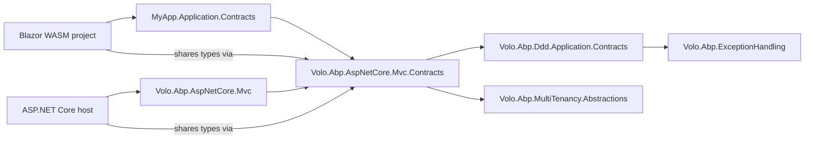

`Volo.Abp.AspNetCore.Mvc.Contracts` is the package that lets a Blazor WebAssembly app, an Angular front-end, or a MAUI client talk to an ABP backend without taking a hard dependency on ASP.NET Core, Entity Framework, or any of the server-only modules. The ABP Framework places every DTO and application service interface that crosses the wire here, so the same types appear unchanged on both sides of an HTTP call.

## The module

The module declaration in `framework/src/Volo.Abp.AspNetCore.Mvc.Contracts/Volo/Abp/AspNetCore/Mvc/AbpAspNetCoreMvcContractsModule.cs` is intentionally minimal:

```csharp
[DependsOn(
    typeof(AbpDddApplicationContractsModule),
    typeof(AbpMultiTenancyAbstractionsModule)
)]
public class AbpAspNetCoreMvcContractsModule : AbpModule
{
}
```

The dependencies are both abstraction-only modules: `AbpDddApplicationContractsModule` brings in `IApplicationService`, `IRemoteService`, and the standard CRUD application service contracts; `AbpMultiTenancyAbstractionsModule` brings in `ICurrentTenant`. Neither of those packages depends on ASP.NET Core, which is what allows the contracts module to ship into a Blazor WebAssembly project where ASP.NET Core itself is not present.

`AbpAspNetCoreMvcModule` (`framework/src/Volo.Abp.AspNetCore.Mvc/Volo/Abp/AspNetCore/Mvc/AbpAspNetCoreMvcModule.cs`) lists `AbpAspNetCoreMvcContractsModule` in its `DependsOn` so the server-side MVC module picks up the same shapes; the dynamic HTTP client picks them up the moment a developer adds the project reference.

## ApplicationConfigurations namespace

The majority of the package lives under `framework/src/Volo.Abp.AspNetCore.Mvc.Contracts/Volo/Abp/AspNetCore/Mvc/ApplicationConfigurations/`. This namespace owns the contract for the `/api/abp/application-configuration` endpoint — the bootstrap call that an ABP client makes on startup to discover the user, current tenant, available features, granted permissions, time settings, and dynamic object extensions in a single round-trip.

### IAbpApplicationConfigurationAppService

`framework/src/Volo.Abp.AspNetCore.Mvc.Contracts/Volo/Abp/AspNetCore/Mvc/ApplicationConfigurations/IAbpApplicationConfigurationAppService.cs`:

```csharp
public interface IAbpApplicationConfigurationAppService : IApplicationService
{
    Task<ApplicationConfigurationDto> GetAsync(ApplicationConfigurationRequestOptions options);
}
```

The interface inherits from `IApplicationService` so `AbpServiceConvention` (see [Conventions](/http/mvc-conventions)) will auto-expose it on the server, and the dynamic HTTP client will auto-consume it because `IApplicationService` derives from `IRemoteService`. The server-side implementation is `AbpApplicationConfigurationAppService` (`framework/src/Volo.Abp.AspNetCore.Mvc/Volo/Abp/AspNetCore/Mvc/ApplicationConfigurations/AbpApplicationConfigurationAppService.cs`), but every consumer talks to the interface.

### ApplicationConfigurationRequestOptions

`ApplicationConfigurationRequestOptions.cs` lets the client opt into expensive parts of the response — `IncludeLocalizationResources` (off by default because the strings can be megabytes for large modules) and `IncludeAuthConfigurationResources`. The application service uses these flags to skip generating the corresponding payload sections.

### ApplicationConfigurationDto

`ApplicationConfigurationDto.cs` is the aggregate response, with one property per concern:

```csharp
[Serializable]
public class ApplicationConfigurationDto : IHasExtraProperties
{
    public ApplicationLocalizationConfigurationDto    Localization     { get; set; }
    public ApplicationAuthConfigurationDto            Auth             { get; set; }
    public ApplicationSettingConfigurationDto         Setting          { get; set; }
    public CurrentUserDto                             CurrentUser      { get; set; }
    public ApplicationFeatureConfigurationDto         Features         { get; set; }
    public ApplicationGlobalFeatureConfigurationDto   GlobalFeatures   { get; set; }
    public MultiTenancyInfoDto                        MultiTenancy     { get; set; }
    public CurrentTenantDto                           CurrentTenant    { get; set; }
    public TimingDto                                  Timing           { get; set; }
    public ClockDto                                   Clock            { get; set; }
    public ObjectExtensionsDto                        ObjectExtensions { get; set; }
    public ExtraPropertyDictionary                    ExtraProperties  { get; set; }
}
```

Each property is itself a DTO defined in this namespace:

| File | Purpose |
|------|---------|
| `ApplicationLocalizationConfigurationDto.cs` | Localized resource bundles, language list, current culture, route-based culture flag. |
| `ApplicationAuthConfigurationDto.cs` | Granted permissions and the resources required to evaluate them. |
| `ApplicationSettingConfigurationDto.cs` | Setting values resolved for the current user/tenant. |
| `CurrentUserDto.cs` | Authenticated user identity, roles, claims. |
| `ApplicationFeatureConfigurationDto.cs` / `ApplicationGlobalFeatureConfigurationDto.cs` | Feature flags. |
| `MultiTenancyInfoDto.cs` | Whether multi-tenancy is enabled. |
| `CurrentTenantDto.cs` | Current tenant id and name. |
| `TimingDto.cs` / `ClockDto.cs` | Time zone and clock kind so the client can render dates correctly. |
| `CurrentCultureDto.cs` / `DateTimeFormatDto.cs` | Culture and format strings for the current request. |
| `ApplicationLocalizationDto.cs` / `ApplicationLocalizationResourceDto.cs` / `ApplicationLocalizationRequestDto.cs` | The companion contract for `/api/abp/application-localization` (see below). |

The DTO implements `IHasExtraProperties` and carries an `ExtraPropertyDictionary` so that modules can inject extra named values without changing the contract — for example a tenant-edition module can stuff edition metadata under `ExtraProperties["EditionName"]`.

`ApplicationLocalizationConfigurationDto` has a candid comment explaining its split shape: `Values` is filled by the configuration endpoint (current culture only), while `Resources` (the full resource definitions) is filled separately through `IAbpApplicationLocalizationAppService.cs` so the bootstrap payload stays small. The DTO acknowledges in code: "This is an ugly design, but it is the best solution for backward-compability and simple implementation."

### IAbpApplicationLocalizationAppService

`framework/src/Volo.Abp.AspNetCore.Mvc.Contracts/Volo/Abp/AspNetCore/Mvc/ApplicationConfigurations/IAbpApplicationLocalizationAppService.cs` is the secondary endpoint used by clients that want to lazy-load resource definitions independently of the configuration call. Its DTO (`ApplicationLocalizationDto`) carries the localization resource list.

### IApplicationConfigurationContributor

`framework/src/Volo.Abp.AspNetCore.Mvc.Contracts/Volo/Abp/AspNetCore/Mvc/ApplicationConfigurations/IApplicationConfigurationContributor.cs` is the extensibility hook:

```csharp
public interface IApplicationConfigurationContributor
{
    Task ContributeAsync(ApplicationConfigurationContributorContext context);
}
```

`ApplicationConfigurationContributorContext` (same folder) carries the `IServiceProvider` and the in-progress `ApplicationConfigurationDto`. `AbpApplicationConfigurationOptions` (`framework/src/Volo.Abp.AspNetCore.Mvc.Contracts/Volo/Abp/AspNetCore/Mvc/ApplicationConfigurations/AbpApplicationConfigurationOptions.cs`) holds the registered contributors:

```csharp
public class AbpApplicationConfigurationOptions
{
    public List<IApplicationConfigurationContributor> Contributors { get; }
}
```

Modules add a contributor in their `ConfigureServices` to surface their own configuration into the bootstrap payload — for example, an edition module adds an `EditionConfigurationContributor` that fills `ExtraProperties["AvailableEditions"]`.

### CurrentApplicationConfigurationCacheResetEventData

`framework/src/Volo.Abp.AspNetCore.Mvc.Contracts/Volo/Abp/AspNetCore/Mvc/ApplicationConfigurations/CurrentApplicationConfigurationCacheResetEventData.cs` is the distributed event emitted when the configuration changes (a permission is granted, a setting flips). Clients that cache the configuration response can subscribe through ABP's distributed event bus and invalidate the cache.

## ObjectExtending DTOs

`framework/src/Volo.Abp.AspNetCore.Mvc.Contracts/Volo/Abp/AspNetCore/Mvc/ApplicationConfigurations/ObjectExtending/` ships the metadata for ABP's object extension system. The shape is recursive:

- `ObjectExtensionsDto.cs` is the root with a per-module dictionary.
- `ModuleExtensionDto.cs` lists `EntityExtensionDto` per entity.
- `EntityExtensionDto.cs` lists `ExtensionPropertyDto` and `ExtensionPropertyApiDto` separately because the property model the UI sees differs from the API model.
- `ExtensionPropertyApiCreateDto.cs`, `ExtensionPropertyApiGetDto.cs`, `ExtensionPropertyApiUpdateDto.cs` are the per-verb variants that account for read-only vs. write-only fields.
- `ExtensionPropertyAttributeDto.cs`, `ExtensionPropertyFeaturePolicyDto.cs`, `ExtensionPropertyGlobalFeaturePolicyDto.cs`, `ExtensionPropertyPermissionPolicyDto.cs`, `ExtensionPropertyPolicyDto.cs` capture metadata-level constraints: which attributes apply, which feature gates the property, which permission lets a user see it.
- `ExtensionPropertyUiDto.cs`, `ExtensionPropertyUiFormDto.cs`, `ExtensionPropertyUiLookupDto.cs`, `ExtensionPropertyUiTableDto.cs` describe how the UI should render the extended property (input control, lookup source, table column).
- `ExtensionEnumDto.cs` and `ExtensionEnumFieldDto.cs` carry enum metadata for properties whose type is an enum.
- `LocalizableStringDto.cs` is the contract for a localizable display string. It has a `Name` and a `Resource` so the client can resolve the string against the localization map it already has.

These DTOs are populated by `AbpApplicationConfigurationAppService` from `ObjectExtensionManager.Instance` (in the DDD module). The result is that a client knows, at boot time, every dynamic property added to entities by every loaded module — including which forms to show, which validators to apply, and which permissions gate visibility.

## MultiTenancy contracts

`framework/src/Volo.Abp.AspNetCore.Mvc.Contracts/Volo/Abp/AspNetCore/Mvc/MultiTenancy/IAbpTenantAppService.cs` is the application service interface that lets a client resolve a tenant by name or id at runtime:

```csharp
public interface IAbpTenantAppService : IApplicationService
{
    Task<FindTenantResultDto> FindTenantByNameAsync(string name);
    Task<FindTenantResultDto> FindTenantByIdAsync(Guid id);
}
```

`FindTenantResultDto.cs` carries the resolved tenant (or a "not found" marker). `CurrentTenantDto.cs` describes the current tenant. `MultiTenancyInfoDto.cs` carries the boolean `IsEnabled` flag so a client knows whether to render tenant-aware UI. These three DTOs are also embedded in `ApplicationConfigurationDto` so the bootstrap payload includes them.

## Shared error contracts

The `RemoteServiceErrorInfo`, `RemoteServiceValidationErrorInfo`, and `RemoteServiceErrorResponse` types **do not** live in this package — they live in `Volo.Abp.ExceptionHandling` (`framework/src/Volo.Abp.ExceptionHandling/Volo/Abp/Http/`). They are documented in [Volo Abp Http](/http/volo-abp-http). The MVC contracts package re-uses them through the transitive `AbpExceptionHandlingModule` dependency carried by `AbpDddApplicationContractsModule`. That is how the `AbpRemoteServiceApiDescriptionProvider` (`framework/src/Volo.Abp.AspNetCore.Mvc/Volo/Abp/AspNetCore/Mvc/ApiExploring/AbpRemoteServiceApiDescriptionProvider.cs`) can register `typeof(RemoteServiceErrorResponse)` against the standard error status codes without importing this package.

## Why contracts live in their own package

The dependency graph is the entire point. When a Blazor WebAssembly project references `MyApp.Application.Contracts`, that contracts assembly transitively brings in `Volo.Abp.AspNetCore.Mvc.Contracts` — which brings in `Volo.Abp.Ddd.Application.Contracts`, `Volo.Abp.MultiTenancy.Abstractions`, and nothing else of ASP.NET Core's. The Blazor app's wasm output stays tiny because no MVC, Razor, or Kestrel code is reachable.



Both sides of the dotted line use the same `ApplicationConfigurationDto` instance shape, the same `IAbpApplicationConfigurationAppService` interface, the same `CurrentUserDto`. The server fills the DTO with `AbpApplicationConfigurationAppService`; the client deserialises the same DTO from JSON. The contract is byte-for-byte identical because both compile against `framework/src/Volo.Abp.AspNetCore.Mvc.Contracts/Volo/Abp/AspNetCore/Mvc/ApplicationConfigurations/ApplicationConfigurationDto.cs`.

## A note on `IRemoteServiceErrorInfoConverter`

ABP exposes an `IExceptionToErrorInfoConverter` (`framework/src/Volo.Abp.ExceptionHandling/Volo/Abp/ExceptionHandling/IExceptionToErrorInfoConverter.cs`) that converts a `.NET Exception` into a `RemoteServiceErrorInfo`. There is no separately-named `IRemoteServiceErrorInfoConverter` — the conversion happens through that single interface, and the contracts module relies on its default implementation registered by `AbpExceptionHandlingModule`. `AbpExceptionHandlingMiddleware.HandleAndWrapException` (`framework/src/Volo.Abp.AspNetCore/Volo/Abp/AspNetCore/ExceptionHandling/AbpExceptionHandlingMiddleware.cs`) is the canonical consumer:

```csharp
var errorInfoConverter = httpContext.RequestServices.GetRequiredService<IExceptionToErrorInfoConverter>();
...
new RemoteServiceErrorResponse(errorInfoConverter.Convert(exception, ...));
```

Clients consume the resulting DTOs from this package without ever instantiating the converter themselves.

## When to put a new type in this package

The rule of thumb is: if a type appears in an HTTP request body, an HTTP response body, or a request/response query string, it belongs here. If it is a server-side abstraction — a contributor interface, a configuration options class, a DI hook — it belongs in `Volo.Abp.AspNetCore.Mvc` instead. The contracts module deliberately keeps its surface area to data + the application service interfaces that expose that data.

<Tip>
When debugging a wasm client that "knows about" a server type it should not, look at the contracts project references. If `MyApp.Application.Contracts` accidentally references `MyApp.Domain` instead of `MyApp.Domain.Shared`, the contracts package leaks server-only types into the wasm output. The `AbpAspNetCoreMvcContractsModule.DependsOn` list — `AbpDddApplicationContractsModule` + `AbpMultiTenancyAbstractionsModule` — is the canonical example of a clean contracts dependency graph.
</Tip>

## ApplicationAuthConfigurationDto

`framework/src/Volo.Abp.AspNetCore.Mvc.Contracts/Volo/Abp/AspNetCore/Mvc/ApplicationConfigurations/ApplicationAuthConfigurationDto.cs` carries two dictionaries: `Policies` (the policy names the client can check) and `GrantedPolicies` (the subset granted to the current user). The split lets a UI render disabled controls for policies the user *could* have if they signed in differently, while still hiding the rest. The DTO's `RolePermissionRefs` field also exposes the role-permission graph so a UI can show "this action requires role X" without making a follow-up call.

## ApplicationSettingConfigurationDto

`ApplicationSettingConfigurationDto.cs` exposes `Values` (a `Dictionary<string, string?>` of resolved setting values for the current scope) plus the setting definitions when requested. The client-side `ISettingProvider` typically caches this once at startup so UI code can call `settingProvider["Theme.Default"]` without round-tripping. The server populates the DTO from `ISettingProvider.GetAllAsync` and respects per-user, per-tenant, and global overrides through the standard provider chain.

## CurrentUserDto

`framework/src/Volo.Abp.AspNetCore.Mvc.Contracts/Volo/Abp/AspNetCore/Mvc/ApplicationConfigurations/CurrentUserDto.cs` carries the authenticated user's identity: `IsAuthenticated`, `Id`, `TenantId`, `ImpersonatorUserId`, `ImpersonatorTenantId`, `UserName`, `Name`, `SurName`, `Email`, `EmailVerified`, `PhoneNumber`, `PhoneNumberVerified`, `Roles[]`, and `SessionId`. The impersonator fields are populated when an admin is acting as another user — useful both for audit displays and for restricting which actions the impersonator can perform on the impersonatee's behalf.

## CurrentCultureDto and DateTimeFormatDto

`CurrentCultureDto.cs` carries the selected culture's `DisplayName`, `EnglishName`, `Name`, `NativeName`, and `TwoLetterIsoLanguageName`, alongside an embedded `DateTimeFormatDto` (`DateTimeFormatDto.cs`) describing every culture-specific format string. Together they let a client render dates, numbers, and currency without depending on the browser's culture detection — for example, an Angular client running with the browser locale set to English but the user's ABP profile set to German will see German formats.

## TimingDto and ClockDto

`TimingDto.cs` carries the user's `TimeZone` (an OS-specific id), `WindowsTimeZoneId`, and `IanaTimeZoneId`. The client uses these to render server-side dates in the user's local timezone without re-implementing OS-specific mappings.

`ClockDto.cs` carries the `Kind` of clock used by the server (`Local`, `Utc`, `Unspecified`). When the client needs to interpret a returned `DateTime`, it consults the `Kind` to decide whether to apply timezone conversion — a value with `Kind = Utc` is converted; a value with `Kind = Unspecified` is assumed already in the user's timezone.

## MultiTenancyInfoDto and CurrentTenantDto

`MultiTenancyInfoDto.cs` carries a single `IsEnabled` boolean. A client uses it to decide whether to render tenant-aware UI: when multi-tenancy is off, the tenant switcher should not appear at all.

`CurrentTenantDto.cs` (`framework/src/Volo.Abp.AspNetCore.Mvc.Contracts/Volo/Abp/AspNetCore/Mvc/ApplicationConfigurations/CurrentTenantDto.cs`) carries `Id`, `Name`, and `IsAvailable`. The `IsAvailable` flag is `false` when the multi-tenancy middleware tried to resolve a tenant from the request but found none — the client can show a "not found" page instead of a generic error.

## ApplicationLocalizationDto and resource model

`ApplicationLocalizationDto.cs` is the response shape from `IAbpApplicationLocalizationAppService`:

```csharp
public class ApplicationLocalizationDto
{
    public Dictionary<string, ApplicationLocalizationResourceDto> Resources { get; set; }
    public Dictionary<string, string?>                            CurrentCulture { get; set; }
}
```

`ApplicationLocalizationResourceDto.cs` carries a per-resource `Texts` dictionary plus a `BaseResources` list naming inherited resources. The split between this endpoint and `/api/abp/application-configuration` keeps the bootstrap payload small while still giving clients full access to localization data on demand.

`ApplicationLocalizationRequestDto.cs` is the request DTO: it carries a `CultureName` and an `OnlyDynamics` flag so clients can fetch just the dynamic (user-defined) resources without re-downloading the static ones.

## CurrentApplicationConfigurationCacheResetEventData

`CurrentApplicationConfigurationCacheResetEventData.cs` is the distributed event published when configuration relevant to the application configuration response changes — a setting flips, a permission grant is added, a feature is toggled. Clients subscribed to ABP's distributed event bus invalidate their cached `ApplicationConfigurationDto` and re-fetch on the next access. The event carries the `TenantId` so single-tenant changes do not invalidate other tenants' caches.

## How ApplicationConfigurationContributorContext flows

`ApplicationConfigurationContributorContext.cs` is the per-call context passed to every `IApplicationConfigurationContributor`:

```csharp
public class ApplicationConfigurationContributorContext
{
    public IServiceProvider           ServiceProvider { get; }
    public ApplicationConfigurationDto Configuration  { get; }
    // ...
}
```

`AbpApplicationConfigurationAppService.GetAsync` iterates `AbpApplicationConfigurationOptions.Contributors` in registration order, calling `ContributeAsync(context)` for each. A typical contributor implementation reads a value from `context.ServiceProvider.GetRequiredService<IMyService>()` and writes it into `context.Configuration.ExtraProperties["MyKey"]`. The pattern is recursive: a contributor that needs another contributor's value first should be registered later.

## ObjectExtending in production

The object extension DTOs in `framework/src/Volo.Abp.AspNetCore.Mvc.Contracts/Volo/Abp/AspNetCore/Mvc/ApplicationConfigurations/ObjectExtending/` enable a powerful pattern: a UI can be told at runtime that the `User` entity has gained a new `EmployeeNumber` field requiring a regex match, visible only to admins, and the UI re-renders without a redeploy. The full lookup chain inside the client is:

1. `ApplicationConfigurationDto.ObjectExtensions.Modules["Identity"]` →
2. `.Entities["User"]` →
3. `.Properties["EmployeeNumber"]` →
4. Carries `Ui`, `Api`, `Attributes`, `Policy` sub-DTOs.

The `Ui` sub-DTO holds `Form` (input control type, placeholder), `Lookup` (data source URL when the property is a foreign key), and `Table` (column width, sortable). The `Api` sub-DTO holds variants for create/update/get so a write-once field appears in `Create` but not `Update`. The `Policy` sub-DTO holds `Permission`, `Feature`, and `GlobalFeature` gates.

`LocalizableStringDto.cs` is reused throughout — it carries a `Resource` and `Name` so the client can render the display name in the current culture using the localization data it already has cached.

## Cross-version stability

Because both client and server compile against this package, version mismatches show up immediately at the contracts boundary. ABP keeps the contracts module additive — properties are added, never removed, and never re-typed. When a DTO field is deprecated, it remains in the contract but is marked `[Obsolete]` and stops being populated. The result is that a client built against an older contracts version can still consume a newer server's response (with extra fields ignored) and a newer client can call an older server (with absent fields defaulting).

The `AbpAspNetCoreMvcContractsModule` declaration deliberately depends only on abstractions modules to keep this story manageable — if the contracts package depended on a transport module, every transport change would cascade into the contract surface.

## Summary

The MVC contracts package is small (under 50 source files) but is the most-shared assembly in any ABP deployment. Its types appear in: every Angular/Blazor/MAUI client; every microservice that responds to `/api/abp/application-configuration`; every test project that asserts the shape of an HTTP response; and every code-generator that emits client proxies. Anything you add here propagates instantly — which is why the maintainers keep its surface area minimal and additive.

## ApplicationConfigurationRequestOptions in depth

`ApplicationConfigurationRequestOptions.cs` is small but has outsized impact:

```csharp
public class ApplicationConfigurationRequestOptions
{
    public bool IncludeLocalizationResources           { get; set; } = true;
    public bool IncludeAuthConfigurationResources      { get; set; } = true;
    // ...
}
```

`IncludeLocalizationResources = true` causes `AbpApplicationConfigurationAppService.GetAsync` to fill `ApplicationLocalizationConfigurationDto.Values` with the full per-resource translation dictionaries. For a large application with many modules and many locales, this can be several megabytes — so production deployments typically set `IncludeLocalizationResources = false` on the bootstrap call and instead use `IAbpApplicationLocalizationAppService` to lazy-load language packs on demand.

`IncludeAuthConfigurationResources = true` includes the policy definitions in the response, so a client can render permission management UI without a separate call. When `false`, only the granted policy names are returned. This is the right setting for end-user apps that do not include admin UIs.

## How the bootstrap call composes

The dependency chain for a single `/api/abp/application-configuration` call:

1. **`AbpApplicationConfigurationAppService.GetAsync(options)`** kicks off the build.
2. It calls every `IApplicationConfigurationContributor` registered in `AbpApplicationConfigurationOptions`, in order.
3. The standard contributors (defined inside the same package's server-side counterpart) fill `Localization`, `Auth`, `Setting`, `CurrentUser`, `Features`, `GlobalFeatures`, `MultiTenancy`, `CurrentTenant`, `Timing`, `Clock`, and `ObjectExtensions`.
4. Custom module contributors fill additional sections, typically through `ExtraProperties`.
5. The DTO is serialised and returned.

The pattern is open for extension because every section is either an embedded DTO (modules can replace the implementation) or extra properties (modules can add arbitrary key-value pairs). The contracts package itself only carries the shapes; the population logic lives in `Volo.Abp.AspNetCore.Mvc`.

## Working with extra properties on the client

A Blazor client reading `ApplicationConfigurationDto.ExtraProperties` does so through the same `ExtraPropertyDictionary` indexer that server code uses:

```csharp
var configuration = await applicationConfigurationAppService.GetAsync(new ApplicationConfigurationRequestOptions());
var editionName = configuration.ExtraProperties.GetOrDefault("EditionName") as string;
```

The dictionary is JSON-encoded as a flat object, so any value type that round-trips through System.Text.Json is acceptable. Numeric values come back as `JsonElement` (because the dictionary's value type is `object?`), which the helper extensions in `Volo.Abp.Data` can coerce back to typed values.

## Object extension propagation

A module that adds a new property to an entity via `ObjectExtensionManager.Instance.AddOrUpdateProperty<User, string>("EmployeeNumber", ...)` does so server-side. The server's `AbpApplicationConfigurationAppService` serialises the manager's state into `ObjectExtensionsDto`, and the client's UI inspects the DTO to render the new field. Three places exist in lockstep:

1. **Server entity definition** — adds the property to ABP's static extension manager.
2. **Server API serialization** — the property appears in the JSON response because `IHasExtraProperties.ExtraProperties[propertyName]` carries it.
3. **Client UI** — reads `ObjectExtensionsDto.Modules["MyModule"].Entities["User"].Properties["EmployeeNumber"]` to know what control to render.

The contracts package's only role is to be the shared shape; the propagation is automatic because both sides read the same JSON via the same type definitions.

## Avoiding leaks: rules for new contracts

When contributing a new DTO, the rules of thumb are:

- **No interfaces from `Volo.Abp.Ddd.Application`** (e.g. `IApplicationService`) on data types. Only on service interfaces.
- **No `System.IO.Stream`** as a property type. Stream content is encoded through `IRemoteStreamContent`, defined in `Volo.Abp.Content`.
- **No `DateTime` without considering `Kind`.** Document whether the field is UTC or local; consider using `DateTimeOffset` for unambiguous serialisation.
- **No `IEnumerable<T>` properties** — always use `List<T>` or `T[]` because System.Text.Json deserialises them as `JsonElement[]` otherwise.
- **No methods on data DTOs.** Logic belongs in services, not on DTOs that clients deserialise.

These rules are followed throughout the existing types in this package, which is why the contracts are stable across versions: a Blazor client compiled against an older contracts package can deserialise a newer server's response without runtime surprises.

## The `IRemoteServiceErrorInfoConverter` clarification (revisited)

For completeness: ABP exposes `IExceptionToErrorInfoConverter` for the server-side exception-to-DTO mapping, and there is no separately-named `IRemoteServiceErrorInfoConverter`. Some older documentation refers to a `IRemoteServiceErrorInfoConverter` symbol; that name is not present in the current source tree. The active interface lives in `framework/src/Volo.Abp.ExceptionHandling/Volo/Abp/ExceptionHandling/IExceptionToErrorInfoConverter.cs` and is what `AbpExceptionHandlingMiddleware.HandleAndWrapException` calls. Clients consume the resulting `RemoteServiceErrorInfo` directly; they do not see the converter abstraction.

## The contracts module and AOT

A side-effect of keeping the contracts module abstraction-only is that it AOT-compiles cleanly. There is no reflection-based registration, no Castle proxy, no `DynamicMethod` emission. A NativeAOT Blazor WebAssembly head or a MAUI app published with `PublishTrimmed = true` keeps the contracts package intact because every type is statically referenced through serialisation.

The same property makes the package safe to include in source generators. ABP's static-proxy generator references `Volo.Abp.AspNetCore.Mvc.Contracts.dll` to produce typed proxy methods without a runtime cost.
