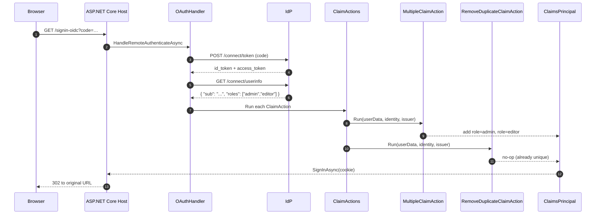

## A deliberately tiny package

`framework/src/Volo.Abp.AspNetCore.Authentication.OAuth/` is one of the smallest packages in ABP Framework. It contains exactly three real files: the module class and two `ClaimAction` subclasses. None of them configure the upstream `Microsoft.AspNetCore.Authentication.OAuth` handler itself; the package is shared infrastructure that the OpenID Connect package (and any other OAuth-style sub-module) builds on.

The full file list:

- `Volo/Abp/AspNetCore/Authentication/OAuth/AbpAspNetCoreAuthenticationOAuthModule.cs` — module class.
- `Volo/Abp/AspNetCore/Authentication/OAuth/Claims/MultipleClaimAction.cs` — extracts array-valued JSON claims.
- `Volo/Abp/AspNetCore/Authentication/OAuth/Claims/RemoveDuplicateClaimAction.cs` — removes duplicate claims of the same type.

This page covers what each one does and why ABP needs them.

## The module: `AbpAspNetCoreAuthenticationOAuthModule`

`Volo/Abp/AspNetCore/Authentication/OAuth/AbpAspNetCoreAuthenticationOAuthModule.cs` is a four-line module:

```csharp
[DependsOn(typeof(AbpSecurityModule))]
public class AbpAspNetCoreAuthenticationOAuthModule : AbpModule
{
}
```

There is no `ConfigureServices` override. The module exists to:

1. Declare a dependency on `AbpSecurityModule`, so any host that pulls in `Volo.Abp.AspNetCore.Authentication.OAuth` also gets the ABP security stack (claims principal factory, current user, current tenant accessors).
2. Provide an assembly the OpenID Connect package can `[DependsOn]` on, so that `MultipleClaimAction` and `RemoveDuplicateClaimAction` are guaranteed to be available before the OIDC module configures its claim actions.

The package does **not** call `services.AddAuthentication()` or `services.AddOAuth(...)`. Those calls belong to your host module — typically the application host that knows the IdP authority, client id, and scopes.

## Why the package exists at all

`Microsoft.AspNetCore.Authentication.OAuth` exposes the `ClaimAction` abstraction so the OAuth handler can map JSON properties from the user-info endpoint to `ClaimsIdentity` claims. The default actions handle scalar properties well but stumble on two real-world cases:

- A JWT or user-info response that returns an **array** for `role`, `permission`, `groups`, etc. The stock `JsonKeyClaimAction` reads the first element and ignores the rest.
- An identity provider that returns the **same** scalar claim twice — for example a user that is both a member of a group and that group's parent group, leading to two identical `role: "admin"` claims after mapping.

`Volo.Abp.AspNetCore.Authentication.OAuth` provides one targeted `ClaimAction` for each of those problems. Both classes derive from `Microsoft.AspNetCore.Authentication.OAuth.Claims.ClaimAction` so they slot into the existing `OAuthOptions.ClaimActions` collection.

## `MultipleClaimAction`: array-valued claims

`Volo/Abp/AspNetCore/Authentication/OAuth/Claims/MultipleClaimAction.cs`:

```csharp
public class MultipleClaimAction : ClaimAction
{
    public MultipleClaimAction(string claimType, string jsonKey)
        : base(claimType, jsonKey)
    {
    }

    public override void Run(JsonElement userData, ClaimsIdentity identity, string issuer)
    {
        JsonElement prop;

        if (!userData.TryGetProperty(ValueType, out prop))
            return;

        if (prop.ValueKind == JsonValueKind.Null)
        {
            return;
        }

        Claim claim;
        switch (prop.ValueKind)
        {
            case JsonValueKind.String:
                claim = new Claim(ClaimType, prop.GetString()!, ValueType, issuer);
                if (!identity.Claims.Any(c => c.Type == claim.Type && c.Value == claim.Value))
                {
                    identity.AddClaim(claim);
                }
                break;
            case JsonValueKind.Array:
                foreach (var arramItem in prop.EnumerateArray())
                {
                    claim = new Claim(ClaimType, arramItem.GetString()!, ValueType, issuer);
                    if (!identity.Claims.Any(c => c.Type == claim.Type && c.Value == claim.Value))
                    {
                        identity.AddClaim(claim);
                    }
                }
                break;
            default:
                throw new AbpException("Unhandled JsonValueKind: " + prop.ValueKind);
        }
    }
}
```

The `ClaimAction` base stores the parameters in `ClaimType` (target claim) and `ValueType` (JSON property name — yes, the field is curiously named). The override handles three shapes:

- **`null`** → no-op. Useful when the IdP returns the property but leaves it null for users without that data.
- **`string`** → single claim, skipped if already present.
- **`array`** → one claim per element, each skipped if duplicate.

Any other JSON kind (number, object, boolean) raises an `AbpException` rather than silently mis-mapping. This is intentional: an unexpected shape almost always means the IdP changed its contract, and failing loudly forces a fix instead of a silent regression.

### Registering it

In your host module, after `AddOAuth(...)` or `AddOpenIdConnect(...)`:

```csharp
context.Services.Configure<OpenIdConnectOptions>(options =>
{
    options.ClaimActions.Add(
        new MultipleClaimAction("role", "roles"));   // "roles" is the JSON property name in the userinfo
});
```

After this, an IdP response of `{"roles": ["admin","editor"]}` results in two `role` claims on the principal — exactly what `[Authorize(Roles = "admin")]` expects.

## `RemoveDuplicateClaimAction`: deduping after mapping

`Volo/Abp/AspNetCore/Authentication/OAuth/Claims/RemoveDuplicateClaimAction.cs`:

```csharp
public class RemoveDuplicateClaimAction : ClaimAction
{
    public RemoveDuplicateClaimAction(string claimType)
        : base(claimType, ClaimValueTypes.String)
    {
    }

    public override void Run(JsonElement userData, ClaimsIdentity identity, string issuer)
    {
        var claims = identity.Claims.Where(c => c.Type == ClaimType).ToArray();
        if (claims.Length < 2)
        {
            return;
        }

        var previousValues = new List<string>();
        foreach (var claim in claims)
        {
            if (claim.Value.IsIn(previousValues))
            {
                identity.RemoveClaim(claim);
            }
            else
            {
                previousValues.Add(claim.Value);
            }
        }
    }
}
```

This action is **post-processing**: it ignores `userData` entirely and operates on the `ClaimsIdentity` populated by earlier actions. The algorithm is order-preserving — the first occurrence wins, all subsequent duplicates are removed. The complexity is `O(n²)` in the number of claims of that type, which is fine because real principals have a handful of role/permission claims, not thousands.

Common usage:

```csharp
options.ClaimActions.Add(new MultipleClaimAction("role", "roles"));
options.ClaimActions.Add(new MultipleClaimAction("role", "extra_roles"));
options.ClaimActions.Add(new RemoveDuplicateClaimAction("role"));
```

Two `MultipleClaimAction`s read from two different JSON fields, both producing `role` claims, and the dedupe action runs last to collapse overlaps.

## How claim actions compose with the OAuth pipeline



The order of `ClaimActions` matters. Microsoft's `ClaimActionCollection` runs them in insertion order, and ABP's two actions are designed to be chained: `MultipleClaimAction` emits, `RemoveDuplicateClaimAction` cleans up. Reversing the order produces an empty result whenever both arrays overlap.

## Practical recipes

### IdentityServer-style `role` claims

IdentityServer issues `role` as a JSON array when more than one role is mapped, but as a scalar string when there is exactly one. The stock claim action mishandles the array case; `MultipleClaimAction` handles both transparently:

```csharp
options.ClaimActions.Remove("role");
options.ClaimActions.Add(new MultipleClaimAction("role", "role"));
```

### Removing the standard scopes from the principal

If your IdP returns the `scope` claim both as a space-separated string and as an array, and you only want the array form, add the multiple action and then a dedupe:

```csharp
options.ClaimActions.Add(new MultipleClaimAction("scope", "scope"));
options.ClaimActions.Add(new RemoveDuplicateClaimAction("scope"));
```

This collapses `["openid","profile","email","openid"]` into the three distinct values.

### Permissions

Permission claims (often custom, e.g. `permission`) are typically arrays. The standard `JsonKeyClaimAction` would pick up only the first; `MultipleClaimAction` is the safe default:

```csharp
options.ClaimActions.Add(new MultipleClaimAction("permission", "permissions"));
options.ClaimActions.Add(new RemoveDuplicateClaimAction("permission"));
```

The same `permission` claim type then drives `[Authorize(Policy = "permission")]` checks downstream.

## Interplay with `IAbpClaimsPrincipalFactory`

The two claim actions run during the **OAuth handler's** principal construction — before `IAbpClaimsPrincipalFactory.CreateAsync` is invoked by ABP middleware. That means the dynamic claims contributor system (see [JWT Bearer](/http/jwt-bearer) and [OpenID Connect](/http/openid-connect)) sees an already-flat principal with all the array-derived claims expanded. There is no double mapping: the OAuth handler produces the static claims, the factory adds the dynamic permissions, and the union is what reaches the application.

## What this package intentionally omits

A short list of things you might expect but won't find here:

- **No `AbpOAuthOptions`** — there is no per-package options class. The two helpers are stateless and applied per-`OAuthOptions` instance via `ClaimActions.Add(...)`.
- **No `IClaimsTransformation`** — the upstream `ClaimAction` mechanism is sufficient; ABP does not register a global transformation that would override it.
- **No `AbpOAuthEvents`** — the package does not touch `OAuthEvents`. Hosts wire `OnCreatingTicket` themselves when needed.
- **No automatic registration** — the actions are types, not services. You add them explicitly to the `OAuthOptions.ClaimActions` collection. This keeps behaviour explicit at the call site.

These omissions are the reason the package is so small: it adds *behaviour primitives* (two claim actions) rather than wrapping configuration that would obscure what Microsoft's pipeline is doing.

## Summary

`Volo.Abp.AspNetCore.Authentication.OAuth` is the joining point between ABP's identity stack and the upstream `Microsoft.AspNetCore.Authentication.OAuth` claim-action model. The module declares `AbpSecurityModule` as a dependency and ships two `ClaimAction` subclasses: `MultipleClaimAction` (expand JSON arrays into multiple claims, skipping duplicates) and `RemoveDuplicateClaimAction` (dedupe an existing claim type). Used together they let an ABP host correctly project IdP responses that contain array-valued or repeated claim values into a clean `ClaimsPrincipal` ready for `[Authorize]` and permission checks. The package itself imposes no host-side configuration — it is purely opt-in via `OAuthOptions.ClaimActions.Add(...)`.
