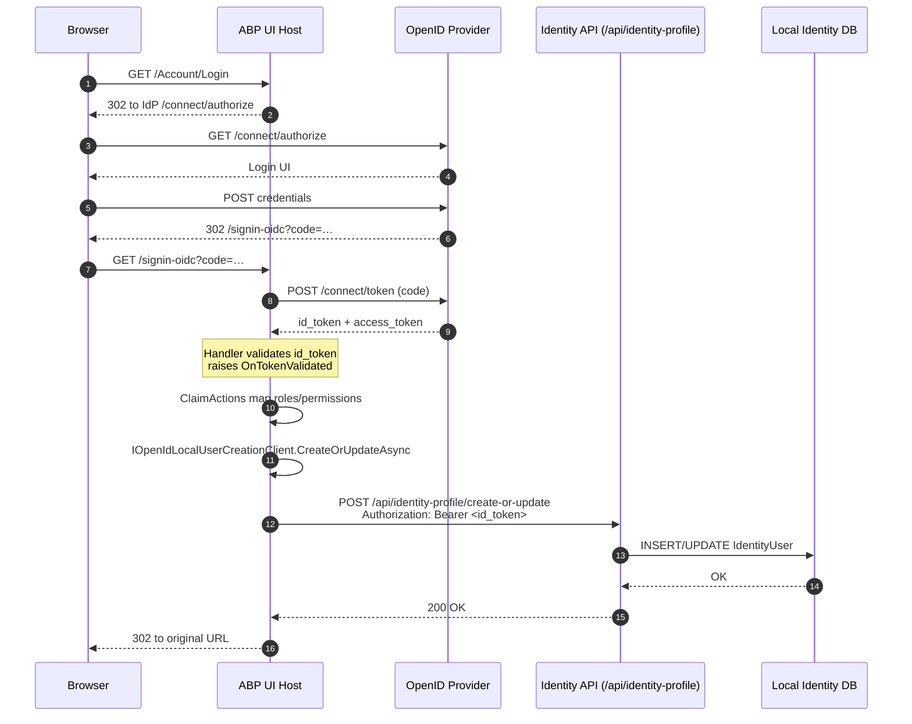

## What this package adds to OpenIdConnect

`framework/src/Volo.Abp.AspNetCore.Authentication.OpenIdConnect/` is the OIDC counterpart to the JwtBearer and OAuth packages. It shares the same philosophy: **do not** replace `Microsoft.AspNetCore.Authentication.OpenIdConnect`. Configure the handler in your host module the same way you always would, and let ABP plug in the small pieces it needs to make multi-tenancy, security headers, and local-user shadowing work.

The package contains five files:

- `Volo/Abp/AspNetCore/Authentication/OpenIdConnect/AbpAspNetCoreAuthenticationOpenIdConnectModule.cs` — module class.
- `IOpenIdLocalUserCreationClient.cs` — contract for posting a "create-or-update" request to a profile endpoint.
- `OpenIdLocalUserCreationClient.cs` — default implementation.
- `OpenIdLocalUserCreationClientOptions.cs` — options.

This page walks through what each piece does and how the package cooperates with the OAuth helpers and the JwtBearer dynamic claims contributor in a typical UI host.

## The module

`Volo/Abp/AspNetCore/Authentication/OpenIdConnect/AbpAspNetCoreAuthenticationOpenIdConnectModule.cs`:

```csharp
[DependsOn(
    typeof(AbpMultiTenancyModule),
    typeof(AbpAspNetCoreAuthenticationOAuthModule),
    typeof(AbpRemoteServicesModule)
    )]
public class AbpAspNetCoreAuthenticationOpenIdConnectModule : AbpModule
{
    public override void ConfigureServices(ServiceConfigurationContext context)
    {
        context.Services.AddHttpClient();

        Configure<AbpSecurityHeadersOptions>(options =>
        {
            options.IgnoredScriptNoncePaths.Add("/signout-oidc");
        });
    }
}
```

Three dependencies and two registrations:

- **`AbpMultiTenancyModule`** — required because the OIDC discovery URL, redirect URI, and claims often contain a tenant placeholder; the multi-tenancy stack must be wired so URL providers like `MultiTenantUrlProvider` can substitute the placeholder.
- **`AbpAspNetCoreAuthenticationOAuthModule`** — provides `MultipleClaimAction` / `RemoveDuplicateClaimAction` for handling array claims; see [OAuth](/http/oauth).
- **`AbpRemoteServicesModule`** — provides `IRemoteServiceConfigurationProvider`, which the local user creation client uses to discover the base URL of the identity API.

The two `ConfigureServices` calls:

- `services.AddHttpClient()` adds `IHttpClientFactory` so the local user creation client can use a named or default client.
- `AbpSecurityHeadersOptions.IgnoredScriptNoncePaths.Add("/signout-oidc")` adds an exemption for the signout endpoint. The ASP.NET Core OpenIdConnect handler embeds an inline form-post script in the signout-oidc page that cannot be nonce-tagged, so without this exemption the ABP security headers middleware would strip the script via CSP and break sign-out. Adding `/signout-oidc` to `IgnoredScriptNoncePaths` is the supported way to opt the path out of the strict nonce requirement.

## The local user creation client

When an ABP UI host (the MVC or Blazor application) authenticates via OIDC, the user exists in the **identity provider**'s database, not in the local application database. ABP needs a **local shadow** record for the user so that ABP-side concerns — auditing, tenant ownership of an entity, permissions cached against `UserId` — can refer to a stable Guid even though the user logs in through an external IdP.

`OpenIdLocalUserCreationClient` (`Volo/Abp/AspNetCore/Authentication/OpenIdConnect/OpenIdLocalUserCreationClient.cs`) makes that shadow record by POSTing to a `/api/identity-profile/create-or-update` endpoint on the identity API, carrying the OIDC `id_token` as a Bearer.

```csharp
public class OpenIdLocalUserCreationClient : IOpenIdLocalUserCreationClient, ITransientDependency
{
    protected OpenIdLocalUserCreationClientOptions Options { get; }
    protected IHttpClientFactory HttpClientFactory { get; }
    protected IRemoteServiceConfigurationProvider RemoteServiceConfigurationProvider { get; }
    ...

    public virtual async Task CreateOrUpdateAsync(TokenValidatedContext context)
    {
        if (!Options.IsEnabled)
        {
            return;
        }

        using (var httpClient = HttpClientFactory.CreateClient(Options.HttpClientName))
        {
            if (!Options.RemoteServiceName.IsNullOrWhiteSpace())
            {
                var configuration = await RemoteServiceConfigurationProvider
                    .GetConfigurationOrDefaultAsync(Options.RemoteServiceName);
                if (configuration.BaseUrl != null)
                {
                    httpClient.BaseAddress = new Uri(configuration.BaseUrl);
                }
            }

            httpClient.DefaultRequestHeaders.Add(
                HeaderNames.Authorization,
                "Bearer " + context.SecurityToken.RawData);

            var response = await httpClient.PostAsync(
                Options.Url,
                new StringContent(string.Empty));

            response.EnsureSuccessStatusCode();
        }
    }
}
```

The contract is the one-method interface `IOpenIdLocalUserCreationClient`:

```csharp
public interface IOpenIdLocalUserCreationClient
{
    Task CreateOrUpdateAsync(TokenValidatedContext tokenValidatedContext);
}
```

`TokenValidatedContext` comes from `Microsoft.AspNetCore.Authentication.OpenIdConnect`; the most useful field for ABP is `SecurityToken.RawData`, which is the JWT string the IdP issued. The client forwards that JWT as `Authorization: Bearer …` so the identity API can validate the same token and act on behalf of the user — typically pulling profile fields out of the ID token claims and inserting/updating an `IdentityUser` row.

### Options

`Volo/Abp/AspNetCore/Authentication/OpenIdConnect/OpenIdLocalUserCreationClientOptions.cs`:

```csharp
public class OpenIdLocalUserCreationClientOptions
{
    public bool IsEnabled { get; set; }

    public string RemoteServiceName { get; set; } = "AbpIdentity";

    public string Url { get; set; } = "/api/identity-profile/create-or-update";

    public string HttpClientName { get; } = Microsoft.Extensions.Options.Options.DefaultName;
}
```

Four knobs:

- **`IsEnabled`** — default `false`. You opt in from your host module. When false, the client is a no-op even if it is wired to `OnTokenValidated`.
- **`RemoteServiceName`** — the `AbpRemoteServiceOptions` entry that supplies the base URL. Defaults to `"AbpIdentity"`, falling back to `"Default"`. Set to an empty string if you want to use an absolute URL in `Url`.
- **`Url`** — the path to POST to. The default `/api/identity-profile/create-or-update` matches the ABP Identity module's route.
- **`HttpClientName`** — the named-client key passed to `IHttpClientFactory.CreateClient(name)`. Defaults to `Options.DefaultName`, i.e. the unnamed client; set this if you want a dedicated client with its own retry/timeout settings.

The fact that `HttpClientName` is a get-only property (`{ get; }`) is intentional: the field is initialised inline, and consumers configure other options without touching it. If you want a different name, derive from the options class.

## Wiring it into the OIDC handler

ABP does not automatically register an OIDC event handler. The connection point is `OpenIdConnectEvents.OnTokenValidated`, which you wire in your host module:

```csharp
context.Services.PreConfigure<OpenIdLocalUserCreationClientOptions>(options =>
{
    options.IsEnabled = true;
});

context.Services
    .AddAuthentication(options =>
    {
        options.DefaultScheme = "Cookies";
        options.DefaultChallengeScheme = "oidc";
    })
    .AddCookie("Cookies")
    .AddOpenIdConnect("oidc", options =>
    {
        options.Authority = configuration["AuthServer:Authority"];
        options.ClientId = configuration["AuthServer:ClientId"];
        options.ClientSecret = configuration["AuthServer:ClientSecret"];
        options.ResponseType = "code";
        options.SaveTokens = true;

        options.Scope.Add("MyApi");

        options.ClaimActions.Add(new MultipleClaimAction("role", "role"));
        options.ClaimActions.Add(new RemoveDuplicateClaimAction("role"));

        options.Events.OnTokenValidated = async ctx =>
        {
            var client = ctx.HttpContext.RequestServices
                .GetRequiredService<IOpenIdLocalUserCreationClient>();
            await client.CreateOrUpdateAsync(ctx);
        };
    });
```

Two ABP-specific patterns embedded in this snippet:

- `MultipleClaimAction` / `RemoveDuplicateClaimAction` (from [OAuth](/http/oauth)) handle array-valued claims emitted by the IdP.
- `OnTokenValidated` resolves `IOpenIdLocalUserCreationClient` from `RequestServices` and forwards the context. Because the client is transient, it lives only for the duration of this callback.

## End-to-end OIDC sign-in flow



The local user creation step lives between *token validation* and *cookie issuance*. By the time the browser sees the cookie, the local shadow record exists, so audit logs and entity ownership immediately point at a real local user id.

## Why this layout matters

A few design choices in this package have downstream consequences:

- **Resolution via remote service configuration** — `RemoteServiceConfigurationProvider.GetConfigurationOrDefaultAsync(Options.RemoteServiceName)` lets a multi-tenant deployment swap the profile API base URL per environment without code changes. The base URL is set on the `HttpClient` only if the remote service resolves a non-null `BaseUrl`, so an absolute `Url` (e.g. `"https://identity.example.com/api/identity-profile/create-or-update"`) still works when `RemoteServiceName` is left empty.
- **Forwarding the raw JWT** — the client never extracts an access token; it forwards the OIDC `id_token` (`SecurityToken.RawData`). This means the profile API must accept the same JWT shape the IdP issued — typically by registering the same `AuthServer:Authority` and audience as the UI host.
- **Empty-string POST body** — `new StringContent(string.Empty)` carries no payload. All the data the API needs is in the JWT claims; the endpoint reads `User.FindFirst("sub")` / `"email"` etc., not a body. This keeps the contract minimal and lets the IdP-side endpoint evolve without breaking the UI host.
- **`EnsureSuccessStatusCode()`** — any non-2xx response from the profile API throws, which bubbles up out of `OnTokenValidated` and aborts sign-in. That is the right behaviour: if we can't materialise a local user, the user shouldn't be authenticated at the application level either.

## Interplay with the JwtBearer dynamic claims contributor

When the **same** host also exposes APIs that accept JWT bearers (an MVC + minimal API "API host" or a Blazor Server app calling APIs over HTTP), it usually also installs `Volo.Abp.AspNetCore.Authentication.JwtBearer` and enables `WebRemoteDynamicClaimsPrincipalContributorOptions.IsEnabled = true` (see [JWT Bearer](/http/jwt-bearer)). The two packages cooperate cleanly:

- The OIDC handler creates the local user *during sign-in*.
- The JwtBearer contributor refreshes dynamic claims for that user *on every API call* (subject to the cache interval).

Because both packages depend on `AbpSecurityModule` and `AbpMultiTenancyModule` you get a single `ICurrentTenant` and a single `IAbpClaimsPrincipalFactory` regardless of which authentication scheme handled the request.

## CSP and the signout endpoint

The line `IgnoredScriptNoncePaths.Add("/signout-oidc")` in the module is the only globally-applied behavioural change. It is necessary because the OIDC handler renders a small `<form id="…" method="POST">` together with an inline `<script>document.getElementById('…').submit();</script>` to POST the front-channel logout to the IdP. The script is generated by ASP.NET Core itself and is not nonce-tagged. Without the exemption, ABP's strict CSP would block the script and the user would see a blank page after clicking "Sign out".

If you customise the OIDC sign-out path you should mirror the exemption:

```csharp
Configure<AbpSecurityHeadersOptions>(options =>
{
    options.IgnoredScriptNoncePaths.Add("/my-custom-signout-oidc");
});
```

## Customising or replacing the local user creation client

Because `IOpenIdLocalUserCreationClient` is a one-method interface and the default implementation is decorated with `ITransientDependency`, replacing it is a matter of declaring your own class with `[Dependency(ReplaceServices = true)]` and `[ExposeServices(typeof(IOpenIdLocalUserCreationClient))]`. For example, a host that wants to call a gRPC service instead of POSTing JSON:

```csharp
[Dependency(ReplaceServices = true)]
[ExposeServices(typeof(IOpenIdLocalUserCreationClient))]
public class GrpcOpenIdLocalUserCreationClient : IOpenIdLocalUserCreationClient, ITransientDependency
{
    public Task CreateOrUpdateAsync(TokenValidatedContext context) { ... }
}
```

The options class is small enough that you can re-use it as-is, or shadow it with your own bag if you need extra knobs.

## Summary

`Volo.Abp.AspNetCore.Authentication.OpenIdConnect` ships exactly two behavioural pieces beyond plain ASP.NET Core OIDC: a module that exempts the `/signout-oidc` path from script-nonce CSP, and a transient client that POSTs the OIDC `id_token` to an identity-profile endpoint to materialise a local user shadow. Together with the OAuth claim actions and the JwtBearer dynamic claims contributor, this completes ABP Framework's story for browser-based OIDC clients: array claims expand correctly, local IDs exist before the cookie is issued, and dynamic permissions stay fresh between sign-ins.
