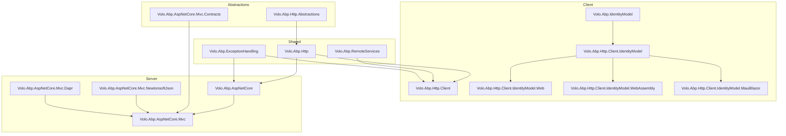

The ABP Framework HTTP subsystem is the bridge between application services written as plain C# interfaces and the wire — both as a server that exposes those interfaces as REST endpoints, and as a client that calls them as if they were local objects. It is split across roughly a dozen NuGet packages that live under `framework/src/Volo.Abp.Http*`, `framework/src/Volo.Abp.RemoteServices/`, `framework/src/Volo.Abp.IdentityModel/`, and `framework/src/Volo.Abp.AspNetCore*`. This page is the entry-point that ties them together; the rest of the section unpacks each package.

## Two halves of one pipeline

ABP draws a clean line between the **contract layer** (interfaces, DTOs, error models) and the **transport layer** (HTTP clients, controllers, formatters). The contract layer lives in `Volo.Abp.Http.Abstractions` (`framework/src/Volo.Abp.Http.Abstractions/Volo/Abp/Http/AbpHttpAbstractionsModule.cs`) and `Volo.Abp.AspNetCore.Mvc.Contracts` (`framework/src/Volo.Abp.AspNetCore.Mvc.Contracts/Volo/Abp/AspNetCore/Mvc/AbpAspNetCoreMvcContractsModule.cs`); both are deliberately tiny modules so that client and server can share them without dragging in ASP.NET Core. The transport layer adds `Volo.Abp.Http` (`framework/src/Volo.Abp.Http/Volo/Abp/Http/AbpHttpModule.cs`) on top of the abstractions, then branches into a client-side stack (`Volo.Abp.Http.Client`, `Volo.Abp.RemoteServices`, `Volo.Abp.IdentityModel`) and a server-side stack (`Volo.Abp.AspNetCore`, `Volo.Abp.AspNetCore.Mvc`).

The same interface — for example `IIdentityUserAppService` — is consumed locally inside the host through ASP.NET Core controllers generated by `AbpServiceConvention` (`framework/src/Volo.Abp.AspNetCore.Mvc/Volo/Abp/AspNetCore/Mvc/Conventions/AbpServiceConvention.cs`) and is consumed remotely from a separate process through a Castle `DynamicHttpProxyInterceptor<TService>` (`framework/src/Volo.Abp.Http.Client/Volo/Abp/Http/Client/DynamicProxying/DynamicHttpProxyInterceptor.cs`). The two paths share the same `RemoteServiceErrorInfo` envelope (`framework/src/Volo.Abp.ExceptionHandling/Volo/Abp/Http/RemoteServiceErrorInfo.cs`) so that errors look identical to callers regardless of which one is in use.

## Package map

<CardGroup cols={2}>
  <Card title="Volo.Abp.Http.Abstractions" icon="cube">
    `AbpHttpAbstractionsModule`, `ClientProxyExceptionEventData`, and `AbpApiDescriptionModelOptions` — shared types with zero ASP.NET Core dependency.
  </Card>
  <Card title="Volo.Abp.Http" icon="cube">
    `AbpHttpModule`, `AbpHttpConsts`, `HttpMethodHelper`, the `Modeling` namespace, and jQuery proxy script generation.
  </Card>
  <Card title="Volo.Abp.Http.Client" icon="arrow-right-from-bracket">
    Dynamic client proxies, `IProxyHttpClientFactory`, `ApiDescriptionFinder`, `AbpHttpClientOptions`, and the `AddHttpClientProxies` DI extensions.
  </Card>
  <Card title="Volo.Abp.RemoteServices" icon="globe">
    `RemoteServiceConfiguration`, `RemoteServiceConfigurationDictionary`, `IRemoteServiceConfigurationProvider`, and the `AbpRemoteServiceOptions` root.
  </Card>
  <Card title="Volo.Abp.IdentityModel" icon="key">
    `IIdentityModelAuthenticationService`, `IdentityClientConfiguration`, token caching, and discovery document caching.
  </Card>
  <Card title="Volo.Abp.Http.Client.IdentityModel" icon="lock">
    Bearer-token authenticators for Web, WebAssembly, and MAUI Blazor hosts that plug into `IRemoteServiceHttpClientAuthenticator`.
  </Card>
  <Card title="Volo.Abp.AspNetCore" icon="server">
    `AbpAspNetCoreModule`, the middleware pipeline (`UseAbpExceptionHandling`, `UseAbpRequestLocalization`, `UseAbpSecurityHeaders`), and HTTP context plumbing.
  </Card>
  <Card title="Volo.Abp.AspNetCore.Mvc" icon="server">
    `AbpAspNetCoreMvcModule`, conventional controllers, API exploring, anti-forgery, JSON formatters, and the `/api/abp/api-definition` endpoint.
  </Card>
</CardGroup>

The dependency direction is strictly one-way: `Volo.Abp.AspNetCore.Mvc.csproj` depends on `Volo.Abp.AspNetCore.csproj`, which depends on `Volo.Abp.Http.csproj`, which depends on `Volo.Abp.Http.Abstractions.csproj`. `Volo.Abp.Http.Client.csproj` also depends on `Volo.Abp.Http.csproj` and on `Volo.Abp.RemoteServices.csproj`; the IdentityModel client packages sit at the top of the client side. The MVC layer never imports the client stack, and the client stack never imports MVC — that is what allows a Blazor WebAssembly head to call into a backend without dragging the entire MVC pipeline into the browser.

## Lifecycle of a remote service call

A canonical end-to-end call from a client process to a server process flows through six clearly-named components, all of which have their own deep-dive page later in this section.

```mermaid
sequenceDiagram
    participant App as Caller code
    participant Proxy as DynamicProxy<br/>(Castle interceptor)
    participant Interceptor as DynamicHttpProxyInterceptor&lt;TService&gt;
    participant Finder as ApiDescriptionFinder
    participant Auth as IRemoteServiceHttpClientAuthenticator
    participant HttpClient as HttpClient<br/>(named via IProxyHttpClientFactory)
    participant Mvc as ASP.NET Core MVC pipeline
    participant Service as ApplicationService

    App->>Proxy: userAppService.GetAsync(id)
    Proxy->>Interceptor: InterceptAsync(invocation)
    Interceptor->>Finder: FindActionAsync(serviceType, method)
    Finder-->>Interceptor: ActionApiDescriptionModel
    Interceptor->>Auth: Authenticate(context)
    Auth-->>HttpClient: sets Authorization header
    Interceptor->>HttpClient: SendAsync(HttpRequestMessage)
    HttpClient->>Mvc: HTTPS request to /api/identity/users/{id}
    Mvc->>Service: GetAsync(id) via conventional controller
    Service-->>Mvc: UserDto
    Mvc-->>HttpClient: 200 OK + JSON
    HttpClient-->>Interceptor: HttpResponseMessage
    Interceptor-->>Proxy: deserialized UserDto
    Proxy-->>App: UserDto
```

Each arrow corresponds to a real file you can open. The proxy generation step uses `ProxyGeneratorInstance.CreateInterfaceProxyWithoutTarget` inside `ServiceCollectionHttpClientProxyExtensions.AddHttpClientProxy` (`framework/src/Volo.Abp.Http.Client/Microsoft/Extensions/DependencyInjection/ServiceCollectionHttpClientProxyExtensions.cs`). The `ActionApiDescriptionModel` is loaded by `ApiDescriptionFinder.GetApiDescriptionAsync` (`framework/src/Volo.Abp.Http.Client/Volo/Abp/Http/Client/DynamicProxying/ApiDescriptionFinder.cs`), which calls the server's `/api/abp/api-definition` endpoint hosted by `AbpApiDefinitionController` (`framework/src/Volo.Abp.AspNetCore.Mvc/Volo/Abp/AspNetCore/Mvc/ApiExploring/AbpApiDefinitionController.cs`). Token acquisition is delegated to `IIdentityModelAuthenticationService` (`framework/src/Volo.Abp.IdentityModel/Volo/Abp/IdentityModel/IIdentityModelAuthenticationService.cs`) when the IdentityModel package is registered.

## Where errors come from

ABP rewrites every server-side exception into a `RemoteServiceErrorResponse` JSON body (`framework/src/Volo.Abp.ExceptionHandling/Volo/Abp/Http/RemoteServiceErrorResponse.cs`) carrying a `RemoteServiceErrorInfo` (`framework/src/Volo.Abp.ExceptionHandling/Volo/Abp/Http/RemoteServiceErrorInfo.cs`) with optional `RemoteServiceValidationErrorInfo[]` (`framework/src/Volo.Abp.ExceptionHandling/Volo/Abp/Http/RemoteServiceValidationErrorInfo.cs`). The wrapping happens in two places depending on whether MVC has matched a route yet: `AbpExceptionFilter.HandleAndWrapException` (`framework/src/Volo.Abp.AspNetCore.Mvc/Volo/Abp/AspNetCore/Mvc/ExceptionHandling/AbpExceptionFilter.cs`) runs for controller actions that return objects, and `AbpExceptionHandlingMiddleware.HandleAndWrapException` (`framework/src/Volo.Abp.AspNetCore/Volo/Abp/AspNetCore/ExceptionHandling/AbpExceptionHandlingMiddleware.cs`) handles the rest of the pipeline. Both stamp the response with the `AbpHttpConsts.AbpErrorFormat` marker header (`framework/src/Volo.Abp.Http/Volo/Abp/Http/AbpHttpConsts.cs`) so that ABP clients can detect a wrapped response and re-throw `AbpRemoteCallException` (`framework/src/Volo.Abp.ExceptionHandling/Volo/Abp/Http/Client/AbpRemoteCallException.cs`).

The deep dives are organised so each page is the canonical reference for the symbols it owns:

<CardGroup cols={2}>
  <Card title="Volo Abp Http" href="/http/volo-abp-http">
    The abstractions, the modeling DTOs, and the shared error envelope.
  </Card>
  <Card title="HTTP Client" href="/http/http-client">
    `AbpHttpClientModule`, dynamic proxy registration, `IProxyHttpClientFactory`.
  </Card>
  <Card title="IdentityModel Client" href="/http/identity-model-client">
    Token acquisition, caching, and per-host access token providers.
  </Card>
  <Card title="Remote Services" href="/http/remote-services">
    `RemoteServiceConfiguration` and how named services resolve.
  </Card>
  <Card title="AspNetCore Core" href="/http/aspnetcore-core">
    Middleware pipeline, request localization, security headers, exception handling.
  </Card>
  <Card title="AspNetCore MVC" href="/http/aspnetcore-mvc">
    Tour of every `Volo.Abp.AspNetCore.Mvc` subfolder.
  </Card>
  <Card title="MVC Contracts" href="/http/mvc-contracts">
    `AbpAspNetCoreMvcContractsModule` and the DTOs shared with clients.
  </Card>
  <Card title="Conventions" href="/http/mvc-conventions">
    `AbpServiceConvention` and the auto-controller machinery.
  </Card>
  <Card title="API Exploring" href="/http/mvc-api-exploring">
    `AbpApiDefinitionController`, `AbpRemoteServiceApiDescriptionProvider`, model providers.
  </Card>
</CardGroup>

## Subsystem map



This shape — a small abstractions layer, two transport rings, and per-host adapters — is what gives ABP its trademark "write the interface once, deploy anywhere" feel. The chapters that follow walk each ring in turn.

## When to read what

If you are wiring a Blazor WebAssembly client to a remote ABP backend, the path is **Remote Services → HTTP Client → IdentityModel Client**. If you are writing a microservice host, the path is **AspNetCore Core → AspNetCore MVC → Conventions → API Exploring → MVC Contracts**. The **Volo Abp Http** page underpins both — it documents the wire-level error format and modeling DTOs that the rest of the chain reads from and writes to.

<Tip>
The `/api/abp/api-definition` endpoint exposed by `AbpApiDefinitionController` is the single source of truth that turns interfaces into URLs. Whenever you debug a 404 from a dynamic proxy, hit that endpoint on the server and inspect the returned `ApplicationApiDescriptionModel` — it tells you exactly which controllers and actions the server believes it has.
</Tip>

## Cross-cutting types worth knowing

A handful of files appear throughout this section because they cross subsystem boundaries. Bookmark them now so the deep dives feel less novel.

- `ApplicationApiDescriptionModel` (`framework/src/Volo.Abp.Http/Volo/Abp/Http/Modeling/ApplicationApiDescriptionModel.cs`) — the root document for `/api/abp/api-definition`. The `Modules` dictionary keys controllers by `RootPath`, and `Types` is a `SortedDictionary` keyed by full type name so client cache keys remain stable.
- `ActionApiDescriptionModel` (`framework/src/Volo.Abp.Http/Volo/Abp/Http/Modeling/ActionApiDescriptionModel.cs`) — describes a single action with `UniqueName`, `Name`, `HttpMethod`, `Url`, `SupportedVersions`, `ParametersOnMethod`, `Parameters`, `ReturnValue`, `AllowAnonymous`, `AuthorizeDatas`, `ImplementFrom`, `Summary`, `Remarks`, and `Description`. Both `DynamicHttpProxyInterceptor` on the client and `AbpApiDefinitionController` on the server materialise this exact shape.
- `RemoteServiceConfiguration` (`framework/src/Volo.Abp.RemoteServices/Volo/Abp/Http/Client/RemoteServiceConfiguration.cs`) — the `Dictionary<string, string?>` bag that the IdentityModel client, the Dapr client, and any custom integration extend through extension methods.
- `RemoteServiceErrorInfo` and `RemoteServiceErrorResponse` (`framework/src/Volo.Abp.ExceptionHandling/Volo/Abp/Http/`) — the wire-level error envelope discussed in detail on the [Volo Abp Http](/http/volo-abp-http) page.
- `AbpHttpConsts.AbpErrorFormat` (`framework/src/Volo.Abp.Http/Volo/Abp/Http/AbpHttpConsts.cs`) — the response header that marks an ABP-wrapped error so clients can re-throw it correctly.

## Companion transports

The dynamic HTTP client is the canonical transport but not the only one. Two companion packages reuse the same abstractions:

- **`Volo.Abp.Http.Client.Dapr`** (`framework/src/Volo.Abp.Http.Client.Dapr/`) replaces `DefaultProxyHttpClientFactory` with a Dapr-aware factory that points the named `HttpClient` at the local Dapr sidecar (`http://localhost:3500/v1.0/invoke/{app-id}/method/...`). `RemoteServiceConfiguration.BaseUrl` becomes the Dapr app id rather than a full URL.
- **`Volo.Abp.AspNetCore.Mvc.Dapr`** and **`Volo.Abp.AspNetCore.Mvc.Dapr.EventBus`** add the server-side counterpart: a token validator (`DaprAppApiTokenValidator`) that checks the `dapr-api-token` header, and an integration that exposes pub/sub event subscribers as MVC endpoints.

Both transports treat `IRemoteServiceConfigurationProvider`, `IApiDescriptionFinder`, and `RemoteServiceErrorResponse` as black boxes — the contracts in this subsystem are stable enough to host transports that the original authors never planned for.

## Reading paths

Three reading paths through this section make sense depending on what you are trying to do.

**Implementing a microservice host** — start with [AspNetCore Core](/http/aspnetcore-core) to understand the middleware pipeline, then [AspNetCore MVC](/http/aspnetcore-mvc) for the filter/formatter machinery, then [Conventions](/http/mvc-conventions) for the auto-controller setup, then [API Exploring](/http/mvc-api-exploring) so clients can discover your endpoints, and finally [MVC Contracts](/http/mvc-contracts) for the shape of the bootstrap response.

**Implementing a Blazor or MAUI client** — start with [Remote Services](/http/remote-services) for the configuration shape, then [HTTP Client](/http/http-client) for the dynamic proxy mechanism, then [IdentityModel Client](/http/identity-model-client) for authentication, and finally [Volo Abp Http](/http/volo-abp-http) to understand how errors come back.

**Writing a new ABP module** — read [Volo Abp Http](/http/volo-abp-http) first to absorb the wire contracts, then [MVC Contracts](/http/mvc-contracts) to see how to structure your DTO assembly, then [Conventions](/http/mvc-conventions) to register your application services as controllers, and finally [API Exploring](/http/mvc-api-exploring) if your module exposes custom response types.

## What each chapter does not cover

To set expectations clearly, here is what is intentionally **out of scope** for each page:

- **Volo Abp Http** does not explain MVC filter ordering or middleware composition — those live in the ASP.NET Core pages. It also does not explain proxy generation for static client proxies; that is the HTTP Client page.
- **HTTP Client** does not explain how to write a custom transport (Dapr, gRPC). Those live in their own packages (`Volo.Abp.Http.Client.Dapr`) and are touched on here only as integration points.
- **IdentityModel Client** does not document OpenID Connect itself; it documents how ABP integrates with the Duende IdentityModel library to fetch tokens. The OIDC details belong to the upstream library's docs.
- **Remote Services** does not document multi-tenancy resolution rules; it documents the configuration shape and how the provider clones it. The multi-tenancy chapter in `Volo.Abp.MultiTenancy` covers the resolution algorithm.
- **AspNetCore Core** does not document Razor view rendering, view component conventions, or MVC's own infrastructure — only the pieces ABP integrates with through `IApplicationBuilder` extensions.
- **AspNetCore MVC** is a folder tour, not a tutorial. It points at every subfolder and names every important file but defers depth to the specialised pages.
- **MVC Contracts** does not document the application services themselves; it documents the DTOs they exchange. The implementation pages live in their respective modules' docs.
- **Conventions** does not document MVC's `IApplicationModelConvention` interface in general; it documents ABP's `AbpServiceConvention` specifically and how it transforms application services.
- **API Exploring** does not document OpenAPI/Swagger UI configuration; it documents the providers that augment what those tools see.

## Versioning policy across the subsystem

The HTTP subsystem is one of the most stable parts of ABP — `RemoteServiceErrorInfo` has been on the wire since the framework's earliest versions, and the `ApplicationApiDescriptionModel` shape has only ever gained fields. The maintainers commit to:

- **Additive DTO changes only.** New properties may appear, never removed, never re-typed.
- **Stable header names.** `AbpHttpConsts.AbpErrorFormat` and `AbpHttpConsts.AbpTenantResolveError` are public constants and will not be renamed.
- **Stable URL conventions.** `ConventionalRouteBuilder.Build` may add new optional segments, but existing URLs continue to resolve.
- **Stable extension points.** `IRemoteServiceConfigurationProvider`, `IApiDescriptionFinder`, `IRemoteServiceHttpClientAuthenticator`, and `IExceptionToErrorInfoConverter` are public interfaces and may not be broken between minor versions.

When breaking changes do happen, they go through the standard ABP deprecation process: marked `[Obsolete]` in one minor version, replaced in the next, removed in the major after that. The two existing `Obsolete` markers in the codebase — `UseAbpClaimsMap` in `AbpApplicationBuilderExtensions` and a handful of older DTOs — illustrate the pattern.

## Diagnostics cheat sheet

When something goes wrong, the chapters below have specific tips, but a few general patterns apply to the whole subsystem:

| Symptom | Likely cause | First file to read |
|---------|-------------|-------------------|
| 404 from a dynamic proxy call | URL mismatch between client and server | `ApplicationApiDescriptionModel` from `/api/abp/api-definition` |
| Wrong base URL after tenant switch | `IMultiTenantUrlProvider` substitution off | `RemoteServiceConfigurationProvider.GetMultiTenantConfigurationAsync` |
| Token missing on outbound request | Authenticator not registered | `IRemoteServiceHttpClientAuthenticator` resolution |
| Response body is HTML, not JSON | Error reached middleware, not filter | `AbpExceptionHandlingMiddleware.HandleAndWrapException` |
| OpenAPI shows wrong response types | API description providers not running | `AbpRemoteServiceApiDescriptionProvider.OnProvidersExecuting` |
| Validation errors as 500, not 400 | Status code map missing entry | `AbpExceptionHttpStatusCodeOptions.Map` |
| URL has CamelCase, expected kebab | `UseV3UrlStyle = true` somewhere | `ConventionalControllerSetting.UseV3UrlStyle` |

Each row is the entry point for a deeper investigation; the chapter the file belongs to has the full diagnostic flow.

## A worked end-to-end example

To make the moving parts concrete, here is a single hypothetical call traced through every file referenced above. A Blazor WebAssembly client calls `userAppService.UpdateAsync(userId, dto)` against an ABP backend running on `https://api.example.com`.

1. **Client startup** — `AddHttpClientProxies(typeof(IdentityApplicationContractsModule).Assembly, "Identity")` runs in `Program.cs`. `ServiceCollectionHttpClientProxyExtensions` registers an `HttpClient` named `"Identity"`, populates `AbpHttpClientOptions.HttpClientProxies[typeof(IIdentityUserAppService)]`, registers `DynamicHttpProxyInterceptor<IIdentityUserAppService>`, and binds the interface to a Castle proxy.
2. **Configuration lookup** — `RemoteServiceConfigurationProvider.GetConfigurationOrDefaultAsync("Identity")` returns `{ BaseUrl = "https://api.example.com/", IdentityClient = "Default" }` from `AbpRemoteServiceOptions`.
3. **First call** — Castle dispatches the method through `ValidationInterceptor` and then `DynamicHttpProxyInterceptor<IIdentityUserAppService>.InterceptAsync`.
4. **API description discovery** — `ApiDescriptionFinder.GetApiDescriptionAsync` issues `GET https://api.example.com/api/abp/api-definition`. The server's `AbpApiDefinitionController` calls `AspNetCoreApiDescriptionModelProvider.CreateApiModelAsync`. The response is cached in `IApiDescriptionCache` keyed by the base URL.
5. **Action match** — `FindActionAsync` walks the modules and finds the `Identity` module, the `User` controller, and the `Update` action. The returned `ActionApiDescriptionModel` carries `Url = "api/identity/users/{id}"`, `HttpMethod = "PUT"`.
6. **Token acquisition** — `IRemoteServiceHttpClientAuthenticator.Authenticate` resolves to `WebAssemblyAccessTokenProviderIdentityModelRemoteServiceHttpClientAuthenticator`, which calls `WebAssemblyAbpAccessTokenProvider.GetTokenAsync` to read the cached OIDC access token from Blazor's `IAccessTokenProvider`.
7. **URL build** — `ClientProxyUrlBuilder` substitutes `{id}` with the user's GUID and produces `https://api.example.com/api/identity/users/<guid>`.
8. **Payload build** — `ClientProxyRequestPayloadBuilder` serialises `dto` to JSON, recognises that `dto.ExtraProperties` is an `ExtraPropertyDictionary`, and applies the registered converter to round-trip extra fields.
9. **HTTP send** — `HttpClient.SendAsync(HttpRequestMessage)` issues the PUT request with `Authorization: Bearer <jwt>`, `X-Correlation-Id: <guid>`, and the JSON body.
10. **Server pipeline** — the request hits the host running `AbpAspNetCoreModule`. `UseAbpExceptionHandling`, `UseRouting`, `UseAuthentication`, `UseAbpClaimsMap`, `UseAuthorization`, `UseAuditing`, `UseUnitOfWork`, and finally `MapControllers` are composed in `Program.cs`.
11. **Routing** — MVC matches the route to `IdentityUserController.UpdateAsync(Guid id, IdentityUserUpdateDto dto)`. The controller exists because `AbpServiceConvention.Apply` ran at startup and turned `IIdentityUserAppService` into a controller.
12. **Filters** — `AbpAutoValidateAntiforgeryTokenAuthorizationFilter` skips (no XSRF for non-cookie auth), `AbpUowActionFilter` opens a transactional unit-of-work, `AbpFeatureActionFilter` checks `[RequiresFeature]`, `AbpValidationActionFilter` validates the DTO via `IModelStateValidator`.
13. **Action body** — the application service runs; on success, `AbpUowActionFilter.OnActionExecutionAsync` calls `uow.CompleteAsync` to commit the database transaction.
14. **Response** — the controller returns the updated DTO; MVC serialises it via System.Text.Json; ABP's content type provider stamps `Content-Type: application/json; charset=utf-8`.
15. **Client receives** — `DynamicHttpProxyInterceptorClientProxy<T>.RequestAsync<UserDto>` deserialises the body; because the response has no `AbpHttpConsts.AbpErrorFormat` header, the value is returned as-is.
16. **Result** — `invocation.ReturnValue = userDto`; Castle unwinds; the Blazor component continues with the updated user.

Sixteen steps, each grounded in a real file. The deep dives that follow zoom into each of those files one at a time.

## Closing note

The HTTP subsystem is intentionally factored so that each package is small enough to be entirely understood by a single person in a single sitting. The reward for that factoring is composability: you can swap the transport (Dapr), the serializer (Newtonsoft), the authenticator (DPoP), or the URL convention (V3 style) without rewriting the surrounding code. Reading the deep-dive pages in order — Overview → Volo Abp Http → Remote Services → HTTP Client → IdentityModel Client → AspNetCore Core → AspNetCore MVC → MVC Contracts → Conventions → API Exploring — gives you the complete picture from wire format to deployment knob.

## Cheat sheet of key files

If you only memorise twelve file paths from this whole section, make it these:

| Concern | File |
|---------|------|
| Wire error shape | `framework/src/Volo.Abp.ExceptionHandling/Volo/Abp/Http/RemoteServiceErrorInfo.cs` |
| Wire error envelope | `framework/src/Volo.Abp.ExceptionHandling/Volo/Abp/Http/RemoteServiceErrorResponse.cs` |
| Wrap marker header | `framework/src/Volo.Abp.Http/Volo/Abp/Http/AbpHttpConsts.cs` |
| Method-to-verb convention | `framework/src/Volo.Abp.Http/Volo/Abp/Http/HttpMethodHelper.cs` |
| API description root | `framework/src/Volo.Abp.Http/Volo/Abp/Http/Modeling/ApplicationApiDescriptionModel.cs` |
| Server publishes API definition | `framework/src/Volo.Abp.AspNetCore.Mvc/Volo/Abp/AspNetCore/Mvc/ApiExploring/AbpApiDefinitionController.cs` |
| Client consumes API definition | `framework/src/Volo.Abp.Http.Client/Volo/Abp/Http/Client/DynamicProxying/ApiDescriptionFinder.cs` |
| Dynamic proxy entry point | `framework/src/Volo.Abp.Http.Client/Microsoft/Extensions/DependencyInjection/ServiceCollectionHttpClientProxyExtensions.cs` |
| Per-tenant base URL resolution | `framework/src/Volo.Abp.RemoteServices/Volo/Abp/Http/Client/RemoteServiceConfigurationProvider.cs` |
| Auto controller convention | `framework/src/Volo.Abp.AspNetCore.Mvc/Volo/Abp/AspNetCore/Mvc/Conventions/AbpServiceConvention.cs` |
| URL pattern from method name | `framework/src/Volo.Abp.AspNetCore.Mvc/Volo/Abp/AspNetCore/Mvc/Conventions/ConventionalRouteBuilder.cs` |
| Server-side exception wrapping | `framework/src/Volo.Abp.AspNetCore/Volo/Abp/AspNetCore/ExceptionHandling/AbpExceptionHandlingMiddleware.cs` |

Almost every question about the HTTP layer can be answered by reading the right combination of two or three files from this list.

## What we left out

There are corners of the HTTP layer that this group of pages does not cover in depth, either because they belong to other subsystems or because they are platform-specific:

- **SignalR integration** — `Volo.Abp.AspNetCore.SignalR` and `Volo.Abp.AspNetCore.Mvc.Client.Common` add hub-level concerns (claim mapping, multi-tenancy resolution) that follow the same patterns shown here but use SignalR's protocol rather than HTTP. Their integration points live in different packages.
- **gRPC** — ABP does not ship a first-party gRPC client. Several community modules layer the same `RemoteServiceConfiguration` shape onto a gRPC transport, reusing `IRemoteServiceConfigurationProvider` for endpoint discovery.
- **Server-Sent Events** — not directly supported in the framework; applications that need SSE generally do so through ASP.NET Core's built-in support and reuse only the request-pipeline middleware from `Volo.Abp.AspNetCore`.
- **Background HTTP jobs** — `Volo.Abp.BackgroundJobs` schedules work that may issue HTTP calls, but the calls themselves still go through the same `DynamicHttpProxyInterceptor` stack documented here. The job system is documented separately.

Where these subsystems intersect with the HTTP layer, the integration is always through one of the public extension points — `IRemoteServiceConfigurationProvider`, `IProxyHttpClientFactory`, `IRemoteServiceHttpClientAuthenticator`, `IExceptionToErrorInfoConverter`. Those four interfaces are the seams along which the framework can be extended without changing the core HTTP packages.

## Where to go next

Pick the chapter that matches your current task:

- Designing the wire contract for a new module? Start with [Volo Abp Http](/http/volo-abp-http) and [MVC Contracts](/http/mvc-contracts).
- Adding a remote-call client to an existing app? Read [Remote Services](/http/remote-services) and [HTTP Client](/http/http-client).
- Adding authentication to that client? Read [IdentityModel Client](/http/identity-model-client) next.
- Hosting a microservice? Walk [AspNetCore Core](/http/aspnetcore-core), [AspNetCore MVC](/http/aspnetcore-mvc), and [Conventions](/http/mvc-conventions) in order.
- Generating OpenAPI specs or client SDKs? Finish with [API Exploring](/http/mvc-api-exploring).

