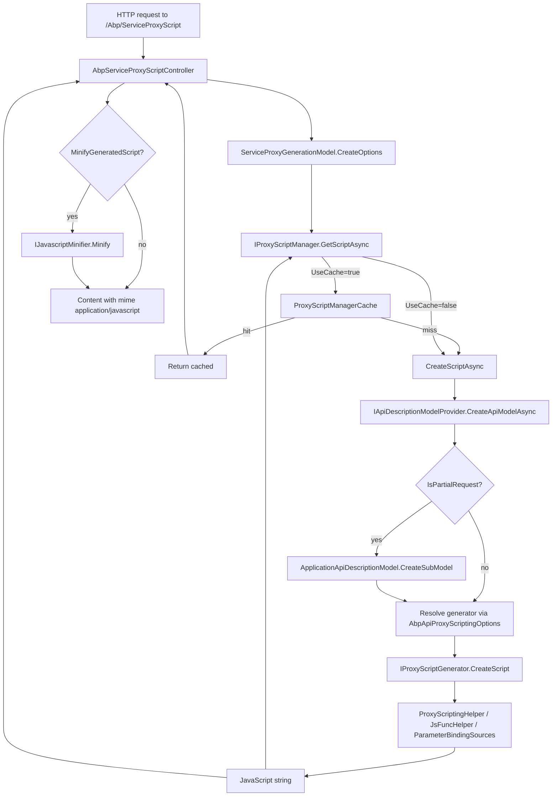

## What "proxy scripting" means

Proxy scripting is the ABP Framework subsystem that converts the runtime `ApplicationApiDescriptionModel` — the same JSON tree exposed at `/api/abp/api-definition` — into a JavaScript file that calls those endpoints. Its code lives under `framework/src/Volo.Abp.Http/Volo/Abp/Http/ProxyScripting/`. The dynamic MVC endpoint, the CLI offline generator, and any custom generator you write all rely on the same five moving parts:

- `IProxyScriptManager` and `ProxyScriptManager` (orchestrator)
- `IProxyScriptManagerCache` and `ProxyScriptManagerCache` (per-request caching)
- `IProxyScriptGenerator` (the contract every generator implements)
- `AbpApiProxyScriptingOptions` (generator registry)
- A set of helpers (`ProxyScriptingHelper`, `ProxyScriptingJsFuncHelper`, `ParameterBindingSources`)

This page walks the runtime path; companion pages [JS Proxies](/http/dynamic-js-client-proxies) and [C# Proxies](/http/dynamic-c-sharp-client-proxies) describe the consumer side.

## The orchestrator: `ProxyScriptManager`

`Volo/Abp/Http/ProxyScripting/ProxyScriptManager.cs` is registered as `ITransientDependency` and implements `IProxyScriptManager`:

```csharp
public interface IProxyScriptManager
{
    Task<string> GetScriptAsync(ProxyScriptingModel scriptingModel);
}
```

The implementation depends on four collaborators:

| Dependency | Purpose |
| --- | --- |
| `IApiDescriptionModelProvider` | Builds the live `ApplicationApiDescriptionModel` from the running MVC application |
| `IServiceProvider` | Used to resolve the chosen generator inside a fresh DI scope |
| `IJsonSerializer` | Computes the cache key by serialising the request model |
| `IProxyScriptManagerCache` | In-memory cache of fully-rendered scripts |

`GetScriptAsync` short-circuits to the cache when `ProxyScriptingModel.UseCache` is `true`:

```csharp
var cacheKey = CreateCacheKey(scriptingModel);

if (scriptingModel.UseCache)
{
    return await _cache.GetOrAddAsync(cacheKey, () => CreateScriptAsync(scriptingModel));
}

return await CreateScriptAsync(scriptingModel);
```

On a cache miss `CreateScriptAsync` does three things:

```csharp
var apiModel = await _modelProvider.CreateApiModelAsync(
    new ApplicationApiDescriptionModelRequestDto { IncludeTypes = false });

if (scriptingModel.IsPartialRequest())
{
    apiModel = apiModel.CreateSubModel(
        scriptingModel.Modules,
        scriptingModel.Controllers,
        scriptingModel.Actions);
}

var generatorType = _options.Generators.GetOrDefault(scriptingModel.GeneratorType);
if (generatorType == null)
{
    throw new AbpException(
        $"Could not find a proxy script generator with given name: {scriptingModel.GeneratorType}");
}

using (var scope = _serviceProvider.CreateScope())
{
    return scope.ServiceProvider
        .GetRequiredService(generatorType)
        .As<IProxyScriptGenerator>()
        .CreateScript(apiModel);
}
```

Three observations:

- `IncludeTypes = false` keeps the model lean — type metadata is not needed for jQuery-style proxies; only routes, parameters, and HTTP verbs are.
- `CreateSubModel(...)` is implemented on `ApplicationApiDescriptionModel` and lets the caller request the script for just a subset of modules/controllers/actions, dramatically shrinking the response when serving per-page proxies.
- The generator is resolved inside a *new* DI scope. That ensures any scoped state (current user, current tenant, request features) leaks neither in nor out of the generation step.

## The model: `ProxyScriptingModel`

```csharp
public class ProxyScriptingModel
{
    public string GeneratorType { get; set; }
    public bool UseCache { get; set; }
    public string[]? Modules { get; set; }
    public string[]? Controllers { get; set; }
    public string[]? Actions { get; set; }
    public IDictionary<string, string> Properties { get; set; }

    public bool IsPartialRequest()
        => !(Modules.IsNullOrEmpty() && Controllers.IsNullOrEmpty() && Actions.IsNullOrEmpty());
}
```

`Properties` is a free-form bag that the controller does not currently populate from the query string, but it *is* included in the cache key. Custom generators can use it for flags like `?properties[strictNullChecks]=true` if you wire up your own MVC parameter binder.

## The cache: `ProxyScriptManagerCache`

`Volo/Abp/Http/ProxyScripting/ProxyScriptManagerCache.cs` is a singleton dependency with a two-tier store:

```csharp
private readonly ConcurrentDictionary<string, string> _cache = new();
private readonly ConcurrentDictionary<string, Lazy<Task<string>>> _asyncCache = new();
```

`GetOrAddAsync` first checks `_cache` for a completed script; on a miss it uses `_asyncCache` with `Lazy<Task<string>>(factory, LazyThreadSafetyMode.ExecutionAndPublication)` so concurrent callers share a single build. Once the `Task` completes the result is promoted to `_cache` and the `Lazy<>` entry is removed.

`ProxyScriptManager.CreateCacheKey` computes the key:

```csharp
return _jsonSerializer.Serialize(new {
    model.GeneratorType,
    model.Modules,
    model.Controllers,
    model.Actions,
    model.Properties
}).ToMd5();
```

The MD5 hex string is short enough to use as a dictionary key and is deterministic across processes (useful if you later replace the cache with a distributed one).

<Warning>
The cache never expires. If your application registers controllers at runtime, or modifies them based on tenant configuration, you should disable caching for those requests (`?useCache=false`) or replace `IProxyScriptManagerCache` with an implementation that observes module reloads.
</Warning>

## Generator contract: `IProxyScriptGenerator`

`Volo/Abp/Http/ProxyScripting/Generators/IProxyScriptGenerator.cs` is just two lines:

```csharp
public interface IProxyScriptGenerator
{
    string CreateScript(ApplicationApiDescriptionModel model);
}
```

The implementation receives the (possibly pre-filtered) model and returns a JavaScript string. There is no async overload — generation is expected to be CPU-bound, not I/O-bound, because the model has already been built.

## The default generator: `JQueryProxyScriptGenerator`

`Volo/Abp/Http/ProxyScripting/Generators/JQuery/JQueryProxyScriptGenerator.cs` is the only first-party generator and is registered under the constant key `JQueryProxyScriptGenerator.Name = "jquery"`. The top of `CreateScript`:

```csharp
script.AppendLine("/* This file is automatically generated by ABP framework to use MVC Controllers from javascript. */");
script.AppendLine();

foreach (var module in model.Modules)
{
    if (!ShouldCreateModuleScript(module))
    {
        continue;
    }

    script.AppendLine();
    AddModuleScript(script, module.Value);
}

AddInitializedEventTrigger(script);
```

`AddModuleScript` emits an IIFE per module so each module gets its own lexical scope. For every action it adds an `abp.ajax({ url, type, headers, data })` call. `AddAjaxCallParameters` is the heart of the emission:

```csharp
script.AppendLine("        url: abp.appPath + '"
    + ProxyScriptingHelper.GenerateUrlWithParameters(action) + "',");
script.Append("        type: '" + httpMethod + "'");

if (action.ReturnValue.Type == typeof(void).FullName)
{
    script.AppendLine(",");
    script.Append("        dataType: null");
}

var headers = ProxyScriptingHelper.GenerateHeaders(action, 8);
if (headers != null)
{
    script.AppendLine(",");
    script.Append("        headers: " + headers);
}

var body = ProxyScriptingHelper.GenerateBody(action);
if (!body.IsNullOrEmpty())
{
    script.AppendLine(",");
    script.Append("        data: JSON.stringify(" + body + ")");
}
else
{
    var formData = ProxyScriptingHelper.GenerateFormPostData(action, 8);
    if (!formData.IsNullOrEmpty())
    {
        script.AppendLine(",");
        script.Append("        data: " + formData);
    }
}
```

Three rules fall out of this code:

- Actions returning `void` (or `Task`) get an explicit `dataType: null` so jQuery does not try to parse the empty body as JSON.
- The body argument is **JSON.stringify-ed only when there is a single `[FromBody]` parameter**. Multiple body parameters cause `ProxyScriptingHelper.GenerateBody` to throw `AbpException("Only one complex type allowed as argument…")` — the same constraint MVC itself enforces.
- Form parameters are emitted as the result of `ProxyScriptingHelper.GenerateFormPostData`, which produces a JavaScript object literal of field-by-field assignments suitable for jQuery's `data` option.

### Action name disambiguation

`CalculateNormalizedActionNames` shortens names with `RemovePostFix("Async").ToCamelCase()`. When two actions in the same controller end up with the same short name (typical when overloads exist on the server) the generator falls back to `action.UniqueName`, which embeds the parameter types. This guarantees that the emitted `abp.services.app.book.getById_int(1)` and `abp.services.app.book.getById_Guid(guid)` never collide.

### Hiding modules

`ShouldCreateModuleScript` checks `DynamicJavaScriptProxyOptions.DisabledModules`:

```csharp
private bool ShouldCreateModuleScript(KeyValuePair<string, ModuleApiDescriptionModel> module)
{
    if (_dynamicJavaScriptProxyOptions.DisabledModules.Contains(module.Key))
    {
        return false;
    }

    return true;
}
```

The option object lives in `Volo/Abp/Http/ProxyScripting/Generators/JQuery/DynamicJavaScriptProxyOptions.cs` and exposes `DisableModule(string)` / `EnableModule(string)` helpers.

## Helpers: `ProxyScriptingHelper` and `ProxyScriptingJsFuncHelper`

`Volo/Abp/Http/ProxyScripting/Generators/ProxyScriptingHelper.cs` is the URL/header/body composer:

```csharp
public static string GenerateUrlWithParameters(ActionApiDescriptionModel action)
{
    using (CultureHelper.Use(CultureInfo.InvariantCulture))
    {
        var url = ReplacePathVariables(action.Url, action.Parameters);
        url = AddQueryStringParameters(url, action.Parameters);
        return url;
    }
}
```

The explicit invariant-culture switch matters: ASP.NET Core URL route binders parse path and query values with invariant culture, so generating the URL fragment under a different culture would silently corrupt non-`{int}` placeholders (think dates and decimals).

`ParameterBindingSources` is a string-constants holder (`framework/src/Volo.Abp.Http/Volo/Abp/Http/ProxyScripting/Generators/ParameterBindingSources.cs`):

```csharp
public const string ModelBinding = "ModelBinding";
public const string Query = "Query";
public const string Body = "Body";
public const string Path = "Path";
public const string Form = "Form";
public const string FormFile = "FormFile";
public const string Header = "Header";
public const string Custom = "Custom";
public const string Services = "Services";
```

Generators dispatch on `parameter.BindingSourceId` against these constants; `GenerateHeaders`, `GenerateBody`, `GenerateFormPostData`, and `GenerateUrlWithParameters` each filter the action's `Parameters` collection by the matching source ID.

`ProxyScriptingJsFuncHelper` (sibling file) holds the small string-builder helpers — for example `GetParamNameInJsFunc` that gets the canonical JavaScript identifier for a parameter, and `CreateJsObjectLiteral` that produces multi-line object literals with the right indentation. The generator never builds these literals by hand.

## Options registry: `AbpApiProxyScriptingOptions`

`Volo/Abp/Http/ProxyScripting/Configuration/AbpApiProxyScriptingOptions.cs` is a one-property bag:

```csharp
public class AbpApiProxyScriptingOptions
{
    public IDictionary<string, Type> Generators { get; }

    public AbpApiProxyScriptingOptions()
    {
        Generators = new Dictionary<string, Type>();
    }
}
```

Modules contribute generators here. To plug in a TypeScript generator, for example:

```csharp
public override void ConfigureServices(ServiceConfigurationContext context)
{
    context.Services.AddTransient<TypeScriptProxyScriptGenerator>();

    Configure<AbpApiProxyScriptingOptions>(options =>
    {
        options.Generators[TypeScriptProxyScriptGenerator.Name] = typeof(TypeScriptProxyScriptGenerator);
    });
}
```

The key chosen here is what clients pass in the `?type=` query string of `/Abp/ServiceProxyScript`.

## Generator-level customisation: `AbpApiProxyScriptingConfiguration`

`Volo/Abp/Http/ProxyScripting/Configuration/AbpApiProxyScriptingConfiguration.cs` exposes a single static hook:

```csharp
public static class AbpApiProxyScriptingConfiguration
{
    public static Func<PropertyInfo, string?> PropertyNameGenerator { get; set; }

    static AbpApiProxyScriptingConfiguration()
    {
        PropertyNameGenerator = propertyInfo =>
            propertyInfo.GetSingleAttributeOrNull<JsonPropertyNameAttribute>()?.Name;
    }
}
```

Generators (and the broader API description model builder) call this when they need the JavaScript-side name of a property. The default honours `[JsonPropertyName]`; you can replace it process-wide to honour a different attribute or to camel-case property names without an attribute. Because it is a static delegate it should be set in the module's `PreConfigureServices` to avoid races with the first request.

## Flow diagram



## Writing a custom generator

The minimal recipe:

```csharp
public class MyProxyScriptGenerator : IProxyScriptGenerator, ITransientDependency
{
    public const string Name = "my-flavour";

    public string CreateScript(ApplicationApiDescriptionModel model)
    {
        var sb = new StringBuilder();
        foreach (var module in model.Modules.Values)
        {
            foreach (var controller in module.Controllers.Values)
            {
                foreach (var action in controller.Actions.Values)
                {
                    sb.AppendLine($"// {action.HttpMethod} {action.Url}");
                }
            }
        }
        return sb.ToString();
    }
}
```

Then in your module:

```csharp
Configure<AbpApiProxyScriptingOptions>(options =>
{
    options.Generators[MyProxyScriptGenerator.Name] = typeof(MyProxyScriptGenerator);
});
```

A request for `/Abp/ServiceProxyScript?type=my-flavour` will now return the generated script. Because `ProxyScriptManager` resolves the generator inside a scoped `IServiceProvider`, any scoped services your generator depends on (loggers, options snapshots, current tenant) are resolved fresh per request.

## Operational notes

- Run `services.AddTransient<MyGenerator>()` before the `Configure<AbpApiProxyScriptingOptions>` call. The manager calls `GetRequiredService(generatorType)` and will throw if the type is missing from the container.
- Generators run inside the request pipeline. Throw early and let MVC return a 500; don't swallow exceptions that hide schema mismatches.
- If you turn off caching globally for debugging, prefer the per-request query parameter (`useCache=false`) rather than removing `IProxyScriptManagerCache` from DI — the latter forces a rebuild on every cached MVC view as well.
- The CLI's `JavaScriptServiceProxyGenerator` (`Volo.Abp.Cli.Core/Volo/Abp/Cli/ServiceProxying/JavaScript/JavaScriptServiceProxyGenerator.cs`) reuses `JQueryProxyScriptGenerator` directly — so any generator-level fix you make to the runtime path is also picked up by `abp generate-proxy -t js` when you rebuild the CLI.
