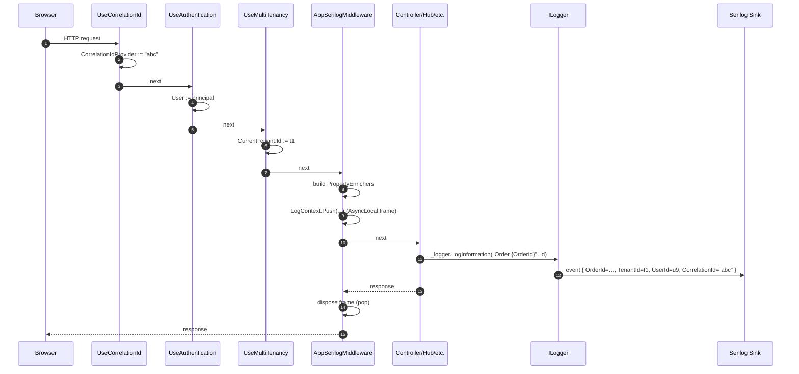

## What the package does

`framework/src/Volo.Abp.AspNetCore.Serilog/` ships exactly three real classes — a module, a middleware, and an options class. Its single purpose is to add four properties to Serilog's `LogContext` for the duration of every HTTP request: `TenantId`, `UserId`, `ClientId`, and `CorrelationId`. With this middleware in the pipeline, every log line that Serilog emits during a request — whether the line is written by ASP.NET Core, by an ABP application service, by EF Core, by HttpClient diagnostics, or by your own `_logger.LogInformation(...)` — automatically gains those four contextual properties.

The package does not configure Serilog itself, does not add sinks, and does not change log levels. All of that lives in your host's `Program.cs` `Log.Logger = new LoggerConfiguration()...CreateLogger()` block. ABP only adds the contextual enrichers.

## The module: `AbpAspNetCoreSerilogModule`

`Volo/Abp/AspNetCore/Serilog/AbpAspNetCoreSerilogModule.cs`:

```csharp
[DependsOn(
    typeof(AbpMultiTenancyModule),
    typeof(AbpAspNetCoreModule)
)]
public class AbpAspNetCoreSerilogModule : AbpModule
{
}
```

No `ConfigureServices` override and no `OnApplicationInitialization`. The module exists purely to declare dependencies and to be a parking spot for `[DependsOn]` from your host module.

Why those two dependencies?

- **`AbpMultiTenancyModule`** — required because `ICurrentTenant` is injected into the middleware and must be available even when the host turns off multi-tenancy.
- **`AbpAspNetCoreModule`** — required because the middleware extends `AbpMiddlewareBase`, registered through ABP's middleware DI conventions.

The middleware is registered automatically by ABP's conventional registrar (it implements `ITransientDependency`); the host's job is just to insert it in the pipeline.

<Tip>
Adding the dependency `[DependsOn(typeof(AbpAspNetCoreSerilogModule))]` on your host module is *not* enough — you must also call `app.UseAbpSerilogEnrichers()` (or, in older naming, `app.UseMiddleware<AbpSerilogMiddleware>()`) somewhere after authentication and tenant resolution. The order matters: tenant and user must already be resolved before the middleware reads them.
</Tip>

## The middleware: `AbpSerilogMiddleware`

`Volo/Abp/AspNetCore/Serilog/AbpSerilogMiddleware.cs` is short enough to read in full:

```csharp
public class AbpSerilogMiddleware : AbpMiddlewareBase, ITransientDependency
{
    private readonly ICurrentClient _currentClient;
    private readonly ICurrentTenant _currentTenant;
    private readonly ICurrentUser _currentUser;
    private readonly ICorrelationIdProvider _correlationIdProvider;
    private readonly AbpAspNetCoreSerilogOptions _options;

    public AbpSerilogMiddleware(
        ICurrentTenant currentTenant,
        ICurrentUser currentUser,
        ICurrentClient currentClient,
        ICorrelationIdProvider correlationIdProvider,
        IOptions<AbpAspNetCoreSerilogOptions> options)
    {
        _currentTenant = currentTenant;
        _currentUser = currentUser;
        _currentClient = currentClient;
        _correlationIdProvider = correlationIdProvider;
        _options = options.Value;
    }

    public async override Task InvokeAsync(HttpContext context, RequestDelegate next)
    {
        var enrichers = new List<ILogEventEnricher>();

        if (_currentTenant?.Id != null)
        {
            enrichers.Add(new PropertyEnricher(_options.EnricherPropertyNames.TenantId, _currentTenant.Id));
        }

        if (_currentUser?.Id != null)
        {
            enrichers.Add(new PropertyEnricher(_options.EnricherPropertyNames.UserId, _currentUser.Id));
        }

        if (_currentClient?.Id != null)
        {
            enrichers.Add(new PropertyEnricher(_options.EnricherPropertyNames.ClientId, _currentClient.Id));
        }

        var correlationId = _correlationIdProvider.Get();
        if (!string.IsNullOrEmpty(correlationId))
        {
            enrichers.Add(new PropertyEnricher(_options.EnricherPropertyNames.CorrelationId, correlationId));
        }

        using (LogContext.Push(enrichers.ToArray()))
        {
            await next(context);
        }
    }
}
```

The flow is simple but worth dissecting:

- The constructor pulls four ABP ambient accessors via DI plus the options. Because the middleware inherits `AbpMiddlewareBase` (from `Volo.Abp.AspNetCore.Middleware`) it is resolved per-request through ABP's middleware factory, so these are scoped instances reflecting the current request.
- Each property is added to the `enrichers` list **only when its value is non-null**. This avoids polluting log events with `TenantId = null` for anonymous host-level requests.
- `Serilog.Context.LogContext.Push(enrichers)` pushes a stack frame onto the `AsyncLocal` log context. Every Serilog event emitted *inside* the `await next(context)` call inherits those properties. The `using` ensures the frame is popped when the request unwinds, even on exceptions.

### Why `LogContext.Push` and not direct property attachment

Serilog's `LogContext` flows across `await` boundaries because it is backed by `AsyncLocal<>`. Direct property attachment on individual log calls would only enrich the calls made inside the middleware itself; using `LogContext.Push` makes the properties available to **every component** that resolves an `ILogger<T>` during the request — including third-party libraries that have no knowledge of ABP.

### Why no try/finally?

`using` is functionally equivalent to a try/finally for `IDisposable`. The push returns an `IDisposable` whose `Dispose` pops the frame. Even if `next(context)` throws, the `using` block ensures the frame is popped — so a subsequent request handled on the same thread does not inherit stale values.

## The options class: `AbpAspNetCoreSerilogOptions`

`Volo/Abp/AspNetCore/Serilog/AbpAspNetCoreSerilogOptions.cs`:

```csharp
public class AbpAspNetCoreSerilogOptions
{
    public AllEnricherPropertyNames EnricherPropertyNames { get; } = new AllEnricherPropertyNames();

    public class AllEnricherPropertyNames
    {
        /// <summary>Default value: "TenantId".</summary>
        public string TenantId { get; set; } = "TenantId";

        /// <summary>Default value: "UserId".</summary>
        public string UserId { get; set; } = "UserId";

        /// <summary>Default value: "ClientId".</summary>
        public string ClientId { get; set; } = "ClientId";

        /// <summary>Default value: "CorrelationId".</summary>
        public string CorrelationId { get; set; } = "CorrelationId";
    }
}
```

There is exactly one knob and it is the property **names** used in the log event. The defaults match the convention most ABP application templates use, but if your log sink (or your `outputTemplate` in `appsettings.json`) expects different names, this is where you change them:

```csharp
Configure<AbpAspNetCoreSerilogOptions>(options =>
{
    options.EnricherPropertyNames.TenantId      = "abp_tenant_id";
    options.EnricherPropertyNames.UserId        = "abp_user_id";
    options.EnricherPropertyNames.CorrelationId = "trace_id";
});
```

Notice that the inner class `AllEnricherPropertyNames` is exposed as a get-only property on the outer class — you mutate the *names*, but cannot swap the entire container. This is a defensive pattern: it prevents downstream code from setting `EnricherPropertyNames = null` and turning every subsequent middleware run into a NRE.

## Source of the four properties

Each enricher value comes from a separate ABP service, and each service has its own resolution chain:

| Property | Service | Source |
| --- | --- | --- |
| `TenantId` | `ICurrentTenant.Id` | Populated by the tenant resolver chain in `Volo.Abp.MultiTenancy` (`AbpAspNetCoreMultiTenancyMiddleware`). |
| `UserId` | `ICurrentUser.Id` | Read from `ClaimsPrincipal` via the `sub` (or configured `UserIdClaim`) claim. |
| `ClientId` | `ICurrentClient.Id` | Read from the `client_id` claim — typically the OAuth client that obtained the bearer token. |
| `CorrelationId` | `ICorrelationIdProvider.Get()` | Either echoed from the incoming `RequestId`/`X-Correlation-Id` header, or generated per-request. |

For any of these to be populated, the matching upstream middleware must already have run. The middleware ordering in a typical ABP host is therefore:

1. `UseCorrelationId` (sets `ICorrelationIdProvider`)
2. `UseAbpRequestLocalization`
3. `UseAuthentication` (sets `User`)
4. `UseAbpClaimsMap` (maps `User` claims into `ICurrentUser`)
5. `UseMultiTenancy` (sets `ICurrentTenant`)
6. `UseAuthorization`
7. `UseAbpSerilogEnrichers` ← reads everything set above
8. `UseConfiguredEndpoints`

Putting the enricher *before* step 5 would leave `TenantId` always null even on tenant-bound requests; putting it *after* the endpoint executes would leak the properties out of the request scope onto whatever ran next.

## End-to-end log flow



After the middleware returns, the `LogContext` frame is popped. The next request handled on this thread starts with a fresh, empty frame.

## Why these particular four properties

Each name maps to a real diagnostic need:

- **`TenantId`** — lets you filter log events for a single tenant in a multi-tenant deployment, which is the only feasible way to debug a tenant-specific bug in production.
- **`UserId`** — links a log line to the audit log row produced by `Volo.Abp.AuditLogging`, which also stores `UserId`. Cross-referencing the two by user id is the standard troubleshooting workflow.
- **`ClientId`** — distinguishes machine-to-machine traffic (a known OAuth client) from interactive users; useful for rate-limiting and security investigations.
- **`CorrelationId`** — ties together log lines emitted by multiple microservices for the same logical operation. ABP's `Volo.Abp.AspNetCore.Tracing` middleware propagates the value into outbound HTTP requests so the chain is preserved across hops.

A typical Serilog `outputTemplate` to render all four:

```
{Timestamp:HH:mm:ss} [{Level:u3}] {SourceContext} CID:{CorrelationId} TID:{TenantId} UID:{UserId} CLI:{ClientId} {Message:lj}{NewLine}{Exception}
```

For structured sinks (Seq, Elasticsearch) you don't need a template; the properties land as structured fields automatically.

## Common pitfalls

- **Empty `CorrelationId` in logs** — most likely the `UseCorrelationId` middleware isn't installed, or runs *after* the Serilog middleware. The check `!string.IsNullOrEmpty(correlationId)` skips the enricher when the value is empty, so the absence is silent rather than a crash.
- **`UserId` set but `TenantId` null on a host-level user** — expected behaviour. The host user has no tenant scope; `ICurrentTenant.Id` is `null`, so the enricher is skipped and the log line correctly shows no tenant.
- **Serilog `Microsoft.AspNetCore.Hosting` events without enrichers** — the very first hosting events (request start) run *before* any middleware, so they cannot carry ABP properties. Move them after the enricher or accept that the host-level lines lack ABP context.
- **`LogContext.Enrich.FromLogContext()` missing** — Serilog only honours `LogContext.Push` if your `LoggerConfiguration` includes `.Enrich.FromLogContext()`. Without that line, the properties are pushed but never read. This is a frequent silent failure.

## Customising the property names for an existing sink

If you onboard onto an existing log aggregation pipeline (Datadog, Splunk, etc.) where the property name `TenantId` already means something else, change the keys without modifying the middleware:

```csharp
public override void ConfigureServices(ServiceConfigurationContext context)
{
    Configure<AbpAspNetCoreSerilogOptions>(options =>
    {
        options.EnricherPropertyNames.TenantId      = "x_tenant";
        options.EnricherPropertyNames.UserId        = "x_user";
        options.EnricherPropertyNames.ClientId      = "x_client";
        options.EnricherPropertyNames.CorrelationId = "x_correlation";
    });
}
```

Because `PropertyEnricher` accepts the name string at construction time, the rename takes effect immediately on the next request — no recompile of any consumer is needed.

## Extending the middleware

ABP intentionally limits the enricher list to the four ambient values. If you need additional properties (e.g. the request's `User-Agent`, the `Host` header, or `HttpContext.TraceIdentifier`), the idiomatic extension is to register your own `IMiddleware` that pushes additional enrichers *inside* the ABP frame:

```csharp
public class TraceIdSerilogMiddleware : IMiddleware
{
    public Task InvokeAsync(HttpContext context, RequestDelegate next)
    {
        using (LogContext.PushProperty("TraceId", context.TraceIdentifier))
        {
            return next(context);
        }
    }
}
```

Place it in the pipeline *after* `UseAbpSerilogEnrichers` so it nests inside the ABP frame; both sets of properties are then visible to downstream log writes.

## Operational behaviour

- The middleware is `transient` (via `ITransientDependency`) but `IMiddleware`-style — ABP's middleware factory creates an instance per request and disposes it afterwards. There is no allocation pressure beyond the four `PropertyEnricher` records.
- `LogContext.Push(...)` and the surrounding `using` introduce one async-local frame allocation per request. On heavy load this is negligible compared with the cost of the request itself.
- The middleware does **not** log anything by itself. If you want a request-completed line, use Serilog's built-in `UseSerilogRequestLogging()` from `Serilog.AspNetCore`; the ABP enrichers will populate properties on that line too because it runs inside the same `LogContext` frame.

## Summary

`Volo.Abp.AspNetCore.Serilog` is one of the most minimal yet impactful packages in the framework. A 60-line middleware (`AbpSerilogMiddleware`) pushes four ambient properties — `TenantId`, `UserId`, `ClientId`, `CorrelationId` — into Serilog's `LogContext` for each request. The single configuration class `AbpAspNetCoreSerilogOptions` lets you rename those four keys. The module declares dependencies but no behaviour. Combined with the rest of ABP's request pipeline, the result is that every log line emitted during a request — regardless of which library emitted it — is automatically tagged with the four pieces of context every operations team eventually wishes they had.
