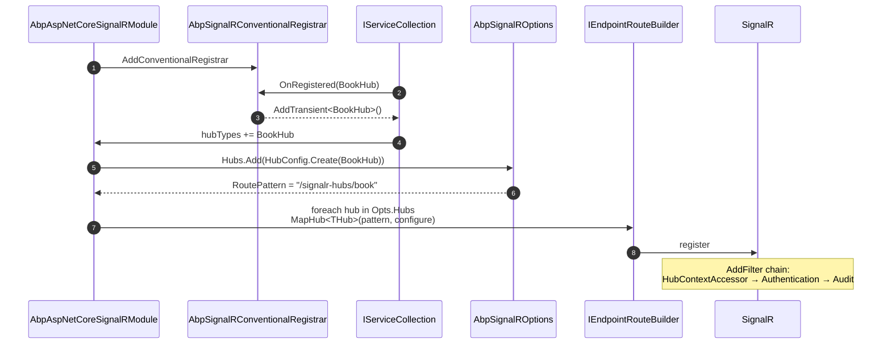
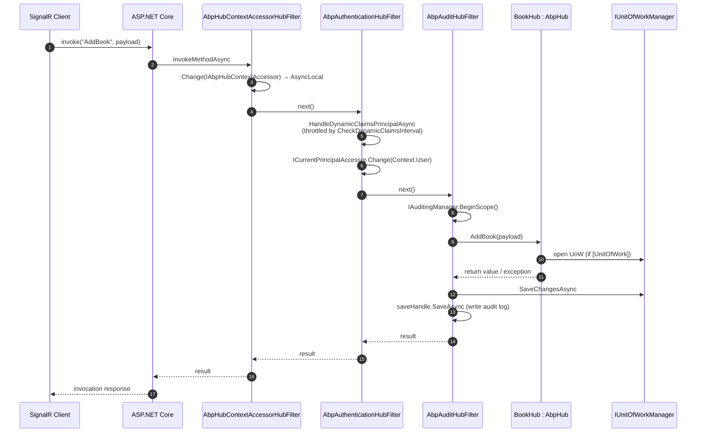

## The package at a glance

`framework/src/Volo.Abp.AspNetCore.SignalR/` extends `Microsoft.AspNetCore.SignalR` with the bits an ABP Framework application needs: every `Hub` class is auto-discovered and mapped to a conventional route, every hub method runs inside an ABP unit-of-work-aware scope with the current user / current tenant flowing correctly, audit logs are produced for hub invocations the same way they are for MVC actions, and `IUserIdProvider.GetUserId` returns the ABP `ICurrentUser.Id`. None of this requires you to call `endpoints.MapHub<MyHub>()` by hand.

Source files:

- `AbpAspNetCoreSignalRModule.cs` — wiring.
- `AbpSignalRConventionalRegistrar.cs` — picks up `Hub` subclasses and registers them as transients.
- `AbpHub.cs` (and `AbpHub<T>`) — base class with `ILogger`, `ICurrentUser`, `ICurrentTenant`, `IAuthorizationService`, `IStringLocalizer`.
- `AbpSignalRUserIdProvider.cs` — maps SignalR's `IUserIdProvider` to `ICurrentUser.Id`.
- `AbpHubContextAccessorHubFilter.cs`, `Authentication/AbpAuthenticationHubFilter.cs`, `Auditing/AbpAuditHubFilter.cs` — three `IHubFilter` implementations.
- `AbpHubContext.cs`, `IAbpHubContextAccessor.cs`, `DefaultAbpHubContextAccessor.cs` — `AsyncLocal`-backed accessor for the current hub invocation.
- `HubRouteAttribute.cs`, `HubConfig.cs`, `HubConfigList.cs`, `DisableAutoHubMapAttribute.cs`, `AbpSignalROptions.cs` — routing convention.
- `Auditing/AspNetCoreSignalRAuditLogContributor.cs` — populates `AuditLogInfo` with hub-specific fields.

## Module wiring: `AbpAspNetCoreSignalRModule`

`Volo/Abp/AspNetCore/SignalR/AbpAspNetCoreSignalRModule.cs` registers the conventional registrar, configures `AddSignalR` with the three filters, builds the endpoint route table from `AbpSignalROptions.Hubs`, and adds the audit log contributor:

```csharp
public override void PreConfigureServices(ServiceConfigurationContext context)
{
    context.Services.AddConventionalRegistrar(new AbpSignalRConventionalRegistrar());

    AutoAddHubTypes(context.Services);
}

public override void ConfigureServices(ServiceConfigurationContext context)
{
    var routePatterns = new List<string> { "/signalr-hubs" };
    var signalRServerBuilder = context.Services.AddSignalR(options =>
    {
        options.DisableImplicitFromServicesParameters = true;
        options.AddFilter<AbpHubContextAccessorHubFilter>();
        options.AddFilter<AbpAuthenticationHubFilter>();
        options.AddFilter<AbpAuditHubFilter>();
    });

    context.Services.ExecutePreConfiguredActions(signalRServerBuilder);
    ...
}
```

Three details worth calling out:

- **`DisableImplicitFromServicesParameters = true`** — turns off SignalR 7+'s implicit DI on hub-method parameters. ABP relies on constructor injection (and the lazy service provider in `AbpHub`) instead, so the implicit behaviour would just confuse the audit/serialisation layer.
- **Filter order** — `AbpHubContextAccessorHubFilter` runs first so subsequent filters can read `IAbpHubContextAccessor.Context`; `AbpAuthenticationHubFilter` runs second to ensure the current principal is set before any audit logic; `AbpAuditHubFilter` runs last so its `try/catch` captures exceptions thrown by either the hub method or the inner filters.
- **`ExecutePreConfiguredActions(signalRServerBuilder)`** — gives downstream modules a chance to attach JSON protocol options, MessagePack, Redis backplane, etc., via `PreConfigure<ISignalRServerBuilder>(...)`.

### Endpoint registration

The module configures `AbpEndpointRouterOptions` to walk `AbpSignalROptions.Hubs` and call `endpoints.MapHub<THub>(pattern, opts)` for each one:

```csharp
foreach (var hubConfig in signalROptions.Hubs)
{
    routePatterns.AddIfNotContains(hubConfig.RoutePattern);

    if (hubWithRoutePatterns.Any(x => x.Key == hubConfig.HubType && x.Value == hubConfig.RoutePattern))
    {
        throw new AbpException($"The hub type {hubConfig.HubType.FullName} is already registered with route pattern {hubConfig.RoutePattern}");
    }

    hubWithRoutePatterns.Add(new KeyValuePair<Type, string>(hubConfig.HubType, hubConfig.RoutePattern));
    MapHubType(
        hubConfig.HubType,
        endpointContext.Endpoints,
        hubConfig.RoutePattern,
        opts =>
        {
            foreach (var configureAction in hubConfig.ConfigureActions)
            {
                configureAction(opts);
            }
        });
}
```

`MapHubType` and the private `MapHub<THub>` method (called via reflection) do the actual `endpoints.MapHub<THub>(pattern, configureOptions)` — this dance is necessary because `MapHub<>` requires a generic type parameter known at compile time, while `HubConfig.HubType` is only known at runtime.

### Auditing exclusions

The module also adds every hub route to `AbpAspNetCoreAuditingOptions.IgnoredUrls`:

```csharp
Configure<AbpAspNetCoreAuditingOptions>(options =>
{
    foreach (var routePattern in routePatterns)
    {
        options.IgnoredUrls.AddIfNotContains(
            x => routePattern.StartsWith(x, StringComparison.OrdinalIgnoreCase),
            () => routePattern);
    }
});
```

This means the *HTTP middleware* audit pipeline does not produce a log for SignalR negotiate/long-poll requests; instead, the per-invocation `AbpAuditHubFilter` writes one log per hub method call. Otherwise you'd get noise from the negotiate handshake and zero detail from the actual messages.

```csharp
Configure<AbpAuditingOptions>(options =>
{
    options.Contributors.Add(new AspNetCoreSignalRAuditLogContributor());
});
```

The contributor adds hub-specific fields like the hub method name and IP address to the `AuditLogInfo`.

## Auto-mapping: `AutoAddHubTypes` and `HubRouteAttribute`

`AutoAddHubTypes` hooks the `OnRegistered` event on the service collection to capture every type that implements `Hub`:

```csharp
services.OnRegistered(context =>
{
    if (IsHubClass(context) && !IsDisabledForAutoMap(context))
    {
        hubTypes.Add(context.ImplementationType);
    }
});

services.Configure<AbpSignalROptions>(options =>
{
    foreach (var hubType in hubTypes)
    {
        options.Hubs.Add(HubConfig.Create(hubType));
    }
});
```

`HubConfig.Create(hubType)` calls `HubRouteAttribute.GetRoutePattern(hubType)`:

```csharp
public static string GetRoutePattern(Type hubType)
{
    var routeAttribute = hubType.GetSingleAttributeOrNull<HubRouteAttribute>();
    if (routeAttribute != null)
    {
        return routeAttribute.GetRoutePatternForType(hubType);
    }

    return "/signalr-hubs/" + hubType.Name.RemovePostFix("Hub").ToKebabCase();
}
```

So `ChatHub` ends up at `/signalr-hubs/chat`, `OrderNotificationHub` at `/signalr-hubs/order-notification`. If you need a custom path, decorate the class with `[HubRoute("/my-hub")]`. If you want a hub registered as a SignalR class but **not** auto-mapped (e.g. mapped manually with extra middleware) decorate it with `[DisableAutoHubMap]`.

The companion class `HubConfigList` (`Volo/Abp/AspNetCore/SignalR/HubConfigList.cs`) adds an `AddOrUpdate<THub>(Action<HubConfig>?)` helper so modules can tweak the configuration of an already-discovered hub without scanning the list manually.

## Conventional registrar: `AbpSignalRConventionalRegistrar`

`Volo/Abp/AspNetCore/SignalR/AbpSignalRConventionalRegistrar.cs` overrides ABP's `DefaultConventionalRegistrar`:

```csharp
public class AbpSignalRConventionalRegistrar : DefaultConventionalRegistrar
{
    protected override bool IsConventionalRegistrationDisabled(Type type)
    {
        return !IsHub(type) || base.IsConventionalRegistrationDisabled(type);
    }

    private static bool IsHub(Type type)
    {
        return typeof(Hub).IsAssignableFrom(type);
    }

    protected override ServiceLifetime? GetDefaultLifeTimeOrNull(Type type)
    {
        return ServiceLifetime.Transient;
    }
}
```

Hubs are registered transient — SignalR creates one instance per invocation anyway, so a longer lifetime would do no harm but no good. The registrar filters anything that isn't a `Hub` subclass, leaving the rest to ABP's default registrar.

## Base class: `AbpHub`

`Volo/Abp/AspNetCore/SignalR/AbpHub.cs` is a sugar layer over `Hub` (and `Hub<T>`) that exposes a `LazyServiceProvider` and lazy properties for the common services hubs need:

```csharp
public abstract class AbpHub : Hub
{
    public IAbpLazyServiceProvider LazyServiceProvider { get; set; } = default!;

    protected ICurrentUser CurrentUser => LazyServiceProvider.LazyGetService<ICurrentUser>()!;
    protected ICurrentTenant CurrentTenant => LazyServiceProvider.LazyGetService<ICurrentTenant>()!;
    protected IAuthorizationService AuthorizationService => LazyServiceProvider.LazyGetService<IAuthorizationService>()!;
    protected IClock Clock => LazyServiceProvider.LazyGetService<IClock>()!;
    protected ILogger Logger => LazyServiceProvider.LazyGetService<ILogger>(
        provider => LoggerFactory?.CreateLogger(GetType().FullName!) ?? NullLogger.Instance);

    protected IStringLocalizer L { get { ... } }   // backed by IStringLocalizerFactory
    protected Type? LocalizationResource { get; set; } = typeof(DefaultResource);
    ...
}
```

Two patterns are reused from `AbpController`:

- **Lazy resolution** — no service is resolved until first use, which keeps per-invocation hub allocations cheap.
- **Localization** — `L` returns an `IStringLocalizer` lazily built from `LocalizationResource`. The default `DefaultResource` matches the convention used by application services, so messages can be shared.

`AbpHub<T>` is the typed-clients variant (`Hub<T>`) and reproduces the same property set verbatim.

## The hub filter pipeline

ABP plugs three `IHubFilter`s into the SignalR pipeline. They run in registration order on each invocation (and `OnConnectedAsync`/`OnDisconnectedAsync` for the lifetime filter that overrides those methods).

### `AbpHubContextAccessorHubFilter`

`Volo/Abp/AspNetCore/SignalR/AbpHubContextAccessorHubFilter.cs` pushes a fresh `AbpHubContext` onto an `AsyncLocal<>`:

```csharp
public virtual async ValueTask<object?> InvokeMethodAsync(HubInvocationContext invocationContext, Func<HubInvocationContext, ValueTask<object?>> next)
{
    var hubContextAccessor = invocationContext.ServiceProvider.GetRequiredService<IAbpHubContextAccessor>();
    using (hubContextAccessor.Change(new AbpHubContext(
               invocationContext.ServiceProvider,
               invocationContext.Hub,
               invocationContext.HubMethod,
               invocationContext.HubMethodArguments)))
    {
        return await next(invocationContext);
    }
}
```

`DefaultAbpHubContextAccessor` (`Volo/Abp/AspNetCore/SignalR/DefaultAbpHubContextAccessor.cs`) is a singleton with an `AsyncLocal<AbpHubContext>`. Any code anywhere in the request chain (audit contributors, log enrichers, application services called from inside the hub method) can ask "am I currently inside a SignalR invocation, and if so which one?".

### `AbpAuthenticationHubFilter`

`Volo/Abp/AspNetCore/SignalR/Authentication/AbpAuthenticationHubFilter.cs` is the bridge between SignalR's `Context.User` and ABP's `ICurrentPrincipalAccessor`:

```csharp
public virtual async ValueTask<object?> InvokeMethodAsync(HubInvocationContext invocationContext, Func<HubInvocationContext, ValueTask<object?>> next)
{
    var currentPrincipalAccessor = invocationContext.ServiceProvider.GetRequiredService<ICurrentPrincipalAccessor>();
    var claimsPrincipal = invocationContext.Context.User;
    await HandleDynamicClaimsPrincipalAsync(claimsPrincipal, invocationContext.ServiceProvider, invocationContext.Context, false);
    using (currentPrincipalAccessor.Change(claimsPrincipal!))
    {
        return await next(invocationContext);
    }
}
```

It also overrides `OnConnectedAsync` so that `ICurrentUser` works inside connection lifetime callbacks:

```csharp
public virtual async Task OnConnectedAsync(HubLifetimeContext context, Func<HubLifetimeContext, Task> next)
{
    var currentPrincipalAccessor = context.ServiceProvider.GetRequiredService<ICurrentPrincipalAccessor>();
    var claimsPrincipal = context.Context.User;
    await HandleDynamicClaimsPrincipalAsync(claimsPrincipal, context.ServiceProvider, context.Context, true);
    using (currentPrincipalAccessor.Change(claimsPrincipal!))
    {
        await next(context);
    }
}
```

`HandleDynamicClaimsPrincipalAsync` consults two options:

- `AbpClaimsPrincipalFactoryOptions.IsDynamicClaimsEnabled` — global on/off.
- `AbpSignalROptions.CheckDynamicClaimsInterval` (default 5 seconds) — throttles claim refresh per connection.

When the interval has passed since the last check (or this is the `OnConnectedAsync` call), the filter clones the principal, calls `IAbpClaimsPrincipalFactory.CreateDynamicAsync(...)`, and stores the refresh time in `hubCallerContext.Items`. If the refreshed principal is no longer authenticated (the user was deleted or locked out), the connection is aborted.

### `AbpAuditHubFilter`

`Volo/Abp/AspNetCore/SignalR/Auditing/AbpAuditHubFilter.cs` mirrors the MVC audit filter:

```csharp
public virtual async ValueTask<object?> InvokeMethodAsync(HubInvocationContext invocationContext, Func<HubInvocationContext, ValueTask<object?>> next)
{
    var options = invocationContext.ServiceProvider.GetRequiredService<IOptions<AbpAuditingOptions>>().Value;
    if (!options.IsEnabled) return await next(invocationContext);

    var hasError = false;
    var auditingManager = invocationContext.ServiceProvider.GetRequiredService<IAuditingManager>();
    using (var saveHandle = auditingManager.BeginScope())
    {
        ...
        try
        {
            result = await next(invocationContext);
            if (auditingManager.Current.Log.Exceptions.Any())
                hasError = true;
        }
        catch (Exception ex) { hasError = true; ... throw; }
        finally
        {
            if (await ShouldWriteAuditLogAsync(...))
            {
                var unitOfWorkManager = invocationContext.ServiceProvider.GetRequiredService<IUnitOfWorkManager>();
                if (unitOfWorkManager.Current != null)
                    await unitOfWorkManager.Current.SaveChangesAsync();
                await saveHandle.SaveAsync();
            }
        }
        return result;
    }
}
```

Notice the interaction with `IUnitOfWorkManager` in the finally block: if a hub method opens a unit of work, it is saved before the audit log so the audit row reflects the same data the UoW committed. `ShouldWriteAuditLogAsync` enforces the standard filters (`AlwaysLogSelectors`, `AlwaysLogOnException`, `IsEnabledForAnonymousUsers`, non-empty `Actions`).

The contributor `AspNetCoreSignalRAuditLogContributor` (`Volo/Abp/AspNetCore/SignalR/Auditing/AspNetCoreSignalRAuditLogContributor.cs`) post-processes:

```csharp
public override void PostContribute(AuditLogContributionContext context)
{
    var hubContext = context.ServiceProvider.GetRequiredService<IAbpHubContextAccessor>().Context;
    if (hubContext == null) return;

    var firstAction = context.AuditInfo.Actions.FirstOrDefault();
    context.AuditInfo.Url = firstAction?.ServiceName + "." + firstAction?.MethodName;
    context.AuditInfo.HttpStatusCode = null;
}
```

Audit logs for hubs therefore have `Url = "Volo.Abp.Chat.IChatService.SendMessage"` rather than an HTTP route, and the `HttpStatusCode` column is null because the concept doesn't apply.

## `AbpSignalRUserIdProvider`

`Volo/Abp/AspNetCore/SignalR/AbpSignalRUserIdProvider.cs`:

```csharp
public class AbpSignalRUserIdProvider : IUserIdProvider, ITransientDependency
{
    private readonly ICurrentPrincipalAccessor _currentPrincipalAccessor;
    private readonly ICurrentUser _currentUser;

    public virtual string? GetUserId(HubConnectionContext connection)
    {
        using (_currentPrincipalAccessor.Change(connection.User))
        {
            return _currentUser.Id?.ToString();
        }
    }
}
```

This is the one method SignalR calls to discover the user id for *group routing* (`Clients.User(userId).SendAsync(...)`). The implementation swaps the current principal to `connection.User` for the duration of the call so `ICurrentUser.Id` resolves the same way it does inside MVC actions — same accessor, same tenant resolution, same logic. The output is the ABP user `Guid` as a string, which is exactly what `IHubContext<T>.Clients.User(id)` expects.

## Hub mapping flow



## Hub invocation flow



## Options: `AbpSignalROptions`

`Volo/Abp/AspNetCore/SignalR/AbpSignalROptions.cs`:

```csharp
public class AbpSignalROptions
{
    public HubConfigList Hubs { get; }

    /// <summary>Default: 5 seconds.</summary>
    public TimeSpan? CheckDynamicClaimsInterval { get; set; }

    public AbpSignalROptions()
    {
        Hubs = new HubConfigList();
        CheckDynamicClaimsInterval = TimeSpan.FromSeconds(5);
    }
}
```

`Hubs` is a `HubConfigList` (a `List<HubConfig>`) — you can `Add`, `AddOrUpdate<T>(...)`, or remove hubs here. `CheckDynamicClaimsInterval = null` disables the throttle entirely and forces a refresh on every invocation; tuning this down to a few seconds is the right trade-off for chat-style hubs, while group/notification hubs can leave it at the default.

## Practical recipes

### Pin a hub to a custom path

```csharp
[HubRoute("/realtime/chat")]
public class ChatHub : AbpHub { ... }
```

`HubRouteAttribute.GetRoutePattern(typeof(ChatHub))` returns `"/realtime/chat"`, overriding the default `"/signalr-hubs/chat"`.

### Disable auto-mapping for a hub

```csharp
[DisableAutoHubMap]
public class CustomMappedHub : Hub { ... }
```

The hub is still registered in DI (via `AbpSignalRConventionalRegistrar`), but `AbpAspNetCoreSignalRModule.AutoAddHubTypes` skips it. You can then map it manually in your `Configure` callback with extra middleware:

```csharp
endpoints.MapHub<CustomMappedHub>("/custom", opts => opts.Transports = HttpTransportType.WebSockets);
```

### Configure the dispatcher options for an auto-mapped hub

```csharp
Configure<AbpSignalROptions>(options =>
{
    options.Hubs.AddOrUpdate<ChatHub>(config =>
    {
        config.ConfigureActions.Add(opts =>
        {
            opts.Transports = HttpTransportType.WebSockets | HttpTransportType.LongPolling;
        });
    });
});
```

The action collection is invoked once per endpoint registration and forwarded to `MapHub<T>(pattern, configureOptions)`.

### Sending to an ABP user id

```csharp
public class NotificationService : IDomainService
{
    private readonly IHubContext<NotificationHub> _hub;

    public Task NotifyAsync(Guid userId, string message)
        => _hub.Clients.User(userId.ToString()).SendAsync("Notify", message);
}
```

`AbpSignalRUserIdProvider` ensures the id format aligns with what SignalR stored when the user connected.

## Summary

The package is a tightly integrated SignalR layer for ABP Framework apps: it auto-discovers hubs and registers them with sensible routes, injects three filters that respectively expose the hub context as ambient state, refresh dynamic claims at a configurable cadence, and produce auditing records that look identical to MVC-action audit rows. The base class `AbpHub` mirrors `AbpController` so domain authors can write hub methods that use `CurrentUser`, `CurrentTenant`, `L`, and `AuthorizationService` without thinking about the underlying SignalR scoping. The `IUserIdProvider` is replaced so SignalR group routing uses ABP user ids, and `AbpSignalROptions.Hubs` is the single place to override conventions.
