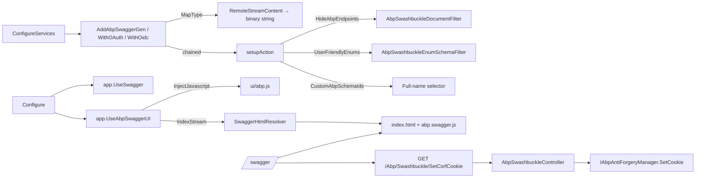

## Why ABP Framework wraps Swashbuckle

`Swashbuckle.AspNetCore` is the de-facto OpenAPI generator for ASP.NET Core, but a stock setup mis-handles several things in an ABP Framework application: streaming file results (`IRemoteStreamContent`) generate a wrong schema, internal `/Abp/…` endpoints leak into the document, OAuth security definitions need to be wired by hand, and SwaggerUI is missing the small ABP-specific scripts that load `abp.appPath` and the CSRF cookie. The `Volo.Abp.Swashbuckle` package (`framework/src/Volo.Abp.Swashbuckle/`) plugs all of these holes through a thin facade over Swashbuckle.

The package ships:

- `AbpSwashbuckleModule` — DI registrations and embedded UI assets.
- `AbpSwaggerGenServiceCollectionExtensions` — `AddAbpSwaggerGen`, `AddAbpSwaggerGenWithOAuth`, `AddAbpSwaggerGenWithOidc`.
- `AbpSwaggerGenOptionsExtensions` — opt-in filters (`HideAbpEndpoints`, `UserFriendlyEnums`, `CustomAbpSchemaIds`).
- `AbpSwaggerUIBuilderExtensions.UseAbpSwaggerUI` — UI middleware that injects `abp.js` and a custom HTML resolver.
- `AbpSwashbuckleController` — exposes `SetCsrfCookie` so the SwaggerUI "Try it out" button can POST safely.

## `AbpSwashbuckleModule`

`Volo/Abp/Swashbuckle/AbpSwashbuckleModule.cs` declares two dependencies — `AbpVirtualFileSystemModule` and `AbpAspNetCoreMvcModule` — and registers the package's embedded resources into the ABP virtual file system:

```csharp
[DependsOn(
    typeof(AbpVirtualFileSystemModule),
    typeof(AbpAspNetCoreMvcModule))]
public class AbpSwashbuckleModule : AbpModule
{
    public override void ConfigureServices(ServiceConfigurationContext context)
    {
        Configure<AbpVirtualFileSystemOptions>(options =>
        {
            options.FileSets.AddEmbedded<AbpSwashbuckleModule>();
        });
    }
}
```

The embedded files include `wwwroot/ui/abp.swagger.js` and `wwwroot/ui/abp.js`, which the UI builder injects (see `UseAbpSwaggerUI` below) so the SwaggerUI page can populate `abp.appPath` and set the CSRF token before "Try it out".

`ISwaggerHtmlResolver` (`Volo/Abp/Swashbuckle/ISwaggerHtmlResolver.cs`) and its default implementation `SwaggerHtmlResolver` are also registered conventionally. `SwaggerHtmlResolver` reads the embedded `Swashbuckle.AspNetCore.SwaggerUI.index.html`, injects a single `<script src="ui/abp.swagger.js">` tag next to the bundle script, and returns the modified HTML as a `MemoryStream`.

## `AddAbpSwaggerGen`: the bare minimum

`Microsoft/Extensions/DependencyInjection/AbpSwaggerGenServiceCollectionExtensions.cs` wraps Swashbuckle's `AddSwaggerGen` to register two `MapType` calls for ABP's streaming content types:

```csharp
public static IServiceCollection AddAbpSwaggerGen(
    this IServiceCollection services,
    Action<SwaggerGenOptions>? setupAction = null)
{
    return services.AddSwaggerGen(options =>
    {
        Func<OpenApiSchema> remoteStreamContentSchemaFactory = () => new OpenApiSchema()
        {
            Type = JsonSchemaType.String,
            Format = "binary"
        };

        options.MapType<RemoteStreamContent>(remoteStreamContentSchemaFactory);
        options.MapType<IRemoteStreamContent>(remoteStreamContentSchemaFactory);

        setupAction?.Invoke(options);
    });
}
```

Without this mapping, Swashbuckle inspects `RemoteStreamContent`'s public properties (`Stream`, `FileName`, `ContentType`, `ContentLength`) and produces a noisy object schema; the `binary` mapping is what makes Swagger UI render a file-upload widget for these parameters and a downloadable file link for these responses.

The `setupAction` parameter chains into the underlying `SwaggerGenOptions`, so anything you would normally pass to `AddSwaggerGen(o => …)` still works.

## `AddAbpSwaggerGenWithOAuth`

For applications that authenticate via OAuth2 (typical with `Volo.Abp.IdentityServer` or `Volo.Abp.OpenIddict`), this overload pre-wires the security definition and a default authorization-code flow:

```csharp
public static IServiceCollection AddAbpSwaggerGenWithOAuth(
    this IServiceCollection services,
    [NotNull] string authority,
    [NotNull] Dictionary<string, string> scopes,
    Action<SwaggerGenOptions>? setupAction = null,
    string authorizationEndpoint = "/connect/authorize",
    string tokenEndpoint = "/connect/token")
{
    var authorizationUrl = new Uri($"{authority.TrimEnd('/')}{authorizationEndpoint.EnsureStartsWith('/')}");
    var tokenUrl = new Uri($"{authority.TrimEnd('/')}{tokenEndpoint.EnsureStartsWith('/')}");

    return services
        .AddAbpSwaggerGen()
        .AddSwaggerGen(options =>
        {
            options.AddSecurityDefinition("oauth2", new OpenApiSecurityScheme
            {
                Type = SecuritySchemeType.OAuth2,
                Flows = new OpenApiOAuthFlows
                {
                    AuthorizationCode = new OpenApiOAuthFlow
                    {
                        AuthorizationUrl = authorizationUrl,
                        Scopes = scopes,
                        TokenUrl = tokenUrl
                    }
                }
            });

            options.AddSecurityRequirement(document => new OpenApiSecurityRequirement()
            {
                [new OpenApiSecuritySchemeReference("oauth2", document)] = []
            });

            setupAction?.Invoke(options);
        });
}
```

The defaults (`/connect/authorize`, `/connect/token`) match the routes that both IdentityServer4 and OpenIddict expose in the ABP application templates. The `scopes` dictionary maps scope names to user-facing descriptions and is rendered in the SwaggerUI consent dialog.

The trailing `AddSecurityRequirement` line uses Swashbuckle's *document-aware* overload: the `[]` empty array means "no extra per-operation scopes required" — every authenticated endpoint accepts whichever scopes the user agreed to in the authorization request.

## `AddAbpSwaggerGenWithOidc`

When you want the SwaggerUI to **discover** the IdP via `.well-known/openid-configuration` instead of hard-coded URLs:

```csharp
var discoveryUrl = discoveryEndpoint != null ?
    $"{discoveryEndpoint.TrimEnd('/')}/.well-known/openid-configuration":
    $"{authority.TrimEnd('/')}/.well-known/openid-configuration";
flows ??= new [] { AbpSwaggerOidcFlows.AuthorizationCode };

services.Configure<SwaggerUIOptions>(swaggerUiOptions =>
{
    swaggerUiOptions.ConfigObject.AdditionalItems["oidcSupportedFlows"] = flows;
    swaggerUiOptions.ConfigObject.AdditionalItems["oidcSupportedScopes"] = scopes;
    swaggerUiOptions.ConfigObject.AdditionalItems["oidcDiscoveryEndpoint"] = discoveryUrl;
});

return services
    .AddAbpSwaggerGen()
    .AddSwaggerGen(options =>
    {
        options.AddSecurityDefinition(oidcAuthenticationScheme, new OpenApiSecurityScheme
        {
            Type = SecuritySchemeType.OpenIdConnect,
            OpenIdConnectUrl = new Uri(RemoveTenantPlaceholders(discoveryUrl))
        });
        ...
    });
}
```

Two ABP-specific touches:

- The flow names come from `AbpSwaggerOidcFlows` (`Volo/Abp/Swashbuckle/AbpSwaggerOidcFlows.cs`) — the same `authorization_code`, `implicit`, `password`, `client_credentials` keys the upstream `oidc-client` JavaScript library understands.
- `RemoveTenantPlaceholders` strips `{0}.` / `{tenantId}.` / `{tenantName}.` prefixes from the discovery URL before handing it to OpenAPI. ABP's `MultiTenantUrlProvider.TenantPlaceHolder` substitutes the tenant at runtime, but the static OpenAPI document needs a single concrete URL.

The `AdditionalItems` writes mean the front-end JavaScript bundle (`ui/abp.swagger.js`) can pick up these values and configure the OIDC client without parsing the OpenAPI schema itself.

## `AbpSwaggerGenOptionsExtensions`: opt-in filters

`Microsoft/Extensions/DependencyInjection/AbpSwaggerGenOptionsExtensions.cs` adds three helpers on `SwaggerGenOptions`:

```csharp
public static void HideAbpEndpoints(this SwaggerGenOptions swaggerGenOptions)
{
    swaggerGenOptions.DocumentFilter<AbpSwashbuckleDocumentFilter>();
}

public static void UserFriendlyEnums(this SwaggerGenOptions swaggerGenOptions)
{
    swaggerGenOptions.SchemaFilter<AbpSwashbuckleEnumSchemaFilter>();
}

public static void CustomAbpSchemaIds(this SwaggerGenOptions options)
{
    string SchemaIdSelector(Type modelType)
    {
        if (!modelType.IsConstructedGenericType)
        {
            return modelType.FullName!.Replace("[]", "Array");
        }

        var prefix = modelType.GetGenericArguments()
            .Select(SchemaIdSelector)
            .Aggregate((previous, current) => previous + current);
        return modelType.FullName!.Split('`').First() + "Of" + prefix;
    }

    options.CustomSchemaIds(SchemaIdSelector);
}
```

### `AbpSwashbuckleDocumentFilter`

`Volo/Abp/Swashbuckle/AbpSwashbuckleDocumentFilter.cs` is the document filter that hides ABP's internal endpoints (`/Abp/ServiceProxyScript`, `/abp/api-definition`, `/abp/application-configuration`, …). The implementation is route-based:

```csharp
protected virtual string[] ActionUrlPrefixes { get; set; } = new[] { "Volo." };

public virtual void Apply(OpenApiDocument swaggerDoc, DocumentFilterContext context)
{
    var actionUrls = context.ApiDescriptions
        .Select(apiDescription => apiDescription.ActionDescriptor)
        .Where(actionDescriptor => !string.IsNullOrEmpty(actionDescriptor.DisplayName) &&
                                   ActionUrlPrefixes.Any(actionUrlPrefix => !actionDescriptor.DisplayName.Contains(actionUrlPrefix)))
        .DistinctBy(actionDescriptor => actionDescriptor.AttributeRouteInfo?.Template)
        .Select(RemoveRouteParameterConstraints)
        .Where(actionUrl => !string.IsNullOrEmpty(actionUrl))
        .ToList();

    swaggerDoc
        .Paths
        .RemoveAll(path => !actionUrls.Contains(path.Key));
    ...
}
```

It keeps paths whose controller `DisplayName` does **not** contain `"Volo."`, then walks the path table and removes everything else. Tags that no longer reference a path are also dropped to keep the SwaggerUI navigation tidy.

`RemoveRouteParameterConstraints` strips route constraint suffixes (the `:int`, `:guid`, `:regex(…)` parts) from the template so the OpenAPI path string is the bare `{id}` form:

```csharp
route = Regex.Replace(route, RegexConstraintPattern, "");
while (route.Contains(':'))
{
    var startIndex = route.IndexOf(":", StringComparison.Ordinal);
    var endIndex = route.IndexOf("}", startIndex);
    if (endIndex == -1) break;
    route = route.Remove(startIndex, (endIndex - startIndex));
}
```

### `AbpSwashbuckleEnumSchemaFilter`

`Volo/Abp/Swashbuckle/AbpSwashbuckleEnumSchemaFilter.cs` turns C# enums into string enums in the OpenAPI document so SwaggerUI presents readable values:

```csharp
public void Apply(IOpenApiSchema schema, SchemaFilterContext context)
{
    if (schema is OpenApiSchema openApiScheme && context.Type.IsEnum)
    {
        openApiScheme.Enum?.Clear();
        openApiScheme.Type = JsonSchemaType.String;
        openApiScheme.Format = null;
        foreach (var name in Enum.GetNames(context.Type))
        {
            openApiScheme.Enum?.Add(JsonNode.Parse($"\"{name}\"")!);
        }
    }
}
```

This is purely a *documentation* concern — the actual serialisation still depends on `JsonStringEnumConverter` being registered on the JSON options. Use the two together.

### `CustomAbpSchemaIds`

Swashbuckle's default schema ID is the short type name, which collides whenever two `BookDto` classes exist in different modules. `CustomAbpSchemaIds` switches to the **full** type name and synthesises a stable name for generics:

```csharp
return modelType.FullName!.Split('`').First() + "Of" + prefix;
```

So `PagedResultDto<BookDto>` becomes `Volo.Abp.Application.Dtos.PagedResultDtoOfMyApp.Books.BookDto`, eliminating cross-module collisions.

## `UseAbpSwaggerUI`

`Microsoft/AspNetCore/Builder/AbpSwaggerUIBuilderExtensions.cs` wraps `app.UseSwaggerUI(…)`:

```csharp
public static IApplicationBuilder UseAbpSwaggerUI(
    this IApplicationBuilder app,
    Action<SwaggerUIOptions>? setupAction = null)
{
    var resolver = app.ApplicationServices.GetService<ISwaggerHtmlResolver>();

    return app.UseSwaggerUI(options =>
    {
        options.InjectJavascript("ui/abp.js");
        options.IndexStream = () => resolver?.Resolver();

        setupAction?.Invoke(options);
    });
}
```

`InjectJavascript("ui/abp.js")` loads the small client script that initialises `abp.appPath`. `IndexStream` returns the customised `index.html` produced by `SwaggerHtmlResolver`, which has `ui/abp.swagger.js` already wired in.

The companion `AbpSwaggerUIOptionsExtensions.AbpAppPath(SwaggerUIOptions, string)` lets you bake the app path into the `<head>` of the SwaggerUI document:

```csharp
public static void AbpAppPath([NotNull] this SwaggerUIOptions options, [NotNull] string appPath)
{
    var normalizedAppPath = NormalizeAppPath(appPath);
    options.HeadContent = BuildAppPathScript(normalizedAppPath, options.HeadContent ?? string.Empty);
}
```

The generated `<script>` block declares `abp.appPath = "/swagger/"`, which keeps the ABP CSRF / current-user runtime aware of the SwaggerUI base path when it makes its own AJAX calls.

## CSRF helper: `AbpSwashbuckleController`

`Volo/Abp/Swashbuckle/AbpSwashbuckleController.cs` is a tiny controller that emits the ABP antiforgery cookie so SwaggerUI's "Try it out" can perform state-mutating calls:

```csharp
[Area("Abp")]
[Route("Abp/Swashbuckle/[action]")]
[DisableAuditing]
[RemoteService(false)]
[ApiExplorerSettings(IgnoreApi = true)]
public class AbpSwashbuckleController : AbpController
{
    protected readonly IAbpAntiForgeryManager AntiForgeryManager;

    public AbpSwashbuckleController(IAbpAntiForgeryManager antiForgeryManager)
    {
        AntiForgeryManager = antiForgeryManager;
    }

    [HttpGet]
    public virtual void SetCsrfCookie()
    {
        AntiForgeryManager.SetCookie();
    }
}
```

`abp.swagger.js` calls this endpoint on page load; the cookie value is then attached automatically to every "Try it out" request as `RequestVerificationToken`.

## End-to-end wiring



## Putting it together

A complete `ConfigureServices` snippet in a host project looks like:

```csharp
context.Services.AddAbpSwaggerGenWithOAuth(
    authority: configuration["AuthServer:Authority"]!,
    scopes: new Dictionary<string, string> { ["MyApi"] = "My API" },
    options =>
    {
        options.SwaggerDoc("v1", new OpenApiInfo { Title = "MyApi", Version = "v1" });
        options.HideAbpEndpoints();
        options.UserFriendlyEnums();
        options.CustomAbpSchemaIds();
    });
```

and `Configure`:

```csharp
app.UseSwagger();
app.UseAbpSwaggerUI(options =>
{
    options.OAuthClientId(configuration["AuthServer:SwaggerClientId"]!);
    options.OAuthScopes("MyApi");
    options.AbpAppPath("/");
});
```

The result is a Swagger UI that authenticates against the configured IdP, hides ABP's internal endpoints, has friendly enum names and unique generic schema IDs, and ships the CSRF cookie ahead of any "Try it out" request — without writing a single Swashbuckle filter by hand.

For Swagger generation in remote-service scenarios where ABP modules are composed across multiple hosts, the `AbpRemoteServiceApiDescriptionProvider` (in `Volo.Abp.AspNetCore.Mvc`) cooperates with these filters to make sure each microservice publishes only its own actions — but that lives outside this package and is covered in the API description group page.
