The ABP Framework keeps the lowest layer of its HTTP stack deliberately small. Two packages — `Volo.Abp.Http.Abstractions` and `Volo.Abp.Http` — define the contracts and helpers that every other client or server package builds on, without pulling in ASP.NET Core, Castle, or `HttpClient`. This page walks the contents of both packages file by file.

## The abstractions package

`framework/src/Volo.Abp.Http.Abstractions/Volo.Abp.Http.Abstractions.csproj` is a `netstandard2.0`-friendly assembly with three source files. Its job is to host types that contracts assemblies on either side of the wire can depend on.

The module class itself is empty: `framework/src/Volo.Abp.Http.Abstractions/Volo/Abp/Http/AbpHttpAbstractionsModule.cs` declares `public class AbpHttpAbstractionsModule : AbpModule` with no overrides. The point is purely modular bookkeeping — packages that need the abstractions add `[DependsOn(typeof(AbpHttpAbstractionsModule))]` so the module loader records the dependency edge.

```csharp
public class AbpHttpAbstractionsModule : AbpModule
{
}
```

### ClientProxyExceptionEventData

`framework/src/Volo.Abp.Http.Abstractions/Volo/Abp/Http/ClientProxyExceptionEventData.cs` is the event payload published whenever a client proxy receives a non-success response. It carries the `StatusCode`, `ReasonPhrase`, and the OAuth-style `Error`/`ErrorDescription`/`ErrorUri` triple. The HTTP client raises this through the local event bus so that observability code can subscribe without taking a hard dependency on the client package internals. All five properties are nullable strings or `int?` because some servers return a body without standard fields.

### AbpApiDescriptionModelOptions

`framework/src/Volo.Abp.Http.Abstractions/Volo/Abp/Http/Modeling/AbpApiDescriptionModelOptions.cs` exposes a single `HashSet<Type> IgnoredInterfaces` populated by default with `ITransientDependency`, `ISingletonDependency`, `IDisposable`, and `IAvoidDuplicateCrossCuttingConcerns`. These are the interfaces that the api-description builder skips when walking an application service so that infrastructure markers do not appear in the generated client model. `AbpAspNetCoreMvcModule.ConfigureServices` (`framework/src/Volo.Abp.AspNetCore.Mvc/Volo/Abp/AspNetCore/Mvc/AbpAspNetCoreMvcModule.cs`) adds `IAsyncActionFilter`, `IFilterMetadata`, and `IActionFilter` to the same set, demonstrating how downstream modules extend the ignore list.

## The Volo.Abp.Http package

`framework/src/Volo.Abp.Http/Volo.Abp.Http.csproj` adds slightly more behaviour. Its module declaration in `framework/src/Volo.Abp.Http/Volo/Abp/Http/AbpHttpModule.cs` chains `AbpHttpAbstractionsModule`, `AbpJsonModule`, and `AbpMinifyModule`, and registers the jQuery proxy script generator under `AbpApiProxyScriptingOptions.Generators[JQueryProxyScriptGenerator.Name]`. The minification dependency is what lets the jQuery client script ship a minified version when requested through `AbpServiceProxyScriptController` on the server side.

### AbpHttpConsts and the error marker header

`framework/src/Volo.Abp.Http/Volo/Abp/Http/AbpHttpConsts.cs` defines two strings:

```csharp
public static class AbpHttpConsts
{
    public const string AbpErrorFormat       = "_AbpErrorFormat";
    public const string AbpTenantResolveError = "Abp-Tenant-Resolve-Error";
}
```

`AbpErrorFormat` is the response header the server sets when it has wrapped an exception into `RemoteServiceErrorResponse`. The middleware in `AbpExceptionHandlingMiddleware.HandleAndWrapException` (`framework/src/Volo.Abp.AspNetCore/Volo/Abp/AspNetCore/ExceptionHandling/AbpExceptionHandlingMiddleware.cs`) appends `httpContext.Response.Headers.Append(AbpHttpConsts.AbpErrorFormat, "true")` before writing the JSON body; the MVC filter `AbpExceptionFilter` does the same in `framework/src/Volo.Abp.AspNetCore.Mvc/Volo/Abp/AspNetCore/Mvc/ExceptionHandling/AbpExceptionFilter.cs`. Clients use the header to decide whether to deserialise into `RemoteServiceErrorResponse` or treat the body as an opaque transport error.

`AbpTenantResolveError` is the header name used when tenant resolution fails; the multi-tenancy middleware (`framework/src/Volo.Abp.AspNetCore.MultiTenancy`) flips it on so that downstream consumers see the resolution problem without raising an exception.

### HttpMethodHelper

`framework/src/Volo.Abp.Http/Volo/Abp/Http/HttpMethodHelper.cs` is the single source of truth for ABP's "verb from method name" convention. The static `ConventionalPrefixes` dictionary maps verbs to method-name prefixes:

```csharp
public static Dictionary<string, string[]> ConventionalPrefixes { get; set; } = new()
{
    { "GET",    new[] { "GetList", "GetAll", "Get" } },
    { "PUT",    new[] { "Put", "Update" } },
    { "DELETE", new[] { "Delete", "Remove" } },
    { "POST",   new[] { "Create", "Add", "Insert", "Post" } },
    { "PATCH",  new[] { "Patch" } }
};
```

`GetConventionalVerbForMethodName` returns the first matching verb (case-insensitive `StartsWith`) and falls back to the `DefaultHttpVerb` constant `"POST"`. `RemoveHttpMethodPrefix` strips the matched prefix from a method name so that routes such as `GET /api/identity/users` are generated from `GetListAsync` without the literal `GetList` appearing in the URL. `ConvertToHttpMethod` is the inverse of the dictionary: it maps the verb string back into a `System.Net.Http.HttpMethod`, throwing `AbpException("Unknown HTTP METHOD: ...")` for unrecognised values.

This helper is consumed by both sides of the pipeline. On the server, `ConventionalRouteBuilder.Build` (`framework/src/Volo.Abp.AspNetCore.Mvc/Volo/Abp/AspNetCore/Mvc/Conventions/ConventionalRouteBuilder.cs`) uses it to compute the URL template, and on the client `ApiDescriptionFinder` indirectly relies on the same convention because the `ActionApiDescriptionModel.HttpMethod` field served by `/api/abp/api-definition` was produced from it.

## The api description model

The `Modeling` namespace under `Volo.Abp.Http` contains the JSON-serialisable graph that describes an application's HTTP surface. Each file is intentionally small so the model is forward-compatible across versions.

| File | Role |
|------|------|
| `Modeling/ApplicationApiDescriptionModel.cs` | Root document returned by `/api/abp/api-definition`. |
| `Modeling/ApplicationApiDescriptionModelRequestDto.cs` | Filter request body (`Modules`, `Controllers`, `IncludeTypes`). |
| `Modeling/ModuleApiDescriptionModel.cs` | A module bucket grouped by `RootPath` and `RemoteServiceName`. |
| `Modeling/ControllerApiDescriptionModel.cs` | One controller with its interfaces and actions. |
| `Modeling/ControllerInterfaceApiDescriptionModel.cs` | The interface a controller implements (so clients can match). |
| `Modeling/ActionApiDescriptionModel.cs` | A single action: HTTP method, URL, parameters, return value. |
| `Modeling/InterfaceMethodApiDescriptionModel.cs` | The method on the service interface that backs the action. |
| `Modeling/ParameterApiDescriptionModel.cs` | A bound parameter (with binding source). |
| `Modeling/MethodParameterApiDescriptionModel.cs` | A method-level parameter from reflection. |
| `Modeling/PropertyApiDescriptionModel.cs` | A property on a DTO that appears in the surface. |
| `Modeling/ReturnValueApiDescriptionModel.cs` | The return type of an action. |
| `Modeling/TypeApiDescriptionModel.cs` | DTO type description, including generic information. |
| `Modeling/AuthorizeDataApiDescriptionModel.cs` | Authorization metadata for an action. |
| `Modeling/ApiTypeNameHelper.cs` | Helper that turns CLR generic names into stable display strings. |
| `Modeling/IApiDescriptionModelProvider.cs` | Interface server hosts implement to produce the model. |

`IApiDescriptionModelProvider` is the contract that connects this package to the server-side ASP.NET Core MVC infrastructure. Its concrete implementation `AspNetCoreApiDescriptionModelProvider` (`framework/src/Volo.Abp.AspNetCore.Mvc/Volo/Abp/AspNetCore/Mvc/AspNetCoreApiDescriptionModelProvider.cs`) walks `IApiDescriptionGroupCollectionProvider` and emits one `ModuleApiDescriptionModel` per ABP module.

### The default root path and remote service name

`ModuleApiDescriptionModel.DefaultRootPath` and `DefaultRemoteServiceName` (both `string` constants on the type) are the fallback values used when a developer calls `AbpConventionalControllerOptions.Create(assembly)` without overriding them; see `framework/src/Volo.Abp.AspNetCore.Mvc/Volo/Abp/AspNetCore/Mvc/Conventions/AbpConventionalControllerOptions.cs` where `Create` passes them to the new `ConventionalControllerSetting`. The same defaults are used by `RemoteServiceConfigurationDictionary.DefaultName` (`framework/src/Volo.Abp.RemoteServices/Volo/Abp/Http/Client/RemoteServiceConfigurationDictionary.cs`), which equals `"Default"` — that single agreed-upon name keeps client and server in sync without explicit configuration.

## The error envelope

The wire-level error contract is owned by `Volo.Abp.ExceptionHandling` (`framework/src/Volo.Abp.ExceptionHandling/Volo/Abp/Http/`), but every HTTP package consumes it, so it belongs in this chapter.

### RemoteServiceErrorInfo

`framework/src/Volo.Abp.ExceptionHandling/Volo/Abp/Http/RemoteServiceErrorInfo.cs` is the heart of the contract:

```csharp
[Serializable]
public class RemoteServiceErrorInfo
{
    public string? Code { get; set; }
    public string? Message { get; set; }
    public string? Details { get; set; }
    public IDictionary? Data { get; set; }
    public RemoteServiceValidationErrorInfo[]? ValidationErrors { get; set; }
}
```

`Code` is an `AbpException.Code` string when the source was an `IBusinessException`; `Message` is always the user-facing message (already localized by the server's `ExceptionToErrorInfoConverter`); `Details` is the stack trace only when `AbpExceptionHandlingOptions.SendStackTraceToClients` is `true`; `Data` mirrors `Exception.Data` when `SendExceptionDataToClientTypes` includes the exception. The two parameterless constructors give the JSON serializer the no-arg shape it needs, while the four-argument constructor is what server code calls when shaping the payload by hand.

### RemoteServiceValidationErrorInfo

`framework/src/Volo.Abp.ExceptionHandling/Volo/Abp/Http/RemoteServiceValidationErrorInfo.cs` adds a `Message` and `Members` array so that field-level errors can travel back to the client. The three constructors (`()`, `(string)`, `(string, string[])`, `(string, string)`) make it easy for `IModelStateValidator` (`framework/src/Volo.Abp.AspNetCore.Mvc/Volo/Abp/AspNetCore/Mvc/Validation/ModelStateValidator.cs`) and `AbpValidationException` to produce well-formed entries. The HTTP status code that accompanies validation errors is `400`, decided by `DefaultHttpExceptionStatusCodeFinder` (`framework/src/Volo.Abp.AspNetCore/Volo/Abp/AspNetCore/ExceptionHandling/DefaultHttpExceptionStatusCodeFinder.cs`).

### RemoteServiceErrorResponse

`framework/src/Volo.Abp.ExceptionHandling/Volo/Abp/Http/RemoteServiceErrorResponse.cs` is the JSON envelope sent on the wire:

```csharp
public class RemoteServiceErrorResponse
{
    public RemoteServiceErrorInfo Error { get; set; }
    public RemoteServiceErrorResponse(RemoteServiceErrorInfo error)
    {
        Error = error;
    }
}
```

The outer `{ "error": { ... } }` shape is consciously chosen so the response body never collides with a real DTO field. `AbpExceptionFilter.HandleAndWrapException` and `AbpExceptionHandlingMiddleware.HandleAndWrapException` both materialise this type before calling `IJsonSerializer.Serialize`.

### HTTP status mapping

`DefaultHttpExceptionStatusCodeFinder.GetStatusCode` (`framework/src/Volo.Abp.AspNetCore/Volo/Abp/AspNetCore/ExceptionHandling/DefaultHttpExceptionStatusCodeFinder.cs`) and the configurable `AbpExceptionHttpStatusCodeOptions` (`framework/src/Volo.Abp.AspNetCore/Volo/Abp/AspNetCore/ExceptionHandling/AbpExceptionHttpStatusCodeOptions.cs`) together decide what code accompanies the body. The defaults mirror REST norms: `AbpAuthorizationException` → 401/403, `AbpValidationException` → 400, `EntityNotFoundException` → 404, `IBusinessException` → 403 with the code in the payload, anything else → 500. Developers add custom mappings with `options.Map<MyException>(HttpStatusCode.Conflict)`.

## Error envelope flow

```mermaid
sequenceDiagram
    autonumber
    participant Action as Application Service action
    participant Filter as AbpExceptionFilter
    participant Conv as IExceptionToErrorInfoConverter
    participant Find as IHttpExceptionStatusCodeFinder
    participant Resp as HttpResponse
    participant Client as DynamicHttpProxyInterceptor

    Action-->>Filter: throws AbpValidationException
    Filter->>Conv: Convert(exception, options)
    Conv-->>Filter: RemoteServiceErrorInfo {Code, Message, ValidationErrors&#125;
    Filter->>Find: GetStatusCode(httpContext, exception)
    Find-->>Filter: 400 Bad Request
    Filter->>Resp: Headers.Append&#40;AbpErrorFormat, "true"&#41;
    Filter->>Resp: WriteAsync&#40;JSON of RemoteServiceErrorResponse&#41;
    Resp-->>Client: 400 + body
    Client->>Client: detect AbpErrorFormat header
    Client->>Client: deserialise RemoteServiceErrorResponse
    Client-->>Action: throw AbpRemoteCallException
```



Every numbered step references a file documented in this chapter — the filter, the converter, the status finder, the response writer, the marker header, and the client-side detection. The flow is symmetric: every wrap on the server has a matching unwrap on the client.

## How clients detect a wrapped response

ABP HTTP clients inspect responses in two places.

1. **Header check** — `AbpExceptionToErrorInfoOptions` and the client-side handlers look for `AbpHttpConsts.AbpErrorFormat` in the response. If present, the body is deserialised into `RemoteServiceErrorResponse` and the `Error` is re-thrown as `AbpRemoteCallException` (`framework/src/Volo.Abp.ExceptionHandling/Volo/Abp/Http/Client/AbpRemoteCallException.cs`).
2. **Event publishing** — `ClientProxyExceptionEventData` is raised with the OAuth-style metadata even when the body does not match the wrapped shape, allowing telemetry pipelines to record protocol-level failures.

`AbpRemoteCallException` carries the `HttpStatusCode` and the parsed `RemoteServiceErrorInfo`, so calling code can switch on `e.HttpStatusCode == HttpStatusCode.BadRequest && e.Error.ValidationErrors != null` to surface field-level errors in a UI.

## The IHttpClient and IHttpClientProxy markers

While the `IHttpClient` and `IHttpClientProxy<TService>` markers physically live in `Volo.Abp.Http.Client` (`framework/src/Volo.Abp.Http.Client/Volo/Abp/Http/Client/DynamicProxying/IHttpClientProxy.cs`), they are conceptually part of the abstraction layer because every higher-level extension references them. `IHttpClientProxy<TRemoteService>` is the smallest possible interface — a single read-only `TRemoteService Service` property — that DI uses to inject a typed dynamic proxy. The implementation `HttpClientProxy<TRemoteService>` (`framework/src/Volo.Abp.Http.Client/Volo/Abp/Http/Client/DynamicProxying/HttpClientProxy.cs`) is a one-field record-like class with a constructor that captures the proxied service.

```csharp
public interface IHttpClientProxy<out TRemoteService>
{
    TRemoteService Service { get; }
}

public class HttpClientProxy<TRemoteService> : IHttpClientProxy<TRemoteService>
{
    public TRemoteService Service { get; }
    public HttpClientProxy(TRemoteService service) => Service = service;
}
```

The reason this lives behind an interface instead of being injected as `TRemoteService` directly is that the same dynamic proxy can be registered with `asDefaultService: false` — for example when a developer wants both the local implementation and the remote client to coexist. In that mode, only `IHttpClientProxy<T>` is bound, and consumers explicitly opt into the remote path.

## What the abstractions deliberately do not contain

These two packages have no `HttpClient`, no `HttpRequestMessage`, no `HttpClientFactory`, no JSON serializer, and no Castle proxy plumbing. That separation is what allows server-side code such as `AbpAspNetCoreMvcModule` to depend on the abstractions for the api-description model and the error envelope without dragging in the client stack, and vice versa. Whenever you find yourself reaching for a new shared type, the right home is almost always one of these two packages — the rule of thumb is: "if it appears on the wire or in the modeling document, it lives here."

<Tip>
When debugging a misbehaving dynamic proxy, comparing the model returned by `/api/abp/api-definition` against `ActionApiDescriptionModel` in `framework/src/Volo.Abp.Http/Volo/Abp/Http/Modeling/ActionApiDescriptionModel.cs` is usually faster than reading the proxy code. The model is the contract; everything else is mechanism.
</Tip>

## ProxyScripting: the legacy jQuery client

`Volo.Abp.Http` also ships the proxy-script generator that produces the jQuery client used by Razor pages and the older MVC UI. This part of the package is logically separate from the api description model but lives in the same assembly because both depend on `AbpHttpConsts` and `HttpMethodHelper`.

### IProxyScriptManager and ProxyScriptManager

`framework/src/Volo.Abp.Http/Volo/Abp/Http/ProxyScripting/IProxyScriptManager.cs` is the entry point:

```csharp
public interface IProxyScriptManager
{
    string GetScript(ScriptProxyGenerationOptions options);
}
```

The implementation `ProxyScriptManager` (`framework/src/Volo.Abp.Http/Volo/Abp/Http/ProxyScripting/ProxyScriptManager.cs`) reads the configured generators from `AbpApiProxyScriptingOptions`, picks the requested generator by name (default: `JQueryProxyScriptGenerator.Name`), and returns the rendered script. `ProxyScriptManagerCache` and `IProxyScriptManagerCache` (`framework/src/Volo.Abp.Http/Volo/Abp/Http/ProxyScripting/IProxyScriptManagerCache.cs`) memoise the result so subsequent requests do not regenerate the script.

### AbpApiProxyScriptingOptions

`framework/src/Volo.Abp.Http/Volo/Abp/Http/ProxyScripting/Configuration/AbpApiProxyScriptingOptions.cs` exposes a `Generators` dictionary keyed by generator name. The companion `AbpApiProxyScriptingConfiguration.cs` is the static configuration used during template generation. `AbpHttpModule.ConfigureServices` registers `JQueryProxyScriptGenerator` under its `Name` constant, so the default deployment ships the jQuery client out of the box.

### JQueryProxyScriptGenerator

`framework/src/Volo.Abp.Http/Volo/Abp/Http/ProxyScripting/Generators/JQuery/JQueryProxyScriptGenerator.cs` implements `IProxyScriptGenerator` (`framework/src/Volo.Abp.Http/Volo/Abp/Http/ProxyScripting/Generators/IProxyScriptGenerator.cs`) by walking the `ApplicationApiDescriptionModel` and emitting JavaScript functions that map onto `abp.ajax(...)` calls. The output is consumed by `AbpServiceProxyScriptController` in `Volo.Abp.AspNetCore.Mvc`, which serves it at `/Abp/ServiceProxyScript`.

`DynamicJavaScriptProxyOptions.cs` lets developers tweak the generated JavaScript (mostly: which prefix to use, whether to wrap with a module pattern). `ParameterBindingSources.cs` is the small enum used by the generator to decide whether a parameter is bound from path, query, body, form, header, or none.

### ProxyScriptingHelper and ProxyScriptingJsFuncHelper

`framework/src/Volo.Abp.Http/Volo/Abp/Http/ProxyScripting/Generators/ProxyScriptingHelper.cs` provides utilities such as `GenerateJsMethodName` (camelCases an action name) and URL placeholder helpers. `ProxyScriptingJsFuncHelper.cs` produces the JavaScript function signature including default values and rest parameters. Both are used by the JQuery generator and by any custom generator a developer might register through `AbpApiProxyScriptingOptions.Generators`.

### ProxyScriptingModel

`framework/src/Volo.Abp.Http/Volo/Abp/Http/ProxyScripting/ProxyScriptingModel.cs` is the small intermediate model fed to generators. It wraps an `ApplicationApiDescriptionModel` and adds runtime data (the requested module filter, the requested controllers) so that subsequent calls do not have to re-walk the api description.

## Modeling DTOs in depth

The classes in `framework/src/Volo.Abp.Http/Volo/Abp/Http/Modeling/` deserve a closer look because the dynamic proxy and the api-description endpoint both reason about them at every call.

### ApplicationApiDescriptionModel

```csharp
[Serializable]
public class ApplicationApiDescriptionModel
{
    public IDictionary<string, ModuleApiDescriptionModel> Modules { get; set; }
    public IDictionary<string, TypeApiDescriptionModel>    Types   { get; set; }

    public static ApplicationApiDescriptionModel Create() => new()
    {
        Modules = new Dictionary<string, ModuleApiDescriptionModel>(),
        Types   = new SortedDictionary<string, TypeApiDescriptionModel>()
    };

    public ModuleApiDescriptionModel AddModule(ModuleApiDescriptionModel module);
    public ModuleApiDescriptionModel GetOrAddModule(string rootPath, string remoteServiceName);
    public ApplicationApiDescriptionModel CreateSubModel(string[]? modules = null, string[]? controllers = null, string[]? actions = null);
}
```

`Modules` is keyed by `RootPath` (so each unique URL prefix maps to one bucket) and `Types` is a `SortedDictionary` keyed by full type name (so the serialised JSON has stable ordering). `CreateSubModel` is what `AbpApiDefinitionController` calls when the client sends a filter — it returns a new model containing only the requested modules/controllers/actions, keeping wasted bandwidth out of the response.

### ActionApiDescriptionModel

The `ActionApiDescriptionModel` shape carries 13 properties:

| Property | Source |
|----------|--------|
| `UniqueName` | `{ControllerFullName}.{ActionName}` so duplicates are detected. |
| `Name` | Method name (without `Async` suffix). |
| `HttpMethod` | `"GET"`, `"POST"`, etc. — produced by `HttpMethodHelper`. |
| `Url` | Final URL template — produced by `ConventionalRouteBuilder.Build`. |
| `SupportedVersions` | `IList<string>` from `ApiVersionsAttribute`. |
| `ParametersOnMethod` | Reflected parameters in source order. |
| `Parameters` | Bound parameters with their binding source (`Path`, `Query`, `Body`, `Form`, `Header`). |
| `ReturnValue` | The action's return type. |
| `AllowAnonymous` | `true` when `[AllowAnonymous]` is present. |
| `AuthorizeDatas` | List of `AuthorizeDataApiDescriptionModel` (policy names, schemes). |
| `ImplementFrom` | Fully-qualified name of the interface where the method is declared. |
| `Summary` / `Remarks` / `Description` / `DisplayName` | Text drawn from XML documentation. |

The `Create` factory method takes the method info, URL, HTTP verb, and a list of supported API versions, then materialises all 13 fields. The client's `ApiDescriptionFinder.FindActionAsync` reads exactly these fields to build its `HttpRequestMessage`.

### TypeApiDescriptionModel and ParameterApiDescriptionModel

`framework/src/Volo.Abp.Http/Volo/Abp/Http/Modeling/TypeApiDescriptionModel.cs` describes a DTO type — its base type, whether it is generic, the generic argument types, the property list. `framework/src/Volo.Abp.Http/Volo/Abp/Http/Modeling/PropertyApiDescriptionModel.cs` carries each property's name, type, default value, whether it is required, and the validation attributes that apply. Together they support clients that want to render forms automatically — the Angular UI uses this for the `EntityProp` directive that produces form controls from object extension metadata.

`framework/src/Volo.Abp.Http/Volo/Abp/Http/Modeling/ParameterApiDescriptionModel.cs` carries the **bound** parameter: a parameter as MVC sees it, after model binding. Its `NameOnMethod` field links back to the underlying method parameter. `framework/src/Volo.Abp.Http/Volo/Abp/Http/Modeling/MethodParameterApiDescriptionModel.cs` carries the **method** parameter: as the C# method declares it, before binding. The distinction matters when one method parameter binds to multiple URL/query slots — for example, a complex `id` is a single method parameter but multiple bound parameters.

### ApiTypeNameHelper

`framework/src/Volo.Abp.Http/Volo/Abp/Http/Modeling/ApiTypeNameHelper.cs` is the helper that turns CLR generic names (`` Dictionary`2[System.String, System.Int32] ``) into stable display strings (`` Dictionary<String, Int32> ``). The implementation is reused on both client and server so that the type keys in `ApplicationApiDescriptionModel.Types` remain identical even when the binary names diverge across runtimes.

### Why the model is a graph, not a tree

A single `TypeApiDescriptionModel` is referenced from many places — every action that returns it, every property that contains it, every method parameter that binds to it. Encoding it as a tree would mean duplicating the description per reference, which would bloat the JSON. Encoding it as a graph requires a stable name for cross-referencing — that is what `ApiTypeNameHelper` produces. `ApplicationApiDescriptionModel.Types` is the shared registry; everywhere else holds the name as a string key, and clients resolve it through the dictionary.

### ControllerInterfaceApiDescriptionModel

The distinction between `ControllerApiDescriptionModel.cs` and `ControllerInterfaceApiDescriptionModel.cs` is subtle but important. The former describes the **controller class** that MVC instantiates; the latter describes an **interface** that the controller class implements. A single controller can implement multiple interfaces (a single `IdentityUserAppService` might satisfy both `IIdentityUserAppService` and a custom `IUserSearchService`), so the controller carries a list of interface models.

The client uses `ControllerInterfaceApiDescriptionModel.Type` (a fully-qualified name) to match its own service type against the controller. `ApiDescriptionFinder.FindActionAsync` walks `controller.Interfaces` and checks `controller.Implements(serviceType)` — that is how the same controller can serve as the wire endpoint for multiple TypeScript or C# interfaces.

`InterfaceMethodApiDescriptionModel.cs` is the per-interface method description: the method as it is declared on the interface. This may differ from the controller method's signature when the controller overloads or adapts. The client matches its own method against `InterfaceMethodApiDescriptionModel`, not the controller method, so signature-level overrides at the controller level are transparent.

## Shared response shapes

The error envelope is the most-cited shared shape, but two other types deserve a place in this discussion:

- `RemoteStreamContent` (`framework/src/Volo.Abp.Content/Volo/Abp/Content/RemoteStreamContent.cs`) — the streaming-body wrapper exchanged for file uploads and downloads. It carries `Stream`, `FileName`, `ContentType`, and `ContentLength`. The dynamic client's `ClientProxyBase<TService>.RequestAsync<T>` checks `typeof(T) == typeof(IRemoteStreamContent)` and constructs a `RemoteStreamContent` directly from the response stream rather than deserialising JSON.
- `ExtraPropertyDictionary` (`framework/src/Volo.Abp.Data/Volo/Abp/Data/ExtraPropertyDictionary.cs`) — the bag attached to DTOs that implement `IHasExtraProperties`. The HTTP client packages register dedicated converters (`ExtraPropertyDictionaryToFormData`, `ExtraPropertyDictionaryToQueryString`) so the dictionary survives URL or form encoding rather than being silently dropped.

Both types live outside this package but are referenced by it through the modeling DTOs (`MethodParameterApiDescriptionModel.IsFromQuery`, `IsFromForm`, etc.).

## Module dependency clarity

`AbpHttpAbstractionsModule` has no dependencies. `AbpHttpModule` depends on `AbpHttpAbstractionsModule`, `AbpJsonModule`, and `AbpMinifyModule`. That short dependency list is what makes the package safe to take into any context: the JSON dependency is needed for the proxy-script generator's serialisation step; the minify dependency is needed for the same generator's minified output. Nothing pulls in ASP.NET Core, Castle, or `HttpClient`. A library that wants to expose ABP-compatible error responses without hosting an MVC pipeline can reference just these two modules.

## Worked example: shaping an error response

Suppose a custom application service throws `MyOrderConflictException`. The flow that produces the wire response is:

1. **The exception propagates** out of the action method.
2. **`AbpExceptionFilter.ShouldHandleException`** returns `true` because the action returns an object.
3. **`HandleAndWrapException`** calls `IExceptionNotifier.NotifyAsync` and `IExceptionToErrorInfoConverter.Convert(exception)`.
4. **The converter** walks `MyOrderConflictException`'s properties: pulls `Message`, applies localization through `ILocalizableString` if implemented, copies `Code` if the exception is an `IHasErrorCode`, optionally copies `Data` if `MyOrderConflictException`'s type is included in `AbpExceptionHandlingOptions.SendExceptionDataToClientTypes`, and produces a `RemoteServiceErrorInfo` instance.
5. **`IHttpExceptionStatusCodeFinder.GetStatusCode`** maps the exception type to `HttpStatusCode.Conflict` (assuming the module registered the mapping).
6. **The filter** serialises `new RemoteServiceErrorResponse(errorInfo)` via `IJsonSerializer.Serialize`, sets `Content-Type: application/json`, adds `AbpHttpConsts.AbpErrorFormat: true`, and writes the body.
7. **On the client side**, `DynamicHttpProxyInterceptor` reads the response, detects the marker header, deserialises into `RemoteServiceErrorResponse`, and throws `AbpRemoteCallException(HttpStatusCode.Conflict, errorResponse.Error)`.

Every step references types defined in this chapter. The end-to-end flow uses the same `RemoteServiceErrorInfo` instance shape on both sides — that is the contract.

## Final note on serialization

ABP's default JSON serializer is `System.Text.Json`-based, configured through `Volo.Abp.Json.SystemTextJson`. The serializer respects `[JsonPropertyName]` attributes and applies the same camelCase property naming policy as ASP.NET Core's default. This matters because `RemoteServiceErrorInfo.Code` appears on the wire as `code`, `RemoteServiceErrorInfo.ValidationErrors` as `validationErrors`. Any tool that consumes ABP error responses must use the camelCase shape — the C# property names are not the on-the-wire names.

When a host opts into `Volo.Abp.AspNetCore.Mvc.NewtonsoftJson`, the same DTOs round-trip through Newtonsoft.Json instead. The package's `AbpAspNetCoreMvcNewtonsoftModule` configures `JsonSerializerSettings` to mirror the System.Text.Json behaviour, so a client cannot tell which serializer the server is using.
