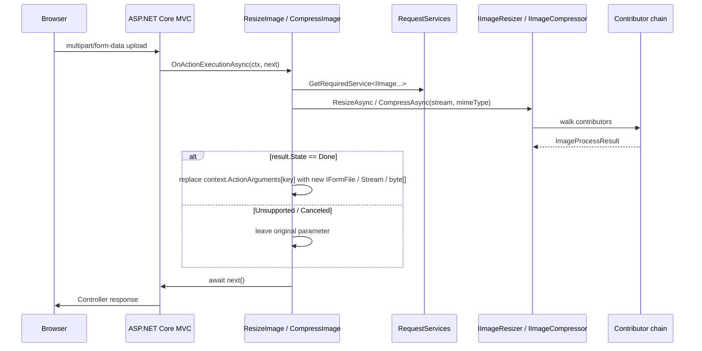

The ABP Framework `Volo.Abp.Imaging.AspNetCore` package exposes two MVC action filters — `ResizeImageAttribute` and `CompressImageAttribute` — that automatically rewrite `IFormFile`, `IRemoteStreamContent`, `Stream` and `byte[]` action parameters through the `IImageResizer` / `IImageCompressor` services. Decorate an upload endpoint with `[ResizeImage(...)]` or `[CompressImage(...)]` and incoming files are transformed before your controller code runs — no manual orchestration required.

This module does not add any new HTTP endpoints; instead, it ties the imaging pipeline (`Volo.Abp.Imaging.Abstractions` + a provider like `Volo.Abp.Imaging.ImageSharp`) into ASP.NET Core MVC's action-execution pipeline.

## Package layout

Three files under `framework/src/Volo.Abp.Imaging.AspNetCore/Volo/Abp/Imaging/`:

| File | Purpose |
| --- | --- |
| `AbpImagingAspNetCoreModule.cs` | Module class, depends on `AbpImagingAbstractionsModule` |
| `ResizeImageAttribute.cs` | `ActionFilterAttribute` that resizes file/stream parameters |
| `CompressImageAttribute.cs` | `ActionFilterAttribute` that compresses file/stream parameters |

## AbpImagingAspNetCoreModule

```csharp
[DependsOn(typeof(AbpImagingAbstractionsModule))]
public class AbpImagingAspNetCoreModule : AbpModule
{

}
```

(`framework/src/Volo.Abp.Imaging.AspNetCore/Volo/Abp/Imaging/AbpImagingAspNetCoreModule.cs`)

The module ships no services and no `ConfigureServices` body. Everything works through the two attributes, which resolve `IImageResizer` / `IImageCompressor` from `HttpContext.RequestServices` lazily — so the resolver picks up whichever provider you also referenced (`AbpImagingImageSharpModule`, `AbpImagingMagickNetModule`, etc.).

You must depend on **both** `AbpImagingAspNetCoreModule` and a concrete provider module:

```csharp
[DependsOn(
    typeof(AbpImagingAspNetCoreModule),
    typeof(AbpImagingImageSharpModule)
)]
public class MyWebModule : AbpModule { }
```

Without the provider, the coordinator returns `ImageProcessState.Unsupported` and the filter leaves the upload unchanged.

## ResizeImageAttribute

`ResizeImageAttribute` (`framework/src/Volo.Abp.Imaging.AspNetCore/Volo/Abp/Imaging/ResizeImageAttribute.cs`) is an `ActionFilterAttribute` with two constructors and a configurable `Mode`:

```csharp
public uint?            Width      { get; }
public uint?            Height     { get; }
public ImageResizeMode  Mode       { get; set; }
public string[]         Parameters { get; }

public ResizeImageAttribute(uint width, uint height, params string[] parameters);
public ResizeImageAttribute(uint size, params string[] parameters);
```

- `Width` / `Height` — the target dimensions in pixels.
- `Mode` — defaults to `ImageResizeMode.None` (= `ImageResizeMode.Default` if the global `ImageResizeOptions.DefaultResizeMode` was set); see [Overview](./overview) for the resize-mode catalog. Set it through an object-initializer when applying the attribute.
- `Parameters` — names of action parameters to resize. If omitted, **every** action parameter is considered.
- Second constructor: `[ResizeImage(256)]` is a shorthand for `[ResizeImage(256, 256)]`.

### Filter logic

```csharp
public override async Task OnActionExecutionAsync(
    ActionExecutingContext context, ActionExecutionDelegate next)
{
    var parameters = Parameters.Any()
        ? context.ActionArguments.Where(x => Parameters.Contains(x.Key)).ToArray()
        : context.ActionArguments.ToArray();

    var imageResizer = context.HttpContext.RequestServices
        .GetRequiredService<IImageResizer>();

    foreach (var (key, value) in parameters)
    {
        object? resizedValue = value switch
        {
            IFormFile file             => await ResizeImageAsync(file, imageResizer),
            IRemoteStreamContent rsc   => await ResizeImageAsync(rsc, imageResizer),
            Stream stream              => await ResizeImageAsync(stream, imageResizer),
            IEnumerable<byte> bytes    => await ResizeImageAsync(bytes.ToArray(), imageResizer),
            _ => null
        };

        if (resizedValue != null)
            context.ActionArguments[key] = resizedValue;
    }

    await next();
}
```

The filter mutates `context.ActionArguments` before `next()` is awaited — so by the time your controller's `Task<...>` runs, the parameter already holds the resized payload.

### IFormFile handling

```csharp
protected virtual async Task<IFormFile> ResizeImageAsync(IFormFile file, IImageResizer imageResizer)
{
    if (file.Headers == null || file.ContentType == null || !file.ContentType.StartsWith("image/"))
        return file;

    var result = await imageResizer.ResizeAsync(
        file.OpenReadStream(),
        new ImageResizeArgs(Width, Height, Mode),
        file.ContentType);

    if (result.State != ImageProcessState.Done)
        return file;

    return new FormFile(result.Result, 0, result.Result.Length, file.Name, file.FileName)
    {
        Headers = file.Headers,
    };
}
```

Notes:

- The MIME-type check `ContentType.StartsWith("image/")` rules out form fields that aren't image uploads, so adding `[ResizeImage]` to an action with mixed parameters is safe.
- A successful resize replaces the `IFormFile` with a new `FormFile` constructed around the resized stream — `Headers` (so `Content-Disposition` and length-related headers stay sensible) and the original `Name` / `FileName` are preserved.
- Any state other than `Done` (`Unsupported`, `Canceled`) leaves the original `IFormFile` in place.

### IRemoteStreamContent handling

`IRemoteStreamContent` is ABP's abstraction for streamed file content shared between HTTP and gRPC channels (see `framework/src/Volo.Abp.Content/Volo/Abp/Content/IRemoteStreamContent.cs`). When the parameter is an `IRemoteStreamContent`:

```csharp
var result = await imageResizer.ResizeAsync(
    remoteStreamContent.GetStream(),
    new ImageResizeArgs(Width, Height, Mode),
    remoteStreamContent.ContentType);

// dispose the original and return a new RemoteStreamContent
remoteStreamContent.Dispose();
return new RemoteStreamContent(result.Result, fileName, contentType);
```

The original stream is disposed only after a successful resize.

### Stream / byte[] handling

For raw `Stream` arguments, the filter disposes the original after success and returns the resized stream. For `byte[]` (or `IEnumerable<byte>`) it returns `result.Result` directly — the input array is GC'd.

## CompressImageAttribute

`CompressImageAttribute` (`framework/src/Volo.Abp.Imaging.AspNetCore/Volo/Abp/Imaging/CompressImageAttribute.cs`) is structurally identical to `ResizeImageAttribute` but it has no width/height/mode and it calls `IImageCompressor.CompressAsync` instead:

```csharp
public string[] Parameters { get; }
public CompressImageAttribute(params string[] parameters);
```

The four-way switch on `IFormFile` / `IRemoteStreamContent` / `Stream` / `byte[]` is the same. The compress contributor decides whether to encode at default quality (ImageSharp's `Quality = 75`, Magick.NET's options) and whether to short-circuit when the output is larger than the input (the `Canceled` path) — see [ImageSharp](./imagesharp) and [Magick.NET](./magicknet) for provider details.

```csharp
protected virtual async Task<IFormFile> CompressImageAsync(IFormFile file, IImageCompressor imageCompressor)
{
    if (file.Headers == null || file.ContentType == null || !file.ContentType.StartsWith("image/"))
        return file;

    var result = await imageCompressor.CompressAsync(file.OpenReadStream(), file.ContentType);
    if (result.State != ImageProcessState.Done) return file;

    return new FormFile(result.Result, 0, result.Result.Length, file.Name, file.FileName)
    {
        Headers = file.Headers,
    };
}
```

## Pipeline visualized



## Usage recipes

### Resize an uploaded avatar to 256×256

```csharp
public class AvatarController : AbpController
{
    [HttpPost("avatars")]
    [ResizeImage(256, 256, "file", Mode = ImageResizeMode.Crop)]
    public async Task<IActionResult> UploadAsync(IFormFile file)
    {
        // 'file' is now a 256x256 JPEG/PNG/WebP (whatever was uploaded)
        await using var ms = new MemoryStream();
        await file.CopyToAsync(ms);
        await _store.SaveAsync(ms.ToArray());
        return Ok();
    }
}
```

`Mode = ImageResizeMode.Crop` is passed through the constructor-initialized `Mode` property — the contributor center-crops to the exact target.

### Compress a banner before saving

```csharp
[HttpPost("banners")]
[CompressImage("file")]
public async Task<IActionResult> UploadAsync(IFormFile file) { ... }
```

The filter calls `IImageCompressor.CompressAsync` and replaces `file` with a smaller `FormFile` when compression succeeds. If the file is already optimal (`Canceled`) or in an unsupported format (`Unsupported`), the original `IFormFile` flows through unchanged.

### Composing resize + compress

Stack the attributes; filter order in MVC is determined by attribute order (top-down). Place `[ResizeImage]` before `[CompressImage]` so the smaller bitmap is what gets compressed:

```csharp
[HttpPost("photos")]
[ResizeImage(1024, 1024, "file", Mode = ImageResizeMode.Max)]
[CompressImage("file")]
public Task<IActionResult> UploadAsync(IFormFile file) { ... }
```

`ImageResizeMode.Max` scales so the longest edge becomes 1024 pixels (preserving aspect ratio), then `[CompressImage]` re-encodes at the configured JPEG/PNG/WebP quality.

### Multiple file uploads

The attributes operate on any parameter whose name matches the `Parameters` argument list. To resize every parameter, omit the list:

```csharp
[HttpPost("set")]
[ResizeImage(512)]
public Task<IActionResult> UploadSetAsync(IFormFile cover, IFormFile thumbnail) { ... }
```

For a single named parameter, pass its name:

```csharp
[ResizeImage(512, "cover")]
public Task<IActionResult> UploadAsync(IFormFile cover, IFormFile preview) { ... }
```

`preview` is left untouched.

## RequestSizeLimit

Neither attribute alters the request body size limit. ASP.NET Core enforces it before the model binder runs and before this filter sees anything. Configure the limit explicitly with `[RequestSizeLimit(...)]` / `[RequestFormLimits(...)]` on the action or globally through `IISServerOptions` / Kestrel options. The imaging filters operate on already-buffered `IFormFile`s.

## Notes and limitations

- The filter only knows about `IFormFile`, `IRemoteStreamContent`, `Stream` and `IEnumerable<byte>` — wrappers like `IFormFileCollection` are not unwrapped automatically. Iterate yourself if you receive a list.
- The MIME-type sniff is based on `IFormFile.ContentType`, which is browser-supplied. For untrusted uploads, validate by sniffing magic bytes before relying on the `[ResizeImage]` output.
- The `Mode` property is `set`-only on the attribute, not an argument of the constructor — set it through an object initializer (`[ResizeImage(256, 256) { Mode = ImageResizeMode.Crop }]`) or through C# attribute syntax (`[ResizeImage(256, 256, Mode = ImageResizeMode.Crop)]`).
- There is **no built-in HTTP endpoint** at `/api/abp/image` — the module ships only the filters. Resize/compress endpoints are owned by individual feature modules (blob storage, file management) that build URLs over `IImageResizer` themselves.

## Reference

| Type | File |
| --- | --- |
| `AbpImagingAspNetCoreModule` | `framework/src/Volo.Abp.Imaging.AspNetCore/Volo/Abp/Imaging/AbpImagingAspNetCoreModule.cs` |
| `ResizeImageAttribute` | `framework/src/Volo.Abp.Imaging.AspNetCore/Volo/Abp/Imaging/ResizeImageAttribute.cs` |
| `CompressImageAttribute` | `framework/src/Volo.Abp.Imaging.AspNetCore/Volo/Abp/Imaging/CompressImageAttribute.cs` |
