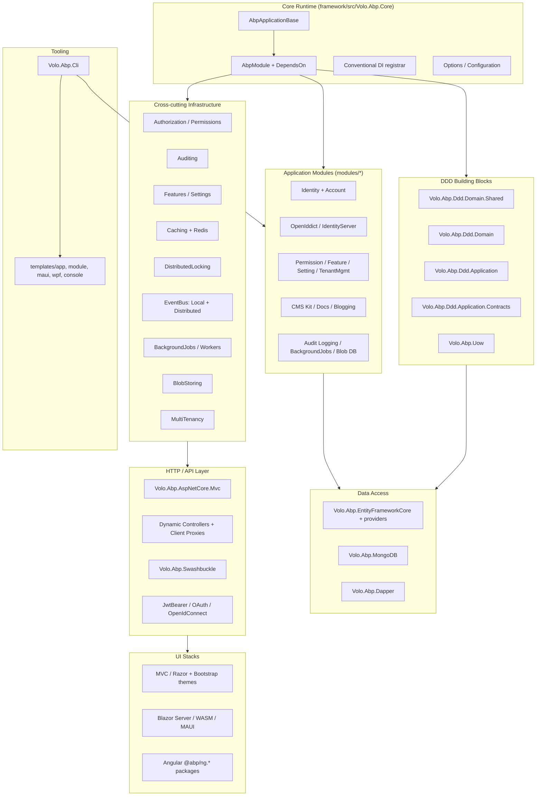

This wiki is an internal engineering reference for the [`abpframework/abp`](https://github.com/abpframework/abp) monorepo. ABP is an opinionated modular framework for ASP.NET Core that ships a runtime (`Volo.Abp.Core`), DDD building blocks, cross-cutting infrastructure, ~19 application modules, MVC / Blazor / Angular / MAUI UI stacks, and the `abp` CLI. Every page below maps directly to source under `framework/`, `modules/`, `templates/`, `npm/`, or `tools/` and is designed for coding agents that need to make precise changes without grepping the whole repo first.

## Architecture at a glance

## Repository map

| Path | What lives here | Wiki entry |
| --- | --- | --- |
| `framework/src/` | 177 framework packages (`Volo.Abp.*`) - core runtime, DDD, infra | [Core Runtime](/core/overview), [Repository Layout](/overview/repository-layout) |
| `framework/test/` | Framework-level test projects | [Testing](/testing/framework-tests) |
| `modules/` | 19 reusable application modules (Identity, CMS Kit, ...) | [Repository Layout](/overview/repository-layout) |
| `templates/` | Startup templates: `app`, `app-nolayers`, `console`, `maui`, `module`, `wpf` | [Templates](/templates/overview) |
| `npm/ng-packs/` | Angular `@abp/ng.*` packages (core, identity, OAuth, schematics, ...) | [Angular](/angular/overview) |
| `npm/packs/` | Vendored MVC UI npm packages (bootstrap, jQuery, sweetalert2, ...) | [MVC UI](/mvc-ui/overview) |
| `studio/source-codes/` | `*.SourceCode` packages used by ABP Studio for source-include workflow | [Repository Layout](/overview/repository-layout) |
| `tools/` | NuGet helper, localization-key synchronizer, changelog generator | [Build, Deploy & Tools](/build/overview) |
| `build/` | `build-all.ps1`, `build-all-release.ps1`, `test-all.ps1` | [Build scripts](/build/build-scripts) |
| `deploy/` | Numbered release pipeline scripts (NuGet pack/push, npm publish, GitHub release) | [Deploy scripts](/build/deploy-scripts) |
| `apiSpec/` | API descriptors emitted by ABP (consumed by Studio / Suite) | [Repository Layout](/overview/repository-layout) |
| `docs/en/` | Source of [abp.io/docs](https://abp.io/docs) user-facing docs (not regenerated here) | [Repository Layout](/overview/repository-layout) |
| `Directory.Packages.props`, `global.json`, `common.props` | Central package management, SDK pin (10.0.100) | [Build & Tooling](/overview/build-and-tooling) |

## Subsystem map

<CardGroup cols={2}>
  <Card title="Core Runtime" icon="microchip" href="/core/overview">
    `Volo.Abp.Core` - `AbpApplicationBase`, module loader, DI, options, virtual file system.
  </Card>
  <Card title="DDD Building Blocks" icon="cubes" href="/ddd/overview">
    Entity, AggregateRoot, IRepository, ApplicationService, IUnitOfWork.
  </Card>
  <Card title="Cross-Cutting Concerns" icon="layer-group" href="/concerns/overview">
    Auditing, Authorization, Features, Settings, Validation, ObjectMapping.
  </Card>
  <Card title="Data Access" icon="database" href="/data/overview">
    EF Core (5 providers), MongoDB, Dapper, MemoryDb, data filters, seeding.
  </Card>
  <Card title="Multi-Tenancy" icon="building" href="/tenancy/overview">
    `ICurrentTenant`, `ITenantResolver`, AspNetCore middleware, TenantManagement module.
  </Card>
  <Card title="Caching & Locking" icon="bolt" href="/caching/overview">
    `IDistributedCache<T>`, StackExchange.Redis, `IAbpDistributedLock` (Medallion, Dapr).
  </Card>
  <Card title="Event Bus" icon="tower-broadcast" href="/events/overview">
    Local + Distributed bus, RabbitMQ / Kafka / Azure Service Bus / Dapr / Rebus.
  </Card>
  <Card title="Background Jobs & Workers" icon="clock-rotate-left" href="/jobs/overview">
    `IBackgroundJobManager`, Hangfire, Quartz, RabbitMQ, TickerQ, workers.
  </Card>
  <Card title="HTTP & API Layer" icon="network-wired" href="/http/overview">
    MVC pipeline, dynamic controllers, dynamic client proxies, Swashbuckle, JWT/OAuth/OIDC.
  </Card>
  <Card title="UI: MVC" icon="window-maximize" href="/mvc-ui/overview">
    Bootstrap theming, theme-shared, bundling, widgets, navigation.
  </Card>
  <Card title="UI: Blazor" icon="fire-flame-curved" href="/blazor/overview">
    Server, WebAssembly, MAUI Blazor, MudBlazor + Blazorise theming.
  </Card>
  <Card title="UI: Angular" icon="angular" href="/angular/overview">
    `@abp/ng.core`, OAuth, schematics, identity / account / tenant / setting management UIs.
  </Card>
  <Card title="BLOB Storing" icon="hard-drive" href="/blob/overview">
    FileSystem, Azure, AWS S3, Google, Aliyun, Minio, Bunny, in-memory, database.
  </Card>
  <Card title="Localization & Timing" icon="globe" href="/localization/overview">
    `IStringLocalizer`, virtual JSON resources, `IClock`, time zones.
  </Card>
  <Card title="Imaging" icon="image" href="/imaging/overview">
    ImageSharp, SkiaSharp, Magick.NET, AspNetCore image endpoints.
  </Card>
  <Card title="AI" icon="robot" href="/ai/overview">
    `Volo.Abp.AI.Abstractions` chat clients and orchestration.
  </Card>
  <Card title="Identity Module" icon="user-shield" href="/module-identity/overview">
    `IdentityUser`, `IdentityRole`, claims, organization units, `Volo.Abp.Identity.*`.
  </Card>
  <Card title="Account Module" icon="user" href="/module-account/overview">
    Login / register flows for OpenIddict & IdentityServer hosts.
  </Card>
  <Card title="OpenIddict Module" icon="key" href="/module-openiddict/overview">
    Applications, Authorizations, Scopes, Tokens, AspNetCore handlers.
  </Card>
  <Card title="IdentityServer Module" icon="id-card" href="/module-identityserver/overview">
    Legacy IdentityServer4 client/scope/grant entities.
  </Card>
  <Card title="Tenant / Permission / Setting / Feature" icon="sliders" href="/psf/permission-management">
    Definition + store + management UI for each.
  </Card>
  <Card title="CMS Kit" icon="newspaper" href="/module-cms-kit/overview">
    Blogs, Pages, Tags, Comments, Reactions, MediaDescriptor.
  </Card>
  <Card title="Docs Module" icon="book" href="/module-docs/overview">
    Project + Document entities, GitHub/file-system stores.
  </Card>
  <Card title="ABP CLI" icon="terminal" href="/cli/overview">
    `Program.cs`, `CommandSelector`, 40 commands under `Volo.Abp.Cli.Commands`.
  </Card>
  <Card title="Startup Templates" icon="folder-tree" href="/templates/overview">
    Layered app, no-layers, console, MAUI, module, WPF.
  </Card>
  <Card title="Build, Deploy & Tools" icon="hammer" href="/build/overview">
    PowerShell pipeline, NuGet helper, localization sync.
  </Card>
  <Card title="Key Flows" icon="diagram-project" href="/flows/application-startup">
    Boot, request lifecycle, UoW, event publish, job execution, auth, tenancy.
  </Card>
</CardGroup>

## Where to start

<Note>
New to the codebase? Read these in order:

1. [Architecture](/overview/architecture) - subsystem boundaries, module dependency graph.
2. [Repository Layout](/overview/repository-layout) - annotated directory tree across `framework/`, `modules/`, `templates/`, `npm/`.
3. [Application Startup flow](/flows/application-startup) - how `AbpApplicationBase` (`framework/src/Volo.Abp.Core/Volo/Abp/AbpApplicationBase.cs`) walks the module graph and runs the lifecycle contributors.
4. [Modularity](/core/modularity) - `AbpModule`, `DependsOnAttribute`, `IModuleLoader` - the heart of how ABP composes.
5. [DDD Building Blocks](/ddd/overview) - the contract every module follows: Domain.Shared -> Domain -> Application.Contracts -> Application -> HttpApi -> EF Core/Mongo -> Web/Blazor.
</Note>

### Key entry points

| Concern | File |
| --- | --- |
| Host bootstrap | `framework/src/Volo.Abp.Core/Volo/Abp/AbpApplicationBase.cs` |
| Module base class | `framework/src/Volo.Abp.Core/Volo/Abp/Modularity/AbpModule.cs` |
| Module dependency declaration | `framework/src/Volo.Abp.Core/Volo/Abp/Modularity/DependsOnAttribute.cs` |
| Conventional DI registrar | `framework/src/Volo.Abp.Core/Volo/Abp/DependencyInjection/DefaultConventionalRegistrar.cs` |
| Repository base contract | `framework/src/Volo.Abp.Ddd.Domain/Volo/Abp/Domain/Repositories/IRepository.cs` |
| Aggregate root | `framework/src/Volo.Abp.Ddd.Domain/Volo/Abp/Domain/Entities/AggregateRoot.cs` |
| Application service base | `framework/src/Volo.Abp.Ddd.Application/Volo/Abp/Application/Services/ApplicationService.cs` |
| Unit of Work manager | `framework/src/Volo.Abp.Uow/Volo/Abp/Uow/IUnitOfWorkManager.cs` |
| Local event bus | `framework/src/Volo.Abp.EventBus/Volo/Abp/EventBus/Local/ILocalEventBus.cs` |
| Distributed event bus | `framework/src/Volo.Abp.EventBus/Volo/Abp/EventBus/Distributed/IDistributedEventBus.cs` |
| MVC entry module | `framework/src/Volo.Abp.AspNetCore.Mvc/Volo/Abp/AspNetCore/Mvc/AbpAspNetCoreMvcModule.cs` |
| CLI entry | `framework/src/Volo.Abp.Cli/Volo/Abp/Cli/Program.cs` |

<Tip>
Most pages in this wiki list "Key abstractions" and "File inventory" tables. When you need to make a change, scan that table first and jump to the file - the wiki page exists to spare you a `grep -R` sweep, not to replace reading the source.
</Tip>
