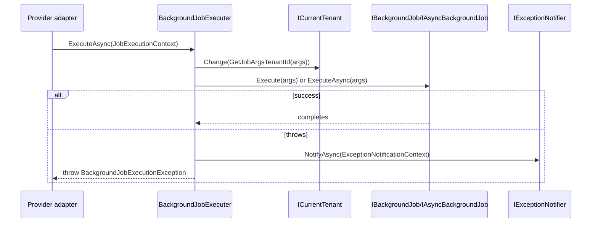
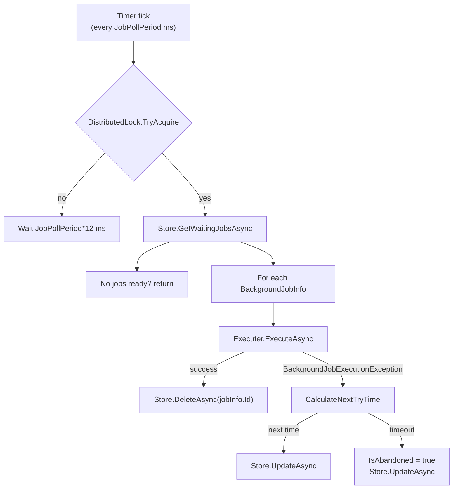

The **Background Jobs Core** of ABP Framework lives in two adjacent
packages: `framework/src/Volo.Abp.BackgroundJobs.Abstractions/` defines
the public contract that every provider implements, and
`framework/src/Volo.Abp.BackgroundJobs/` ships the default
implementation — a polling worker (`BackgroundJobWorker`) that drains a
pluggable `IBackgroundJobStore`. This page walks every type, distinguishes
"abstraction" from "default implementation", and links each behavior to
the source file that owns it.

## Where the boundary sits

`AbpBackgroundJobsAbstractionsModule` only registers the contract and
`NullBackgroundJobManager`. The default polling implementation lives in
`AbpBackgroundJobsModule`
(`Volo.Abp.BackgroundJobs/Volo/Abp/BackgroundJobs/AbpBackgroundJobsModule.cs`),
which `DependsOn` the abstractions plus `AbpBackgroundWorkersModule`,
`AbpTimingModule`, `AbpGuidsModule`,
`AbpDistributedLockingAbstractionsModule`, and `AbpMultiTenancyModule`.
Provider integrations (Hangfire, Quartz, RabbitMQ, TickerQ) only depend
on the *Abstractions* package — that's the contract you implement.

| Package | Provides |
| --- | --- |
| `Volo.Abp.BackgroundJobs.Abstractions` | `IBackgroundJobManager`, `IBackgroundJobExecuter`, `BackgroundJobExecuter`, `IBackgroundJob<TArgs>`, `IAsyncBackgroundJob<TArgs>`, `BackgroundJob<TArgs>`, `AsyncBackgroundJob<TArgs>`, `AbpBackgroundJobOptions`, `BackgroundJobConfiguration`, `BackgroundJobNameAttribute`, `JobExecutionContext`, `BackgroundJobPriority`, `BackgroundJobExecutionException`, `NullBackgroundJobManager`, and the dynamic-job pipeline. |
| `Volo.Abp.BackgroundJobs` | `DefaultBackgroundJobManager`, `IBackgroundJobStore` / `InMemoryBackgroundJobStore`, `IBackgroundJobSerializer` / `JsonBackgroundJobSerializer`, `BackgroundJobInfo`, `IBackgroundJobWorker` / `BackgroundJobWorker`, `AbpBackgroundJobWorkerOptions`. |

## The `IBackgroundJobManager` contract

`IBackgroundJobManager` in
`Volo.Abp.BackgroundJobs.Abstractions/Volo/Abp/BackgroundJobs/IBackgroundJobManager.cs`
is the single entry point every provider implements. The method
signature is intentionally minimal — `args`, optional `priority`, and
optional `delay` — and returns the provider-specific job id as a string:

```csharp
public interface IBackgroundJobManager
{
    Task<string> EnqueueAsync<TArgs>(
        TArgs args,
        BackgroundJobPriority priority = BackgroundJobPriority.Normal,
        TimeSpan? delay = null
    );
}
```

The `BackgroundJobManagerExtensions` file in the same folder layers
convenience helpers such as `IsAvailable()` so callers can branch on
whether a real provider is registered — this is the contract referenced
by the error message in `NullBackgroundJobManager.EnqueueAsync`.

`NullBackgroundJobManager` is registered with
`[Dependency(TryRegister = true)]` and `ISingletonDependency`, so any
provider that registers its own manager with
`[Dependency(ReplaceServices = true)]` (the pattern used by
`DefaultBackgroundJobManager`, `HangfireBackgroundJobManager`,
`QuartzBackgroundJobManager`, `RabbitMqBackgroundJobManager`,
`AbpTickerQBackgroundJobManager`) replaces the null with a working
implementation.

## Defining a job: `IBackgroundJob<TArgs>` and `IAsyncBackgroundJob<TArgs>`

Jobs are parameterised by their **argument type**. The two interfaces in
`IBackgroundJob.cs` and `IAsyncBackgroundJob.cs` look almost identical:

```csharp
public interface IBackgroundJob<in TArgs>     { void Execute(TArgs args); }
public interface IAsyncBackgroundJob<in TArgs> { Task ExecuteAsync(TArgs args); }
```

The matching abstract base classes — `BackgroundJob<TArgs>` and
`AsyncBackgroundJob<TArgs>` — provide an injected
`ILogger<...>` (defaulting to `NullLogger<...>`) and leave the body
abstract. The `//TODO: Add UOW, Localization, CancellationTokenProvider
and other useful properties..?` comment in both files is genuine
framework source — those concerns are layered on top by
`BackgroundJobExecuter` rather than by the base class.

## Naming jobs: `BackgroundJobNameAttribute`

The framework needs a stable string to round-trip a job through any
persistent store. That's `BackgroundJobNameAttribute` in
`BackgroundJobNameAttribute.cs`, which implements
`IBackgroundJobNameProvider` (defined alongside in
`IBackgroundJobNameProvider.cs`). The static `GetName(Type)` helper
looks for the attribute on the **args** type and falls back to the args
type's `FullName`:

```csharp
public static string GetName([NotNull] Type jobArgsType)
{
    return (jobArgsType
                .GetCustomAttributes(true)
                .OfType<IBackgroundJobNameProvider>()
                .FirstOrDefault()
                ?.Name
            ?? jobArgsType.FullName)!;
}
```

`AbpBackgroundJobOptions.GetBackgroundJobName` defaults to that delegate,
so renaming or moving an args type without a `[BackgroundJobName(...)]`
will break already-queued jobs. Annotate stable args types when
deploying to production.

## Registering jobs: `AbpBackgroundJobOptions` and `BackgroundJobConfiguration`

`AbpBackgroundJobOptions` is the options object that every provider
reads. Internally it keeps two dictionaries keyed by **args type** and
**job name**, plus an `IsJobExecutionEnabled` toggle and the
`GetBackgroundJobName` delegate. Registration goes through `AddJob<TJob>()`
or `AddJob(Type jobType)`, which delegates to
`BackgroundJobArgsHelper.GetJobArgsType` to find the closed
`IBackgroundJob<>` / `IAsyncBackgroundJob<>` parameter:

```csharp
public void AddJob(Type jobType)
{
    AddJob(new BackgroundJobConfiguration(
        jobType,
        GetBackgroundJobName(BackgroundJobArgsHelper.GetJobArgsType(jobType))));
}
```

`BackgroundJobConfiguration` (in `BackgroundJobConfiguration.cs`) stores
the triple `(ArgsType, JobType, JobName)`. Providers look up entries by
either side — Hangfire and Quartz adapters resolve `JobType` from
`Options.GetJob(typeof(TArgs))`, while the default worker calls
`Options.GetJob(jobInfo.JobName)` to walk back from the stored row.

<Info>
  ABP only auto-discovers jobs that you opt in via `AddJob<...>()`. There
  is **no convention** that scans the assembly for `IBackgroundJob<>`
  implementations — `AbpBackgroundJobOptions.GetJobs()` returns only what
  you registered.
</Info>

## Executing a job: `IBackgroundJobExecuter` and `JobExecutionContext`

Every provider that ships in the framework eventually delegates to
`IBackgroundJobExecuter.ExecuteAsync(JobExecutionContext)`. The default
implementation is `BackgroundJobExecuter` in
`BackgroundJobExecuter.cs` — a single class that does five things:

1. Resolves the job from `context.ServiceProvider.GetService(context.JobType)`,
   throwing `AbpException` if missing.
2. Finds either `Execute` (for `IBackgroundJob<TArgs>`) or `ExecuteAsync`
   (for `IAsyncBackgroundJob<TArgs>`) by reflection.
3. Wraps the invocation in `ICurrentTenant.Change(GetJobArgsTenantId(context.JobArgs))`
   — if the args implement `IMultiTenant`, their `TenantId` is honored;
   otherwise the current tenant flows through unchanged.
4. Wraps the invocation in `ICancellationTokenProvider.Use(context.CancellationToken)`
   so framework code inside the job sees the right token.
5. On exception, notifies `IExceptionNotifier` and re-throws a
   `BackgroundJobExecutionException` (`BackgroundJobExecutionException.cs`)
   carrying `JobType` and `JobArgs`.

`JobExecutionContext` (in `JobExecutionContext.cs`) is the DTO that
carries `ServiceProvider`, `JobType`, `JobArgs`, and an optional
`CancellationToken` — providers construct it inside a freshly-created DI
scope. The class implements `IServiceProviderAccessor`.



## Priorities

`BackgroundJobPriority` in `BackgroundJobPriority.cs` is a `byte` enum
with five steps: `Low=5`, `BelowNormal=10`, `Normal=15` (default),
`AboveNormal=20`, `High=25`. The numeric spacing leaves headroom for
custom priorities. The default DB store orders waiting jobs by
`Priority DESC, TryCount ASC, NextTryTime ASC` (see
`InMemoryBackgroundJobStore.GetWaitingJobsAsync` and the EF Core
equivalent `EfCoreBackgroundJobRepository.GetWaitingListQueryAsync` in
the persistence module). Other providers either map it (TickerQ →
`TickerTaskPriority`) or document the gap (RabbitMQ's
`JobQueue.PublishAsync` contains an explicit `// TODO: How to handle
priority`).

## Default storage: `IBackgroundJobStore` and `BackgroundJobInfo`

`IBackgroundJobStore` in
`Volo.Abp.BackgroundJobs/Volo/Abp/BackgroundJobs/IBackgroundJobStore.cs`
is the storage seam:

```csharp
public interface IBackgroundJobStore
{
    Task<BackgroundJobInfo> FindAsync(Guid jobId);
    Task InsertAsync(BackgroundJobInfo jobInfo);
    Task<List<BackgroundJobInfo>> GetWaitingJobsAsync(string? applicationName, int maxResultCount);
    Task DeleteAsync(Guid jobId);
    Task UpdateAsync(BackgroundJobInfo jobInfo);
}
```

The XML doc on `GetWaitingJobsAsync` is the canonical specification any
implementation must satisfy: "Conditions: `ApplicationName ==
applicationName` And `!IsAbandoned` And `NextTryTime <= Clock.Now`. Order
by: `Priority DESC, TryCount ASC, NextTryTime ASC`."

`BackgroundJobInfo` (in `BackgroundJobInfo.cs`) is the persistence DTO:
`Id`, `ApplicationName`, `JobName`, `JobArgs` (string),
`TryCount`, `CreationTime`, `NextTryTime`, `LastTryTime`, `IsAbandoned`,
`Priority`. It defaults `Priority` to `BackgroundJobPriority.Normal` in
its constructor.

Two stores ship in the framework:

- `InMemoryBackgroundJobStore` (in `InMemoryBackgroundJobStore.cs`),
  registered as `ISingletonDependency`, uses a `ConcurrentDictionary<Guid,
  BackgroundJobInfo>` and is the **default** if no persistence module is
  referenced. Its `UpdateAsync` shortcuts to `DeleteAsync` when
  `jobInfo.IsAbandoned` is true so memory doesn't grow.
- `BackgroundJobStore` in
  `modules/background-jobs/src/Volo.Abp.BackgroundJobs.Domain/Volo/Abp/BackgroundJobs/BackgroundJobStore.cs`
  is the EF Core / MongoDB-backed implementation supplied by the
  `background-jobs` module — see [Jobs Module](/jobs/background-jobs-module).

## Default serialization: `IBackgroundJobSerializer`

`IBackgroundJobSerializer` (in `IBackgroundJobSerializer.cs`) is the
JSON seam used by `DefaultBackgroundJobManager` to encode `JobArgs` into
the string column on `BackgroundJobInfo` and by `BackgroundJobWorker` to
decode it. `JsonBackgroundJobSerializer` (in `JsonBackgroundJobSerializer.cs`)
delegates to `Volo.Abp.Json.IJsonSerializer`, so it respects whatever
JSON provider the host has configured (System.Text.Json by default).
Provider integrations bypass this — Hangfire uses its own serializer,
RabbitMQ uses `IRabbitMqSerializer`, Quartz and TickerQ use
`IJsonSerializer` directly.

## Default manager: `DefaultBackgroundJobManager`

`DefaultBackgroundJobManager` in
`Volo.Abp.BackgroundJobs/Volo/Abp/BackgroundJobs/DefaultBackgroundJobManager.cs`
is the implementation behind `IBackgroundJobManager` when no broker
provider is referenced. Its `EnqueueAsync<TArgs>` builds a
`BackgroundJobInfo` with a fresh `IGuidGenerator.Create()` id, the
configured `ApplicationName` from `AbpBackgroundJobWorkerOptions`, the
JSON-serialized args, the priority, and `NextTryTime = Clock.Now +
delay`, then calls `Store.InsertAsync(jobInfo)`:

```csharp
[Dependency(ReplaceServices = true)]
public class DefaultBackgroundJobManager : IBackgroundJobManager, ITransientDependency
{
    public virtual async Task<string> EnqueueAsync<TArgs>(
        TArgs args,
        BackgroundJobPriority priority = BackgroundJobPriority.Normal,
        TimeSpan? delay = null)
    {
        var jobName = BackgroundJobOptions.Value.GetBackgroundJobName(typeof(TArgs));
        var jobId = await EnqueueAsync(jobName, args!, priority, delay);
        return jobId.ToString();
    }
}
```

Because it is `ITransientDependency` you can resolve a fresh instance
per scope; because the registration uses `[Dependency(ReplaceServices =
true)]`, it overrides `NullBackgroundJobManager` whenever
`AbpBackgroundJobsModule` is referenced.

## The polling worker: `BackgroundJobWorker`

`BackgroundJobWorker` in `BackgroundJobWorker.cs` is an
`AsyncPeriodicBackgroundWorkerBase` — that's the bridge between the
job system and the worker system. It is registered as
`IBackgroundJobWorker` (a marker interface defined in
`IBackgroundJobWorker.cs`) and added by
`AbpBackgroundJobsModule.OnApplicationInitializationAsync` via
`context.AddBackgroundWorkerAsync<IBackgroundJobWorker>()`, but only
when `AbpBackgroundJobOptions.IsJobExecutionEnabled` is `true`.

Each tick (`Timer.Period = WorkerOptions.JobPollPeriod`) the worker:

1. Acquires the distributed lock named `WorkerOptions.DistributedLockName`
   ("AbpBackgroundJobWorker" by default) via `IAbpDistributedLock.TryAcquireAsync`.
   If the lock can't be acquired it sleeps for `JobPollPeriod * 12` ms and
   yields — that's the multi-instance back-off.
2. Calls `IBackgroundJobStore.GetWaitingJobsAsync(ApplicationName,
   MaxJobFetchCount)` (default 1000) to pull due rows.
3. For each row: increments `TryCount`, stamps `LastTryTime = Clock.Now`,
   resolves the args type via `JobOptions.GetJob(jobInfo.JobName)`,
   deserializes `JobArgs` with `IBackgroundJobSerializer`, builds a
   `JobExecutionContext`, and calls `IBackgroundJobExecuter.ExecuteAsync`.
4. On success → `store.DeleteAsync(jobInfo.Id)`.
5. On `BackgroundJobExecutionException` → `CalculateNextTryTime` (see
   below) updates `NextTryTime` or sets `IsAbandoned = true` and calls
   `store.UpdateAsync(jobInfo)` (via `TryUpdateAsync`, which swallows
   exceptions to avoid breaking the loop).

### Retry math

`CalculateNextTryTime` implements an exponential back-off:

```csharp
var nextWaitDuration = WorkerOptions.DefaultFirstWaitDuration *
                       Math.Pow(WorkerOptions.DefaultWaitFactor, jobInfo.TryCount - 1);
var nextTryDate = jobInfo.LastTryTime?.AddSeconds(nextWaitDuration) ??
                  clock.Now.AddSeconds(nextWaitDuration);

if (nextTryDate.Subtract(jobInfo.CreationTime).TotalSeconds > WorkerOptions.DefaultTimeout)
{
    return null; // → IsAbandoned = true
}
return nextTryDate;
```

So with the defaults — `DefaultFirstWaitDuration = 60s`,
`DefaultWaitFactor = 2.0`, `DefaultTimeout = 172800s` (2 days) — a job
backs off 60s, 120s, 240s, … and is finally abandoned once the cumulative
elapsed time crosses two days.



## Worker tuning: `AbpBackgroundJobWorkerOptions`

`AbpBackgroundJobWorkerOptions` (in `AbpBackgroundJobWorkerOptions.cs`)
holds every knob that `BackgroundJobWorker` reads:

| Property | Default | Meaning |
| --- | --- | --- |
| `ApplicationName` | `null` | Scopes `IBackgroundJobStore.GetWaitingJobsAsync` so multiple apps can share a database. |
| `JobPollPeriod` | `5000` | Milliseconds between `BackgroundJobWorker` ticks (also the `AbpAsyncTimer.Period`). |
| `MaxJobFetchCount` | `1000` | Cap passed to `GetWaitingJobsAsync` per tick. |
| `DefaultFirstWaitDuration` | `60` seconds | Initial back-off after a failure. |
| `DefaultTimeout` | `172800` seconds | After this cumulative age a still-failing job is set `IsAbandoned`. |
| `DefaultWaitFactor` | `2.0` | Multiplied against the previous wait on every retry. |
| `DistributedLockName` | `"AbpBackgroundJobWorker"` | Key for `IAbpDistributedLock` so only one host polls at a time. |

The lock makes horizontal scale safe — every host runs `BackgroundJobWorker`,
but only the lock holder pulls rows.

## Dynamic background jobs

Alongside the strongly typed pipeline, the abstractions package exposes a
dynamic one for cases where you don't have a compile-time args type.
`DynamicBackgroundJobArgs` (in `DynamicBackgroundJobArgs.cs`),
`IDynamicBackgroundJobManager`, `DefaultDynamicBackgroundJobManager`,
`DynamicBackgroundJobHandler`, and
`DynamicBackgroundJobHandlerRegistry` (all in
`Volo.Abp.BackgroundJobs.Abstractions/Volo/Abp/BackgroundJobs/`) build a
parallel surface that registers handlers by name and dispatches them via
`DynamicBackgroundJobExecutorJob` — itself a regular
`IAsyncBackgroundJob<DynamicBackgroundJobArgs>` so the executor pipeline
is unchanged. The Hangfire dashboard name renderer in
`AbpDashboardOptionsProvider` already special-cases
`DynamicBackgroundJobArgs` so the UI shows the dynamic job name.

## When to keep `IsJobExecutionEnabled = false`

The toggle on `AbpBackgroundJobOptions` short-circuits both enqueue and
execution paths. `AbpBackgroundJobsModule.OnApplicationInitializationAsync`
only adds `IBackgroundJobWorker` when the flag is `true`. Provider
modules go further: `AbpBackgroundJobsHangfireModule.OnPreApplicationInitialization`
nullifies `AbpHangfireOptions.BackgroundJobServerFactory`,
`AbpBackgroundJobsQuartzModule.OnPreApplicationInitialization` replaces
`AbpQuartzOptions.StartSchedulerFactory` with a no-op, and the TickerQ
delegate in `AbpBackgroundJobsTickerQModule.GetTickerFunctionDelegate`
throws if a function fires while the flag is off. Disable it in
data-seeding hosts, migrators, or test fixtures that must enqueue
without dispatching.

## Summary

The abstractions package gives every provider a single point of
substitution (`IBackgroundJobManager`), a single executor shape
(`IBackgroundJobExecuter` + `JobExecutionContext`), and a single naming
contract (`BackgroundJobNameAttribute`). The default package adds a
production-ready DB-polling worker with distributed locking, exponential
back-off, and pluggable persistence — the next page,
[Jobs Module](/jobs/background-jobs-module), covers the EF Core /
MongoDB implementation that backs that worker.
