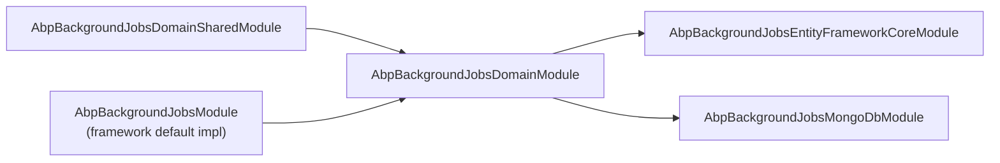

The **Background Jobs Module** in ABP Framework — sitting at
`modules/background-jobs/` — supplies the durable storage that backs
`Volo.Abp.BackgroundJobs.DefaultBackgroundJobManager` when you need
crash-safe queuing across restarts. Without this module the default
manager falls back to `InMemoryBackgroundJobStore` (covered in
[Jobs Core](/jobs/background-jobs-core)); with it, jobs land in a real
database via either EF Core or MongoDB and survive process recycles.

## Module layout

The module ships three orthogonal layers — domain shared, domain
(aggregate root + repository contract + store), and one persistence
adapter per supported database — mirroring the standard ABP DDD layering.

| Project | Folder | Responsibility |
| --- | --- | --- |
| `Volo.Abp.BackgroundJobs.Domain.Shared` | `modules/background-jobs/src/Volo.Abp.BackgroundJobs.Domain.Shared/Volo/Abp/BackgroundJobs/` | Constants only — `BackgroundJobRecordConsts` field-length defaults. |
| `Volo.Abp.BackgroundJobs.Domain` | `modules/background-jobs/src/Volo.Abp.BackgroundJobs.Domain/Volo/Abp/BackgroundJobs/` | `BackgroundJobRecord` aggregate root, `IBackgroundJobRepository`, `BackgroundJobStore` (which implements `IBackgroundJobStore`), and the Mapperly mappers between `BackgroundJobInfo` ↔ `BackgroundJobRecord`. |
| `Volo.Abp.BackgroundJobs.EntityFrameworkCore` | `modules/background-jobs/src/Volo.Abp.BackgroundJobs.EntityFrameworkCore/Volo/Abp/BackgroundJobs/EntityFrameworkCore/` | `BackgroundJobsDbContext`, `EfCoreBackgroundJobRepository`, `BackgroundJobsDbContextModelCreatingExtensions`. |
| `Volo.Abp.BackgroundJobs.MongoDB` | `modules/background-jobs/src/Volo.Abp.BackgroundJobs.MongoDB/Volo/Abp/BackgroundJobs/MongoDB/` | `BackgroundJobsMongoDbContext`, `MongoBackgroundJobRepository`. |
| `Volo.Abp.BackgroundJobs.Installer` | `modules/background-jobs/src/Volo.Abp.BackgroundJobs.Installer/Volo/Abp/BackgroundJobs/` | Empty installer module that wires the embedded files via `AbpVirtualFileSystemOptions.FileSets.AddEmbedded<...>()`. |

<Info>
  This page is a deep enough overview of the module to know what gets
  written and where; for the polling behavior that consumes it, see
  [Jobs Core](/jobs/background-jobs-core#default-storage-ibackgroundjobstore-and-backgroundjobinfo).
</Info>

## The aggregate root: `BackgroundJobRecord`

`BackgroundJobRecord` in
`modules/background-jobs/src/Volo.Abp.BackgroundJobs.Domain/Volo/Abp/BackgroundJobs/BackgroundJobRecord.cs`
is an `AggregateRoot<Guid>` that mirrors the abstractions-layer
`BackgroundJobInfo` field-for-field. It carries `ApplicationName`,
`JobName`, `JobArgs`, `TryCount`, `CreationTime`, `NextTryTime`,
`LastTryTime`, `IsAbandoned`, and `Priority` — every column read by the
polling worker. Being an `AggregateRoot<Guid>` it inherits ABP's
auditing infrastructure (concurrency stamp, extra properties bag) for
free; the Mapperly mapper explicitly ignores those when copying from the
domain-shared DTO.

The intentional separation matters: `BackgroundJobInfo` (in the
abstractions package) is a plain DTO that the worker uses; the record is
the EF / Mongo entity. The mapper translates between them, so the
abstractions package stays free of EF dependencies and any custom
`IBackgroundJobStore` can target an entirely different schema.

## Length defaults: `BackgroundJobRecordConsts`

`BackgroundJobRecordConsts` in
`modules/background-jobs/src/Volo.Abp.BackgroundJobs.Domain.Shared/Volo/Abp/BackgroundJobs/BackgroundJobRecordConsts.cs`
holds three static, *mutable* defaults that drive EF Core column sizing:

```csharp
public static int MaxApplicationNameLength { get; set; } = 96;
public static int MaxJobNameLength         { get; set; } = 128;
public static int MaxJobArgsLength         { get; set; } = 1024 * 1024;
```

Override these in your module's `PreConfigureServices` before the EF Core
provider runs `ConfigureBackgroundJobs` (see below) if your `JobArgs`
payloads or job names need more room. Because the properties are static,
changing them affects every subsequent migration.

## Repository contract: `IBackgroundJobRepository`

`IBackgroundJobRepository` (in `IBackgroundJobRepository.cs`) extends
`IBasicRepository<BackgroundJobRecord, Guid>` and adds the
`GetWaitingListAsync` query the worker needs:

```csharp
public interface IBackgroundJobRepository : IBasicRepository<BackgroundJobRecord, Guid>
{
    Task<List<BackgroundJobRecord>> GetWaitingListAsync(
        [CanBeNull] string applicationName,
        int maxResultCount,
        CancellationToken cancellationToken = default);
}
```

Both database providers ship identical-looking implementations of this
method, applying the exact selection rule the
`IBackgroundJobStore.GetWaitingJobsAsync` XML doc requires.

## The store: `BackgroundJobStore`

`BackgroundJobStore` in `BackgroundJobStore.cs` is the
`IBackgroundJobStore` implementation that
`Volo.Abp.BackgroundJobs.DefaultBackgroundJobManager` and
`BackgroundJobWorker` resolve from DI. It is registered as
`ITransientDependency` and does nothing more than delegate to the
repository through the Mapperly mapper:

```csharp
public class BackgroundJobStore : IBackgroundJobStore, ITransientDependency
{
    public virtual async Task InsertAsync(BackgroundJobInfo jobInfo)
    {
        await BackgroundJobRepository.InsertAsync(
            ObjectMapper.Map<BackgroundJobInfo, BackgroundJobRecord>(jobInfo)
        );
    }
    // ...
}
```

The `UpdateAsync` implementation is subtle: it first re-reads the record
from the repository and then maps the *fields only*, so EF Core sees
property changes against a tracked entity (concurrency token preserved).
If the record has already been deleted — the most common race when two
hosts both think the job is theirs — `UpdateAsync` is a silent no-op:

```csharp
var backgroundJobRecord = await BackgroundJobRepository.FindAsync(jobInfo.Id);
if (backgroundJobRecord == null) return;
ObjectMapper.Map(jobInfo, backgroundJobRecord);
await BackgroundJobRepository.UpdateAsync(backgroundJobRecord);
```

## Mappers: `BackgroundJobInfo` ↔ `BackgroundJobRecord`

`BackgroundJobsDomainMapperlyMappers.cs` declares two Mapperly mappers
using `Riok.Mapperly.Abstractions`:

- `BackgroundJobInfoToBackgroundJobRecordMapper` — maps from the
  abstractions DTO to the entity. The `[ObjectFactory]` creates the
  record with `new BackgroundJobRecord(source.Id)` so the
  `AggregateRoot<Guid>(id)` constructor is used. `ConcurrencyStamp` and
  `ExtraProperties` are explicitly ignored on the target.
- `BackgroundJobRecordToBackgroundJobInfoMapper` — the reverse direction.
  No ignores needed: `BackgroundJobInfo` has only the seven fields the
  record exposes.

Both mappers are wired by `AbpBackgroundJobsDomainModule.ConfigureServices`
via `context.Services.AddMapperlyObjectMapper<AbpBackgroundJobsDomainModule>()`.
That generic argument is the *profile* — `BackgroundJobStore` injects
`IObjectMapper<AbpBackgroundJobsDomainModule>` to pick up these mappers
specifically, avoiding clashes with the global mapper.

## DB schema configuration: `ConfigureBackgroundJobs`

`BackgroundJobsDbContextModelCreatingExtensions.ConfigureBackgroundJobs`
encodes the schema in one place. Key facts visible in the source:

- Table name: `AbpBackgroundJobsDbProperties.DbTablePrefix + "BackgroundJobs"`
  (the prefix defaults to `AbpCommonDbProperties.DbTablePrefix`,
  typically `"Abp"`, yielding `AbpBackgroundJobs`).
- Schema: `AbpBackgroundJobsDbProperties.DbSchema` — usually `null`.
- Column lengths driven by `BackgroundJobRecordConsts`.
- `IsAbandoned` and `TryCount` get database defaults of `false` / `0`.
- `Priority` gets `BackgroundJobPriority.Normal` as both default and
  sentinel: `b.Property(x => x.Priority).HasDefaultValue(BackgroundJobPriority.Normal).HasSentinel(BackgroundJobPriority.Normal)`.
- A non-unique composite index on `(IsAbandoned, NextTryTime)` — the
  exact predicate the polling query filters on.

The extension also short-circuits with `if (builder.IsTenantOnlyDatabase())
return;`, because `[IgnoreMultiTenancy]` on `IBackgroundJobsDbContext` and
`BackgroundJobsDbContext` means the table lives only in the host DB.

## EF Core wiring

`AbpBackgroundJobsEntityFrameworkCoreModule` does the minimum to plug
the repository into the host DI container:

```csharp
[DependsOn(typeof(AbpBackgroundJobsDomainModule), typeof(AbpEntityFrameworkCoreModule))]
public class AbpBackgroundJobsEntityFrameworkCoreModule : AbpModule
{
    public override void ConfigureServices(ServiceConfigurationContext context)
    {
        context.Services.AddAbpDbContext<BackgroundJobsDbContext>(options =>
        {
            options.AddRepository<BackgroundJobRecord, EfCoreBackgroundJobRepository>();
        });
    }
}
```

`BackgroundJobsDbContext` in
`Volo.Abp.BackgroundJobs.EntityFrameworkCore/Volo/Abp/BackgroundJobs/EntityFrameworkCore/BackgroundJobsDbContext.cs`
is decorated `[IgnoreMultiTenancy]` and
`[ConnectionStringName(AbpBackgroundJobsDbProperties.ConnectionStringName)]`
(which is `"AbpBackgroundJobs"`). That means hosts can route this
context to a dedicated connection string — useful when you want a
separate database for job state, e.g. for noisier workloads.

### `EfCoreBackgroundJobRepository`

`EfCoreBackgroundJobRepository` in
`EfCoreBackgroundJobRepository.cs` extends
`EfCoreRepository<IBackgroundJobsDbContext, BackgroundJobRecord, Guid>`
and implements `GetWaitingListAsync` directly with `IQueryable`:

```csharp
return (await GetDbSetAsync())
    .Where(t => t.ApplicationName == applicationName)
    .Where(t => !t.IsAbandoned && t.NextTryTime <= now)
    .OrderByDescending(t => t.Priority)
    .ThenBy(t => t.TryCount)
    .ThenBy(t => t.NextTryTime)
    .Take(maxResultCount);
```

`now` comes from `IClock.Now`, so test hosts using a fake clock pick up
the right "now". The composite index on `(IsAbandoned, NextTryTime)` is
sized for this filter.

## MongoDB wiring

`AbpBackgroundJobsMongoDbModule` mirrors the EF Core wiring but for the
Mongo provider, registering `MongoBackgroundJobRepository` as the
`IBackgroundJobRepository`. `BackgroundJobsMongoDbContext` (in
`BackgroundJobsMongoDbContext.cs`) also has `[IgnoreMultiTenancy]` and
the same connection string name, and its `CreateModel` override calls
`modelBuilder.ConfigureBackgroundJobs()` — there's a Mongo-specific
extension method of the same name in
`BackgroundJobsMongoDbContextExtensions.cs` that handles the equivalent
indexes for Mongo.

`MongoBackgroundJobRepository.GetWaitingListAsync` is the LINQ-to-Mongo
twin of the EF query — same filter, same ordering, capped by
`Take(maxResultCount)`. Both repositories return materialised lists so
`BackgroundJobStore.GetWaitingJobsAsync` can map them with one
`ObjectMapper.Map` call.

```mermaid
sequenceDiagram
    participant Worker as BackgroundJobWorker
    participant Store as BackgroundJobStore
    participant Repo as IBackgroundJobRepository
    participant DB as Database

    Worker->>Store: GetWaitingJobsAsync(applicationName, 1000)
    Store->>Repo: GetWaitingListAsync(applicationName, 1000)
    Repo->>DB: SELECT ... WHERE !IsAbandoned AND NextTryTime &lt;= now ORDER BY Priority DESC, TryCount, NextTryTime
    DB-->>Repo: List&lt;BackgroundJobRecord&gt;
    Repo-->>Store: List&lt;BackgroundJobRecord&gt;
    Store-->>Worker: List&lt;BackgroundJobInfo&gt; (mapped via Mapperly)
    Worker->>Store: UpdateAsync(jobInfo) or DeleteAsync(jobInfo.Id)
    Store->>Repo: UpdateAsync / DeleteAsync
    Repo->>DB: UPDATE / DELETE
```

## Module dependency graph

The module is small and follows ABP's standard DDD wiring:



`AbpBackgroundJobsDomainModule` depends on
`AbpBackgroundJobsDomainSharedModule`, `AbpBackgroundJobsModule` (the
framework's *default impl* in `framework/src/Volo.Abp.BackgroundJobs/`),
and `AbpMapperlyModule`. Reference the EF Core or MongoDB module in your
host to wire the repository — that automatically pulls in the domain
module and replaces `InMemoryBackgroundJobStore` with the durable
`BackgroundJobStore`.

## When to use this module vs the framework default

You always need *some* `IBackgroundJobStore` if you use
`DefaultBackgroundJobManager`. The framework's
`InMemoryBackgroundJobStore` is fine for single-process demos and tests,
but loses every queued job on restart. Reach for `Volo.Abp.BackgroundJobs.EntityFrameworkCore`
or `Volo.Abp.BackgroundJobs.MongoDB` once you need:

- Persistence across restarts.
- Multiple worker hosts coordinating through `IAbpDistributedLock` (see
  `BackgroundJobWorker` in
  `framework/src/Volo.Abp.BackgroundJobs/Volo/Abp/BackgroundJobs/BackgroundJobWorker.cs`).
- A `ConnectionStringName` ("AbpBackgroundJobs") that lets you point job
  storage at a dedicated database.

If you instead plug in Hangfire, Quartz, RabbitMQ, or TickerQ, this
module becomes optional — those providers each carry their own
persistence model and replace `IBackgroundJobManager` directly.

## Migration notes

The module ships embedded EF Core migrations through
`AbpBackgroundJobsInstallerModule`, which only does
`options.FileSets.AddEmbedded<AbpBackgroundJobsInstallerModule>()`. When
you add the module to a host that already manages its own
`DbContext`, call `builder.ConfigureBackgroundJobs()` in your context's
`OnModelCreating` so the `AbpBackgroundJobs` table participates in your
migrations — that's the same extension method `BackgroundJobsDbContext`
calls.

The page assumes the abstractions and default worker behavior described
in [Jobs Core](/jobs/background-jobs-core); the provider pages (
[Hangfire](/jobs/hangfire), [Quartz](/jobs/quartz),
[RabbitMQ Jobs](/jobs/rabbitmq-jobs), [TickerQ](/jobs/tickerq)) replace
this storage layer entirely with the broker's own.
