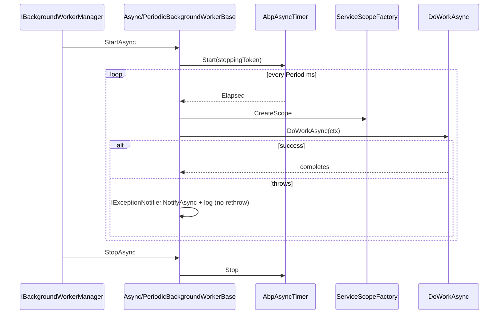
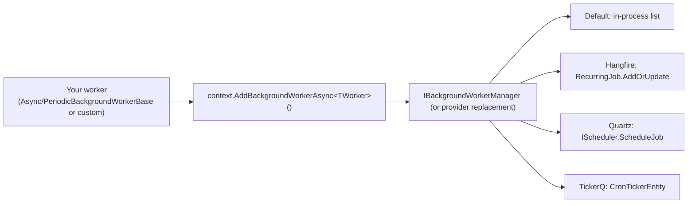

The **Background Workers** subsystem in ABP Framework, sitting in
`framework/src/Volo.Abp.BackgroundWorkers/`, owns long-running pieces of
in-process logic that need to be started with the host and stopped when
the host stops. It is the *other* face of the job system — where jobs are
fire-and-forget units of work, workers are perpetual schedulers,
pollers, or consumers. This page documents the contracts, the periodic
base classes, the lifecycle wiring inside `AbpBackgroundWorkersModule`,
the dynamic registration pipeline, and the three provider-backed
managers in `Volo.Abp.BackgroundWorkers.Hangfire`,
`Volo.Abp.BackgroundWorkers.Quartz`, and `Volo.Abp.BackgroundWorkers.TickerQ`.

## The contract: `IBackgroundWorker` and `IBackgroundWorkerManager`

`IBackgroundWorker` in
`framework/src/Volo.Abp.BackgroundWorkers/Volo/Abp/BackgroundWorkers/IBackgroundWorker.cs`
is a thin marker — it merely re-exports
`Volo.Abp.Threading.IRunnable` and
`Volo.Abp.DependencyInjection.ISingletonDependency`:

```csharp
public interface IBackgroundWorker : IRunnable, ISingletonDependency { }
```

`IRunnable` gives you `StartAsync(CancellationToken)` and
`StopAsync(CancellationToken)`. `ISingletonDependency` means ABP's
conventional registrar picks every worker class up automatically — there
is *no* `[Worker]` attribute required.

`IBackgroundWorkerManager` (in `IBackgroundWorkerManager.cs`) owns the
collection:

```csharp
public interface IBackgroundWorkerManager : IRunnable
{
    Task AddAsync(IBackgroundWorker worker, CancellationToken cancellationToken = default);
}
```

The XML doc emphasises "Starts the worker immediately if
`IBackgroundWorkerManager` has started" — that's the property of the
default `BackgroundWorkerManager` that lets you add workers *after*
host startup.

## Default `BackgroundWorkerManager`

`BackgroundWorkerManager` in `BackgroundWorkerManager.cs` is the default
`ISingletonDependency` implementation. It is essentially a list with
start/stop fan-out:

```csharp
public virtual async Task AddAsync(IBackgroundWorker worker, CancellationToken cancellationToken = default)
{
    _backgroundWorkers.Add(worker);
    if (IsRunning)
        await worker.StartAsync(cancellationToken);
}

public virtual async Task StartAsync(CancellationToken cancellationToken = default)
{
    IsRunning = true;
    foreach (var worker in _backgroundWorkers)
        await worker.StartAsync(cancellationToken);
}

public virtual async Task StopAsync(CancellationToken cancellationToken = default)
{
    IsRunning = false;
    foreach (var worker in _backgroundWorkers)
        await worker.StopAsync(cancellationToken);
}
```

Hangfire, Quartz, and TickerQ each replace this class with their own
implementation — see the per-provider sections below.

## Worker lifecycle: `AbpBackgroundWorkersModule`

`AbpBackgroundWorkersModule` in `AbpBackgroundWorkersModule.cs` boots
the manager. Three things are worth highlighting:

1. **Data-migration shortcut.** `ConfigureServices` checks
   `context.Services.IsDataMigrationEnvironment()` and, if true,
   overrides `AbpBackgroundWorkerOptions.IsEnabled` to `false`. Migrator
   apps will not boot workers — important because most migrators
   reference the same modules as the runtime host.
2. **Startup.** `OnApplicationInitializationAsync` resolves
   `IHostApplicationLifetime` and starts the manager with the
   `ApplicationStopping` token so individual workers can co-operate on
   shutdown.
3. **Shutdown.** `OnApplicationShutdownAsync` stops the manager **and**
   calls `IDynamicBackgroundWorkerManager.StopAllAsync` — even providers
   that throw on `AddAsync` (e.g. TickerQ) ship a no-op `StopAllAsync`
   so this call is safe.

`AbpBackgroundWorkerOptions` itself (in `AbpBackgroundWorkerOptions.cs`)
only has one knob:

```csharp
public class AbpBackgroundWorkerOptions { public bool IsEnabled { get; set; } = true; }
```

That toggle is honored by every provider module — flipping it false in
e.g. a unit test fixture nullifies the Hangfire `BackgroundJobServerFactory`,
Quartz's `StartSchedulerFactory`, and so on, without changing application
code.

## Registering workers: `AddBackgroundWorkerAsync`

`BackgroundWorkersApplicationInitializationContextExtensions` in
`BackgroundWorkersApplicationInitializationContextExtensions.cs`
exposes the canonical entry point used by every other ABP module:

```csharp
public async static Task<ApplicationInitializationContext> AddBackgroundWorkerAsync<TWorker>(
    this ApplicationInitializationContext context, CancellationToken ct = default)
    where TWorker : IBackgroundWorker
```

The non-generic overload validates that the type implements
`IBackgroundWorker`, defaults `ct` to `IHostApplicationLifetime.ApplicationStopping`
when unspecified, resolves the worker from DI, and forwards to
`IBackgroundWorkerManager.AddAsync`. This is what
`AbpBackgroundJobsModule.OnApplicationInitializationAsync` uses to
register `IBackgroundJobWorker`, and what your own modules should use to
register custom workers from `OnApplicationInitialization`:

```csharp
public override async Task OnApplicationInitializationAsync(ApplicationInitializationContext ctx)
{
    await ctx.AddBackgroundWorkerAsync<MyOutboxFlushWorker>();
}
```

## Base classes for custom workers

### `BackgroundWorkerBase`

`BackgroundWorkerBase` in `BackgroundWorkerBase.cs` is the recommended
base for any non-periodic worker. It supplies:

- `IAbpLazyServiceProvider LazyServiceProvider` — set by ABP's property
  injection — used to lazy-resolve `ILoggerFactory` and a per-instance
  `ILogger`.
- `CancellationTokenSource StoppingTokenSource` and
  `CancellationToken StoppingToken` — `StopAsync` cancels and disposes
  the source, so derived workers can simply pass `StoppingToken` into
  their async loops.
- A `ToString()` override returning `GetType().FullName`.

`StartAsync` and `StopAsync` only log debug messages and signal the
token, leaving the actual loop body to the subclass.

### `PeriodicBackgroundWorkerBase` and `AsyncPeriodicBackgroundWorkerBase`

The two periodic bases — `PeriodicBackgroundWorkerBase.cs` and
`AsyncPeriodicBackgroundWorkerBase.cs` — wrap `AbpTimer` and
`AbpAsyncTimer` respectively. Each tick they create a fresh DI scope and
invoke an abstract `DoWork(PeriodicBackgroundWorkerContext)` or
`DoWorkAsync(PeriodicBackgroundWorkerContext)`. Both honor
`CronExpression` as documented in the XML on the property:

> `CronExpression has high priority over Period.`

This is the contract relied on by the provider adapters — Hangfire and
Quartz both prefer `CronExpression` and fall back to a cron derived
from `Period` only when no expression is set.

### Exception handling inside the timer

Both bases catch every exception thrown inside `DoWork`/`DoWorkAsync`,
notify `IExceptionNotifier`, and log via `Logger.LogException(ex)` —
crucially, **they do not rethrow**. A failing tick will not kill the
worker. The Hangfire and Quartz dynamic worker adapters intentionally
copy this swallow-after-notify behavior to keep recurring jobs from
flipping to a failed state on a single transient error.

`PeriodicBackgroundWorkerContext` in
`PeriodicBackgroundWorkerContext.cs` only carries `ServiceProvider` and
a `CancellationToken` so derived workers can resolve scoped services
inside the tick.

### Periodic worker shape



## Worker naming: `BackgroundWorkerNameAttribute`

`BackgroundWorkerNameAttribute` in `BackgroundWorkerNameAttribute.cs`
implements `IBackgroundWorkerNameProvider` (in
`IBackgroundWorkerNameProvider.cs`) and powers the
`GetName<TWorker>()` / `GetNameOrNull<TWorker>()` helpers used by the
provider adapters. Worker-name resolution falls back to the
`FullName` of the worker type when no attribute is present —
identical to the job-side `BackgroundJobNameAttribute`. The Hangfire
`RecurringJobId`, the Quartz `JobKey`, and the TickerQ `Function` name
all come from this attribute when present.

## Dynamic workers

The dynamic surface — registering workers at runtime without a typed
class — is built around three types:

- `DynamicBackgroundWorkerHandler` (delegate in
  `DynamicBackgroundWorkerHandler.cs`):
  `delegate Task DynamicBackgroundWorkerHandler(DynamicBackgroundWorkerExecutionContext context, CancellationToken cancellationToken);`
- `DynamicBackgroundWorkerSchedule` (in
  `DynamicBackgroundWorkerSchedule.cs`) — `Period` and/or
  `CronExpression`, validated by `Validate()` to ensure at least one is
  set, with `DefaultPeriod = 60000` (60 s).
- `IDynamicBackgroundWorkerManager` (in
  `IDynamicBackgroundWorkerManager.cs`) — exposes `AddAsync`,
  `RemoveAsync`, `UpdateScheduleAsync`, `IsRegistered`, `StopAllAsync`.

### Default in-memory implementation

`DefaultDynamicBackgroundWorkerManager` in
`DefaultDynamicBackgroundWorkerManager.cs` is the in-process default. It
stores workers in a `ConcurrentDictionary<string,
InMemoryDynamicBackgroundWorker>` and serialises mutations through a
`SemaphoreSlim`. Important detail: if `schedule.Period == null` (cron
only), it throws:

```csharp
throw new AbpException(
    $"The default in-memory background worker manager does not support CronExpression without Period for dynamic worker '{workerName}'. " +
    "Please set Period, or use a scheduler-backed provider (Hangfire, Quartz, TickerQ).");
```

Replacing an existing entry stops the old one first and logs
`"Replaced existing dynamic worker"`.

`InMemoryDynamicBackgroundWorker` in `InMemoryDynamicBackgroundWorker.cs`
is a `[DisableConventionalRegistration] AsyncPeriodicBackgroundWorkerBase`
whose `DoWorkAsync` simply invokes the handler with a
`DynamicBackgroundWorkerExecutionContext(workerName, scope.ServiceProvider)`.
`UpdateSchedule` stops the timer, swaps `Period` / `CronExpression`,
and restarts.

### Registry

`DynamicBackgroundWorkerHandlerRegistry` in
`DynamicBackgroundWorkerHandlerRegistry.cs` is a thin
`ConcurrentDictionary<string, DynamicBackgroundWorkerHandler>` wrapper
implementing `IDynamicBackgroundWorkerHandlerRegistry`. The provider
adapters (Hangfire and Quartz) store handlers here and look them up
inside the scheduler's dispatch path — that's how a Hangfire
`RecurringJob` or Quartz job ends up invoking your in-process delegate.

### Convenience extension

`DynamicBackgroundWorkerManagerExtensions.AddAsync` in
`DynamicBackgroundWorkerManagerExtensions.cs` is the 1-arg overload that
defaults to `Period = DynamicBackgroundWorkerSchedule.DefaultPeriod`
(60 s). Use it when you only care about a fixed interval.

## Provider-backed managers

The framework ships three replacements for `IBackgroundWorkerManager`.
Each module additionally replaces `IDynamicBackgroundWorkerManager`
(Hangfire and Quartz with a working implementation, TickerQ with a
deliberately-throwing one).

### `HangfireBackgroundWorkerManager`

`HangfireBackgroundWorkerManager` in
`framework/src/Volo.Abp.BackgroundWorkers.Hangfire/Volo/Abp/BackgroundWorkers/Hangfire/HangfireBackgroundWorkerManager.cs`
replaces the default manager via
`[ExposeServices(typeof(IBackgroundWorkerManager), typeof(HangfireBackgroundWorkerManager))]`.
`AddAsync(worker)` switches on three cases:

- `IHangfireBackgroundWorker` (from `IHangfireBackgroundWorker.cs`) →
  `RecurringJob.AddOrUpdate(...)`, with queue routing controlled by
  `JobStorageFeatures.JobQueueProperty`. A failure to support queue
  routing logs an error pointing at `[Queue]`.
- `AsyncPeriodicBackgroundWorkerBase` / `PeriodicBackgroundWorkerBase` →
  resolves a `HangfirePeriodicBackgroundWorkerAdapter<TWorker>`,
  derives a cron from `Period` via `GetCron(period)`, and registers a
  `RecurringJob`. `GetCron` produces `*/{n} * * * * *` for sub-minute
  periods and progressively wider expressions for minute/hour/day
  spans; it throws above 31 days.
- Anything else → `base.AddAsync(worker, cancellationToken)` (the
  default list-and-start behavior).

Full details, including `HangfireBackgroundWorkerBase` and the
`HangfireDynamicBackgroundWorkerManager` pipeline, live on
[Hangfire](/jobs/hangfire).

### `QuartzBackgroundWorkerManager`

`QuartzBackgroundWorkerManager` in
`framework/src/Volo.Abp.BackgroundWorkers.Quartz/Volo/Abp/BackgroundWorkers/Quartz/QuartzBackgroundWorkerManager.cs`
also replaces the default manager. Its `StartAsync` resumes the
scheduler from standby when restarted; `StopAsync` puts it back in
standby. `AddAsync` switches on `IQuartzBackgroundWorker` (custom
`JobDetail`/`Trigger`) vs the periodic bases (uses
`QuartzPeriodicBackgroundWorkerAdapter<TWorker>` to build a
`SimpleSchedule` or `CronSchedule`). The conventional registrar
`AbpQuartzConventionalRegistrar` (in `AbpQuartzConventionalRegistrar.cs`)
exposes every `IQuartzBackgroundWorker` implementation as
`IQuartzBackgroundWorker` so
`AbpBackgroundWorkersQuartzModule.OnApplicationInitializationAsync` can
auto-register them when `IQuartzBackgroundWorker.AutoRegister == true`.
See [Quartz](/jobs/quartz) for the full retry and dynamic-worker story.

### `AbpTickerQBackgroundWorkerManager`

`AbpTickerQBackgroundWorkerManager` in
`framework/src/Volo.Abp.BackgroundWorkers.TickerQ/Volo/Abp/BackgroundWorkers/TickerQ/AbpTickerQBackgroundWorkerManager.cs`
is the most opinionated of the three:

- Only periodic bases are translated. Custom `IBackgroundWorker`s fall
  through to `base.AddAsync` unchanged.
- Defaults `TickerTaskPriority.LongRunning` when no per-worker
  configuration is registered through `AbpBackgroundWorkersTickerQOptions`.
- Sub-minute periods are *promoted* to the every-minute cadence
  `* * * * *` (TickerQ uses 5-field cron with no seconds field).
- Workers are buffered in `AbpTickerQBackgroundWorkersProvider`. The
  module's `OnPostApplicationInitializationAsync` writes the records
  out as `CronTickerEntity` rows via `ICronTickerManager<CronTickerEntity>`.
- `TickerQDynamicBackgroundWorkerManager` *throws* on every mutation:
  the message points users at Hangfire or Quartz for dynamic
  registration.

See [TickerQ](/jobs/tickerq) for cron-ticker storage and the
`AbpTickerQFunctionProvider` namespace shared with the job side.



## Choosing a manager

| Need | Use |
| --- | --- |
| In-process scheduling, single host, simple periodic ticks | Default `BackgroundWorkerManager` |
| Persistent recurring jobs visible in a dashboard | `Volo.Abp.BackgroundWorkers.Hangfire` ([Hangfire](/jobs/hangfire)) |
| Sophisticated cron triggers, calendars, clustering | `Volo.Abp.BackgroundWorkers.Quartz` ([Quartz](/jobs/quartz)) |
| Embedded scheduler tied to TickerQ's job model | `Volo.Abp.BackgroundWorkers.TickerQ` ([TickerQ](/jobs/tickerq)) |
| Adding/removing workers at runtime | Default or Hangfire/Quartz dynamic managers; **not** TickerQ |

If you only need a periodic loop with no dashboard or DB persistence,
the default manager is by far the simplest path — the same
`AsyncPeriodicBackgroundWorkerBase` you wrote works unchanged under any
provider.

## Cross-cutting concerns

- **`ICurrentTenant`.** Workers do *not* automatically run in a tenant
  context — you must `using (CurrentTenant.Change(tenantId)) { ... }`
  inside `DoWorkAsync`. The job-side executor swaps tenants based on
  `IMultiTenant` args; the worker side leaves it to you because workers
  typically iterate over many tenants per tick.
- **`IUnitOfWorkManager`.** Worker base classes do not start a unit of
  work. Wrap your logic with `[UnitOfWork]` on a service method or call
  `IUnitOfWorkManager.Begin()` explicitly.
- **Cancellation.** Periodic bases use `StartCancellationToken` captured
  during `StartAsync`. Use it inside any `await` you make — long-running
  workers that ignore the token will block host shutdown.
- **Logging.** `BackgroundWorkerBase.Logger` is lazily resolved from
  `LazyServiceProvider`, and `ToString()` returns the full type name so
  log lines are easy to grep.

## Worker vs job: when to pick which

- A **job** is one-off and triggered by application code via
  `IBackgroundJobManager.EnqueueAsync`. Args are serialised; the
  executor handles them out-of-process or later in time. See
  [Jobs Core](/jobs/background-jobs-core).
- A **worker** is started by the host and keeps running until shutdown,
  on its own schedule. There is no per-execution `args` — the worker
  reads its state from injected services every tick.
- A *periodic worker that scans for due rows and dispatches them* is
  precisely what `BackgroundJobWorker` (in
  `framework/src/Volo.Abp.BackgroundJobs/Volo/Abp/BackgroundJobs/BackgroundJobWorker.cs`)
  is — the bridge between the two abstractions, hosted as both an
  `IBackgroundWorker` (`IBackgroundJobWorker` is the marker) and as the
  driver of the default `IBackgroundJobStore`.

The [Overview](/jobs/overview) page lays out the full topology — start
there if you're picking a provider for the first time, then return here
once you need to write a worker on top of it.
