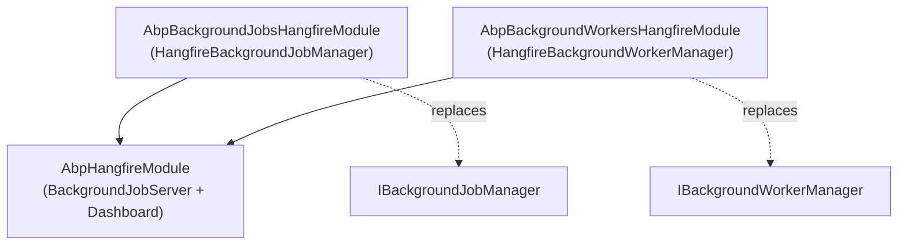

The **Hangfire integration** of ABP Framework is split across two
deliberately separate packages: `framework/src/Volo.Abp.HangFire/` is a
*cross-cutting* module that hosts the Hangfire `BackgroundJobServer`
and exposes the dashboard, while
`framework/src/Volo.Abp.BackgroundJobs.HangFire/` is the *job-system
provider* that replaces `IBackgroundJobManager` with one that pushes work
into Hangfire. A third package,
`framework/src/Volo.Abp.BackgroundWorkers.Hangfire/`, mirrors the same
trick for `IBackgroundWorkerManager`. This page covers all three and
their interplay.

## Package layout

| Package | Role | Module class |
| --- | --- | --- |
| `Volo.Abp.HangFire` | Hosts the Hangfire server, dashboard auth filter, `BackgroundJobServer` lifetime | `AbpHangfireModule` |
| `Volo.Abp.BackgroundJobs.HangFire` | Maps `IBackgroundJobManager` → Hangfire `BackgroundJob.Enqueue/Schedule` | `AbpBackgroundJobsHangfireModule` |
| `Volo.Abp.BackgroundWorkers.Hangfire` | Maps periodic / `IHangfireBackgroundWorker` instances into `RecurringJob` | `AbpBackgroundWorkersHangfireModule` |

You can reference `Volo.Abp.HangFire` on its own (e.g. to host the
dashboard for jobs scheduled by another system), but referencing the
jobs/workers packages always pulls the host module in via `[DependsOn]`.

## `AbpHangfireModule`: hosting the server

`AbpHangfireModule.ConfigureServices` in
`framework/src/Volo.Abp.HangFire/Volo/Abp/Hangfire/AbpHangfireModule.cs`
wires three things in DI:

1. `context.Services.AddHangfire(configuration => preActions.Configure(configuration));`
   — picks up every `IGlobalConfiguration` pre-configuration registered
   with `Services.PreConfigure<IGlobalConfiguration>(...)`, which is the
   standard way to register a storage provider (SQL Server, Redis, …).
2. A singleton `AbpHangfireBackgroundJobServer` whose factory invokes
   `AbpHangfireOptions.BackgroundJobServerFactory(serviceProvider)` — the
   integration point that lets storage providers or downstream modules
   swap in custom server construction.
3. `IPostConfigureOptions<AbpHangfireOptions>` registered as
   `AbpHangfireOptionsConfiguration`, which normalises queue prefixes.

The server is created lazily — `OnApplicationInitialization` simply
resolves `AbpHangfireBackgroundJobServer` so the factory fires once
during startup; `OnApplicationShutdown` calls `SendStop()` then
`Dispose()` on the inner Hangfire `BackgroundJobServer` so dispatch
drains cleanly.

### `AbpHangfireOptions`

`AbpHangfireOptions` in `AbpHangfireOptions.cs` exposes every knob:

| Property | Default | Purpose |
| --- | --- | --- |
| `DefaultQueuePrefix` | `""` (empty) | Prefix applied to every queue name when `AbpHangfireOptionsConfiguration` runs. |
| `MaxQueueNameLength` | `50` | Validation cap — Hangfire allows ≤ ~50 chars per queue name. |
| `DefaultQueue` | `EnqueuedState.DefaultQueue` (`"default"`) | The queue used when no `[Queue]` attribute is present. |
| `ServerOptions` | `null` → resolved from DI or `new BackgroundJobServerOptions()` | Standard Hangfire server config (queues, worker count, …). |
| `AdditionalProcesses` | `null` → resolved from DI | Extra `IBackgroundProcess` services to attach. |
| `Storage` | `null` → resolved from DI | `JobStorage` instance. |
| `BackgroundJobServerFactory` | `CreateJobServer` | Pluggable server factory. Setting it to `_ => null` disables the in-process server while keeping the dashboard usable. |

The private `CreateJobServer` falls back to DI for each missing piece —
storage, options, filter provider, activator, job factory, performer,
state changer — so you only override what you need.

### Queue prefix normalisation

`AbpHangfireOptionsConfiguration.PostConfigure` enforces Hangfire's
queue-name rules: lowercase letters, digits, underscore, and dash, with
trailing underscore. It validates that the prefixed default queue does
not exceed `MaxQueueNameLength`, and rewrites every entry in
`ServerOptions.Queues`. The conversion runs *exactly once* via
`IPostConfigureOptions<AbpHangfireOptions>`, so it is safe to call
`Configure<AbpHangfireOptions>` from any module.

### Dashboard authorization

`AbpHangfireAuthorizationFilter` in
`framework/src/Volo.Abp.HangFire/Volo/Abp/Hangfire/AbpHangfireAuthorizationFilter.cs`
implements `IDashboardAsyncAuthorizationFilter` and works in two layers:

1. It blocks tenants from seeing the dashboard unless `enableTenant`
   was set in the constructor — `currentTenant.IsAvailable && !_enableTenant`
   short-circuits the auth result to `false`.
2. It builds an `AuthorizationPolicy` requiring an authenticated user,
   optionally a permission (`PermissionRequirement`), and any number of
   roles (`RequireRole`). The policy is evaluated via
   `IAuthorizationService.AuthorizeAsync` on the HTTP context's user.

Mount it with the helper `UseAbpHangfireDashboard` from
`Microsoft/AspNetCore/Builder/AbpHangfireApplicationBuilderExtensions.cs`
(in the **BackgroundJobs.HangFire** package, not the host package):

```csharp
public static IApplicationBuilder UseAbpHangfireDashboard(
    this IApplicationBuilder app,
    string pathMatch = "/hangfire",
    Action<DashboardOptions>? configure = null,
    JobStorage? storage = null)
{
    var options = app.ApplicationServices
        .GetRequiredService<AbpDashboardOptionsProvider>().Get();
    configure?.Invoke(options);
    return app.UseHangfireDashboard(pathMatch, options, storage);
}
```

`AbpDashboardOptionsProvider.Get()` (in
`framework/src/Volo.Abp.BackgroundJobs.HangFire/Volo/Abp/BackgroundJobs/Hangfire/AbpDashboardOptionsProvider.cs`)
returns a `DashboardOptions` whose `DisplayNameFunc` recognises the
3-arg ABP enqueue signature `(queue, args, CancellationToken)` and
prints the friendly `JobName` rather than the adapter type — including a
special case for `DynamicBackgroundJobArgs.JobName` from the dynamic-job
pipeline.

## `AbpBackgroundJobsHangfireModule`: the job provider

`AbpBackgroundJobsHangfireModule` in
`framework/src/Volo.Abp.BackgroundJobs.HangFire/Volo/Abp/BackgroundJobs/Hangfire/AbpBackgroundJobsHangfireModule.cs`
depends on both `AbpBackgroundJobsAbstractionsModule` and
`AbpHangfireModule`. It registers a transient factory for
`DashboardOptions` (used by `UseAbpHangfireDashboard`) and — critically —
honors `AbpBackgroundJobOptions.IsJobExecutionEnabled` in
`OnPreApplicationInitialization`:

```csharp
public override void OnPreApplicationInitialization(ApplicationInitializationContext context)
{
    var options = context.ServiceProvider
        .GetRequiredService<IOptions<AbpBackgroundJobOptions>>().Value;
    if (!options.IsJobExecutionEnabled)
    {
        var hangfireOptions = context.ServiceProvider
            .GetRequiredService<IOptions<AbpHangfireOptions>>().Value;
        context.ServiceProvider.GetRequiredService<JobStorage>();
        hangfireOptions.BackgroundJobServerFactory = _ => null;
    }
}
```

The empty `GetRequiredService<JobStorage>()` call forces storage
resolution (so dashboards keep working), then null-factories the server
so no worker threads spin up. The result: data-seeding hosts or
migrators can `EnqueueAsync` jobs that some other host will process.

### `HangfireBackgroundJobManager`

`HangfireBackgroundJobManager` in `HangfireBackgroundJobManager.cs` is
the `IBackgroundJobManager` replacement, registered with
`[Dependency(ReplaceServices = true)]`:

```csharp
public virtual Task<string> EnqueueAsync<TArgs>(
    TArgs args,
    BackgroundJobPriority priority = BackgroundJobPriority.Normal,
    TimeSpan? delay = null)
{
    return Task.FromResult(delay.HasValue
        ? BackgroundJob.Schedule<HangfireJobExecutionAdapter<TArgs>>(
            adapter => adapter.ExecuteAsync(GetQueueName(typeof(TArgs)), args, default),
            delay.Value)
        : BackgroundJob.Enqueue<HangfireJobExecutionAdapter<TArgs>>(
            adapter => adapter.ExecuteAsync(GetQueueName(typeof(TArgs)), args, default)));
}
```

Two things deserve attention:

- The closed generic `HangfireJobExecutionAdapter<TArgs>` is what
  Hangfire actually serialises and stores. The expression
  `adapter => adapter.ExecuteAsync(queue, args, default)` is Hangfire's
  canonical job-creation form: Hangfire reflects on the expression to
  capture method + arguments.
- `priority` is **not** forwarded to Hangfire — Hangfire has no native
  priority concept; queue routing via `[Queue]` is the recommended
  alternative.

`GetQueueName` reads `[QueueAttribute]` (a Hangfire attribute) off the
*job type*, applies `AbpHangfireOptions.DefaultQueuePrefix`, and falls
back to `AbpHangfireOptions.DefaultQueue` if no attribute is present. So
to send a job to a specific queue, decorate the `IBackgroundJob<TArgs>`
class with `[Hangfire.QueueAttribute("emails")]` — the manager prefixes
that automatically.

### `HangfireJobExecutionAdapter<TArgs>`

`HangfireJobExecutionAdapter<TArgs>` in
`HangfireJobExecutionAdapter.cs` is the adapter that Hangfire actually
invokes. It is decorated `[Queue("{0}")]` — Hangfire's placeholder syntax
that uses the first method argument as the queue name — which is why
`ExecuteAsync` takes the queue as its first parameter even though it
also lives in the queue metadata.

The body throws if `IsJobExecutionEnabled` is `false`, then creates a DI
scope, looks up the real `JobType` via `AbpBackgroundJobOptions.GetJob`,
builds a `JobExecutionContext`, and delegates to `IBackgroundJobExecuter`.
This is exactly the same executor used by the default polling worker —
multi-tenancy switching, cancellation propagation, and exception
notification are identical (see
[Jobs Core: BackgroundJobExecuter](/jobs/background-jobs-core#executing-a-job-ibackgroundjobexecuter-and-jobexecutioncontext)).

```mermaid
sequenceDiagram
    participant Caller as Application code
    participant Mgr as HangfireBackgroundJobManager
    participant HF as Hangfire (BackgroundJob.Enqueue)
    participant Storage as JobStorage
    participant Server as BackgroundJobServer
    participant Adapter as HangfireJobExecutionAdapter&lt;TArgs&gt;
    participant Executer as IBackgroundJobExecuter
    participant Job as IBackgroundJob/IAsyncBackgroundJob

    Caller->>Mgr: EnqueueAsync(args, priority, delay)
    Mgr->>HF: BackgroundJob.Enqueue/Schedule(adapter =&gt; adapter.ExecuteAsync(queue, args, _))
    HF->>Storage: persist job state
    Server->>Storage: poll
    Server->>Adapter: ExecuteAsync(queue, args, ct)
    Adapter->>Executer: ExecuteAsync(JobExecutionContext)
    Executer->>Job: Execute(args) / ExecuteAsync(args)
```

## `AbpBackgroundWorkersHangfireModule`: workers as recurring jobs

`AbpBackgroundWorkersHangfireModule` in
`framework/src/Volo.Abp.BackgroundWorkers.Hangfire/Volo/Abp/BackgroundWorkers/Hangfire/AbpBackgroundWorkersHangfireModule.cs`
depends on `AbpBackgroundWorkersModule` and `AbpHangfireModule`. It does
three things:

1. Registers `HangfirePeriodicBackgroundWorkerAdapter<>` as a singleton
   open-generic so the worker manager can resolve a closed adapter per
   worker type.
2. In `OnPreApplicationInitialization`, mirrors the jobs-side toggle —
   if `AbpBackgroundWorkerOptions.IsEnabled` is `false`, it nulls
   `AbpHangfireOptions.BackgroundJobServerFactory`.
3. Calls `HangfireBackgroundWorkerManager.Initialize()`, which resolves
   `AbpHangfireBackgroundJobServer` to make sure the server is up before
   any `RecurringJob.AddOrUpdate` runs.

### `HangfireBackgroundWorkerManager`

`HangfireBackgroundWorkerManager` in
`HangfireBackgroundWorkerManager.cs` replaces the default
`BackgroundWorkerManager` via
`[Dependency(ReplaceServices = true), ExposeServices(typeof(IBackgroundWorkerManager), typeof(HangfireBackgroundWorkerManager))]`.
Its `AddAsync` switch handles three cases:

- **`IHangfireBackgroundWorker`** (the `RecurringJobId` / `CronExpression`
  / `TimeZone` / `Queue` interface in
  `IHangfireBackgroundWorker.cs`): registers a `RecurringJob.AddOrUpdate`
  pointing at the worker's own `DoWorkAsync(CancellationToken)`. If the
  storage has `JobStorageFeatures.JobQueueProperty`, the queue argument
  is forwarded; otherwise it falls back to the queue-less overload and
  logs an error so you switch to `[Queue]` attributes.
- **`AsyncPeriodicBackgroundWorkerBase` or `PeriodicBackgroundWorkerBase`**
  (the framework's standard periodic worker bases — see
  [Workers](/jobs/background-workers)): resolves
  `HangfirePeriodicBackgroundWorkerAdapter<TWorker>` and registers it
  with a cron expression derived from `Period` via `GetCron(period)`.
- **Default**: defers to `base.AddAsync(worker, cancellationToken)`, i.e.
  the plain in-process `BackgroundWorkerManager` semantics.

`GetCron(int period)` converts milliseconds into a 5- or 6-field cron
string: `*/{n} * * * * *` for sub-minute periods, `*/{n} * * * *`,
`0 */{n} * * *`, `0 0 0 1/{n} * *` for minute / hour / day buckets, and
throws for periods > 31 days asking you to implement
`HangfireBackgroundWorkerBase` directly.

### `HangfirePeriodicBackgroundWorkerAdapter<TWorker>`

`HangfirePeriodicBackgroundWorkerAdapter<TWorker>` in
`HangfirePeriodicBackgroundWorkerAdapter.cs` extends
`HangfireBackgroundWorkerBase` (which itself implements
`IHangfireBackgroundWorker`). It captures the non-public `DoWork` /
`DoWorkAsync` methods at construction via reflection, then dispatches to
the correct one when Hangfire invokes the public `DoWorkAsync`. The
options for time-zone and queue come from
`AbpHangfirePeriodicBackgroundWorkerAdapterOptions`
(`TimeZone = TimeZoneInfo.Utc` by default).

### Dynamic Hangfire workers

`HangfireDynamicBackgroundWorkerManager` in
`HangfireDynamicBackgroundWorkerManager.cs` replaces
`IDynamicBackgroundWorkerManager`. Each call to `AddAsync(workerName,
schedule, handler)` first stores the handler in
`IDynamicBackgroundWorkerHandlerRegistry`, then schedules a recurring
Hangfire job under `recurringJobId = $"DynamicWorker:{workerName}"`.
`RemoveAsync` removes the recurring job *unconditionally* and only then
unregisters the handler — that's deliberate, the comment in the source
notes "this ensures cleanup works correctly after an application
restart, when the registry is empty but the Hangfire recurring job may
still exist". The actual handler runs through
`HangfireDynamicBackgroundWorkerAdapter`, which swallows exceptions
after notifying `IExceptionNotifier` so Hangfire doesn't treat a single
failure as a retryable job failure.

## Putting it together



A typical host:

```csharp
[DependsOn(
    typeof(AbpBackgroundJobsHangfireModule),
    typeof(AbpBackgroundWorkersHangfireModule)
)]
public class MyHostModule : AbpModule
{
    public override void PreConfigureServices(ServiceConfigurationContext context)
    {
        // Configure Hangfire's IGlobalConfiguration before AbpHangfireModule runs:
        context.Services.AddHangfire(config =>
            config.UseSqlServerStorage(connectionString));
    }
}
```

`AbpHangfireModule.ConfigureServices` reuses the pre-actions you set up
via `AddHangfire`, so this is the canonical way to plug in SQL Server,
Redis, or any other Hangfire storage provider.

## Comparing to the default provider

Versus `DefaultBackgroundJobManager`, the Hangfire pipeline:

- Drops ABP's `IBackgroundJobStore`, `IBackgroundJobSerializer`, and the
  polling `BackgroundJobWorker` — Hangfire owns persistence, serialisation,
  and dispatch.
- Honors `priority` only indirectly via queue routing (`[Queue]`).
- Honors `delay` natively through `BackgroundJob.Schedule`.
- Retries through Hangfire's `[AutomaticRetry]` filter chain (configure
  via `IGlobalConfiguration` if you need to change the defaults).
- Reuses `IBackgroundJobExecuter` so your `IBackgroundJob<TArgs>`
  implementations are portable — switching to or from Hangfire is a
  module-reference change.

See [Jobs Core](/jobs/background-jobs-core) for the abstraction layer,
[Workers](/jobs/background-workers) for the worker contract, and
[Overview](/jobs/overview) for a side-by-side provider comparison.
