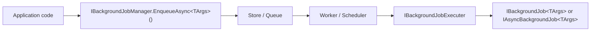
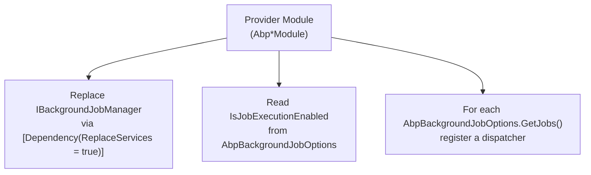

The **Background Jobs & Workers** stack in ABP Framework solves two
closely related problems: queuing one-off pieces of work for later
execution (jobs), and keeping long-running schedulers alive inside the
host (workers). Both surfaces share the same DI-friendly abstractions in
`framework/src/Volo.Abp.BackgroundJobs.Abstractions/` and
`framework/src/Volo.Abp.BackgroundWorkers/`, and each provider plugs in
by replacing the same handful of interfaces. This page is the entry
point — pick a concrete provider page once you understand the moving
parts.

## Packages at a glance

The framework tree under `framework/src/` separates abstractions, the
default polling implementation, one project per scheduler integration,
and matching `BackgroundWorkers.*` projects that reuse the same broker
to host periodic workers.

| Package | Purpose | Key entry point |
| --- | --- | --- |
| `Volo.Abp.BackgroundJobs.Abstractions` | `IBackgroundJobManager`, `IBackgroundJobExecuter`, `BackgroundJob<T>`, `JobExecutionContext`, `BackgroundJobPriority` | `AbpBackgroundJobsAbstractionsModule` |
| `Volo.Abp.BackgroundJobs` | Default `DefaultBackgroundJobManager` + DB-polling `BackgroundJobWorker`, `IBackgroundJobStore`, `InMemoryBackgroundJobStore`, `JsonBackgroundJobSerializer` | `AbpBackgroundJobsModule` |
| `modules/background-jobs` | `BackgroundJobRecord` aggregate + EF Core / MongoDB stores that back the default worker | `AbpBackgroundJobsDomainModule` |
| `Volo.Abp.BackgroundJobs.HangFire` | `HangfireBackgroundJobManager` that pushes work into a Hangfire `BackgroundJobServer` | `AbpBackgroundJobsHangfireModule` |
| `Volo.Abp.BackgroundJobs.Quartz` | `QuartzBackgroundJobManager` + `QuartzJobExecutionAdapter<TArgs>` scheduled into an `IScheduler` | `AbpBackgroundJobsQuartzModule` |
| `Volo.Abp.BackgroundJobs.RabbitMQ` | `RabbitMqBackgroundJobManager`, `JobQueueManager`, `JobQueue<TArgs>` with a delayed-queue trick | `AbpBackgroundJobsRabbitMqModule` |
| `Volo.Abp.BackgroundJobs.TickerQ` | `AbpTickerQBackgroundJobManager` storing `TimeTickerEntity` rows in the TickerQ store | `AbpBackgroundJobsTickerQModule` |
| `Volo.Abp.BackgroundWorkers` | `IBackgroundWorkerManager`, `PeriodicBackgroundWorkerBase`, `AsyncPeriodicBackgroundWorkerBase`, dynamic worker registry | `AbpBackgroundWorkersModule` |
| `Volo.Abp.BackgroundWorkers.Hangfire` / `.Quartz` / `.TickerQ` | Provider-backed `BackgroundWorkerManager` replacements that turn periodic workers into recurring jobs | `AbpBackgroundWorkers<Provider>Module` |

<Info>
  Pick exactly **one** job provider per host. Every implementation
  registers its `IBackgroundJobManager` with
  `[Dependency(ReplaceServices = true)]` (see e.g.
  `HangfireBackgroundJobManager`, `QuartzBackgroundJobManager`,
  `RabbitMqBackgroundJobManager`, `AbpTickerQBackgroundJobManager`,
  `DefaultBackgroundJobManager`) — the last module wins.
</Info>

## The two-surface model: jobs vs workers

A background **job** is a discrete unit of work (`IBackgroundJob<TArgs>`
or `IAsyncBackgroundJob<TArgs>` in
`Volo.Abp.BackgroundJobs.Abstractions/Volo/Abp/BackgroundJobs/IBackgroundJob.cs`
and `IAsyncBackgroundJob.cs`) enqueued via
`IBackgroundJobManager.EnqueueAsync<TArgs>(...)`. A background
**worker** is a long-lived component (`IBackgroundWorker` in
`Volo.Abp.BackgroundWorkers/Volo/Abp/BackgroundWorkers/IBackgroundWorker.cs`)
that runs throughout the host's lifetime — usually polling, ticking, or
serving messages. Each provider page covers both faces of the same
scheduler whenever the corresponding `BackgroundWorkers.*` package
exists.



The flow above corresponds to the contract defined in
`Volo.Abp.BackgroundJobs.Abstractions/Volo/Abp/BackgroundJobs/IBackgroundJobManager.cs`
and the executor base in
`Volo.Abp.BackgroundJobs.Abstractions/Volo/Abp/BackgroundJobs/BackgroundJobExecuter.cs`,
which is reused by every provider. Only the **store/queue** and the
**worker/scheduler** boxes change per package — the executor, the
`JobExecutionContext`, the multi-tenancy switch, and the exception
notification pipeline are shared.

## Provider comparison

The table below condenses the implementation differences captured in
each provider's `*BackgroundJobManager.cs`. Pick a row based on storage,
delivery guarantees, and whether you also need recurring/cron workers.

| Provider | Backing store | Enqueue path | Worker / dispatcher | Retry policy | Delay support |
| --- | --- | --- | --- | --- | --- |
| Default (`DefaultBackgroundJobManager`) | `IBackgroundJobStore` → DB module's `BackgroundJobRecord` (or `InMemoryBackgroundJobStore`) | `Store.InsertAsync(BackgroundJobInfo)` | `BackgroundJobWorker` polls every `JobPollPeriod` ms under `IAbpDistributedLock` | Exponential `DefaultFirstWaitDuration × DefaultWaitFactor^(TryCount-1)` capped at `DefaultTimeout`, then `IsAbandoned = true` | `delay` → `NextTryTime = Clock.Now + delay` |
| Hangfire (`HangfireBackgroundJobManager`) | Hangfire `JobStorage` (SQL Server, Redis, …) | `BackgroundJob.Enqueue<HangfireJobExecutionAdapter<TArgs>>(...)` or `Schedule(...)` | Hangfire `BackgroundJobServer` created by `AbpHangfireOptions.BackgroundJobServerFactory` | Hangfire's own retry attribute / state machine | `BackgroundJob.Schedule(..., delay)` |
| Quartz (`QuartzBackgroundJobManager`) | `IScheduler` job store (in-memory by default, ADO.NET or other when configured) | `IScheduler.ScheduleJob(jobDetail, trigger)` | Quartz scheduler thread pool runs `QuartzJobExecutionAdapter<TArgs>` | `AbpBackgroundJobQuartzOptions.RetryCount` / `RetryIntervalMillisecond` via `RetryStrategy` | `TriggerBuilder.StartAt(now + delay)` |
| RabbitMQ (`RabbitMqBackgroundJobManager`) | One AMQP queue per job + a delayed shadow queue | `IChannel.BasicPublishAsync(...)` via `JobQueue<TArgs>` | `AsyncEventingBasicConsumer` invokes `IBackgroundJobExecuter` per delivery | `BasicReject(requeue: true)` on `BackgroundJobExecutionException`, `requeue: false` otherwise | Routed through `DelayedQueueName` with `x-dead-letter-exchange` + per-message `Expiration` |
| TickerQ (`AbpTickerQBackgroundJobManager`) | TickerQ store via `ITimeTickerManager<TimeTickerEntity>` | `TimeTickerManager.AddAsync(new TimeTickerEntity { Function, ExecutionTime, Request })` | TickerQ host (started by `IHost.UseAbpTickerQ()`) dispatches by `Function` name | `AbpBackgroundJobsTimeTickerConfiguration.Retries` / `RetryIntervals` | `ExecutionTime = DateTime.UtcNow + delay` |
| `NullBackgroundJobManager` (fallback) | None | Throws `AbpException` | — | — | — |

`NullBackgroundJobManager` in
`Volo.Abp.BackgroundJobs.Abstractions/Volo/Abp/BackgroundJobs/NullBackgroundJobManager.cs`
is registered with `[Dependency(TryRegister = true)]`, so any real
implementation transparently replaces it; calling `EnqueueAsync` without
a provider throws the well-known *"Background job system has not a real
implementation"* error.

## Job arguments: the contract every provider shares

Every job is parameterised by an **args type**. The configuration map in
`AbpBackgroundJobOptions.AddJob<TJob>()` (see
`Volo.Abp.BackgroundJobs.Abstractions/Volo/Abp/BackgroundJobs/AbpBackgroundJobOptions.cs`)
keys jobs by their args type via `BackgroundJobArgsHelper.GetJobArgsType`,
and stores both the runtime type and a `JobName` resolved through
`BackgroundJobNameAttribute.GetName` — the args type's
`FullName` by default. Providers serialize args differently
(`JsonBackgroundJobSerializer` for the default store, `IJsonSerializer`
for Quartz/TickerQ, `IRabbitMqSerializer` for RabbitMQ, Hangfire's own
serializer), but they all round-trip through `BackgroundJobConfiguration`
to recover the destination `JobType`.

```csharp
// Volo.Abp.BackgroundJobs.Abstractions/Volo/Abp/BackgroundJobs/IBackgroundJobManager.cs
public interface IBackgroundJobManager
{
    Task<string> EnqueueAsync<TArgs>(
        TArgs args,
        BackgroundJobPriority priority = BackgroundJobPriority.Normal,
        TimeSpan? delay = null
    );
}
```

The `priority` parameter is a `BackgroundJobPriority` enum in
`BackgroundJobPriority.cs` (`Low=5`, `BelowNormal=10`, `Normal=15`,
`AboveNormal=20`, `High=25`). The default DB worker orders by
`Priority DESC` (see `InMemoryBackgroundJobStore.GetWaitingJobsAsync`
and the EF Core override `EfCoreBackgroundJobRepository.GetWaitingListQueryAsync`);
Hangfire honors it through `[Queue]` attributes; RabbitMQ currently
ignores it (the `JobQueue.PublishAsync` source contains a `TODO: How to
handle priority`); TickerQ maps it to `TickerTaskPriority` in
`AbpBackgroundJobsTickerQModule.OnApplicationInitialization`.

## Multi-tenancy and exception flow

`BackgroundJobExecuter.ExecuteAsync` resolves the job from DI, locates
the `Execute` / `ExecuteAsync` method via reflection, and wraps the
invocation in two `using` blocks: one for `ICurrentTenant.Change(...)`
(reading `IMultiTenant.TenantId` from the args when present), and one
for `ICancellationTokenProvider.Use(context.CancellationToken)`. If the
handler throws, the executor calls `IExceptionNotifier.NotifyAsync` and
re-throws a `BackgroundJobExecutionException` (see
`Volo.Abp.BackgroundJobs.Abstractions/Volo/Abp/BackgroundJobs/BackgroundJobExecutionException.cs`)
carrying both `JobType` and `JobArgs`. Each provider treats that
exception specially — the default `BackgroundJobWorker` schedules a
retry, RabbitMQ requeues the message, Quartz feeds it into
`AbpBackgroundJobQuartzOptions.RetryStrategy`, Hangfire delegates to its
own state machine.

## Workers: hosted periodic logic

`IBackgroundWorker` extends `IRunnable` and `ISingletonDependency`
(`Volo.Abp.BackgroundWorkers/Volo/Abp/BackgroundWorkers/IBackgroundWorker.cs`),
and `IBackgroundWorkerManager` (in the same folder) owns a list of
workers that are started in `AbpBackgroundWorkersModule.OnApplicationInitializationAsync`
and stopped on shutdown. The default `BackgroundWorkerManager.cs`
simply iterates `_backgroundWorkers` and forwards `StartAsync` /
`StopAsync`. The framework ships three replacements:

- `HangfireBackgroundWorkerManager` (`Volo.Abp.BackgroundWorkers.Hangfire/Volo/Abp/BackgroundWorkers/Hangfire/HangfireBackgroundWorkerManager.cs`)
  turns every worker into a Hangfire `RecurringJob.AddOrUpdate(...)`.
- `QuartzBackgroundWorkerManager`
  (`Volo.Abp.BackgroundWorkers.Quartz/Volo/Abp/BackgroundWorkers/Quartz/QuartzBackgroundWorkerManager.cs`)
  builds `IJobDetail` / `ITrigger` pairs and feeds them to `IScheduler`.
- `AbpTickerQBackgroundWorkerManager`
  (`Volo.Abp.BackgroundWorkers.TickerQ/Volo/Abp/BackgroundWorkers/TickerQ/AbpTickerQBackgroundWorkerManager.cs`)
  registers cron functions through `AbpTickerQFunctionProvider`.

The dynamic side — adding workers at runtime — is covered by
`IDynamicBackgroundWorkerManager` and its provider-specific
implementations (`HangfireDynamicBackgroundWorkerManager`,
`QuartzDynamicBackgroundWorkerManager`, and the
`TickerQDynamicBackgroundWorkerManager` that explicitly throws because
TickerQ uses a frozen-dictionary registration model).

## How a provider is wired

Every provider follows the same three-step recipe and you can verify it
by reading the corresponding `Abp*Module.cs`:

1. **Replace the manager.** `[Dependency(ReplaceServices = true)]` on
   `HangfireBackgroundJobManager`, `QuartzBackgroundJobManager`,
   `RabbitMqBackgroundJobManager`, `AbpTickerQBackgroundJobManager` or
   `DefaultBackgroundJobManager` overrides
   `NullBackgroundJobManager`.
2. **Honor `IsJobExecutionEnabled`.** Each module reads
   `AbpBackgroundJobOptions.IsJobExecutionEnabled`. Hangfire and Quartz
   modules nullify their server/scheduler when it is `false`
   (`AbpBackgroundJobsHangfireModule.OnPreApplicationInitialization`,
   `AbpBackgroundJobsQuartzModule.OnPreApplicationInitialization`),
   RabbitMQ skips starting consumers in `JobQueueManager.StartAsync`,
   the default worker stops polling, and TickerQ's delegate throws.
3. **Bind args to the dispatcher.** Hangfire and Quartz schedule
   `*JobExecutionAdapter<TArgs>` instances; RabbitMQ acquires
   `IJobQueue<TArgs>` from `JobQueueManager`; TickerQ pre-registers
   one `TickerFunctionDelegate` per `BackgroundJobConfiguration` in
   `AbpBackgroundJobsTickerQModule.OnApplicationInitialization`.



## Where args, serialisation, and identity diverge

Once you cross the manager boundary, each provider stores both **args**
and **identity** differently. Knowing the table below is the difference
between a portable `IBackgroundJob<TArgs>` implementation and one that
silently breaks on a provider switch.

| Provider | Args serialiser | Job identity | Failure surface |
| --- | --- | --- | --- |
| Default | `IBackgroundJobSerializer` (`JsonBackgroundJobSerializer` → `IJsonSerializer`) | `BackgroundJobInfo.Id` (Guid → string) | `BackgroundJobExecutionException` → exponential backoff on `BackgroundJobInfo.NextTryTime` |
| Hangfire | Hangfire's own serializer (configured on `IGlobalConfiguration`) | Hangfire job id (string) returned by `BackgroundJob.Enqueue` | `BackgroundJobExecutionException` → Hangfire `[AutomaticRetry]` state machine |
| Quartz | `IJsonSerializer` directly (key `"TArgs"` in `JobDataMap`) | `IJobDetail.Key.ToString()` | `JobExecutionException` (Quartz) wrapped by `QuartzJobExecutionAdapter`, retries through `AbpBackgroundJobQuartzOptions.RetryStrategy` |
| RabbitMQ | `IRabbitMqSerializer` (`Utf8JsonRabbitMqSerializer` default) | None — `JobQueue.EnqueueAsync` returns null | `BasicReject(requeue: true)` on `BackgroundJobExecutionException`, `requeue: false` on other exceptions |
| TickerQ | `TickerHelper.CreateTickerRequest<TArgs>` and `TickerRequestProvider.GetRequestAsync<TArgs>` | `TimeTickerEntity.Id` (Guid → string) | `AbpBackgroundJobsTimeTickerConfiguration.Retries` / `RetryIntervals` |

`IBackgroundJobSerializer` is the abstraction every store-driven provider
should honor — but only the default DB worker does. The provider pages
each call out the actual serialiser used so JSON converter
configurations transfer correctly.

## What every provider preserves

Despite the divergence above, the framework's
`BackgroundJobExecuter` is the *one* component the four broker
implementations all share. That means the following behaviors are
provider-agnostic:

- **Multi-tenancy switching.** `BackgroundJobExecuter.GetJobArgsTenantId`
  reads `IMultiTenant.TenantId` from the args; the job body runs under
  `ICurrentTenant.Change(...)`.
- **Cancellation.** `ICancellationTokenProvider.Use(context.CancellationToken)`
  is active for every job body, so calling
  `_cancellationTokenProvider.Token` inside services nested in the job
  sees the right token.
- **Exception notification.** `IExceptionNotifier.NotifyAsync` is invoked
  before the executor re-throws — the framework's logging, audit-log,
  and notification subscribers all run.
- **DI scope.** Every provider creates a fresh scope per job, so
  scoped services like `ICurrentTenant`, `IUnitOfWorkManager`, or
  database contexts behave as if they were inside an HTTP request.

This is why the same `IAsyncBackgroundJob<TArgs>` class is portable
across providers — a project can start on the default DB-backed
provider and migrate to Hangfire by swapping module references, without
touching any handler code.

## When `IBackgroundJobManager.IsAvailable()` matters

`BackgroundJobManagerExtensions.IsAvailable(this IBackgroundJobManager)`
in
`Volo.Abp.BackgroundJobs.Abstractions/Volo/Abp/BackgroundJobs/BackgroundJobManagerExtensions.cs`
returns `false` only when the resolved manager is
`NullBackgroundJobManager`. Library code that can function without
background scheduling (think: a notification service that prefers a
queued send but can fall through to inline) should branch on
`IsAvailable()` rather than catch the `"Background job system has not a
real implementation"` exception. Application hosts always reference one
of the real providers, so `IsAvailable()` is mostly a guard for shared
class libraries.

## How to read the rest of this section

The remaining pages walk through each layer in dependency order. Read
[Jobs Core](/jobs/background-jobs-core) first for the abstractions and
the default implementation, then [Jobs Module](/jobs/background-jobs-module)
for the EF Core / MongoDB persistence used by the default provider. The
provider pages — [Hangfire](/jobs/hangfire), [Quartz](/jobs/quartz),
[RabbitMQ Jobs](/jobs/rabbitmq-jobs), and [TickerQ](/jobs/tickerq) —
each pair the `BackgroundJobs.*` and `BackgroundWorkers.*` integrations
of the same scheduler. The final page, [Workers](/jobs/background-workers),
focuses on the standalone background worker hosting model that the
provider pages reference but do not duplicate.

<Tip>
  Need a recurring job rather than a one-off? Use a worker — see
  [Workers](/jobs/background-workers). Background jobs in ABP are always
  fire-and-forget: the `EnqueueAsync` contract has no cron, no recurrence
  count, and no replay primitive.
</Tip>

## Summary

The job and worker subsystems share contracts and an executor but
differ wildly in their storage and dispatch strategies. The framework's
position is opinionated: one common `IBackgroundJobManager` interface,
one common executor surface, and provider modules that swap in the
queue or scheduler of your choice via `[Dependency(ReplaceServices =
true)]`. The remaining pages in this section drill into each layer with
the matching source paths so you can map any behavior back to a single
`.cs` file in the ABP Framework repository.
