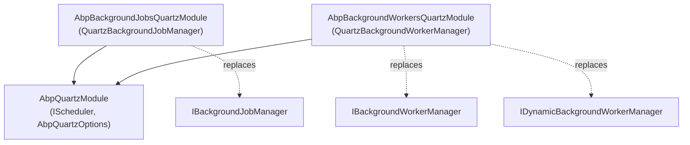

The **Quartz.NET integration** of ABP Framework is structured exactly
like the Hangfire one: a host package (`framework/src/Volo.Abp.Quartz/`)
boots an `IScheduler`, a jobs package
(`framework/src/Volo.Abp.BackgroundJobs.Quartz/`) replaces
`IBackgroundJobManager` with one that schedules jobs through Quartz, and
a workers package
(`framework/src/Volo.Abp.BackgroundWorkers.Quartz/`) maps ABP background
workers onto `IJobDetail` / `ITrigger` pairs. This page covers the host
plumbing and both consumer modules.

## Package layout

| Package | Role | Module class |
| --- | --- | --- |
| `Volo.Abp.Quartz` | Hosts `IScheduler` via `Quartz.IServiceCollectionQuartzConfigurator` | `AbpQuartzModule` |
| `Volo.Abp.BackgroundJobs.Quartz` | Replaces `IBackgroundJobManager` with one that creates `IJobDetail`/`ITrigger` pairs | `AbpBackgroundJobsQuartzModule` |
| `Volo.Abp.BackgroundWorkers.Quartz` | Replaces `IBackgroundWorkerManager` and auto-registers `IQuartzBackgroundWorker` discoveries | `AbpBackgroundWorkersQuartzModule` |

## `AbpQuartzModule`: hosting the scheduler

`AbpQuartzModule` in
`framework/src/Volo.Abp.Quartz/Volo/Abp/Quartz/AbpQuartzModule.cs`
configures Quartz through `Microsoft.Extensions.DependencyInjection`'s
`AddQuartz` integration. It executes any pre-configured
`AbpQuartzOptions` actions, then fills in sensible defaults when the
host left them blank:

- `StdSchedulerFactory.PropertySchedulerTypeLoadHelperType` →
  `build.UseSimpleTypeLoader()`.
- `StdSchedulerFactory.PropertyJobStoreType` → `build.UseInMemoryStore()`
  (so the host runs with no config; switch to ADO.NET to persist).
- `StdSchedulerFactory.PropertyThreadPoolType` →
  `build.UseDefaultThreadPool(tp => tp.MaxConcurrency = 10)`.
- `quartz.plugin.timeZoneConverter.type` → `build.UseTimeZoneConverter()`.

After defaults, your `options.Configurator?.Invoke(build)` callback runs,
so you can override anything. The module then registers an
`IScheduler` singleton resolved from `ISchedulerFactory.GetScheduler()`
(invoked via `AsyncHelper.RunSync` — the standard ABP pattern for sync
DI factories).

`OnApplicationInitializationAsync` awaits
`AbpQuartzOptions.StartSchedulerFactory(_scheduler)` — by default this
calls `scheduler.StartDelayed(StartDelay)` if `StartDelay > 0` or just
`scheduler.Start()`. `OnApplicationShutdownAsync` calls
`scheduler.Shutdown()` if it is still started. Disabling job execution
involves overwriting `StartSchedulerFactory` with `_ => Task.CompletedTask`,
which is exactly what the consumer modules do (see below).

### `AbpQuartzOptions`

`AbpQuartzOptions` in `AbpQuartzOptions.cs` is small:

| Property | Default | Purpose |
| --- | --- | --- |
| `Properties` | `new NameValueCollection()` | Quartz `StdSchedulerFactory` properties; merged with the configurator-built ones in `ConfigureServices`. |
| `Configurator` | `null` | Callback that receives `IServiceCollectionQuartzConfigurator` for advanced customisation (job factory, plugins, …). |
| `StartDelay` | `TimeSpan.Zero` | Delay before the scheduler starts. |
| `StartSchedulerFactory` | `StartSchedulerAsync` (private) | Lets the consumer modules disable startup without removing the scheduler from DI. |

Quartz's job-factory wiring is intentionally commented out in
`AbpQuartzModule.ConfigureServices` (`// build.UseMicrosoftDependencyInjectionScopedJobFactory();`)
with a note that `MicrosoftDependencyInjectionJobFactory` is the default
for DI configurations — ABP relies on Quartz's built-in DI integration
rather than registering an explicit `IJobFactory`.

## `AbpBackgroundJobsQuartzModule`: the job provider

`AbpBackgroundJobsQuartzModule` in
`framework/src/Volo.Abp.BackgroundJobs.Quartz/Volo/Abp/BackgroundJobs/Quartz/AbpBackgroundJobsQuartzModule.cs`
depends on both abstractions and `AbpQuartzModule`. It registers
`QuartzJobExecutionAdapter<>` as an open generic transient and disables
the scheduler if `IsJobExecutionEnabled` is false:

```csharp
public override void OnPreApplicationInitialization(ApplicationInitializationContext context)
{
    var options = context.ServiceProvider
        .GetRequiredService<IOptions<AbpBackgroundJobOptions>>().Value;
    if (!options.IsJobExecutionEnabled)
    {
        var quartzOptions = context.ServiceProvider
            .GetRequiredService<IOptions<AbpQuartzOptions>>().Value;
        quartzOptions.StartSchedulerFactory = scheduler => Task.CompletedTask;
    }
}
```

So in "data-seeder" or "migrator" hosts, you can still
`IBackgroundJobManager.EnqueueAsync` (which writes to the store), but no
worker thread will fire jobs locally.

### `QuartzBackgroundJobManager`

`QuartzBackgroundJobManager` in `QuartzBackgroundJobManager.cs` is
`[Dependency(ReplaceServices = true)]` and uses two well-known JobDataMap
keys, both prefixed by `JobDataPrefix = "Abp"`:

```csharp
var jobDataMap = new JobDataMap
{
    {nameof(TArgs), JsonSerializer.Serialize(args!)},
    {JobDataPrefix + nameof(Options.RetryCount), retryCount.ToString()},
    {JobDataPrefix + nameof(Options.RetryIntervalMillisecond), retryIntervalMillisecond.ToString()},
    {JobDataPrefix + RetryIndex, "0"}
};

var jobDetail = JobBuilder
    .Create<QuartzJobExecutionAdapter<TArgs>>()
    .RequestRecovery()
    .SetJobData(jobDataMap)
    .Build();

var trigger = !delay.HasValue
    ? TriggerBuilder.Create().StartNow().Build()
    : TriggerBuilder.Create()
        .StartAt(new DateTimeOffset(DateTime.Now.Add(delay.Value)))
        .Build();

await Scheduler.ScheduleJob(jobDetail, trigger);
return jobDetail.Key.ToString();
```

`RequestRecovery()` tells Quartz to re-execute the job after a hard
crash. `JsonSerializer` is the framework's `IJsonSerializer`, not
`IBackgroundJobSerializer` — note the divergence from the default
provider, which uses `IBackgroundJobSerializer`. Args travel as JSON,
keyed by `nameof(TArgs)` (= `"TArgs"`); the executor side decodes that
exact key.

### Per-call retry override: `QuartzBackgroundJobManageExtensions`

`QuartzBackgroundJobManageExtensions.EnqueueAsync` in
`QuartzBackgroundJobManageExtensions.cs` is a `IBackgroundJobManager`
extension that *casts* to `QuartzBackgroundJobManager` and calls
`ReEnqueueAsync` so callers can pass custom retry counts:

```csharp
public static async Task<string?> EnqueueAsync<TArgs>(
    this IBackgroundJobManager backgroundJobManager,
    TArgs args, int retryCount, int retryIntervalMillisecond,
    BackgroundJobPriority priority = BackgroundJobPriority.Normal,
    TimeSpan? delay = null)
{
    if (backgroundJobManager is QuartzBackgroundJobManager quartzBackgroundJobManager)
        return await quartzBackgroundJobManager.ReEnqueueAsync(...);
    return null;
}
```

Notice that this is a *Quartz-only* facility — calling it under any other
provider returns `null` silently. Defaults come from
`AbpBackgroundJobQuartzOptions`.

### `AbpBackgroundJobQuartzOptions` and the retry strategy

`AbpBackgroundJobQuartzOptions` in `AbpBackgroundJobQuartzOptions.cs`
holds three knobs:

| Property | Default | Meaning |
| --- | --- | --- |
| `RetryCount` | `3` | Maximum retries per failed job (carried via JobDataMap). |
| `RetryIntervalMillisecond` | `3000` | Sleep between retries (also via JobDataMap). |
| `RetryStrategy` | `DefaultRetryStrategy` | Async delegate invoked from the executor adapter on every failure. |

`DefaultRetryStrategy` sets `exception.RefireImmediately = true` for
retries within budget, sleeps `RetryIntervalMillisecond`, and on the
final attempt sets `RefireImmediately = false` and
`UnscheduleAllTriggers = true` — that last flag is the canonical Quartz
signal to drop the job permanently:

```csharp
exception.RefireImmediately = true;
var retryCount = executionContext.JobDetail.JobDataMap
    .GetString(QuartzBackgroundJobManager.JobDataPrefix + nameof(RetryCount))!.To<int>();
if (retryIndex > retryCount)
{
    exception.RefireImmediately = false;
    exception.UnscheduleAllTriggers = true;
    return;
}
var retryInterval = executionContext.JobDetail.JobDataMap
    .GetString(QuartzBackgroundJobManager.JobDataPrefix + nameof(RetryIntervalMillisecond))!.To<int>();
await Task.Delay(retryInterval);
```

### `QuartzJobExecutionAdapter<TArgs>`

`QuartzJobExecutionAdapter<TArgs>` in `QuartzJobExecutionAdapter.cs`
implements Quartz's `IJob`. Each call:

1. Creates a DI scope.
2. Deserialises args via `IJsonSerializer.Deserialize<TArgs>(JobDataMap["TArgs"])`.
3. Looks up the destination `JobType` via
   `AbpBackgroundJobOptions.GetJob(typeof(TArgs))`.
4. Builds a `JobExecutionContext` with `context.CancellationToken`.
5. Calls `IBackgroundJobExecuter.ExecuteAsync` — same executor as the
   default and Hangfire pipelines.
6. On any thrown exception: wraps it in a Quartz `JobExecutionException`,
   increments the `AbpRetryIndex` JobDataMap entry, and awaits
   `BackgroundJobQuartzOptions.RetryStrategy.Invoke(retryIndex, context, jobExecutionException)`
   before re-throwing.

```mermaid
sequenceDiagram
    participant Caller as Application code
    participant Mgr as QuartzBackgroundJobManager
    participant Sched as IScheduler
    participant Adapter as QuartzJobExecutionAdapter&lt;TArgs&gt;
    participant Strat as AbpBackgroundJobQuartzOptions.RetryStrategy
    participant Executer as IBackgroundJobExecuter
    participant Job as IBackgroundJob/IAsyncBackgroundJob

    Caller->>Mgr: EnqueueAsync(args, priority, delay)
    Mgr->>Sched: ScheduleJob(jobDetail, trigger)
    Sched->>Adapter: Execute(IJobExecutionContext)
    Adapter->>Executer: ExecuteAsync(JobExecutionContext)
    Executer->>Job: Execute(args) / ExecuteAsync(args)
    alt failure
        Adapter->>Strat: Invoke(retryIndex, ctx, JobExecutionException)
        Strat-->>Adapter: RefireImmediately?
        Adapter->>Sched: throw JobExecutionException
    end
```

## `AbpBackgroundWorkersQuartzModule`: workers as Quartz jobs

`AbpBackgroundWorkersQuartzModule` in
`framework/src/Volo.Abp.BackgroundWorkers.Quartz/Volo/Abp/BackgroundWorkers/Quartz/AbpBackgroundWorkersQuartzModule.cs`
takes a different conventional-registration approach. Its
`PreConfigureServices` registers `AbpQuartzConventionalRegistrar` —
defined in `AbpQuartzConventionalRegistrar.cs` — which scans your
assemblies and exposes every `IQuartzBackgroundWorker` type as
`IQuartzBackgroundWorker`. On startup, the module reads every
`IQuartzBackgroundWorker` from DI where `AutoRegister == true` and adds
them to `IBackgroundWorkerManager`:

```csharp
var works = context.ServiceProvider
    .GetServices<IQuartzBackgroundWorker>().Where(x => x.AutoRegister);
foreach (var work in works)
    await backgroundWorkerManager.AddAsync(work);
```

It also mirrors the `IsEnabled` toggle: when
`AbpBackgroundWorkerOptions.IsEnabled` is false, it overwrites
`AbpQuartzOptions.StartSchedulerFactory` with a no-op.

### `IQuartzBackgroundWorker` and `QuartzBackgroundWorkerBase`

`IQuartzBackgroundWorker` in `IQuartzBackgroundWorker.cs` extends both
`IBackgroundWorker` and Quartz's `IJob`, adding `ITrigger Trigger`,
`IJobDetail JobDetail`, `bool AutoRegister`, and an optional
`Func<IScheduler, Task>? ScheduleJob` that overrides the default
schedule call.

`QuartzBackgroundWorkerBase` in `QuartzBackgroundWorkerBase.cs` defaults
`AutoRegister = true` and leaves `Execute(IJobExecutionContext)`
abstract — your concrete worker fills it in with the actual job logic.

### `QuartzBackgroundWorkerManager`

`QuartzBackgroundWorkerManager` in `QuartzBackgroundWorkerManager.cs`
replaces the default `BackgroundWorkerManager` via
`[Dependency(ReplaceServices = true)]`. Its `StartAsync` resumes the
scheduler if it was placed in standby; `StopAsync` puts it back in
standby. `AddAsync` switches on the worker type:

- `IQuartzBackgroundWorker` → either invokes
  `quartzWork.ScheduleJob(Scheduler)` if the worker supplied one, or
  calls `DefaultScheduleJobAsync` which checks
  `Scheduler.CheckExists(jobDetail.Key)` and either reschedules or schedules
  fresh.
- `AsyncPeriodicBackgroundWorkerBase` / `PeriodicBackgroundWorkerBase` →
  constructs a `QuartzPeriodicBackgroundWorkerAdapter<TWorker>` via
  `Activator.CreateInstance(adapterType)`, calls `BuildWorker(worker)` to
  fill in `JobDetail` / `Trigger`, and schedules the adapter.
- Anything else → `base.AddAsync(worker, cancellationToken)`.

### `QuartzPeriodicBackgroundWorkerAdapter<TWorker>`

`QuartzPeriodicBackgroundWorkerAdapter<TWorker>` in
`QuartzPeriodicBackgroundWorkerAdapter.cs` is `[DisallowConcurrentExecution]`
(Quartz will not run two instances of the adapter at once for the same
worker key). `BuildWorker` reads `Period` / `CronExpression` from the
worker, builds a `JobDetail` keyed by `BackgroundWorkerNameAttribute.GetName<TWorker>()`,
and either uses `WithCronSchedule(CronExpression)` or
`WithSimpleSchedule(builder => builder.WithInterval(...).RepeatForever())`.
`Execute(IJobExecutionContext)` resolves the real `TWorker` from DI,
constructs a `PeriodicBackgroundWorkerContext`, and reflects to call the
non-public `DoWorkAsync` / `DoWork` — matching the same lookup path as
the Hangfire periodic adapter.

### Dynamic Quartz workers

`QuartzDynamicBackgroundWorkerManager` in
`QuartzDynamicBackgroundWorkerManager.cs` replaces
`IDynamicBackgroundWorkerManager`. `AddAsync(workerName, schedule,
handler)` registers the handler in
`IDynamicBackgroundWorkerHandlerRegistry`, then builds a
`JobBuilder.Create<QuartzDynamicBackgroundWorkerAdapter>()
.UsingJobData(DynamicWorkerNameKey, workerName).Build()` and schedules it
via `Scheduler.ScheduleJobs(..., replace: true, ...)` — `replace: true`
avoids a TOCTOU race between `CheckExists` and `ScheduleJob`.
`QuartzDynamicBackgroundWorkerAdapter` is itself an `IJob` that reads the
`AbpDynamicWorkerName` job-data key, looks the handler up, runs it inside
a `DynamicBackgroundWorkerExecutionContext`, and swallows exceptions
after `IExceptionNotifier.NotifyAsync` so Quartz does not retry.

## Putting it together



A typical Quartz-backed host:

```csharp
[DependsOn(
    typeof(AbpBackgroundJobsQuartzModule),
    typeof(AbpBackgroundWorkersQuartzModule)
)]
public class MyHostModule : AbpModule
{
    public override void PreConfigureServices(ServiceConfigurationContext context)
    {
        PreConfigure<AbpQuartzOptions>(options =>
        {
            options.Configurator = configurator =>
            {
                configurator.UsePersistentStore(store =>
                {
                    store.UseProperties = true;
                    store.UseClustering();
                    store.UseSqlServer(connectionString);
                });
            };
        });
    }
}
```

`PreConfigure<AbpQuartzOptions>` runs *before*
`AbpQuartzModule.ConfigureServices` invokes `AddQuartz`, so your store /
clustering choices override the defaults seeded by the module.

## Versus the default and Hangfire providers

- Args travel as `IJsonSerializer`-serialised JSON inside
  `JobDataMap["TArgs"]` (vs the default's `BackgroundJobInfo.JobArgs` row,
  vs Hangfire's expression-tree state).
- Retries are governed by `AbpBackgroundJobQuartzOptions.RetryStrategy`
  and tracked in JobDataMap (`AbpRetryIndex`), independent of the default
  `BackgroundJobWorker`'s exponential backoff or Hangfire's
  `[AutomaticRetry]`.
- Workers can either implement `IQuartzBackgroundWorker` directly
  (giving you full control over `JobDetail`/`Trigger`) or reuse the
  periodic base classes and let `QuartzPeriodicBackgroundWorkerAdapter`
  translate `Period`/`CronExpression` for you.
- `priority` is forwarded but Quartz has no native job priority for the
  scheduler — only triggers carry a priority. Use trigger priority via
  `IQuartzBackgroundWorker` for fine-grained control.

See [Jobs Core](/jobs/background-jobs-core), [Workers](/jobs/background-workers),
and the [Overview](/jobs/overview) for cross-provider comparisons.
