The **RabbitMQ jobs integration** of ABP Framework lives in
`framework/src/Volo.Abp.BackgroundJobs.RabbitMQ/` and turns
`IBackgroundJobManager` into a queue producer. Every job args type gets
its own durable queue (and a shadow "delayed" queue for `delay`
support), publishers push messages with `IChannel.BasicPublishAsync`, and
`JobQueue<TArgs>` keeps an `AsyncEventingBasicConsumer` attached to drain
each queue back through `IBackgroundJobExecuter`. This page covers all
five core types plus the dependency on `Volo.Abp.RabbitMQ`.

## Package layout

| Path | Type | Purpose |
| --- | --- | --- |
| `AbpBackgroundJobsRabbitMqModule.cs` | `AbpModule` | Wires DI for `IJobQueue<>`, starts/stops `IJobQueueManager` |
| `RabbitMqBackgroundJobManager.cs` | `IBackgroundJobManager` (replacement) | Resolves an `IJobQueue<TArgs>` and forwards the enqueue |
| `IJobQueue.cs` / `JobQueue.cs` | Open-generic queue | One instance per args type — both publisher and consumer |
| `IJobQueueManager.cs` / `JobQueueManager.cs` | Singleton manager | Pre-starts queues for every registered job and serves `GetAsync<TArgs>()` lazily |
| `JobQueueConfiguration.cs` | Queue metadata | Queue name, delayed queue name, prefetch, connection |
| `AbpRabbitMqBackgroundJobOptions.cs` | Options | Default prefix, default delayed prefix, prefetch, per-type overrides |

The module depends on `AbpBackgroundJobsAbstractionsModule`,
`AbpRabbitMqModule` (which manages `IChannelPool` / `IConnectionPool`
lifetimes), and `AbpThreadingModule`. It registers
`IJobQueue<>` as an open generic singleton:
`context.Services.AddSingleton(typeof(IJobQueue<>), typeof(JobQueue<>));`.

## Lifecycle: how queues come up

`AbpBackgroundJobsRabbitMqModule.OnApplicationInitializationAsync`
calls `IJobQueueManager.StartAsync()`, which iterates every job
registered via `AbpBackgroundJobOptions.GetJobs()` and resolves the
corresponding `IJobQueue<TArgs>` from DI — building one consumer per job
type up front, but only when `AbpBackgroundJobOptions.IsJobExecutionEnabled`
is true:

```csharp
public async Task StartAsync(CancellationToken cancellationToken = default)
{
    if (!Options.IsJobExecutionEnabled) return;

    foreach (var jobConfiguration in Options.GetJobs())
    {
        var jobQueue = (IRunnable)ServiceProvider.GetRequiredService(
            typeof(IJobQueue<>).MakeGenericType(jobConfiguration.ArgsType));
        await jobQueue.StartAsync(cancellationToken);
        JobQueues[jobConfiguration.JobName] = jobQueue;
    }
}
```

This means **publishers must still register their job** via
`Configure<AbpBackgroundJobOptions>(o => o.AddJob<MyJob>())` — even if
they only call `EnqueueAsync` — because `JobQueueManager` only knows
about declared queues. On shutdown,
`OnApplicationShutdownAsync` calls `IJobQueueManager.StopAsync()`, which
calls `StopAsync` on each tracked `IJobQueue` (each `Dispose`s its
`IChannelAccessor`).

## The publisher: `RabbitMqBackgroundJobManager`

`RabbitMqBackgroundJobManager` in `RabbitMqBackgroundJobManager.cs` is
`[Dependency(ReplaceServices = true)]` and only six lines of logic:

```csharp
public async Task<string> EnqueueAsync<TArgs>(
    TArgs args,
    BackgroundJobPriority priority = BackgroundJobPriority.Normal,
    TimeSpan? delay = null)
{
    var jobQueue = await _jobQueueManager.GetAsync<TArgs>();
    return (await jobQueue.EnqueueAsync(args, priority, delay))!;
}
```

`JobQueueManager.GetAsync<TArgs>()` returns the cached `IJobQueue<TArgs>`
or lazily creates one under a `SemaphoreSlim`. Note that
`JobQueue<TArgs>.EnqueueAsync` returns `Task<string?>` and currently
always returns `null` (`return null;`) — RabbitMQ does not give the
publisher a server-assigned id, so the manager's return contract
yields an empty string in practice.

## The queue: `JobQueue<TArgs>`

`JobQueue<TArgs>` in `JobQueue.cs` is the heart of the integration. Each
closed generic instance owns:

- `JobConfiguration` — pulled from `AbpBackgroundJobOptions.GetJob(typeof(TArgs))`.
- `QueueConfiguration` — resolved from
  `AbpRabbitMqBackgroundJobOptions.JobQueues[typeof(TArgs)]`, or built
  from the defaults: `DefaultQueueNamePrefix + JobName` and
  `DefaultDelayedQueueNamePrefix + JobName`.
- A lazily-acquired `IChannelAccessor` under the channel name
  `"JobQueue." + QueueName`.
- An optional `AsyncEventingBasicConsumer` (only when execution is
  enabled — publishers stay consumer-less).

### Declaring the queues

`EnsureInitializedAsync` acquires the channel from `IChannelPool` and
declares **two** queues every time:

```csharp
var result = await QueueConfiguration.DeclareAsync(ChannelAccessor.Channel);
// Declare delayed queue
await QueueConfiguration.DeclareDelayedAsync(ChannelAccessor.Channel);
```

`QueueDeclareConfiguration.DeclareAsync` (in
`framework/src/Volo.Abp.RabbitMQ/Volo/Abp/RabbitMQ/QueueDeclareConfiguration.cs`)
is the standard durable queue declaration. The interesting one is
`JobQueueConfiguration.DeclareDelayedAsync` in
`JobQueueConfiguration.cs`:

```csharp
var delayedArguments = new Dictionary<string, object?>(Arguments)
{
    ["x-dead-letter-routing-key"] = QueueName,
    ["x-dead-letter-exchange"] = string.Empty
};
return await channel.QueueDeclareAsync(
    queue: DelayedQueueName,
    durable: Durable,
    exclusive: Exclusive,
    autoDelete: AutoDelete,
    arguments: delayedArguments);
```

This is the well-known **dead-letter trick** for delayed delivery: the
delayed queue has no consumers, but every message it receives carries a
per-message TTL (`BasicProperties.Expiration`); when the TTL fires,
RabbitMQ dead-letters the message to the default exchange with the
*real* queue's routing key, and the consumer picks it up. No plugin
required.

### Publishing

`PublishAsync` builds a `BasicProperties` with `Persistent = true` and
the current `ICorrelationIdProvider.Get()`, then routes the message
based on `delay`:

```csharp
var routingKey = QueueConfiguration.QueueName;
var basicProperties = new BasicProperties
{
    Persistent = true,
    CorrelationId = CorrelationIdProvider.Get()
};

if (delay.HasValue && delay.Value > TimeSpan.Zero)
{
    routingKey = QueueConfiguration.DelayedQueueName;
    basicProperties.Expiration =
        ((long)Math.Ceiling(delay.Value.TotalMilliseconds))
        .ToString(CultureInfo.InvariantCulture);
}

await ChannelAccessor.Channel.BasicPublishAsync(
    exchange: "",
    routingKey: routingKey,
    mandatory: false,
    basicProperties: basicProperties,
    body: Serializer.Serialize(args!));
```

`Serializer` is `IRabbitMqSerializer` (the
`Utf8JsonRabbitMqSerializer` from
`framework/src/Volo.Abp.RabbitMQ/Volo/Abp/RabbitMQ/Utf8JsonRabbitMqSerializer.cs`
unless replaced). Two source comments reflect known limitations:

- `//TODO: How to handle priority` — `BackgroundJobPriority` is not
  forwarded to RabbitMQ. To use priority queues, configure the
  destination queue with `x-max-priority` in
  `JobQueueConfiguration.Arguments` yourself and add a custom serializer.
- `//TODO: What BasicConsume returns?` in `EnsureInitializedAsync`.

### Consuming

When `IsJobExecutionEnabled` is `true`, `EnsureInitializedAsync` sets up
the consumer:

```csharp
if (QueueConfiguration.PrefetchCount.HasValue)
    await ChannelAccessor.Channel.BasicQosAsync(0, QueueConfiguration.PrefetchCount.Value, false);

Consumer = new AsyncEventingBasicConsumer(ChannelAccessor.Channel);
Consumer.ReceivedAsync += MessageReceived;

await ChannelAccessor.Channel.BasicConsumeAsync(
    queue: QueueConfiguration.QueueName,
    autoAck: false,
    consumer: Consumer);
```

`MessageReceived` deserialises the body, constructs a fresh DI scope,
builds a `JobExecutionContext` with the resolved `JobConfiguration.JobType`,
and delegates to `IBackgroundJobExecuter`. The acknowledgement strategy
is the canonical "ack on success, reject with requeue on
`BackgroundJobExecutionException`, reject without requeue on unknown
errors" pattern:

```csharp
try
{
    using (CorrelationIdProvider.Change(ea.BasicProperties.CorrelationId))
        await JobExecuter.ExecuteAsync(context);
    await ChannelAccessor!.Channel.BasicAckAsync(deliveryTag: ea.DeliveryTag, multiple: false);
}
catch (BackgroundJobExecutionException)
{
    await ChannelAccessor!.Channel.BasicRejectAsync(deliveryTag: ea.DeliveryTag, requeue: true);
}
catch (Exception)
{
    await ChannelAccessor!.Channel.BasicRejectAsync(deliveryTag: ea.DeliveryTag, requeue: false);
}
```

That means the executor's thrown `BackgroundJobExecutionException` from
`BackgroundJobExecuter.ExecuteAsync` (see
[Jobs Core](/jobs/background-jobs-core#executing-a-job-ibackgroundjobexecuter-and-jobexecutioncontext))
is the difference between an unending retry loop (requeue) and a
poison-message drop.

<Warning>
  `BasicRejectAsync(requeue: true)` requeues the message at the head of
  the queue and lets RabbitMQ redeliver it immediately. There is no
  back-off and no max-retry count — if your job repeatedly throws
  `BackgroundJobExecutionException`, it will burn CPU forever. Implement
  a dead-letter exchange on the main queue (via
  `JobQueueConfiguration.Arguments["x-dead-letter-exchange"]`) and a
  retry counter in your handler if you need bounded retries.
</Warning>

## Per-job configuration: `JobQueueConfiguration`

`JobQueueConfiguration` extends `QueueDeclareConfiguration` and adds
three job-specific fields:

| Property | Source | Effect |
| --- | --- | --- |
| `JobArgsType` | Constructor | Identifies the closed generic `IJobQueue<TArgs>` this config drives. |
| `ConnectionName` | Constructor (optional) | Picks a connection from `RabbitMqConnections` other than the default. |
| `DelayedQueueName` | Constructor | Name of the dead-letter delayed queue used for `delay > 0`. |

Override defaults by adding an entry in
`AbpRabbitMqBackgroundJobOptions.JobQueues`:

```csharp
Configure<AbpRabbitMqBackgroundJobOptions>(o =>
{
    o.JobQueues[typeof(MyJobArgs)] = new JobQueueConfiguration(
        jobArgsType: typeof(MyJobArgs),
        queueName: "my-jobs",
        delayedQueueName: "my-jobs-delayed",
        connectionName: "ImportantWork",
        durable: true,
        prefetchCount: 5);
});
```

`JobQueue<TArgs>.GetOrCreateJobQueueConfiguration` looks up the
dictionary; the fallback uses
`AbpRabbitMqBackgroundJobOptions.DefaultQueueNamePrefix` (default
`"AbpBackgroundJobs."`) and `DefaultDelayedQueueNamePrefix` (default
`"AbpBackgroundJobsDelayed."`), both followed by `JobName`.

## Connection management: `IChannelPool` + `IConnectionPool`

The integration relies on `Volo.Abp.RabbitMQ` for connectivity. The
relevant types in `framework/src/Volo.Abp.RabbitMQ/Volo/Abp/RabbitMQ/`:

- `AbpRabbitMqOptions` exposes `RabbitMqConnections` for configuration —
  bound from the `RabbitMQ` configuration section by
  `AbpRabbitMqModule.ConfigureServices`. Note that
  `AbpRabbitMqModule` force-disables `AutomaticRecoveryEnabled` on every
  connection factory; pools manage reconnects.
- `IConnectionPool` returns named `IConnection` instances.
- `IChannelPool.AcquireAsync(channelName, connectionName)` returns an
  `IChannelAccessor`. `JobQueue<TArgs>` uses
  `"JobQueue." + QueueName` as the channel name, so each queue gets its
  own channel.
- `AbpRabbitMqModule.OnApplicationShutdownAsync` disposes both pools.

## End-to-end flow

```mermaid
flowchart LR
    Publisher["IBackgroundJobManager.EnqueueAsync(args, delay?)"]
    Mgr["RabbitMqBackgroundJobManager"]
    JQM["JobQueueManager.GetAsync&lt;TArgs&gt;"]
    JQ["JobQueue&lt;TArgs&gt;"]
    Channel["IChannelPool acquires channel"]

    subgraph Broker[RabbitMQ broker]
        DelayQ["Delayed queue<br/>x-dead-letter-exchange = ''"]
        MainQ["Main queue<br/>AbpBackgroundJobs.{JobName}"]
    end

    Consumer["AsyncEventingBasicConsumer"]
    Scope["new DI scope"]
    Ctx["JobExecutionContext"]
    Exec["IBackgroundJobExecuter"]
    Job["IBackgroundJob/IAsyncBackgroundJob"]

    Publisher --> Mgr --> JQM --> JQ --> Channel
    Channel -- delay&gt;0 --> DelayQ
    Channel -- delay==null --> MainQ
    DelayQ -- TTL expires + dead-letter --> MainQ
    MainQ --> Consumer --> Scope --> Ctx --> Exec --> Job
    Job -- success --> Ack["BasicAck"]
    Job -- BackgroundJobExecutionException --> Requeue["BasicReject(requeue: true)"]
    Job -- other exception --> Drop["BasicReject(requeue: false)"]
```



## Options at a glance: `AbpRabbitMqBackgroundJobOptions`

| Property | Default | Effect |
| --- | --- | --- |
| `JobQueues` | empty dictionary | Per-args-type override of `JobQueueConfiguration`. |
| `DefaultQueueNamePrefix` | `"AbpBackgroundJobs."` | Prefix combined with `JobName` for the main queue. |
| `DefaultDelayedQueueNamePrefix` | `"AbpBackgroundJobsDelayed."` | Prefix combined with `JobName` for the delayed shadow queue. |
| `PrefetchCount` | `null` | Default `BasicQos` value applied unless overridden per queue. |

## Operational notes

- **No `IBackgroundJobStore`.** This provider bypasses the framework's
  store / serializer surface — `IBackgroundJobSerializer` is unused, and
  `IRabbitMqSerializer` (`Utf8JsonRabbitMqSerializer` by default)
  handles wire format.
- **Multi-tenant safety.** Args that implement `IMultiTenant` are
  honored by `BackgroundJobExecuter` (the shared executor swaps
  `ICurrentTenant.Change(...)`), so the same `IBackgroundJob<TArgs>`
  written for the default provider works unchanged on RabbitMQ.
- **One consumer per process per queue.** The single
  `AsyncEventingBasicConsumer` runs callbacks on RabbitMQ.Client's task
  dispatcher; throughput scales by running more hosts. There is no
  in-process concurrency knob beyond `PrefetchCount` (which controls
  how many unacked messages a single channel will hold).
- **Recovery.** Because `AbpRabbitMqModule` disables
  `AutomaticRecoveryEnabled`, the broker connection is reopened by the
  pool when needed. `EnsureInitializedAsync` re-declares queues every
  time it sees a closed `ChannelAccessor.Channel`, so a reconnect is
  effectively transparent at the next publish or consume.

## Versus the other providers

- **Versus default DB worker** ([Jobs Core](/jobs/background-jobs-core)):
  no polling, no `IBackgroundJobStore`, no exponential back-off — the
  broker is the queue and durability is RabbitMQ's job.
- **Versus Hangfire** ([Hangfire](/jobs/hangfire)) and **Quartz**
  ([Quartz](/jobs/quartz)): no dashboard, no recurring jobs out of the
  box. You can pair `Volo.Abp.BackgroundJobs.RabbitMQ` with
  `Volo.Abp.BackgroundWorkers.Quartz` or
  `Volo.Abp.BackgroundWorkers.Hangfire` to get recurring workers
  separately.
- **Versus TickerQ** ([TickerQ](/jobs/tickerq)): TickerQ stores
  schedules in a DB and dispatches in-process; RabbitMQ ships work over
  the wire, so multiple consumer hosts naturally share load.

See [Overview](/jobs/overview) for a side-by-side comparison table.
