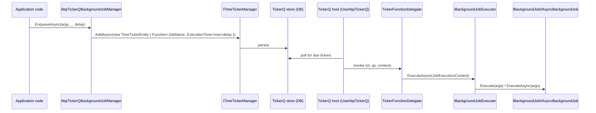
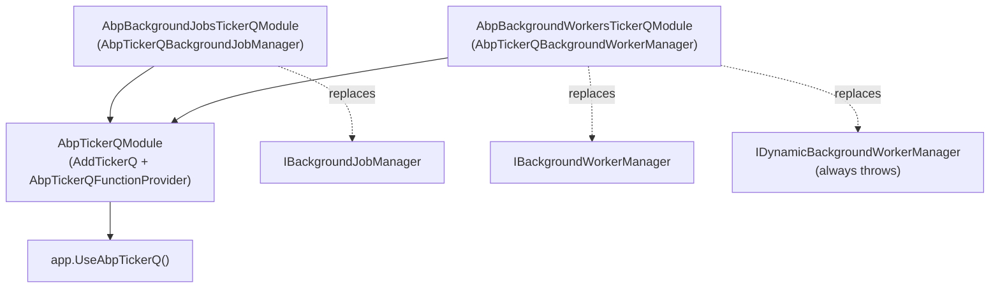

The **TickerQ integration** of ABP Framework is the newest of the four
broker integrations and wraps the TickerQ scheduling library. Like
Hangfire and Quartz, it splits into three packages: a host
(`framework/src/Volo.Abp.TickerQ/`) that bootstraps TickerQ in DI, a
jobs package (`framework/src/Volo.Abp.BackgroundJobs.TickerQ/`) that
maps `IBackgroundJobManager.EnqueueAsync` onto `TimeTickerEntity`
records, and a workers package
(`framework/src/Volo.Abp.BackgroundWorkers.TickerQ/`) that turns ABP
periodic workers into `CronTickerEntity` records. TickerQ stores
schedules in a database via its own `ITimeTickerManager` /
`ICronTickerManager` and dispatches in-process.

## Package layout

| Package | Role | Module class |
| --- | --- | --- |
| `Volo.Abp.TickerQ` | Wires `AddTickerQ`, exposes `AbpTickerQFunctionProvider`, supplies the `UseAbpTickerQ` host extension | `AbpTickerQModule` |
| `Volo.Abp.BackgroundJobs.TickerQ` | Replaces `IBackgroundJobManager` with `AbpTickerQBackgroundJobManager` | `AbpBackgroundJobsTickerQModule` |
| `Volo.Abp.BackgroundWorkers.TickerQ` | Replaces `IBackgroundWorkerManager` with `AbpTickerQBackgroundWorkerManager` | `AbpBackgroundWorkersTickerQModule` |

## `AbpTickerQModule`: hosting TickerQ

`AbpTickerQModule` in
`framework/src/Volo.Abp.TickerQ/Volo/Abp/TickerQ/AbpTickerQModule.cs`
calls TickerQ's `AddTickerQ` extension and seeds the scheduler's
`NodeIdentifier` with the ABP application name:

```csharp
public override void ConfigureServices(ServiceConfigurationContext context)
{
    context.Services.AddTickerQ(options =>
    {
        options.ConfigureScheduler(scheduler =>
        {
            scheduler.NodeIdentifier = context.Services.GetApplicationName();
        });
    });
}
```

The module is the minimum host hook — you still need to call
`UseAbpTickerQ` on your `IHost` to actually start the dispatcher.

### `AbpTickerQFunctionProvider`

`AbpTickerQFunctionProvider` in `AbpTickerQFunctionProvider.cs` is a
singleton bag that the jobs and workers modules populate during startup.
It holds two dictionaries:

```csharp
public Dictionary<string, (string CronExpression, TickerTaskPriority Priority,
    TickerFunctionDelegate Function, int MaxConcurrency)> Functions { get; }

public Dictionary<string, (string TypeName, Type Type)> RequestTypes { get; }
```

`AddFunction(name, function, priority, maxConcurrency)` validates inputs
and throws `AbpException` on duplicate names. Workers and jobs use the
*same* provider — they share a global function namespace keyed by the
job/worker `JobName`.

### Starting TickerQ: `UseAbpTickerQ`

`UseAbpTickerQ` in
`framework/src/Volo.Abp.TickerQ/Microsoft/Extensions/Hosting/AbpTickerQApplicationBuilderExtensions.cs`
is the bridge to TickerQ's `TickerFunctionProvider` static registry:

```csharp
public static IHost UseAbpTickerQ(this IHost app,
    TickerQStartMode qStartMode = TickerQStartMode.Immediate)
{
    var abpTickerQFunctionProvider = app.Services
        .GetRequiredService<AbpTickerQFunctionProvider>();
    TickerFunctionProvider.RegisterFunctions(abpTickerQFunctionProvider.Functions);
    TickerFunctionProvider.RegisterRequestType(abpTickerQFunctionProvider.RequestTypes);

    app.UseTickerQ(qStartMode);
    return app;
}
```

Call it **after the ABP application has initialised**, so every job and
worker has had a chance to populate the `AbpTickerQFunctionProvider`.
TickerQ's `RegisterFunctions` materialises a `FrozenDictionary` from the
delegate map — that is why dynamic worker registration is not
supported (see below).

## `AbpBackgroundJobsTickerQModule`: the job provider

`AbpBackgroundJobsTickerQModule` in
`framework/src/Volo.Abp.BackgroundJobs.TickerQ/Volo/Abp/BackgroundJobs/TickerQ/AbpBackgroundJobsTickerQModule.cs`
depends on `AbpBackgroundJobsAbstractionsModule` and `AbpTickerQModule`.
Its key responsibility is during `OnApplicationInitialization`: walk
`AbpBackgroundJobOptions.GetJobs()` and pre-register a
`TickerFunctionDelegate` for each one:

```csharp
foreach (var jobConfiguration in abpBackgroundJobOptions.Value.GetJobs())
{
    var genericMethod = GetTickerFunctionDelegateMethod
        .MakeGenericMethod(jobConfiguration.ArgsType);
    var tickerFunctionDelegate = (TickerFunctionDelegate)
        genericMethod.Invoke(null, [jobConfiguration.ArgsType])!;
    var config = abpBackgroundJobsTickerQOptions.Value
        .GetConfigurationOrNull(jobConfiguration.JobType);
    abpTickerQFunctionProvider.AddFunction(
        jobConfiguration.JobName,
        tickerFunctionDelegate,
        config?.Priority ?? TickerTaskPriority.Normal,
        config?.MaxConcurrency ?? 0);
    abpTickerQFunctionProvider.RequestTypes.TryAdd(
        jobConfiguration.JobName,
        (jobConfiguration.ArgsType.FullName, jobConfiguration.ArgsType)!);
}
```

Two things matter here:

1. Every job *registered with* `AbpBackgroundJobOptions.AddJob<...>()`
   gets a TickerQ function. There is no per-call adapter type the way
   Hangfire and Quartz use — TickerQ functions are simple delegates
   keyed by name.
2. Priority and concurrency come from
   `AbpBackgroundJobsTimeTickerConfiguration` rather than per-enqueue
   parameters. The `BackgroundJobPriority` passed to `EnqueueAsync` is
   not forwarded to TickerQ.

### The function delegate

`GetTickerFunctionDelegate<TArgs>` builds an async delegate that
TickerQ invokes when a `TimeTickerEntity` is due. It:

1. Checks `AbpBackgroundJobOptions.IsJobExecutionEnabled` and throws a
   descriptive `AbpException` if disabled.
2. Creates a DI scope.
3. Decodes the args via `TickerRequestProvider.GetRequestAsync<TArgs>(context, ct)`
   (TickerQ's own serializer pipeline).
4. Resolves the `JobType` from `Options.GetJob(typeof(TArgs))`.
5. Calls `IBackgroundJobExecuter.ExecuteAsync` with a
   `JobExecutionContext` — same executor as every other provider, so
   multi-tenant args (`IMultiTenant`) and cancellation work identically.

### `AbpTickerQBackgroundJobManager`

`AbpTickerQBackgroundJobManager` in
`AbpTickerQBackgroundJobManager.cs` is `[Dependency(ReplaceServices =
true)]` and uses TickerQ's `ITimeTickerManager<TimeTickerEntity>` to
persist work:

```csharp
public virtual async Task<string> EnqueueAsync<TArgs>(
    TArgs args,
    BackgroundJobPriority priority = BackgroundJobPriority.Normal,
    TimeSpan? delay = null)
{
    var job = Options.GetJob(typeof(TArgs));
    var timeTicker = new TimeTickerEntity
    {
        Id = Guid.NewGuid(),
        Function = job.JobName,
        ExecutionTime = delay == null ? DateTime.UtcNow : DateTime.UtcNow.Add(delay.Value),
        Request = TickerHelper.CreateTickerRequest<TArgs>(args),
    };

    var config = TickerQOptions.GetConfigurationOrNull(job.JobType);
    if (config != null)
    {
        timeTicker.Retries = config.Retries ?? timeTicker.Retries;
        timeTicker.RetryIntervals = config.RetryIntervals ?? timeTicker.RetryIntervals;
        timeTicker.RunCondition = config.RunCondition ?? timeTicker.RunCondition;
    }

    var result = await TimeTickerManager.AddAsync(timeTicker);
    return !result.IsSucceeded ? timeTicker.Id.ToString() : result.Result.Id.ToString();
}
```

The job becomes a row in TickerQ's storage with `Function = JobName`
(matching the entry pre-registered by the module's
`OnApplicationInitialization`), the serialised `Request`, and
`ExecutionTime` shifted by `delay` if present. `Retries`,
`RetryIntervals`, and `RunCondition` flow from
`AbpBackgroundJobsTimeTickerConfiguration` registered per job type via
`AbpBackgroundJobsTickerQOptions.AddConfiguration<TJob>(...)`.

### Per-job configuration

`AbpBackgroundJobsTimeTickerConfiguration` in
`AbpBackgroundJobsTimeTickerConfiguration.cs` is the per-job override:

| Property | Effect |
| --- | --- |
| `Retries` | Overrides TickerQ's `TimeTickerEntity.Retries` default. |
| `RetryIntervals` | Per-attempt delay array, fed into `TimeTickerEntity.RetryIntervals`. |
| `Priority` | Maps to `TickerTaskPriority` when the module pre-registers the function. |
| `MaxConcurrency` | Caps how many instances of the function TickerQ may run in parallel. |
| `RunCondition` | TickerQ-specific predicate gating execution. |

Register with `Configure<AbpBackgroundJobsTickerQOptions>(o =>
o.AddConfiguration<MyJob>(new AbpBackgroundJobsTimeTickerConfiguration {...}))`.



## `AbpBackgroundWorkersTickerQModule`: cron workers

`AbpBackgroundWorkersTickerQModule` in
`framework/src/Volo.Abp.BackgroundWorkers.TickerQ/Volo/Abp/BackgroundWorkers/TickerQ/AbpBackgroundWorkersTickerQModule.cs`
takes a different approach from the job module — it does its work in
`OnPostApplicationInitializationAsync`, *after* every worker has been
registered into the framework's `IBackgroundWorkerManager` (which is the
replacement `AbpTickerQBackgroundWorkerManager`):

```csharp
public override async Task OnPostApplicationInitializationAsync(
    ApplicationInitializationContext context)
{
    var provider = context.ServiceProvider
        .GetRequiredService<AbpTickerQBackgroundWorkersProvider>();
    var cronTickerManager = context.ServiceProvider
        .GetRequiredService<ICronTickerManager<CronTickerEntity>>();
    var options = context.ServiceProvider
        .GetRequiredService<IOptions<AbpBackgroundWorkersTickerQOptions>>().Value;

    foreach (var bw in provider.BackgroundWorkers)
    {
        var cronTicker = new CronTickerEntity
        {
            Function = bw.Value.Function,
            Expression = bw.Value.CronExpression
        };

        var config = options.GetConfigurationOrNull(bw.Value.WorkerType);
        if (config != null)
        {
            cronTicker.Retries = config.Retries ?? cronTicker.Retries;
            cronTicker.RetryIntervals = config.RetryIntervals ?? cronTicker.RetryIntervals;
        }

        await cronTickerManager.AddAsync(cronTicker);
    }
}
```

So the worker manager populates `AbpTickerQBackgroundWorkersProvider`
during `AddAsync`, and the post-init step persists every worker as a
`CronTickerEntity` so TickerQ knows when to fire it.

### `AbpTickerQBackgroundWorkerManager`

`AbpTickerQBackgroundWorkerManager` in
`AbpTickerQBackgroundWorkerManager.cs` extends
`BackgroundWorkerManager` and replaces the default singleton. Its
`AddAsync(IBackgroundWorker)` recognises periodic workers, derives a
cron expression from `Period` or uses the worker's `CronExpression`
directly, registers a `TickerFunctionDelegate` with
`AbpTickerQFunctionProvider`, and records the metadata in
`AbpTickerQBackgroundWorkersProvider.BackgroundWorkers`:

```csharp
AbpTickerQFunctionProvider.AddFunction(name!,
    async (ct, sp, tickerFunctionContext) =>
    {
        var workerInvoker = new AbpTickerQPeriodicBackgroundWorkerInvoker(worker, sp);
        await workerInvoker.DoWorkAsync(tickerFunctionContext, ct);
    },
    config?.Priority ?? TickerTaskPriority.LongRunning,
    config?.MaxConcurrency ?? 0);

AbpTickerQBackgroundWorkersProvider.BackgroundWorkers.Add(name!,
    new AbpTickerQCronBackgroundWorker
    {
        Function = name!,
        CronExpression = cronExpression,
        WorkerType = ProxyHelper.GetUnProxiedType(worker)
    });
```

The default priority for workers is `LongRunning`, not `Normal` — that's
TickerQ's hint to dedicate a long-running task slot rather than the
short-burst pool. `GetCron(int period)` is a 5-field cron generator with
a comment that "Less than 1 minute — 5-field cron doesn't support
seconds, so run every minute" — sub-minute period workers will be
promoted to the every-minute cadence `* * * * *`.

After buffering the worker, the base class `BackgroundWorkerManager.AddAsync`
is called to keep the in-memory list, but no in-process timer ever
starts: TickerQ is driving it.

### `AbpTickerQPeriodicBackgroundWorkerInvoker`

`AbpTickerQPeriodicBackgroundWorkerInvoker` in
`AbpTickerQPeriodicBackgroundWorkerInvoker.cs` is the bridge between
TickerQ's `TickerFunctionContext` and ABP's
`PeriodicBackgroundWorkerContext`. At construction it builds a compiled
expression delegate for either `DoWorkAsync` or `DoWork` (whichever
non-public method exists), so reflection cost is paid once. `DoWorkAsync`
builds a fresh `PeriodicBackgroundWorkerContext(ServiceProvider)` —
*without* a cancellation token — and dispatches to the compiled
delegate. The async case awaits the resulting `Task`; the sync case is
fire-and-forget within the TickerQ call.

### `AbpTickerQCronBackgroundWorker`

`AbpTickerQCronBackgroundWorker` (in `AbpTickerQCronBackgroundWorker.cs`)
is a tiny DTO with three fields: `Function` (name), `CronExpression`,
`WorkerType` (un-proxied). The post-init module reads only this DTO when
inserting `CronTickerEntity` rows.

### No dynamic workers

`TickerQDynamicBackgroundWorkerManager` in
`TickerQDynamicBackgroundWorkerManager.cs` is the one place this
provider visibly differs from Hangfire and Quartz. **Every** method
throws an `AbpException` with the message:

> "TickerQ does not support dynamic background worker registration at
> runtime. TickerQ uses FrozenDictionary for function registration,
> which requires all functions to be registered before the application
> starts. Please use Hangfire or Quartz provider for dynamic background
> workers."

`IsRegistered` returns `false` and `StopAllAsync` is a no-op so the
shutdown path in `AbpBackgroundWorkersModule.OnApplicationShutdownAsync`
still succeeds.

## Putting it together



A typical host:

```csharp
[DependsOn(
    typeof(AbpBackgroundJobsTickerQModule),
    typeof(AbpBackgroundWorkersTickerQModule)
)]
public class MyHostModule : AbpModule
{
    public override void OnApplicationInitialization(ApplicationInitializationContext ctx)
    {
        var host = ctx.ServiceProvider.GetRequiredService<IHost>();
        host.UseAbpTickerQ();
    }
}
```

`UseAbpTickerQ` ships in `Microsoft/Extensions/Hosting/`, so add `using
Microsoft.Extensions.Hosting;`. Configure TickerQ's own EF Core store
(e.g. `TickerQ.EntityFrameworkCore`) before this runs so
`ITimeTickerManager` and `ICronTickerManager` have somewhere to write.

## Versus the other providers

- **No `IBackgroundJobStore`.** TickerQ owns persistence via
  `TimeTickerEntity` and `CronTickerEntity` — backed by TickerQ's own
  storage providers, separate from the
  [Background Jobs Module](/jobs/background-jobs-module).
- **`priority` parameter is dropped.** `EnqueueAsync` ignores
  `BackgroundJobPriority`; use
  `AbpBackgroundJobsTimeTickerConfiguration.Priority` to influence
  TickerQ's `TickerTaskPriority`.
- **No dynamic workers.** Unlike Hangfire and Quartz, runtime
  worker registration throws — a deliberate design choice driven by
  TickerQ's `FrozenDictionary`-based registration.
- **Cron is first-class for workers.** Workers configured with a
  `CronExpression` are stored as `CronTickerEntity` rows, so they
  survive restarts.

See [Workers](/jobs/background-workers) for the periodic worker base
classes the invoker reflects on, and [Overview](/jobs/overview) for the
full provider comparison.
