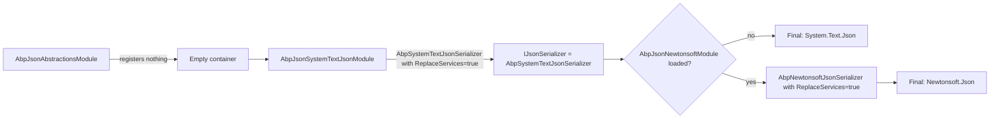

The ABP Framework `Volo.Abp.Json.Abstractions` package contains the contracts that every concrete JSON serializer in ABP implements. Depending on this package — and only this package — lets a library inject `IJsonSerializer` and configure `AbpJsonOptions` without locking the consumer to a specific provider (System.Text.Json or Newtonsoft.Json). It is the slim foundation under both `Volo.Abp.Json.SystemTextJson` and `Volo.Abp.Json.Newtonsoft`.

The package contains only three C# files under `framework/src/Volo.Abp.Json.Abstractions/Volo/Abp/Json/`:

| File | Purpose |
| --- | --- |
| `AbpJsonAbstractionsModule.cs` | Empty module class |
| `AbpJsonOptions.cs` | Shared options consumed by both providers |
| `IJsonSerializer.cs` | The single-interface contract |

## AbpJsonAbstractionsModule

```csharp
public class AbpJsonAbstractionsModule : AbpModule
{

}
```

(`framework/src/Volo.Abp.Json.Abstractions/Volo/Abp/Json/AbpJsonAbstractionsModule.cs`)

No service registrations. Other ABP modules depend on it via `[DependsOn(typeof(AbpJsonAbstractionsModule))]` to inherit the abstractions-only surface — both `AbpJsonSystemTextJsonModule` and `AbpJsonNewtonsoftModule` declare this dependency.

Depending on this module from a class library means the library can:

- Inject `IJsonSerializer` constructor arguments.
- Configure `AbpJsonOptions.InputDateTimeFormats` / `OutputDateTimeFormat` from `PreConfigureServices` or `ConfigureServices`.
- Compile without referencing `System.Text.Json` types or `Newtonsoft.Json` types.

The actual serializer is resolved at runtime from whichever provider module the **host application** wired.

## IJsonSerializer

```csharp
namespace Volo.Abp.Json;

public interface IJsonSerializer
{
    string Serialize(object obj, bool camelCase = true, bool indented = false);

    T Deserialize<T>(string jsonString, bool camelCase = true);

    object Deserialize(Type type, string jsonString, bool camelCase = true);
}
```

(`framework/src/Volo.Abp.Json.Abstractions/Volo/Abp/Json/IJsonSerializer.cs`)

Three members:

- `Serialize(object, bool camelCase = true, bool indented = false)` — serialize any object. The `camelCase` flag toggles the property naming policy/resolver; `indented` toggles pretty-printing.
- `Deserialize<T>(string, bool camelCase = true)` — strongly-typed deserialization.
- `Deserialize(Type, string, bool camelCase = true)` — runtime-typed deserialization. Useful when reflecting over generic types.

The interface is **synchronous** — both `JsonSerializer` (System.Text.Json) and `JsonConvert` (Newtonsoft) only expose synchronous string-based APIs, and ABP did not invent an async wrapper. For streaming serialization, drop down to the provider-specific types via the provider-specific extension hooks; the abstraction does not pretend to be stream-friendly.

The `camelCase` default is `true` because most ABP APIs follow Web API conventions (camelCase JSON ↔ PascalCase .NET). Pass `false` only when integrating with PascalCase-emitting external systems.

## AbpJsonOptions

```csharp
public class AbpJsonOptions
{
    /// <summary>
    /// Formats of input JSON date, Empty string means default format.
    /// </summary>
    public List<string> InputDateTimeFormats { get; set; }

    /// <summary>
    /// Format of output json date, Null or empty string means default format.
    /// </summary>
    public string? OutputDateTimeFormat { get; set; }

    public AbpJsonOptions()
    {
        InputDateTimeFormats = new List<string>();
    }
}
```

(`framework/src/Volo.Abp.Json.Abstractions/Volo/Abp/Json/AbpJsonOptions.cs`)

The two settings are **shared** between providers:

- `InputDateTimeFormats` — a list of `DateTime.ParseExact` format strings tried in order before falling back to the provider's default `DateTime.Parse`. Each format runs against the input under `CultureInfo.CurrentUICulture` and `DateTimeStyles.None` (System.Text.Json side) or `CultureInfo.InvariantCulture` and `DateTimeStyles.RoundtripKind` (Newtonsoft side). The two cultures differ — that is the legacy state today; if you supply a culture-sensitive format, test both providers.
- `OutputDateTimeFormat` — the format string used when writing a `DateTime`. When `null` or empty, providers fall back to their own defaults (System.Text.Json: ISO 8601; Newtonsoft: `"yyyy'-'MM'-'dd'T'HH':'mm':'ss.FFFFFFFK"`).

Configure them in your module:

```csharp
Configure<AbpJsonOptions>(o =>
{
    o.InputDateTimeFormats.Add("dd/MM/yyyy");
    o.InputDateTimeFormats.Add("yyyy-MM-dd HH:mm:ss");
    o.OutputDateTimeFormat = "yyyy-MM-dd'T'HH:mm:ssK";
});
```

Both `AbpDateTimeConverter` implementations read these via `IOptions<AbpJsonOptions>`:

- System.Text.Json side: `framework/src/Volo.Abp.Json.SystemTextJson/Volo/Abp/Json/SystemTextJson/JsonConverters/AbpDateTimeConverter.cs` (and `AbpNullableDateTimeConverter`, base class `AbpDateTimeConverterBase`).
- Newtonsoft side: `framework/src/Volo.Abp.Json.Newtonsoft/Volo/Abp/Json/Newtonsoft/AbpDateTimeConverter.cs`.

So the same `AbpJsonOptions` configuration affects both providers identically.

## JsonSerializerProvider chain

There is no `IJsonSerializerProvider` chain at the `Volo.Abp.Json.Abstractions` level. The provider selection happens entirely through DI replacement:



Both concrete serializers are decorated with `[Dependency(ReplaceServices = true)]`, so the **last** module to call `ConfigureServices` wins. The dependency order in your application module determines which provider is active.

To inspect the resolved provider at runtime:

```csharp
public class HealthService : ITransientDependency
{
    private readonly IJsonSerializer _json;
    public HealthService(IJsonSerializer json) => _json = json;

    public string CurrentSerializer() => _json.GetType().Name;
    // "AbpSystemTextJsonSerializer" or "AbpNewtonsoftJsonSerializer"
}
```

There is no `JsonSerializerProvider` enumeration of registered serializers — only the winning registration is reachable through DI.

## Custom provider implementation

The contract is small enough to write a custom provider in a few lines. For example, a serializer that delegates to `Utf8Json`:

```csharp
[Dependency(ReplaceServices = true)]
public class Utf8JsonSerializer : IJsonSerializer, ITransientDependency
{
    public string Serialize(object obj, bool camelCase = true, bool indented = false)
    {
        var resolver = camelCase
            ? StandardResolver.CamelCase
            : StandardResolver.Default;

        return Utf8Json.JsonSerializer.ToJsonString(obj, resolver);
    }

    public T Deserialize<T>(string json, bool camelCase = true)
        => Utf8Json.JsonSerializer.Deserialize<T>(json,
            camelCase ? StandardResolver.CamelCase : StandardResolver.Default);

    public object Deserialize(Type type, string json, bool camelCase = true)
        => Utf8Json.JsonSerializer.NonGeneric.Deserialize(type, json,
            camelCase ? StandardResolver.CamelCase : StandardResolver.Default);
}
```

Register the module with `[DependsOn(typeof(AbpJsonAbstractionsModule))]` and load it *after* `AbpJsonModule` (which wires System.Text.Json). The `ReplaceServices = true` attribute completes the replacement.

Note: this hypothetical provider does **not** honor `AbpJsonOptions.InputDateTimeFormats`. Cross-provider portability requires you to wire the option yourself.

## Why is the interface synchronous?

ABP's JSON workloads — DTOs in HTTP responses, background job payloads, event-bus envelopes — are typically small (a few hundred bytes to a few kilobytes). The cost of synchronous `JsonSerializer.Serialize(string)` is dominated by reflection / metadata lookups, not by I/O. An async overload would only shift CPU work to thread-pool callbacks without making it any cheaper.

For genuinely large payloads (megabytes), the abstraction is the wrong tool — drop down to provider-specific streaming APIs (`System.Text.Json.JsonSerializer.SerializeAsync(Stream, ...)`, `Newtonsoft.Json.JsonSerializer.Serialize(JsonTextWriter, ...)`) by injecting the provider-specific options instead of `IJsonSerializer`.

## Composing with other abstractions

The `IJsonSerializer` abstraction is used internally by other ABP abstractions packages — most importantly:

- `Volo.Abp.BackgroundJobs.Abstractions` — serializes job args before storing them.
- `Volo.Abp.EventBus.Abstractions` — serializes distributed event payloads for the outbox.
- `Volo.Abp.Http.Abstractions` — used by the dynamic HTTP API clients.
- `Volo.Abp.ObjectExtending` — round-trips extension data on entities.

Because each of those depends on the abstraction (not on `AbpJsonModule`), they can be referenced from libraries without forcing System.Text.Json to be loaded — useful for shared contract libraries that consumers may want to pair with Newtonsoft instead.

## Testing with a custom serializer

For unit tests that want to assert on JSON shape without depending on either provider, register a fake:

```csharp
public class TestJsonSerializer : IJsonSerializer
{
    public string Serialize(object obj, bool camelCase = true, bool indented = false)
        => "{}"; // canned response

    public T Deserialize<T>(string json, bool camelCase = true) => default!;
    public object Deserialize(Type type, string json, bool camelCase = true) => default!;
}

// in your test setup:
context.Services.AddSingleton<IJsonSerializer, TestJsonSerializer>();
context.Services.Replace(ServiceDescriptor.Singleton<IJsonSerializer, TestJsonSerializer>());
```

The tiny interface surface makes it easy to mock with NSubstitute / Moq as well:

```csharp
var json = Substitute.For<IJsonSerializer>();
json.Serialize(Arg.Any<object>()).Returns("{\"id\":1}");
```

## What is intentionally not here

`Volo.Abp.Json.Abstractions` does **not** define:

- `IJsonSerializerOptions` — each provider has its own options type (`AbpSystemTextJsonSerializerOptions`, `AbpNewtonsoftJsonSerializerOptions`).
- Stream-based methods — see the discussion above.
- `JsonSerializerProvider` enumerations — the DI replacement model only exposes the winning serializer.
- Polymorphic converter hooks — those are provider-specific (`JsonConverterFactory` vs `JsonConverter` vs `ContractResolver`).

If you write a library that needs polymorphic-aware serialization, build it on top of the provider-specific options inside your application module rather than trying to push the feature through the abstraction.

## Reference

| Type | File |
| --- | --- |
| `AbpJsonAbstractionsModule` | `framework/src/Volo.Abp.Json.Abstractions/Volo/Abp/Json/AbpJsonAbstractionsModule.cs` |
| `IJsonSerializer` | `framework/src/Volo.Abp.Json.Abstractions/Volo/Abp/Json/IJsonSerializer.cs` |
| `AbpJsonOptions` | `framework/src/Volo.Abp.Json.Abstractions/Volo/Abp/Json/AbpJsonOptions.cs` |
