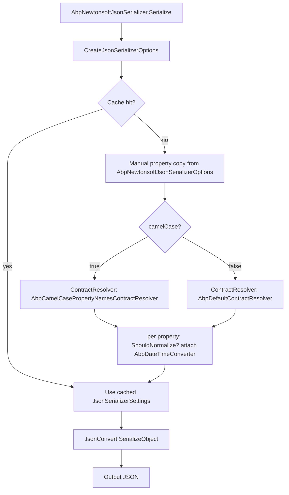

The ABP Framework `Volo.Abp.Json.Newtonsoft` package replaces the default System.Text.Json-backed `IJsonSerializer` with one that wraps `Newtonsoft.Json`. Reference it when your application depends on Newtonsoft-only features — `[JsonProperty]` attributes, `JsonConverter` subclasses written before .NET 5, complex `ContractResolver` subclasses, or `JsonRpc.NET` compatibility — across the entire framework.

All sources live under `framework/src/Volo.Abp.Json.Newtonsoft/Volo/Abp/Json/Newtonsoft/`.

## AbpJsonNewtonsoftModule

```csharp
[DependsOn(typeof(AbpJsonAbstractionsModule), typeof(AbpTimingModule))]
public class AbpJsonNewtonsoftModule : AbpModule
{
    public override void ConfigureServices(ServiceConfigurationContext context)
    {
        context.Services.AddAbpOptions<AbpNewtonsoftJsonSerializerOptions>()
            .Configure<IServiceProvider>((options, rootServiceProvider) =>
            {
                options.JsonSerializerSettings.ContractResolver = new AbpCamelCasePropertyNamesContractResolver(
                    rootServiceProvider.GetRequiredService<AbpDateTimeConverter>().SkipDateTimeNormalization());
            });
    }
}
```

(`framework/src/Volo.Abp.Json.Newtonsoft/Volo/Abp/Json/Newtonsoft/AbpJsonNewtonsoftModule.cs`)

The module:

1. Depends on `AbpJsonAbstractionsModule` (for `IJsonSerializer` / `AbpJsonOptions`) and `AbpTimingModule` (for `IClock`, `ICurrentTimezoneProvider`, `ITimezoneProvider` consumed by `AbpDateTimeConverter`).
2. Configures `AbpNewtonsoftJsonSerializerOptions.JsonSerializerSettings.ContractResolver` to `AbpCamelCasePropertyNamesContractResolver`. The `AbpDateTimeConverter` is wired with `SkipDateTimeNormalization()` because the resolver itself decides per-property whether normalization runs.

The class `AbpNewtonsoftJsonSerializer` is decorated with `[Dependency(ReplaceServices = true)]`, which is what swaps the prior `IJsonSerializer` registration coming from `Volo.Abp.Json.SystemTextJson`. Reference `AbpJsonNewtonsoftModule` from your application and `IJsonSerializer` returns the Newtonsoft serializer.

## Module dependency order

The order of `DependsOn` declarations matters because `ReplaceServices = true` only replaces an **earlier** registration. The typical chain:

```
Your module
└─ AbpJsonModule
   └─ AbpJsonSystemTextJsonModule  (registers AbpSystemTextJsonSerializer)
└─ AbpJsonNewtonsoftModule
   └─ AbpJsonAbstractionsModule, AbpTimingModule
   (registers AbpNewtonsoftJsonSerializer with ReplaceServices = true)
```

Either dependency arrangement works as long as `AbpJsonNewtonsoftModule` is in the dependency closure. The module system runs `ConfigureServices` in topological order: System.Text.Json first, Newtonsoft second, with Newtonsoft replacing the prior registration.

## AbpNewtonsoftJsonSerializer

```csharp
[Dependency(ReplaceServices = true)]
public class AbpNewtonsoftJsonSerializer : IJsonSerializer, ITransientDependency
{
    protected IRootServiceProvider RootServiceProvider { get; }
    protected IOptions<AbpNewtonsoftJsonSerializerOptions> Options { get; }

    public AbpNewtonsoftJsonSerializer(
        IRootServiceProvider rootServiceProvider,
        IOptions<AbpNewtonsoftJsonSerializerOptions> options)
    {
        RootServiceProvider = rootServiceProvider;
        Options             = options;
    }

    public string Serialize(object obj, bool camelCase = true, bool indented = false)
        => JsonConvert.SerializeObject(obj, CreateJsonSerializerOptions(camelCase, indented));

    public T Deserialize<T>(string jsonString, bool camelCase = true)
        => JsonConvert.DeserializeObject<T>(jsonString, CreateJsonSerializerOptions(camelCase))!;

    public object Deserialize(Type type, string jsonString, bool camelCase = true)
        => JsonConvert.DeserializeObject(jsonString, type, CreateJsonSerializerOptions(camelCase))!;
}
```

(`framework/src/Volo.Abp.Json.Newtonsoft/Volo/Abp/Json/Newtonsoft/AbpNewtonsoftJsonSerializer.cs`)

The class injects the **root** service provider rather than the per-scope one because `JsonSerializerSettings` is constructed eagerly and re-used across requests; resolving from the root provider avoids capturing a scoped dependency in a long-lived cache.

### CreateJsonSerializerOptions

```csharp
private readonly static ConcurrentDictionary<object, JsonSerializerSettings> JsonSerializerOptionsCache = new();

protected virtual JsonSerializerSettings CreateJsonSerializerOptions(bool camelCase = true, bool indented = false)
{
    return JsonSerializerOptionsCache.GetOrAdd(new { camelCase, indented }, _ =>
    {
        var settings = new JsonSerializerSettings
        {
            Binder                     = Options.Value.JsonSerializerSettings.Binder,
            CheckAdditionalContent     = Options.Value.JsonSerializerSettings.CheckAdditionalContent,
            Context                    = Options.Value.JsonSerializerSettings.Context,
            ContractResolver           = Options.Value.JsonSerializerSettings.ContractResolver,
            ConstructorHandling        = Options.Value.JsonSerializerSettings.ConstructorHandling,
            Converters                 = Options.Value.JsonSerializerSettings.Converters,
            Culture                    = Options.Value.JsonSerializerSettings.Culture,
            DateFormatHandling         = Options.Value.JsonSerializerSettings.DateFormatHandling,
            DateFormatString           = Options.Value.JsonSerializerSettings.DateFormatString,
            DateParseHandling          = Options.Value.JsonSerializerSettings.DateParseHandling,
            DateTimeZoneHandling       = Options.Value.JsonSerializerSettings.DateTimeZoneHandling,
            DefaultValueHandling       = Options.Value.JsonSerializerSettings.DefaultValueHandling,
            Error                      = Options.Value.JsonSerializerSettings.Error,
            EqualityComparer           = Options.Value.JsonSerializerSettings.EqualityComparer,
            FloatFormatHandling        = Options.Value.JsonSerializerSettings.FloatFormatHandling,
            FloatParseHandling         = Options.Value.JsonSerializerSettings.FloatParseHandling,
            Formatting                 = Options.Value.JsonSerializerSettings.Formatting,
            MaxDepth                   = Options.Value.JsonSerializerSettings.MaxDepth,
            MetadataPropertyHandling   = Options.Value.JsonSerializerSettings.MetadataPropertyHandling,
            MissingMemberHandling      = Options.Value.JsonSerializerSettings.MissingMemberHandling,
            NullValueHandling          = Options.Value.JsonSerializerSettings.NullValueHandling,
            ObjectCreationHandling     = Options.Value.JsonSerializerSettings.ObjectCreationHandling,
            PreserveReferencesHandling = Options.Value.JsonSerializerSettings.PreserveReferencesHandling,
            ReferenceLoopHandling      = Options.Value.JsonSerializerSettings.ReferenceLoopHandling,
            ReferenceResolver          = Options.Value.JsonSerializerSettings.ReferenceResolver,
            ReferenceResolverProvider  = Options.Value.JsonSerializerSettings.ReferenceResolverProvider,
            SerializationBinder        = Options.Value.JsonSerializerSettings.SerializationBinder,
            StringEscapeHandling       = Options.Value.JsonSerializerSettings.StringEscapeHandling,
            TraceWriter                = Options.Value.JsonSerializerSettings.TraceWriter,
            TypeNameAssemblyFormatHandling = Options.Value.JsonSerializerSettings.TypeNameAssemblyFormatHandling,
            TypeNameHandling           = Options.Value.JsonSerializerSettings.TypeNameHandling
        };

        if (!camelCase)
            settings.ContractResolver = new AbpDefaultContractResolver(
                RootServiceProvider.GetRequiredService<AbpDateTimeConverter>().SkipDateTimeNormalization());

        if (indented)
            settings.Formatting = Formatting.Indented;

        return settings;
    });
}
```

Three notable design points:

1. **Cache by `(camelCase, indented)`.** A `ConcurrentDictionary` stores one settings instance per combination. Newtonsoft caches `JsonContract` data on the contract resolver, so reusing the same settings instance keeps the contract cache warm.
2. **Manual property copy.** Newtonsoft's `JsonSerializerSettings` has no copy constructor (unlike `JsonSerializerOptions`), so every property is enumerated explicitly. Adding new Newtonsoft settings (when you upgrade the package) requires extending this list.
3. **Contract resolver per camelCase mode.** `camelCase: false` swaps in `AbpDefaultContractResolver` which keeps PascalCase. `camelCase: true` keeps the default `AbpCamelCasePropertyNamesContractResolver`.

## AbpNewtonsoftJsonSerializerOptions

```csharp
public class AbpNewtonsoftJsonSerializerOptions
{
    public JsonSerializerSettings JsonSerializerSettings { get; }

    public AbpNewtonsoftJsonSerializerOptions()
    {
        JsonSerializerSettings = new JsonSerializerSettings();
    }
}
```

(`framework/src/Volo.Abp.Json.Newtonsoft/Volo/Abp/Json/Newtonsoft/AbpNewtonsoftJsonSerializerOptions.cs`)

A thin wrapper around `Newtonsoft.Json.JsonSerializerSettings`. Configure additional Newtonsoft features from your module:

```csharp
Configure<AbpNewtonsoftJsonSerializerOptions>(o =>
{
    o.JsonSerializerSettings.ReferenceLoopHandling = ReferenceLoopHandling.Ignore;
    o.JsonSerializerSettings.NullValueHandling     = NullValueHandling.Ignore;
    o.JsonSerializerSettings.Converters.Add(new StringEnumConverter());
});
```

The module's own `Configure<IServiceProvider>` callback assigns the contract resolver after default construction, so your `Configure<AbpNewtonsoftJsonSerializerOptions>` runs **before** the resolver assignment — register additional converters here without worrying about ordering.

## Contract resolvers

### AbpCamelCasePropertyNamesContractResolver

```csharp
public class AbpCamelCasePropertyNamesContractResolver : CamelCasePropertyNamesContractResolver
{
    private readonly AbpDateTimeConverter _dateTimeConverter;

    public AbpCamelCasePropertyNamesContractResolver(AbpDateTimeConverter dateTimeConverter)
    {
        _dateTimeConverter = dateTimeConverter;

        NamingStrategy = new CamelCaseNamingStrategy
        {
            ProcessDictionaryKeys = false
        };
    }

    protected override JsonProperty CreateProperty(MemberInfo member, MemberSerialization memberSerialization)
    {
        var property = base.CreateProperty(member, memberSerialization);

        if (AbpDateTimeConverter.ShouldNormalize(member, property))
            property.Converter = _dateTimeConverter;

        return property;
    }
}
```

(`framework/src/Volo.Abp.Json.Newtonsoft/Volo/Abp/Json/Newtonsoft/AbpCamelCasePropertyNamesContractResolver.cs`)

Notable details:

- `NamingStrategy.ProcessDictionaryKeys = false` keeps dictionary keys in their original case (matching what System.Text.Json does by default).
- `CreateProperty` is the standard Newtonsoft hook that runs once per property. The override checks `AbpDateTimeConverter.ShouldNormalize` — which inspects the member and its declaring type for `[DisableDateTimeNormalization]` — and attaches the ABP DateTime converter only when normalization is desired.

### AbpDefaultContractResolver

```csharp
public class AbpDefaultContractResolver : DefaultContractResolver
{
    private readonly AbpDateTimeConverter _dateTimeConverter;
    public AbpDefaultContractResolver(AbpDateTimeConverter dateTimeConverter)
        => _dateTimeConverter = dateTimeConverter;

    protected override JsonProperty CreateProperty(MemberInfo member, MemberSerialization memberSerialization)
    {
        var property = base.CreateProperty(member, memberSerialization);
        if (AbpDateTimeConverter.ShouldNormalize(member, property))
            property.Converter = _dateTimeConverter;
        return property;
    }
}
```

(`framework/src/Volo.Abp.Json.Newtonsoft/Volo/Abp/Json/Newtonsoft/AbpDefaultContractResolver.cs`)

The PascalCase variant. Same hook, same DateTime converter, no naming strategy override. Used when `Serialize(..., camelCase: false)` is called.

## AbpDateTimeConverter

`AbpDateTimeConverter` (`framework/src/Volo.Abp.Json.Newtonsoft/Volo/Abp/Json/Newtonsoft/AbpDateTimeConverter.cs`) inherits from `Newtonsoft.Json.Converters.DateTimeConverterBase`. The class is `[ITransientDependency]` so it picks up `IClock`, `ICurrentTimezoneProvider`, `ITimezoneProvider` and `IOptions<AbpJsonOptions>` from DI:

```csharp
private const string DefaultDateTimeFormat = "yyyy'-'MM'-'dd'T'HH':'mm':'ss.FFFFFFFK";
```

### ReadJson

```csharp
public override object? ReadJson(JsonReader reader, Type objectType, object? existingValue, JsonSerializer serializer)
{
    var nullable = Nullable.GetUnderlyingType(objectType) != null;
    switch (reader.TokenType)
    {
        case JsonToken.Null when !nullable:
            throw new JsonSerializationException($"Cannot convert null value to {objectType.FullName}.");
        case JsonToken.Null: return null;
        case JsonToken.Date: return Normalize(reader.Value!.To<DateTime>());
    }
    if (reader.TokenType != JsonToken.String)
        throw new JsonSerializationException($"Unexpected token parsing date. Expected String, got {reader.TokenType}.");

    var dateText = reader.Value?.ToString();
    if (dateText.IsNullOrEmpty() && nullable) return null;

    if (_options.InputDateTimeFormats.Any())
    {
        foreach (var format in _options.InputDateTimeFormats)
            if (DateTime.TryParseExact(dateText, format, _culture, _dateTimeStyles, out var d1))
                return Normalize(d1);
    }
    var date = DateTime.Parse(dateText!, _culture, _dateTimeStyles);
    return Normalize(date);
}
```

The converter consumes `AbpJsonOptions.InputDateTimeFormats` from the shared abstractions options — exactly like the System.Text.Json variant — so configuring `Configure<AbpJsonOptions>(o => o.InputDateTimeFormats.Add(...))` affects both providers identically.

### WriteJson

```csharp
public override void WriteJson(JsonWriter writer, object? value, JsonSerializer serializer)
{
    if (value != null) value = Normalize(value.To<DateTime>());

    if (value is DateTime dateTime)
    {
        if ((_dateTimeStyles & DateTimeStyles.AdjustToUniversal) == DateTimeStyles.AdjustToUniversal ||
            (_dateTimeStyles & DateTimeStyles.AssumeUniversal)   == DateTimeStyles.AssumeUniversal)
            dateTime = dateTime.ToUniversalTime();

        writer.WriteValue(_options.OutputDateTimeFormat.IsNullOrWhiteSpace()
            ? dateTime.ToString(DefaultDateTimeFormat, _culture)
            : dateTime.ToString(_options.OutputDateTimeFormat, _culture));
    }
    else throw new JsonSerializationException(...);
}
```

### Normalize

```csharp
protected virtual DateTime Normalize(DateTime dateTime)
{
    if (dateTime.Kind != DateTimeKind.Unspecified ||
        !_clock.SupportsMultipleTimezone ||
        _currentTimezoneProvider.TimeZone.IsNullOrWhiteSpace())
    {
        return _skipDateTimeNormalization ? dateTime : _clock.Normalize(dateTime);
    }

    try
    {
        var tz = _timezoneProvider.GetTimeZoneInfo(_currentTimezoneProvider.TimeZone);
        dateTime = new DateTimeOffset(dateTime, tz.GetUtcOffset(dateTime)).UtcDateTime;
    }
    catch
    {
        Logger.LogWarning("Could not convert DateTime with unspecified Kind using timezone '{TimeZone}'.",
            _currentTimezoneProvider.TimeZone);
    }
    return _skipDateTimeNormalization ? dateTime : _clock.Normalize(dateTime);
}
```

The same algorithm as the System.Text.Json `AbpDateTimeConverterBase<T>.Normalize` method: if the kind is already specified or multiple timezones are not supported, just normalize; otherwise, use the current timezone provider to reconstruct a UTC value before normalizing.

### ShouldNormalize

```csharp
internal static bool ShouldNormalize(MemberInfo member, JsonProperty property)
{
    if (property.PropertyType != typeof(DateTime) && property.PropertyType != typeof(DateTime?))
        return false;

    return ReflectionHelper.GetSingleAttributeOfMemberOrDeclaringTypeOrDefault<DisableDateTimeNormalizationAttribute>(member) == null;
}
```

Called from both contract resolvers. Mirrors the System.Text.Json modifier logic — `[DisableDateTimeNormalization]` on the property or its declaring type opts out.

## Pipeline visualized



## Configuration recipes

### Ignore reference loops

Common for entity graphs that EF Core hydrates with back-references:

```csharp
Configure<AbpNewtonsoftJsonSerializerOptions>(o =>
{
    o.JsonSerializerSettings.ReferenceLoopHandling = ReferenceLoopHandling.Ignore;
});
```

### Custom converters

```csharp
Configure<AbpNewtonsoftJsonSerializerOptions>(o =>
{
    o.JsonSerializerSettings.Converters.Add(new StringEnumConverter());
    o.JsonSerializerSettings.Converters.Add(new IsoDateTimeConverter
    {
        DateTimeFormat = "yyyy'-'MM'-'dd'T'HH':'mm':'ss"
    });
});
```

Note: adding a global `StringEnumConverter` here overrides ABP's `AbpStringToEnumFactory` behavior — Newtonsoft does not have an exact equivalent, but the built-in `StringEnumConverter` covers the same use case.

### Pretty-print

Pass `indented: true` to `Serialize`. The serializer caches a separate `JsonSerializerSettings` whose `Formatting = Formatting.Indented`.

## Interop with ASP.NET Core MVC

`Volo.Abp.Json.Newtonsoft` only swaps the `IJsonSerializer` registration — it does **not** change MVC's input/output formatters. To use Newtonsoft in MVC controllers as well, additionally reference `Volo.Abp.AspNetCore.Mvc.NewtonsoftJson` (`framework/src/Volo.Abp.AspNetCore.Mvc.NewtonsoftJson/`). That module calls `services.AddMvcCore().AddNewtonsoftJson(...)` and aligns the MVC settings with `AbpNewtonsoftJsonSerializerOptions`.

## Reference

| Type | File |
| --- | --- |
| `AbpJsonNewtonsoftModule` | `framework/src/Volo.Abp.Json.Newtonsoft/Volo/Abp/Json/Newtonsoft/AbpJsonNewtonsoftModule.cs` |
| `AbpNewtonsoftJsonSerializer` | `framework/src/Volo.Abp.Json.Newtonsoft/Volo/Abp/Json/Newtonsoft/AbpNewtonsoftJsonSerializer.cs` |
| `AbpNewtonsoftJsonSerializerOptions` | `framework/src/Volo.Abp.Json.Newtonsoft/Volo/Abp/Json/Newtonsoft/AbpNewtonsoftJsonSerializerOptions.cs` |
| `AbpCamelCasePropertyNamesContractResolver` | `framework/src/Volo.Abp.Json.Newtonsoft/Volo/Abp/Json/Newtonsoft/AbpCamelCasePropertyNamesContractResolver.cs` |
| `AbpDefaultContractResolver` | `framework/src/Volo.Abp.Json.Newtonsoft/Volo/Abp/Json/Newtonsoft/AbpDefaultContractResolver.cs` |
| `AbpDateTimeConverter` | `framework/src/Volo.Abp.Json.Newtonsoft/Volo/Abp/Json/Newtonsoft/AbpDateTimeConverter.cs` |
