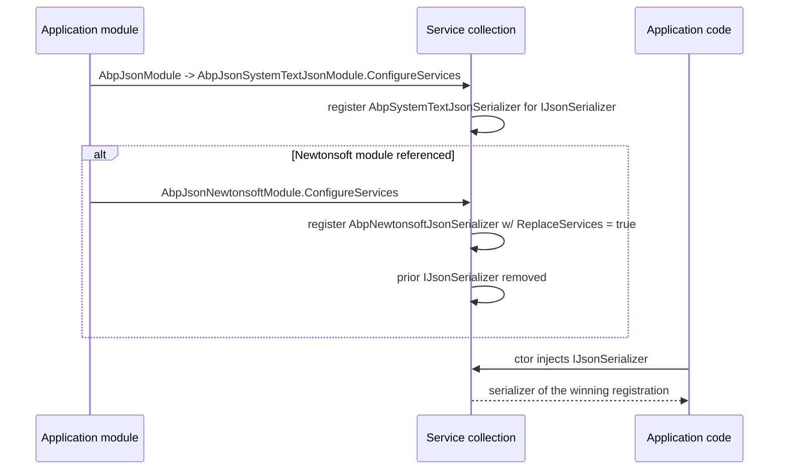

The ABP Framework treats JSON as a swappable subsystem. Application code injects a single `IJsonSerializer` abstraction; the binding to System.Text.Json or Newtonsoft.Json is decided by which provider module is loaded. The base contracts and shared options live in `Volo.Abp.Json.Abstractions`; the default System.Text.Json implementation lives in `Volo.Abp.Json.SystemTextJson`; the Newtonsoft implementation lives in `Volo.Abp.Json.Newtonsoft`; and the marker module `Volo.Abp.Json` exists so other ABP modules can depend on JSON without knowing which provider was chosen.

## Package map

```
Volo.Abp.Json.Abstractions          ← IJsonSerializer, AbpJsonOptions
├── Volo.Abp.Json.SystemTextJson    ← AbpSystemTextJsonSerializer (default)
├── Volo.Abp.Json.Newtonsoft        ← AbpNewtonsoftJsonSerializer (opt-in)
└── Volo.Abp.Json                   ← marker module, DependsOn(SystemTextJson)
```

| Package | Public types | Notes |
| --- | --- | --- |
| `Volo.Abp.Json.Abstractions` | `IJsonSerializer`, `AbpJsonOptions`, `AbpJsonAbstractionsModule` | Depend on this from libraries that only need the interface |
| `Volo.Abp.Json.SystemTextJson` | `AbpSystemTextJsonSerializer`, `AbpSystemTextJsonSerializerOptions`, `AbpSystemTextJsonSerializerModifiersOptions`, custom converters and modifiers | Pure managed; the default |
| `Volo.Abp.Json.Newtonsoft` | `AbpNewtonsoftJsonSerializer`, `AbpNewtonsoftJsonSerializerOptions`, `AbpDateTimeConverter`, contract resolvers | Adds Newtonsoft.Json |
| `Volo.Abp.Json` | `AbpJsonModule` (depends on `AbpJsonSystemTextJsonModule`) | Default composition for ABP applications |

## IJsonSerializer

The single interface is at `framework/src/Volo.Abp.Json.Abstractions/Volo/Abp/Json/IJsonSerializer.cs`:

```csharp
public interface IJsonSerializer
{
    string Serialize(object obj, bool camelCase = true, bool indented = false);
    T      Deserialize<T>(string jsonString, bool camelCase = true);
    object Deserialize(Type type, string jsonString, bool camelCase = true);
}
```

Three methods. The `camelCase` flag is the only tuning knob — pass `false` to keep PascalCase property names (interop with `JsonRpc`, some Microsoft APIs). The `indented` flag triggers pretty-printing for debugging.

## AbpJsonOptions

`AbpJsonOptions` (`framework/src/Volo.Abp.Json.Abstractions/Volo/Abp/Json/AbpJsonOptions.cs`) is the shared option type used by **both** provider implementations:

```csharp
public class AbpJsonOptions
{
    public List<string> InputDateTimeFormats { get; set; }
    public string?      OutputDateTimeFormat { get; set; }

    public AbpJsonOptions()
    {
        InputDateTimeFormats = new List<string>();
    }
}
```

- `InputDateTimeFormats` — additional `DateTime.ParseExact` formats accepted on read. Each format is tried in order before falling back to `DateTime.Parse`.
- `OutputDateTimeFormat` — the format string used on write. `null` / empty falls back to the default `yyyy'-'MM'-'dd'T'HH':'mm':'ss.FFFFFFFK` (the Newtonsoft default; System.Text.Json uses its own roundtrip writer).

Configure it from your module before any JSON call:

```csharp
Configure<AbpJsonOptions>(o =>
{
    o.InputDateTimeFormats.Add("dd/MM/yyyy");
    o.InputDateTimeFormats.Add("yyyy-MM-dd HH:mm:ss");
    o.OutputDateTimeFormat = "yyyy-MM-dd'T'HH:mm:ssK";
});
```

Both `AbpSystemTextJsonSerializer.AbpDateTimeConverter` and `AbpNewtonsoftJsonSerializer.AbpDateTimeConverter` read these options. The shared options class is what guarantees consistent DateTime formatting whichever provider is wired.

## AbpJsonAbstractionsModule

```csharp
public class AbpJsonAbstractionsModule : AbpModule
{

}
```

(`framework/src/Volo.Abp.Json.Abstractions/Volo/Abp/Json/AbpJsonAbstractionsModule.cs`)

Empty. Depend on this from libraries that only need to inject `IJsonSerializer` and `AbpJsonOptions`.

## AbpJsonModule (default composition)

```csharp
[DependsOn(typeof(AbpJsonSystemTextJsonModule))]
public class AbpJsonModule : AbpModule
{

}
```

(`framework/src/Volo.Abp.Json/Volo/Abp/Json/AbpJsonModule.cs`)

`AbpJsonModule` is the marker module almost every ABP module references. Because it transitively depends on `AbpJsonSystemTextJsonModule`, the System.Text.Json serializer is registered out of the box. Add `AbpJsonNewtonsoftModule` on top to switch.

## Selector pattern

The two concrete serializer classes are both registered with `[Dependency(ReplaceServices = true)] [ITransientDependency]` against `IJsonSerializer`:

- `AbpSystemTextJsonSerializer` — `framework/src/Volo.Abp.Json.SystemTextJson/Volo/Abp/Json/SystemTextJson/AbpSystemTextJsonSerializer.cs`
- `AbpNewtonsoftJsonSerializer` — `framework/src/Volo.Abp.Json.Newtonsoft/Volo/Abp/Json/Newtonsoft/AbpNewtonsoftJsonSerializer.cs`

The Newtonsoft module is loaded **after** the System.Text.Json module (via the `[DependsOn]` chain), and `ReplaceServices = true` removes the prior registration. So referencing `AbpJsonNewtonsoftModule` in addition to `AbpJsonModule` makes Newtonsoft the active serializer everywhere.

```mermaid
flowchart LR
    A[Volo.Abp.Json.Abstractions<br/>IJsonSerializer, AbpJsonOptions] --> B[Volo.Abp.Json.SystemTextJson<br/>AbpSystemTextJsonSerializer]
    A --> C[Volo.Abp.Json.Newtonsoft<br/>AbpNewtonsoftJsonSerializer]
    B -->|default| D[Volo.Abp.Json<br/>(DependsOn SystemTextJson)]
    D --> E[Your application module]
    C -.opt-in.-> E
    E -->|inject| F[IJsonSerializer]
    F -->|Replace last wins| G[Newtonsoft if module referenced]
    F -->|otherwise| H[System.Text.Json]
```

## Selection flow



## When to pick which

| You need | Use |
| --- | --- |
| The default, smallest binary footprint | `AbpJsonModule` (= System.Text.Json) |
| Reference loops, `[JsonProperty]` attributes from legacy code, custom contract resolvers | Reference `AbpJsonNewtonsoftModule` |
| Mix: System.Text.Json everywhere, Newtonsoft only in MVC controllers | `AbpJsonModule` + `Volo.Abp.AspNetCore.Mvc.NewtonsoftJson` (separate module, see `framework/src/Volo.Abp.AspNetCore.Mvc.NewtonsoftJson/`) — that one only overrides MVC's input/output formatters without changing `IJsonSerializer` |
| Snake-case property names | Configure the underlying options after the module runs (`AbpSystemTextJsonSerializerOptions.JsonSerializerOptions.PropertyNamingPolicy = JsonNamingPolicy.SnakeCaseLower`) |

## Shared invariants across providers

Both providers honor a small set of ABP-specific behaviors so application code is portable:

1. **camelCase by default.** The `Serialize` method's `camelCase` defaults to `true`. The System.Text.Json options are seeded with `JsonSerializerDefaults.Web` (which is camelCase); Newtonsoft is wired with `AbpCamelCasePropertyNamesContractResolver`. Passing `camelCase: false` forces PascalCase by switching to `AbpDefaultContractResolver` (Newtonsoft) or by setting `PropertyNamingPolicy = null` (System.Text.Json).
2. **DateTime normalization.** Both providers' `AbpDateTimeConverter` calls `IClock.Normalize` (from `Volo.Abp.Timing`) to coerce `DateTimeKind.Unspecified` values into the application's chosen kind. Decorate properties or types with `[DisableDateTimeNormalization]` to opt out.
3. **`[ExtraProperties]` round-trip.** Objects implementing `IHasExtraProperties` keep the `ExtraProperties` dictionary across serialization. For System.Text.Json this is implemented through `AbpIncludeExtraPropertiesModifiers` (a `JsonTypeInfo` modifier registered automatically); for Newtonsoft this is the natural behavior of the property's getter/setter.
4. **Round-trippable enums.** System.Text.Json registers `AbpStringToEnumFactory` and `AbpStringToEnumConverter<T>`; Newtonsoft uses its built-in `StringEnumConverter` via the default contract resolver.

## A quick application example

```csharp
public class WebhookForwarder : ITransientDependency
{
    private readonly IJsonSerializer _json;
    private readonly HttpClient _http;

    public WebhookForwarder(IJsonSerializer json, IHttpClientFactory http)
    {
        _json = json;
        _http = http.CreateClient();
    }

    public Task ForwardAsync(WebhookPayload payload)
    {
        var body = _json.Serialize(payload);
        return _http.PostAsync(payload.Url,
            new StringContent(body, Encoding.UTF8, "application/json"));
    }
}
```

The same `WebhookForwarder` works whether the host module wires System.Text.Json or Newtonsoft.

## Where the providers diverge

While the `IJsonSerializer` shape is identical, the underlying options differ:

| Aspect | System.Text.Json | Newtonsoft |
| --- | --- | --- |
| Root options type | `AbpSystemTextJsonSerializerOptions.JsonSerializerOptions` | `AbpNewtonsoftJsonSerializerOptions.JsonSerializerSettings` |
| Property naming | `JsonNamingPolicy.CamelCase` via `JsonSerializerDefaults.Web` | `AbpCamelCasePropertyNamesContractResolver` |
| Date format | Default ISO 8601; override via `AbpDateTimeConverter` (under `JsonConverters/`) | Default ISO 8601; override via `AbpDateTimeConverter` |
| Type info | `AbpDefaultJsonTypeInfoResolver` with `Modifiers` for extra props / DateTime / non-public properties | `AbpDefaultContractResolver` for non-camel case |
| Reference handling | `ReferenceHandler.IgnoreCycles` not configured (set yourself) | `ReferenceLoopHandling.Ignore` not configured (set yourself) |
| Comments | `JsonCommentHandling.Skip` on by default | Not enabled by default |
| Trailing commas | `AllowTrailingCommas = true` | Not enabled by default |

See the dedicated [System.Text.Json](./system-text-json) and [Newtonsoft](./newtonsoft) pages for the full per-provider configuration story.

## Where ABP itself uses `IJsonSerializer`

- HTTP API conventions read and write payloads via `IJsonSerializer` (`framework/src/Volo.Abp.Http.Client.IdentityModel/`).
- Background job storage (`Volo.Abp.BackgroundJobs.*`) serializes job args.
- Event bus storage (`Volo.Abp.EventBus.*`) serializes inbox/outbox payloads.
- Object extending (`Volo.Abp.ObjectExtending`) round-trips `ExtraProperties`.
- BLOB storage providers and identity claims serialization.

Because all of these depend only on `IJsonSerializer`, swapping providers at the composition root changes behavior consistently across the entire framework.

## Reference

| Type | File |
| --- | --- |
| `IJsonSerializer` | `framework/src/Volo.Abp.Json.Abstractions/Volo/Abp/Json/IJsonSerializer.cs` |
| `AbpJsonOptions` | `framework/src/Volo.Abp.Json.Abstractions/Volo/Abp/Json/AbpJsonOptions.cs` |
| `AbpJsonAbstractionsModule` | `framework/src/Volo.Abp.Json.Abstractions/Volo/Abp/Json/AbpJsonAbstractionsModule.cs` |
| `AbpJsonModule` | `framework/src/Volo.Abp.Json/Volo/Abp/Json/AbpJsonModule.cs` |
| `AbpSystemTextJsonSerializer` | `framework/src/Volo.Abp.Json.SystemTextJson/Volo/Abp/Json/SystemTextJson/AbpSystemTextJsonSerializer.cs` |
| `AbpNewtonsoftJsonSerializer` | `framework/src/Volo.Abp.Json.Newtonsoft/Volo/Abp/Json/Newtonsoft/AbpNewtonsoftJsonSerializer.cs` |
