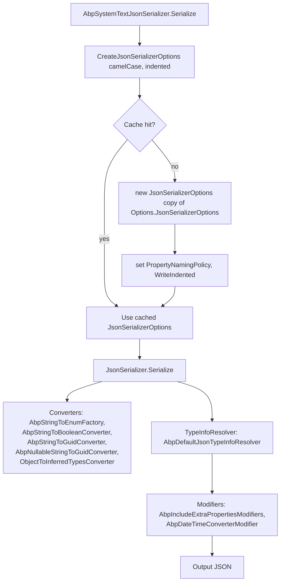

The ABP Framework `Volo.Abp.Json.SystemTextJson` package is the default implementation of `IJsonSerializer`. It wraps `System.Text.Json.JsonSerializer` with a set of converters and `JsonTypeInfo` modifiers so that ABP-specific behaviors — DateTime normalization, extra-property round-tripping, string-to-Guid/bool/enum coercion — work consistently across the framework.

All sources live under `framework/src/Volo.Abp.Json.SystemTextJson/Volo/Abp/Json/SystemTextJson/`.

## AbpJsonSystemTextJsonModule

```csharp
[DependsOn(typeof(AbpJsonAbstractionsModule), typeof(AbpTimingModule), typeof(AbpDataModule))]
public class AbpJsonSystemTextJsonModule : AbpModule
{
    public override void ConfigureServices(ServiceConfigurationContext context)
    {
        context.Services.AddAbpOptions<AbpSystemTextJsonSerializerOptions>()
            .Configure<IServiceProvider>((options, rootServiceProvider) =>
            {
                options.JsonSerializerOptions.Encoder ??= JavaScriptEncoder.UnsafeRelaxedJsonEscaping;

                options.JsonSerializerOptions.Converters.Add(new AbpStringToEnumFactory());
                options.JsonSerializerOptions.Converters.Add(new AbpStringToBooleanConverter());
                options.JsonSerializerOptions.Converters.Add(new AbpStringToGuidConverter());
                options.JsonSerializerOptions.Converters.Add(new AbpNullableStringToGuidConverter());
                options.JsonSerializerOptions.Converters.Add(new ObjectToInferredTypesConverter());

                options.JsonSerializerOptions.TypeInfoResolver = new AbpDefaultJsonTypeInfoResolver(
                    rootServiceProvider.GetRequiredService<IOptions<AbpSystemTextJsonSerializerModifiersOptions>>());

                var dateTimeConverter         = rootServiceProvider.GetRequiredService<AbpDateTimeConverter>().SkipDateTimeNormalization();
                var nullableDateTimeConverter = rootServiceProvider.GetRequiredService<AbpNullableDateTimeConverter>().SkipDateTimeNormalization();

                options.JsonSerializerOptions.TypeInfoResolver.As<AbpDefaultJsonTypeInfoResolver>().Modifiers.Add(
                    new AbpDateTimeConverterModifier(dateTimeConverter, nullableDateTimeConverter)
                        .CreateModifyAction());
            });
    }
}
```

(`framework/src/Volo.Abp.Json.SystemTextJson/Volo/Abp/Json/SystemTextJson/AbpJsonSystemTextJsonModule.cs`)

The module's `ConfigureServices` configures `AbpSystemTextJsonSerializerOptions` with the root provider, so the JSON converters can resolve other services (`IClock`, `ICurrentTimezoneProvider`, `ITimezoneProvider`) at construction time without exposing them to user code.

`UnsafeRelaxedJsonEscaping` is set as the default `Encoder` because the strict Web encoder rejects non-ASCII characters and ABP often emits text with localized content. Override it from your module if you need the strict encoder for OWASP compliance.

## AbpSystemTextJsonSerializer

```csharp
public class AbpSystemTextJsonSerializer : IJsonSerializer, ITransientDependency
{
    protected AbpSystemTextJsonSerializerOptions Options { get; }

    public string Serialize(object obj, bool camelCase = true, bool indented = false)
        => JsonSerializer.Serialize(obj, CreateJsonSerializerOptions(camelCase, indented));

    public T Deserialize<T>(string jsonString, bool camelCase = true)
        => JsonSerializer.Deserialize<T>(jsonString, CreateJsonSerializerOptions(camelCase))!;

    public object Deserialize(Type type, string jsonString, bool camelCase = true)
        => JsonSerializer.Deserialize(jsonString, type, CreateJsonSerializerOptions(camelCase))!;

    protected virtual JsonSerializerOptions CreateJsonSerializerOptions(bool camelCase = true, bool indented = false)
    {
        return JsonSerializerOptionsCache.GetOrAdd(new { camelCase, indented, Options.JsonSerializerOptions }, _ =>
            new JsonSerializerOptions(Options.JsonSerializerOptions)
            {
                PropertyNamingPolicy = camelCase ? JsonNamingPolicy.CamelCase : null,
                WriteIndented = indented
            });
    }
}
```

(`framework/src/Volo.Abp.Json.SystemTextJson/Volo/Abp/Json/SystemTextJson/AbpSystemTextJsonSerializer.cs`)

`JsonSerializerOptionsCache` is a `ConcurrentDictionary<object, JsonSerializerOptions>` keyed by `(camelCase, indented, baseOptions)`. The cache is essential — System.Text.Json caches metadata per `JsonSerializerOptions` instance, so reusing the same instance for each `(camelCase, indented)` combination keeps deserialization fast.

The `JsonSerializerOptions` copy constructor (`new JsonSerializerOptions(Options.JsonSerializerOptions)`) clones every field, including the converters and the TypeInfoResolver — so the per-`(camelCase, indented)` variant inherits all the ABP-specific behavior.

## AbpSystemTextJsonSerializerOptions

```csharp
public class AbpSystemTextJsonSerializerOptions
{
    public JsonSerializerOptions JsonSerializerOptions { get; }

    public AbpSystemTextJsonSerializerOptions()
    {
        JsonSerializerOptions = new JsonSerializerOptions(JsonSerializerDefaults.Web)
        {
            ReadCommentHandling = JsonCommentHandling.Skip,
            AllowTrailingCommas = true
        };
    }
}
```

(`framework/src/Volo.Abp.Json.SystemTextJson/Volo/Abp/Json/SystemTextJson/AbpSystemTextJsonSerializerOptions.cs`)

`JsonSerializerDefaults.Web` (System.Text.Json's "web defaults" preset) gives:

- `PropertyNamingPolicy = JsonNamingPolicy.CamelCase`
- `PropertyNameCaseInsensitive = true`
- `NumberHandling = AllowReadingFromString`

ABP adds comment skipping and trailing-comma tolerance on top — useful for hand-edited JSON config inputs.

Configure additional options from your module:

```csharp
Configure<AbpSystemTextJsonSerializerOptions>(o =>
{
    o.JsonSerializerOptions.WriteIndented = false;
    o.JsonSerializerOptions.IncludeFields = true;
    o.JsonSerializerOptions.Converters.Add(new MyCustomConverter());
});
```

## Built-in converters

All under `framework/src/Volo.Abp.Json.SystemTextJson/Volo/Abp/Json/SystemTextJson/JsonConverters/`.

### AbpStringToEnumFactory and AbpStringToEnumConverter

`AbpStringToEnumFactory.cs` is a `JsonConverterFactory` that produces an `AbpStringToEnumConverter<T>` for any enum type. The converter wraps System.Text.Json's built-in `JsonStringEnumConverter` and adds support for reading and writing enums as property names:

```csharp
public override T ReadAsPropertyName(ref Utf8JsonReader reader, Type typeToConvert, JsonSerializerOptions options)
    => (T)Enum.Parse(typeToConvert, reader.GetString()!);

public override void WriteAsPropertyName(Utf8JsonWriter writer, T value, JsonSerializerOptions options)
    => writer.WritePropertyName(Enum.GetName(typeof(T), value)!);
```

This allows `Dictionary<MyEnum, T>` to round-trip with string keys instead of numeric ones.

`AbpStringToEnumConverter<T>.cs` lazily clones the `JsonSerializerOptions` once per direction (Read / Write) via `JsonSerializerOptionsHelper.Create` so the inner `JsonStringEnumConverter` does not collide with the factory itself.

### AbpStringToBooleanConverter

`AbpStringToBooleanConverter.cs` accepts booleans encoded as `"true"` / `"false"` strings as well as native JSON booleans. It uses `Utf8Parser.TryParse` for the fast UTF-8 path and falls back to `bool.TryParse`:

```csharp
if (reader.TokenType == JsonTokenType.String)
{
    var span = reader.HasValueSequence ? reader.ValueSequence.ToArray() : reader.ValueSpan;
    if (Utf8Parser.TryParse(span, out bool b1, out var bytesConsumed) && span.Length == bytesConsumed)
        return b1;
    if (bool.TryParse(reader.GetString(), out var b2))
        return b2;
}
return reader.GetBoolean();
```

### AbpStringToGuidConverter and AbpNullableStringToGuidConverter

`AbpStringToGuidConverter.cs` parses any of the five `Guid` formats — `N`, `D`, `B`, `P`, `X` — when the JSON value is a string. The nullable variant returns `null` for `null` values and parses non-null strings the same way.

### ObjectToInferredTypesConverter

`ObjectToInferredTypesConverter.cs` is the System.Text.Json equivalent of `JObject`'s implicit dynamic resolution. When a property is typed `object`, the converter inspects the JSON token and returns `bool`, `long`, `double`, `DateTime`, `string` or a `JsonElement` clone:

```csharp
JsonTokenType.True   => true,
JsonTokenType.False  => false,
JsonTokenType.Number when reader.TryGetInt64(out var l) => l,
JsonTokenType.Number => reader.GetDouble(),
JsonTokenType.String when reader.TryGetDateTime(out var d) => d,
JsonTokenType.String => reader.GetString(),
_                    => JsonDocument.ParseValue(ref reader).RootElement.Clone()
```

The write side dispatches on the runtime type rather than the static `object` type so polymorphic payloads serialize as their actual shape.

### AbpDateTimeConverter / AbpNullableDateTimeConverter

`AbpDateTimeConverter.cs` and `AbpNullableDateTimeConverter.cs` inherit from `AbpDateTimeConverterBase<T>` (`AbpDateTimeConverterBase.cs`), which performs the actual read/write logic. The base class is constructed with `IClock`, `IOptions<AbpJsonOptions>`, `ICurrentTimezoneProvider` and `ITimezoneProvider`. It supports:

- Reading from `Utf8JsonReader.TryGetDateTime` for ISO 8601 dates.
- Falling back to `Options.InputDateTimeFormats` for custom formats.
- Falling back to `DateTime.TryParse` with `CultureInfo.CurrentUICulture`.
- Writing with `Utf8JsonWriter.WriteStringValue(DateTime)` (default) or `dateTime.ToString(OutputDateTimeFormat, CultureInfo.CurrentUICulture)` if `AbpJsonOptions.OutputDateTimeFormat` is set.
- Normalizing the read/written DateTime via `IClock.Normalize` and the current timezone provider.
- Skipping normalization when the property carries `[DisableDateTimeNormalization]` (handled by the modifier — see below).

`SkipDateTimeNormalization()` flips an instance flag and returns `this`. The module calls it on both converters before installing them into the modifier chain — because the modifier itself decides per-property whether normalization runs.

## Type info modifiers

System.Text.Json 8 exposes `JsonTypeInfo.Modifiers`, a list of callbacks that mutate the metadata of each type just before serialization. ABP uses this hook to layer cross-cutting behavior without forking the resolver.

### AbpDefaultJsonTypeInfoResolver

```csharp
public class AbpDefaultJsonTypeInfoResolver : DefaultJsonTypeInfoResolver
{
    public AbpDefaultJsonTypeInfoResolver(IOptions<AbpSystemTextJsonSerializerModifiersOptions> options)
    {
        foreach (var modifier in options.Value.Modifiers)
            Modifiers.Add(modifier);
    }
}
```

(`framework/src/Volo.Abp.Json.SystemTextJson/Volo/Abp/Json/SystemTextJson/AbpDefaultJsonTypeInfoResolver.cs`)

The resolver is created in `AbpJsonSystemTextJsonModule.ConfigureServices` and assigned to `JsonSerializerOptions.TypeInfoResolver`. It pre-loads every `Action<JsonTypeInfo>` declared in `AbpSystemTextJsonSerializerModifiersOptions.Modifiers`.

### AbpSystemTextJsonSerializerModifiersOptions

```csharp
public class AbpSystemTextJsonSerializerModifiersOptions
{
    public List<Action<JsonTypeInfo>> Modifiers { get; }

    public AbpSystemTextJsonSerializerModifiersOptions()
    {
        Modifiers = new List<Action<JsonTypeInfo>>
        {
            AbpIncludeExtraPropertiesModifiers.Modify,
        };
    }
}
```

(`framework/src/Volo.Abp.Json.SystemTextJson/Volo/Abp/Json/SystemTextJson/AbpSystemTextJsonSerializerModifiersOptions.cs`)

Out of the box, only `AbpIncludeExtraPropertiesModifiers.Modify` is registered. The module then **appends** `AbpDateTimeConverterModifier.CreateModifyAction()` at startup so it can capture the resolved `AbpDateTimeConverter` / `AbpNullableDateTimeConverter` instances.

### AbpIncludeExtraPropertiesModifiers

```csharp
public static void Modify(JsonTypeInfo jsonTypeInfo)
{
    if (typeof(IHasExtraProperties).IsAssignableFrom(jsonTypeInfo.Type))
    {
        var propertyJsonInfo = jsonTypeInfo.Properties
            .Where(x => x.AttributeProvider is MemberInfo)
            .FirstOrDefault(x => x.PropertyType == typeof(ExtraPropertyDictionary)
                && x.AttributeProvider!.As<MemberInfo>().Name == nameof(ExtensibleObject.ExtraProperties)
                && x.Set == null);

        if (propertyJsonInfo != null)
            propertyJsonInfo.Set = (obj, value) =>
                ObjectHelper.TrySetProperty(obj.As<IHasExtraProperties>(), x => x.ExtraProperties, () => value);
    }
}
```

(`framework/src/Volo.Abp.Json.SystemTextJson/Volo/Abp/Json/SystemTextJson/Modifiers/AbpIncludeExtraPropertiesModifiers.cs`)

`IHasExtraProperties` (from `Volo.Abp.Data`) exposes `ExtraProperties` with no public setter on most types. The modifier opens it up for deserialization without breaking encapsulation by using `ObjectHelper.TrySetProperty` reflection.

This is what allows ABP entities to round-trip `[Extension]` fields through JSON without writing custom converters for every aggregate.

### AbpDateTimeConverterModifier

```csharp
private void Modify(JsonTypeInfo jsonTypeInfo)
{
    if (ReflectionHelper.GetAttributesOfMemberOrDeclaringType<DisableDateTimeNormalizationAttribute>(jsonTypeInfo.Type).Any())
        return;

    foreach (var property in jsonTypeInfo.Properties.Where(x =>
        x.PropertyType == typeof(DateTime) || x.PropertyType == typeof(DateTime?)))
    {
        if (property.AttributeProvider == null ||
            !property.AttributeProvider.GetCustomAttributes(typeof(DisableDateTimeNormalizationAttribute), false).Any())
        {
            property.CustomConverter = property.PropertyType == typeof(DateTime)
                ? _abpDateTimeConverter
                : _abpNullableDateTimeConverter;
        }
    }
}
```

(`framework/src/Volo.Abp.Json.SystemTextJson/Volo/Abp/Json/SystemTextJson/Modifiers/AbpDateTimeConverterModifier.cs`)

Skip the type entirely if `[DisableDateTimeNormalization]` is on the type. Otherwise iterate `DateTime` / `DateTime?` properties and install the ABP converter unless the property carries the same opt-out attribute. The same logic powers the Newtonsoft side — both providers honor the attribute consistently.

### AbpIgnorePropertiesModifiers and AbpIncludeNonPublicPropertiesModifiers

`AbpIgnorePropertiesModifiers<TClass, TProperty>` (`Modifiers/AbpIgnorePropertiesModifiers.cs`) removes a property from the serialized shape by name:

```csharp
public void Modify(JsonTypeInfo jsonTypeInfo)
{
    if (jsonTypeInfo.Type == typeof(TClass))
        jsonTypeInfo.Properties.RemoveAll(
            x => x.AttributeProvider is MemberInfo memberInfo
                 && memberInfo.Name == _propertySelector.Body.As<MemberExpression>().Member.Name);
}
```

`AbpIncludeNonPublicPropertiesModifiers<TClass, TProperty>` (`Modifiers/AbpIncludeNonPublicPropertiesModifiers.cs`) enables write-access to a non-public property by attaching a setter that uses `PropertyInfo.SetValue` directly.

Wire both with the helper `CreateModifyAction(propertySelector)`:

```csharp
Configure<AbpSystemTextJsonSerializerModifiersOptions>(o =>
{
    o.Modifiers.Add(new AbpIgnorePropertiesModifiers<MyDto, string>()
        .CreateModifyAction(x => x.SecretField));
});
```

## Pipeline visualized



## ObjectExtensions integration

`AbpIncludeExtraPropertiesModifiers.Modify` is what hooks the JSON serializer into ABP's [ObjectExtensions](/concerns/object-extending) machinery (`Volo.Abp.ObjectExtending`). When a `User` aggregate has `[Extension]` properties added through `ObjectExtensionManager`, the JSON output naturally includes the `ExtraProperties` dictionary, and deserialization writes back to it. No custom converter, no shape duplication.

## Encoder choice

`JavaScriptEncoder.UnsafeRelaxedJsonEscaping` is set as the default `Encoder` when none has been explicitly configured. This allows raw non-ASCII characters in JSON output:

```json
{ "name": "café 北京" }
```

If you need OWASP-strict escaping, override the encoder:

```csharp
Configure<AbpSystemTextJsonSerializerOptions>(o =>
{
    o.JsonSerializerOptions.Encoder = JavaScriptEncoder.Default;
});
```

## Reference

| Type | File |
| --- | --- |
| `AbpJsonSystemTextJsonModule` | `framework/src/Volo.Abp.Json.SystemTextJson/Volo/Abp/Json/SystemTextJson/AbpJsonSystemTextJsonModule.cs` |
| `AbpSystemTextJsonSerializer` | `framework/src/Volo.Abp.Json.SystemTextJson/Volo/Abp/Json/SystemTextJson/AbpSystemTextJsonSerializer.cs` |
| `AbpSystemTextJsonSerializerOptions` | `framework/src/Volo.Abp.Json.SystemTextJson/Volo/Abp/Json/SystemTextJson/AbpSystemTextJsonSerializerOptions.cs` |
| `AbpSystemTextJsonSerializerModifiersOptions` | `framework/src/Volo.Abp.Json.SystemTextJson/Volo/Abp/Json/SystemTextJson/AbpSystemTextJsonSerializerModifiersOptions.cs` |
| `AbpDefaultJsonTypeInfoResolver` | `framework/src/Volo.Abp.Json.SystemTextJson/Volo/Abp/Json/SystemTextJson/AbpDefaultJsonTypeInfoResolver.cs` |
| `AbpStringToEnumFactory` / `AbpStringToEnumConverter` | `framework/src/Volo.Abp.Json.SystemTextJson/Volo/Abp/Json/SystemTextJson/JsonConverters/AbpStringToEnumFactory.cs`, `AbpStringToEnumConverter.cs` |
| `AbpStringToBooleanConverter` | `framework/src/Volo.Abp.Json.SystemTextJson/Volo/Abp/Json/SystemTextJson/JsonConverters/AbpStringToBooleanConverter.cs` |
| `AbpStringToGuidConverter` / `AbpNullableStringToGuidConverter` | `framework/src/Volo.Abp.Json.SystemTextJson/Volo/Abp/Json/SystemTextJson/JsonConverters/AbpStringToGuidConverter.cs`, `AbpNullableStringToGuidConverter.cs` |
| `ObjectToInferredTypesConverter` | `framework/src/Volo.Abp.Json.SystemTextJson/Volo/Abp/Json/SystemTextJson/JsonConverters/ObjectToInferredTypesConverter.cs` |
| `AbpDateTimeConverter` / `AbpNullableDateTimeConverter` / base | `framework/src/Volo.Abp.Json.SystemTextJson/Volo/Abp/Json/SystemTextJson/JsonConverters/AbpDateTimeConverter.cs`, `AbpNullableDateTimeConverter.cs`, `AbpDateTimeConverterBase.cs` |
| Modifiers | `framework/src/Volo.Abp.Json.SystemTextJson/Volo/Abp/Json/SystemTextJson/Modifiers/` |
