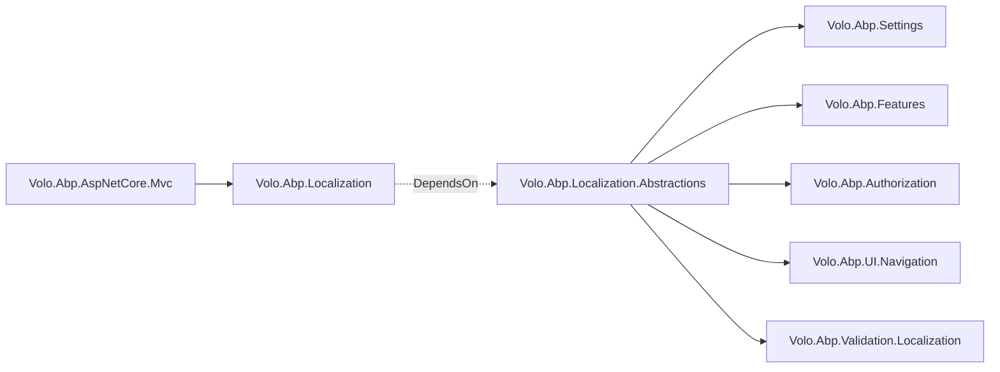

The `Volo.Abp.Localization.Abstractions` package is the interfaces-only layer of the ABP Framework localization stack. It exists so that low-level packages — module options, contract DTOs, attribute-based metadata — can describe *what* a localizable string is without taking a dependency on the JSON contributors, virtual file system, or runtime factory in `Volo.Abp.Localization`. Every file in this package lives under `framework/src/Volo.Abp.Localization.Abstractions/` and is documented here.

## Package layout

```
framework/src/Volo.Abp.Localization.Abstractions/
├── Microsoft/Extensions/Localization/
│   ├── AbpStringLocalizerFactoryExtensions.cs
│   └── IAbpStringLocalizerFactory.cs
└── Volo/Abp/Localization/
    ├── AbpLocalizationAbstractionsModule.cs
    ├── FixedLocalizableString.cs
    ├── HasNameWithLocalizableDisplayNameExtensions.cs
    ├── IAsyncLocalizableString.cs
    ├── IHasNameWithLocalizableDisplayName.cs
    ├── ILocalizableString.cs
    ├── LocalizableString.cs
    ├── LocalizableStringExtensions.cs
    └── LocalizationResourceNameAttribute.cs
```

`AbpLocalizationAbstractionsModule.cs` is intentionally empty — it serves only as the marker module that downstream modules can `[DependsOn]` without dragging in the runtime.

## IAbpStringLocalizerFactory

`framework/src/Volo.Abp.Localization.Abstractions/Microsoft/Extensions/Localization/IAbpStringLocalizerFactory.cs` extends ASP.NET Core's `IStringLocalizerFactory` with three ABP-specific operations:

```csharp
public interface IAbpStringLocalizerFactory
{
    IStringLocalizer? CreateDefaultOrNull();
    IStringLocalizer? CreateByResourceNameOrNull([NotNull] string resourceName);
    Task<IStringLocalizer?> CreateByResourceNameOrNullAsync([NotNull] string resourceName);
}
```

| Method | Purpose |
|---|---|
| `CreateDefaultOrNull` | Returns a localizer for `AbpLocalizationOptions.DefaultResourceType`, or `null` if none is configured. Lets `LocalizableString.Localize` fall back to a default resource. |
| `CreateByResourceNameOrNull` | Looks up a resource by its string name (`[LocalizationResourceName("MyApp")]`) rather than by CLR type — needed when a host serializes a resource reference into HTTP traffic. |
| `CreateByResourceNameOrNullAsync` | The asynchronous counterpart that lets external stores complete I/O before returning. The async path is used by dynamic localization, where resources can be fetched from a database. |

The extensions class in `framework/src/Volo.Abp.Localization.Abstractions/Microsoft/Extensions/Localization/AbpStringLocalizerFactoryExtensions.cs` wraps these in `IStringLocalizerFactory` extension methods so consumers can write `factory.CreateByResourceNameOrNull(name)` without first casting to `IAbpStringLocalizerFactory`. Inside, every method does a `localizerFactory as IAbpStringLocalizerFactory` test — if the factory in DI is not ABP's, the call returns `null` rather than throwing.

The `CreateByResourceName` and `CreateByResourceNameAsync` variants throw `AbpException("Couldn't find a localizer with given resource name: ...")` when the resource is missing — useful when "missing" is a configuration bug rather than an expected case.

## ILocalizableString and LocalizableString

`framework/src/Volo.Abp.Localization.Abstractions/Volo/Abp/Localization/ILocalizableString.cs` is the contract for "anything that can produce a `LocalizedString` given an `IStringLocalizerFactory`":

```csharp
public interface ILocalizableString
{
    LocalizedString Localize(IStringLocalizerFactory stringLocalizerFactory);
}
```

The concrete `LocalizableString` class in `framework/src/Volo.Abp.Localization.Abstractions/Volo/Abp/Localization/LocalizableString.cs` carries a resource pointer (either as a CLR type or as a string name) plus a key name. The point of this class is to defer the actual translation to a moment in time when the `IStringLocalizerFactory` is available — at startup you may register options for menus, settings, permission groups, or feature definitions where DI does not yet exist or where holding a localizer reference would create a service-locator anti-pattern.

The class has three constructor overloads documented in the file itself:

```csharp
public LocalizableString(Type? resourceType, [NotNull] string name)
public LocalizableString([NotNull] string name, string? resourceName = null)
public static LocalizableString Create<TResource>([NotNull] string name)
public static LocalizableString Create(Type resourceType, [NotNull] string name)
public static LocalizableString Create([NotNull] string name, string? resourceName = null)
```

If you pass a `resourceType`, the constructor automatically reads `[LocalizationResourceName]` off it via `LocalizationResourceNameAttribute.GetName(resourceType)` and stores both `ResourceType` and `ResourceName`. If you pass only a name and an optional `resourceName`, the type information is `null` and the localizer must be looked up by string.

The localization algorithm inside `LocalizableString.Localize` (also defined in `LocalizableString.cs`):

<Steps>
  <Step title="Resolve a localizer">
    `CreateStringLocalizerOrNull` calls `stringLocalizerFactory.Create(ResourceType)` if a type is present, then falls back to `CreateByResourceNameOrNull(ResourceName)`, then to `CreateDefaultOrNull()`.
  </Step>
  <Step title="Index into the localizer">
    `localizer[Name]` returns a `LocalizedString` with `ResourceNotFound` set to true if the key is missing.
  </Step>
  <Step title="Cross-resource fallback">
    If the lookup says `ResourceNotFound` *and* a `ResourceName` was given, the algorithm asks `CreateDefaultOrNull()` for the same key. This is what makes shared keys like `"DisplayName:Name"` resolvable from a module's default resource even when the calling resource doesn't define them.
  </Step>
  <Step title="Final fallback">
    If no localizer can be obtained at all, `Localize` returns `new LocalizedString(Name, Name, resourceNotFound: true)` — a "best effort" placeholder so the UI still renders something.
  </Step>
</Steps>

`LocalizeAsync` follows the same algorithm but throws `AbpException` instead of silently falling back to the raw name when no resource is configured at all — designed for code paths where missing localization should surface as an error rather than as a placeholder.

## IAsyncLocalizableString

`framework/src/Volo.Abp.Localization.Abstractions/Volo/Abp/Localization/IAsyncLocalizableString.cs` is the async counterpart so that dynamic stores can do I/O during resolution:

```csharp
public interface IAsyncLocalizableString
{
    Task<LocalizedString> LocalizeAsync(IStringLocalizerFactory stringLocalizerFactory);
}
```

`LocalizableString` implements both `ILocalizableString` and `IAsyncLocalizableString`, so it works in both worlds. The helper in `framework/src/Volo.Abp.Localization.Abstractions/Volo/Abp/Localization/LocalizableStringExtensions.cs` makes the async path transparent:

```csharp
public static async Task<LocalizedString> LocalizeAsync(
    this ILocalizableString localizableString,
    IStringLocalizerFactory stringLocalizerFactory)
{
    if (localizableString is IAsyncLocalizableString asyncLocalizableString)
    {
        return await asyncLocalizableString.LocalizeAsync(stringLocalizerFactory);
    }

    return localizableString.Localize(stringLocalizerFactory);
}
```

Application code can therefore write `await displayName.LocalizeAsync(factory)` without checking which concrete subtype the metadata carries.

## FixedLocalizableString

For UI labels that should never be translated, `framework/src/Volo.Abp.Localization.Abstractions/Volo/Abp/Localization/FixedLocalizableString.cs` provides a degenerate implementation that ignores the factory and returns its value verbatim:

```csharp
public class FixedLocalizableString : ILocalizableString
{
    public string Value { get; }

    public FixedLocalizableString(string value) => Value = Check.NotNull(value, nameof(value));

    public LocalizedString Localize(IStringLocalizerFactory stringLocalizerFactory)
        => new LocalizedString(Value, Value);
}
```

This is what menus, settings, and other definition APIs accept when you have a literal "MyVendor" brand name to render across all cultures — it satisfies the `ILocalizableString` contract without requiring you to add a useless JSON entry.

## LocalizationResourceNameAttribute

`framework/src/Volo.Abp.Localization.Abstractions/Volo/Abp/Localization/LocalizationResourceNameAttribute.cs` is the attribute placed on resource classes to give them a stable string name that survives type renames or moves across assemblies:

```csharp
[LocalizationResourceName("MyApp")]
public class MyAppResource { }
```

The attribute exposes two static helpers documented in the file:

- `GetOrNull(Type resourceType)` — returns the attribute if present, `null` otherwise.
- `GetName(Type resourceType)` — returns the configured name or, if the attribute is missing, falls back to `resourceType.FullName`.

The fallback to `FullName` is what lets you skip the attribute during prototyping — your resource still gets a unique name — but you should add the explicit attribute before you ship anything HTTP-facing, because the resource name appears in `ApplicationLocalizationDto` payloads and renaming a class would otherwise be a breaking change.

## IHasNameWithLocalizableDisplayName

`framework/src/Volo.Abp.Localization.Abstractions/Volo/Abp/Localization/IHasNameWithLocalizableDisplayName.cs` is a tiny convention for definition objects (settings, features, permissions) that have an internal `Name` and a user-visible `DisplayName`:

```csharp
public interface IHasNameWithLocalizableDisplayName
{
    string Name { get; }
    ILocalizableString? DisplayName { get; }
}
```

The companion `HasNameWithLocalizableDisplayNameExtensions.GetLocalizedDisplayName` in `HasNameWithLocalizableDisplayNameExtensions.cs` is the canonical way to render such objects. The algorithm:

1. If `DisplayName != null`, call `DisplayName.Localize(stringLocalizerFactory)` and return that.
2. Otherwise, ask `CreateDefaultOrNull()` for `"{localizationNamePrefix}{source.Name}"` — defaulting to `"DisplayName:{Name}"`.
3. If the prefixed key was found, return it; if `localizationNamePrefix` is empty, the prefixed value is returned regardless.
4. Otherwise fall back to `defaultStringLocalizer[source.Name]` — the plain key without prefix.

This is why an ABP setting `"Abp.Identity.Password.RequiredLength"` rendered in the UI looks at `DisplayName:Abp.Identity.Password.RequiredLength` in the default resource and ultimately at the raw `Abp.Identity.Password.RequiredLength` key if both are missing.

## Module class

`framework/src/Volo.Abp.Localization.Abstractions/Volo/Abp/Localization/AbpLocalizationAbstractionsModule.cs` is empty:

```csharp
public class AbpLocalizationAbstractionsModule : AbpModule
{
}
```

Its existence lets `Volo.Abp.Localization` depend on it via `[DependsOn(typeof(AbpLocalizationAbstractionsModule))]` (verified in `framework/src/Volo.Abp.Localization/Volo/Abp/Localization/AbpLocalizationModule.cs`), and lets contract assemblies that only describe localizable metadata `[DependsOn]` this module without dragging in the full runtime — a common pattern for `*.Domain.Shared` projects.

## Where this package is consumed

The abstractions package is referenced by the following framework projects so they can describe localization without depending on the runtime:

| Consumer | Why |
|---|---|
| `framework/src/Volo.Abp.Settings/` | `SettingDefinition.DisplayName` and `Description` are `ILocalizableString`. |
| `framework/src/Volo.Abp.Features/` | `FeatureDefinition` uses the same `ILocalizableString` shape for display names. |
| `framework/src/Volo.Abp.Authorization/` | Permission definitions describe localizable group and item names. |
| `framework/src/Volo.Abp.UI.Navigation/` | Menu items carry `ILocalizableString` titles. |
| `framework/src/Volo.Abp.Validation.Localization/` | `LocalizableStringExtensions` are used during model validation to render messages. |



The pattern lets a module like `Volo.Abp.Settings.Domain.Shared` describe its settings in a way that even a Blazor WebAssembly client can compile against, while the JSON-loading and culture-fallback logic only ships to projects that actually reference `Volo.Abp.Localization`.

For the runtime side — `AbpStringLocalizerFactory`, `LocalizationResource`, contributors, and `AbpLocalizationOptions` — see [Localization Core](/localization/localization-core).

## Constructor overloads of LocalizableString in detail

The `LocalizableString` class in `framework/src/Volo.Abp.Localization.Abstractions/Volo/Abp/Localization/LocalizableString.cs` deserves a closer look because its constructor overload set is the seam between "I have a resource type" and "I only have a resource name as a string". The three accepted shapes:

<Steps>
  <Step title="LocalizableString(Type resourceType, string name)">
    The most strongly typed form. The constructor reads `LocalizationResourceNameAttribute.GetName(resourceType)` and remembers both pieces. Later, `Localize` asks the factory for a localizer keyed by the type first (`stringLocalizerFactory.Create(resourceType)`), so the strongest possible lookup happens first.
  </Step>
  <Step title="LocalizableString(string name, string? resourceName = null)">
    The string-only form, used when the calling assembly does not reference the resource type. The constructor stores only the resource name. `Localize` therefore takes the slower path — calling `CreateByResourceNameOrNull(resourceName)` — but the result is the same.
  </Step>
  <Step title="LocalizableString.Create static helpers">
    Three static helpers — `Create<TResource>(name)`, `Create(Type, name)`, and `Create(name, resourceName)` — provide compositional sugar. They allocate a `LocalizableString` exactly as if you had called the matching constructor.
  </Step>
</Steps>

Why this matters: the resource-type form is faster (one dictionary lookup) and survives type renames cleanly (renaming the class automatically updates every `LocalizableString` reference). The resource-name form is the only choice when the calling assembly is a contract DLL that cannot reference the resource type's containing assembly — common in `*.Domain.Shared` projects whose audience may include WASM clients with strict dependency hygiene.

## Failure modes and what each one means

The localization abstractions have three distinct "missing string" outcomes documented across the package:

| Outcome | Cause | Behavior |
|---|---|---|
| `LocalizedString.ResourceNotFound == true` | The localizer was created but did not have the key in the requested culture or any fallback. | The string's `Value` is the key itself, and the UI typically renders the key (e.g. `DisplayName:Name`). |
| Returned `LocalizedString(name, name, resourceNotFound: true)` from `LocalizableString.Localize` | The factory could not produce *any* localizer at all (no resource, no default resource). | Same value as above, but the failure is at the resource-resolution level rather than the key-resolution level. |
| `AbpException` from `LocalizeAsync` | Same as above but in the async path, which is stricter. | Caller must catch or let it bubble. |

When you see a `DisplayName:Foo` literal in the UI, it almost always means the *resource* exists but the *key* is missing — you forgot to add `"DisplayName:Foo": "Foo Display Name"` to your `en.json`. When you see the raw key without any prefix, the resource itself was never registered.

## Practical patterns

<Card title="Use FixedLocalizableString for brand names" icon="bookmark">
  Brand names, product codes, and other never-translated literals should be wrapped in `FixedLocalizableString` rather than added to JSON. This keeps your translation files focused on actual user-facing text.
</Card>

<Card title="Use LocalizableString.Create for definition objects" icon="object-group">
  Setting, feature, and permission definitions live in module bootstrap code and must defer translation until DI is online. `LocalizableString.Create<MyResource>("KeyName")` is the canonical pattern in those `ConfigureServices` lambdas.
</Card>

<Card title="Use `[LocalizationResourceName]` early" icon="tag">
  Add the attribute the moment you create a resource class. The string name appears in HTTP traffic (`/api/abp/application-localization` payloads), and changing it later is a breaking change for any HTTP client.
</Card>

## Composition over inheritance

The abstractions package favors composition: `LocalizableString` *contains* a key and a resource reference, but does not inherit from anything. `FixedLocalizableString` shares the `ILocalizableString` contract but is a distinct class. This matters when you want to add a new kind of localizable string — say, one that pulls values from an external translation API at runtime. Implement `ILocalizableString` (and optionally `IAsyncLocalizableString` for I/O), and the rest of the framework will treat your type identically to the built-in ones.

A sketch of a custom implementation:

```csharp
public class RemoteApiLocalizableString : ILocalizableString, IAsyncLocalizableString
{
    public string Key { get; }
    public RemoteApiLocalizableString(string key) => Key = key;

    public LocalizedString Localize(IStringLocalizerFactory factory)
        => AsyncHelper.RunSync(() => LocalizeAsync(factory));

    public async Task<LocalizedString> LocalizeAsync(IStringLocalizerFactory factory)
    {
        var http = ServiceLocator.Get<IHttpClientFactory>();
        var value = await http.CreateClient("translation").GetStringAsync($"/t/{Key}");
        return new LocalizedString(Key, value);
    }
}
```

Such a class plugs straight into menu definitions, setting definitions, and any other ABP API that accepts an `ILocalizableString`. The point is that the abstractions are intentionally small so you can extend them without forking the framework.

## Versioning the resource name

Once `[LocalizationResourceName("MyApp")]` ships, the string `"MyApp"` becomes part of your public contract because it appears in `ApplicationLocalizationDto` payloads consumed by Blazor / MAUI / WPF / JavaScript clients. The corollary: do not change the value after release. If you must rename, use the `[LocalizationResourceName("MyApp_V2")]` pattern and keep the old class around for one release cycle so the older clients can still resolve the old name via `IAbpStringLocalizerFactory.CreateByResourceNameOrNull("MyApp")`.

## ILocalizableStringSerializer and persisted definitions

A small but important corner of the abstractions is how `ILocalizableString` instances survive a round-trip through configuration files or databases. `framework/src/Volo.Abp.Localization/Volo/Abp/Localization/ILocalizableStringSerializer.cs` (in the runtime package, not abstractions) defines:

```csharp
public interface ILocalizableStringSerializer
{
    string Serialize(ILocalizableString? localizableString);
    ILocalizableString? Deserialize(string? value);
}
```

The default `LocalizableStringSerializer` writes a `LocalizableString` as `"L:MyResourceName,Key"`, a `FixedLocalizableString` as `"f:Value"`, and `null` as `null`. The serializer is used by modules that persist definitions to a database — feature definitions, permission definitions, etc. — so administrators can override them from a UI without losing the resource/key linkage.

The contract is part of the runtime rather than the abstractions because deserialization needs `IAbpStringLocalizerFactory` to resolve the resource name back to a concrete type. The abstractions stay dependency-free.

## How `[LocalizationResourceName]` interacts with renaming

A subtle nuance worth knowing: the `GetName` static method on `LocalizationResourceNameAttribute` returns `resourceType.FullName` when the attribute is missing. That means the *moment* you add the attribute to a resource class, you potentially break HTTP clients that previously serialized the FullName-based resource name. Always add the attribute *before* the first release of any resource so the public name is stable from day one.

## Pattern: defaulting display names by name prefix

The `localizationNamePrefix` parameter on `HasNameWithLocalizableDisplayNameExtensions.GetLocalizedDisplayName` defaults to `"DisplayName:"` — but the entire scheme is configurable. ABP modules use distinct prefixes for distinct kinds of metadata:

| Prefix | Used for |
|---|---|
| `DisplayName:` | Feature, setting, permission display names. |
| `Description:` | Setting and feature long-form descriptions. |
| `Permission:` | Permission display strings when looked up by permission name. |

When you introduce a new metadata kind, pick a fresh prefix and pass it to `GetLocalizedDisplayName` so your translations stay distinct from the framework's.
