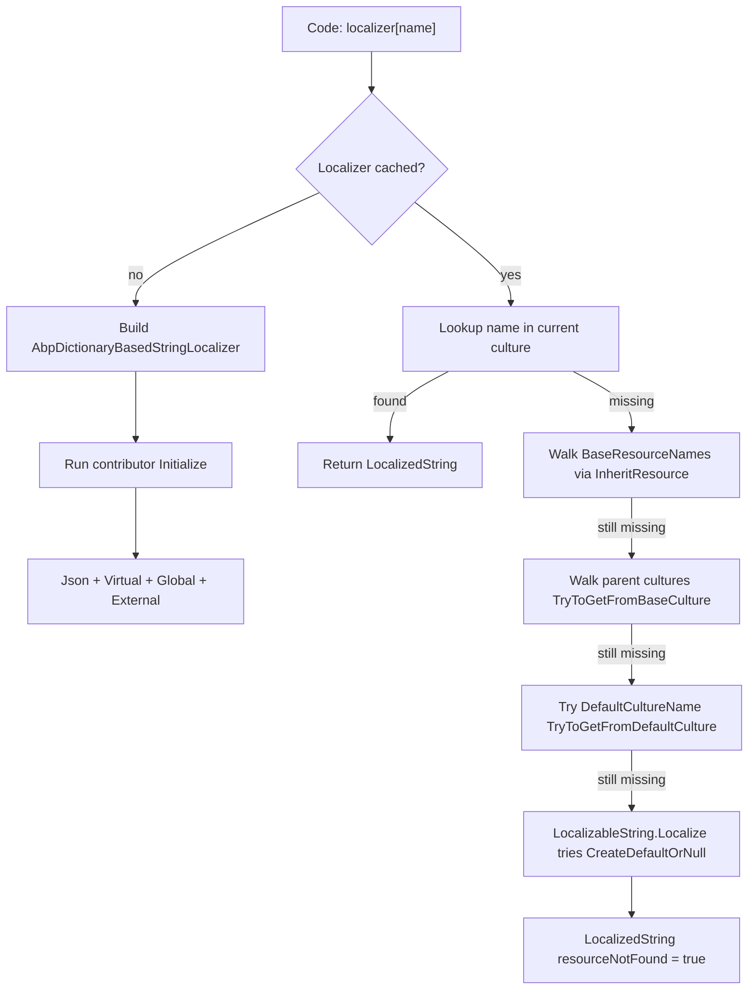
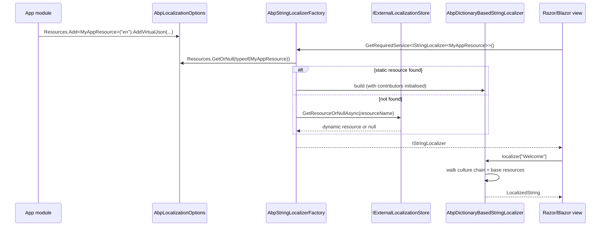

The ABP Framework's localization stack is split across two packages that you almost always reference together: `Volo.Abp.Localization.Abstractions` (interfaces and `LocalizableString`) and `Volo.Abp.Localization` (the runtime — `AbpStringLocalizerFactory`, `AbpDictionaryBasedStringLocalizer`, resource discovery, and the language provider). Together they replace ASP.NET Core's default `ResourceManagerStringLocalizerFactory` with something that can compose multiple JSON files, inherit translations across resources, fall back to a base culture, and pull dynamic strings from an external store.

This overview page maps the moving parts at a glance; the dedicated sub-pages dive into each layer.

## Two-package layout

```
framework/src/
├── Volo.Abp.Localization.Abstractions/
│   ├── Microsoft/Extensions/Localization/
│   │   ├── IAbpStringLocalizerFactory.cs
│   │   └── AbpStringLocalizerFactoryExtensions.cs
│   └── Volo/Abp/Localization/
│       ├── AbpLocalizationAbstractionsModule.cs
│       ├── FixedLocalizableString.cs
│       ├── HasNameWithLocalizableDisplayNameExtensions.cs
│       ├── IAsyncLocalizableString.cs
│       ├── IHasNameWithLocalizableDisplayName.cs
│       ├── ILocalizableString.cs
│       ├── LocalizableString.cs
│       ├── LocalizableStringExtensions.cs
│       └── LocalizationResourceNameAttribute.cs
└── Volo.Abp.Localization/
    └── Volo/Abp/Localization/
        ├── AbpDictionaryBasedStringLocalizer.cs
        ├── AbpLocalizationModule.cs
        ├── AbpLocalizationOptions.cs
        ├── AbpStringLocalizerFactory.cs
        ├── DefaultLanguageProvider.cs
        ├── DefaultResource.cs
        ├── ILanguageProvider.cs
        ├── ILocalizationResourceContributor.cs
        ├── LanguageInfo.cs
        ├── LocalizationResource.cs
        ├── LocalizationResourceBase.cs
        ├── LocalizationResourceContributorList.cs
        ├── LocalizationResourceDictionary.cs
        ├── External/
        │   ├── IExternalLocalizationStore.cs
        │   └── NullExternalLocalizationStore.cs
        ├── Json/
        │   ├── JsonLocalizationDictionaryBuilder.cs
        │   └── JsonLocalizationFile.cs
        └── VirtualFiles/
            ├── VirtualFileLocalizationResourceContributorBase.cs
            └── Json/
                └── JsonVirtualFileLocalizationResourceContributor.cs
```

The abstractions package can be referenced by libraries that need to *describe* localizable strings without depending on the runtime — for example, framework-level options classes that store user-facing labels — and the runtime package brings the actual localizers and JSON loaders.

## Conceptual roles at a glance

| Concept | Defined in | Role |
|---|---|---|
| `IStringLocalizer<T>` | Microsoft.Extensions.Localization (BCL) | The interface application code calls to translate keys. |
| `IStringLocalizerFactory` | Microsoft.Extensions.Localization (BCL) | Creates localizers by resource type. |
| `IAbpStringLocalizerFactory` | `framework/src/Volo.Abp.Localization.Abstractions/Microsoft/Extensions/Localization/IAbpStringLocalizerFactory.cs` | ABP-specific factory extension with default and by-name lookup. |
| `AbpStringLocalizerFactory` | `framework/src/Volo.Abp.Localization/Volo/Abp/Localization/AbpStringLocalizerFactory.cs` | Concrete factory replacing ASP.NET Core's; caches `AbpDictionaryBasedStringLocalizer`. |
| `LocalizationResource` | `framework/src/Volo.Abp.Localization/Volo/Abp/Localization/LocalizationResource.cs` | A named bundle of translations associated with a CLR type. |
| `ILocalizationResourceContributor` | `framework/src/Volo.Abp.Localization/Volo/Abp/Localization/ILocalizationResourceContributor.cs` | Plug-in supplier of translations (JSON files, dynamic store, etc.). |
| `LanguageInfo` | `framework/src/Volo.Abp.Localization/Volo/Abp/Localization/LanguageInfo.cs` | Display metadata for a supported culture. |
| `ILanguageProvider` | `framework/src/Volo.Abp.Localization/Volo/Abp/Localization/ILanguageProvider.cs` | Lists languages configured for the app. |
| `IExternalLocalizationStore` | `framework/src/Volo.Abp.Localization/Volo/Abp/Localization/External/IExternalLocalizationStore.cs` | Resolves resources defined outside the type system — used by the dynamic localization module. |
| `LocalizableString` | `framework/src/Volo.Abp.Localization.Abstractions/Volo/Abp/Localization/LocalizableString.cs` | Late-bound key + resource pair that can be localized when an `IStringLocalizerFactory` is later available. |

## Resolution chain

When code calls `LocalizableString.Create<MyResource>("MyKey").Localize(factory)` or directly indexes `IStringLocalizer<MyResource>["MyKey"]`, the framework runs the following chain. The numbers refer to where the logic lives:

1. `AbpStringLocalizerFactory.Create(resourceType)` looks up the resource via `AbpLocalizationOptions.Resources.GetOrNull(resourceType)` (in `framework/src/Volo.Abp.Localization/Volo/Abp/Localization/AbpStringLocalizerFactory.cs`). If no matching resource is registered, the factory falls back to ASP.NET Core's `ResourceManagerStringLocalizerFactory.Create` so any plain `.resx`-backed code keeps working.
2. If a resource is found, `CreateInternal` (also in `AbpStringLocalizerFactory.cs`) builds an `AbpDictionaryBasedStringLocalizer` once per resource and caches it under `LocalizerCache`. Building involves running every `ILocalizationResourceContributor.Initialize` registered on the resource — these contributors are the JSON files, virtual file scans, global extensions, and dynamic stores.
3. Lookups `[name]` first ask the cached localizer's own contributors via `AbpInternalLocalizationHelper.TryGetLocalizedStringFromContributors` (see `framework/src/Volo.Abp.Localization/Volo/Abp/Localization/AbpInternalLocalizationHelper.cs`), then walk the base resources declared via `[InheritResource]` (handled in `LocalizationResource.AddBaseResourceTypes`).
4. If still missing and `AbpLocalizationOptions.TryToGetFromBaseCulture` is true (default), `AbpDictionaryBasedStringLocalizer` walks parent cultures (`zh-Hans-CN` → `zh-Hans` → `zh`) before falling through.
5. If `TryToGetFromDefaultCulture` is true (default), the lookup retries against the resource's `DefaultCultureName`.
6. Finally `LocalizableString.Localize` (defined in `framework/src/Volo.Abp.Localization.Abstractions/Volo/Abp/Localization/LocalizableString.cs`) optionally asks the default resource (`AbpLocalizationOptions.DefaultResourceType` resolved via `IAbpStringLocalizerFactory.CreateDefaultOrNull()`) for the same key, so cross-resource fallbacks are possible.



## What lives where in the documentation

<CardGroup cols={2}>
  <Card title="Abstractions" icon="cube" href="/localization/abstractions">
    `Volo.Abp.Localization.Abstractions` — the interfaces, `LocalizableString`, `FixedLocalizableString`, `[LocalizationResourceName]`, and the `IStringLocalizerFactory` extension methods.
  </Card>
  <Card title="Localization Core" icon="globe" href="/localization/localization-core">
    `Volo.Abp.Localization` — `AbpLocalizationModule`, `AbpLocalizationOptions`, `LanguageInfo`, `ILanguageProvider`, `LocalizationResource`, `AbpStringLocalizerFactory`, and the JSON and virtual-file contributors.
  </Card>
  <Card title="Timing and Clocks" icon="clock" href="/localization/timing-and-clocks">
    `Volo.Abp.Timing` — `IClock`, `AbpClockOptions.Kind`, `ITimezoneProvider`, `ICurrentTimezoneProvider`, and the `TZConvert`-backed implementation. Localization-adjacent because human-readable times depend on the current culture and time zone.
  </Card>
  <Card title="Resource pattern" icon="folder-tree" href="/localization/localization-core">
    The repository convention is one `MyAppResource` class per module under `MyApp.Localization` plus JSON files under `Localization/MyApp/en.json` — explored in detail in the core page.
  </Card>
</CardGroup>

## A minimal example, end to end

A typical ABP module configures `AbpLocalizationOptions` like this (the code mirrors `AbpLocalizationModule.cs` itself, which registers `DefaultResource` and `AbpLocalizationResource`):

```csharp
[DependsOn(typeof(AbpLocalizationModule))]
public class MyAppModule : AbpModule
{
    public override void ConfigureServices(ServiceConfigurationContext context)
    {
        Configure<AbpVirtualFileSystemOptions>(options =>
        {
            options.FileSets.AddEmbedded<MyAppModule>();
        });

        Configure<AbpLocalizationOptions>(options =>
        {
            options.Resources
                .Add<MyAppResource>("en")
                .AddVirtualJson("/Localization/MyApp");

            options.Languages.Add(new LanguageInfo("en", "en", "English"));
            options.Languages.Add(new LanguageInfo("tr", "tr", "Türkçe"));
        });
    }
}
```

At runtime:

- `[LocalizationResourceName("MyApp")]` on `MyAppResource` keys the resource by string so HTTP clients can refer to it by name; see `framework/src/Volo.Abp.Localization.Abstractions/Volo/Abp/Localization/LocalizationResourceNameAttribute.cs`.
- `AddVirtualJson("/Localization/MyApp")` adds a `JsonVirtualFileLocalizationResourceContributor` (`framework/src/Volo.Abp.Localization/Volo/Abp/Localization/VirtualFiles/Json/JsonVirtualFileLocalizationResourceContributor.cs`) that scans embedded JSON files like `Localization/MyApp/en.json`.
- The two `LanguageInfo` entries flow through `DefaultLanguageProvider` (`framework/src/Volo.Abp.Localization/Volo/Abp/Localization/DefaultLanguageProvider.cs`) and become the response of `GET /api/abp/application-configuration` for the language picker.

## Where each consumer plugs in

- **MVC / Razor Pages**: `framework/src/Volo.Abp.AspNetCore.Mvc/.../Localization/` adds `AbpRequestLocalizationOptions`-aware middleware that wraps ASP.NET Core's request culture providers.
- **Blazor**: `framework/src/Volo.Abp.AspNetCore.Components/.../Localization/` registers a culture provider that drives `CultureInfo.CurrentUICulture` from the application configuration DTO.
- **HTTP API clients**: `framework/src/Volo.Abp.Http.Client/.../ClientProxying/` forwards the current culture to the server via `Accept-Language` so server-side localizers resolve the same culture as the client.
- **Exception localization**: `AbpExceptionLocalizationOptions` (`framework/src/Volo.Abp.Localization/Volo/Abp/Localization/ExceptionHandling/AbpExceptionLocalizationOptions.cs`) maps exception error codes to resource keys, used by the HTTP exception filter.

Each downstream page in the ABP wiki refers back to this overview when it needs to explain how a culture flows to a localizer.

## The role of `IExternalLocalizationStore`

While the abstractions and core packages cover *static* resources defined in code with associated JSON files, ABP has a separate notion of *dynamic* resources whose translations live in a database and can be edited at runtime. The bridge between the two is `IExternalLocalizationStore`, declared at `framework/src/Volo.Abp.Localization/Volo/Abp/Localization/External/IExternalLocalizationStore.cs`:

```csharp
public interface IExternalLocalizationStore
{
    LocalizationResourceBase? GetResourceOrNull(string resourceName);
    Task<LocalizationResourceBase?> GetResourceOrNullAsync(string resourceName);
    Task<IReadOnlyList<LocalizationResourceBase>> GetResourcesAsync();
    Task<IEnumerable<string>> GetResourceNamesAsync();
    Task<bool> IsResourceExistsAsync(string resourceName);
}
```

The default no-op implementation `NullExternalLocalizationStore` (`framework/src/Volo.Abp.Localization/Volo/Abp/Localization/External/NullExternalLocalizationStore.cs`) is registered when nothing else is wired so the static-only path keeps working without ceremony. The Volo.Abp.LanguageManagement module — documented in its own wiki section — replaces it with a database-backed implementation so administrators can change translations from an admin UI.

Inside `AbpStringLocalizerFactory.CreateByResourceNameOrNull(name)` you can see the fall-through that consults the store after the static `Resources` dictionary returns nothing:

```csharp
var resource = AbpLocalizationOptions.Resources.GetOrDefault(resourceName);
if (resource == null)
{
    resource = ExternalLocalizationStore.GetResourceOrNull(resourceName);
    if (resource == null) return null;
}
return CreateInternal(resourceName, resource, lockCache);
```

This is the seam that makes "dynamic resources" possible without changing any consumer code: the same `IStringLocalizer<MyResource>` injection works regardless of whether the resource is JSON-on-disk or row-in-database.

## Inheritance, base resources, and `[InheritResource]`

Localization resources in ABP can declare base resources whose translations are visible to the derived resource. The attribute lives in `framework/src/Volo.Abp.Localization/Volo/Abp/Localization/InheritResourceAttribute.cs`:

```csharp
[LocalizationResourceName("MyApp")]
[InheritResource(typeof(AbpUiResource), typeof(AbpValidationResource))]
public class MyAppResource { }
```

The attribute implements `IInheritedResourceTypesProvider`, and `LocalizationResource.AddBaseResourceTypes()` populates `BaseResourceNames` with the names of every base resource. At lookup time, when a key is missing in `MyAppResource`, `AbpDictionaryBasedStringLocalizer` walks `BaseResourceNames` and consults the corresponding localizer for each one in turn — see `framework/src/Volo.Abp.Localization/Volo/Abp/Localization/AbpDictionaryBasedStringLocalizer.cs` and `AbpInternalLocalizationHelper.cs`.

The practical effect is that you do not have to copy validation messages or UI-framework strings into every module's JSON file — depend on `AbpValidationResource` once and every validation message comes for free.

## Language change events

When the active language changes — for example, the user picked a different culture from a language selector — the framework raises a `LanguageChangedEto` event so subscribers can react. The class lives at `framework/src/Volo.Abp.Localization/Volo/Abp/Localization/LanguageChangedEto.cs` and is published by `LocalizationSettingHelper.SetCurrentUICultureAsync` after the underlying setting is updated. Distributed event handlers can use the ETO to invalidate language-specific caches, refresh menus, or push UI updates to other tabs.

## Putting it together in a sequence



This is the canonical end-to-end picture you can hold in your head when reading the per-page deep dives.

## How the framework's own modules use the localization stack

Almost every ABP framework module ships a small set of localized strings for diagnostics, validation, and UI helpers. The pattern is uniform across the framework:

| Module | Resource class | JSON location |
|---|---|---|
| `Volo.Abp.Localization` | `AbpLocalizationResource` | `framework/src/Volo.Abp.Localization/Volo/Abp/Localization/Resources/AbpLocalization/` |
| `Volo.Abp.Timing` | `AbpTimingResource` | `framework/src/Volo.Abp.Timing/Volo/Abp/Timing/Localization/` |
| `Volo.Abp.Validation` | `AbpValidationResource` | `framework/src/Volo.Abp.Validation/Volo/Abp/Validation/Localization/` |
| `Volo.Abp.UI` | `AbpUiResource` | `framework/src/Volo.Abp.UI/Volo/Abp/UI/Localization/` |

Each module's `ConfigureServices` registers its resource against `AbpLocalizationOptions.Resources` and points to its embedded JSON virtual path. The pattern is exactly the same as in your own modules — there is no "framework path" that bypasses the public API.

## Versioned localization keys

A subtle convention worth knowing: ABP localization keys often follow a `Prefix:Suffix` pattern such as `DisplayName:Name`, `Description:Address`, or `Validation:Required`. The prefix indicates the *intent*, the suffix the *target*. The pattern lets `HasNameWithLocalizableDisplayNameExtensions.GetLocalizedDisplayName` (in the abstractions package) generate keys deterministically — e.g., a setting named `Address` produces a `DisplayName:Address` key.

Use this convention in your own modules to keep search-and-replace refactoring sane. The framework will still resolve any key you choose, but consistency pays off when a user reports a missing translation and you need to find the right JSON file.

## A walking tour of what each sub-page covers

To set expectations before you dive into the per-page material:

| Page | Source root | Focus |
|---|---|---|
| [Abstractions](/localization/abstractions) | `framework/src/Volo.Abp.Localization.Abstractions/` | Interfaces, `LocalizableString`, `FixedLocalizableString`, `[LocalizationResourceName]`. |
| [Localization Core](/localization/localization-core) | `framework/src/Volo.Abp.Localization/` | `AbpLocalizationModule`, options, factory, contributors, `LanguageInfo`, `ILanguageProvider`. |
| [Timing and Clocks](/localization/timing-and-clocks) | `framework/src/Volo.Abp.Timing/` | `IClock`, `AbpClockOptions.Kind`, `ITimezoneProvider`, `ICurrentTimezoneProvider`. |

Each page is self-contained and links back to this overview for the resolution-chain explanation.

## Where AbpRequestLocalizationOptions sits

`framework/src/Volo.Abp.AspNetCore.MultiTenancy/Volo/Abp/AspNetCore/MultiTenancy/Localization/AbpRequestLocalizationOptions.cs` and the corresponding middleware in `framework/src/Volo.Abp.AspNetCore/Volo/Abp/AspNetCore/Localization/` are the bridge between ASP.NET Core's request culture providers and the ABP language settings. The middleware reads the language setting (via `LocalizationSettingProvider` in `framework/src/Volo.Abp.Localization/Volo/Abp/Localization/LocalizationSettingProvider.cs`), assigns the culture to `CultureInfo.CurrentCulture` and `CurrentUICulture`, and that culture then flows through every `IStringLocalizer<T>.this[name]` call during the rest of the request.

The pattern is replicated in non-HTTP hosts:

- **Blazor**: a startup component reads `ApplicationConfigurationDto.Localization.CurrentCulture.Name` and assigns to `CultureInfo.DefaultThreadCurrentCulture`.
- **MAUI / WPF**: the application configuration cache supplies the same value to `CultureInfo.CurrentUICulture` at startup.
- **Background workers**: `IServiceScope`-scoped jobs that need a culture wrap their work in `using (CultureHelper.Use(cultureName)) { ... }` from `framework/src/Volo.Abp.Localization/Volo/Abp/Localization/CultureHelper.cs`.

These layers are deliberately thin so the rules described in this overview (resource lookup, base inheritance, parent-culture fallback) apply identically across every UI flavor.

## A note about culture aliasing

Different platforms occasionally disagree on the canonical culture name. Examples:

- Windows historically used `zh-CHS` and `zh-CHT`, while modern systems use `zh-Hans` and `zh-Hant`.
- macOS and Linux sometimes report `en_US` (with underscore) where Windows reports `en-US` (with hyphen).
- Some third-party libraries reject cultures unknown to their internal table even when the OS knows them.

`AbpLocalizationOptions.LanguagesMap` and `LanguageFilesMap` (configured via `AbpLocalizationOptionsExtensions.AddLanguagesMapOrUpdate` in `framework/src/Volo.Abp.Localization/Volo/Abp/Localization/AbpLocalizationOptionsExtensions.cs`) exist precisely so third-party packages can ship their own culture-name mapping table. The `package name` argument is the third-party identifier; the `NameValue` entries map `OS-reported name → package-specific name`.

A practical example: a date-picker library uses `zh-CHS` internally. To use your `zh-Hans` culture with that library, configure:

```csharp
Configure<AbpLocalizationOptions>(options =>
{
    options.AddLanguagesMapOrUpdate("MyDatePicker", new NameValue("zh-Hans", "zh-CHS"));
});
```

Then call `options.GetCurrentUICultureLanguagesMap("MyDatePicker")` inside the picker integration to translate. The aliasing system is the framework's escape hatch for cases where the world refuses to agree on culture identifiers.

## A glossary of the moving parts

To keep terminology unambiguous when reading the sub-pages, here are the canonical names the framework uses for things:

| Term | Meaning |
|---|---|
| Resource | A named bundle of translations associated with a CLR type (or, for dynamic resources, a string name). |
| Resource name | The string identifier of a resource; comes from `[LocalizationResourceName]` or `Type.FullName`. |
| Contributor | A pluggable source of translations attached to a resource (JSON virtual file, external store, code-supplied dictionary). |
| Culture | A `CultureInfo` instance; identifies a language/region (`en-US`, `tr-TR`, `zh-Hans-CN`). |
| Default culture | The culture a resource falls back to when the requested culture's dictionary is missing the key. |
| Base resource | A resource declared via `[InheritResource]` whose translations are visible to the derived resource. |
| Default resource | The application-level fallback resource set via `AbpLocalizationOptions.DefaultResourceType`. |
| Language | A `LanguageInfo` entry registered in `AbpLocalizationOptions.Languages`; surfaces in the language picker UI. |
| Localizer | An `IStringLocalizer<T>` instance — what consumers index into. |
| Factory | `IAbpStringLocalizerFactory`/`IStringLocalizerFactory` — what builds localizers from resources. |

Mixing up "resource" and "culture" (or "language" and "culture") is the most common source of confusion when debugging missing translations. The above glossary keeps the per-page material precise.
