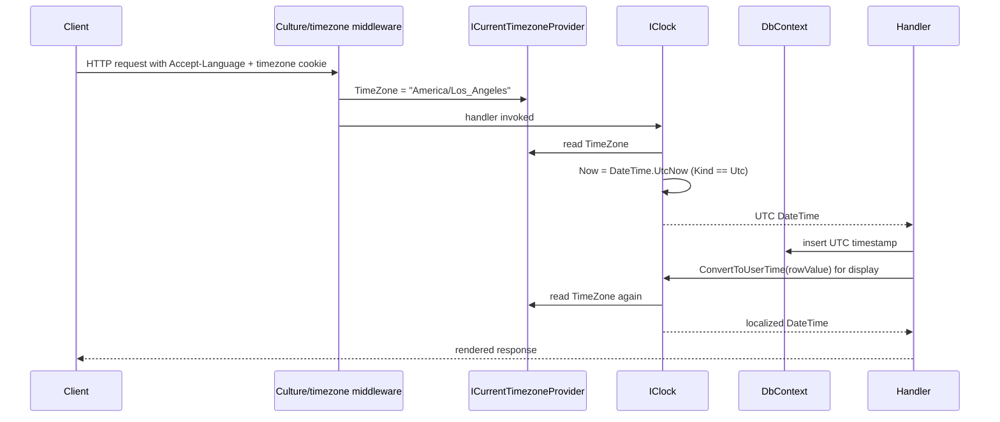

The `Volo.Abp.Timing` package gives the ABP Framework a single, replaceable abstraction over `DateTime.Now`, `DateTime.UtcNow`, and `TimeZoneInfo` conversion. Application code never reads the clock directly — it asks `IClock` for the current time, asks `ICurrentTimezoneProvider` for the user's zone, and calls `IClock.ConvertToUserTime` / `ConvertToUtc` instead of writing `DateTime` arithmetic by hand. The package source lives at `framework/src/Volo.Abp.Timing/Volo/Abp/Timing/`.

## Package layout

```
framework/src/Volo.Abp.Timing/Volo/Abp/Timing/
├── AbpClockOptions.cs
├── AbpTimingModule.cs
├── Clock.cs
├── CurrentTimezoneProvider.cs
├── CurrentTimezoneProviderExtensions.cs
├── DisableDateTimeNormalizationAttribute.cs
├── IClientTimezoneProvider.cs
├── IClock.cs
├── ITimezoneProvider.cs
├── Localization/AbpTimingResource.cs
├── TZConvertTimezoneProvider.cs
├── TimeZoneConsts.cs
├── TimeZoneHelper.cs
├── TimingSettingNames.cs
└── TimingSettingProvider.cs
```

## IClock — the abstraction

`framework/src/Volo.Abp.Timing/Volo/Abp/Timing/IClock.cs` defines the surface every consumer should program against:

```csharp
public interface IClock
{
    DateTime Now { get; }
    DateTimeKind Kind { get; }
    bool SupportsMultipleTimezone { get; }

    DateTime Normalize(DateTime dateTime);
    DateTime ConvertToUserTime(DateTime utcDateTime);
    DateTimeOffset ConvertToUserTime(DateTimeOffset dateTimeOffset);
    DateTime ConvertToUtc(DateTime dateTime);
}
```

The three observation properties carry the policy:

- `Now` — the current time according to the configured policy. Either local or UTC.
- `Kind` — the `DateTimeKind` the application treats as canonical.
- `SupportsMultipleTimezone` — whether the application stores UTC and can therefore meaningfully convert between zones.

The four operation methods are what callers use to keep timestamps consistent: `Normalize` coerces a value to the canonical kind; `ConvertToUserTime` and `ConvertToUtc` cross between UTC and the user's zone; the `DateTimeOffset` overload preserves the offset metadata.

## AbpClockOptions and DateTimeKind policy

`framework/src/Volo.Abp.Timing/Volo/Abp/Timing/AbpClockOptions.cs`:

```csharp
public class AbpClockOptions
{
    public DateTimeKind Kind { get; set; }

    public AbpClockOptions()
    {
        Kind = DateTimeKind.Unspecified;
    }
}
```

The single `Kind` property drives every decision in the `Clock` implementation. Three policies are possible:

<CardGroup cols={3}>
  <Card title="Unspecified (default)" icon="circle-question">
    `Normalize` is a no-op, `Now` returns `DateTime.Now`, `SupportsMultipleTimezone` is false. Use this only when the application does not care about time zones at all.
  </Card>
  <Card title="Utc" icon="clock">
    `Now` returns `DateTime.UtcNow`, `SupportsMultipleTimezone` becomes true, and `ConvertToUserTime` / `ConvertToUtc` start doing real `TimeZoneInfo.ConvertTime` work. This is the recommended setting for multi-tenant SaaS apps.
  </Card>
  <Card title="Local" icon="house">
    `Now` returns `DateTime.Now`, `Normalize` coerces UTC values to local, and `SupportsMultipleTimezone` is false. Use for single-tenant on-prem deployments where everyone is in the same physical location.
  </Card>
</CardGroup>

The policy is set via `Configure<AbpClockOptions>(options => options.Kind = DateTimeKind.Utc)` in any module's `ConfigureServices`.

## Clock — the implementation

`framework/src/Volo.Abp.Timing/Volo/Abp/Timing/Clock.cs` is the concrete `IClock`, registered as `ITransientDependency`. The class composes three collaborators: the options, `ICurrentTimezoneProvider`, and `ITimezoneProvider`.

### Now and Kind

```csharp
public virtual DateTime Now => Options.Kind == DateTimeKind.Utc ? DateTime.UtcNow : DateTime.Now;
public virtual DateTimeKind Kind => Options.Kind;
public virtual bool SupportsMultipleTimezone => Options.Kind == DateTimeKind.Utc;
```

The decision tree is intentionally narrow: only when the application chose UTC can multi-zone conversion happen. Local kinds intentionally fall through to no-op behavior because there is no zone metadata to convert from.

### Normalize

The `Normalize` method preserves the kind invariant of the application:

```csharp
public virtual DateTime Normalize(DateTime dateTime)
{
    if (Kind == DateTimeKind.Unspecified || Kind == dateTime.Kind) return dateTime;
    if (Kind == DateTimeKind.Local && dateTime.Kind == DateTimeKind.Utc) return dateTime.ToLocalTime();
    if (Kind == DateTimeKind.Utc && dateTime.Kind == DateTimeKind.Local) return dateTime.ToUniversalTime();
    return DateTime.SpecifyKind(dateTime, Kind);
}
```

The last `SpecifyKind` branch handles the case where the application's kind is set but the incoming value is `Unspecified` — for example, a value freshly deserialized from a database column declared without timezone metadata.

The companion `[DisableDateTimeNormalization]` attribute in `DisableDateTimeNormalizationAttribute.cs` opts properties or parameters out of automatic normalization performed by ABP filters (the validation pipeline, the JSON serializer, etc.). Use it when a column stores a literal user-entered date that must not be reinterpreted relative to UTC.

### ConvertToUserTime

`ConvertToUserTime` only does work when all three of the following hold:

1. `SupportsMultipleTimezone` is true (i.e., `Kind == Utc`).
2. The incoming `DateTime.Kind` is `DateTimeKind.Utc` (the overload for `DateTime`) — otherwise nothing meaningful can be deduced.
3. `CurrentTimezoneProvider.TimeZone` is non-empty.

When those conditions hold, it calls `TimezoneProvider.GetTimeZoneInfo(CurrentTimezoneProvider.TimeZone)` and then `TimeZoneInfo.ConvertTime(utcDateTime, timezoneInfo)`. The `DateTimeOffset` overload skips the kind check because offsets always carry their own zone information.

### ConvertToUtc

`ConvertToUtc` is the dual operation:

```csharp
public DateTime ConvertToUtc(DateTime dateTime)
{
    if (!SupportsMultipleTimezone ||
        dateTime.Kind == DateTimeKind.Utc ||
        CurrentTimezoneProvider.TimeZone.IsNullOrWhiteSpace())
    {
        return dateTime;
    }

    var timezoneInfo = TimezoneProvider.GetTimeZoneInfo(CurrentTimezoneProvider.TimeZone);
    dateTime = DateTime.SpecifyKind(dateTime, DateTimeKind.Unspecified);
    return TimeZoneInfo.ConvertTimeToUtc(dateTime, timezoneInfo);
}
```

The `SpecifyKind(..., Unspecified)` call before `ConvertTimeToUtc` is critical — `ConvertTimeToUtc` throws if the input claims to already be UTC or local in a way that conflicts with the source zone. Stripping the kind avoids that pitfall.

## ICurrentTimezoneProvider

`framework/src/Volo.Abp.Timing/Volo/Abp/Timing/CurrentTimezoneProvider.cs`:

```csharp
public class CurrentTimezoneProvider : ICurrentTimezoneProvider, ISingletonDependency
{
    public string? TimeZone
    {
        get => _currentScope.Value;
        set => _currentScope.Value = value;
    }

    private readonly AsyncLocal<string?> _currentScope;

    public CurrentTimezoneProvider()
    {
        _currentScope = new AsyncLocal<string?>();
    }
}
```

The provider uses `AsyncLocal<string?>` so the time zone flows across async boundaries within a logical operation but doesn't leak between concurrent requests. The string is either a Windows timezone ID (`"Pacific Standard Time"`) or an IANA name (`"America/Los_Angeles"`) — `TZConvertTimezoneProvider.GetTimeZoneInfo` accepts both.

The companion extension methods file `CurrentTimezoneProviderExtensions.cs` defines `Change(string?)` that returns an `IDisposable` (similar in spirit to `ICurrentTenant.Change`) so that a block of code can temporarily run in a different zone.

`framework/src/Volo.Abp.Timing/Volo/Abp/Timing/IClientTimezoneProvider.cs` is the client-side abstraction used by browser-based clients to ship the user's resolved IANA timezone to the server (typically through a cookie populated from `Intl.DateTimeFormat`).

## ITimezoneProvider — bridging Windows and IANA

`framework/src/Volo.Abp.Timing/Volo/Abp/Timing/ITimezoneProvider.cs`:

```csharp
public interface ITimezoneProvider
{
    List<NameValue> GetWindowsTimezones();
    List<NameValue> GetIanaTimezones();
    string WindowsToIana(string windowsTimeZoneId);
    string IanaToWindows(string ianaTimeZoneName);
    TimeZoneInfo GetTimeZoneInfo(string windowsOrIanaTimeZoneId);
}
```

The provider exists because Windows ships zones with names like `"Pacific Standard Time"` while IANA uses `"America/Los_Angeles"`, and a cross-platform ABP app needs to handle both interchangeably.

`framework/src/Volo.Abp.Timing/Volo/Abp/Timing/TZConvertTimezoneProvider.cs` is the default implementation, registered as `ITransientDependency`. It delegates to the `TimeZoneConverter` NuGet package:

```csharp
public virtual List<NameValue> GetWindowsTimezones()
    => TZConvert.KnownWindowsTimeZoneIds.OrderBy(x => x).Select(x => new NameValue(x, x)).ToList();

public virtual List<NameValue> GetIanaTimezones()
    => TZConvert.KnownIanaTimeZoneNames.OrderBy(x => x)
        .Where(x => x.Contains("/") && !x.Contains("Etc") || x == "UTC")
        .Select(x => new NameValue(x, x)).ToList();

public virtual string WindowsToIana(string id)  => TZConvert.WindowsToIana(id);
public virtual string IanaToWindows(string id)  => TZConvert.IanaToWindows(id);
public virtual TimeZoneInfo GetTimeZoneInfo(string id) => TZConvert.GetTimeZoneInfo(id);
```

The IANA filter intentionally drops `Etc/*` aliases except for the bare `"UTC"` — those are confusing to end users because their signs are inverted (e.g., `Etc/GMT+8` is actually UTC−8).

## TimeZoneHelper

`framework/src/Volo.Abp.Timing/Volo/Abp/Timing/TimeZoneHelper.cs` is a small static helper for rendering pickers in the UI:

```csharp
public static List<NameValue> GetTimezones(List<NameValue> timezones)
{
    return timezones
        .OrderBy(x => x.Name)
        .Select(TryCreateNameValueWithOffset)
        .OfType<NameValue>()
        .ToList();
}

public static NameValue? TryCreateNameValueWithOffset(NameValue timeZone)
{
    try
    {
        var timeZoneInfo = TZConvert.GetTimeZoneInfo(timeZone.Name);
        var name = $"{timeZone.Name} ({GetTimezoneOffset(timeZoneInfo)})";
        return new NameValue(name, timeZone.Name);
    }
    catch (Exception) { return null; }
}

public static string GetTimezoneOffset(TimeZoneInfo timeZoneInfo)
{
    if (timeZoneInfo.BaseUtcOffset < TimeSpan.Zero)
    {
        return "-" + timeZoneInfo.BaseUtcOffset.ToString(@"hh\:mm");
    }
    return "+" + timeZoneInfo.BaseUtcOffset.ToString(@"hh\:mm");
}
```

The helper produces select-list entries like `"America/Los_Angeles (-08:00)"`. The try/catch silently discards unknown identifiers so the picker can render even if the OS time zone database is incomplete.

## AbpTimingModule

`framework/src/Volo.Abp.Timing/Volo/Abp/Timing/AbpTimingModule.cs`:

```csharp
[DependsOn(typeof(AbpLocalizationModule), typeof(AbpSettingsModule))]
public class AbpTimingModule : AbpModule
{
    public override void ConfigureServices(ServiceConfigurationContext context)
    {
        Configure<AbpVirtualFileSystemOptions>(options =>
        {
            options.FileSets.AddEmbedded<AbpTimingModule>();
        });

        Configure<AbpLocalizationOptions>(options =>
        {
            options.Resources
                .Add<AbpTimingResource>("en")
                .AddVirtualJson("/Volo/Abp/Timing/Localization");
        });
    }
}
```

The module brings `Volo.Abp.Localization` along so that the small set of timing-related localized strings — month names, "ago" suffixes, etc., kept under `Volo/Abp/Timing/Localization/` — render in the active culture. The settings dependency is what makes the `Abp.Timing.Timezone` setting available so administrators can override the default zone per user or tenant.

`framework/src/Volo.Abp.Timing/Volo/Abp/Timing/TimingSettingNames.cs` defines the setting key as `Abp.Timing.Timezone`, and `TimingSettingProvider.cs` registers the default value at the global level (typically `"UTC"`).

## The end-to-end flow on a multi-tenant request



The pattern stores UTC everywhere and only converts at the edges — read by `ConvertToUserTime` when sending to the UI, write by `ConvertToUtc` when accepting user-entered dates.

## Practical advice when consuming Clock

<AccordionGroup>
  <Accordion title="Inject IClock, never use DateTime.UtcNow" icon="syringe">
    Direct `DateTime.UtcNow` calls bypass the configured `Kind`, break unit tests that try to freeze time, and make tenant-specific time zone behavior impossible. Always inject `IClock` and call `Now`.
  </Accordion>
  <Accordion title="Pair ConvertToUtc with ConvertToUserTime" icon="rotate">
    When you accept a user-entered date through an MVC model, call `Clock.ConvertToUtc` before persisting; when you read the value back for display, call `Clock.ConvertToUserTime`. The pair guarantees the round-trip is consistent.
  </Accordion>
  <Accordion title="Persist UTC even when Kind is Local" icon="database">
    The DB schema choice is independent of the application policy. Storing UTC in the database lets you later switch `AbpClockOptions.Kind` to `Utc` without touching data.
  </Accordion>
  <Accordion title="Use [DisableDateTimeNormalization] for literal dates" icon="ban">
    Annotate properties like `DateOfBirth` or `BillingMonth` so ABP's `DateTimeKindAttribute`-driven normalization doesn't shift the value when crossing serialization boundaries.
  </Accordion>
</AccordionGroup>

## Cross references

- `Volo.Abp.AspNetCore.Mvc` middleware sets `ICurrentTimezoneProvider.TimeZone` from a cookie or claim during the request pipeline; see `framework/src/Volo.Abp.AspNetCore/Volo/Abp/AspNetCore/Timing/`.
- The Audit Logging module uses `IClock.Now` for `ExecutionTime` so its timestamps share the application's policy; see `framework/src/Volo.Abp.Auditing/Volo/Abp/Auditing/AuditingHelper.cs`.
- The Entity Framework Core integration's `IDateTimeNormalizationStrategy` invokes `IClock.Normalize` when materializing entities so persisted `DateTime` kinds match the configured policy.
- Localization context: the timing strings under `Volo/Abp/Timing/Localization/` are loaded by the same `AbpStringLocalizerFactory` documented in [Localization Core](/localization/localization-core).

For higher-level documentation on the localization runtime that backs `AbpTimingResource`, return to the [Overview](/localization/overview).
