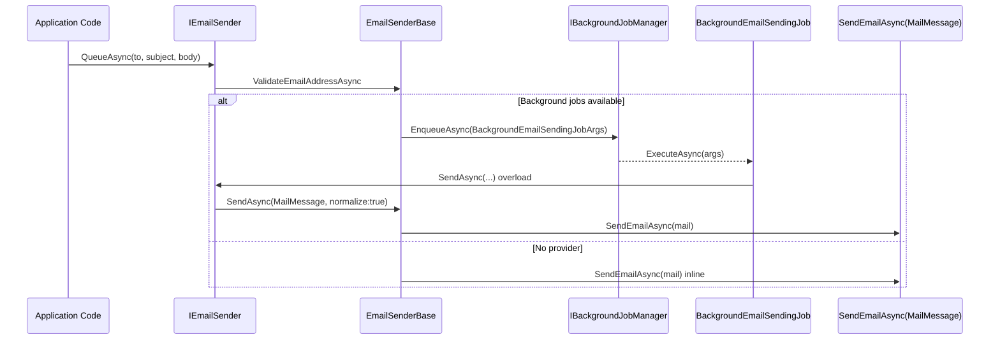

The ABP Framework `Volo.Abp.Emailing` module provides the standard mail abstraction that every other ABP package depends on when it needs to send a message: account confirmation, password reset, notifications, identity link tokens, and so on. The contract is a tiny `IEmailSender` declared at `framework/src/Volo.Abp.Emailing/Volo/Abp/Emailing/IEmailSender.cs`, and the default implementation is a `System.Net.Mail.SmtpClient`-based sender in `framework/src/Volo.Abp.Emailing/Volo/Abp/Emailing/Smtp/SmtpEmailSender.cs`. Replace the sender with MailKit, SendGrid, AWS SES or any other transport by swapping the registered service — the higher-level code keeps calling `IEmailSender`.

<Info>
The whole pipeline is built around `System.Net.Mail.MailMessage` so multi-recipient, CC, BCC, headers and attachments map 1:1 to the BCL types. The SMTP client is replaced by `MailKitSmtpEmailSender` if you depend on `AbpMailKitModule` — see the [MailKit](./mailkit) page.
</Info>

## Module wiring

`AbpEmailingModule` (`framework/src/Volo.Abp.Emailing/Volo/Abp/Emailing/AbpEmailingModule.cs`) depends on `AbpSettingsModule`, `AbpVirtualFileSystemModule`, `AbpBackgroundJobsAbstractionsModule`, `AbpLocalizationModule` and the (obsolete) `AbpTextTemplatingModule`. Its `ConfigureServices` performs three jobs:

1. Embeds the localization resources by calling `options.FileSets.AddEmbedded<AbpEmailingModule>()` on `AbpVirtualFileSystemOptions`.
2. Registers the `EmailingResource` (defined in `framework/src/Volo.Abp.Emailing/Volo/Abp/Emailing/Localization/EmailingResource.cs`) and binds the JSON localization folder `/Volo/Abp/Emailing/Localization`.
3. Adds `BackgroundEmailSendingJob` to `AbpBackgroundJobOptions.AddJob<BackgroundEmailSendingJob>()` so queued mail can be processed by any of the background job providers.

```csharp
[DependsOn(
    typeof(AbpSettingsModule),
    typeof(AbpVirtualFileSystemModule),
    typeof(AbpBackgroundJobsAbstractionsModule),
    typeof(AbpLocalizationModule),
    typeof(AbpTextTemplatingModule)
)]
public class AbpEmailingModule : AbpModule { ... }
```

## The `IEmailSender` contract

The public surface in `IEmailSender.cs` has five overloads, three sync‑style `SendAsync` and two `QueueAsync`:

```csharp
public interface IEmailSender
{
    Task SendAsync(string to, string? subject, string? body,
        bool isBodyHtml = true,
        AdditionalEmailSendingArgs? additionalEmailSendingArgs = null);

    Task SendAsync(string from, string to, string? subject, string? body,
        bool isBodyHtml = true,
        AdditionalEmailSendingArgs? additionalEmailSendingArgs = null);

    Task SendAsync(MailMessage mail, bool normalize = true);

    Task QueueAsync(string to, string subject, string body,
        bool isBodyHtml = true,
        AdditionalEmailSendingArgs? additionalEmailSendingArgs = null);

    Task QueueAsync(string from, string to, string subject, string body,
        bool isBodyHtml = true,
        AdditionalEmailSendingArgs? additionalEmailSendingArgs = null);
}
```

The `normalize` switch in the third overload triggers `EmailSenderBase.NormalizeMailAsync`, which falls back to a default `From` address read from settings and forces UTF‑8 on every encoding-bearing property of `MailMessage`.

### AdditionalEmailSendingArgs

The `AdditionalEmailSendingArgs` class in `framework/src/Volo.Abp.Emailing/Volo/Abp/Emailing/AdditionalEmailSendingArgs.cs` is a serializable payload carrying `CC`, `Attachments` and arbitrary `ExtraProperties` (from `Volo.Abp.Data`):

```csharp
[Serializable]
public class AdditionalEmailSendingArgs
{
    public List<string>? CC { get; set; }
    public List<EmailAttachment>? Attachments { get; set; }
    public ExtraPropertyDictionary? ExtraProperties { get; set; }
}
```

Attachments are represented by `EmailAttachment` (`Volo/Abp/Emailing/EmailAttachment.cs`) — a `Name` plus a `byte[] File` so they can survive JSON serialization to background job storage.

## EmailSenderBase

Every transport inherits from `EmailSenderBase` at `framework/src/Volo.Abp.Emailing/Volo/Abp/Emailing/EmailSenderBase.cs`. The class holds three protected dependencies — `ICurrentTenant`, `IEmailSenderConfiguration` and `IBackgroundJobManager` — and exposes one abstract method:

```csharp
protected abstract Task SendEmailAsync(MailMessage mail);
```

The string overloads call a `BuildMailMessage` helper that converts the args into a `MailMessage`, attaches `EmailAttachment` byte arrays as `System.Net.Mail.Attachment` streams and pushes any `AdditionalEmailSendingArgs.CC` entries into `MailMessage.CC`. The `MailMessage` overload then runs `NormalizeMailAsync(mail)` before delegating to `SendEmailAsync`.

`NormalizeMailAsync` sets `mail.From` from `IEmailSenderConfiguration.GetDefaultFromAddressAsync()` / `GetDefaultFromDisplayNameAsync()` if it is empty and assigns `Encoding.UTF8` to `HeadersEncoding`, `SubjectEncoding` and `BodyEncoding` when they are null. `ValidateEmailAddressAsync` reuses `MailAddressCollection` to reject invalid addresses before enqueueing background jobs.

## Background queue flow

`EmailSenderBase.QueueAsync` is tenant-aware. It validates the recipient, checks `IBackgroundJobManager.IsAvailable()` and either sends inline (if no provider is registered) or enqueues a `BackgroundEmailSendingJobArgs`:

```csharp
await BackgroundJobManager.EnqueueAsync(
    new BackgroundEmailSendingJobArgs
    {
        TenantId = CurrentTenant.Id,
        To = to,
        Subject = subject,
        Body = body,
        IsBodyHtml = isBodyHtml,
        AdditionalEmailSendingArgs = additionalEmailSendingArgs
    }
);
```

`BackgroundEmailSendingJobArgs` (`Volo/Abp/Emailing/BackgroundEmailSendingJobArgs.cs`) implements `IMultiTenant` so the background job runs under the original tenant context. `BackgroundEmailSendingJob` (`Volo/Abp/Emailing/BackgroundEmailSendingJob.cs`) is a `[ITransientDependency]` `AsyncBackgroundJob<BackgroundEmailSendingJobArgs>` whose `ExecuteAsync` chooses the `(from, to, …)` or `(to, …)` overload depending on whether `args.From` is set.



## Configuration: settings, not options

ABP avoids hardcoding SMTP host/port in `appsettings.json`. Instead it reads values from `ISettingProvider`, allowing tenants and per-user values to override defaults. The keys live in `EmailSettingNames` (`framework/src/Volo.Abp.Emailing/Volo/Abp/Emailing/EmailSettingNames.cs`):

| Constant | Setting key |
| --- | --- |
| `EmailSettingNames.DefaultFromAddress` | `Abp.Mailing.DefaultFromAddress` |
| `EmailSettingNames.DefaultFromDisplayName` | `Abp.Mailing.DefaultFromDisplayName` |
| `EmailSettingNames.Smtp.Host` | `Abp.Mailing.Smtp.Host` |
| `EmailSettingNames.Smtp.Port` | `Abp.Mailing.Smtp.Port` |
| `EmailSettingNames.Smtp.UserName` | `Abp.Mailing.Smtp.UserName` |
| `EmailSettingNames.Smtp.Password` | `Abp.Mailing.Smtp.Password` |
| `EmailSettingNames.Smtp.Domain` | `Abp.Mailing.Smtp.Domain` |
| `EmailSettingNames.Smtp.EnableSsl` | `Abp.Mailing.Smtp.EnableSsl` |
| `EmailSettingNames.Smtp.UseDefaultCredentials` | `Abp.Mailing.Smtp.UseDefaultCredentials` |

The defaults are declared in `EmailSettingProvider` (`Volo/Abp/Emailing/EmailSettingProvider.cs`). `Host` defaults to `"127.0.0.1"`, `Port` to `"25"`, `EnableSsl` to `"false"`, `UseDefaultCredentials` to `"true"`, `DefaultFromAddress` to `"noreply@abp.io"` and `DefaultFromDisplayName` to `"ABP application"`. The `Password` setting is declared with `isEncrypted: true` so it is stored encrypted by `Volo.Abp.Settings`.

### Configuration interfaces

`IEmailSenderConfiguration` (`Volo/Abp/Emailing/IEmailSenderConfiguration.cs`) only exposes `GetDefaultFromAddressAsync` and `GetDefaultFromDisplayNameAsync`. The abstract `EmailSenderConfiguration` (`Volo/Abp/Emailing/EmailSenderConfiguration.cs`) wraps `ISettingProvider` and adds a `GetNotEmptySettingValueAsync` helper that throws `AbpException` when a required setting is missing.

`ISmtpEmailSenderConfiguration` in `Volo/Abp/Emailing/Smtp/ISmtpEmailSenderConfiguration.cs` extends the base with `GetHostAsync`, `GetPortAsync`, `GetUserNameAsync`, `GetPasswordAsync`, `GetDomainAsync`, `GetEnableSslAsync` and `GetUseDefaultCredentialsAsync`. The default `SmtpEmailSenderConfiguration` (`Volo/Abp/Emailing/Smtp/SmtpEmailSenderConfiguration.cs`) is `[ITransientDependency]` and simply maps each method to the matching key, using `value.To<int>()` and `value.To<bool>()` extensions for numeric and boolean conversions.

## SMTP sender

`ISmtpEmailSender` (`Volo/Abp/Emailing/Smtp/ISmtpEmailSender.cs`) extends `IEmailSender` with a `BuildClientAsync()` method that returns a fully configured `System.Net.Mail.SmtpClient`. The default implementation is `SmtpEmailSender` (`Volo/Abp/Emailing/Smtp/SmtpEmailSender.cs`):

```csharp
public class SmtpEmailSender : EmailSenderBase, ISmtpEmailSender, ITransientDependency
{
    public async Task<SmtpClient> BuildClientAsync()
    {
        var host = await SmtpConfiguration.GetHostAsync();
        var port = await SmtpConfiguration.GetPortAsync();
        var smtpClient = new SmtpClient(host, port);
        // ... EnableSsl, UseDefaultCredentials, NetworkCredential setup
        return smtpClient;
    }

    protected async override Task SendEmailAsync(MailMessage mail)
    {
        using (var smtpClient = await BuildClientAsync())
        {
            Logger.LogWarning("We don't recommend SmtpClient ... Use MailKit instead.");
            await smtpClient.SendMailAsync(mail);
        }
    }
}
```

<Warning>
The `SmtpEmailSender` logs a warning on every send recommending MailKit because the BCL `SmtpClient` is officially discouraged for new code (DE0005). For production deployments, depend on `AbpMailKitModule` so the registration is overridden by `MailKitSmtpEmailSender`.
</Warning>

## Null sender for development

`NullEmailSender` at `framework/src/Volo.Abp.Emailing/Volo/Abp/Emailing/NullEmailSender.cs` extends `EmailSenderBase`. Its `SendEmailAsync` does not contact any server — it just logs `mail.To`, `mail.CC`, `mail.Subject` and `mail.Body` at Debug level, prefixed by a `USING NullEmailSender!` warning. Use it in tests or local environments where you do not want to spin up an SMTP server:

```csharp
context.Services.Replace(
    ServiceDescriptor.Transient<IEmailSender, NullEmailSender>()
);
```

## Localization resources

`EmailingResource` (`Volo/Abp/Emailing/Localization/EmailingResource.cs`) is the marker resource declared in `AbpEmailingModule`. The JSON files live under the embedded folder `/Volo/Abp/Emailing/Localization` and contain the setting display names referenced by `EmailSettingProvider` (`L("DisplayName:Abp.Mailing.Smtp.Host")` etc.). They are loaded by `AbpVirtualFileSystemOptions.FileSets.AddEmbedded<AbpEmailingModule>()`.

## Templates (legacy)

The folder `framework/src/Volo.Abp.Emailing/Volo/Abp/Emailing/Templates/` declares `StandardEmailTemplateDefinitionProvider` and `StandardEmailTemplates` constants. They register a standard layout under `AbpTextTemplatingModule`. The text-templating dependency is marked obsolete in the module file — newer ABP modules switched to `Volo.Abp.TextTemplating.Razor` and explicit layouts. The constants are still emitted because identity/account modules reference them.

## Recipes

### Sending a simple email

```csharp
public class WelcomeService : IDomainService
{
    private readonly IEmailSender _emailSender;

    public WelcomeService(IEmailSender emailSender) =>
        _emailSender = emailSender;

    public Task WelcomeAsync(string toAddress, string name) =>
        _emailSender.SendAsync(
            to: toAddress,
            subject: "Welcome",
            body: $"<h1>Hi {name}</h1><p>Thanks for signing up.</p>",
            isBodyHtml: true
        );
}
```

### Sending with attachments and CC

```csharp
var args = new AdditionalEmailSendingArgs
{
    CC = new List<string> { "ops@contoso.com" },
    Attachments = new List<EmailAttachment>
    {
        new EmailAttachment
        {
            Name  = "invoice-2024.pdf",
            File  = await File.ReadAllBytesAsync("invoice-2024.pdf")
        }
    }
};

await _emailSender.SendAsync(
    to: "customer@contoso.com",
    subject: "Your invoice",
    body: "<p>Please find your invoice attached.</p>",
    additionalEmailSendingArgs: args);
```

### Queueing through background jobs

```csharp
await _emailSender.QueueAsync(
    to: "user@contoso.com",
    subject: "Reset code",
    body: $"<p>Code: {code}</p>");
```

The call returns immediately. When the Hangfire / Quartz / RabbitMQ background provider is registered (see `Volo.Abp.BackgroundJobs.*`), the worker calls `BackgroundEmailSendingJob.ExecuteAsync` on the configured worker host, where `CurrentTenant` is rebuilt from `BackgroundEmailSendingJobArgs.TenantId`.

### Sending a fully-built `MailMessage`

```csharp
var mail = new MailMessage
{
    To       = { "ops@contoso.com" },
    Subject  = "Heartbeat",
    Body     = "OK",
    Priority = MailPriority.Low,
};
mail.Headers.Add("X-Source", "abp-app");
await _emailSender.SendAsync(mail);
```

Pass `normalize: false` if you populated `From` and the encodings yourself and do not want `NormalizeMailAsync` to overwrite them.

### Replacing the sender

```csharp
[DependsOn(typeof(AbpEmailingModule))]
public class MyMailModule : AbpModule
{
    public override void ConfigureServices(ServiceConfigurationContext ctx)
    {
        ctx.Services.Replace(
            ServiceDescriptor.Transient<IEmailSender, MyAwsSesSender>());
    }
}
```

The `MailKitSmtpEmailSender` in `framework/src/Volo.Abp.MailKit/Volo/Abp/MailKit/MailKitSmtpEmailSender.cs` uses `[Dependency(ServiceLifetime.Transient, ReplaceServices = true)]` to take over `IEmailSender` automatically when `AbpMailKitModule` is referenced; you can do the same in your custom module.

## Reference

| Type | File |
| --- | --- |
| `IEmailSender` | `framework/src/Volo.Abp.Emailing/Volo/Abp/Emailing/IEmailSender.cs` |
| `EmailSenderBase` | `framework/src/Volo.Abp.Emailing/Volo/Abp/Emailing/EmailSenderBase.cs` |
| `NullEmailSender` | `framework/src/Volo.Abp.Emailing/Volo/Abp/Emailing/NullEmailSender.cs` |
| `AdditionalEmailSendingArgs` | `framework/src/Volo.Abp.Emailing/Volo/Abp/Emailing/AdditionalEmailSendingArgs.cs` |
| `EmailAttachment` | `framework/src/Volo.Abp.Emailing/Volo/Abp/Emailing/EmailAttachment.cs` |
| `BackgroundEmailSendingJob` | `framework/src/Volo.Abp.Emailing/Volo/Abp/Emailing/BackgroundEmailSendingJob.cs` |
| `BackgroundEmailSendingJobArgs` | `framework/src/Volo.Abp.Emailing/Volo/Abp/Emailing/BackgroundEmailSendingJobArgs.cs` |
| `IEmailSenderConfiguration` / `EmailSenderConfiguration` | `framework/src/Volo.Abp.Emailing/Volo/Abp/Emailing/EmailSenderConfiguration.cs` |
| `ISmtpEmailSender` / `SmtpEmailSender` | `framework/src/Volo.Abp.Emailing/Volo/Abp/Emailing/Smtp/SmtpEmailSender.cs` |
| `ISmtpEmailSenderConfiguration` / `SmtpEmailSenderConfiguration` | `framework/src/Volo.Abp.Emailing/Volo/Abp/Emailing/Smtp/SmtpEmailSenderConfiguration.cs` |
| `EmailSettingNames` / `EmailSettingProvider` | `framework/src/Volo.Abp.Emailing/Volo/Abp/Emailing/EmailSettingNames.cs` |
| `AbpEmailingModule` | `framework/src/Volo.Abp.Emailing/Volo/Abp/Emailing/AbpEmailingModule.cs` |
