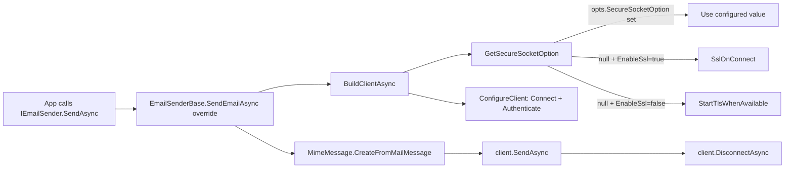

The ABP Framework `Volo.Abp.MailKit` package replaces the default `SmtpEmailSender` (which wraps the legacy `System.Net.Mail.SmtpClient`) with a [MailKit](https://github.com/jstedfast/MailKit)-based sender. MailKit supports modern protocols (`STARTTLS`, `SSL on connect`, OAuth, IPv6, IDN), is actively maintained and is the recommended SMTP client for production ABP apps — the `SmtpEmailSender` itself logs a warning on every send recommending you switch.

The whole module is only four C# files under `framework/src/Volo.Abp.MailKit/Volo/Abp/MailKit/`:

| File | Purpose |
| --- | --- |
| `AbpMailKitModule.cs` | Module class, depends on `AbpEmailingModule` |
| `AbpMailKitOptions.cs` | Options holding `SecureSocketOptions?` |
| `IMailKitSmtpEmailSender.cs` | MailKit-specific interface that adds `BuildClientAsync()` returning a MailKit `SmtpClient` |
| `MailKitSmtpEmailSender.cs` | `EmailSenderBase` subclass that replaces `IEmailSender` |

## Module

`AbpMailKitModule` (`framework/src/Volo.Abp.MailKit/Volo/Abp/MailKit/AbpMailKitModule.cs`) is intentionally minimal:

```csharp
[DependsOn(typeof(AbpEmailingModule))]
public class AbpMailKitModule : AbpModule
{
}
```

It does not register any options or services itself; all wiring happens through `[ITransientDependency]` and `[Dependency(ReplaceServices = true)]` attributes on the sender class. Add it to your module dependency chain and the SMTP-related part of `Volo.Abp.Emailing` will start using MailKit.

```csharp
[DependsOn(typeof(AbpMailKitModule))]
public class MyMailModule : AbpModule { }
```

## AbpMailKitOptions

`AbpMailKitOptions` (`framework/src/Volo.Abp.MailKit/Volo/Abp/MailKit/AbpMailKitOptions.cs`) exposes a single nullable property:

```csharp
public class AbpMailKitOptions
{
    public SecureSocketOption? SecureSocketOption { get; set; }
}
```

`SecureSocketOptions` is the MailKit enum from `MailKit.Security` with the following members:

- `None` — plain text
- `Auto` — let MailKit decide based on the port
- `SslOnConnect` — wrap the socket in SSL from the start (typically port 465)
- `StartTls` — open in plain text then upgrade with `STARTTLS` (typically port 587)
- `StartTlsWhenAvailable` — try `STARTTLS` but tolerate servers without it

When `AbpMailKitOptions.SecureSocketOption` is `null` (the default), `MailKitSmtpEmailSender` falls back to a setting-driven choice — see [Secure connection resolution](#secure-connection-resolution) below.

Configure the option in your module:

```csharp
Configure<AbpMailKitOptions>(opt =>
{
    opt.SecureSocketOption = SecureSocketOptions.StartTls;
});
```

## MailKitSmtpEmailSender

The sender lives at `framework/src/Volo.Abp.MailKit/Volo/Abp/MailKit/MailKitSmtpEmailSender.cs` and is the heart of the module. It is decorated with `[Dependency(ServiceLifetime.Transient, ReplaceServices = true)]` so it overrides every registration of `IEmailSender` and `IMailKitSmtpEmailSender` automatically:

```csharp
[Dependency(ServiceLifetime.Transient, ReplaceServices = true)]
public class MailKitSmtpEmailSender : EmailSenderBase, IMailKitSmtpEmailSender
{
    public MailKitSmtpEmailSender(
        ICurrentTenant currentTenant,
        ISmtpEmailSenderConfiguration smtpConfiguration,
        IBackgroundJobManager backgroundJobManager,
        IOptions<AbpMailKitOptions> abpMailKitConfiguration)
        : base(currentTenant, smtpConfiguration, backgroundJobManager) { ... }
}
```

It depends on `ISmtpEmailSenderConfiguration` from `framework/src/Volo.Abp.Emailing/Volo/Abp/Emailing/Smtp/ISmtpEmailSenderConfiguration.cs`, so it reads the same `Abp.Mailing.Smtp.*` settings (`Host`, `Port`, `UserName`, `Password`, `EnableSsl`, `UseDefaultCredentials`) defined by `EmailSettingProvider` — see the [Emailing](./emailing) page.

### SendEmailAsync

The override of `EmailSenderBase.SendEmailAsync` converts the BCL `MailMessage` to a `MimeMessage` via MailKit's helper, assigns a fresh `Message-Id` and sends:

```csharp
protected async override Task SendEmailAsync(MailMessage mail)
{
    using (var client = await BuildClientAsync())
    {
        var message = MimeMessage.CreateFromMailMessage(mail);
        message.MessageId = MimeUtils.GenerateMessageId();
        await client.SendAsync(message);
        await client.DisconnectAsync(true);
    }
}
```

`MimeMessage.CreateFromMailMessage` preserves headers, encodings, alternative views, attachments and CC/BCC, so the higher level `EmailSenderBase.BuildMailMessage` logic continues to work exactly the same way.

`MimeUtils.GenerateMessageId()` adds a globally unique `Message-Id` header — many SMTP relays will rewrite the BCL `SmtpClient`'s default empty header which causes some recipients to reject the message.

### BuildClientAsync

`IMailKitSmtpEmailSender` (`framework/src/Volo.Abp.MailKit/Volo/Abp/MailKit/IMailKitSmtpEmailSender.cs`) is the MailKit-specific extension of `IEmailSender`:

```csharp
public interface IMailKitSmtpEmailSender : IEmailSender
{
    Task<SmtpClient> BuildClientAsync();
}
```

The implementation wraps the MailKit `SmtpClient`, calling the protected `ConfigureClient` and disposing the client if anything throws during configuration:

```csharp
public async Task<SmtpClient> BuildClientAsync()
{
    var client = new SmtpClient();
    try
    {
        await ConfigureClient(client);
        return client;
    }
    catch
    {
        client.Dispose();
        throw;
    }
}
```

### ConfigureClient

`ConfigureClient` connects the MailKit client using the host, port and secure-socket choice and authenticates only when `UseDefaultCredentials` is `false`:

```csharp
protected virtual async Task ConfigureClient(SmtpClient client)
{
    await client.ConnectAsync(
        await SmtpConfiguration.GetHostAsync(),
        await SmtpConfiguration.GetPortAsync(),
        await GetSecureSocketOption()
    );

    if (await SmtpConfiguration.GetUseDefaultCredentialsAsync())
    {
        return;
    }

    await client.AuthenticateAsync(
        await SmtpConfiguration.GetUserNameAsync(),
        await SmtpConfiguration.GetPasswordAsync()
    );
}
```

Override `ConfigureClient` if you need to register an OAuth `SaslMechanism`, change timeouts or attach a `ProtocolLogger`.

### Secure connection resolution

`GetSecureSocketOption` chooses the secure mode in two steps. The configured `AbpMailKitOptions.SecureSocketOption` wins; otherwise it falls back to the boolean `Abp.Mailing.Smtp.EnableSsl` setting:

```csharp
protected virtual async Task<SecureSocketOptions> GetSecureSocketOption()
{
    if (AbpMailKitOptions.SecureSocketOption.HasValue)
        return AbpMailKitOptions.SecureSocketOption.Value;

    return await SmtpConfiguration.GetEnableSslAsync()
        ? SecureSocketOptions.SslOnConnect
        : SecureSocketOptions.StartTlsWhenAvailable;
}
```

Meaning:

- `EnableSsl = true` → `SslOnConnect` (use port 465)
- `EnableSsl = false` → `StartTlsWhenAvailable` (port 587 or 25 with optional STARTTLS upgrade)
- Explicit `SecureSocketOption` configured → use that value unconditionally



## Setup recipe

1. Reference `Volo.Abp.MailKit`.
2. Depend on `AbpMailKitModule`.
3. Configure `Abp.Mailing.Smtp.*` settings (either through the management UI module or via a `SettingDefinitionProvider`).
4. Optionally tweak `AbpMailKitOptions.SecureSocketOption`.

```csharp
[DependsOn(typeof(AbpMailKitModule))]
public class MyAppModule : AbpModule
{
    public override void ConfigureServices(ServiceConfigurationContext ctx)
    {
        Configure<AbpMailKitOptions>(opt =>
        {
            // Force STARTTLS regardless of the EnableSsl setting
            opt.SecureSocketOption = SecureSocketOptions.StartTls;
        });
    }
}
```

Because `[Dependency(ReplaceServices = true)]` is applied on `MailKitSmtpEmailSender`, any existing registration of `IEmailSender` or `ISmtpEmailSender` from `AbpEmailingModule` is overridden — application code keeps depending on the abstract `IEmailSender` without further changes.

<Tip>
You can still inject `IMailKitSmtpEmailSender` (the derived interface) to gain access to `BuildClientAsync()` and grab the underlying MailKit `SmtpClient` for advanced scenarios — for example sending a digitally signed S/MIME message you constructed yourself.
</Tip>

## Inspecting the SMTP exchange

To capture the wire protocol during troubleshooting, override `ConfigureClient` and attach a `ProtocolLogger`:

```csharp
public class LoggingMailKitSender : MailKitSmtpEmailSender
{
    public LoggingMailKitSender(
        ICurrentTenant currentTenant,
        ISmtpEmailSenderConfiguration cfg,
        IBackgroundJobManager bg,
        IOptions<AbpMailKitOptions> mk)
        : base(currentTenant, cfg, bg, mk) { }

    protected override async Task ConfigureClient(SmtpClient client)
    {
        // Note: client is constructed in BuildClientAsync; we can't
        // wrap it in a ProtocolLogger from here. Override BuildClientAsync
        // instead if you need a logger from the very first byte.
        await base.ConfigureClient(client);
    }
}
```

For a full protocol log, override `BuildClientAsync` and construct `new SmtpClient(new ProtocolLogger("smtp.log"))` before delegating to `ConfigureClient`.

## Authentication strategies

`MailKitSmtpEmailSender.ConfigureClient` uses simple username/password authentication. For OAuth2 / XOAUTH2 (Microsoft 365, Gmail) override `ConfigureClient` and use `client.AuthenticateAsync(new SaslMechanismOAuth2(userName, accessToken))`. Because the original method is `virtual` no extra DI plumbing is required:

```csharp
protected override async Task ConfigureClient(SmtpClient client)
{
    await client.ConnectAsync(
        await SmtpConfiguration.GetHostAsync(),
        await SmtpConfiguration.GetPortAsync(),
        await GetSecureSocketOption());

    var accessToken = await _tokenProvider.GetAsync(); // your code
    await client.AuthenticateAsync(
        new SaslMechanismOAuth2(
            await SmtpConfiguration.GetUserNameAsync(),
            accessToken));
}
```

Then replace `MailKitSmtpEmailSender` with your subclass via `ctx.Services.Replace(...)` or the `[Dependency(ReplaceServices = true)]` attribute.

## Interaction with background jobs

The MailKit sender does not change the queueing logic. `EmailSenderBase.QueueAsync` still enqueues `BackgroundEmailSendingJobArgs` and `BackgroundEmailSendingJob` resolves `IEmailSender` from DI inside the worker, where it gets the MailKit-based sender. The end-to-end flow is identical to the diagram in the [Emailing](./emailing) page; the only difference is that `SendEmailAsync` opens a MailKit SMTP connection per message.

## Comparison with the default sender

| Concern | `SmtpEmailSender` (`Volo.Abp.Emailing`) | `MailKitSmtpEmailSender` (`Volo.Abp.MailKit`) |
| --- | --- | --- |
| Underlying client | `System.Net.Mail.SmtpClient` (DE0005 obsolete) | MailKit `SmtpClient` |
| TLS modes | `EnableSsl` only | `SecureSocketOptions` (None / Auto / SslOnConnect / StartTls / StartTlsWhenAvailable) |
| OAuth / SASL | Not supported | Supported via `SaslMechanism` |
| Modern protocols | Limited | Full IMAP / SMTP / DSN support |
| Message-Id generation | BCL default (often empty) | `MimeUtils.GenerateMessageId()` |
| Settings interface | `ISmtpEmailSenderConfiguration` | `ISmtpEmailSenderConfiguration` (shared) |
| DI registration | `[ITransientDependency]` | `[Dependency(ServiceLifetime.Transient, ReplaceServices = true)]` |

## Reference

| Type | File |
| --- | --- |
| `AbpMailKitModule` | `framework/src/Volo.Abp.MailKit/Volo/Abp/MailKit/AbpMailKitModule.cs` |
| `AbpMailKitOptions` | `framework/src/Volo.Abp.MailKit/Volo/Abp/MailKit/AbpMailKitOptions.cs` |
| `IMailKitSmtpEmailSender` | `framework/src/Volo.Abp.MailKit/Volo/Abp/MailKit/IMailKitSmtpEmailSender.cs` |
| `MailKitSmtpEmailSender` | `framework/src/Volo.Abp.MailKit/Volo/Abp/MailKit/MailKitSmtpEmailSender.cs` |
