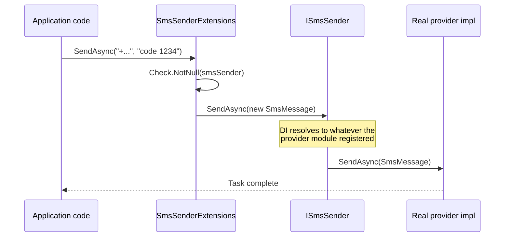

The ABP Framework `Volo.Abp.Sms` package is the single contract every SMS provider plugs into. It is intentionally small — only five C# files under `framework/src/Volo.Abp.Sms/Volo/Abp/Sms/` — because the wire details (regions, app IDs, signed templates) are wildly different between providers. The abstraction stays minimal so the higher level identity / two-factor / notification modules can call a single method without knowing whether the call lands at Aliyun, Tencent Cloud, Twilio or a no-op logger.

## Package layout

| File | Purpose |
| --- | --- |
| `AbpSmsModule.cs` | Module class (no service registrations of its own) |
| `ISmsSender.cs` | The single-method abstraction the rest of ABP depends on |
| `SmsMessage.cs` | DTO carrying phone number, text body and provider-specific properties |
| `NullSmsSender.cs` | Logging-only fallback registered with `TryRegister = true` |
| `SmsSenderExtensions.cs` | `Task SendAsync(this ISmsSender, string phoneNumber, string text)` shortcut |

## AbpSmsModule

`AbpSmsModule` (`framework/src/Volo.Abp.Sms/Volo/Abp/Sms/AbpSmsModule.cs`) has an empty body:

```csharp
namespace Volo.Abp.Sms;

public class AbpSmsModule : AbpModule
{
}
```

It does not depend on any other module. All the work is done by the `[Dependency(TryRegister = true)] ISingletonDependency` attribute on `NullSmsSender` and by `[ITransientDependency]` on the concrete providers (`AliyunSmsSender`, `TencentCloudSmsSender`, etc.). Adding `AbpSmsModule` to your dependency graph registers the null sender; adding `AbpSmsAliyunModule` or `AbpSmsTencentCloudModule` on top overrides it with the real implementation.

## ISmsSender

The interface lives at `framework/src/Volo.Abp.Sms/Volo/Abp/Sms/ISmsSender.cs`:

```csharp
public interface ISmsSender
{
    Task SendAsync(SmsMessage smsMessage);
}
```

The single-method shape is deliberate. ABP does not try to model "subject", "from", "attachment" or other email-like fields because SMS providers do not consistently offer them. Anything provider-specific must be passed via `SmsMessage.Properties`.

## SmsMessage

`SmsMessage` (`framework/src/Volo.Abp.Sms/Volo/Abp/Sms/SmsMessage.cs`) is an immutable payload:

```csharp
public class SmsMessage
{
    public string PhoneNumber { get; }
    public string Text { get; }
    public IDictionary<string, object> Properties { get; }

    public SmsMessage([NotNull] string phoneNumber, [NotNull] string text)
    {
        PhoneNumber = Check.NotNullOrWhiteSpace(phoneNumber, nameof(phoneNumber));
        Text        = Check.NotNullOrWhiteSpace(text, nameof(text));
        Properties  = new Dictionary<string, object>();
    }
}
```

- `PhoneNumber` is the E.164 destination address (e.g. `+8613800138000`); validated with `Check.NotNullOrWhiteSpace` from `framework/src/Volo.Abp.Core/Volo/Abp/Check.cs`.
- `Text` is the plain message body. Providers that require a templated message often interpret this string as the JSON-encoded template parameters — see how `AliyunSmsSender` and `TencentCloudSmsSender` map it.
- `Properties` is a free-form dictionary used to pass provider-specific keys like `SignName`, `TemplateCode` (Aliyun) or `TemplateId` (Tencent Cloud) without polluting the abstraction.

`Check.NotNullOrWhiteSpace` from `Volo.Abp.Core` throws `AbpException` (with the parameter name) when an empty string slips in, ensuring senders never even call the upstream provider with a blank number or empty body.

## NullSmsSender

The null sender at `framework/src/Volo.Abp.Sms/Volo/Abp/Sms/NullSmsSender.cs` is registered conditionally so the real provider can claim the role:

```csharp
[Dependency(TryRegister = true)]
public class NullSmsSender : ISmsSender, ISingletonDependency
{
    public ILogger<NullSmsSender> Logger { get; set; }
        = NullLogger<NullSmsSender>.Instance;

    public Task SendAsync(SmsMessage smsMessage)
    {
        Logger.LogWarning($"SMS Sending was not implemented! Using {nameof(NullSmsSender)}:");
        Logger.LogWarning("Phone Number : " + smsMessage.PhoneNumber);
        Logger.LogWarning("SMS Text     : " + smsMessage.Text);
        return Task.CompletedTask;
    }
}
```

`TryRegister = true` is the critical detail: it asks the dependency injection container to skip the registration if any other implementation of `ISmsSender` is already present. As a result, you can depend on `AbpSmsModule` directly in tests (which gives you a logging-only sender) and on `AbpSmsAliyunModule` in production, with no `Replace` calls.

`NullSmsSender` is `ISingletonDependency` so the same instance is reused for every send; this is fine because the logger field is the only state.

<Warning>
`NullSmsSender.SendAsync` logs the full message body at Warning level. In production, do not rely on a missing provider configuration — verify in your bootstrap path that `IServiceProvider.GetService<ISmsSender>()` returns a real implementation, not the null sender.
</Warning>

## SmsSenderExtensions

The extension class at `framework/src/Volo.Abp.Sms/Volo/Abp/Sms/SmsSenderExtensions.cs` is a one-liner that lets callers skip the `new SmsMessage(...)` boilerplate for simple sends:

```csharp
public static class SmsSenderExtensions
{
    public static Task SendAsync(
        [NotNull] this ISmsSender smsSender,
        [NotNull] string phoneNumber,
        [NotNull] string text)
    {
        Check.NotNull(smsSender, nameof(smsSender));
        return smsSender.SendAsync(new SmsMessage(phoneNumber, text));
    }
}
```

Use this overload when you have no provider-specific properties to pass; otherwise create an `SmsMessage`, set `Properties["SignName"]` / `Properties["TemplateCode"]` / `Properties["TemplateId"]` and call `ISmsSender.SendAsync(message)` directly.

## End-to-end flow



If only `AbpSmsModule` is referenced, the arrow into "Real provider impl" lands on `NullSmsSender` and only a warning is logged.

## Recipes

### Sending a one-shot OTP

```csharp
public class OtpService : IDomainService
{
    private readonly ISmsSender _smsSender;
    public OtpService(ISmsSender smsSender) => _smsSender = smsSender;

    public Task SendCodeAsync(string phoneNumber, string code) =>
        _smsSender.SendAsync(phoneNumber, $"Your verification code is {code}");
}
```

This uses the `SmsSenderExtensions` shortcut. The body is the literal text passed to the underlying provider. With `AliyunSmsSender` you would instead construct a templated request:

```csharp
var message = new SmsMessage(phoneNumber, JsonSerializer.Serialize(new { code }));
message.Properties["SignName"]     = "MyCompany";
message.Properties["TemplateCode"] = "SMS_123456789";
await _smsSender.SendAsync(message);
```

The same `ISmsSender` interface, but different `Properties` and a JSON-encoded `Text` body.

### Replacing the sender

For local development you might want to forward messages to a Slack channel rather than the actual provider:

```csharp
public class SlackSmsSender : ISmsSender, ISingletonDependency
{
    private readonly ISlackClient _slack;
    public SlackSmsSender(ISlackClient slack) => _slack = slack;

    public Task SendAsync(SmsMessage smsMessage) =>
        _slack.PostAsync("#sms-debug",
            $"SMS to {smsMessage.PhoneNumber}: {smsMessage.Text}");
}
```

Because `NullSmsSender` uses `[Dependency(TryRegister = true)]`, any additional `ISmsSender` registration takes precedence — adding a class with `ISingletonDependency` is enough; you do not need an explicit `Replace`.

### Multi-tenant scenarios

Multi-tenancy is not built into `AbpSmsModule`. Concrete providers (such as `AliyunSmsSender` / `TencentCloudSmsSender`) read their credentials from `IOptionsMonitor<TOptions>` and `IOptionsMonitor` re-evaluates on each access, so combining ABP's `ITenantConfigurationProvider` with a custom `IConfigureOptions<AbpAliyunSmsOptions>` lets you swap credentials per tenant. The abstraction layer remains tenant-agnostic.

## Where ABP itself uses `ISmsSender`

`ISmsSender` is used by the higher level modules under `modules/`:

- `Volo.Abp.Identity` — two-factor token delivery
- `Volo.Abp.Account` — phone confirmation
- `Volo.Abp.Notifications` — SMS notification provider

All of them resolve `ISmsSender` from DI; they do not know anything about Aliyun or Tencent Cloud. Switch the provider at the composition root and every consumer changes behavior at once.

## Composition rules

1. `AbpSmsModule` is automatically referenced by `AbpSmsAliyunModule` and `AbpSmsTencentCloudModule` (see their `[DependsOn(typeof(AbpSmsModule))]` attributes in `framework/src/Volo.Abp.Sms.Aliyun/Volo/Abp/Sms/Aliyun/AbpSmsAliyunModule.cs` and `framework/src/Volo.Abp.Sms.TencentCloud/Volo/Abp/Sms/TencentCloud/AbpSmsTencentCloudModule.cs`), so you never reference `AbpSmsModule` directly in production — you reference one of the concrete providers.
2. Only one provider should win. Because both providers register their sender with `[ITransientDependency]` (not `TryRegister`), referencing both `AbpSmsAliyunModule` and `AbpSmsTencentCloudModule` in the same module results in the last `IServiceCollection` registration winning. Pick one or write a router yourself.
3. If you need to send through different providers depending on the recipient's region, write a router that internally resolves multiple concrete senders by injecting them directly (`AliyunSmsSender` / `TencentCloudSmsSender` are concrete classes so DI can resolve each independently).

```csharp
public class RoutingSmsSender : ISmsSender, ITransientDependency
{
    private readonly AliyunSmsSender   _aliyun;
    private readonly TencentCloudSmsSender _tencent;

    public RoutingSmsSender(AliyunSmsSender aliyun, TencentCloudSmsSender tencent)
    { _aliyun = aliyun; _tencent = tencent; }

    public Task SendAsync(SmsMessage smsMessage) =>
        smsMessage.PhoneNumber.StartsWith("+86")
            ? _aliyun.SendAsync(smsMessage)
            : _tencent.SendAsync(smsMessage);
}
```

Register this class with `ISingletonDependency` or `ITransientDependency` and it overrides `NullSmsSender` automatically.

## Reference

| Type | File |
| --- | --- |
| `AbpSmsModule` | `framework/src/Volo.Abp.Sms/Volo/Abp/Sms/AbpSmsModule.cs` |
| `ISmsSender` | `framework/src/Volo.Abp.Sms/Volo/Abp/Sms/ISmsSender.cs` |
| `SmsMessage` | `framework/src/Volo.Abp.Sms/Volo/Abp/Sms/SmsMessage.cs` |
| `NullSmsSender` | `framework/src/Volo.Abp.Sms/Volo/Abp/Sms/NullSmsSender.cs` |
| `SmsSenderExtensions` | `framework/src/Volo.Abp.Sms/Volo/Abp/Sms/SmsSenderExtensions.cs` |
